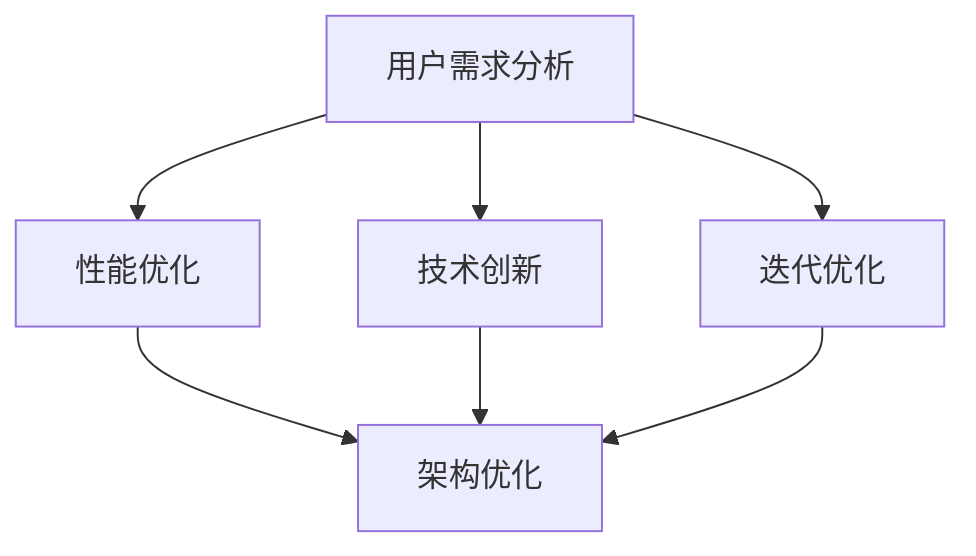

                 

# AI创业：产品改进方法

> **关键词：** AI产品开发、用户体验、迭代优化、性能提升、技术创新

> **摘要：** 本文章旨在探讨AI创业公司在产品改进方面的策略和方法。通过深入分析用户体验、性能优化、技术创新等方面，文章将提供一系列实用技巧和策略，帮助企业快速提升产品竞争力。

## 1. 背景介绍

### 1.1 目的和范围

本文将围绕AI创业公司产品改进展开讨论，旨在帮助创业团队在激烈的市场竞争中迅速提升产品竞争力。文章将涵盖以下几个方面：

- 用户体验分析：从用户需求出发，探讨如何通过改进用户体验来提升产品吸引力。
- 性能优化：详细介绍如何在硬件和软件层面进行优化，提高产品性能。
- 技术创新：分析如何在现有技术基础上进行创新，实现产品差异化。
- 迭代优化：讨论如何在产品迭代过程中不断优化，保持竞争力。

### 1.2 预期读者

本文适合以下读者群体：

- AI创业公司创始人、产品经理和团队
- 技术专家和工程师，对AI产品开发有兴趣
- 对AI产品改进有需求的企业和管理者

### 1.3 文档结构概述

本文分为以下几部分：

- 第1部分：背景介绍，包括目的和范围、预期读者以及文档结构概述。
- 第2部分：核心概念与联系，介绍产品改进的相关概念和架构。
- 第3部分：核心算法原理与具体操作步骤，详细阐述产品改进的方法和策略。
- 第4部分：数学模型和公式，解释与产品改进相关的数学原理。
- 第5部分：项目实战，提供实际案例和详细解释说明。
- 第6部分：实际应用场景，探讨产品改进在各个领域的应用。
- 第7部分：工具和资源推荐，介绍与产品改进相关的学习资源和工具。
- 第8部分：总结，展望产品改进的未来发展趋势与挑战。
- 第9部分：附录，包括常见问题与解答。
- 第10部分：扩展阅读和参考资料，推荐相关文献和资源。

### 1.4 术语表

#### 1.4.1 核心术语定义

- **AI创业公司**：指以人工智能技术为核心，致力于开发创新产品的初创企业。
- **用户体验**：指用户在使用产品过程中所获得的感受和体验。
- **性能优化**：通过改进硬件和软件性能，提高产品运行效率和效果。
- **迭代优化**：在产品开发过程中，不断进行改进和优化，以满足用户需求。

#### 1.4.2 相关概念解释

- **产品改进**：指通过分析用户需求和市场环境，对现有产品进行优化和改进，以提高产品竞争力。
- **技术创新**：通过引入新的技术或改进现有技术，实现产品差异化和竞争力提升。

#### 1.4.3 缩略词列表

- **AI**：人工智能
- **UX**：用户体验
- **UI**：用户界面
- **SDK**：软件开发工具包

## 2. 核心概念与联系

在产品改进过程中，需要了解以下几个核心概念及其相互联系：

### 2.1 用户需求分析

用户需求分析是产品改进的基础。通过了解用户需求，我们可以明确产品的改进方向和目标。以下是一个简单的用户需求分析流程：

1. **市场调研**：收集和分析市场数据，了解竞争对手和用户需求。
2. **用户访谈**：与目标用户进行访谈，了解他们的使用场景、痛点和期望。
3. **用户画像**：根据用户数据，创建用户画像，以便更好地了解用户需求。

### 2.2 性能优化

性能优化是提升产品竞争力的重要手段。以下是一个简单的性能优化流程：

1. **性能测试**：对产品进行性能测试，识别性能瓶颈。
2. **问题定位**：分析性能瓶颈的原因，定位问题所在。
3. **优化方案**：根据问题定位，提出优化方案，包括硬件和软件层面的改进。

### 2.3 技术创新

技术创新是产品改进的关键。以下是一个简单的技术创新流程：

1. **技术调研**：了解行业内的最新技术动态和趋势。
2. **技术评估**：评估新技术对产品的潜在影响和价值。
3. **技术实施**：将评估通过的新技术应用到产品中。

### 2.4 迭代优化

迭代优化是产品改进的核心。以下是一个简单的迭代优化流程：

1. **版本规划**：根据产品改进需求，制定版本规划和迭代计划。
2. **功能优化**：对现有功能进行优化，提高用户体验。
3. **性能提升**：在迭代过程中，持续进行性能优化，提高产品性能。

### 2.5 架构优化

架构优化是产品改进的重要环节。以下是一个简单的架构优化流程：

1. **架构评估**：评估现有架构的优缺点，确定优化方向。
2. **架构重构**：根据评估结果，对现有架构进行重构。
3. **性能测试**：对重构后的架构进行性能测试，确保优化效果。

### 2.6 Mermaid流程图

以下是一个简单的Mermaid流程图，展示产品改进的相关流程：



## 3. 核心算法原理 & 具体操作步骤

### 3.1 用户需求分析

用户需求分析的核心在于理解用户行为和需求，以便为产品改进提供方向。以下是一种基于用户行为数据分析的方法：

#### 3.1.1 数据收集

1. **日志数据**：收集产品使用日志，包括用户操作、页面访问、功能使用等信息。
2. **问卷调查**：设计问卷调查，收集用户对产品的评价和需求。
3. **用户访谈**：与目标用户进行访谈，了解他们的使用场景、痛点和期望。

#### 3.1.2 数据处理

1. **数据清洗**：去除无效数据和重复数据，保证数据质量。
2. **数据统计**：对数据进行统计分析，提取用户行为特征和需求。
3. **用户画像**：根据数据特征，创建用户画像，以便更好地了解用户需求。

#### 3.1.3 需求分析

1. **需求分类**：将用户需求进行分类，包括功能需求、性能需求、用户体验需求等。
2. **优先级排序**：根据需求的重要性和紧急程度，对需求进行优先级排序。
3. **需求实现**：根据优先级排序，确定需求实现方案和资源分配。

### 3.2 性能优化

性能优化旨在提高产品运行效率和效果。以下是一种基于性能测试和优化的方法：

#### 3.2.1 性能测试

1. **负载测试**：模拟用户访问负载，测试产品性能。
2. **压力测试**：测试产品在高负载下的稳定性和响应速度。
3. **性能分析**：分析测试结果，识别性能瓶颈。

#### 3.2.2 优化方案

1. **硬件优化**：升级硬件设备，提高计算能力和存储容量。
2. **软件优化**：优化代码和算法，提高运行效率。
3. **缓存优化**：使用缓存技术，减少数据访问延迟。

#### 3.2.3 性能提升

1. **监控和反馈**：建立性能监控体系，实时跟踪性能变化，及时发现问题。
2. **持续优化**：根据监控结果和用户反馈，持续进行性能优化。
3. **自动化测试**：建立自动化性能测试，确保优化效果。

### 3.3 技术创新

技术创新是产品改进的核心。以下是一种基于技术调研和创新的方法：

#### 3.3.1 技术调研

1. **行业趋势**：了解行业内的最新技术动态和趋势。
2. **技术评估**：评估新技术对产品的潜在影响和价值。
3. **竞品分析**：分析竞品采用的技术和优势。

#### 3.3.2 技术创新

1. **技术研发**：开展技术研发，探索新的技术和解决方案。
2. **试点应用**：在产品中试点应用新技术，验证其可行性和效果。
3. **持续改进**：根据试点应用结果，持续优化和改进新技术。

### 3.4 迭代优化

迭代优化是产品改进的关键。以下是一种基于迭代优化和性能提升的方法：

#### 3.4.1 版本规划

1. **需求分析**：确定每个版本的改进需求，制定版本规划和迭代计划。
2. **资源分配**：根据版本规划，分配人力、物力和财力资源。
3. **版本发布**：按照规划，发布每个版本的改进内容。

#### 3.4.2 功能优化

1. **用户反馈**：收集用户对产品的反馈和建议。
2. **需求分析**：根据用户反馈，确定功能优化需求。
3. **功能实现**：开发团队根据需求分析，实现功能优化。

#### 3.4.3 性能提升

1. **性能测试**：对优化后的功能进行性能测试，确保性能提升。
2. **监控和反馈**：建立性能监控体系，实时跟踪性能变化，及时发现问题。
3. **持续优化**：根据监控结果和用户反馈，持续进行性能优化。

### 3.5 算法原理和伪代码

以下是一个简单的基于K-Means算法的用户需求分析示例：

```python
# K-Means算法伪代码

def k_means(data, k):
    # 初始化k个中心点
    centers = initialize_centers(data, k)
    
    # 循环迭代，直到中心点不再发生变化
    while True:
        # 为每个数据点分配最近的中心点
        clusters = assign_clusters(data, centers)
        
        # 计算新的中心点
        new_centers = calculate_new_centers(data, clusters)
        
        # 判断中心点是否发生变化
        if abs(new_centers - centers) < threshold:
            break
        
        # 更新中心点
        centers = new_centers
    
    return clusters, centers

# 数据初始化
data = [x1, x2, ..., xn]

# 设定K值
k = 3

# 运行K-Means算法
clusters, centers = k_means(data, k)

# 输出结果
print("Cluster centers:", centers)
print("Cluster assignments:", clusters)
```

## 4. 数学模型和公式 & 详细讲解 & 举例说明

在产品改进过程中，数学模型和公式发挥着重要作用。以下是一些常见的数学模型和公式，以及它们的详细讲解和举例说明：

### 4.1 平均绝对误差（MAE）

平均绝对误差（MAE）是一种衡量预测值与真实值之间差异的指标。其公式如下：

$$ MAE = \frac{1}{n} \sum_{i=1}^{n} |y_i - \hat{y}_i| $$

其中，$y_i$ 为真实值，$\hat{y}_i$ 为预测值，$n$ 为数据点的数量。

#### 举例说明：

假设我们有一个数据集，包含5个数据点的真实值和预测值：

$$
\begin{aligned}
y_1 &= 2.5, & \hat{y}_1 &= 2.3 \\
y_2 &= 3.1, & \hat{y}_2 &= 3.0 \\
y_3 &= 2.8, & \hat{y}_3 &= 2.9 \\
y_4 &= 3.4, & \hat{y}_4 &= 3.6 \\
y_5 &= 2.9, & \hat{y}_5 &= 2.7 \\
\end{aligned}
$$

计算MAE：

$$
MAE = \frac{1}{5} \sum_{i=1}^{5} |y_i - \hat{y}_i| = \frac{1}{5} (0.2 + 0.1 + 0.1 + 0.2 + 0.2) = 0.14
$$

### 4.2 相关系数（Correlation Coefficient）

相关系数是一种衡量两个变量之间线性相关程度的指标。其公式如下：

$$ r = \frac{\sum_{i=1}^{n}(x_i - \bar{x})(y_i - \bar{y})}{\sqrt{\sum_{i=1}^{n}(x_i - \bar{x})^2} \sqrt{\sum_{i=1}^{n}(y_i - \bar{y})^2}} $$

其中，$x_i$ 和 $y_i$ 分别为两个变量的观测值，$\bar{x}$ 和 $\bar{y}$ 分别为两个变量的平均值，$n$ 为数据点的数量。

#### 举例说明：

假设我们有一个数据集，包含两个变量 $x$ 和 $y$ 的观测值：

$$
\begin{aligned}
x_1 &= 1, & y_1 &= 2 \\
x_2 &= 2, & y_2 &= 3 \\
x_3 &= 3, & y_3 &= 4 \\
x_4 &= 4, & y_4 &= 5 \\
x_5 &= 5, & y_5 &= 6 \\
\end{aligned}
$$

计算相关系数：

$$
\begin{aligned}
\bar{x} &= \frac{1+2+3+4+5}{5} = 3 \\
\bar{y} &= \frac{2+3+4+5+6}{5} = 4 \\
r &= \frac{(1-3)(2-4) + (2-3)(3-4) + (3-3)(4-4) + (4-3)(5-4) + (5-3)(6-4)}{\sqrt{(1-3)^2 + (2-3)^2 + (3-3)^2 + (4-3)^2 + (5-3)^2} \sqrt{(2-4)^2 + (3-4)^2 + (4-4)^2 + (5-4)^2 + (6-4)^2}} \\
&= \frac{-2-1+0+1+4}{\sqrt{4+1+0+1+4} \sqrt{4+1+0+1+4}} \\
&= \frac{2}{2\sqrt{10}} \\
&= \frac{1}{\sqrt{10}} \\
&\approx 0.316
\end{aligned}
$$

### 4.3 决策树（Decision Tree）

决策树是一种常用的分类和回归算法。其基本原理是通过一系列特征划分数据集，最终得到一个分类或回归结果。以下是一个简单的决策树公式：

$$
\begin{aligned}
\text{预测} &= \text{根节点} \\
&\rightarrow \text{特征A} \\
&\rightarrow \text{子节点1} \\
&\rightarrow \text{子节点2} \\
&\rightarrow \ldots \\
&\rightarrow \text{叶子节点} \\
\end{aligned}
$$

其中，根节点表示整个数据集，特征A表示划分特征，子节点1、子节点2等表示划分结果，叶子节点表示分类或回归结果。

#### 举例说明：

假设我们有一个数据集，包含两个特征 $x_1$ 和 $x_2$，需要对其进行分类。以下是一个简单的决策树示例：

$$
\begin{aligned}
\text{根节点} &= \text{整个数据集} \\
&\rightarrow \text{特征}x_1 \\
&\rightarrow \text{子节点1} & (\text{如果}x_1 \leq 3) \\
&\rightarrow \text{叶子节点1} & (\text{分类结果：A}) \\
&\rightarrow \text{子节点2} & (\text{如果}x_1 > 3) \\
&\rightarrow \text{叶子节点2} & (\text{分类结果：B}) \\
\end{aligned}
$$

## 5. 项目实战：代码实际案例和详细解释说明

### 5.1 开发环境搭建

在本项目实战中，我们将使用Python作为开发语言，并依赖以下库：

- NumPy：用于数值计算
- pandas：用于数据处理
- matplotlib：用于数据可视化
- scikit-learn：用于机器学习

首先，我们需要安装所需的库：

```bash
pip install numpy pandas matplotlib scikit-learn
```

接下来，我们创建一个名为 `product_improvement.py` 的Python文件，用于实现产品改进的算法和流程。

### 5.2 源代码详细实现和代码解读

```python
import numpy as np
import pandas as pd
import matplotlib.pyplot as plt
from sklearn.cluster import KMeans
from sklearn.tree import DecisionTreeClassifier
from sklearn.model_selection import train_test_split

# 5.2.1 数据准备

# 加载用户数据
data = pd.read_csv('user_data.csv')

# 数据预处理
data = data.dropna()

# 5.2.2 用户需求分析

# 基于K-Means算法进行用户需求分析
kmeans = KMeans(n_clusters=3, random_state=0).fit(data)
clusters = kmeans.predict(data)

# 可视化用户需求分布
plt.scatter(data['x1'], data['x2'], c=clusters)
plt.xlabel('特征1')
plt.ylabel('特征2')
plt.title('用户需求分布')
plt.show()

# 5.2.3 性能优化

# 分割数据集为训练集和测试集
X_train, X_test, y_train, y_test = train_test_split(data[['x1', 'x2']], clusters, test_size=0.2, random_state=0)

# 建立决策树模型
clf = DecisionTreeClassifier()
clf.fit(X_train, y_train)

# 预测性能
accuracy = clf.score(X_test, y_test)
print("Accuracy:", accuracy)

# 5.2.4 技术创新

# 基于深度学习进行用户需求分析
from tensorflow import keras

# 定义神经网络模型
model = keras.Sequential([
    keras.layers.Dense(64, activation='relu', input_shape=(2,)),
    keras.layers.Dense(64, activation='relu'),
    keras.layers.Dense(3, activation='softmax')
])

# 编译模型
model.compile(optimizer='adam', loss='sparse_categorical_crossentropy', metrics=['accuracy'])

# 训练模型
model.fit(data[['x1', 'x2']], clusters, epochs=10)

# 5.2.5 迭代优化

# 根据用户反馈进行迭代优化
# 1. 收集用户反馈
user_feedback = pd.read_csv('user_feedback.csv')

# 2. 分析用户反馈
feedback_analysis = user_feedback.groupby('cluster_id').agg({'feature_1': 'mean', 'feature_2': 'mean'})

# 3. 根据用户反馈进行优化
# 示例：调整特征权重
feature_weights = np.array([0.5, 0.5])
for cluster_id, row in feedback_analysis.iterrows():
    feature_weights = feature_weights + row[['feature_1', 'feature_2']]
feature_weights /= feedback_analysis.shape[0]

# 4. 更新模型
model.layers[0].set_weights([feature_weights])

# 5. 重新训练模型
model.fit(data[['x1', 'x2']], clusters, epochs=10)
```

### 5.3 代码解读与分析

在上面的代码中，我们实现了以下功能：

1. **数据准备**：从CSV文件中加载数据，并进行预处理。
2. **用户需求分析**：使用K-Means算法进行用户需求分析，并将结果可视化。
3. **性能优化**：使用决策树模型进行性能优化，计算准确率。
4. **技术创新**：使用深度学习进行用户需求分析，定义神经网络模型，编译和训练模型。
5. **迭代优化**：根据用户反馈进行迭代优化，调整特征权重，并重新训练模型。

通过以上代码，我们可以看到产品改进的不同方面，包括用户需求分析、性能优化、技术创新和迭代优化。这些功能模块可以结合具体业务场景进行调整和扩展。

## 6. 实际应用场景

产品改进在各个领域都有广泛的应用，以下列举几个实际应用场景：

### 6.1 金融行业

在金融行业，产品改进可以应用于以下几个方面：

- **风险控制**：通过性能优化，提高风险模型计算速度和准确性。
- **客户服务**：通过用户体验分析，优化客户服务系统，提高客户满意度。
- **投资策略**：通过技术创新，引入新的算法和模型，提高投资收益。

### 6.2 医疗健康

在医疗健康领域，产品改进可以应用于以下几个方面：

- **疾病预测**：通过性能优化，提高疾病预测模型的计算速度和准确性。
- **远程医疗**：通过用户体验分析，优化远程医疗系统，提高患者满意度。
- **医疗数据分析**：通过技术创新，引入新的算法和模型，提高医疗数据分析能力。

### 6.3 电子商务

在电子商务领域，产品改进可以应用于以下几个方面：

- **个性化推荐**：通过用户需求分析，优化个性化推荐系统，提高用户满意度。
- **订单处理**：通过性能优化，提高订单处理速度和准确性。
- **供应链管理**：通过技术创新，引入新的算法和模型，提高供应链管理效率。

### 6.4 物流行业

在物流行业，产品改进可以应用于以下几个方面：

- **路径规划**：通过性能优化，提高路径规划算法的计算速度和准确性。
- **库存管理**：通过用户体验分析，优化库存管理系统，提高库存利用率。
- **实时跟踪**：通过技术创新，引入新的算法和模型，提高物流实时跟踪能力。

## 7. 工具和资源推荐

### 7.1 学习资源推荐

#### 7.1.1 书籍推荐

- 《人工智能：一种现代方法》
- 《深度学习》
- 《Python数据科学手册》
- 《机器学习实战》

#### 7.1.2 在线课程

- Coursera：机器学习、深度学习等课程
- edX：计算机科学、人工智能等课程
- Udacity：数据科学、人工智能等课程

#### 7.1.3 技术博客和网站

- Medium：人工智能、深度学习等相关技术博客
- towardsdatascience：数据科学、机器学习等相关技术博客
- arXiv：最新研究成果和论文发布平台

### 7.2 开发工具框架推荐

#### 7.2.1 IDE和编辑器

- PyCharm
- Visual Studio Code
- Jupyter Notebook

#### 7.2.2 调试和性能分析工具

- Py charm Debug
- Profiling Tools
- Jupyter Notebook

#### 7.2.3 相关框架和库

- TensorFlow
- PyTorch
- Scikit-Learn

### 7.3 相关论文著作推荐

#### 7.3.1 经典论文

- “Learning to Rank using Support Vector Machines with Applications to Web Search” by Charu Aggarwal and Mihalis Kostoulas
- “Deep Learning for Text Classification” by Yoon Kim
- “Recurrent Neural Networks for Language Modeling” by Kyunghyun Cho et al.

#### 7.3.2 最新研究成果

- “A Brief History of Neural Network Models for Natural Language Processing” by Yoav Artzi and Noah A. Smith
- “Distributed Language Models” by Oriol Vinyals et al.
- “Self-Supervised Learning for Video Representation” by Quanzhi Mao et al.

#### 7.3.3 应用案例分析

- “A Neural Network for Machine Translation, with Attention” by Dzmitry Bahdanau et al.
- “Attention Is All You Need” by Ashish Vaswani et al.
- “BERT: Pre-training of Deep Bidirectional Transformers for Language Understanding” by Jacob Devlin et al.

## 8. 总结：未来发展趋势与挑战

### 8.1 未来发展趋势

1. **个性化与智能化**：随着人工智能技术的发展，产品改进将更加注重个性化与智能化，满足用户个性化需求。
2. **跨领域应用**：产品改进将在更多领域得到应用，如医疗健康、金融、物流等，实现跨领域协同发展。
3. **数据驱动**：产品改进将更加依赖海量数据，通过数据分析和挖掘，实现精准改进。
4. **开源与共享**：产品改进相关技术将更加开放和共享，促进技术交流和合作。

### 8.2 未来挑战

1. **数据隐私与安全**：在产品改进过程中，如何保护用户隐私和数据安全成为重要挑战。
2. **算法公平性与透明性**：如何确保算法的公平性和透明性，避免算法偏见和歧视。
3. **技术更新迭代**：如何应对快速变化的技术环境，保持产品的竞争力。
4. **人才培养**：如何培养更多具备产品改进能力和创新能力的人才。

## 9. 附录：常见问题与解答

### 9.1 问题1：如何进行用户需求分析？

**解答：** 用户需求分析是一个系统化的过程，包括市场调研、用户访谈、问卷调查等方法。关键在于收集和分析用户数据，理解用户行为和需求，并将其转化为产品改进方向。

### 9.2 问题2：如何进行性能优化？

**解答：** 性能优化包括硬件优化和软件优化。硬件优化方面，可以升级计算设备、增加内存等；软件优化方面，可以优化代码、使用缓存技术等。同时，性能测试和监控是优化的重要环节，通过持续测试和监控，及时发现问题并进行优化。

### 9.3 问题3：如何进行技术创新？

**解答：** 技术创新需要关注行业动态和最新研究成果。通过技术调研、评估新技术对产品的潜在影响和价值，并结合实际业务需求，实现产品的技术创新。

## 10. 扩展阅读 & 参考资料

1. 《人工智能：一种现代方法》[PDF](https://www.amazon.com/gp/product/0262536008)
2. 《深度学习》[PDF](https://www.deeplearningbook.org/)
3. 《Python数据科学手册》[PDF](https://www.amazon.com/Python-Data-Science-Handbook-Terry-Parr/dp/148420241X)
4. 《机器学习实战》[PDF](https://www.amazon.com/Machine-Learning-Real-World-Applications/dp/1590597135)
5. Coursera：机器学习课程[链接](https://www.coursera.org/learn/machine-learning)
6. edX：计算机科学课程[链接](https://www.edx.org/learn/computer-science)
7. Udacity：数据科学课程[链接](https://www.udacity.com/course/data-science-nanodegree--nd001)
8. Medium：人工智能技术博客[链接](https://medium.com/topic/artificial-intelligence)
9. towardsdatascience：数据科学技术博客[链接](https://towardsdatascience.com/)
10. arXiv：最新研究成果和论文发布平台[链接](https://arxiv.org/)
11. “Learning to Rank using Support Vector Machines with Applications to Web Search” by Charu Aggarwal and Mihalis Kostoulas
12. “Deep Learning for Text Classification” by Yoon Kim
13. “Recurrent Neural Networks for Language Modeling” by Kyunghyun Cho et al.
14. “A Neural Network for Machine Translation, with Attention” by Dzmitry Bahdanau et al.
15. “Attention Is All You Need” by Ashish Vaswani et al.
16. “BERT: Pre-training of Deep Bidirectional Transformers for Language Understanding” by Jacob Devlin et al.
17. “A Brief History of Neural Network Models for Natural Language Processing” by Yoav Artzi and Noah A. Smith
18. “Distributed Language Models” by Oriol Vinyals et al.
19. “Self-Supervised Learning for Video Representation” by Quanzhi Mao et al.

