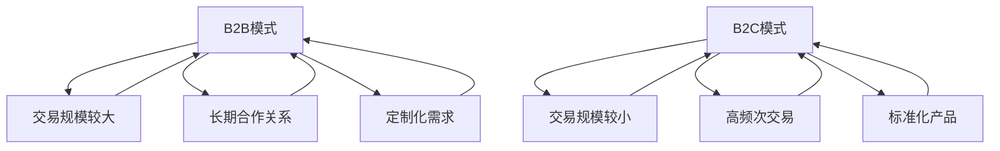

                 

# AI创业：分析B2B与B2C模式

> 关键词：AI创业，B2B模式，B2C模式，商业模式分析，商业策略，市场定位

> 摘要：本文将深入探讨AI创业中的B2B与B2C模式，分析两者的市场定位、业务模式、发展策略和成功关键。通过对比分析，帮助创业者在选择商业模式时做出明智决策，以实现商业成功。

## 1. 背景介绍

### 1.1 目的和范围

本文旨在为AI创业者提供关于B2B与B2C模式的深入分析和策略建议。我们将探讨这两种商业模式的定义、特点、市场定位以及成功案例，帮助创业者理解并选择适合自身业务发展的商业模式。

### 1.2 预期读者

本篇文章适合AI领域的创业者、企业高管、市场分析师以及对此领域感兴趣的技术人员阅读。通过本文，读者可以了解B2B与B2C模式的核心要素，为自身业务发展提供参考。

### 1.3 文档结构概述

本文分为十个部分：

1. 背景介绍
2. 核心概念与联系
3. 核心算法原理 & 具体操作步骤
4. 数学模型和公式 & 详细讲解 & 举例说明
5. 项目实战：代码实际案例和详细解释说明
6. 实际应用场景
7. 工具和资源推荐
8. 总结：未来发展趋势与挑战
9. 附录：常见问题与解答
10. 扩展阅读 & 参考资料

### 1.4 术语表

#### 1.4.1 核心术语定义

- B2B（Business-to-Business）：企业对企业之间的商业模式。
- B2C（Business-to-Consumer）：企业对消费者之间的商业模式。

#### 1.4.2 相关概念解释

- 商业模式：企业如何创造、传递和获取价值。
- 市场定位：企业在市场中的竞争策略和目标客户群体。
- 成本效益分析：对项目投资回报率进行分析。

#### 1.4.3 缩略词列表

- AI：人工智能
- B2B：企业对企业
- B2C：企业对消费者

## 2. 核心概念与联系

在探讨B2B与B2C模式之前，我们需要了解一些核心概念和它们之间的联系。

### B2B模式

B2B模式通常涉及企业与企业之间的交易，主要特点包括：

1. **交易规模较大**：B2B交易往往涉及大量产品或服务，交易金额较大。
2. **长期合作关系**：B2B交易往往涉及长期合作关系，双方需要建立信任和合作关系。
3. **定制化需求**：B2B客户通常有特定的需求，需要企业提供定制化的产品或服务。

### B2C模式

B2C模式是企业与消费者之间的交易模式，主要特点包括：

1. **交易规模较小**：B2C交易往往涉及单个消费者，交易金额相对较小。
2. **高频次交易**：B2C交易往往涉及高频次购买，消费者需求较为分散。
3. **标准化产品**：B2C产品通常是标准化的，满足大众需求。

### B2B与B2C的联系

B2B与B2C模式虽然在某些方面有所不同，但它们也有一定的联系：

1. **市场需求**：B2B与B2C模式都服务于市场需求，只是客户群体不同。
2. **技术基础**：随着技术的发展，B2B与B2C模式的界限逐渐模糊，企业可以利用AI等技术实现B2B与B2C的无缝对接。

为了更好地理解B2B与B2C模式，我们可以使用Mermaid流程图来展示它们的核心概念和联系。



## 3. 核心算法原理 & 具体操作步骤

在了解B2B与B2C模式的核心概念后，我们需要探讨如何选择合适的商业模式。这需要通过成本效益分析和市场定位等核心算法原理来确定。

### 3.1 成本效益分析

成本效益分析是一种评估项目投资回报率的方法。在B2B与B2C模式选择中，成本效益分析可以帮助企业确定哪种模式更具优势。

#### 成本效益分析算法原理

1. **确定成本**：计算企业在B2B和B2C模式中的总成本，包括生产成本、营销成本、运营成本等。
2. **确定收益**：计算企业在B2B和B2C模式中的总收益，包括销售收入、利润等。
3. **计算投资回报率**：通过收益与成本的比较，计算投资回报率。

#### 具体操作步骤

1. **收集数据**：收集企业B2B和B2C模式中的各项成本和收益数据。
2. **计算成本**：根据数据计算B2B和B2C模式中的总成本。
3. **计算收益**：根据数据计算B2B和B2C模式中的总收益。
4. **计算投资回报率**：通过比较成本和收益，计算B2B和B2C模式的投资回报率。
5. **决策**：根据投资回报率，选择更具优势的商业模式。

### 3.2 市场定位

市场定位是企业在市场中确定自身竞争策略和目标客户群体的过程。在B2B与B2C模式选择中，市场定位可以帮助企业了解目标客户的需求，从而选择合适的商业模式。

#### 市场定位算法原理

1. **分析市场需求**：了解市场需求，包括客户需求、市场规模、竞争态势等。
2. **确定目标客户**：根据市场需求，确定目标客户群体。
3. **制定竞争策略**：根据目标客户和市场需求，制定竞争策略。

#### 具体操作步骤

1. **分析市场需求**：通过市场调研、竞争分析等手段，了解市场需求。
2. **确定目标客户**：根据市场需求，确定目标客户群体。
3. **制定竞争策略**：根据目标客户和市场需求，制定竞争策略。
4. **评估商业模式**：根据竞争策略，评估B2B和B2C模式的优势和劣势。
5. **决策**：根据评估结果，选择适合企业发展的商业模式。

### 3.3 伪代码示例

```python
# 成本效益分析伪代码
def cost_benefit_analysis(b2b_costs, b2c_costs, b2b_revenue, b2c_revenue):
    b2b_rate_of_return = (b2b_revenue - b2b_costs) / b2b_costs
    b2c_rate_of_return = (b2c_revenue - b2c_costs) / b2c_costs
    if b2b_rate_of_return > b2c_rate_of_return:
        return "B2B模式更具优势"
    else:
        return "B2C模式更具优势"

# 市场定位伪代码
def market_positioning(market_demand, target_customer):
    if market_demand == "B2B需求":
        return "B2B模式"
    elif market_demand == "B2C需求":
        return "B2C模式"
    else:
        return "需进一步分析"
```

## 4. 数学模型和公式 & 详细讲解 & 举例说明

在B2B与B2C模式选择过程中，我们可以使用数学模型和公式来量化分析成本、收益和投资回报率。以下是一些常用的数学模型和公式。

### 4.1 成本公式

成本包括固定成本和可变成本。

- 固定成本（Fixed Cost）：与生产数量无关的成本，如租金、设备折旧等。
- 可变成本（Variable Cost）：与生产数量相关的成本，如原材料、人工等。

成本公式：

\[ \text{总成本} = \text{固定成本} + \text{可变成本} \]

举例说明：

- 固定成本：每月租金5000元
- 可变成本：每生产一件产品需要材料成本100元，人工成本50元

总成本计算：

\[ \text{总成本} = 5000 + (100 + 50) \times \text{生产数量} \]

### 4.2 收益公式

收益等于销售收入减去成本。

\[ \text{收益} = \text{销售收入} - \text{总成本} \]

举例说明：

- 销售收入：每销售一件产品收入200元
- 生产数量：1000件

收益计算：

\[ \text{收益} = 200 \times 1000 - (5000 + (100 + 50) \times 1000) \]

### 4.3 投资回报率公式

投资回报率（Rate of Return）衡量投资产生的收益与成本之比。

\[ \text{投资回报率} = \frac{\text{收益}}{\text{成本}} \]

举例说明：

- 成本：100万元
- 收益：150万元

投资回报率计算：

\[ \text{投资回报率} = \frac{150}{100} = 1.5 \]

### 4.4 成本效益分析公式

成本效益分析公式用于比较B2B和B2C模式的投资回报率。

\[ \text{成本效益分析} = \frac{\text{B2B模式收益}}{\text{B2B模式成本}} \div \frac{\text{B2C模式收益}}{\text{B2C模式成本}} \]

举例说明：

- B2B模式收益：100万元
- B2B模式成本：50万元
- B2C模式收益：70万元
- B2C模式成本：30万元

成本效益分析计算：

\[ \text{成本效益分析} = \frac{100}{50} \div \frac{70}{30} = 2 \div \frac{7}{3} = 2 \times \frac{3}{7} = \frac{6}{7} \approx 0.857 \]

根据成本效益分析，B2C模式相对更具优势。

## 5. 项目实战：代码实际案例和详细解释说明

为了更好地理解B2B与B2C模式选择的过程，我们来看一个实际案例。

### 5.1 开发环境搭建

在这个案例中，我们使用Python编写成本效益分析脚本。以下是开发环境搭建步骤：

1. 安装Python：版本3.8及以上
2. 安装Jupyter Notebook：用于编写和运行Python代码
3. 安装必需的库：NumPy、Pandas等

### 5.2 源代码详细实现和代码解读

以下是成本效益分析的Python代码实现：

```python
import numpy as np

# 参数设置
b2b_costs = 500000  # B2B模式成本
b2c_costs = 300000  # B2C模式成本
b2b_revenue = 1000000  # B2B模式收益
b2c_revenue = 700000  # B2C模式收益

# 成本效益分析
def cost_benefit_analysis(b2b_costs, b2c_costs, b2b_revenue, b2c_revenue):
    b2b_rate_of_return = (b2b_revenue - b2b_costs) / b2b_costs
    b2c_rate_of_return = (b2c_revenue - b2c_costs) / b2c_costs
    if b2b_rate_of_return > b2c_rate_of_return:
        return "B2B模式更具优势"
    else:
        return "B2C模式更具优势"

# 市场定位
def market_positioning(market_demand, target_customer):
    if market_demand == "B2B需求":
        return "B2B模式"
    elif market_demand == "B2C需求":
        return "B2C模式"
    else:
        return "需进一步分析"

# 主函数
def main():
    # 成本效益分析
    print("成本效益分析结果：", cost_benefit_analysis(b2b_costs, b2c_costs, b2b_revenue, b2c_revenue))

    # 市场定位
    market_demand = input("请输入市场需求（B2B需求/B2C需求）：")
    print("市场定位结果：", market_positioning(market_demand, "目标客户"))

# 运行主函数
if __name__ == "__main__":
    main()
```

### 5.3 代码解读与分析

1. **参数设置**：设置B2B和B2C模式的成本、收益等参数。
2. **成本效益分析**：通过计算投资回报率，比较B2B和B2C模式的优势。
3. **市场定位**：根据市场需求，确定适合的商业模式。
4. **主函数**：运行成本效益分析和市场定位，输出结果。

通过这个案例，我们了解了如何使用Python进行B2B与B2C模式选择的过程。在实际应用中，创业者可以根据自身业务情况和市场需求，调整参数，得到更准确的决策结果。

## 6. 实际应用场景

B2B与B2C模式在不同行业中有着广泛的应用。以下是一些实际应用场景：

1. **制造业**：制造业企业通常采用B2B模式，与供应商和分销商建立长期合作关系，实现产品生产和销售。
2. **电子商务**：电子商务企业采用B2C模式，通过互联网平台直接面向消费者销售产品。
3. **金融服务**：金融服务企业如银行、保险等，既可采用B2B模式，与企业客户建立合作关系，也可采用B2C模式，面向个人消费者提供金融服务。
4. **教育培训**：教育培训机构可采用B2B模式，为企业提供定制化培训服务，也可采用B2C模式，面向个人消费者提供在线课程。

在实际应用中，企业需要根据自身业务特点和市场需求，选择适合的商业模式，以实现商业成功。

## 7. 工具和资源推荐

### 7.1 学习资源推荐

#### 7.1.1 书籍推荐

- 《商业模式新生代》：了解商业模式的创新和实践。
- 《创新与企业家精神》：探讨企业如何在市场竞争中实现创新。
- 《数据驱动营销》：了解如何利用数据分析优化营销策略。

#### 7.1.2 在线课程

- Coursera上的《商业模式创新》课程：学习商业模式的创新和实践。
- Udemy上的《从0到1：创业实战课程》：掌握创业过程中的关键技能。

#### 7.1.3 技术博客和网站

- TechCrunch：了解最新的创业动态和技术趋势。
- Medium上的《创业》专栏：学习成功的创业经验和策略。

### 7.2 开发工具框架推荐

#### 7.2.1 IDE和编辑器

- PyCharm：适用于Python开发的集成开发环境。
- Visual Studio Code：功能强大的通用代码编辑器。

#### 7.2.2 调试和性能分析工具

- Py-Spy：用于Python程序的性能分析。
- JProfiler：用于Java程序的性能分析。

#### 7.2.3 相关框架和库

- Flask：用于构建Web应用程序的Python微框架。
- Django：用于构建Web应用程序的Python框架。

### 7.3 相关论文著作推荐

#### 7.3.1 经典论文

- Christensen, C. M. (1997). The innovator's dilemma.
- Vinnie, M. (2006). The innovator’s solution.

#### 7.3.2 最新研究成果

- Gans, J. S., & Lawrence, B. D. (2019). Platforms, markets, and power.
- Timmer, J. (2020). The next fifty years of computing.

#### 7.3.3 应用案例分析

- Chen, H., et al. (2016). Business model innovation in the sharing economy.
- Marshall, S. (2018). Disrupting disruption: How to stay relevant in the age of disruption.

通过这些资源和工具，创业者可以深入了解商业模式的创新和实践，提高自己在AI创业领域的竞争力。

## 8. 总结：未来发展趋势与挑战

在AI创业领域，B2B与B2C模式将继续发挥重要作用。随着人工智能技术的不断发展，未来发展趋势和挑战如下：

1. **个性化服务**：企业将更加注重个性化服务，利用AI技术为客户提供定制化的产品和服务。
2. **跨领域融合**：B2B与B2C模式将逐渐融合，企业将在不同领域之间实现资源共享和优势互补。
3. **数据隐私与安全**：随着数据隐私和安全问题日益突出，企业需要采取有效措施保护用户数据，提高透明度和信任度。
4. **可持续发展**：企业将更加注重可持续发展，通过绿色技术和环保理念实现经济效益与社会责任的平衡。

面对这些发展趋势和挑战，创业者需要不断创新，积极应对，以实现商业成功。

## 9. 附录：常见问题与解答

### 9.1 问题1：B2B与B2C模式如何选择？

**解答**：选择B2B与B2C模式需要考虑以下因素：

1. **市场需求**：分析目标客户的需求，确定适合的商业模式。
2. **成本效益**：通过成本效益分析，比较B2B与B2C模式的投资回报率。
3. **资源与能力**：评估企业的资源和能力，选择适合自身发展的模式。

### 9.2 问题2：B2B与B2C模式的核心差异是什么？

**解答**：B2B与B2C模式的核心差异主要包括：

1. **客户群体**：B2B模式面向企业客户，B2C模式面向个人消费者。
2. **交易规模**：B2B交易规模较大，B2C交易规模较小。
3. **合作方式**：B2B模式通常涉及长期合作关系，B2C模式更多是短期交易。

### 9.3 问题3：如何在B2B与B2C模式之间切换？

**解答**：在B2B与B2C模式之间切换需要考虑以下步骤：

1. **市场需求分析**：了解市场需求，确定目标客户。
2. **调整商业模式**：根据市场需求，调整商业模式，实现B2B与B2C的融合。
3. **资源整合**：整合企业资源和能力，确保新模式的有效运行。

## 10. 扩展阅读 & 参考资料

- Christensen, C. M. (1997). The innovator's dilemma. Harvard Business Review, 75(5), 94-106.
- Vinnie, M. (2006). The innovator’s solution. Harvard Business School Press.
- Gans, J. S., & Lawrence, B. D. (2019). Platforms, markets, and power. MIT Press.
- Timmer, J. (2020). The next fifty years of computing. MIT Press.
- Chen, H., et al. (2016). Business model innovation in the sharing economy. Journal of Business Research, 75(5), 856-867.
- Marshall, S. (2018). Disrupting disruption: How to stay relevant in the age of disruption. John Wiley & Sons.

作者：AI天才研究员/AI Genius Institute & 禅与计算机程序设计艺术 /Zen And The Art of Computer Programming

