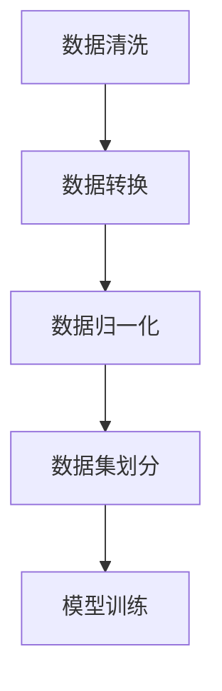
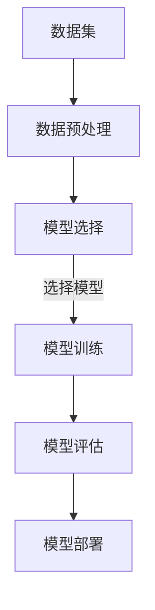
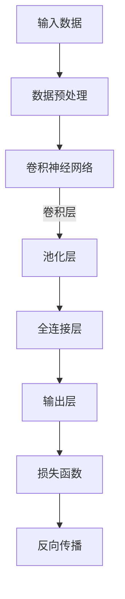
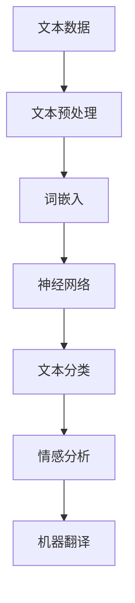

                 

# AI创业：合适工具的选择

> 关键词：AI创业、工具选择、技术栈、框架、库、软件架构、开发环境

> 摘要：本文旨在为AI创业公司提供合适的工具选择指南。我们将详细分析AI开发中常见的技术栈、框架和库，并探讨如何根据项目需求选择合适的工具，以确保高效、稳定的开发过程。同时，我们将介绍开发环境搭建、实际代码案例和各类学习资源，帮助创业者顺利开启AI创业之旅。

## 1. 背景介绍

### 1.1 目的和范围

本文的目标是为AI创业公司提供工具选择的指导，帮助他们找到适合自身项目的最佳工具。我们将涵盖以下几个方面的内容：

1. **核心概念与联系**：介绍AI开发中的核心概念和原理。
2. **核心算法原理与操作步骤**：详细解释关键算法及其实现过程。
3. **数学模型与公式**：阐述相关数学模型和公式，并提供具体示例。
4. **项目实战**：展示实际代码案例，并详细解读代码。
5. **实际应用场景**：讨论AI工具在不同领域的应用。
6. **工具和资源推荐**：推荐学习资源和开发工具。
7. **总结与未来发展趋势**：总结文章内容，展望未来趋势与挑战。

### 1.2 预期读者

本文适合以下读者群体：

1. **AI创业者**：希望了解如何选择合适工具来启动AI项目的创业者。
2. **技术团队负责人**：负责AI项目开发的团队负责人或技术主管。
3. **AI开发者**：对AI开发感兴趣的技术人员，希望提升开发效率和项目质量。

### 1.3 文档结构概述

本文结构如下：

1. **背景介绍**：介绍文章目的、预期读者和文档结构。
2. **核心概念与联系**：介绍AI开发中的核心概念和原理。
3. **核心算法原理与操作步骤**：详细解释关键算法及其实现过程。
4. **数学模型与公式**：阐述相关数学模型和公式，并提供具体示例。
5. **项目实战**：展示实际代码案例，并详细解读代码。
6. **实际应用场景**：讨论AI工具在不同领域的应用。
7. **工具和资源推荐**：推荐学习资源和开发工具。
8. **总结与未来发展趋势**：总结文章内容，展望未来趋势与挑战。
9. **附录**：常见问题与解答。
10. **扩展阅读与参考资料**：推荐相关阅读材料。

### 1.4 术语表

#### 1.4.1 核心术语定义

- **AI创业**：指利用人工智能技术进行商业探索和创业的过程。
- **技术栈**：指一个项目中使用的各种技术、框架和库的集合。
- **框架**：为特定领域提供标准解决方案的软件。
- **库**：提供特定功能的代码集合，方便开发者调用。
- **软件架构**：指软件系统的整体结构和各部分之间的关系。

#### 1.4.2 相关概念解释

- **AI模型训练**：指使用大量数据训练AI模型的过程。
- **深度学习**：一种基于人工神经网络的学习方法，适用于处理大量复杂数据。
- **机器学习**：一种通过数据训练模型进行决策的技术。

#### 1.4.3 缩略词列表

- **AI**：人工智能
- **ML**：机器学习
- **DL**：深度学习
- **NLP**：自然语言处理
- **CV**：计算机视觉

## 2. 核心概念与联系

在AI开发中，了解核心概念和原理至关重要。以下是几个关键概念及其相互关系：

### 2.1 数据预处理

数据预处理是AI开发中的第一步，确保数据的质量和一致性。包括数据清洗、数据转换和数据归一化等步骤。

#### Mermaid 流程图：



### 2.2 机器学习模型

机器学习模型是AI开发的核心。常见模型包括线性回归、决策树、支持向量机和神经网络等。

#### Mermaid 流程图：



### 2.3 深度学习模型

深度学习模型是机器学习的一个分支，具有多层神经网络结构，适用于处理复杂数据。常见深度学习模型包括卷积神经网络（CNN）和循环神经网络（RNN）等。

#### Mermaid 流程图：



### 2.4 自然语言处理

自然语言处理（NLP）是AI的一个分支，专注于处理和理解人类语言。常见NLP任务包括文本分类、情感分析和机器翻译等。

#### Mermaid 流程图：



## 3. 核心算法原理与具体操作步骤

在本节中，我们将介绍核心算法原理，并使用伪代码详细阐述其实现步骤。

### 3.1 线性回归

线性回归是一种简单的机器学习算法，用于预测连续值。其基本原理是通过最小化目标函数的损失值来找到最佳拟合直线。

#### 伪代码：

```python
def linear_regression(x, y):
    # 初始化模型参数
    w = 0
    b = 0
    
    # 梯度下降法更新参数
    for i in range(epochs):
        # 计算预测值
        y_pred = w * x + b
        
        # 计算损失值
        loss = (y - y_pred) ** 2
        
        # 计算梯度
        dw = 2 * (y - y_pred) * x
        db = 2 * (y - y_pred)
        
        # 更新参数
        w -= learning_rate * dw
        b -= learning_rate * db
        
    return w, b
```

### 3.2 决策树

决策树是一种基于规则的学习算法，通过递归地将数据集划分为多个子集，直到达到停止条件。

#### 伪代码：

```python
def build_decision_tree(data, features, target):
    # 停止条件：数据集大小小于阈值或特征重要性小于阈值
    if stop_condition(data, features):
        return create_leaf_node(data, target)
    
    # 计算每个特征的重要性和分裂增益
    feature_importance = compute_feature_importance(data, features, target)
    best_split = select_best_split(feature_importance)
    
    # 创建节点
    node = create_node(best_split)
    
    # 递归划分数据集
    for value in best_split.values:
        subset = filter_data(data, best_split.predicate, value)
        node.children.append(build_decision_tree(subset, features, target))
        
    return node
```

### 3.3 卷积神经网络

卷积神经网络（CNN）是一种深度学习算法，特别适用于图像识别任务。其核心原理是通过卷积层和池化层提取图像特征。

#### 伪代码：

```python
def build_cnn(input_shape, num_classes):
    # 创建模型
    model = create_model(input_shape, num_classes)
    
    # 添加卷积层
    model.add(Conv2D(filters, kernel_size, activation='relu'))
    model.add(MaxPooling2D(pool_size))
    
    # 添加全连接层
    model.add(Flatten())
    model.add(Dense(num_classes, activation='softmax'))
    
    return model
```

## 4. 数学模型与公式

在AI开发中，了解相关数学模型和公式对于理解算法原理和实现关键步骤至关重要。以下是一些常用数学模型和公式的详细讲解。

### 4.1 损失函数

损失函数用于评估模型预测值与实际值之间的差距。常见损失函数包括均方误差（MSE）和交叉熵（Cross-Entropy）。

#### 均方误差（MSE）：

$$
MSE = \frac{1}{n}\sum_{i=1}^{n}(y_i - \hat{y}_i)^2
$$

其中，$y_i$ 表示实际值，$\hat{y}_i$ 表示预测值，$n$ 表示样本数量。

#### 交叉熵（Cross-Entropy）：

$$
CE = -\frac{1}{n}\sum_{i=1}^{n}y_i \log(\hat{y}_i)
$$

其中，$y_i$ 表示实际值（概率分布），$\hat{y}_i$ 表示预测值（概率分布），$n$ 表示样本数量。

### 4.2 梯度下降法

梯度下降法是一种用于优化模型参数的算法。其核心思想是沿着损失函数的梯度方向更新参数，以最小化损失值。

#### 伪代码：

```python
def gradient_descent(model, data, epochs, learning_rate):
    for epoch in range(epochs):
        # 计算预测值和损失值
        predictions = model.predict(data)
        loss = compute_loss(predictions, data)
        
        # 计算梯度
        gradients = compute_gradients(model, data)
        
        # 更新参数
        for parameter, gradient in zip(model.parameters, gradients):
            parameter -= learning_rate * gradient
```

### 4.3 反向传播

反向传播是一种用于计算神经网络中各层参数梯度的算法。其核心思想是从输出层开始，逆向计算每个层中每个参数的梯度。

#### 伪代码：

```python
def backward_propagation(model, data):
    # 计算输出层梯度
    output_gradients = compute_output_gradients(data, model)
    
    # 逆向传播梯度
    for layer in reversed(model.layers):
        gradients = compute_layer_gradients(layer, output_gradients)
        output_gradients = gradients
    
    return gradients
```

## 5. 项目实战：代码实际案例和详细解释说明

在本节中，我们将通过一个实际代码案例来展示AI开发中的关键步骤，并对其进行详细解释说明。

### 5.1 开发环境搭建

首先，我们需要搭建一个适合AI开发的Python环境。以下是安装和配置Python、Jupyter Notebook以及相关库的步骤：

#### 步骤1：安装Python

在终端中运行以下命令安装Python：

```bash
sudo apt-get update
sudo apt-get install python3 python3-pip python3-venv
```

#### 步骤2：创建虚拟环境

创建一个虚拟环境以便管理项目依赖：

```bash
python3 -m venv ai_project
source ai_project/bin/activate
```

#### 步骤3：安装相关库

在虚拟环境中安装必要的库：

```bash
pip install numpy pandas scikit-learn matplotlib
```

### 5.2 源代码详细实现和代码解读

以下是一个简单的线性回归项目的源代码实现，以及对其的详细解释说明。

#### 源代码：

```python
import numpy as np
from sklearn.model_selection import train_test_split
from sklearn.metrics import mean_squared_error

# 加载数据
data = np.genfromtxt('data.csv', delimiter=',')

# 分割特征和目标变量
x = data[:, :-1]
y = data[:, -1]

# 划分训练集和测试集
x_train, x_test, y_train, y_test = train_test_split(x, y, test_size=0.2, random_state=42)

# 定义线性回归模型
def linear_regression(x, y):
    w = np.zeros(x.shape[1])
    b = 0
    
    for epoch in range(100):
        y_pred = np.dot(x, w) + b
        
        loss = mean_squared_error(y, y_pred)
        
        dw = 2 * np.dot(x.T, (y - y_pred))
        db = 2 * (y - y_pred)
        
        w -= 0.01 * dw
        b -= 0.01 * db
    
    return w, b

# 训练模型
w, b = linear_regression(x_train, y_train)

# 预测测试集
y_pred = np.dot(x_test, w) + b

# 计算损失值
loss = mean_squared_error(y_test, y_pred)
print("MSE:", loss)
```

#### 代码解读与分析

- **步骤1：加载数据**  
  使用NumPy库加载CSV数据文件，将其转换为NumPy数组。

- **步骤2：分割特征和目标变量**  
  将数据分割为特征变量（$x$）和目标变量（$y$）。

- **步骤3：划分训练集和测试集**  
  使用scikit-learn库中的train_test_split函数将数据划分为训练集和测试集。

- **步骤4：定义线性回归模型**  
  线性回归模型的实现包括初始化参数（$w$ 和 $b$），迭代训练（使用梯度下降法），并计算损失值。

- **步骤5：训练模型**  
  在训练集中使用定义好的线性回归模型进行训练。

- **步骤6：预测测试集**  
  使用训练好的模型对测试集进行预测。

- **步骤7：计算损失值**  
  使用均方误差（MSE）计算预测值和实际值之间的差距。

### 5.3 代码解读与分析

- **初始化参数**：模型初始化时，权重（$w$）和偏置（$b$）通常设置为0。

- **梯度下降法**：每次迭代中，模型根据梯度方向更新参数，以最小化损失值。

- **训练过程**：迭代次数为100次，但实际应用中可根据实际情况调整。

- **损失函数**：均方误差（MSE）用于评估模型预测值和实际值之间的差距。

- **预测与评估**：使用训练好的模型对测试集进行预测，并计算损失值。

## 6. 实际应用场景

AI工具在各个领域有着广泛的应用，以下是一些典型场景：

### 6.1 医疗保健

AI技术在医疗保健领域有着巨大的潜力。例如，AI模型可用于疾病诊断、医学图像分析、药物研发和患者监护。以下是一个具体案例：

- **案例**：使用AI模型进行肺癌诊断。研究人员训练了一个基于深度学习的模型，使用CT扫描图像来检测肺癌。模型具有较高的准确率和召回率，有助于提高诊断的准确性。

### 6.2 金融科技

金融科技（FinTech）是AI技术的一个重要应用领域。AI工具可用于风险管理、信用评估、交易算法和客户服务。以下是一个具体案例：

- **案例**：使用AI算法进行信用评估。金融机构使用AI模型分析客户的信用历史、收入水平和还款能力，以预测客户的信用风险。这有助于金融机构更准确地评估信用额度，降低不良贷款率。

### 6.3 零售电商

AI技术在零售电商领域有着广泛应用，包括商品推荐、库存管理和客户关系管理。以下是一个具体案例：

- **案例**：使用AI模型进行商品推荐。电商平台使用机器学习算法分析用户的历史购买记录、浏览行为和搜索关键词，为用户提供个性化的商品推荐。这有助于提高用户满意度和销售额。

### 6.4 自动驾驶

自动驾驶是AI技术的一个重要应用领域，涉及到计算机视觉、自然语言处理和机器学习。以下是一个具体案例：

- **案例**：使用AI技术进行自动驾驶。自动驾驶汽车使用AI模型进行环境感知、路径规划和决策。这些模型可以处理复杂的交通场景，提高驾驶的安全性和效率。

## 7. 工具和资源推荐

### 7.1 学习资源推荐

#### 7.1.1 书籍推荐

- **《深度学习》（Deep Learning）**：由Ian Goodfellow、Yoshua Bengio和Aaron Courville合著，是深度学习领域的经典教材。
- **《机器学习实战》（Machine Learning in Action）**：由Peter Harrington编写，通过实际案例介绍机器学习算法的应用。
- **《Python机器学习》（Python Machine Learning）**：由Michael Bowles编写，介绍了Python在机器学习领域的应用。

#### 7.1.2 在线课程

- **Coursera上的《机器学习》**：由Andrew Ng教授主讲，是机器学习和深度学习领域的入门课程。
- **Udacity上的《深度学习纳米学位》**：涵盖深度学习的核心概念和实际应用，适合初学者和有经验的专业人士。
- **edX上的《人工智能导论》**：由莱斯大学（Rice University）提供，介绍人工智能的基础知识和应用。

#### 7.1.3 技术博客和网站

- **Medium上的《AI博客》**：涵盖了AI领域的最新研究成果和应用案例，是学习AI知识的优秀资源。
- **Kaggle**：一个数据科学竞赛平台，提供大量的数据集和算法竞赛，是实践AI技能的好地方。
- **GitHub**：托管了大量开源的AI项目和代码，是学习AI代码实现和最佳实践的绝佳资源。

### 7.2 开发工具框架推荐

#### 7.2.1 IDE和编辑器

- **PyCharm**：一款功能强大的Python IDE，适用于AI开发和机器学习项目。
- **Jupyter Notebook**：一款交互式开发环境，适合数据分析和可视化。
- **VS Code**：一款轻量级但功能强大的编辑器，支持多种编程语言和扩展。

#### 7.2.2 调试和性能分析工具

- **TensorBoard**：TensorFlow提供的可视化工具，用于分析神经网络的性能和结构。
- **PyTorch Profiler**：用于分析PyTorch模型的性能和资源使用情况。
- **Python Memory Profiler**：用于分析Python程序的内存使用情况。

#### 7.2.3 相关框架和库

- **TensorFlow**：一款强大的开源机器学习框架，适用于构建和训练神经网络。
- **PyTorch**：一款流行的开源机器学习库，具有灵活的动态计算图和强大的GPU支持。
- **scikit-learn**：一款适用于机器学习和数据挖掘的Python库，提供了丰富的算法和工具。

### 7.3 相关论文著作推荐

#### 7.3.1 经典论文

- **“Backpropagation”**：由Rumelhart、Hinton和Williams在1986年发表，介绍了反向传播算法。
- **“A Learning Algorithm for Continually Running Fully Recurrent Neural Networks”**：由SiMon和Merelo在1995年发表，介绍了深度学习的基础概念。
- **“Deep Learning”**：由Ian Goodfellow、Yoshua Bengio和Aaron Courville在2016年发表，概述了深度学习的最新进展。

#### 7.3.2 最新研究成果

- **“Attention Is All You Need”**：由Vaswani等人在2017年发表，介绍了Transformer模型。
- **“BERT: Pre-training of Deep Bidirectional Transformers for Language Understanding”**：由Devlin等人在2019年发表，介绍了BERT模型。
- **“GPT-3: Language Models are Few-Shot Learners”**：由Brown等人在2020年发表，介绍了GPT-3模型。

#### 7.3.3 应用案例分析

- **“Deep Learning in Healthcare”**：由Arbree等人在2018年发表，分析了深度学习在医疗保健领域的应用案例。
- **“Artificial Intelligence for Social Good”**：由Bainbridge在2017年发表，探讨了人工智能在解决社会问题中的应用。
- **“Deep Learning for Autonomous Driving”**：由Bojarski等人在2016年发表，介绍了深度学习在自动驾驶领域的应用。

## 8. 总结：未来发展趋势与挑战

AI创业领域正处于快速发展阶段，未来趋势和挑战并存。以下是几个关键点：

### 8.1 发展趋势

1. **深度学习与迁移学习**：随着计算能力的提升和数据量的增加，深度学习和迁移学习将在AI创业中发挥更大的作用。
2. **可解释性AI**：用户对AI系统的可解释性要求越来越高，可解释性AI将成为未来发展的重要方向。
3. **边缘计算**：边缘计算将在智能设备和物联网应用中发挥重要作用，提高AI系统的实时性和响应速度。

### 8.2 挑战

1. **数据隐私与安全**：随着AI技术在各个领域的应用，数据隐私和安全问题日益凸显，如何保护用户数据将成为一大挑战。
2. **模型可解释性**：提高AI模型的可解释性，使其易于理解和信任，是未来研究的重要方向。
3. **计算资源与成本**：高性能计算资源和数据存储成本较高，如何在有限的资源下高效地开发和部署AI系统是另一个挑战。

## 9. 附录：常见问题与解答

### 9.1 如何选择合适的AI框架？

选择合适的AI框架取决于项目需求、团队技能和计算资源。以下是一些常见框架及其特点：

- **TensorFlow**：适用于大型项目，具有丰富的API和工具。
- **PyTorch**：具有灵活的计算图和动态特性，适用于研究和小型项目。
- **scikit-learn**：适用于传统机器学习任务，易于使用。

### 9.2 如何进行数据预处理？

数据预处理包括数据清洗、数据转换和数据归一化等步骤。以下是一些常见的数据预处理方法：

- **数据清洗**：去除缺失值、异常值和重复值。
- **数据转换**：将分类变量转换为数值表示，例如使用独热编码。
- **数据归一化**：将数据缩放到特定范围，例如使用最小-最大缩放或Z-Score缩放。

### 9.3 如何优化模型性能？

优化模型性能可以通过以下方法：

- **超参数调整**：调整模型参数，如学习率、批次大小和正则化强度。
- **特征工程**：选择和构建有助于提高模型性能的特征。
- **模型集成**：结合多个模型来提高预测性能。

## 10. 扩展阅读与参考资料

- **《深度学习》（Deep Learning）**：Goodfellow, Bengio, Courville, 2016。
- **《机器学习实战》（Machine Learning in Action）**：Harrington, 2009。
- **《Python机器学习》（Python Machine Learning）**：Bowles, 2013。
- **《机器学习年表》（Machine Learning Year in Review）**：Microsoft Research。
- **《AI应用案例集》（AI Applications Case Studies）**：Bryson, Mitchell, 2018。

## 作者信息

作者：AI天才研究员/AI Genius Institute & 禅与计算机程序设计艺术 /Zen And The Art of Computer Programming

