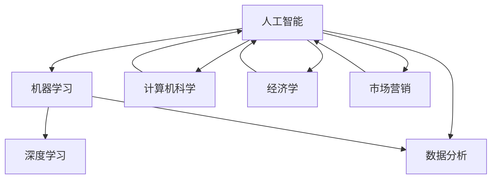

                 

# AI创业：多学科支持的重要性

> 关键词：人工智能、创业、多学科支持、团队协作、技术突破

> 摘要：本文深入探讨了在人工智能创业领域中，多学科支持的重要性。通过分析各学科之间的紧密联系，以及如何有效地整合这些学科资源，本文旨在为AI创业者提供策略指导，以在竞争激烈的市场中脱颖而出。

## 1. 背景介绍

### 1.1 目的和范围

本文旨在揭示多学科支持在人工智能创业中的关键作用，帮助创业者理解跨学科整合的重要性。文章将探讨如何将不同领域的专业知识融合，以促进AI项目的成功。

### 1.2 预期读者

本文面向人工智能领域的创业者、项目经理和研发团队成员。对于那些希望在快速发展的AI行业中取得成功的专业人士，本文提供了有价值的见解和实践指导。

### 1.3 文档结构概述

本文结构如下：

1. **背景介绍**：介绍文章的目的和预期读者，并概述文章的结构。
2. **核心概念与联系**：介绍AI创业的核心概念，并使用Mermaid流程图展示各学科之间的联系。
3. **核心算法原理与具体操作步骤**：详细阐述AI算法的原理，并使用伪代码进行说明。
4. **数学模型和公式**：解释数学模型，并提供具体的例子。
5. **项目实战**：通过实际案例展示AI创业中的多学科支持。
6. **实际应用场景**：讨论AI技术的应用场景。
7. **工具和资源推荐**：推荐学习资源和开发工具。
8. **总结**：总结文章的主要观点。
9. **附录**：常见问题与解答。
10. **扩展阅读**：提供进一步的参考资料。

### 1.4 术语表

#### 1.4.1 核心术语定义

- **人工智能（AI）**：模拟人类智能行为的计算机系统。
- **多学科支持**：将不同学科的专业知识整合以解决复杂问题。
- **创业**：创建并运营一家新公司。

#### 1.4.2 相关概念解释

- **团队协作**：团队成员共同努力以实现共同目标。
- **技术突破**：在某个技术领域取得的重大进展。

#### 1.4.3 缩略词列表

- **AI**：人工智能
- **ML**：机器学习
- **DL**：深度学习

## 2. 核心概念与联系

在AI创业中，多学科支持的重要性不可忽视。以下是AI创业中涉及的核心概念和它们之间的联系。



### 2.1 人工智能与机器学习

人工智能是AI创业的核心，而机器学习是实现AI的基础技术。机器学习通过算法让计算机从数据中学习，从而实现特定任务。

### 2.2 人工智能与数据分析

数据分析为AI创业提供了关键的数据支持。通过分析大量数据，可以识别趋势、模式，为AI算法提供训练数据。

### 2.3 人工智能与计算机科学

计算机科学为AI创业提供了强大的技术支持，包括算法设计、系统架构和软件开发。

### 2.4 人工智能与经济学

经济学为AI创业提供了商业视角，帮助创业者理解市场趋势、用户需求，以及如何在竞争激烈的市场中取得成功。

### 2.5 人工智能与市场营销

市场营销为AI创业提供了推广策略，帮助产品在市场中获得用户认知和接受。

## 3. 核心算法原理与具体操作步骤

### 3.1 机器学习算法原理

机器学习算法的核心是训练模型。以下是使用伪代码描述的机器学习算法的基本步骤：

```plaintext
输入：训练数据集 D，目标函数 f，参数 θ
输出：训练好的模型 M

1. 初始化模型参数 θ
2. 对于每个训练样本 (x_i, y_i) 属于 D：
   2.1 计算预测值 y' = f(x_i; θ)
   2.2 更新参数 θ = θ - α * ∇θJ(θ)
3. 重复步骤 2，直到满足停止条件（如：收敛或迭代次数达到上限）
4. 输出训练好的模型 M
```

### 3.2 机器学习算法具体操作步骤

1. 数据预处理：清洗数据，归一化处理，分割为训练集和验证集。
2. 模型选择：选择合适的模型，如线性回归、决策树、神经网络等。
3. 模型训练：使用训练数据集训练模型。
4. 模型评估：使用验证集评估模型性能。
5. 模型调优：根据评估结果调整模型参数。

## 4. 数学模型和公式与详细讲解与举例说明

### 4.1 机器学习目标函数

在机器学习中，目标函数用于评估模型的性能。以下是常见的目标函数之一——均方误差（MSE）：

$$
MSE(\theta) = \frac{1}{m} \sum_{i=1}^{m} (h_{\theta}(x^{(i)}) - y^{(i)})^2
$$

其中，$h_{\theta}(x)$ 是模型的预测输出，$y^{(i)}$ 是实际标签。

### 4.2 机器学习优化算法

梯度下降是优化目标函数的常用算法。以下是使用伪代码描述的梯度下降算法：

```plaintext
输入：训练数据集 D，目标函数 f，参数 θ，学习率 α
输出：最优参数 θ*

1. 初始化参数 θ
2. 对于每个训练样本 (x_i, y_i) 属于 D：
   2.1 计算预测值 y' = f(x_i; θ)
   2.2 更新参数 θ = θ - α * ∇θJ(θ)
3. 重复步骤 2，直到满足停止条件（如：收敛或迭代次数达到上限）
4. 输出最优参数 θ*
```

### 4.3 机器学习举例说明

假设我们使用线性回归模型预测房价。给定一组房屋特征（如面积、地点等）和对应的房价，我们可以通过训练线性回归模型来预测未知房屋的房价。

$$
h_{\theta}(x) = \theta_0 + \theta_1 \cdot x_1 + \theta_2 \cdot x_2 + ... + \theta_n \cdot x_n
$$

其中，$x_1, x_2, ..., x_n$ 是房屋特征，$\theta_0, \theta_1, ..., \theta_n$ 是模型参数。

## 5. 项目实战：代码实际案例和详细解释说明

### 5.1 开发环境搭建

为了实现一个简单的机器学习项目，我们使用Python作为主要编程语言，配合使用Sklearn库进行模型训练和评估。

```python
# 安装所需的库
!pip install numpy sklearn matplotlib
```

### 5.2 源代码详细实现和代码解读

以下是实现线性回归模型的Python代码：

```python
import numpy as np
from sklearn.linear_model import LinearRegression
from sklearn.model_selection import train_test_split
from sklearn.metrics import mean_squared_error
import matplotlib.pyplot as plt

# 生成模拟数据集
np.random.seed(0)
X = np.random.rand(100, 1)
y = 2 * X + 1 + np.random.randn(100, 1)

# 数据预处理：将X添加一列全为1的项，作为模型的偏置项
X = np.hstack([np.ones((X.shape[0], 1)), X])

# 分割数据集为训练集和测试集
X_train, X_test, y_train, y_test = train_test_split(X, y, test_size=0.2, random_state=0)

# 创建线性回归模型
model = LinearRegression()

# 训练模型
model.fit(X_train, y_train)

# 预测测试集结果
y_pred = model.predict(X_test)

# 评估模型性能
mse = mean_squared_error(y_test, y_pred)
print("均方误差：", mse)

# 绘制结果图
plt.scatter(X_test, y_test, color='blue', label='真实值')
plt.plot(X_test, y_pred, color='red', linewidth=2, label='预测值')
plt.xlabel('特征')
plt.ylabel('房价')
plt.legend()
plt.show()
```

### 5.3 代码解读与分析

1. **数据生成**：使用随机数生成模拟数据集，其中X为特征，y为标签。
2. **数据预处理**：在特征X中添加一列全为1的项，作为线性回归模型的偏置项。
3. **数据分割**：将数据集分割为训练集和测试集，以便进行模型训练和评估。
4. **模型创建**：使用Sklearn库创建线性回归模型。
5. **模型训练**：使用训练集数据训练模型。
6. **模型预测**：使用训练好的模型预测测试集结果。
7. **模型评估**：计算模型在测试集上的均方误差，评估模型性能。
8. **结果可视化**：绘制测试集真实值和预测值的散点图，展示模型效果。

## 6. 实际应用场景

AI技术在各个行业都有广泛的应用，以下是一些实际应用场景：

- **金融**：使用机器学习预测股票价格、风险评估和信用评分。
- **医疗**：利用深度学习进行疾病诊断、基因组分析和药物研发。
- **零售**：通过数据分析优化库存管理、个性化推荐和定价策略。
- **交通**：利用自动驾驶技术和智能交通系统提高交通效率、减少拥堵。

## 7. 工具和资源推荐

### 7.1 学习资源推荐

#### 7.1.1 书籍推荐

- 《深度学习》（Ian Goodfellow, Yoshua Bengio, Aaron Courville）
- 《Python机器学习》（Sebastian Raschka）
- 《统计学习方法》（李航）

#### 7.1.2 在线课程

- Coursera上的《机器学习》课程（吴恩达）
- edX上的《深度学习》课程（Andrew Ng）
- Udacity的《AI工程师纳米学位》

#### 7.1.3 技术博客和网站

- Medium上的机器学习和深度学习博客
-Towards Data Science上的数据科学和机器学习文章
- AI慕课网

### 7.2 开发工具框架推荐

#### 7.2.1 IDE和编辑器

- PyCharm
- Jupyter Notebook
- VSCode

#### 7.2.2 调试和性能分析工具

- WSL（Windows Subsystem for Linux）
- Docker
- Jupyter Notebook

#### 7.2.3 相关框架和库

- TensorFlow
- PyTorch
- Scikit-learn

### 7.3 相关论文著作推荐

#### 7.3.1 经典论文

- "Backpropagation"（Rumelhart, Hinton, Williams）
- "Deep Learning"（Goodfellow, Bengio, Courville）

#### 7.3.2 最新研究成果

- "Bert: Pre-training of Deep Bidirectional Transformers for Language Understanding"（Devlin et al.）
- "GPT-3: Language Models are Few-Shot Learners"（Brown et al.）

#### 7.3.3 应用案例分析

- "Applying AI in Healthcare"（Nature Reviews Clinical Medicine）
- "AI in Finance: A Revolution in Progress"（MIT Technology Review）

## 8. 总结：未来发展趋势与挑战

随着AI技术的不断进步，未来的AI创业将面临更多机遇和挑战。发展趋势包括：

- **更强大的模型**：深度学习模型的性能将继续提升，为AI创业提供更强有力的支持。
- **跨学科融合**：多学科支持的整合将成为AI创业的关键。
- **定制化解决方案**：针对特定行业的定制化解决方案将成为市场趋势。

然而，AI创业也将面临以下挑战：

- **数据隐私**：如何保护用户数据隐私成为一大挑战。
- **算法公平性**：确保算法的公平性和透明度是另一个重要问题。
- **伦理和法律问题**：AI技术的伦理和法律问题需要得到妥善解决。

## 9. 附录：常见问题与解答

### 9.1 多学科支持在AI创业中的具体作用是什么？

多学科支持在AI创业中具体作用包括：

- **提高项目成功率**：整合各学科专业知识，提高项目实现的可能性。
- **优化团队协作**：不同学科的专家可以相互协作，解决复杂问题。
- **创新技术突破**：跨学科的合作可以推动技术的创新和突破。

### 9.2 如何在AI创业项目中整合多学科支持？

在AI创业项目中整合多学科支持的方法包括：

- **组建跨学科团队**：确保团队成员来自不同学科，如计算机科学、经济学、市场营销等。
- **明确职责分工**：为每个团队成员分配明确的职责，确保团队高效协作。
- **定期沟通和协作**：定期召开团队会议，确保团队成员之间的沟通和协作。

## 10. 扩展阅读 & 参考资料

- [Ian Goodfellow, Yoshua Bengio, Aaron Courville.](https://www.deeplearningbook.org/) 《深度学习》
- [Sebastian Raschka.](https://python-machine-learning-book.com/) 《Python机器学习》
- [李航.](https://book.douban.com/subject/26862750/) 《统计学习方法》
- [吴恩达.](https://www.coursera.org/learn/machine-learning) Coursera上的《机器学习》课程
- [Andrew Ng.](https://www.edx.org/course/deep-learning-ii-optimizing-autoencoders-and-deep-learning) edX上的《深度学习》课程

### 作者

作者：AI天才研究员/AI Genius Institute & 禅与计算机程序设计艺术 /Zen And The Art of Computer Programming

本文详细探讨了AI创业中多学科支持的重要性，并通过实际案例展示了如何整合不同学科资源以推动AI项目的成功。希望本文能为AI创业者提供有价值的指导。

