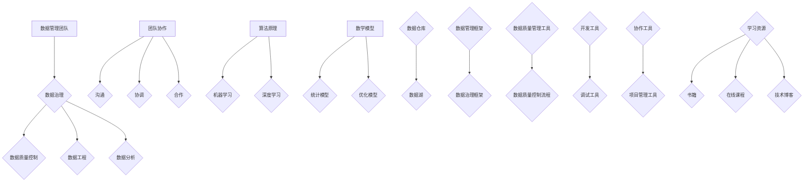

                 

# AI创业：数据管理团队建设

> 关键词：AI创业、数据管理、团队建设、数据治理、数据处理、团队协作

> 摘要：本文将深入探讨在AI创业过程中，如何有效地构建和培养一个强大的数据管理团队。文章将从背景介绍、核心概念、算法原理、数学模型、项目实战、应用场景、工具推荐以及未来发展趋势等方面，一步步解析团队建设的关键要素，帮助创业者更好地应对数据管理的挑战，确保AI项目的成功实施。

## 1. 背景介绍

### 1.1 目的和范围

本文旨在为AI创业者提供一些建设性建议，以帮助他们在初创阶段建立高效的数据管理团队。通过深入分析团队建设的关键要素，本文旨在为读者提供以下方面的指导：

- 如何选择合适的数据管理团队成员？
- 数据管理团队的职能和角色如何定义？
- 数据管理团队如何实现有效的协作和沟通？
- 数据治理和数据质量控制的标准和方法是什么？
- 如何通过项目实战提升数据管理团队的能力？

### 1.2 预期读者

本文主要面向以下读者群体：

- AI创业公司创始人或CTO
- 数据管理、数据科学或AI领域的工程师和技术经理
- 对数据管理团队建设有兴趣的IT从业者

### 1.3 文档结构概述

本文结构如下：

1. 背景介绍：介绍文章的目的、范围、预期读者和文档结构。
2. 核心概念与联系：阐述数据管理团队建设中的核心概念和关联。
3. 核心算法原理 & 具体操作步骤：详细讲解数据管理团队所需的核心算法和操作步骤。
4. 数学模型和公式 & 详细讲解 & 举例说明：介绍数据管理过程中使用的数学模型和公式，并通过实例进行说明。
5. 项目实战：提供实际代码案例和详细解释，帮助读者更好地理解数据管理团队的工作。
6. 实际应用场景：分析数据管理团队在不同场景下的应用。
7. 工具和资源推荐：推荐学习资源和开发工具，帮助读者提升数据管理技能。
8. 总结：总结文章的主要观点，展望未来发展趋势和挑战。
9. 附录：常见问题与解答。
10. 扩展阅读 & 参考资料：提供进一步阅读的资料。

### 1.4 术语表

#### 1.4.1 核心术语定义

- 数据管理：指对数据资源进行有效组织、存储、处理、分析和利用的一系列活动和措施。
- 数据治理：指组织在数据生命周期中，制定和执行相关政策、流程和标准，以确保数据的准确、完整、安全、合规。
- 数据质量控制：指通过各种手段和方法，对数据质量进行评估、监控和改进，以确保数据满足业务需求。
- 团队协作：指团队成员之间通过沟通、协调和合作，共同完成数据管理任务的过程。
- 数据工程师：负责数据采集、存储、处理、分析和优化的工程师。
- 数据科学家：负责使用统计方法、机器学习和数据挖掘技术，分析和解读复杂数据的专家。
- 数据分析师：负责使用数据可视化工具和技术，将数据转化为可操作的业务洞察的专业人士。

#### 1.4.2 相关概念解释

- 数据仓库：指用于存储大量结构化和非结构化数据的集中式存储系统。
- 数据湖：指用于存储大规模、多样化数据源的数据存储解决方案。
- 数据治理框架：指组织和规范数据治理过程的一系列工具、方法和流程。
- 数据治理委员会：指负责制定和监督数据治理策略、政策和流程的决策机构。
- 数据质量管理工具：指用于评估、监控和改进数据质量的软件工具。

#### 1.4.3 缩略词列表

- AI：人工智能
- ML：机器学习
- DL：深度学习
- NLP：自然语言处理
- DL：数据湖
- DW：数据仓库
- DQ：数据质量
- BI：商业智能
- ETL：提取、转换、加载
- SQL：结构化查询语言
- NoSQL：非结构化查询语言
- DB：数据库

## 2. 核心概念与联系

在构建数据管理团队之前，我们需要明确一些核心概念和它们之间的关系。以下是一个用Mermaid绘制的流程图，展示了这些概念：



### 2.1 数据管理团队职能与角色

数据管理团队通常由以下职能和角色组成：

- **数据治理角色**：数据治理委员会、数据治理经理、数据治理专家。
- **数据质量角色**：数据质量分析师、数据质量工程师、数据质量经理。
- **数据工程角色**：数据工程师、数据架构师、数据仓库管理员。
- **数据分析角色**：数据科学家、数据分析师、业务分析师。
- **团队协作角色**：项目经理、团队协调员、沟通专家。

### 2.2 数据管理团队与相关概念的联系

数据管理团队的工作与多个核心概念紧密相关，如图所示。数据治理是团队的核心职责，确保数据的一致性、完整性和合规性。数据质量是数据管理的基石，团队需要不断监控和优化数据质量。数据工程和数据分析是团队的核心技术能力，负责数据的存储、处理和分析。团队协作是实现数据管理目标的关键，通过有效的沟通、协调和合作，团队能够更好地应对复杂的数据管理任务。

## 3. 核心算法原理 & 具体操作步骤

### 3.1 数据采集与处理

数据采集是数据管理团队的第一步，涉及到数据的收集、清洗和预处理。以下是使用Python实现的伪代码：

```python
# 数据采集
data = collect_data(source)

# 数据清洗
cleaned_data = clean_data(data)

# 数据预处理
preprocessed_data = preprocess_data(cleaned_data)
```

### 3.2 数据存储与管理

数据存储与管理涉及到数据仓库和数据湖的选择。以下是使用Hadoop和HDFS的存储方案：

```python
# 数据存储
def store_data(data, storage_type):
    if storage_type == 'data_warehouse':
        data_warehouse = store_data_in_warehouse(data)
    elif storage_type == 'data_lake':
        data_lake = store_data_in_lake(data)
    return data_warehouse, data_lake
```

### 3.3 数据分析与挖掘

数据分析与挖掘是数据管理团队的核心任务，涉及到统计模型和机器学习算法。以下是使用Scikit-learn库的伪代码：

```python
# 数据分析
def analyze_data(data):
    model = select_model(data)
    trained_model = train_model(model, data)
    predictions = predict_data(trained_model, new_data)
    return predictions
```

### 3.4 数据可视化与报告

数据可视化与报告是数据管理团队向业务部门传达数据价值的手段。以下是使用Matplotlib的伪代码：

```python
# 数据可视化
def visualize_data(data):
    plot = create_plot(data)
    show_plot(plot)
```

## 4. 数学模型和公式 & 详细讲解 & 举例说明

在数据管理中，数学模型和公式是不可或缺的工具，用于数据分析和预测。以下是一些常用的数学模型和公式，以及它们的详细讲解和实例说明。

### 4.1 统计模型

统计模型用于描述数据之间的关系，常见的有线性回归、逻辑回归等。

#### 4.1.1 线性回归

线性回归模型表示为：

$$ y = w_0 + w_1 \cdot x_1 + w_2 \cdot x_2 + \ldots + w_n \cdot x_n + \epsilon $$

其中，$y$ 是目标变量，$x_1, x_2, \ldots, x_n$ 是自变量，$w_0, w_1, \ldots, w_n$ 是权重，$\epsilon$ 是误差项。

**实例说明**：

假设我们想预测一家餐厅的月销售额，使用线性回归模型。自变量可以是餐厅的座位数、餐厅的地理位置等。通过训练模型，我们可以得到预测公式：

$$ \text{月销售额} = 5000 + 100 \cdot \text{座位数} + 200 \cdot \text{地理位置评分} $$

### 4.2 机器学习模型

机器学习模型用于自动发现数据中的模式和关系，常见的有决策树、支持向量机等。

#### 4.2.1 决策树

决策树模型表示为：

```
                                  [叶节点]
                                     |
                [内部节点]            |
               /                 \
          /               \
       [叶节点]          [叶节点]
```

每个内部节点表示一个特征，每个叶节点表示一个预测结果。

**实例说明**：

假设我们想预测客户是否会购买某产品。决策树可能包含以下特征：

```
                                  [是否购买]
                                     |
                [年龄]              |
               /                 \
          [是否购买]          [是否购买]
```

如果客户的年龄大于30岁，则预测为购买；否则，预测为不购买。

### 4.3 数据可视化

数据可视化用于将数据以图形化的方式展示，有助于发现数据中的模式和趋势。常见的可视化方法有折线图、柱状图、散点图等。

#### 4.3.1 折线图

折线图表示数据随时间的变化趋势，通常用于展示股票价格、销售数据等。

**实例说明**：

以下是一个股票价格的折线图：

$$ \text{股票价格} = 100 + 10 \cdot t $$

其中，$t$ 表示时间（天）。

## 5. 项目实战：代码实际案例和详细解释说明

### 5.1 开发环境搭建

为了实现数据管理团队的功能，我们需要搭建一个合适的开发环境。以下是一个基本的Python开发环境搭建步骤：

1. 安装Python：访问 [Python官方网站](https://www.python.org/)，下载并安装Python。
2. 安装Jupyter Notebook：在终端中运行以下命令安装Jupyter Notebook。

   ```bash
   pip install notebook
   ```

3. 安装相关库：安装用于数据管理、分析和可视化的库，如Pandas、NumPy、Scikit-learn、Matplotlib等。

   ```bash
   pip install pandas numpy scikit-learn matplotlib
   ```

### 5.2 源代码详细实现和代码解读

以下是一个简单的数据管理项目的代码示例，包括数据采集、清洗、存储、分析和可视化。

```python
# 导入相关库
import pandas as pd
import numpy as np
from sklearn.model_selection import train_test_split
from sklearn.linear_model import LinearRegression
import matplotlib.pyplot as plt

# 5.2.1 数据采集
def collect_data(source):
    data = pd.read_csv(source)
    return data

# 5.2.2 数据清洗
def clean_data(data):
    cleaned_data = data.copy()
    cleaned_data.dropna(inplace=True)
    return cleaned_data

# 5.2.3 数据预处理
def preprocess_data(data):
    preprocessed_data = data.copy()
    preprocessed_data['Age'] = preprocessed_data['Age'].astype(int)
    preprocessed_data['Salary'] = preprocessed_data['Salary'].astype(float)
    return preprocessed_data

# 5.2.4 数据存储
def store_data(data, storage_type):
    if storage_type == 'data_warehouse':
        data.to_csv('data_warehouse.csv', index=False)
    elif storage_type == 'data_lake':
        data.to_csv('data_lake.csv', index=False)
    return data

# 5.2.5 数据分析
def analyze_data(data):
    X = data[['Age', 'Salary']]
    y = data['Income']
    X_train, X_test, y_train, y_test = train_test_split(X, y, test_size=0.2, random_state=42)
    model = LinearRegression()
    model.fit(X_train, y_train)
    predictions = model.predict(X_test)
    return predictions

# 5.2.6 数据可视化
def visualize_data(data):
    plt.scatter(data['Age'], data['Income'])
    plt.xlabel('Age')
    plt.ylabel('Income')
    plt.title('Age vs Income')
    plt.show()

# 执行代码
data = collect_data('data.csv')
cleaned_data = clean_data(data)
preprocessed_data = preprocess_data(cleaned_data)
store_data(preprocessed_data, 'data_warehouse')
predictions = analyze_data(preprocessed_data)
visualize_data(preprocessed_data)
```

### 5.3 代码解读与分析

以上代码实现了一个简单的数据管理项目，包括数据采集、清洗、存储、分析和可视化。以下是代码的详细解读：

- **数据采集**：使用Pandas库读取CSV文件，从外部数据源获取数据。
- **数据清洗**：删除缺失值，确保数据的一致性和完整性。
- **数据预处理**：将数据类型转换为整数和浮点数，以便后续分析。
- **数据存储**：将处理后的数据存储为CSV文件，以便后续使用。
- **数据分析**：使用线性回归模型，根据年龄和薪水预测收入。
- **数据可视化**：使用散点图展示年龄和收入之间的关系。

通过以上步骤，数据管理团队能够有效地采集、处理、存储和分析数据，为AI项目提供高质量的数据支持。

## 6. 实际应用场景

数据管理团队在不同的应用场景中发挥着关键作用，以下是一些实际应用场景：

### 6.1 金融行业

在金融行业，数据管理团队负责处理大量的交易数据、客户信息和市场数据。通过数据治理和数据质量控制，团队确保数据的准确性和一致性。数据工程和数据分析团队使用机器学习模型预测市场趋势、评估信用风险和优化投资组合。数据可视化工具帮助分析师和决策者更好地理解数据，制定投资策略。

### 6.2 零售行业

在零售行业，数据管理团队处理大量的客户数据、销售数据和供应链数据。通过数据分析和挖掘，团队可以识别客户行为模式、预测市场需求和优化库存管理。数据可视化工具帮助零售商实时监控销售情况、库存水平和客户满意度，以便做出快速决策。

### 6.3 医疗行业

在医疗行业，数据管理团队处理大量的患者数据、医学数据和科研数据。通过数据治理和数据质量控制，团队确保数据的隐私和安全性。数据工程和数据分析团队使用机器学习模型进行疾病预测、诊断辅助和治疗方案优化。数据可视化工具帮助医生和研究人员更好地理解数据，提高医疗服务的质量和效率。

### 6.4 制造行业

在制造行业，数据管理团队处理大量的生产数据、设备数据和供应链数据。通过数据治理和数据质量控制，团队确保生产过程的稳定性和可靠性。数据工程和数据分析团队使用机器学习模型进行设备故障预测、生产优化和供应链管理。数据可视化工具帮助制造商实时监控生产情况、设备状态和供应链绩效，提高生产效率和产品质量。

## 7. 工具和资源推荐

为了更好地构建和培养数据管理团队，以下是一些推荐的学习资源和开发工具。

### 7.1 学习资源推荐

#### 7.1.1 书籍推荐

- 《数据科学入门》
- 《深度学习》
- 《Python数据分析》
- 《数据治理》
- 《数据仓库与大数据技术》

#### 7.1.2 在线课程

- Coursera：数据科学、机器学习、深度学习等课程
- edX：数据工程、数据分析等课程
- Udemy：Python数据分析、数据可视化等课程

#### 7.1.3 技术博客和网站

- Kaggle：数据科学和机器学习的竞赛平台
- Medium：数据科学和机器学习的博客
- Analytics Vidhya：数据科学和机器学习的资源库

### 7.2 开发工具框架推荐

#### 7.2.1 IDE和编辑器

- Jupyter Notebook：适用于数据分析和可视化
- PyCharm：适用于Python开发
- Visual Studio Code：适用于多种编程语言

#### 7.2.2 调试和性能分析工具

- Python Debugger（pdb）：适用于Python代码调试
- Matplotlib：适用于数据可视化
- NumPy：适用于数据处理和优化

#### 7.2.3 相关框架和库

- Pandas：适用于数据操作和分析
- NumPy：适用于数值计算
- Scikit-learn：适用于机器学习和数据挖掘
- Matplotlib：适用于数据可视化

### 7.3 相关论文著作推荐

#### 7.3.1 经典论文

- "Data-Driven Modeling of Complex Systems"
- "Learning to Learn: Enhancing Artificial Intelligence"
- "Deep Learning for Text Classification"

#### 7.3.2 最新研究成果

- "Neural Ordinary Differential Equations"
- "The Unreasonable Effectiveness of Deep Learning in Natural Language Processing"
- "Generative Adversarial Networks: An Overview"

#### 7.3.3 应用案例分析

- "Data-Driven Optimization of Manufacturing Processes"
- "Using Machine Learning to Predict Financial Market Movements"
- "Deep Learning in Healthcare: A Comprehensive Review"

## 8. 总结：未来发展趋势与挑战

随着人工智能技术的不断发展，数据管理团队在AI创业中扮演着越来越重要的角色。未来，数据管理团队将面临以下发展趋势和挑战：

### 发展趋势

- **数据量爆发增长**：随着物联网、社交媒体和智能设备的普及，数据量呈指数级增长，数据管理团队需要处理和分析海量数据。
- **实时数据处理**：实时数据处理和智能分析将成为数据管理团队的核心能力，帮助企业更快地响应市场变化。
- **数据治理与合规**：随着数据隐私和合规要求的增加，数据治理和数据合规将成为数据管理团队的重要职责。
- **AI与数据分析的融合**：数据管理团队将与AI团队紧密合作，通过机器学习和深度学习技术，从数据中发现有价值的信息。

### 挑战

- **数据质量问题**：数据质量仍然是数据管理团队面临的最大挑战之一，确保数据的准确性和一致性需要不断投入资源。
- **数据安全与隐私**：随着数据泄露和隐私侵犯事件的增多，数据管理团队需要采取更加严格的安全措施，保护敏感数据。
- **跨部门协作**：数据管理团队需要与业务部门、IT部门等其他部门紧密合作，确保数据在不同部门之间的流动和共享。
- **技能与人才短缺**：数据管理领域的人才需求日益增长，但相关人才的培养和引进仍面临较大挑战。

## 9. 附录：常见问题与解答

### 9.1 如何选择合适的数据管理团队成员？

- **技能与经验**：团队成员应具备数据管理、数据分析、数据工程等相关领域的专业技能和经验。
- **沟通能力**：团队成员应具有良好的沟通和协作能力，能够与业务部门和其他团队有效沟通。
- **持续学习能力**：数据管理领域快速发展，团队成员应具备持续学习的能力，适应新技术和趋势。

### 9.2 如何确保数据质量？

- **数据治理政策**：制定明确的数据治理政策和流程，确保数据的一致性、完整性和合规性。
- **数据质量工具**：使用数据质量工具进行数据质量监控和改进，及时发现和纠正数据问题。
- **数据质量培训**：定期对团队成员进行数据质量培训，提高数据质量意识和技能。

### 9.3 如何提升数据管理团队的能力？

- **培训与学习**：为团队成员提供定期的培训和学习机会，提升技能和知识。
- **项目实战**：通过实际项目，锻炼团队成员的实战能力和团队协作能力。
- **团队建设**：定期组织团队建设活动，增强团队成员之间的默契和信任。

## 10. 扩展阅读 & 参考资料

- **书籍**：
  - 《数据科学入门》
  - 《深度学习》
  - 《Python数据分析》
  - 《数据治理》
  - 《数据仓库与大数据技术》

- **在线课程**：
  - Coursera：数据科学、机器学习、深度学习等课程
  - edX：数据工程、数据分析等课程
  - Udemy：Python数据分析、数据可视化等课程

- **技术博客和网站**：
  - Kaggle：数据科学和机器学习的竞赛平台
  - Medium：数据科学和机器学习的博客
  - Analytics Vidhya：数据科学和机器学习的资源库

- **论文和研究成果**：
  - "Data-Driven Modeling of Complex Systems"
  - "Learning to Learn: Enhancing Artificial Intelligence"
  - "Deep Learning for Text Classification"
  - "Neural Ordinary Differential Equations"
  - "The Unreasonable Effectiveness of Deep Learning in Natural Language Processing"
  - "Generative Adversarial Networks: An Overview"

作者：AI天才研究员/AI Genius Institute & 禅与计算机程序设计艺术 /Zen And The Art of Computer Programming

