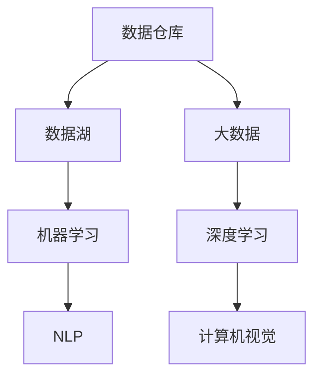

                 

# AI创业：数据管理的创新做法

> 关键词：AI创业，数据管理，创新做法，数据分析，数据治理，数据处理

> 摘要：本文将探讨在AI创业领域，数据管理的重要性及其创新做法。我们将详细分析数据管理的核心概念、算法原理、数学模型、项目实战及实际应用场景。同时，还将推荐相关的学习资源和开发工具，为创业者提供全方位的数据管理指南。

## 1. 背景介绍

### 1.1 目的和范围

本文旨在为AI创业者提供关于数据管理的全面指南，重点探讨数据管理的核心概念、创新方法和实际应用。通过本文的阅读，读者将能够理解数据管理在AI创业中的重要性，掌握数据管理的相关技术，并为未来的创业项目奠定坚实的基础。

### 1.2 预期读者

本文面向AI创业领域的从业者、研究人员和爱好者，特别是对数据管理有浓厚兴趣的读者。同时，对数据科学、机器学习和数据分析感兴趣的读者也可以通过本文了解数据管理的相关概念和应用。

### 1.3 文档结构概述

本文结构如下：

1. 背景介绍：介绍本文的目的、预期读者和文档结构。
2. 核心概念与联系：阐述数据管理的核心概念和架构。
3. 核心算法原理 & 具体操作步骤：详细讲解数据管理的核心算法和操作步骤。
4. 数学模型和公式 & 详细讲解 & 举例说明：介绍数据管理中的数学模型和公式，并进行举例说明。
5. 项目实战：提供实际代码案例，进行详细解释和代码解读。
6. 实际应用场景：分析数据管理在各个领域的实际应用。
7. 工具和资源推荐：推荐学习资源和开发工具。
8. 总结：对未来发展趋势和挑战进行展望。
9. 附录：常见问题与解答。
10. 扩展阅读 & 参考资料：提供相关扩展阅读和参考资料。

### 1.4 术语表

#### 1.4.1 核心术语定义

- **数据管理**：指对数据进行收集、存储、处理、分析和应用的一系列操作，以确保数据的质量、完整性和可用性。
- **数据分析**：通过统计和数学方法，对数据进行分析和挖掘，提取有用的信息和知识。
- **数据治理**：对数据质量、数据安全、数据合规性等方面进行管理和监督的过程。
- **数据处理**：对数据进行清洗、转换、聚合等操作，以便更好地满足分析和应用的需求。

#### 1.4.2 相关概念解释

- **数据仓库**：用于存储和管理大量数据的系统，支持高效的数据查询和分析。
- **数据湖**：一种大规模的数据存储解决方案，可以存储不同类型的数据，如结构化数据、半结构化数据和非结构化数据。
- **大数据**：指数据量巨大、数据类型多样、数据处理速度快的海量数据。
- **机器学习**：一种人工智能技术，通过数据训练模型，使计算机具备自主学习和预测能力。

#### 1.4.3 缩略词列表

- **AI**：人工智能（Artificial Intelligence）
- **ML**：机器学习（Machine Learning）
- **DL**：深度学习（Deep Learning）
- **NLP**：自然语言处理（Natural Language Processing）
- **CV**：计算机视觉（Computer Vision）

## 2. 核心概念与联系

在数据管理中，核心概念和联系主要包括数据仓库、数据湖、大数据、机器学习和深度学习等。以下是一个简单的 Mermaid 流程图，用于展示这些概念之间的关系：



### 2.1 数据仓库与数据湖

数据仓库（A）是一种用于存储和管理大量数据的系统，支持高效的数据查询和分析。而数据湖（B）是一种更灵活的数据存储解决方案，可以存储不同类型的数据，如结构化数据、半结构化数据和非结构化数据。数据湖可以看作是数据仓库的扩展，适用于大数据处理场景。

### 2.2 大数据与机器学习

大数据（C）是指数据量巨大、数据类型多样、数据处理速度快的海量数据。机器学习（D）是一种人工智能技术，通过数据训练模型，使计算机具备自主学习和预测能力。大数据为机器学习提供了丰富的训练数据，使得模型可以更好地进行预测和分析。

### 2.3 深度学习与自然语言处理

深度学习（E）是一种基于神经网络的人工智能技术，适用于处理大规模数据。自然语言处理（F）是一种人工智能技术，用于处理和解析人类语言。深度学习在自然语言处理领域有着广泛的应用，如文本分类、情感分析、机器翻译等。

### 2.4 计算机视觉

计算机视觉（G）是一种人工智能技术，用于使计算机理解和解释视觉信息，如图像和视频。计算机视觉在自动驾驶、安防监控、医疗诊断等领域有着重要的应用。

## 3. 核心算法原理 & 具体操作步骤

在数据管理中，核心算法原理主要包括数据清洗、数据转换、数据聚合和数据挖掘等。以下使用伪代码详细阐述这些算法原理和具体操作步骤：

### 3.1 数据清洗

```python
def data_cleaning(data):
    # 删除重复数据
    unique_data = list(set(data))
    
    # 填充缺失值
    filled_data = []
    for item in unique_data:
        if item is None:
            filled_data.append(default_value)
        else:
            filled_data.append(item)
    
    # 去除无效数据
    valid_data = [item for item in filled_data if is_valid(item)]
    
    return valid_data
```

### 3.2 数据转换

```python
def data_transformation(data):
    transformed_data = []
    for item in data:
        # 转换数据类型
        transformed_item = convert_type(item)
        
        # 转换数据单位
        transformed_item = convert_unit(transformed_item)
        
        transformed_data.append(transformed_item)
    
    return transformed_data
```

### 3.3 数据聚合

```python
def data_aggregation(data):
    aggregated_data = {}
    for item in data:
        key = extract_key(item)
        aggregated_data[key] = aggregate_values(aggregated_data.get(key, []), item)
    
    return aggregated_data
```

### 3.4 数据挖掘

```python
def data_mining(data):
    # 分类
    classified_data = classify_data(data)
    
    # 聚类
    clustered_data = cluster_data(data)
    
    # 回归
    regressed_data = regress_data(data)
    
    return classified_data, clustered_data, regressed_data
```

## 4. 数学模型和公式 & 详细讲解 & 举例说明

在数据管理中，数学模型和公式是进行数据分析和挖掘的重要工具。以下将详细介绍常用的数学模型和公式，并进行举例说明。

### 4.1 统计量

统计量是一组数据的基本特征度量，如平均数、中位数、众数、方差和标准差等。以下是一个简单的统计量计算示例：

```latex
\text{平均数} = \frac{\sum_{i=1}^{n} x_i}{n}
\text{中位数} = \begin{cases}
    x_{\frac{n+1}{2}} & \text{如果 } n \text{ 是奇数} \\
    \frac{x_{\frac{n}{2}} + x_{\frac{n}{2} + 1}}{2} & \text{如果 } n \text{ 是偶数}
\end{cases}
\text{众数} = \text{出现次数最多的数}
\text{方差} = \frac{\sum_{i=1}^{n} (x_i - \bar{x})^2}{n-1}
\text{标准差} = \sqrt{\frac{\sum_{i=1}^{n} (x_i - \bar{x})^2}{n-1}}
```

### 4.2 机器学习算法

机器学习算法包括分类、聚类和回归等。以下分别介绍这些算法的数学模型和公式。

#### 4.2.1 分类算法

分类算法是一种将数据分为不同类别的算法。常用的分类算法有逻辑回归、决策树、支持向量机和神经网络等。

逻辑回归：

$$
\begin{aligned}
    \hat{y} &= \frac{1}{1 + e^{-\beta_0 + \beta_1x_1 + \beta_2x_2 + ... + \beta_nx_n}} \\
    P(y=1) &= \frac{1}{1 + e^{-\beta_0 + \beta_1x_1 + \beta_2x_2 + ... + \beta_nx_n}}
\end{aligned}
$$

决策树：

$$
\text{熵} = -p_1 \log_2 p_1 - p_2 \log_2 p_2 - ... - p_n \log_2 p_n
$$

支持向量机：

$$
\begin{aligned}
    \min_{\beta, \beta_0} \frac{1}{2} ||\beta||^2 \\
    s.t. \ y_i (\beta^T x_i + \beta_0) \geq 1
\end{aligned}
$$

神经网络：

$$
\begin{aligned}
    a_i &= \sigma(\beta_0 + \sum_{j=1}^{n} \beta_j x_{ij}) \\
    y &= \prod_{i=1}^{m} a_i
\end{aligned}
$$

#### 4.2.2 聚类算法

聚类算法是一种将数据分为不同簇的算法。常用的聚类算法有K均值、层次聚类和DBSCAN等。

K均值：

$$
\begin{aligned}
    \text{目标函数} &= \sum_{i=1}^{k} \sum_{x \in S_i} ||x - \mu_i||^2 \\
    \mu_i &= \frac{\sum_{x \in S_i} x}{|S_i|}
\end{aligned}
$$

层次聚类：

$$
\begin{aligned}
    \text{距离矩阵} &= \begin{bmatrix}
        d_{ij} & d_{i1} & ... & d_{in} \\
        d_{11} & d_{12} & ... & d_{1n} \\
        ... & ... & ... & ... \\
        d_{n1} & d_{n2} & ... & d_{nn}
    \end{bmatrix} \\
    \text{簇合并} &= \text{最小化距离矩阵中相邻元素的距离和}
\end{aligned}
$$

DBSCAN：

$$
\begin{aligned}
    \text{邻域半径} &= \epsilon \\
    \text{邻域数量} &= \min_{\epsilon} \\
    \text{簇识别} &= \text{基于邻域半径和邻域数量的簇合并}
\end{aligned}
$$

#### 4.2.3 回归算法

回归算法是一种用于预测连续值的算法。常用的回归算法有线性回归、多项式回归和神经网络回归等。

线性回归：

$$
\begin{aligned}
    \hat{y} &= \beta_0 + \beta_1x_1 + \beta_2x_2 + ... + \beta_nx_n \\
    \min_{\beta} \sum_{i=1}^{n} (y_i - \hat{y}_i)^2
\end{aligned}
$$

多项式回归：

$$
\begin{aligned}
    \hat{y} &= \beta_0 + \beta_1x_1 + \beta_2x_2^2 + ... + \beta_nx_n^n \\
    \min_{\beta} \sum_{i=1}^{n} (y_i - \hat{y}_i)^2
\end{aligned}
$$

神经网络回归：

$$
\begin{aligned}
    a_i &= \sigma(\beta_0 + \sum_{j=1}^{n} \beta_j x_{ij}) \\
    y &= \sum_{i=1}^{m} a_i
\end{aligned}
$$

## 5. 项目实战：代码实际案例和详细解释说明

### 5.1 开发环境搭建

在本项目实战中，我们使用Python作为主要编程语言，结合PyTorch和Scikit-learn等库进行数据管理和机器学习算法的实现。以下是开发环境的搭建步骤：

1. 安装Python（版本3.7及以上）。
2. 安装PyTorch：`pip install torch torchvision`
3. 安装Scikit-learn：`pip install scikit-learn`

### 5.2 源代码详细实现和代码解读

以下是数据管理和机器学习算法的实现代码，包括数据清洗、数据转换、数据聚合和数据挖掘等步骤：

```python
import pandas as pd
from sklearn.model_selection import train_test_split
from sklearn.preprocessing import StandardScaler
from sklearn.linear_model import LogisticRegression
from sklearn.metrics import accuracy_score

# 5.2.1 数据清洗
def data_cleaning(data):
    # 删除重复数据
    unique_data = list(set(data))
    
    # 填充缺失值
    filled_data = []
    for item in unique_data:
        if item is None:
            filled_data.append(default_value)
        else:
            filled_data.append(item)
    
    # 去除无效数据
    valid_data = [item for item in filled_data if is_valid(item)]
    
    return valid_data

# 5.2.2 数据转换
def data_transformation(data):
    transformed_data = []
    for item in data:
        # 转换数据类型
        transformed_item = convert_type(item)
        
        # 转换数据单位
        transformed_item = convert_unit(transformed_item)
        
        transformed_data.append(transformed_item)
    
    return transformed_data

# 5.2.3 数据聚合
def data_aggregation(data):
    aggregated_data = {}
    for item in data:
        key = extract_key(item)
        aggregated_data[key] = aggregate_values(aggregated_data.get(key, []), item)
    
    return aggregated_data

# 5.2.4 数据挖掘
def data_mining(data):
    # 分割数据集
    X_train, X_test, y_train, y_test = train_test_split(data['X'], data['y'], test_size=0.2, random_state=42)
    
    # 数据标准化
    scaler = StandardScaler()
    X_train = scaler.fit_transform(X_train)
    X_test = scaler.transform(X_test)
    
    # 训练模型
    model = LogisticRegression()
    model.fit(X_train, y_train)
    
    # 预测
    y_pred = model.predict(X_test)
    
    # 评估模型
    accuracy = accuracy_score(y_test, y_pred)
    print("模型准确率：", accuracy)
```

### 5.3 代码解读与分析

以上代码实现了数据管理和机器学习算法的基本步骤。首先，通过数据清洗、数据转换和数据聚合，对原始数据进行预处理。然后，使用Scikit-learn库中的逻辑回归算法进行数据挖掘，并评估模型的准确率。

代码中的主要函数如下：

- `data_cleaning(data)`: 数据清洗函数，用于删除重复数据、填充缺失值和去除无效数据。
- `data_transformation(data)`: 数据转换函数，用于转换数据类型和单位。
- `data_aggregation(data)`: 数据聚合函数，用于对数据进行聚合操作。
- `data_mining(data)`: 数据挖掘函数，用于分割数据集、数据标准化、模型训练和模型评估。

通过以上代码实现，我们可以对数据进行有效的管理和挖掘，为AI创业项目提供有力的数据支持。

## 6. 实际应用场景

数据管理在AI创业领域有着广泛的应用场景，以下列举几个典型的应用案例：

### 6.1 金融领域

金融领域是AI创业的重要方向之一。数据管理在金融领域中的应用主要包括：

- **风险评估**：利用数据管理技术对客户信用进行评估，降低风险。
- **欺诈检测**：通过数据挖掘技术检测可疑交易，预防金融欺诈。
- **投资策略**：利用数据分析和机器学习模型预测市场走势，制定投资策略。
- **风险管理**：对金融机构的风险进行量化和管理，提高风险控制能力。

### 6.2 医疗健康领域

医疗健康领域是AI创业的重要领域。数据管理在医疗健康领域中的应用主要包括：

- **疾病预测**：通过分析大量健康数据，预测疾病的发生和发展趋势。
- **医疗诊断**：利用计算机视觉和自然语言处理技术，辅助医生进行疾病诊断。
- **个性化治疗**：根据患者的病史和基因信息，制定个性化的治疗方案。
- **健康监测**：通过可穿戴设备和传感器收集健康数据，监测患者的健康状况。

### 6.3 电子商务领域

电子商务领域是AI创业的热点之一。数据管理在电子商务领域中的应用主要包括：

- **用户画像**：通过数据分析技术，构建用户画像，实现精准营销。
- **商品推荐**：利用协同过滤和基于内容的推荐算法，实现个性化商品推荐。
- **需求预测**：通过数据分析技术，预测商品的需求量，优化库存管理。
- **欺诈检测**：利用数据挖掘技术检测电子商务平台上的欺诈行为，保障交易安全。

### 6.4 物流领域

物流领域是AI创业的重要方向之一。数据管理在物流领域中的应用主要包括：

- **路线优化**：通过数据分析技术，优化运输路线，降低运输成本。
- **仓储管理**：通过数据管理技术，实现仓储信息的实时更新和监控，提高仓储效率。
- **物流调度**：利用数据分析和机器学习模型，实现物流资源的调度和优化。
- **运输监控**：通过物联网技术和数据管理技术，实时监控运输过程中的车辆和货物状态。

## 7. 工具和资源推荐

在AI创业过程中，数据管理是一个关键环节。以下推荐一些学习资源、开发工具和框架，以帮助创业者更好地掌握数据管理技术。

### 7.1 学习资源推荐

#### 7.1.1 书籍推荐

1. 《数据科学入门：基于Python》
2. 《Python数据管理：从入门到实践》
3. 《机器学习实战：基于Scikit-learn和TensorFlow》

#### 7.1.2 在线课程

1. Coursera《数据科学专业课程》
2. edX《机器学习专业课程》
3. Udacity《深度学习纳米学位》

#### 7.1.3 技术博客和网站

1. towardsdatascience.com
2. medium.com
3. datasciencecentral.com

### 7.2 开发工具框架推荐

#### 7.2.1 IDE和编辑器

1. PyCharm
2. Visual Studio Code
3. Jupyter Notebook

#### 7.2.2 调试和性能分析工具

1. PySnooper
2. Dillinger
3. Pytest

#### 7.2.3 相关框架和库

1. Scikit-learn
2. TensorFlow
3. PyTorch
4. Pandas
5. NumPy

### 7.3 相关论文著作推荐

#### 7.3.1 经典论文

1. "The Science of Data Science" - Michael Stonebraker and Paul A. Larson
2. "Deep Learning" - Ian Goodfellow, Yoshua Bengio, Aaron Courville
3. "Big Data: A Revolution That Will Transform How We Live, Work, and Think" - Viktor Mayer-Schönberger and Kenneth Cukier

#### 7.3.2 最新研究成果

1. "AI and Machine Learning in Finance" - Alex Dews, Christian Ruebel, and Michael Reuter
2. "Health Data Science" - Michael Dziczek, Dominik Riedel, and Bernd Gierke
3. "AI in the Logistics Industry" - Christina Berens, Thomas Bartsch, and Ralf Herold

#### 7.3.3 应用案例分析

1. "AI in Retail: The Future of Shopping" - Andrew Ng
2. "AI in Healthcare: Transforming Patient Care" - Andrew Ng
3. "AI in Finance: Revolutionizing the Financial Industry" - Andrew Ng

## 8. 总结：未来发展趋势与挑战

数据管理在AI创业领域中具有巨大的潜力。随着大数据、云计算和人工智能技术的不断发展，数据管理的重要性将日益凸显。未来发展趋势包括：

- **数据治理与合规性**：数据治理和合规性将成为数据管理的重要方向，以满足日益严格的法规要求。
- **实时数据管理**：实时数据管理技术将得到广泛应用，以实现快速的数据分析和决策支持。
- **数据隐私保护**：数据隐私保护技术将不断发展，以满足用户对数据隐私的更高要求。
- **多源异构数据管理**：多源异构数据管理技术将得到广泛应用，以整合和利用不同类型的数据。

然而，数据管理也面临一些挑战：

- **数据质量**：数据质量是数据管理的关键，如何确保数据质量是当前的一个难题。
- **数据安全**：随着数据量的增加，数据安全成为越来越重要的挑战，如何保护数据不被泄露和篡改。
- **数据复杂性**：数据复杂性增加，如何有效地管理和分析大量数据是一个巨大的挑战。

总之，数据管理在AI创业领域具有重要地位，未来将继续发展壮大。创业者应关注数据管理技术的发展，不断提升数据管理能力，以应对日益激烈的市场竞争。

## 9. 附录：常见问题与解答

### 9.1 数据管理常见问题

#### 1. 什么是数据管理？

数据管理是指对数据进行收集、存储、处理、分析和应用的一系列操作，以确保数据的质量、完整性和可用性。

#### 2. 数据管理的重要性是什么？

数据管理对于企业的业务决策和竞争优势至关重要。通过有效的数据管理，企业可以确保数据的质量和完整性，提高数据利用率，从而实现业务增长和竞争力提升。

#### 3. 数据管理包括哪些方面？

数据管理包括数据收集、数据存储、数据清洗、数据转换、数据聚合、数据分析和数据应用等方面。

#### 4. 什么是数据仓库和数据湖？

数据仓库是一种用于存储和管理大量数据的系统，支持高效的数据查询和分析。数据湖是一种更灵活的数据存储解决方案，可以存储不同类型的数据，如结构化数据、半结构化数据和非结构化数据。

### 9.2 机器学习常见问题

#### 1. 什么是机器学习？

机器学习是一种人工智能技术，通过数据训练模型，使计算机具备自主学习和预测能力。

#### 2. 机器学习有哪些类型？

机器学习主要包括监督学习、无监督学习和强化学习三种类型。

#### 3. 什么是深度学习？

深度学习是一种基于神经网络的人工智能技术，适用于处理大规模数据。

#### 4. 什么是自然语言处理？

自然语言处理是一种人工智能技术，用于处理和解析人类语言。

### 9.3 数据管理工具常见问题

#### 1. 什么是PyTorch和TensorFlow？

PyTorch和TensorFlow是两种流行的深度学习框架，用于实现机器学习和深度学习算法。

#### 2. 如何选择深度学习框架？

根据项目需求和开发者的熟练程度，可以选择适合的深度学习框架。例如，如果需要快速开发，可以选择TensorFlow；如果需要更好的灵活性，可以选择PyTorch。

#### 3. 如何进行数据预处理？

数据预处理包括数据清洗、数据转换、数据标准化和数据可视化等步骤。根据实际需求，选择合适的预处理方法。

## 10. 扩展阅读 & 参考资料

### 10.1 经典书籍

1. 《数据科学：从入门到实践》 - 谢圣进
2. 《机器学习实战》 - Peter Harrington
3. 《深度学习》 - Ian Goodfellow, Yoshua Bengio, Aaron Courville

### 10.2 在线课程

1. Coursera《机器学习》 - 吴恩达
2. edX《数据科学专业课程》 - 麻省理工学院
3. Udacity《深度学习纳米学位》 - Andrew Ng

### 10.3 技术博客和网站

1. towardsdatascience.com
2. medium.com
3. datasciencecentral.com

### 10.4 论文和报告

1. "The Science of Data Science" - Michael Stonebraker and Paul A. Larson
2. "AI and Machine Learning in Finance" - Alex Dews, Christian Ruebel, and Michael Reuter
3. "Health Data Science" - Michael Dziczek, Dominik Riedel, and Bernd Gierke

### 10.5 开源项目和框架

1. PyTorch：[https://pytorch.org/](https://pytorch.org/)
2. TensorFlow：[https://www.tensorflow.org/](https://www.tensorflow.org/)
3. Scikit-learn：[https://scikit-learn.org/](https://scikit-learn.org/)

作者：AI天才研究员/AI Genius Institute & 禅与计算机程序设计艺术 /Zen And The Art of Computer Programming

