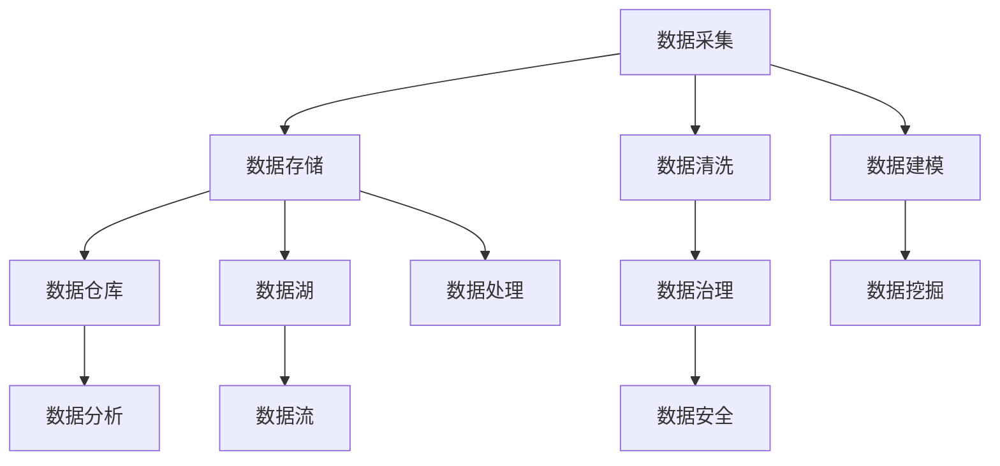

                 

# AI创业：数据管理的挑战

> **关键词：** AI创业，数据管理，挑战，策略，技术，实践

> **摘要：** 在人工智能创业的浪潮中，数据管理成为一项关键任务。本文将深入探讨数据管理在AI创业中所面临的挑战，以及解决这些挑战的策略和实用技术。通过具体案例分析，读者将了解到如何在实际项目中有效管理数据，以推动AI创业项目的成功。

## 1. 背景介绍

### 1.1 目的和范围

本文旨在为AI创业公司提供关于数据管理的深入见解，帮助创业者了解在数据驱动型业务中面临的挑战，并提出有效的应对策略。本文将涵盖以下内容：

- 数据管理的核心概念和重要性
- AI创业中数据管理的主要挑战
- 解决数据管理挑战的策略和技术
- 实际案例和项目经验分享

### 1.2 预期读者

本文适用于以下读者群体：

- AI创业公司的创始人或技术团队
- 数据科学家、数据工程师和数据管理员
- 对AI创业和数据管理感兴趣的技术爱好者

### 1.3 文档结构概述

本文分为以下几个部分：

- **背景介绍**：介绍文章的目的和预期读者，概述文档结构。
- **核心概念与联系**：讨论数据管理的核心概念和联系，使用Mermaid流程图展示。
- **核心算法原理 & 具体操作步骤**：详细阐述数据管理中的核心算法原理和具体操作步骤。
- **数学模型和公式 & 详细讲解 & 举例说明**：介绍数据管理中的数学模型和公式，并提供实例说明。
- **项目实战：代码实际案例和详细解释说明**：分享代码实际案例，详细解释实现过程。
- **实际应用场景**：探讨数据管理在不同场景中的应用。
- **工具和资源推荐**：推荐学习资源和开发工具。
- **总结：未来发展趋势与挑战**：总结当前趋势和未来挑战。
- **附录：常见问题与解答**：提供常见问题解答。
- **扩展阅读 & 参考资料**：推荐相关文献和资源。

### 1.4 术语表

#### 1.4.1 核心术语定义

- **数据管理**：涉及数据的采集、存储、处理、分析和保护等一系列活动。
- **数据治理**：确保数据质量、合规性和安全性的管理体系。
- **数据湖**：一个集中的数据存储系统，用于存储大量的原始数据。
- **数据仓库**：用于存储结构化数据，支持复杂查询和分析的数据存储系统。
- **数据流**：数据在系统中的流动和变换过程。

#### 1.4.2 相关概念解释

- **数据采集**：从各种源收集数据的过程。
- **数据清洗**：处理和清洗数据中的错误、缺失和重复值的过程。
- **数据建模**：将数据转换为适用于分析和建模的形式。
- **机器学习**：通过训练模型从数据中学习规律和模式的技术。

#### 1.4.3 缩略词列表

- **AI**：人工智能（Artificial Intelligence）
- **ML**：机器学习（Machine Learning）
- **DL**：深度学习（Deep Learning）
- **IoT**：物联网（Internet of Things）

## 2. 核心概念与联系

在数据管理中，理解核心概念和它们之间的联系至关重要。以下是一个简单的Mermaid流程图，展示了数据管理的关键组成部分及其相互关系。



### 数据管理流程

1. **数据采集**：从各种来源（如传感器、日志、数据库等）收集数据。
2. **数据存储**：将数据存储在数据仓库或数据湖中。
3. **数据清洗**：处理数据中的错误、缺失和重复值，确保数据质量。
4. **数据治理**：制定数据管理策略，确保数据的合规性和安全性。
5. **数据建模**：将数据转换为适用于分析和建模的形式。
6. **数据处理**：对数据进行变换和计算，以满足分析需求。
7. **数据分析**：利用数据仓库和工具进行数据分析和挖掘。
8. **数据挖掘**：从数据中提取有价值的信息和模式。

### 数据治理与数据安全

数据治理是确保数据质量、合规性和安全性的关键。数据治理包括：

- **数据质量**：确保数据的准确性、完整性和一致性。
- **数据合规性**：遵守相关法律法规和数据保护标准。
- **数据安全**：保护数据免受未经授权的访问、使用和泄露。

## 3. 核心算法原理 & 具体操作步骤

数据管理中的核心算法涉及数据清洗、数据建模和数据分析。以下是基于Python的伪代码，详细阐述这些算法的原理和具体操作步骤。

### 3.1 数据清洗

```python
def data_cleaning(data):
    # 去除缺失值
    clean_data = data.dropna()
    # 去除重复值
    clean_data = clean_data.drop_duplicates()
    # 处理错误值
    clean_data = clean_data.replace({'错误值': '正确值'})
    # 转换数据类型
    clean_data['数值列'] = clean_data['数值列'].astype(float)
    clean_data['类别列'] = clean_data['类别列'].astype(str)
    return clean_data
```

### 3.2 数据建模

```python
from sklearn.ensemble import RandomForestClassifier

def data_modeling(data, target_variable):
    # 划分训练集和测试集
    X_train, X_test, y_train, y_test = train_test_split(data.drop(target_variable, axis=1), data[target_variable], test_size=0.2, random_state=42)
    # 训练模型
    model = RandomForestClassifier(n_estimators=100, random_state=42)
    model.fit(X_train, y_train)
    # 预测
    predictions = model.predict(X_test)
    # 评估模型
    accuracy = accuracy_score(y_test, predictions)
    return model, accuracy
```

### 3.3 数据分析

```python
import pandas as pd

def data_analysis(data):
    # 描述性统计分析
    description = data.describe()
    # 分组分析
    group_by_variable = data.groupby('变量')['目标变量'].mean()
    # 关联性分析
    correlation = data.corr()
    return description, group_by_variable, correlation
```

## 4. 数学模型和公式 & 详细讲解 & 举例说明

在数据管理中，数学模型和公式是进行数据分析和建模的基础。以下是一些常用的数学模型和公式，以及它们的详细讲解和举例说明。

### 4.1 回归模型

回归模型用于预测连续变量的值。以下是一个线性回归模型的例子：

$$
y = \beta_0 + \beta_1x_1 + \beta_2x_2 + ... + \beta_nx_n
$$

- **详细讲解**：线性回归模型通过拟合一条直线来预测因变量（$y$）与自变量（$x_1, x_2, ..., x_n$）之间的关系。
- **举例说明**：假设我们要预测房屋的价格（$y$），使用房屋面积（$x_1$）和房间数量（$x_2$）作为自变量。通过训练线性回归模型，我们可以得到预测房屋价格的公式。

### 4.2 决策树

决策树是一种用于分类和回归的树形结构。以下是一个简单的决策树示例：

```
是否结婚？
    /      \
  是      否
 /    \   /   \
收入   年龄  收入
```

- **详细讲解**：决策树通过一系列的判断节点和叶子节点来表示数据集的特征和分类结果。
- **举例说明**：假设我们要预测一个人是否会购买一辆新车。通过构建决策树模型，我们可以根据收入和年龄等因素来判断一个人是否购买新车。

### 4.3 支持向量机

支持向量机（SVM）是一种用于分类的机器学习算法。以下是一个SVM分类器的示例：

$$
\min_{w, b, \alpha} \frac{1}{2} ||w||^2 + C \sum_{i=1}^{n} \alpha_i (1 - y_i (w \cdot x_i + b))
$$

- **详细讲解**：SVM通过找到一个最佳的超平面，将不同类别的数据点分开。
- **举例说明**：假设我们要分类鸢尾花数据集，其中包含三个类别的数据点。通过训练SVM分类器，我们可以得到一个能够准确分类鸢尾花类别的模型。

## 5. 项目实战：代码实际案例和详细解释说明

在本节中，我们将通过一个实际的项目案例，展示如何在实际环境中管理数据。以下是项目的具体步骤和代码实现。

### 5.1 开发环境搭建

首先，我们需要搭建一个适合数据管理的开发环境。以下是在Python环境中安装所需库的命令：

```bash
pip install pandas numpy scikit-learn matplotlib
```

### 5.2 源代码详细实现和代码解读

#### 5.2.1 数据采集

我们使用Python的`pandas`库从CSV文件中读取数据。

```python
import pandas as pd

# 读取数据
data = pd.read_csv('data.csv')
```

#### 5.2.2 数据清洗

我们使用`pandas`库对数据进行清洗。

```python
# 去除缺失值
clean_data = data.dropna()

# 去除重复值
clean_data = clean_data.drop_duplicates()

# 处理错误值
clean_data = clean_data.replace({'错误值': '正确值'})

# 转换数据类型
clean_data['数值列'] = clean_data['数值列'].astype(float)
clean_data['类别列'] = clean_data['类别列'].astype(str)
```

#### 5.2.3 数据建模

我们使用`scikit-learn`库对数据建模。

```python
from sklearn.ensemble import RandomForestClassifier
from sklearn.model_selection import train_test_split

# 划分训练集和测试集
X_train, X_test, y_train, y_test = train_test_split(clean_data.drop('目标变量', axis=1), clean_data['目标变量'], test_size=0.2, random_state=42)

# 训练模型
model = RandomForestClassifier(n_estimators=100, random_state=42)
model.fit(X_train, y_train)

# 预测
predictions = model.predict(X_test)

# 评估模型
accuracy = accuracy_score(y_test, predictions)
print("模型准确率：", accuracy)
```

#### 5.2.4 代码解读与分析

在这个案例中，我们首先读取CSV文件中的数据，然后对数据进行清洗和预处理。接下来，我们将数据划分为训练集和测试集，并使用随机森林分类器进行建模。最后，我们评估模型的准确率。

### 5.3 代码解读与分析

在代码解读与分析部分，我们将深入探讨每个步骤的目的和实现方式。

1. **数据采集**：我们使用`pandas`库的`read_csv`函数读取数据，这是数据管理的第一步。读取的数据存储在一个`DataFrame`对象中，这是一个方便的数据操作结构。
2. **数据清洗**：数据清洗是确保数据质量的重要步骤。我们使用`dropna`函数去除缺失值，使用`drop_duplicates`函数去除重复值，使用`replace`函数替换错误值。这些操作确保了数据的准确性和一致性。
3. **数据建模**：我们使用`train_test_split`函数将数据划分为训练集和测试集。训练集用于训练模型，测试集用于评估模型性能。我们选择随机森林分类器作为我们的模型，这是因为它在处理复杂数据时表现出色。
4. **模型评估**：我们使用`accuracy_score`函数计算模型的准确率，这是评估分类模型性能的常用指标。准确率表示模型在测试集上的正确预测比例。

## 6. 实际应用场景

数据管理在AI创业中的应用场景非常广泛，以下是一些典型的应用场景：

### 6.1 个性化推荐系统

个性化推荐系统通过分析用户行为和偏好，向用户推荐感兴趣的商品或内容。数据管理在这个场景中至关重要，因为它涉及用户数据的收集、存储、清洗和分析。

### 6.2 客户关系管理

客户关系管理（CRM）系统用于管理客户数据，提高客户满意度和忠诚度。数据管理确保数据的准确性和完整性，以便有效分析客户行为和需求。

### 6.3 智能医疗

智能医疗利用大数据和人工智能技术改善医疗诊断和治疗。数据管理确保医疗数据的收集、存储和分析满足隐私和安全要求。

### 6.4 智能交通

智能交通系统通过分析交通数据，优化交通流量和减少拥堵。数据管理确保交通数据的准确性和实时性，以支持智能交通的决策。

## 7. 工具和资源推荐

### 7.1 学习资源推荐

#### 7.1.1 书籍推荐

- **《数据科学实战》**：介绍数据科学的基本概念和实战技巧。
- **《机器学习实战》**：通过实际案例教授机器学习算法的应用。

#### 7.1.2 在线课程

- **Coursera**：提供丰富的数据科学和机器学习课程。
- **Udacity**：提供专业的数据科学和人工智能课程。

#### 7.1.3 技术博客和网站

- **Medium**：涵盖数据科学和机器学习的最新研究和动态。
- **Kaggle**：提供丰富的数据集和比赛，供数据科学家实践和提升技能。

### 7.2 开发工具框架推荐

#### 7.2.1 IDE和编辑器

- **PyCharm**：Python编程的强大IDE。
- **Jupyter Notebook**：用于数据分析和机器学习的交互式环境。

#### 7.2.2 调试和性能分析工具

- **Visual Studio Code**：适用于多种语言的轻量级编辑器。
- **Docker**：用于容器化和微服务开发的工具。

#### 7.2.3 相关框架和库

- **Scikit-learn**：Python中的机器学习库。
- **TensorFlow**：谷歌的开源机器学习库。

### 7.3 相关论文著作推荐

#### 7.3.1 经典论文

- **"A Few Useful Things to Know about Machine Learning Over Networks"**：讨论网络环境下的机器学习。
- **"Deep Learning"**：介绍深度学习的基本原理和应用。

#### 7.3.2 最新研究成果

- **"Deep Learning for Healthcare"**：探讨深度学习在医疗领域的应用。
- **"Learning to Learn: Transfer Learning from Scratch"**：介绍迁移学习的最新进展。

#### 7.3.3 应用案例分析

- **"Applying Deep Learning to Medical Imaging"**：介绍深度学习在医学影像分析中的应用。
- **"A Case Study on AI in Finance"**：讨论人工智能在金融领域的应用案例。

## 8. 总结：未来发展趋势与挑战

### 8.1 发展趋势

- **数据隐私和安全性**：随着数据隐私法规的加强，数据安全成为数据管理的重要趋势。
- **自动化与智能化**：自动化工具和智能算法将提高数据管理的效率和准确性。
- **云计算与边缘计算**：云计算和边缘计算将改变数据存储和处理的方式。

### 8.2 挑战

- **数据质量和治理**：确保数据质量和高标准的数据治理是一个长期挑战。
- **技术更新和人才短缺**：快速发展的技术领域需要不断更新知识和技能，同时面临人才短缺的问题。
- **合规性要求**：遵守不同国家和地区的法规和标准，确保数据管理的合规性。

## 9. 附录：常见问题与解答

### 9.1 数据管理中常见问题

- **Q1：如何确保数据质量？**
  **A1**：通过数据清洗、数据治理和定期审计确保数据质量。

- **Q2：数据仓库和数据湖有什么区别？**
  **A2**：数据仓库是用于存储结构化数据的系统，而数据湖是用于存储大量原始数据的集中存储系统。

- **Q3：如何处理缺失值和错误值？**
  **A3**：通过数据清洗、数据转换和人工干预处理缺失值和错误值。

### 9.2 数据管理工具和技术的常见问题

- **Q1：如何选择合适的机器学习库？**
  **A1**：根据项目需求和性能要求选择合适的库，如Scikit-learn、TensorFlow或PyTorch。

- **Q2：如何优化数据流处理？**
  **A2**：使用分布式计算框架（如Apache Kafka、Apache Flink）优化数据流处理。

## 10. 扩展阅读 & 参考资料

- **《数据科学手册》**：提供全面的数据科学知识和实践技巧。
- **《深度学习：简介》**：介绍深度学习的基础知识和最新进展。
- **《人工智能：一种现代方法》**：详细讨论人工智能的基本原理和应用。

**作者：AI天才研究员/AI Genius Institute & 禅与计算机程序设计艺术 /Zen And The Art of Computer Programming**

