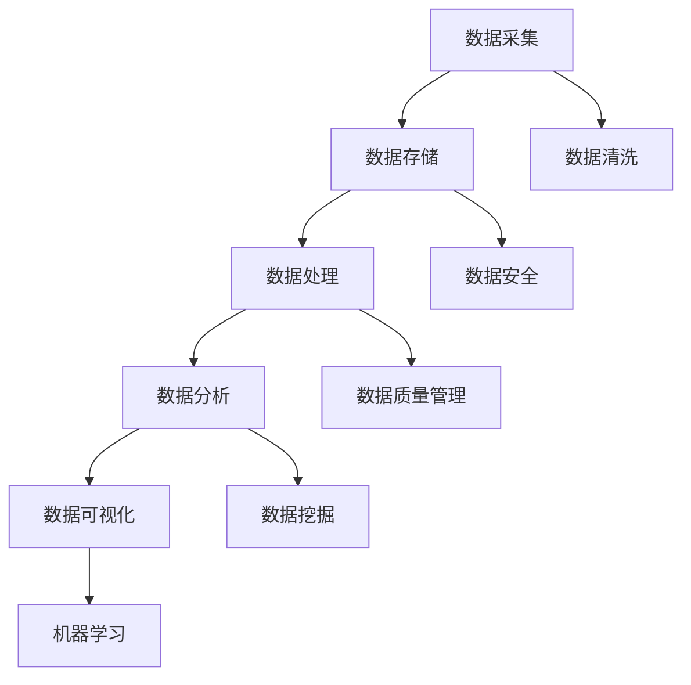

                 

# AI创业：数据管理的核心

> **关键词：** AI创业、数据管理、大数据、数据分析、数据架构、数据安全、数据质量

> **摘要：** 在AI创业的热潮中，数据管理成为企业成功的核心要素。本文将深入探讨数据管理的核心概念、算法原理、数学模型、实战案例以及未来发展趋势，帮助创业者在数据驱动的AI领域取得成功。

## 1. 背景介绍

### 1.1 目的和范围

本文旨在为AI创业公司提供数据管理的全方位指导。我们将探讨数据管理的核心概念、技术架构、算法原理和实际操作，帮助创业者理解和应用数据管理的重要性，从而在竞争激烈的市场中脱颖而出。

### 1.2 预期读者

本文面向AI创业公司的创始人、CTO、数据科学家以及对此领域感兴趣的技术爱好者。读者应具备基本的计算机科学和数据科学知识，以便更好地理解本文内容。

### 1.3 文档结构概述

本文分为十个部分：

1. **背景介绍**：介绍文章的目的、读者和结构。
2. **核心概念与联系**：介绍数据管理的核心概念和相关流程。
3. **核心算法原理 & 具体操作步骤**：讲解数据管理中的核心算法原理和具体操作步骤。
4. **数学模型和公式 & 详细讲解 & 举例说明**：介绍数据管理中的数学模型和公式，并通过实际案例进行说明。
5. **项目实战：代码实际案例和详细解释说明**：提供实际项目的代码案例和详细解释。
6. **实际应用场景**：探讨数据管理在不同领域的实际应用。
7. **工具和资源推荐**：推荐学习资源和开发工具。
8. **总结：未来发展趋势与挑战**：总结数据管理的未来发展趋势和挑战。
9. **附录：常见问题与解答**：解答读者可能遇到的问题。
10. **扩展阅读 & 参考资料**：提供更多的扩展阅读资源。

### 1.4 术语表

#### 1.4.1 核心术语定义

- **数据管理**：对数据进行采集、存储、处理、分析和保护的过程。
- **大数据**：指数据量巨大、数据类型繁多、数据生成速度极快的数据集合。
- **数据分析**：使用统计方法和算法从数据中提取有价值的信息和知识。
- **数据架构**：数据管理和存储的结构设计。
- **数据安全**：确保数据在存储、传输和处理过程中不被未授权访问和篡改。
- **数据质量**：数据的准确性、完整性、一致性和可靠性。

#### 1.4.2 相关概念解释

- **数据仓库**：用于存储和管理大量数据的系统。
- **数据湖**：一种用于存储原始数据的分布式存储系统，支持各种数据格式。
- **数据挖掘**：从大量数据中提取有价值的信息和知识的过程。
- **机器学习**：一种让计算机从数据中学习并做出决策的技术。

#### 1.4.3 缩略词列表

- **AI**：人工智能（Artificial Intelligence）
- **ML**：机器学习（Machine Learning）
- **DL**：深度学习（Deep Learning）
- **NLP**：自然语言处理（Natural Language Processing）
- **Hadoop**：一个开源的数据处理框架。
- **Spark**：一个开源的大数据处理框架。

## 2. 核心概念与联系

数据管理是AI创业的核心，其涉及多个关键概念和流程。以下是数据管理的核心概念和其相互关系的Mermaid流程图：



### 2.1 数据采集

数据采集是数据管理的第一步，涉及到从各种来源获取数据。这些来源可能包括传感器、网站、应用程序和数据库。数据采集的关键是确保数据的准确性和完整性。

### 2.2 数据存储

数据存储是将数据存储在持久化存储系统中，如关系型数据库、NoSQL数据库、数据仓库和数据湖。数据存储的选择取决于数据的类型和规模。

### 2.3 数据处理

数据处理是对数据进行清洗、转换和归一化等操作，以便于后续的数据分析和机器学习。数据处理是数据管理中至关重要的一环。

### 2.4 数据分析

数据分析是通过统计方法和算法从数据中提取有价值的信息和知识。数据分析可以帮助企业做出数据驱动的决策。

### 2.5 数据可视化

数据可视化是将数据以图形化的方式呈现，使其更易于理解和分析。数据可视化是数据分析和数据管理中的重要组成部分。

### 2.6 数据安全

数据安全是确保数据在存储、传输和处理过程中不被未授权访问和篡改。数据安全是数据管理中的关键问题。

### 2.7 数据质量管理

数据质量管理是确保数据的准确性、完整性、一致性和可靠性。数据质量管理是数据管理中的重要环节。

### 2.8 数据挖掘

数据挖掘是从大量数据中提取有价值的信息和知识的过程。数据挖掘可以帮助企业发现潜在的商业机会。

### 2.9 机器学习

机器学习是一种让计算机从数据中学习并做出决策的技术。机器学习是AI创业中不可或缺的一部分。

## 3. 核心算法原理 & 具体操作步骤

在数据管理中，核心算法原理至关重要。以下是数据管理中的几个核心算法原理和具体操作步骤：

### 3.1 数据清洗算法

数据清洗是数据处理的第一步，其目的是去除数据中的噪声和不一致之处。以下是数据清洗算法的伪代码：

```plaintext
function dataCleaning(data):
    for each record in data:
        remove missing values
        remove duplicates
        standardize data (e.g., normalization, standardization)
        handle outliers
    return cleanedData
```

### 3.2 数据聚合算法

数据聚合是将多个数据源中的数据合并为一个统一的数据集。以下是数据聚合算法的伪代码：

```plaintext
function dataAggregation(dataSources):
    aggregatedData = empty data structure
    for each data source in dataSources:
        for each record in dataSource:
            append record to aggregatedData
    return aggregatedData
```

### 3.3 数据挖掘算法

数据挖掘是从大量数据中提取有价值的信息和知识的过程。以下是常见的数据挖掘算法之一：K-means聚类算法的伪代码：

```plaintext
function kMeansClustering(data, k):
    initialize centroids
    while not converged:
        for each record in data:
            assign record to the nearest centroid
        update centroids
    return clusters
```

### 3.4 机器学习算法

机器学习算法是让计算机从数据中学习并做出决策的技术。以下是线性回归算法的伪代码：

```plaintext
function linearRegression(data, features, target):
    X = features
    y = target
    theta = [0, 0, ..., 0]  # Initialize parameters
    learningRate = 0.01
    numIterations = 1000

    for i = 1 to numIterations:
        predictions = X * theta
        error = predictions - y
        theta = theta - learningRate * (X.T * error)

    return theta
```

## 4. 数学模型和公式 & 详细讲解 & 举例说明

在数据管理中，数学模型和公式起着至关重要的作用。以下是几个关键数学模型和公式的详细讲解及举例说明：

### 4.1 概率论

概率论是数据分析和数据挖掘的基础。以下是一个常见的概率模型：贝叶斯定理。

贝叶斯定理公式：

$$ P(A|B) = \frac{P(B|A) \cdot P(A)}{P(B)} $$

举例说明：

假设我们想计算在给定一个病人患有某种疾病（B）的条件下，该病人是高风险人群（A）的概率。已知：

- \( P(A) \) = 高风险人群的概率 = 0.2
- \( P(B|A) \) = 高风险人群中患病概率 = 0.9
- \( P(B|¬A) \) = 非高风险人群中患病概率 = 0.1

则：

$$ P(A|B) = \frac{P(B|A) \cdot P(A)}{P(B|A) \cdot P(A) + P(B|¬A) \cdot P(¬A)} = \frac{0.9 \cdot 0.2}{0.9 \cdot 0.2 + 0.1 \cdot 0.8} = 0.945 $$

### 4.2 统计学

统计学是数据分析的基础。以下是一个常见统计学模型：线性回归模型。

线性回归模型公式：

$$ y = \beta_0 + \beta_1 \cdot x + \epsilon $$

其中：

- \( y \) 是因变量
- \( x \) 是自变量
- \( \beta_0 \) 是截距
- \( \beta_1 \) 是斜率
- \( \epsilon \) 是误差项

举例说明：

假设我们想预测一家商店的月销售额（\( y \)），根据历史数据发现销售额与广告支出（\( x \)）之间存在线性关系。通过最小二乘法，我们得到线性回归模型如下：

$$ y = 1000 + 200 \cdot x + \epsilon $$

例如，如果广告支出为5000元，则预测销售额为：

$$ y = 1000 + 200 \cdot 5000 + \epsilon = 1100000 + \epsilon $$

### 4.3 机器学习

机器学习是数据挖掘和人工智能的核心。以下是一个常见的机器学习模型：支持向量机（SVM）。

支持向量机公式：

$$ \hat{w} = arg\min_{w,b}\frac{1}{2}\|w\|^2 \quad s.t.\; y_i(\langle w, x_i \rangle + b) \geq 1 $$

其中：

- \( w \) 是权重向量
- \( b \) 是偏置项
- \( x_i \) 是数据点
- \( y_i \) 是标签

举例说明：

假设我们有一个二分类问题，数据集为：

$$
\begin{array}{c|c|c}
x_i & y_i \\
\hline
(1, 2) & 1 \\
(2, 3) & 1 \\
(3, 4) & 0 \\
(4, 5) & 0 \\
\end{array}
$$

通过SVM模型，我们希望找到一个最优的决策边界。经过训练，我们得到：

$$ \hat{w} = [1, 2]^T, \; b = -1 $$

则决策边界为：

$$ \langle w, x \rangle + b = 1 \cdot x_1 + 2 \cdot x_2 - 1 = x_1 + 2x_2 - 1 = 0 $$

## 5. 项目实战：代码实际案例和详细解释说明

在本节中，我们将通过一个实际案例展示如何使用Python进行数据管理。这个案例是一个简单的客户数据分析项目，我们将使用Pandas、NumPy和Scikit-learn等库来完成以下任务：

1. 数据采集与预处理
2. 数据聚合与汇总
3. 数据可视化
4. 数据挖掘与机器学习

### 5.1 开发环境搭建

首先，确保安装了Python 3.8及以上版本，以及以下库：

```bash
pip install pandas numpy scikit-learn matplotlib seaborn
```

### 5.2 源代码详细实现和代码解读

```python
import pandas as pd
import numpy as np
from sklearn.model_selection import train_test_split
from sklearn.preprocessing import StandardScaler
from sklearn.linear_model import LinearRegression
import matplotlib.pyplot as plt
import seaborn as sns

# 5.2.1 数据采集与预处理
# 假设我们有一个CSV文件，其中包含客户的数据，如年龄、收入、职业等
data = pd.read_csv('customer_data.csv')

# 检查数据质量
print(data.head())
print(data.info())

# 处理缺失值
data.dropna(inplace=True)

# 处理分类数据（例如，将职业转换为数字编码）
data['occupation'] = data['occupation'].astype('category').cat.codes

# 5.2.2 数据聚合与汇总
# 计算每个职业的平均收入
occupation_summary = data.groupby('occupation')['income'].mean()
print(occupation_summary)

# 5.2.3 数据可视化
# 绘制年龄与收入的关系图
sns.scatterplot(x='age', y='income', data=data)
plt.xlabel('年龄')
plt.ylabel('收入')
plt.title('年龄与收入的关系')
plt.show()

# 5.2.4 数据挖掘与机器学习
# 将数据分为特征集和标签集
X = data[['age', 'income', 'occupation']]
y = data['target']  # 假设有一个目标变量

# 数据标准化
scaler = StandardScaler()
X_scaled = scaler.fit_transform(X)

# 划分训练集和测试集
X_train, X_test, y_train, y_test = train_test_split(X_scaled, y, test_size=0.2, random_state=42)

# 训练线性回归模型
regressor = LinearRegression()
regressor.fit(X_train, y_train)

# 预测测试集结果
y_pred = regressor.predict(X_test)

# 评估模型性能
print(f'R^2 Score: {regressor.score(X_test, y_test)}')
```

### 5.3 代码解读与分析

1. **数据采集与预处理**：
   - 使用Pandas读取CSV文件。
   - 检查数据质量，去除缺失值。
   - 对分类数据进行编码。

2. **数据聚合与汇总**：
   - 使用Pandas的groupby函数计算每个职业的平均收入。

3. **数据可视化**：
   - 使用Seaborn绘制年龄与收入的关系图。

4. **数据挖掘与机器学习**：
   - 将数据分为特征集和标签集。
   - 使用StandardScaler对特征进行标准化处理。
   - 划分训练集和测试集。
   - 使用线性回归模型训练模型。
   - 预测测试集结果并评估模型性能。

通过这个实际案例，我们展示了如何使用Python进行数据管理，包括数据采集、预处理、聚合、可视化以及数据挖掘和机器学习。这些步骤是AI创业中数据管理的关键环节，创业者可以参考这些步骤来优化自己的数据管理流程。

## 6. 实际应用场景

数据管理在AI创业中的实际应用场景非常广泛，以下是几个典型例子：

### 6.1 金融科技

在金融科技（FinTech）领域，数据管理至关重要。金融机构需要处理大量的交易数据、客户数据和市场数据，以便进行风险控制、客户细分和投资策略优化。数据管理可以帮助金融机构实现以下目标：

- **风险控制**：通过对交易数据的实时监控和分析，识别异常交易行为和潜在风险。
- **客户细分**：分析客户的交易行为、风险偏好和消费习惯，为不同客户群体提供定制化的产品和服务。
- **投资策略优化**：利用市场数据和历史交易数据，构建投资模型，优化投资组合。

### 6.2 电子商务

在电子商务领域，数据管理可以帮助企业实现以下目标：

- **个性化推荐**：通过分析用户的历史购买记录和浏览行为，推荐用户可能感兴趣的商品。
- **需求预测**：利用销售数据和历史趋势，预测未来的市场需求，优化库存管理和供应链。
- **客户体验优化**：通过分析客户反馈和行为数据，优化客户体验，提高客户满意度和忠诚度。

### 6.3 医疗健康

在医疗健康领域，数据管理对于提升医疗服务质量和效率至关重要。以下是一些应用场景：

- **电子病历管理**：通过电子病历系统，实现患者信息的集中管理和共享，提高医疗服务的效率。
- **疾病预测与预防**：利用患者健康数据、遗传数据和医疗知识库，预测疾病风险，制定个性化的预防措施。
- **临床研究**：通过数据管理平台，收集和分析临床数据，加速新药研发和临床试验。

### 6.4 智能制造

在智能制造领域，数据管理可以提升生产效率和产品质量。以下是一些应用场景：

- **设备监控与维护**：通过实时监控设备运行数据，预测设备故障，制定预防性维护计划。
- **生产优化**：通过分析生产数据，优化生产流程，降低生产成本，提高生产效率。
- **质量管理**：通过质量检测数据，识别不良品，优化生产工艺，提高产品质量。

这些实际应用场景展示了数据管理在AI创业中的重要性。创业者可以根据自己的业务需求，利用数据管理技术提升企业竞争力。

## 7. 工具和资源推荐

为了帮助AI创业者更高效地进行数据管理，以下是学习资源、开发工具和框架的推荐：

### 7.1 学习资源推荐

#### 7.1.1 书籍推荐

- 《数据科学入门：Python编程实战》（Python Data Science Handbook）
- 《机器学习实战》（Machine Learning in Action）
- 《大数据之路：阿里巴巴大数据实践》（The Data Warehouse Toolkit）

#### 7.1.2 在线课程

- Coursera的《数据科学专项课程》
- edX的《深度学习专项课程》
- Udacity的《机器学习纳米学位》

#### 7.1.3 技术博客和网站

- Medium的《数据科学专栏》
- Towards Data Science
- KDNuggets

### 7.2 开发工具框架推荐

#### 7.2.1 IDE和编辑器

- PyCharm
- Jupyter Notebook
- VS Code

#### 7.2.2 调试和性能分析工具

- WSL (Windows Subsystem for Linux)
- Docker
- Jupyter Notebook的Debug插件

#### 7.2.3 相关框架和库

- TensorFlow
- PyTorch
- Scikit-learn
- Pandas
- NumPy
- Matplotlib
- Seaborn

通过使用这些工具和资源，AI创业者可以更高效地进行数据管理，提升AI项目的成功率。

## 8. 总结：未来发展趋势与挑战

数据管理在AI创业中的重要性不言而喻，随着数据规模的不断增长和数据分析技术的不断发展，数据管理在未来将呈现出以下发展趋势：

### 8.1 数据隐私保护

随着数据隐私法规的不断完善，如欧盟的《通用数据保护条例》（GDPR）和加州的《消费者隐私法案》（CCPA），数据隐私保护将成为数据管理的重要方向。企业需要采取更加严格的数据保护措施，确保用户数据的安全和隐私。

### 8.2 自动化与智能化

数据管理流程将逐渐自动化和智能化，利用机器学习和自然语言处理等技术，实现数据清洗、数据聚合、数据可视化和数据挖掘的自动化。这将大大提高数据管理的效率和准确性。

### 8.3 跨领域应用

数据管理技术将在更多领域得到应用，如医疗健康、金融服务、智能交通和智慧城市等。不同领域的数据管理需求将促使数据管理技术不断迭代和升级。

### 8.4 数据治理与合规

数据治理和数据合规将成为数据管理的重要议题。企业需要建立完善的数据治理体系，确保数据的准确性、完整性和一致性，同时遵守相关法律法规。

然而，随着数据管理技术的发展，创业者也将面临以下挑战：

### 8.5 数据安全和隐私

在数据隐私保护日益严格的背景下，如何确保数据安全和隐私成为一大挑战。企业需要采取先进的技术手段和严格的管理措施，保护用户数据。

### 8.6 复杂性管理

随着数据管理技术的不断演进，数据管理系统的复杂度也在增加。创业者需要具备较高的技术能力和管理能力，以应对数据管理系统的复杂性。

### 8.7 技术更新和迭代

数据管理技术更新速度较快，创业者需要不断学习和掌握新技术，以保持竞争优势。技术更新和迭代将带来巨大的时间和经济成本。

总之，数据管理是AI创业的核心，创业者需要密切关注数据管理技术的发展趋势，积极应对挑战，充分利用数据管理技术提升企业竞争力。

## 9. 附录：常见问题与解答

### 9.1 数据管理的关键问题

**Q1：数据管理的重要性是什么？**

A1：数据管理对于企业的成功至关重要。它确保数据的准确性、完整性和一致性，从而支持数据驱动的决策。数据管理还能提高数据安全性，保护企业免受数据泄露和滥用的风险。

**Q2：什么是数据质量管理？**

A2：数据质量管理是指确保数据准确性、完整性、一致性和可靠性的过程。它包括数据清洗、数据集成、数据转换和数据标准化等步骤。

**Q3：如何确保数据安全？**

A3：确保数据安全的方法包括加密数据存储、使用强密码和双重认证、定期更新安全补丁、限制数据访问权限、监控数据访问和使用情况等。

### 9.2 数据管理工具和技术的选择

**Q4：数据仓库和数据湖有什么区别？**

A4：数据仓库是用于存储和管理结构化数据的高级数据管理工具，而数据湖是用于存储各种类型（结构化、半结构化和非结构化）原始数据的分布式存储系统。

**Q5：机器学习和数据挖掘有什么区别？**

A5：机器学习是一种让计算机从数据中学习并做出预测或决策的技术，而数据挖掘是从大量数据中提取有价值信息和知识的过程。机器学习通常用于数据挖掘任务。

**Q6：如何选择适合的数据管理工具和库？**

A6：选择数据管理工具和库时，应考虑以下因素：

- **业务需求**：根据业务需求选择合适的工具和库。
- **数据类型**：选择支持所需数据类型和格式的工具和库。
- **性能**：选择具有高性能和可扩展性的工具和库。
- **社区支持**：选择拥有活跃社区和支持文档的工具和库。
- **成本**：考虑预算和成本，选择具有成本效益的工具和库。

### 9.3 数据管理和AI创业

**Q7：如何利用数据管理技术提升AI创业项目的成功率？**

A7：利用数据管理技术提升AI创业项目的成功率的方法包括：

- **数据驱动决策**：利用数据分析和机器学习模型，支持数据驱动的决策。
- **优化数据质量**：确保数据的准确性、完整性和一致性，提高机器学习模型的性能。
- **自动化数据管理**：利用自动化工具和平台，简化数据管理流程，提高效率。
- **数据安全与隐私**：采取严格的数据安全措施，确保数据的安全和隐私。
- **持续学习和迭代**：不断学习和应用新的数据管理技术，提升数据管理的效率和质量。

通过以上问题和解答，读者可以更好地理解数据管理在AI创业中的关键作用，以及如何选择和利用数据管理技术提升项目的成功率。

## 10. 扩展阅读 & 参考资料

为了进一步探索数据管理的深度和广度，以下是推荐的一些扩展阅读和参考资料：

### 10.1 经典书籍

- 《数据科学手册》（Data Science from Scratch） - Joel Grus
- 《大数据时代》（Big Data: A Revolution That Will Transform How We Live, Work, and Think） - Viktor Mayer-Schoenberger 和 Kenneth Cukier
- 《深度学习》（Deep Learning） - Ian Goodfellow、Yoshua Bengio 和 Aaron Courville

### 10.2 在线课程

- Coursera的《数据科学专业》
- edX的《深度学习和自然语言处理》
- Udacity的《机器学习工程师纳米学位》

### 10.3 技术博客和网站

- [Medium](https://medium.com/towards-data-science)
- [KDNuggets](https://www.kdnuggets.com/)
- [DataCamp](https://www.datacamp.com/)

### 10.4 相关论文

- 《大规模并行机器学习：MapReduce框架下的随机梯度下降》（Large Scale Machine Learning: Algorithms, Models, and Methods） - Eduardo Morales, Guido Sanguinetti, and Marc Pujol
- 《分布式机器学习：算法与系统设计》（Distributed Machine Learning: Algorithms, Systems and Applications） - John C. Duchi, Sanjoy Dasgupta, and Martin Wainwright

### 10.5 应用案例分析

- 《阿里巴巴的分布式数据管理实践》
- 《谷歌的大数据管理和机器学习平台：Bigtable、TensorFlow和MapReduce》
- 《亚马逊的智能推荐系统：数据驱动的方法和实践》

通过这些扩展阅读和参考资料，读者可以进一步深入了解数据管理的理论和实践，为AI创业提供更多的启发和指导。

### 作者信息

**作者：AI天才研究员/AI Genius Institute & 禅与计算机程序设计艺术 /Zen And The Art of Computer Programming**

