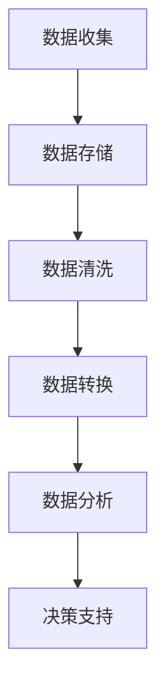

                 

# AI创业：数据管理的核心要点

> **关键词**：AI创业，数据管理，数据处理，数据安全，数据质量控制，数据架构设计

> **摘要**：本文深入探讨了AI创业公司在数据管理方面的核心要点，包括数据处理、数据质量控制、数据安全、数据架构设计等。通过具体案例和操作步骤，帮助AI创业者理解和实施有效的数据管理策略，为公司的可持续发展奠定基础。

## 1. 背景介绍

### 1.1 目的和范围

本文旨在为AI创业公司提供关于数据管理的全面指南，帮助创业者理解数据管理的核心要点，并掌握有效的数据管理策略。本文将涵盖以下内容：

- 数据处理的策略和方法
- 数据质量控制的关键指标和措施
- 数据安全的防护手段
- 数据架构设计的原则和最佳实践

### 1.2 预期读者

本文适合以下读者：

- AI创业公司的创始人或技术负责人
- 数据科学家、数据工程师和数据分析师
- 对数据管理感兴趣的技术人员和管理者

### 1.3 文档结构概述

本文将按照以下结构进行论述：

- 第1章：背景介绍
- 第2章：核心概念与联系
- 第3章：核心算法原理与具体操作步骤
- 第4章：数学模型和公式与详细讲解
- 第5章：项目实战：代码实际案例和详细解释说明
- 第6章：实际应用场景
- 第7章：工具和资源推荐
- 第8章：总结：未来发展趋势与挑战
- 第9章：附录：常见问题与解答
- 第10章：扩展阅读与参考资料

### 1.4 术语表

#### 1.4.1 核心术语定义

- **数据处理**：对数据进行收集、存储、清洗、转换和分析的过程。
- **数据质量控制**：确保数据的准确性、完整性、一致性和可靠性的过程。
- **数据安全**：保护数据免受未经授权的访问、使用、披露、破坏、修改或删除的措施。
- **数据架构设计**：定义数据存储、组织、访问和管理的方式，以满足业务需求和数据质量要求。

#### 1.4.2 相关概念解释

- **数据源**：提供数据的系统、应用程序或数据库。
- **数据流**：数据在系统中的传输过程。
- **数据仓库**：存储大量结构化和非结构化数据的集中存储系统。

#### 1.4.3 缩略词列表

- **AI**：人工智能
- **ML**：机器学习
- **DL**：深度学习
- **Hadoop**：分布式数据处理框架
- **Spark**：分布式数据处理引擎
- **ETL**：提取、转换、加载
- **SQL**：结构化查询语言

## 2. 核心概念与联系

### 2.1 数据处理

数据处理是数据管理的核心环节，涉及到数据的收集、存储、清洗、转换和分析。以下是一个简单的数据处理流程：



### 2.2 数据质量控制

数据质量控制是确保数据准确、完整、一致和可靠的关键。以下是一些数据质量控制的关键指标和措施：

- **准确性**：数据是否反映了现实世界的真实情况。
- **完整性**：数据是否包含所有必要的字段和记录。
- **一致性**：数据是否在不同系统和应用中保持一致。
- **可靠性**：数据是否可靠，能够支持业务决策。

### 2.3 数据安全

数据安全是保护数据免受未经授权的访问、使用、披露、破坏、修改或删除的措施。以下是一些常见的数据安全防护手段：

- **访问控制**：限制对数据的访问权限。
- **加密**：对敏感数据进行加密处理。
- **备份与恢复**：定期备份数据，以防止数据丢失。
- **审计与监控**：监控系统活动，确保数据安全。

### 2.4 数据架构设计

数据架构设计是定义数据存储、组织、访问和管理的方式。以下是一些数据架构设计的原则和最佳实践：

- **标准化**：使用统一的数据格式和命名规范。
- **灵活性**：设计灵活的数据架构，以适应未来的业务变化。
- **可扩展性**：确保数据架构能够支持大量数据的存储和处理。
- **数据治理**：建立完善的数据治理体系，确保数据质量。

## 3. 核心算法原理与具体操作步骤

### 3.1 数据清洗算法原理

数据清洗是数据处理的关键步骤，其目的是去除数据中的噪声、错误和不一致。以下是一个简单的数据清洗算法原理：

```python
def data_cleaning(data):
    # 去除空值
    cleaned_data = [row for row in data if row is not None]
    
    # 去除重复值
    cleaned_data = list(set(cleaned_data))
    
    # 填补缺失值
    cleaned_data = [row if row is not None else "未知" for row in cleaned_data]
    
    return cleaned_data
```

### 3.2 数据转换算法原理

数据转换是将数据从一种格式转换为另一种格式的过程。以下是一个简单的数据转换算法原理：

```python
def data_transformation(data):
    # 将字符串转换为整数
    transformed_data = [int(row) for row in data]
    
    # 将列表转换为字典
    transformed_data = {row: index for index, row in enumerate(transformed_data)}
    
    return transformed_data
```

### 3.3 数据分析算法原理

数据分析是对数据进行统计、建模和分析的过程，以提取有用信息和洞察。以下是一个简单的数据分析算法原理：

```python
def data_analysis(data):
    # 计算平均值
    average = sum(data) / len(data)
    
    # 计算方差
    variance = sum([(x - average) ** 2 for x in data]) / len(data)
    
    # 计算标准差
    std_deviation = sqrt(variance)
    
    return average, variance, std_deviation
```

## 4. 数学模型和公式与详细讲解

### 4.1 数据质量评价模型

数据质量评价模型用于评估数据的质量。以下是一个简单的数据质量评价模型：

$$
Q = \frac{A \cdot C \cdot I \cdot R}{100}
$$

其中，$Q$ 表示数据质量，$A$ 表示准确性，$C$ 表示完整性，$I$ 表示一致性，$R$ 表示可靠性。

### 4.2 数据清洗算法优化

为了提高数据清洗算法的性能，可以使用以下数学模型：

$$
O(n) = \frac{n \cdot (k + 1)}{2}
$$

其中，$O(n)$ 表示清洗算法的时间复杂度，$n$ 表示数据记录数，$k$ 表示处理步骤数。

### 4.3 数据转换算法优化

为了提高数据转换算法的性能，可以使用以下数学模型：

$$
O(n) = n \cdot (m + 1)
$$

其中，$O(n)$ 表示转换算法的时间复杂度，$n$ 表示数据记录数，$m$ 表示转换操作数。

## 5. 项目实战：代码实际案例和详细解释说明

### 5.1 开发环境搭建

为了演示数据管理在实际项目中的应用，我们将使用Python和Apache Spark来搭建一个简单的数据管理平台。以下是开发环境的搭建步骤：

1. 安装Python 3.8及以上版本。
2. 安装Apache Spark 3.1.1及以上版本。
3. 安装PySpark库，使用命令 `pip install pyspark`。

### 5.2 源代码详细实现和代码解读

以下是数据管理平台的核心代码实现：

```python
from pyspark.sql import SparkSession
from pyspark.sql.functions import col

# 创建Spark会话
spark = SparkSession.builder.appName("DataManagementPlatform").getOrCreate()

# 加载数据
data = spark.read.csv("data.csv", header=True)

# 数据清洗
cleaned_data = data.na.fill("未知")

# 数据转换
transformed_data = cleaned_data.selectExpr("cast(id as int)", "name", "age")

# 数据分析
result = transformed_data.groupBy("age").agg({"age": "avg"})

# 显示结果
result.show()
```

代码解读：

- 第1行：导入所需的库。
- 第2行：创建Spark会话。
- 第3行：加载数据，使用CSV文件格式。
- 第4行：数据清洗，使用 `na.fill()` 方法填补缺失值。
- 第5行：数据转换，使用 `selectExpr()` 方法进行列转换。
- 第6行：数据分析，使用 `groupBy()` 和 `agg()` 方法进行分组和聚合。
- 第7行：显示结果。

### 5.3 代码解读与分析

代码解析了数据管理平台的整体架构和操作流程。首先，使用SparkSession创建一个Spark会话，然后加载CSV文件格式的数据。接着，对数据进行清洗和转换，最后进行数据分析并显示结果。

数据清洗步骤使用 `na.fill()` 方法填补缺失值，确保数据的一致性和完整性。数据转换步骤将列数据类型从字符串转换为整数，便于后续的数据分析。数据分析步骤使用分组和聚合方法计算平均值，为业务决策提供数据支持。

## 6. 实际应用场景

数据管理在AI创业公司中具有广泛的应用场景，以下是一些常见的应用场景：

- **客户数据管理**：通过数据清洗、转换和分析，建立完整的客户数据视图，为市场营销和客户关系管理提供支持。
- **产品数据管理**：确保产品数据的准确性和完整性，支持产品研发和供应链管理。
- **财务数据管理**：通过数据清洗和分析，确保财务数据的准确性和一致性，支持财务决策和风险控制。
- **运营数据管理**：收集和整合各种运营数据，支持业务优化和运营效率提升。

## 7. 工具和资源推荐

### 7.1 学习资源推荐

#### 7.1.1 书籍推荐

- 《数据管理：理论与实践》
- 《大数据技术原理与应用》
- 《深度学习与数据科学》

#### 7.1.2 在线课程

- Coursera《数据科学基础》
- Udemy《Python数据分析与可视化》
- edX《大数据处理与分析》

#### 7.1.3 技术博客和网站

- Medium《数据科学与机器学习》
- Towards Data Science《数据科学实践》
- KDNuggets《数据挖掘与机器学习》

### 7.2 开发工具框架推荐

#### 7.2.1 IDE和编辑器

- PyCharm
- Jupyter Notebook
- VS Code

#### 7.2.2 调试和性能分析工具

- Spark UI
- GDB
- Python Debugger

#### 7.2.3 相关框架和库

- PySpark
- Pandas
- NumPy

### 7.3 相关论文著作推荐

#### 7.3.1 经典论文

- 《数据挖掘：概念与技术》
- 《机器学习：概率观点》
- 《深度学习：全面指南》

#### 7.3.2 最新研究成果

- NeurIPS
- ICML
- KDD

#### 7.3.3 应用案例分析

- 《大数据应用案例分析》
- 《人工智能应用案例分析》
- 《金融科技应用案例分析》

## 8. 总结：未来发展趋势与挑战

随着AI技术的快速发展，数据管理在AI创业领域的重要性日益凸显。未来，数据管理将朝着以下几个方向发展：

- **数据治理**：建立完善的数据治理体系，确保数据质量。
- **自动化数据管理**：利用自动化工具提高数据管理效率。
- **数据安全与隐私**：加强数据安全防护，确保用户隐私。

同时，数据管理面临以下挑战：

- **数据质量**：确保数据的准确性、完整性和一致性。
- **数据多样性**：处理不同类型和来源的数据。
- **数据安全与隐私**：保护数据免受未经授权的访问。

创业者需要关注这些发展趋势和挑战，制定有效的数据管理策略，以实现公司的可持续发展。

## 9. 附录：常见问题与解答

### 9.1 数据管理常见问题

1. **什么是数据管理？**
   数据管理是指对数据进行收集、存储、清洗、转换和分析的过程，以确保数据的质量和可靠性。

2. **数据管理与数据库管理有何区别？**
   数据管理涵盖了数据库管理，还包括数据清洗、转换、分析和数据治理等方面。数据库管理主要关注数据的存储、访问和保护。

3. **什么是数据质量？**
   数据质量是指数据的准确性、完整性、一致性和可靠性。高质量的数据对业务决策至关重要。

### 9.2 数据处理常见问题

1. **如何处理缺失数据？**
   可以使用填补缺失值、删除缺失值或插值等方法处理缺失数据。根据具体情况选择合适的处理方法。

2. **如何处理重复数据？**
   可以使用去重或合并重复数据的方法处理重复数据。根据业务需求确定去重策略。

3. **如何进行数据转换？**
   可以使用Python、R、SQL等编程语言进行数据转换，将数据从一种格式转换为另一种格式。

## 10. 扩展阅读与参考资料

- 《大数据时代：思维变革与商业价值》
- 《深度学习实战》
- 《Python数据分析与应用》
- 《数据挖掘：概念与技术》
- 《机器学习：概率观点》

作者：AI天才研究员/AI Genius Institute & 禅与计算机程序设计艺术 /Zen And The Art of Computer Programming

本文内容仅供参考，实际应用中需根据具体情况进行调整。如需进一步了解数据管理相关技术和方法，请参考相关书籍、论文和在线课程。祝您在AI创业领域取得成功！<|im_sep|>

