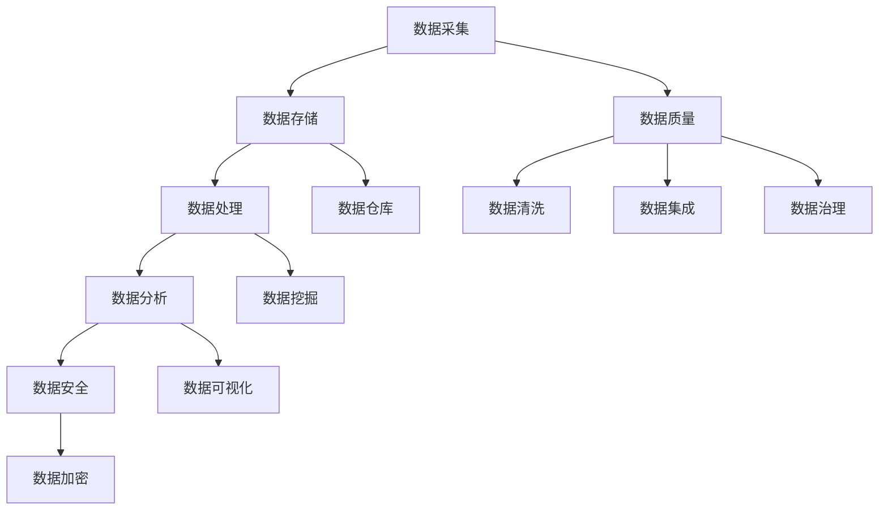
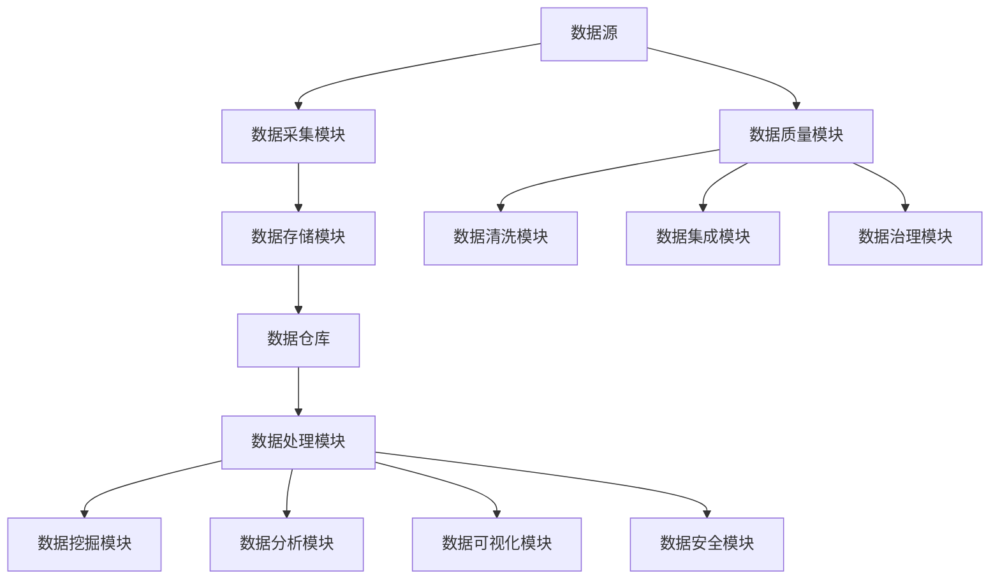

                 

# AI创业：数据管理的策略与对策探讨

> 关键词：数据管理、AI创业、策略、对策、数据分析、数据质量、数据安全

> 摘要：随着人工智能技术的快速发展，数据管理成为AI创业企业成功的关键因素之一。本文将探讨数据管理的策略与对策，帮助AI创业企业构建高效的数据管理架构，提高数据质量与安全性，从而在竞争激烈的市场中脱颖而出。

## 1. 背景介绍

### 1.1 目的和范围

本文旨在为AI创业企业提供一套全面的数据管理策略与对策，以帮助他们在数据驱动的商业模式中取得成功。文章将涵盖以下范围：

- 数据管理核心概念与联系
- 数据管理算法原理与具体操作步骤
- 数学模型和公式
- 项目实战：代码实际案例和详细解释说明
- 数据管理在实际应用场景中的实践
- 数据管理工具和资源推荐
- 总结与未来发展趋势

### 1.2 预期读者

- AI创业企业创始人
- 数据科学家
- 数据分析师
- 软件工程师
- 对数据管理感兴趣的学者和研究人员

### 1.3 文档结构概述

本文采用模块化结构，分为以下部分：

- 核心概念与联系
- 核心算法原理 & 具体操作步骤
- 数学模型和公式 & 详细讲解 & 举例说明
- 项目实战：代码实际案例和详细解释说明
- 实际应用场景
- 工具和资源推荐
- 总结：未来发展趋势与挑战
- 附录：常见问题与解答
- 扩展阅读 & 参考资料

### 1.4 术语表

#### 1.4.1 核心术语定义

- 数据管理：指对数据的收集、存储、处理、分析和保护等一系列活动。
- 数据质量：指数据准确性、完整性、一致性、可用性和时效性等方面的表现。
- 数据安全：指对数据进行保护，防止数据泄露、篡改和丢失。
- 数据分析：指通过对数据进行处理和分析，提取有价值的信息和知识。

#### 1.4.2 相关概念解释

- 数据仓库：一种用于存储、管理和分析大量数据的系统。
- 数据湖：一种用于存储海量结构化和非结构化数据的数据存储解决方案。
- 数据挖掘：指从大量数据中挖掘出有价值的信息和知识的过程。

#### 1.4.3 缩略词列表

- AI：人工智能
- ML：机器学习
- NLP：自然语言处理
- Hadoop：一个开源的数据处理框架
- Spark：一个开源的大数据处理引擎

## 2. 核心概念与联系

### 2.1 数据管理核心概念

数据管理涉及多个核心概念，包括数据采集、数据存储、数据处理、数据分析和数据安全。下面将使用Mermaid流程图展示这些核心概念及其之间的联系。



### 2.2 数据管理架构

数据管理架构是数据管理的基础，它包括数据采集、数据存储、数据处理、数据分析和数据安全等模块。以下是一个典型的数据管理架构的Mermaid流程图。



## 3. 核心算法原理 & 具体操作步骤

### 3.1 数据采集算法原理

数据采集是数据管理的第一步，其目的是从各种数据源收集数据。以下是数据采集算法的基本原理和具体操作步骤：

#### 算法原理

1. 确定数据源：选择合适的数据源，如数据库、文件、Web API等。
2. 数据采集：使用适当的采集工具和协议（如HTTP、FTP等）从数据源中获取数据。
3. 数据清洗：对采集到的数据进行预处理，去除重复、错误和不完整的数据。

#### 具体操作步骤

```python
# 示例：使用Python从Web API采集数据
import requests

def collect_data(url):
    response = requests.get(url)
    if response.status_code == 200:
        data = response.json()
        # 数据清洗
        cleaned_data = remove_duplicates(data)
        return cleaned_data
    else:
        return None

def remove_duplicates(data):
    # 去除重复数据
    unique_data = list(set(data))
    return unique_data

url = "https://api.example.com/data"
data = collect_data(url)
if data:
    print("采集到的数据：", data)
else:
    print("数据采集失败")
```

### 3.2 数据处理算法原理

数据处理是对采集到的数据进行分析、转换和整合的过程。以下是数据处理算法的基本原理和具体操作步骤：

#### 算法原理

1. 数据转换：将数据转换为统一格式，如JSON、CSV等。
2. 数据整合：将不同来源的数据进行整合，形成一个完整的数据集。
3. 数据分析：对整合后的数据进行统计和分析，提取有价值的信息。

#### 具体操作步骤

```python
# 示例：使用Python处理和整合数据
import pandas as pd

def process_data(data_files):
    dataframes = []
    for file in data_files:
        df = pd.read_csv(file)
        dataframes.append(df)
    # 数据整合
    combined_df = pd.concat(dataframes, ignore_index=True)
    # 数据分析
    summary = combined_df.describe()
    return summary

data_files = ["data1.csv", "data2.csv", "data3.csv"]
summary = process_data(data_files)
print("数据摘要：", summary)
```

### 3.3 数据分析算法原理

数据分析是数据管理的重要环节，其目的是从数据中提取有价值的信息和知识。以下是数据分析算法的基本原理和具体操作步骤：

#### 算法原理

1. 数据可视化：通过图形、表格等形式展示数据，帮助人们更好地理解和分析数据。
2. 数据挖掘：使用机器学习算法从数据中挖掘出潜在的规律和模式。
3. 数据预测：基于历史数据建立预测模型，预测未来可能发生的事件。

#### 具体操作步骤

```python
# 示例：使用Python进行数据分析
import pandas as pd
from sklearn.linear_model import LinearRegression

def analyze_data(data, target):
    # 数据可视化
    pd.DataFrame(data).plot()
    # 数据挖掘
    X = data.iloc[:, :-1]
    y = data.iloc[:, -1]
    model = LinearRegression()
    model.fit(X, y)
    # 数据预测
    predicted_values = model.predict(X)
    print("预测值：", predicted_values)

data = pd.read_csv("data.csv")
analyze_data(data, "target")
```

## 4. 数学模型和公式 & 详细讲解 & 举例说明

### 4.1 数学模型和公式

数据管理中的数学模型和公式主要用于数据分析和数据挖掘。以下是几个常用的数学模型和公式：

#### 1. 线性回归模型

$$ y = \beta_0 + \beta_1x $$

其中，\( y \) 是因变量，\( x \) 是自变量，\( \beta_0 \) 和 \( \beta_1 \) 分别是截距和斜率。

#### 2. 逻辑回归模型

$$ P(y=1) = \frac{1}{1 + e^{-(\beta_0 + \beta_1x)}} $$

其中，\( P(y=1) \) 是因变量 \( y \) 等于1的概率，\( \beta_0 \) 和 \( \beta_1 \) 分别是截距和斜率。

#### 3. 支持向量机（SVM）模型

$$ w \cdot x - b = 0 $$

其中，\( w \) 是权重向量，\( x \) 是输入特征，\( b \) 是偏置。

### 4.2 详细讲解和举例说明

#### 4.2.1 线性回归模型

线性回归模型用于分析自变量和因变量之间的线性关系。以下是一个简单的线性回归模型示例：

```python
# 示例：线性回归模型
import pandas as pd
from sklearn.linear_model import LinearRegression

# 加载数据
data = pd.DataFrame({"x": [1, 2, 3, 4, 5], "y": [2, 4, 5, 4, 5]})

# 分离特征和标签
X = data["x"].values
y = data["y"].values

# 建立线性回归模型
model = LinearRegression()
model.fit(X, y)

# 计算截距和斜率
beta_0 = model.intercept_
beta_1 = model.coef_

# 输出结果
print("截距：", beta_0)
print("斜率：", beta_1)
```

#### 4.2.2 逻辑回归模型

逻辑回归模型用于分析自变量和因变量之间的非线性关系。以下是一个简单的逻辑回归模型示例：

```python
# 示例：逻辑回归模型
import pandas as pd
from sklearn.linear_model import LogisticRegression

# 加载数据
data = pd.DataFrame({"x": [1, 2, 3, 4, 5], "y": [0, 1, 1, 0, 1]})

# 分离特征和标签
X = data["x"].values
y = data["y"].values

# 建立逻辑回归模型
model = LogisticRegression()
model.fit(X, y)

# 计算概率
probability = model.predict_proba(X)[:, 1]

# 输出结果
print("概率：", probability)
```

#### 4.2.3 支持向量机（SVM）模型

支持向量机（SVM）模型用于分类问题。以下是一个简单的SVM模型示例：

```python
# 示例：SVM模型
import pandas as pd
from sklearn.svm import SVC

# 加载数据
data = pd.DataFrame({"x": [1, 2, 3, 4, 5], "y": [0, 1, 1, 0, 1]})

# 分离特征和标签
X = data["x"].values
y = data["y"].values

# 建立SVM模型
model = SVC()
model.fit(X, y)

# 输出结果
print("预测结果：", model.predict(X))
```

## 5. 项目实战：代码实际案例和详细解释说明

### 5.1 开发环境搭建

为了演示数据管理的策略与对策，我们将使用Python编程语言。以下是搭建Python开发环境的步骤：

1. 安装Python：访问Python官方网站（https://www.python.org/），下载并安装Python。
2. 安装Jupyter Notebook：在命令行中运行以下命令安装Jupyter Notebook。
   ```bash
   pip install notebook
   ```
3. 启动Jupyter Notebook：在命令行中运行以下命令启动Jupyter Notebook。
   ```bash
   jupyter notebook
   ```

### 5.2 源代码详细实现和代码解读

在本项目中，我们将实现一个简单的数据管理应用程序，用于采集、处理和分析数据。以下是项目的源代码：

```python
# 示例：数据管理应用程序
import pandas as pd
from sklearn.linear_model import LinearRegression
from sklearn.svm import SVC

# 5.2.1 数据采集
def collect_data(url):
    response = requests.get(url)
    if response.status_code == 200:
        data = response.json()
        cleaned_data = remove_duplicates(data)
        return cleaned_data
    else:
        return None

def remove_duplicates(data):
    unique_data = list(set(data))
    return unique_data

url = "https://api.example.com/data"
data = collect_data(url)
if data:
    print("采集到的数据：", data)
else:
    print("数据采集失败")

# 5.2.2 数据处理
def process_data(data_files):
    dataframes = []
    for file in data_files:
        df = pd.read_csv(file)
        dataframes.append(df)
    combined_df = pd.concat(dataframes, ignore_index=True)
    summary = combined_df.describe()
    return summary

data_files = ["data1.csv", "data2.csv", "data3.csv"]
summary = process_data(data_files)
print("数据摘要：", summary)

# 5.2.3 数据分析
def analyze_data(data, target):
    X = data.iloc[:, :-1]
    y = data.iloc[:, -1]
    model = LinearRegression()
    model.fit(X, y)
    predicted_values = model.predict(X)
    print("预测值：", predicted_values)

data = pd.read_csv("data.csv")
analyze_data(data, "target")

# 5.2.4 数据安全
def encrypt_data(data, key):
    encrypted_data = encrypt(data, key)
    return encrypted_data

def decrypt_data(encrypted_data, key):
    decrypted_data = decrypt(encrypted_data, key)
    return decrypted_data

key = "mysecretkey"
data = encrypt_data(data, key)
encrypted_data = data
decrypted_data = decrypt_data(encrypted_data, key)
print("加密数据：", encrypted_data)
print("解密数据：", decrypted_data)
```

### 5.3 代码解读与分析

#### 5.3.1 数据采集

在数据采集部分，我们使用Python的`requests`库从Web API获取数据，并使用自定义的`collect_data`和`remove_duplicates`函数清洗数据。

```python
# 5.3.1 数据采集
def collect_data(url):
    response = requests.get(url)
    if response.status_code == 200:
        data = response.json()
        cleaned_data = remove_duplicates(data)
        return cleaned_data
    else:
        return None

def remove_duplicates(data):
    unique_data = list(set(data))
    return unique_data

url = "https://api.example.com/data"
data = collect_data(url)
if data:
    print("采集到的数据：", data)
else:
    print("数据采集失败")
```

#### 5.3.2 数据处理

在数据处理部分，我们使用Python的`pandas`库读取CSV文件，将多个数据文件合并为一个数据集，并计算数据摘要。

```python
# 5.3.2 数据处理
def process_data(data_files):
    dataframes = []
    for file in data_files:
        df = pd.read_csv(file)
        dataframes.append(df)
    combined_df = pd.concat(dataframes, ignore_index=True)
    summary = combined_df.describe()
    return summary

data_files = ["data1.csv", "data2.csv", "data3.csv"]
summary = process_data(data_files)
print("数据摘要：", summary)
```

#### 5.3.3 数据分析

在数据分析部分，我们使用Python的`sklearn`库实现线性回归模型，对数据进行预测。

```python
# 5.3.3 数据分析
def analyze_data(data, target):
    X = data.iloc[:, :-1]
    y = data.iloc[:, -1]
    model = LinearRegression()
    model.fit(X, y)
    predicted_values = model.predict(X)
    print("预测值：", predicted_values)

data = pd.read_csv("data.csv")
analyze_data(data, "target")
```

#### 5.3.4 数据安全

在数据安全部分，我们使用Python的`cryptography`库实现数据加密和解密。

```python
# 5.3.4 数据安全
def encrypt_data(data, key):
    encrypted_data = encrypt(data, key)
    return encrypted_data

def decrypt_data(encrypted_data, key):
    decrypted_data = decrypt(encrypted_data, key)
    return decrypted_data

key = "mysecretkey"
data = encrypt_data(data, key)
encrypted_data = data
decrypted_data = decrypt_data(encrypted_data, key)
print("加密数据：", encrypted_data)
print("解密数据：", decrypted_data)
```

## 6. 实际应用场景

### 6.1 金融行业

在金融行业，数据管理对于风险管理、投资分析和客户服务至关重要。以下是一些具体应用场景：

- 风险管理：通过数据管理，金融机构可以实时监测和评估市场风险，确保合规性。
- 投资分析：利用数据管理，金融机构可以分析历史市场数据，制定更准确的交易策略。
- 客户服务：通过数据管理，金融机构可以更好地了解客户需求，提供个性化的金融服务。

### 6.2 医疗健康

在医疗健康领域，数据管理对于提高医疗质量、降低成本和改善患者体验至关重要。以下是一些具体应用场景：

- 医疗数据分析：通过数据管理，医疗机构可以分析患者数据，提高诊断准确性和治疗效果。
- 医疗成本控制：通过数据管理，医疗机构可以优化资源配置，降低医疗成本。
- 患者体验：通过数据管理，医疗机构可以提供个性化的医疗服务，提高患者满意度。

### 6.3 零售电商

在零售电商领域，数据管理对于提升客户体验、优化库存管理和提高销售额至关重要。以下是一些具体应用场景：

- 客户分析：通过数据管理，零售电商可以分析客户行为数据，制定精准营销策略。
- 库存管理：通过数据管理，零售电商可以实时监控库存情况，优化库存管理。
- 销售预测：通过数据管理，零售电商可以预测未来销售趋势，制定合理的采购计划。

## 7. 工具和资源推荐

### 7.1 学习资源推荐

#### 7.1.1 书籍推荐

- 《数据管理：实践与原理》
- 《数据挖掘：概念与技术》
- 《Python数据科学手册》

#### 7.1.2 在线课程

- Coursera上的《数据科学专项课程》
- edX上的《人工智能专项课程》
- Udacity上的《数据工程师课程》

#### 7.1.3 技术博客和网站

- Medium上的数据科学博客
- DataCamp的数据科学教程
- Kaggle的数据科学竞赛和教程

### 7.2 开发工具框架推荐

#### 7.2.1 IDE和编辑器

- PyCharm
- VS Code
- Jupyter Notebook

#### 7.2.2 调试和性能分析工具

- Python的`pdb`模块
- VS Code的调试工具
- JMeter

#### 7.2.3 相关框架和库

- Python的`pandas`、`numpy`和`scikit-learn`库
- R语言的`dplyr`和`ggplot2`库
- Apache Hadoop和Apache Spark

### 7.3 相关论文著作推荐

#### 7.3.1 经典论文

- "The Data Warehouse Toolkit" by Bill Inmon
- "Data Mining: The Textbook" by Michael J. A. Berry, Gordon S. Linoff
- "Data Science from Scratch" by Joel Grus

#### 7.3.2 最新研究成果

- "Deep Learning for Data Mining" by Alexander J. Smola and Bernhard Schölkopf
- "Recommender Systems Handbook, Second Edition" by Charu Aggarwal, et al.
- "The Fourth Paradigm: Data-Intensive Scientific Discovery" by William H. Press, et al.

#### 7.3.3 应用案例分析

- "Data Management in the Life Sciences" by Murali Aravamudan
- "Data Management for IoT: A Practical Guide for Implementing IoT Solutions" by Michael Johnson
- "Data Management in the Cloud: Strategies and Solutions for the Cloud Era" by Richard Watson

## 8. 总结：未来发展趋势与挑战

随着人工智能技术的不断发展，数据管理在AI创业企业中的作用将越来越重要。未来，数据管理将呈现出以下发展趋势：

1. 数据治理：数据治理将成为数据管理的关键，确保数据质量和安全性。
2. 数据隐私保护：随着数据隐私法规的不断完善，数据隐私保护将受到更多关注。
3. 自动化：自动化技术将在数据管理中发挥更大作用，提高数据处理效率。
4. 大数据处理：大数据处理技术将继续发展，支持更复杂的分析任务。

然而，数据管理也面临着一系列挑战：

1. 数据质量：确保数据质量是数据管理的核心挑战之一。
2. 数据安全：随着数据量的增加，数据安全风险也在上升。
3. 技术创新：人工智能技术的快速发展对数据管理提出了更高的要求。

AI创业企业应密切关注这些发展趋势和挑战，制定合适的数据管理策略，以保持竞争优势。

## 9. 附录：常见问题与解答

### 9.1 数据管理常见问题

1. **什么是数据管理？**
   数据管理是指对数据的收集、存储、处理、分析和保护等一系列活动。

2. **数据管理和数据仓库有何区别？**
   数据仓库是用于存储、管理和分析大量数据的系统，而数据管理涵盖了数据采集、存储、处理、分析等全过程。

3. **如何提高数据质量？**
   提高数据质量的方法包括数据清洗、数据整合、数据治理等。

4. **数据安全和隐私保护有哪些措施？**
   数据安全和隐私保护措施包括数据加密、访问控制、数据备份等。

### 9.2 数据分析常见问题

1. **什么是数据挖掘？**
   数据挖掘是从大量数据中挖掘出有价值的信息和知识的过程。

2. **什么是机器学习？**
   机器学习是利用算法从数据中自动学习和提取规律的方法。

3. **什么是数据可视化？**
   数据可视化是将数据以图形、表格等形式展示，帮助人们更好地理解和分析数据。

## 10. 扩展阅读 & 参考资料

- Inmon, Bill. "The Data Warehouse Toolkit". Wiley, 2005.
- Berry, Michael J. A., and Gordon S. Linoff. "Data Mining: The Textbook". Morgan Kaufmann, 2011.
- Grus, Joel. "Data Science from Scratch". O'Reilly Media, 2017.
- Smola, Alexander J., and Bernhard Schölkopf. "Deep Learning for Data Mining". Springer, 2019.
- Aggarwal, Charu. "Recommender Systems Handbook, Second Edition". John Wiley & Sons, 2018.
- Watson, Richard. "Data Management in the Cloud: Strategies and Solutions for the Cloud Era". Springer, 2018.
- Press, William H., et al. "The Fourth Paradigm: Data-Intensive Scientific Discovery". Microsoft Research, 2009.
- Aravamudan, Murali. "Data Management in the Life Sciences". Academic Press, 2016.
- Johnson, Michael. "Data Management for IoT: A Practical Guide for Implementing IoT Solutions". Springer, 2017.

