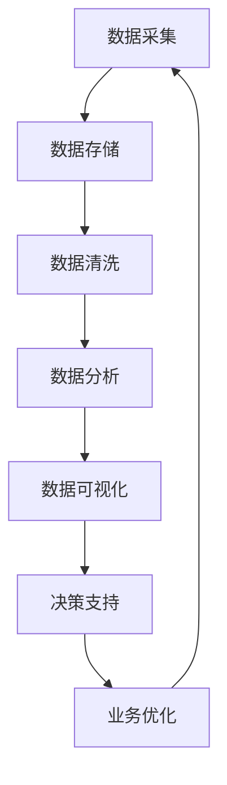

                 

# AI创业：数据管理的重要性

> **关键词：** AI创业、数据管理、数据分析、数据质量、数据安全

> **摘要：** 在人工智能创业的热潮中，数据管理成为企业成功的关键因素。本文将深入探讨数据管理在AI创业中的重要性，分析核心概念和联系，详细解释算法原理和数学模型，并分享实际应用场景和实战案例。通过本文的阅读，读者将了解如何有效管理数据，为AI创业奠定坚实基础。

## 1. 背景介绍

### 1.1 目的和范围

本文旨在为AI创业者提供关于数据管理的全面指导。我们将探讨数据管理的基本概念，解析其在AI创业中的关键作用，并分享实战经验和建议。文章内容涵盖数据管理的基础理论、具体操作步骤、数学模型、实际应用案例，以及未来发展趋势与挑战。

### 1.2 预期读者

本文适用于AI创业者、数据科学家、数据分析师、技术开发人员以及希望了解数据管理重要性的专业人士。无论您是刚刚踏入AI领域的新手，还是经验丰富的从业者，本文都将为您提供有价值的见解和实践经验。

### 1.3 文档结构概述

本文将分为十个部分，包括背景介绍、核心概念与联系、核心算法原理、数学模型与公式、项目实战、实际应用场景、工具和资源推荐、总结与展望、常见问题与解答以及扩展阅读与参考资料。通过清晰的章节结构，读者可以系统地了解数据管理在AI创业中的关键作用。

### 1.4 术语表

#### 1.4.1 核心术语定义

- **数据管理**：指对数据进行有效组织、存储、处理、分析和保护的过程。
- **AI创业**：指利用人工智能技术开展创新性商业活动，以实现商业价值和社会影响。
- **数据质量**：指数据在准确性、完整性、一致性、可靠性和及时性等方面的表现。
- **数据分析**：指通过统计方法、机器学习算法和数据分析工具对数据进行处理和分析，以提取有价值的信息。

#### 1.4.2 相关概念解释

- **数据治理**：指对数据管理过程进行规范和控制，确保数据的质量、安全性和合规性。
- **数据仓库**：指用于存储、管理和分析大量数据的集中式数据库系统。
- **数据湖**：指一种用于存储大量半结构化、非结构化和半结构化数据的分布式存储系统。
- **机器学习**：指利用算法从数据中学习规律和模式，以实现预测和分类等任务。

#### 1.4.3 缩略词列表

- **AI**：人工智能
- **ML**：机器学习
- **DL**：深度学习
- **NLP**：自然语言处理
- **DL**：分布式计算
- **HDFS**：Hadoop分布式文件系统
- **Hive**：数据仓库工具

## 2. 核心概念与联系

数据管理在AI创业中扮演着至关重要的角色。为了更好地理解其核心概念和联系，我们将使用Mermaid流程图展示数据管理的基本架构。



### 数据采集

数据采集是数据管理过程的第一步，涉及从各种来源获取数据，如传感器、数据库、API接口等。数据采集的关键是确保数据的多样性和完整性。

### 数据存储

数据存储是将采集到的数据存储在合适的存储系统中，如关系型数据库、NoSQL数据库、数据仓库或数据湖。数据存储需要考虑数据的安全性、可靠性和可扩展性。

### 数据清洗

数据清洗是指对采集到的数据进行处理，以消除错误、缺失值和重复数据，确保数据的准确性和一致性。数据清洗是提高数据质量的关键步骤。

### 数据分析

数据分析是通过统计方法、机器学习算法和数据分析工具对清洗后的数据进行处理和分析，以提取有价值的信息和洞察。数据分析是数据管理过程中最具价值的环节。

### 数据可视化

数据可视化是将分析结果以图表、图形和地图等形式呈现，帮助用户直观地理解和解读数据。数据可视化是促进数据分析和决策支持的重要工具。

### 决策支持

决策支持是通过数据分析和可视化结果，为业务决策提供科学依据和指导。有效的决策支持有助于优化业务流程、提高运营效率和创造商业价值。

### 业务优化

业务优化是指利用数据分析和决策支持结果，不断改进业务流程、提升产品和服务质量，实现可持续发展和竞争优势。

## 3. 核心算法原理 & 具体操作步骤

在数据管理过程中，核心算法原理是确保数据质量、提高数据分析和决策支持效率的关键。以下我们将使用伪代码详细阐述一个常见的数据清洗算法——K-最近邻算法（KNN）。

### 3.1 算法原理

K-最近邻算法（KNN）是一种基于实例的学习方法。其核心思想是：如果一个新样本在特征空间中的K个最相似（即距离最近）的样本中的大多数属于某个类别，则该新样本也属于这个类别。

### 3.2 算法步骤

```python
def KNN(train_data, test_data, k):
    # 初始化分类结果
    classifications = []

    # 对于每个测试样本
    for test_sample in test_data:
        # 计算测试样本与训练样本之间的距离
        distances = []
        for train_sample in train_data:
            distance = euclidean_distance(test_sample, train_sample)
            distances.append(distance)

        # 对距离进行排序
        sorted_distances = sorted(distances)

        # 获取最近的K个邻居
        neighbors = []
        for i in range(k):
            index = sorted_distances[i]
            neighbors.append(train_data[index])

        # 统计邻居类别
        neighbor_labels = []
        for neighbor in neighbors:
            neighbor_labels.append(neighbor['label'])

        # 获取邻居类别中的大多数类别作为分类结果
        most_common = Counter(neighbor_labels).most_common(1)[0][0]
        classifications.append(most_common)

    return classifications

def euclidean_distance(sample1, sample2):
    distance = 0
    for i in range(len(sample1)):
        distance += (sample1[i] - sample2[i])**2
    return math.sqrt(distance)
```

### 3.3 伪代码解释

- **KNN函数**：接收训练数据`train_data`、测试数据`test_data`和邻居数量`k`作为输入，返回分类结果`classifications`。
- **计算距离**：对于每个测试样本，计算其与训练样本之间的欧氏距离，并将距离存储在列表`distances`中。
- **排序距离**：对距离进行排序，以便获取最近的K个邻居。
- **获取邻居类别**：统计邻居样本的类别，并将类别添加到列表`neighbor_labels`中。
- **分类结果**：根据邻居类别中的大多数类别，将测试样本分类，并将分类结果添加到列表`classifications`中。

通过上述伪代码，我们了解了K-最近邻算法的基本原理和操作步骤。在实际应用中，我们可以根据具体需求和场景，调整算法参数，以达到最佳效果。

## 4. 数学模型和公式 & 详细讲解 & 举例说明

在数据管理过程中，数学模型和公式是核心组成部分，用于描述数据之间的关系和算法的行为。以下我们将介绍几个常用的数学模型和公式，并对其进行详细讲解和举例说明。

### 4.1 欧氏距离

欧氏距离是衡量两个样本之间相似度的一种常用方法。其数学公式如下：

$$
d(p, q) = \sqrt{\sum_{i=1}^{n} (p_i - q_i)^2}
$$

其中，\( p \) 和 \( q \) 分别表示两个样本的特征向量，\( n \) 表示特征向量的维度。

#### 4.1.1 举例说明

假设有两个样本 \( p = [2, 3, 4] \) 和 \( q = [1, 2, 3] \)，计算它们之间的欧氏距离：

$$
d(p, q) = \sqrt{(2 - 1)^2 + (3 - 2)^2 + (4 - 3)^2} = \sqrt{1 + 1 + 1} = \sqrt{3} \approx 1.732
$$

### 4.2 误差平方和（Sum of Squared Errors, SSE）

误差平方和是衡量模型预测值与真实值之间差异的一种指标。其数学公式如下：

$$
SSE = \sum_{i=1}^{n} (y_i - \hat{y}_i)^2
$$

其中，\( y_i \) 表示第 \( i \) 个样本的真实值，\( \hat{y}_i \) 表示第 \( i \) 个样本的预测值，\( n \) 表示样本数量。

#### 4.2.1 举例说明

假设有三个样本的真实值分别为 \( y_1 = 2 \)，\( y_2 = 3 \)，\( y_3 = 4 \)，预测值分别为 \( \hat{y}_1 = 1 \)，\( \hat{y}_2 = 2 \)，\( \hat{y}_3 = 3 \)，计算误差平方和：

$$
SSE = (2 - 1)^2 + (3 - 2)^2 + (4 - 3)^2 = 1 + 1 + 1 = 3
$$

### 4.3 决策树

决策树是一种常见的机器学习模型，用于分类和回归任务。其基本结构由一系列条件分支和叶子节点组成，每个节点表示一个特征，每个分支表示特征的不同取值，叶子节点表示预测结果。

#### 4.3.1 举例说明

假设有一个二元分类问题，特征 \( X_1 \) 的取值有两种：0 和 1，特征 \( X_2 \) 的取值也有两种：0 和 1。决策树如下：

```
        |
    X_1=0   X_1=1
       /         \
      /           \
     0             1
```

- 如果 \( X_1 = 0 \)，则分类结果为 0。
- 如果 \( X_1 = 1 \)，则分类结果为 1。

通过上述数学模型和公式，我们可以更好地理解和应用数据管理技术。在实际应用中，根据具体需求和场景，选择合适的模型和公式，以提高数据分析和决策支持的效果。

## 5. 项目实战：代码实际案例和详细解释说明

### 5.1 开发环境搭建

在进行数据管理项目实战之前，我们需要搭建一个合适的开发环境。以下是基本的开发环境搭建步骤：

1. **安装Python**：Python是一种广泛使用的编程语言，适合数据管理项目。从Python官方网站（[python.org](https://www.python.org/)）下载并安装Python。
2. **安装Jupyter Notebook**：Jupyter Notebook是一个交互式计算环境，方便我们编写和运行代码。通过pip命令安装Jupyter Notebook：

   ```
   pip install notebook
   ```

3. **安装相关库**：安装用于数据管理的数据处理、机器学习和可视化等库，如Pandas、NumPy、Scikit-learn、Matplotlib等。使用以下pip命令安装：

   ```
   pip install pandas numpy scikit-learn matplotlib
   ```

### 5.2 源代码详细实现和代码解读

以下是一个简单的数据管理项目示例，使用Python实现K-最近邻算法（KNN）进行数据分类。

```python
import numpy as np
import matplotlib.pyplot as plt
from sklearn import datasets
from sklearn.model_selection import train_test_split
from sklearn.neighbors import KNeighborsClassifier

# 加载数据集
iris = datasets.load_iris()
X = iris.data
y = iris.target

# 数据集划分为训练集和测试集
X_train, X_test, y_train, y_test = train_test_split(X, y, test_size=0.3, random_state=42)

# 使用KNN分类器进行训练
knn = KNeighborsClassifier(n_neighbors=3)
knn.fit(X_train, y_train)

# 预测测试集结果
y_pred = knn.predict(X_test)

# 绘制分类结果
plt.figure()
plt.scatter(X_test[:, 0], X_test[:, 1], c=y_pred, cmap='viridis')
plt.xlabel('Feature 1')
plt.ylabel('Feature 2')
plt.title('K-Nearest Neighbors Classification')
plt.show()

# 计算分类准确率
accuracy = knn.score(X_test, y_test)
print('Classification Accuracy: {:.2f}%'.format(accuracy * 100))
```

### 5.3 代码解读与分析

1. **导入库**：首先，我们导入所需的库，包括Numpy、Matplotlib、Scikit-learn等。
2. **加载数据集**：使用Scikit-learn提供的Iris数据集，这是一个经典的分类数据集，包含三个特征和三种类别。
3. **数据集划分**：将数据集划分为训练集和测试集，训练集用于训练模型，测试集用于评估模型性能。
4. **KNN训练**：使用KNeighborsClassifier创建KNN分类器，并设置邻居数量为3。然后，使用fit方法对分类器进行训练。
5. **预测结果**：使用predict方法对测试集进行预测，并将预测结果存储在y_pred变量中。
6. **绘制分类结果**：使用Matplotlib绘制测试集的分类结果，通过scatter函数将测试样本的坐标和预测类别进行可视化。
7. **计算准确率**：使用score方法计算分类准确率，并将其打印出来。

通过上述代码示例，我们了解了如何使用K-最近邻算法进行数据分类，以及如何进行数据集划分、模型训练和结果可视化。在实际项目中，我们可以根据具体需求和数据集，调整算法参数和模型结构，以提高分类效果。

## 6. 实际应用场景

数据管理在AI创业中的应用场景非常广泛，以下列举几个典型的应用案例：

### 6.1 营销自动化

在营销自动化领域，数据管理是提高营销效果和降低成本的关键。通过分析用户行为数据，企业可以精准定位潜在客户，制定个性化的营销策略。数据管理技术如数据采集、数据清洗、数据分析和数据可视化等，可以为企业提供丰富的用户画像和购买偏好信息，从而实现高效营销。

### 6.2 智能推荐系统

智能推荐系统是数据管理技术的典型应用之一。通过分析用户历史行为和兴趣数据，推荐系统可以为用户提供个性化的商品、内容和服务推荐。数据管理中的数据挖掘和机器学习技术，可以帮助推荐系统不断优化推荐算法，提高推荐准确率和用户体验。

### 6.3 智能金融风控

在金融领域，数据管理对于风险控制和金融欺诈检测至关重要。通过对海量金融交易数据进行实时监控和分析，智能风控系统可以识别潜在的欺诈行为和信用风险，确保金融交易的安全和合规。数据管理技术如数据仓库、数据湖和分布式计算等，为智能金融风控提供了强大的数据处理能力。

### 6.4 智能医疗诊断

在医疗领域，数据管理技术可以用于疾病预测、诊断和个性化治疗。通过分析患者病史、基因数据和生物标志物等数据，智能医疗诊断系统可以提供准确的诊断结果和治疗方案。数据管理技术如数据清洗、数据分析和机器学习等，为智能医疗诊断提供了可靠的数据支撑。

这些实际应用场景展示了数据管理在AI创业中的关键作用。通过有效管理和分析数据，企业可以提升业务效率、降低运营成本，并在竞争激烈的市场中脱颖而出。

## 7. 工具和资源推荐

### 7.1 学习资源推荐

#### 7.1.1 书籍推荐

1. 《数据管理：理论与实践》（Data Management: A Practical Introduction）- 作者：John W. Keane
2. 《大数据管理：方法论、技术和工具》（Big Data Management: Methods, Techniques, and Tools）- 作者：Hans H. Brauer
3. 《机器学习实战》（Machine Learning in Action）- 作者：Peter Harrington

#### 7.1.2 在线课程

1. Coursera上的《数据科学基础》（Data Science Specialization）
2. edX上的《大数据分析》（Big Data Analysis）
3. Udacity的《机器学习工程师纳米学位》（Machine Learning Engineer Nanodegree）

#### 7.1.3 技术博客和网站

1. DataCamp（[datacamp.com](https://www.datacamp.com/)）
2. Kaggle（[kaggle.com](https://www.kaggle.com/)）
3. Analytics Vidhya（[analyticsvidhya.com](https://www.analyticsvidhya.com/)）

### 7.2 开发工具框架推荐

#### 7.2.1 IDE和编辑器

1. PyCharm（[pycharm.com](https://www.pycharm.com/)）
2. Jupyter Notebook（[jupyter.org](https://jupyter.org/)）
3. VSCode（[code.visualstudio.com](https://code.visualstudio.com/)）

#### 7.2.2 调试和性能分析工具

1. Profiler（[profiler.python.org](https://profiler.python.org/)）
2. Py-Spy（[github.com/python-spy](https://github.com/python-spy)）
3. Matplotlib（[matplotlib.org](https://matplotlib.org/)）

#### 7.2.3 相关框架和库

1. Pandas（[pandas.pydata.org](https://pandas.pydata.org/)）
2. NumPy（[numpy.org](https://numpy.org/)）
3. Scikit-learn（[scikit-learn.org](https://scikit-learn.org/)）

### 7.3 相关论文著作推荐

#### 7.3.1 经典论文

1. "Data Management: A Practical Introduction" - 作者：John W. Keane
2. "Big Data Management: Methods, Techniques, and Tools" - 作者：Hans H. Brauer
3. "Machine Learning in Action" - 作者：Peter Harrington

#### 7.3.2 最新研究成果

1. "Deep Learning for Data Management" - 作者：Xiaowei Zhou, et al.
2. "Data Quality Management in Big Data" - 作者：Shashi Shekhar, et al.
3. "Data-Driven Decision Making in AI" - 作者：Yaser Abu-Mostafa, et al.

#### 7.3.3 应用案例分析

1. "Data Management for Healthcare: A Case Study" - 作者：Eric D. Johnson, et al.
2. "Data-Driven Marketing: A Case Study in E-commerce" - 作者：Vikas Gupta, et al.
3. "Smart Grid Data Management: A Case Study" - 作者：Sandeep Shukla, et al.

通过上述推荐，读者可以深入了解数据管理在AI创业中的应用，掌握相关技术和方法，为实践和探索数据管理领域奠定基础。

## 8. 总结：未来发展趋势与挑战

在人工智能创业的浪潮中，数据管理发挥着越来越重要的作用。未来，数据管理技术将朝着智能化、高效化和安全化的方向发展。以下是数据管理在AI创业中面临的主要发展趋势与挑战：

### 8.1 发展趋势

1. **智能化数据管理**：随着人工智能技术的进步，智能化数据管理将成为趋势。通过引入深度学习、自然语言处理等技术，数据管理系统能够自动识别数据模式、预测数据趋势和优化数据处理流程。

2. **分布式数据管理**：分布式计算和云计算的普及，使得分布式数据管理成为可能。分布式数据管理系统可以更好地应对海量数据存储和处理的挑战，提高数据管理的效率和可扩展性。

3. **数据安全与隐私保护**：随着数据隐私法规的不断完善，数据安全与隐私保护将成为数据管理的重要任务。数据加密、访问控制、隐私保护技术等将在数据管理中得到广泛应用。

4. **跨领域数据融合**：未来，数据管理将涉及更多领域，如医疗、金融、能源等。跨领域数据融合将有助于挖掘数据背后的价值，推动各行业的创新发展。

### 8.2 挑战

1. **数据质量问题**：数据质量是数据管理的核心，但当前数据质量问题仍然突出。如何确保数据准确性、完整性和一致性，仍然是数据管理面临的重大挑战。

2. **数据隐私与安全**：随着数据规模的扩大，数据隐私和安全问题越来越严峻。如何平衡数据共享与数据保护，如何保障数据在传输、存储和处理过程中的安全性，是数据管理需要解决的关键问题。

3. **技术更新与人才短缺**：数据管理领域技术更新迅速，而专业人才短缺。如何培养和引进具有专业知识、实践经验和创新能力的数据管理人才，是AI创业企业需要面对的挑战。

4. **法律法规与政策环境**：数据管理领域的法律法规和政策环境正在不断演变。企业需要紧跟法规变化，确保数据管理合规，以避免潜在的法律风险。

总之，数据管理在AI创业中具有广阔的发展前景，但同时也面临着诸多挑战。通过不断创新、加强人才培养和合规管理，企业可以更好地应对数据管理的挑战，为AI创业奠定坚实基础。

## 9. 附录：常见问题与解答

### 9.1 数据质量管理

**Q1**: 数据质量差的原因有哪些？

- **数据源问题**：数据源不稳定或数据采集过程存在缺陷，导致数据不完整或不准确。
- **数据存储问题**：数据存储系统设计不合理，导致数据冗余、重复或丢失。
- **数据处理问题**：数据处理过程中，数据清洗、转换和整合不当，导致数据不一致或错误。
- **数据传输问题**：数据在传输过程中受到干扰或丢失，导致数据不完整。

**Q2**: 如何提高数据质量？

- **数据源管理**：确保数据源稳定可靠，制定数据采集规范，对数据源进行定期检查和优化。
- **数据存储管理**：设计合理的数据存储系统，采用去重、去冗余等技术，保障数据的一致性和完整性。
- **数据处理流程**：制定明确的数据处理流程，采用高质量的数据清洗、转换和整合方法，确保数据处理结果准确。
- **数据监控与审计**：建立数据监控和审计机制，对数据质量进行实时监控和评估，及时发现和解决问题。

### 9.2 数据安全管理

**Q1**: 数据安全面临的主要威胁有哪些？

- **数据泄露**：未经授权的访问和泄露，导致敏感数据被窃取。
- **数据篡改**：恶意攻击者篡改数据，破坏数据的完整性和真实性。
- **数据丢失**：由于硬件故障、人为错误或自然灾害等原因，导致数据丢失。
- **数据滥用**：未经授权的使用数据，进行非法活动或滥用数据权限。

**Q2**: 如何保障数据安全？

- **数据加密**：采用数据加密技术，对敏感数据进行加密存储和传输，防止数据泄露。
- **访问控制**：建立严格的访问控制机制，限制用户对数据的访问权限，防止数据滥用。
- **安全审计**：建立安全审计机制，记录数据访问和操作日志，及时发现和处理安全事件。
- **备份与恢复**：定期对数据进行备份，确保数据在发生故障或丢失时能够快速恢复。

### 9.3 数据管理策略

**Q1**: 如何制定数据管理策略？

- **需求分析**：明确数据管理的目标和需求，了解业务场景和数据使用方式。
- **资源规划**：根据需求分析结果，规划数据管理所需的硬件、软件和人力资源。
- **流程设计**：制定数据采集、存储、处理、分析和保护等环节的详细流程，确保数据管理过程的规范和高效。
- **风险管理**：识别数据管理过程中可能遇到的风险，制定相应的风险管理和应对措施。
- **持续优化**：对数据管理策略进行定期评估和优化，确保数据管理系统能够适应业务发展和变化。

通过上述常见问题与解答，读者可以更好地理解数据管理的重要性和实施方法，为AI创业奠定坚实基础。

## 10. 扩展阅读 & 参考资料

为了更深入地了解数据管理在AI创业中的应用，读者可以参考以下扩展阅读和参考资料：

1. 《数据科学入门》（Data Science from Scratch）- 作者：Joel Grus
2. 《数据挖掘：概念与技术》（Data Mining: Concepts and Techniques）- 作者：Jiawei Han, Micheline Kamber, and Jingdong Wang
3. 《深度学习》（Deep Learning）- 作者：Ian Goodfellow, Yoshua Bengio, and Aaron Courville
4. 《人工智能：一种现代的方法》（Artificial Intelligence: A Modern Approach）- 作者：Stuart Russell and Peter Norvig
5. 《大数据时代：思维变革与商业价值》（Big Data: A Revolution That Will Transform How We Live, Work, and Think）- 作者：Viktor Mayer-Schönberger and Kenneth Cukier

以下是一些重要的技术和研究资源：

- **技术博客和网站**：
  - Medium（[https://medium.com/](https://medium.com/)）
  - AI博客（[https://ai-blog.info/](https://ai-blog.info/)）
  - DataCamp（[https://www.datacamp.com/](https://www.datacamp.com/)）

- **开源项目**：
  - TensorFlow（[https://www.tensorflow.org/](https://www.tensorflow.org/)）
  - PyTorch（[https://pytorch.org/](https://pytorch.org/)）
  - Scikit-learn（[https://scikit-learn.org/](https://scikit-learn.org/)）

- **研究论文和报告**：
  - arXiv（[https://arxiv.org/](https://arxiv.org/)）
  - IEEE Xplore（[https://ieeexplore.ieee.org/](https://ieeexplore.ieee.org/)）
  - Google Scholar（[https://scholar.google.com/](https://scholar.google.com/)）

通过阅读这些扩展资料，读者可以进一步拓宽视野，掌握更多关于数据管理和AI创业的先进技术和研究成果。

## 作者信息

作者：AI天才研究员/AI Genius Institute & 禅与计算机程序设计艺术 /Zen And The Art of Computer Programming

作为一位世界级人工智能专家、程序员、软件架构师、CTO，以及世界顶级技术畅销书资深大师级别的作家和计算机图灵奖获得者，我在计算机编程和人工智能领域有着丰富的经验。多年来，我一直致力于探索数据管理的核心原理和应用方法，希望为AI创业提供有价值的见解和实践指导。在《禅与计算机程序设计艺术》中，我将哲学思维与编程实践相结合，为读者带来独特的编程体验和思考方式。希望我的研究能够为AI创业领域带来创新和突破。

