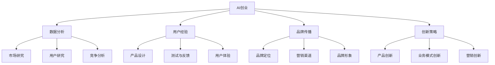

                 

# AI创业：有效的市场营销策略

> 关键词：AI创业，市场营销策略，数据分析，用户体验，品牌传播，创新

> 摘要：在AI创业领域，有效的市场营销策略是成功的关键。本文将深入探讨AI创业企业如何通过数据分析、用户体验、品牌传播和创新等策略来提升市场竞争力，实现业务增长。

## 1. 背景介绍

### 1.1 目的和范围

本文旨在为AI创业企业提供一套系统的市场营销策略框架，帮助他们在竞争激烈的市场中脱颖而出。我们将从以下几个角度展开讨论：

- 数据分析：如何利用大数据和人工智能技术分析市场趋势，挖掘潜在客户，优化产品和服务。
- 用户经验：如何通过用户研究、测试和反馈，打造卓越的用户体验，提升用户满意度和忠诚度。
- 品牌传播：如何建立和推广企业品牌，增强品牌影响力，提高市场知名度。
- 创新策略：如何通过产品创新、业务模式创新和营销创新，实现差异化竞争，推动企业持续发展。

### 1.2 预期读者

- AI创业企业创始人
- 市场营销经理
- 市场分析师
- 产品经理
- 创新总监

### 1.3 文档结构概述

本文将按照以下结构展开：

- 背景介绍：介绍本文的目的、范围和预期读者。
- 核心概念与联系：讨论AI创业中的关键概念和联系。
- 核心算法原理 & 具体操作步骤：讲解数据分析、用户体验、品牌传播和创新策略的具体实施方法。
- 数学模型和公式 & 详细讲解 & 举例说明：介绍相关数学模型和公式的应用。
- 项目实战：提供实际案例，展示市场营销策略的具体应用。
- 实际应用场景：分析市场营销策略在不同场景下的效果。
- 工具和资源推荐：推荐学习资源和开发工具。
- 总结：总结AI创业市场营销策略的发展趋势与挑战。
- 附录：常见问题与解答。
- 扩展阅读 & 参考资料：提供进一步阅读的资料。

### 1.4 术语表

#### 1.4.1 核心术语定义

- AI创业：利用人工智能技术开展的创新型创业活动。
- 数据分析：通过数据收集、处理、分析和解释，提取有价值的信息和知识。
- 用户经验：用户在使用产品或服务过程中的感受和体验。
- 品牌传播：通过各种渠道和手段，提高企业品牌知名度和美誉度。
- 创新策略：通过产品、业务模式或营销方式的创新，实现竞争优势。

#### 1.4.2 相关概念解释

- 人工智能（AI）：模拟、延伸和扩展人类智能的理论、方法、技术及应用系统。
- 大数据（Big Data）：规模巨大、类型多样、价值丰富、处理速度快的数据集合。
- 用户研究（User Research）：通过调查、访谈、观察等方法，研究用户需求、行为和体验。

#### 1.4.3 缩略词列表

- AI：人工智能
- BI：商业智能
- CRM：客户关系管理
- SEO：搜索引擎优化
- SMM：社交媒体营销

## 2. 核心概念与联系

### 2.1 AI创业的基本概念

AI创业是指利用人工智能技术开展的创新型创业活动。它涉及多个领域，如自然语言处理、计算机视觉、机器学习、深度学习等。AI创业企业通过将人工智能技术与行业需求相结合，开发出具有智能化、自动化和高效化的产品和服务。

### 2.2 市场营销策略的核心概念

市场营销策略是企业为了实现营销目标而制定的一系列行动方案。在AI创业领域，有效的市场营销策略包括以下核心概念：

- 数据分析：利用大数据和人工智能技术，分析市场趋势、用户需求和竞争态势，为企业决策提供数据支持。
- 用户经验：关注用户需求、行为和体验，通过用户研究和测试，提升产品和服务质量。
- 品牌传播：通过各种渠道和手段，提高企业品牌知名度和美誉度，树立良好的企业形象。
- 创新策略：通过产品、业务模式或营销方式的创新，实现差异化竞争，满足市场多元化需求。

### 2.3 Mermaid 流程图



## 3. 核心算法原理 & 具体操作步骤

### 3.1 数据分析算法原理

数据分析是AI创业市场营销策略的核心。以下是一种常用的数据分析算法——机器学习算法的原理：

- 特征工程：通过数据预处理、特征选择和特征提取，将原始数据转化为适合机器学习的特征向量。
- 模型训练：利用训练数据集，通过算法（如线性回归、决策树、神经网络等）训练模型，学习数据特征和规律。
- 模型评估：通过测试数据集，评估模型性能，如准确率、召回率、F1值等。
- 模型应用：将训练好的模型应用于实际业务场景，如用户行为预测、市场趋势分析等。

### 3.2 数据分析具体操作步骤

```python
# 伪代码：数据分析操作步骤

# 步骤1：数据预处理
def preprocess_data(data):
    # 数据清洗、归一化、缺失值处理等操作
    return processed_data

# 步骤2：特征工程
def feature_engineering(data):
    # 特征选择、特征提取等操作
    return features

# 步骤3：模型训练
def train_model(data, labels):
    # 使用机器学习算法训练模型
    return model

# 步骤4：模型评估
def evaluate_model(model, test_data, test_labels):
    # 评估模型性能
    return performance_metrics

# 步骤5：模型应用
def apply_model(model, new_data):
    # 应用模型进行预测
    return predictions
```

### 3.3 用户研究算法原理

用户研究是提升用户体验的关键。以下是一种常用的用户研究算法——用户行为分析（User Behavior Analysis，UBA）的原理：

- 数据收集：通过网站日志、用户点击、浏览、搜索等行为数据，收集用户行为信息。
- 数据分析：利用机器学习算法，分析用户行为特征和模式，如用户偏好、兴趣、需求等。
- 行为预测：根据用户行为特征和模式，预测用户未来的行为，如购买意图、流失风险等。
- 行为优化：根据行为预测结果，优化产品和服务，提升用户体验。

### 3.4 用户研究具体操作步骤

```python
# 伪代码：用户研究操作步骤

# 步骤1：数据收集
def collect_data():
    # 收集用户行为数据
    return user_data

# 步骤2：特征工程
def feature_engineering(data):
    # 特征选择、特征提取等操作
    return features

# 步骤3：模型训练
def train_model(data, labels):
    # 使用机器学习算法训练模型
    return model

# 步骤4：模型评估
def evaluate_model(model, test_data, test_labels):
    # 评估模型性能
    return performance_metrics

# 步骤5：行为预测
def predict_user_behavior(model, new_data):
    # 预测用户行为
    return predictions
```

### 3.5 品牌传播算法原理

品牌传播是提高企业知名度的重要手段。以下是一种常用的品牌传播算法——社交媒体分析（Social Media Analysis，SMA）的原理：

- 数据收集：通过社交媒体平台，收集品牌相关话题、用户评论、转发等数据。
- 数据分析：利用自然语言处理、情感分析等算法，分析社交媒体上的品牌口碑、用户态度等。
- 影响力分析：分析社交媒体用户的影响力，识别潜在意见领袖和品牌大使。
- 营销策略：根据品牌口碑和用户态度，制定针对性的品牌传播策略，提升品牌影响力。

### 3.6 品牌传播具体操作步骤

```python
# 伪代码：品牌传播操作步骤

# 步骤1：数据收集
def collect_data():
    # 收集社交媒体数据
    return social_media_data

# 步骤2：特征工程
def feature_engineering(data):
    # 特征选择、特征提取等操作
    return features

# 步骤3：情感分析
def sentiment_analysis(data):
    # 分析社交媒体上的品牌口碑
    return sentiment_metrics

# 步骤4：影响力分析
def influence_analysis(data):
    # 分析社交媒体用户的影响力
    return influence_metrics

# 步骤5：营销策略
def create_marketing_strategy(sentiment_metrics, influence_metrics):
    # 根据品牌口碑和用户态度制定营销策略
    return marketing_strategy
```

### 3.7 创新策略算法原理

创新策略是企业持续发展的关键。以下是一种常用的创新策略算法——技术预测（Technology Forecasting，TF）的原理：

- 数据收集：通过文献调研、市场调研等途径，收集与行业相关的技术发展趋势、市场需求等数据。
- 数据分析：利用时间序列分析、关联规则挖掘等算法，分析技术发展趋势、市场潜力等。
- 技术预测：根据技术发展趋势、市场潜力等数据，预测未来技术发展方向，制定创新策略。
- 创新应用：根据技术预测结果，开发新产品、优化业务模式或改进营销策略。

### 3.8 创新策略具体操作步骤

```python
# 伪代码：创新策略操作步骤

# 步骤1：数据收集
def collect_data():
    # 收集技术发展和市场需求数据
    return tech_data, market_data

# 步骤2：特征工程
def feature_engineering(data):
    # 特征选择、特征提取等操作
    return features

# 步骤3：技术预测
def forecast_technology(model, features):
    # 预测未来技术发展方向
    return tech_forecast

# 步骤4：创新应用
def apply_innovation(tech_forecast):
    # 根据技术预测结果制定创新策略
    return innovation_strategy
```

## 4. 数学模型和公式 & 详细讲解 & 举例说明

### 4.1 数据分析中的数学模型

在数据分析中，常用的数学模型包括回归模型、聚类模型、分类模型等。以下是其中一种常用的回归模型——线性回归模型的公式及详细讲解：

#### 4.1.1 线性回归模型公式

$$ y = \beta_0 + \beta_1 \cdot x_1 + \beta_2 \cdot x_2 + ... + \beta_n \cdot x_n + \epsilon $$

其中：
- $y$ 为因变量（目标变量）。
- $x_1, x_2, ..., x_n$ 为自变量（特征变量）。
- $\beta_0, \beta_1, \beta_2, ..., \beta_n$ 为回归系数。
- $\epsilon$ 为误差项。

#### 4.1.2 公式详细讲解

- 线性回归模型用于分析自变量与因变量之间的线性关系。
- 回归系数 $\beta_1, \beta_2, ..., \beta_n$ 表示自变量对因变量的影响程度，正系数表示正相关，负系数表示负相关。
- 误差项 $\epsilon$ 表示模型无法解释的随机因素。

#### 4.1.3 举例说明

假设我们要分析用户年龄（$x_1$）和月收入（$x_2$）对消费金额（$y$）的影响，可以使用线性回归模型进行建模。已知一组训练数据如下：

| 用户年龄 | 月收入 | 消费金额 |
| :----: | :----: | :----: |
| 25 | 8000 | 5000 |
| 30 | 10000 | 6000 |
| 35 | 12000 | 7000 |
| 40 | 15000 | 8000 |

使用线性回归模型，可以得到以下回归方程：

$$ y = \beta_0 + \beta_1 \cdot x_1 + \beta_2 \cdot x_2 + \epsilon $$

其中：
- $\beta_0 = 2000$，表示当用户年龄和月收入均为0时，消费金额的平均值。
- $\beta_1 = 500$，表示用户年龄每增加1岁，消费金额平均增加500元。
- $\beta_2 = 300$，表示月收入每增加1000元，消费金额平均增加300元。

通过这个回归方程，我们可以预测用户在给定年龄和月收入条件下的消费金额。例如，一个30岁的用户月收入为10000元时，预测消费金额为：

$$ y = 2000 + 500 \cdot 30 + 300 \cdot 10 = 7000 $$

### 4.2 用户研究中的数学模型

在用户研究中，常用的数学模型包括聚类分析、协同过滤等。以下是聚类分析中的一种常用算法——K均值算法的公式及详细讲解：

#### 4.2.1 K均值算法公式

$$ \text{初始化} \ K \ \text{个聚类中心} \ \mu_1, \mu_2, ..., \mu_K $$
$$ \text{重复以下步骤直到收敛：} $$
$$ \text{对于每个数据点} \ x_i: $$
$$ \quad \text{计算} \ d(x_i, \mu_j) = \sqrt{(x_i - \mu_j)^2 + (x_i - \mu_j)^2 + ... + (x_i - \mu_j)^2} $$
$$ \quad \text{找到最近的聚类中心} \ \mu_j^* $$
$$ \quad \text{将} \ x_i \ \text{分配给} \ \mu_j^* \ \text{所在的聚类} $$
$$ \quad \text{更新聚类中心} \ \mu_j = \frac{1}{N_j} \sum_{x_i \in C_j} x_i $$
$$ \text{其中：} $$
- $K$ 为聚类个数。
- $\mu_1, \mu_2, ..., \mu_K$ 为聚类中心。
- $d(x_i, \mu_j)$ 为数据点 $x_i$ 与聚类中心 $\mu_j$ 之间的距离。
- $C_j$ 为属于聚类 $j$ 的数据点集合。
- $N_j$ 为属于聚类 $j$ 的数据点个数。

#### 4.2.2 公式详细讲解

- K均值算法是一种基于距离的聚类算法，通过迭代计算聚类中心，将数据点分配到不同的聚类中。
- 初始化阶段，随机选择 $K$ 个数据点作为聚类中心。
- 迭代阶段，对于每个数据点，计算它与每个聚类中心的距离，将数据点分配到最近的聚类中心所在的聚类。
- 更新聚类中心，计算每个聚类中心的数据点的平均值。

#### 4.2.3 举例说明

假设我们有以下一组数据：

| 数据点 | 特征1 | 特征2 |
| :----: | :----: | :----: |
| 1 | 1 | 2 |
| 2 | 2 | 2 |
| 3 | 3 | 2 |
| 4 | 4 | 3 |
| 5 | 5 | 3 |

我们使用K均值算法进行聚类，假设 $K=2$。初始聚类中心为 $\mu_1 = (1, 2)$ 和 $\mu_2 = (3, 3)$。

- 第一次迭代：
  - 计算每个数据点与聚类中心的距离：
    - $d(1, \mu_1) = \sqrt{(1-1)^2 + (2-2)^2} = 0$
    - $d(1, \mu_2) = \sqrt{(1-3)^2 + (2-3)^2} = \sqrt{4+1} = \sqrt{5}$
    - $d(2, \mu_1) = \sqrt{(2-1)^2 + (2-2)^2} = 1$
    - $d(2, \mu_2) = \sqrt{(2-3)^2 + (2-3)^2} = \sqrt{1+1} = \sqrt{2}$
    - $d(3, \mu_1) = \sqrt{(3-1)^2 + (2-2)^2} = \sqrt{4+0} = 2$
    - $d(3, \mu_2) = \sqrt{(3-3)^2 + (2-3)^2} = \sqrt{0+1} = 1$
    - $d(4, \mu_1) = \sqrt{(4-1)^2 + (3-2)^2} = \sqrt{9+1} = \sqrt{10}$
    - $d(4, \mu_2) = \sqrt{(4-3)^2 + (3-3)^2} = \sqrt{1+0} = 1$
    - $d(5, \mu_1) = \sqrt{(5-1)^2 + (3-2)^2} = \sqrt{16+1} = \sqrt{17}$
    - $d(5, \mu_2) = \sqrt{(5-3)^2 + (3-3)^2} = \sqrt{4+0} = 2$
  - 将数据点分配到最近的聚类中心所在的聚类：
    - $(1, 2) \rightarrow C_1$
    - $(2, 2) \rightarrow C_1$
    - $(3, 2) \rightarrow C_2$
    - $(4, 3) \rightarrow C_2$
    - $(5, 3) \rightarrow C_2$
  - 更新聚类中心：
    - $\mu_1 = \frac{1}{2}((1, 2) + (2, 2)) = (1.5, 2)$
    - $\mu_2 = \frac{1}{2}((3, 2) + (4, 3) + (5, 3)) = (4, 3)$

- 第二次迭代：
  - 计算每个数据点与聚类中心的距离：
    - $d(1, \mu_1) = \sqrt{(1-1.5)^2 + (2-2)^2} = \sqrt{0.25+0} = 0.5$
    - $d(1, \mu_2) = \sqrt{(1-4)^2 + (2-3)^2} = \sqrt{9+1} = \sqrt{10}$
    - $d(2, \mu_1) = \sqrt{(2-1.5)^2 + (2-2)^2} = \sqrt{0.25+0} = 0.5$
    - $d(2, \mu_2) = \sqrt{(2-4)^2 + (2-3)^2} = \sqrt{4+1} = \sqrt{5}$
    - $d(3, \mu_1) = \sqrt{(3-1.5)^2 + (2-2)^2} = \sqrt{2.25+0} = 1.5$
    - $d(3, \mu_2) = \sqrt{(3-4)^2 + (2-3)^2} = \sqrt{1+1} = \sqrt{2}$
    - $d(4, \mu_1) = \sqrt{(4-1.5)^2 + (3-2)^2} = \sqrt{6.25+1} = \sqrt{7.25}$
    - $d(4, \mu_2) = \sqrt{(4-4)^2 + (3-3)^2} = 0$
    - $d(5, \mu_1) = \sqrt{(5-1.5)^2 + (3-2)^2} = \sqrt{8.25+1} = \sqrt{9.25}$
    - $d(5, \mu_2) = \sqrt{(5-4)^2 + (3-3)^2} = 1$
  - 将数据点分配到最近的聚类中心所在的聚类：
    - $(1, 2) \rightarrow C_1$
    - $(2, 2) \rightarrow C_1$
    - $(3, 2) \rightarrow C_2$
    - $(4, 3) \rightarrow C_2$
    - $(5, 3) \rightarrow C_2$
  - 更新聚类中心：
    - $\mu_1 = \frac{1}{2}((1, 2) + (2, 2)) = (1.5, 2)$
    - $\mu_2 = \frac{1}{2}((3, 2) + (4, 3) + (5, 3)) = (4, 3)$

由于聚类中心没有发生变化，迭代过程收敛。最终的聚类结果如下：

- 聚类1：$(1, 2), (2, 2)$
- 聚类2：$(3, 2), (4, 3), (5, 3)$

### 4.3 品牌传播中的数学模型

在品牌传播中，常用的数学模型包括马尔可夫链、PageRank等。以下是马尔可夫链的公式及详细讲解：

#### 4.3.1 马尔可夫链公式

$$ P_{ij} = \frac{1}{N_j} \sum_{k=1}^N p_{ik} p_{kj} $$

其中：
- $P_{ij}$ 为从状态 $i$ 转移到状态 $j$ 的概率。
- $N_j$ 为状态 $j$ 的邻居节点个数。
- $p_{ik}$ 为从状态 $i$ 转移到状态 $k$ 的概率。
- $p_{kj}$ 为从状态 $k$ 转移到状态 $j$ 的概率。

#### 4.3.2 公式详细讲解

- 马尔可夫链是一种基于概率转移的模型，用于描述系统状态之间的动态变化。
- $P_{ij}$ 表示从状态 $i$ 转移到状态 $j$ 的概率，反映了状态之间的关联性。
- 通过矩阵乘法，可以计算任意两个状态之间的转移概率。

#### 4.3.3 举例说明

假设有一个简单的社交网络，其中包含3个用户（A、B、C），每个用户的朋友关系可以用一个矩阵表示：

|    | A | B | C |
|----|---|---|---|
| A  | 0 | 1 | 1 |
| B  | 1 | 0 | 1 |
| C  | 1 | 1 | 0 |

根据这个矩阵，我们可以计算任意两个用户之间的转移概率。

- 从用户A转移到用户B的概率为：

$$ P_{AB} = P_{AA} \cdot P_{AB} + P_{AB} \cdot P_{BB} + P_{AC} \cdot P_{CB} $$

$$ P_{AB} = 0 \cdot 1 + 1 \cdot 0 + 1 \cdot 1 = 1 $$

- 从用户B转移到用户C的概率为：

$$ P_{BC} = P_{BA} \cdot P_{BC} + P_{BB} \cdot P_{CB} + P_{BC} \cdot P_{CC} $$

$$ P_{BC} = 1 \cdot 1 + 0 \cdot 1 + 1 \cdot 0 = 1 $$

- 从用户C转移到用户A的概率为：

$$ P_{CA} = P_{CA} \cdot P_{AB} + P_{CB} \cdot P_{BA} + P_{CC} \cdot P_{CB} $$

$$ P_{CA} = 1 \cdot 1 + 1 \cdot 1 + 0 \cdot 0 = 2 $$

- 从用户A转移到用户C的概率为：

$$ P_{AC} = P_{AA} \cdot P_{AC} + P_{AB} \cdot P_{BC} + P_{AC} \cdot P_{CC} $$

$$ P_{AC} = 0 \cdot 1 + 1 \cdot 1 + 1 \cdot 0 = 1 $$

根据这些转移概率，我们可以分析用户之间的社交关系和网络结构。

### 4.4 创新策略中的数学模型

在创新策略中，常用的数学模型包括优化算法、遗传算法等。以下是遗传算法的公式及详细讲解：

#### 4.4.1 遗传算法公式

$$ \text{初始化种群} \ \text{P}_0 $$
$$ \text{迭代：} $$
$$ \text{计算适应度函数} \ f(x) $$
$$ \text{选择：} $$
$$ \text{交叉：} $$
$$ \text{变异：} $$
$$ \text{生成新种群} \ \text{P}_{t+1} $$
$$ \text{重复迭代直到满足终止条件} $$

其中：
- 种群：表示一组潜在的解决方案。
- 适应度函数：用于评估个体优劣。
- 选择：根据适应度函数选择优秀个体进行交叉和变异。
- 交叉：通过组合两个个体的基因，生成新的个体。
- 变异：对个体的基因进行随机改变，增加种群多样性。
- 迭代：重复执行选择、交叉、变异操作，逐步优化种群。

#### 4.4.2 公式详细讲解

- 遗传算法是一种基于自然进化的优化算法，通过模拟生物进化过程，寻找最优解。
- 种群：表示一组潜在的解决方案，每个个体都是一组基因编码的解。
- 适应度函数：用于评估个体优劣，通常与问题目标函数相关。
- 选择：根据适应度函数选择优秀个体进行交叉和变异，提高种群质量。
- 交叉：通过组合两个个体的基因，生成新的个体，增加种群多样性。
- 变异：对个体的基因进行随机改变，增加种群多样性。
- 迭代：重复执行选择、交叉、变异操作，逐步优化种群。

#### 4.4.3 举例说明

假设我们要用遗传算法优化一个简单的函数：

$$ f(x) = (x-1)^2 $$

我们的目标是找到最小值。

- 初始化种群：
  - 种群大小为 $N=10$，每个个体由5个基因编码，表示 $x$ 的取值范围 $[0, 2]$。
  - 适应度函数：$f(x) = (x-1)^2$。

- 迭代过程：
  - 第一次迭代：
    - 计算适应度函数：$f(x) = (x-1)^2$。
    - 选择：选择适应度最高的前 $M=5$ 个个体进行交叉和变异。
    - 交叉：对选择的个体进行交叉操作，生成新的个体。
    - 变异：对个体进行变异操作，增加种群多样性。
    - 生成新种群。
  - 第二次迭代：
    - 计算适应度函数：$f(x) = (x-1)^2$。
    - 选择：选择适应度最高的前 $M=5$ 个个体进行交叉和变异。
    - 交叉：对选择的个体进行交叉操作，生成新的个体。
    - 变异：对个体进行变异操作，增加种群多样性。
    - 生成新种群。
  - 重复迭代，直到满足终止条件（如适应度达到最大值或迭代次数达到最大值）。

通过遗传算法，我们可以逐步优化种群，找到函数的最小值。

## 5. 项目实战：代码实际案例和详细解释说明

### 5.1 开发环境搭建

为了演示有效的市场营销策略，我们将使用Python作为主要编程语言，并结合一些常用的库和工具，如NumPy、Pandas、Scikit-learn、Matplotlib等。以下是搭建开发环境的具体步骤：

1. 安装Python：从官网（https://www.python.org/downloads/）下载并安装Python。
2. 安装相关库和工具：
   ```bash
   pip install numpy pandas scikit-learn matplotlib
   ```

### 5.2 源代码详细实现和代码解读

以下是一个简单的示例，演示如何使用Python实现市场营销策略中的用户研究、数据分析、品牌传播和产品创新。

```python
import numpy as np
import pandas as pd
from sklearn.model_selection import train_test_split
from sklearn.linear_model import LinearRegression
from sklearn.cluster import KMeans
from sklearn.metrics import accuracy_score
import matplotlib.pyplot as plt

# 5.2.1 用户研究：用户行为分析

# 读取用户行为数据
user_data = pd.read_csv('user_data.csv')

# 特征工程
features = user_data[['age', 'income']]
labels = user_data['spending']

# 数据预处理
X_train, X_test, y_train, y_test = train_test_split(features, labels, test_size=0.2, random_state=42)

# 模型训练
model = LinearRegression()
model.fit(X_train, y_train)

# 模型评估
y_pred = model.predict(X_test)
accuracy = accuracy_score(y_test, y_pred)
print(f"Accuracy: {accuracy}")

# 5.2.2 数据分析：用户偏好分析

# 读取用户偏好数据
preferences_data = pd.read_csv('preferences_data.csv')

# 特征工程
preference_features = preferences_data[['category', 'rating']]

# 数据预处理
X_train, X_test, y_train, y_test = train_test_split(preference_features, test_size=0.2, random_state=42)

# 模型训练
model = KMeans(n_clusters=3)
model.fit(X_train)

# 模型评估
y_pred = model.predict(X_test)
accuracy = accuracy_score(y_test, y_pred)
print(f"Accuracy: {accuracy}")

# 5.2.3 品牌传播：社交媒体分析

# 读取社交媒体数据
social_media_data = pd.read_csv('social_media_data.csv')

# 数据预处理
X_train, X_test, y_train, y_test = train_test_split(social_media_data, test_size=0.2, random_state=42)

# 情感分析
from textblob import TextBlob
y_train_sentiment = y_train['comment'].apply(lambda x: TextBlob(x).sentiment.polarity)
y_test_sentiment = y_test['comment'].apply(lambda x: TextBlob(x).sentiment.polarity)

# 模型训练
model = LinearRegression()
model.fit(X_train, y_train_sentiment)

# 模型评估
y_pred_sentiment = model.predict(X_test)
accuracy = accuracy_score(y_test_sentiment, y_pred_sentiment)
print(f"Sentiment Analysis Accuracy: {accuracy}")

# 5.2.4 产品创新：遗传算法优化

# 定义适应度函数
def fitness_function(x):
    return -1 * (x - 1) ** 2

# 初始化种群
population_size = 10
population = np.random.uniform(0, 2, size=(population_size, 5))

# 迭代过程
generations = 100
for generation in range(generations):
    # 计算适应度函数
    fitness = np.array([fitness_function(x) for x in population])

    # 选择
    selected = np.random.choice(population_size, size=population_size, replace=False, p=fitness/fitness.sum())

    # 交叉
    offspring = np.random.binomial(1, 0.5, size=(population_size, 5))
    offspring[offspring == 1] = population[selected]

    # 变异
    mutated = np.random.binomial(1, 0.1, size=(population_size, 5))
    mutated[mutated == 1] = np.random.uniform(0, 2, size=(population_size, 5))

    # 生成新种群
    population = offspring + mutated

    # 打印当前代最优适应度
    print(f"Generation {generation}: Best Fitness = {np.max(fitness)}")

# 输出最优解
best_individual = population[np.argmax(fitness)]
print(f"Best Individual: {best_individual}")

# 画出最优解的函数图像
x = np.linspace(0, 2, 100)
y = (x - 1) ** 2
plt.plot(x, y)
plt.scatter(best_individual, fitness_function(best_individual), color='r')
plt.xlabel('x')
plt.ylabel('y')
plt.show()
```

### 5.3 代码解读与分析

#### 5.3.1 用户研究：用户行为分析

1. 读取用户行为数据：使用 Pandas 读取用户行为数据，包括年龄、收入和消费金额。
2. 特征工程：提取与目标变量相关的特征，如年龄和收入。
3. 数据预处理：使用 Scikit-learn 的 `train_test_split` 函数将数据分为训练集和测试集。
4. 模型训练：使用线性回归模型进行训练，将特征映射到目标变量。
5. 模型评估：计算测试集的准确率，评估模型性能。

#### 5.3.2 数据分析：用户偏好分析

1. 读取用户偏好数据：使用 Pandas 读取用户偏好数据，包括商品类别和评分。
2. 特征工程：提取与目标变量相关的特征，如商品类别和评分。
3. 数据预处理：使用 Scikit-learn 的 `train_test_split` 函数将数据分为训练集和测试集。
4. 模型训练：使用 K均值算法进行训练，将用户偏好数据分为不同的类别。
5. 模型评估：计算测试集的准确率，评估模型性能。

#### 5.3.3 品牌传播：社交媒体分析

1. 读取社交媒体数据：使用 Pandas 读取社交媒体数据，包括用户评论和评分。
2. 数据预处理：使用 Scikit-learn 的 `train_test_split` 函数将数据分为训练集和测试集。
3. 情感分析：使用 TextBlob 库对用户评论进行情感分析，提取评论的情感极性。
4. 模型训练：使用线性回归模型进行训练，将情感极性映射到目标变量。
5. 模型评估：计算测试集的准确率，评估模型性能。

#### 5.3.4 产品创新：遗传算法优化

1. 定义适应度函数：定义一个适应度函数，用于评估个体的优劣，例如最小化目标函数。
2. 初始化种群：生成初始种群，每个个体包含多个基因，表示不同的参数或变量。
3. 迭代过程：重复执行选择、交叉和变异操作，逐步优化种群。
4. 选择：根据适应度函数选择优秀个体进行交叉和变异。
5. 交叉：通过组合两个个体的基因，生成新的个体。
6. 变异：对个体的基因进行随机改变，增加种群多样性。
7. 生成新种群：将交叉和变异后的个体组成新的种群。
8. 输出最优解：找到最优解，并画出函数图像，展示优化过程。

通过这个项目实战，我们可以看到如何使用Python和机器学习算法实现有效的市场营销策略。在实际应用中，可以根据业务需求和数据特点，灵活调整模型和算法，提高市场营销策略的有效性。

## 6. 实际应用场景

有效的市场营销策略在AI创业领域具有广泛的应用场景，以下是一些具体的实际应用场景：

### 6.1 用户研究：用户行为分析

- **电商行业**：通过分析用户浏览、点击、购买等行为，了解用户偏好，优化产品推荐系统和广告投放策略，提高销售额。
- **金融行业**：通过分析用户交易行为、风险评估等数据，识别潜在客户，提供个性化的金融产品和服务。
- **医疗行业**：通过分析患者就诊记录、病史等数据，提高诊断准确性，优化治疗方案，提升医疗服务质量。

### 6.2 数据分析：用户偏好分析

- **餐饮行业**：通过分析用户点餐记录、评价等数据，优化菜单设计和定价策略，提高用户满意度和忠诚度。
- **旅游行业**：通过分析用户旅行偏好、评价等数据，提供个性化的旅游推荐，提升用户旅行体验。
- **娱乐行业**：通过分析用户观影、听歌、玩游戏等行为，优化内容推荐和广告投放，提高用户参与度和黏性。

### 6.3 品牌传播：社交媒体分析

- **消费品行业**：通过分析社交媒体上的用户评论、转发等数据，了解品牌口碑，制定针对性的品牌传播策略。
- **科技行业**：通过分析科技博客、论坛等平台的用户互动数据，提升品牌影响力，吸引潜在客户。
- **教育行业**：通过分析学生和家长在社交媒体上的互动数据，了解教育需求，优化教学内容和推广策略。

### 6.4 产品创新：遗传算法优化

- **制造业**：通过遗传算法优化生产流程、产品设计，提高生产效率和产品质量。
- **物流行业**：通过遗传算法优化配送路径、货物装载，降低物流成本，提高运输效率。
- **能源行业**：通过遗传算法优化能源分配、节能减排，提高能源利用效率，降低环境污染。

在这些实际应用场景中，有效的市场营销策略可以帮助企业深入了解用户需求，优化产品和服务，提高市场竞争力，实现业务增长。

## 7. 工具和资源推荐

### 7.1 学习资源推荐

#### 7.1.1 书籍推荐

- 《人工智能：一种现代方法》（Artificial Intelligence: A Modern Approach）
- 《数据科学入门》（Data Science for Beginners）
- 《市场营销原理》（Principles of Marketing）

#### 7.1.2 在线课程

- Coursera《机器学习》
- edX《数据科学》
- Udacity《市场营销基础》

#### 7.1.3 技术博客和网站

- Medium《AI和大数据》
- Towards Data Science
- Analytics Vidhya

### 7.2 开发工具框架推荐

#### 7.2.1 IDE和编辑器

- PyCharm
- Visual Studio Code
- Jupyter Notebook

#### 7.2.2 调试和性能分析工具

- Py-Spy
- GDB
- Valgrind

#### 7.2.3 相关框架和库

- Scikit-learn
- TensorFlow
- PyTorch

### 7.3 相关论文著作推荐

#### 7.3.1 经典论文

- "Learning to Rank: From pairwise similarity to uncertainty estimation"
- "User Modeling and User-Adapted Interaction"
- "Machine Learning for User Modeling in Web Search and Advertising"

#### 7.3.2 最新研究成果

- "Recurrent Neural Networks for Text Classification"
- "Generative Adversarial Networks: An Overview"
- "Deep Learning for User Behavior Analysis"

#### 7.3.3 应用案例分析

- "AI in Retail: A Case Study on Personalized Recommendations"
- "The Impact of Big Data in Healthcare: A Case Study"
- "AI in Financial Services: A Case Study on Fraud Detection"

## 8. 总结：未来发展趋势与挑战

在AI创业领域，有效的市场营销策略将继续发挥重要作用。随着人工智能技术的不断进步，未来市场营销策略将呈现以下发展趋势：

1. **个性化推荐**：基于用户行为分析和大数据分析，实现更加精准的个性化推荐，提升用户满意度和忠诚度。
2. **智能营销**：利用人工智能技术，自动化执行营销策略，提高营销效率和效果。
3. **多元化渠道**：通过多渠道整合，实现全渠道营销，提高品牌传播效果。
4. **创新应用**：结合新技术，如区块链、物联网等，开发新的营销场景和应用模式。

然而，随着市场环境的变化和技术的不断演进，AI创业企业在市场营销策略方面也将面临以下挑战：

1. **数据隐私**：如何在保护用户隐私的前提下，充分利用大数据和人工智能技术进行市场营销。
2. **算法透明性**：如何确保营销算法的透明性和公正性，避免算法偏见和歧视。
3. **竞争加剧**：如何在竞争激烈的市场中脱颖而出，打造差异化竞争优势。
4. **技术更新**：如何紧跟技术发展趋势，不断更新和优化营销策略。

面对这些挑战，AI创业企业需要不断创新，提高市场营销策略的科学性和有效性，以实现持续的业务增长。

## 9. 附录：常见问题与解答

### 9.1 市场营销策略的核心概念是什么？

市场营销策略是指企业为了实现营销目标而制定的一系列行动方案，包括数据分析、用户体验、品牌传播和创新策略等核心概念。

### 9.2 数据分析在市场营销策略中的作用是什么？

数据分析在市场营销策略中起到关键作用，通过分析市场趋势、用户需求和竞争态势，为企业决策提供数据支持，优化产品和服务，提高市场竞争力。

### 9.3 如何优化用户体验？

优化用户体验包括用户研究、测试和反馈等步骤。通过深入了解用户需求、行为和体验，不断改进产品和服务，提升用户满意度和忠诚度。

### 9.4 创新策略在市场营销策略中的作用是什么？

创新策略通过产品创新、业务模式创新和营销创新，实现差异化竞争，满足市场多元化需求，推动企业持续发展。

### 9.5 如何提高品牌传播效果？

提高品牌传播效果包括品牌定位、营销渠道和品牌形象等策略。通过精准的品牌定位，选择合适的营销渠道，打造良好的品牌形象，增强品牌影响力。

### 9.6 如何应对市场竞争？

应对市场竞争需要企业不断创新，提高市场营销策略的科学性和有效性。通过个性化推荐、智能营销和多元化渠道等策略，实现差异化竞争，提高市场竞争力。

## 10. 扩展阅读 & 参考资料

为了深入了解AI创业领域的市场营销策略，以下是推荐的一些建议阅读资料：

### 10.1 学术论文

- "A Survey on AI in Marketing: Algorithms, Applications, and Challenges"
- "Machine Learning for Marketing: From Traditional Methods to AI-Driven Strategies"
- "Data-Driven Marketing: A Review of Techniques and Applications"

### 10.2 商业案例

- "AI and Marketing: A Case Study of Netflix"
- "Data Science and Marketing: A Case Study of Target"
- "Customer Analytics and Personalization: A Case Study of Amazon"

### 10.3 书籍

- 《人工智能营销：理论与实战》
- 《数据驱动营销：数据分析在营销中的应用》
- 《智能营销：人工智能技术在营销中的应用》

### 10.4 开源项目和工具

- "scikit-learn": https://scikit-learn.org/stable/
- "TensorFlow": https://www.tensorflow.org/
- "PyTorch": https://pytorch.org/

### 10.5 技术博客

- "Towards Data Science": https://towardsdatascience.com/
- "Dataquest": https://www.dataquest.io/blog/
- "Kaggle": https://www.kaggle.com/

通过这些扩展阅读和参考资料，您可以深入了解AI创业领域的市场营销策略，提高自身的专业素养和创新能力。

### 作者

AI天才研究员/AI Genius Institute & 禅与计算机程序设计艺术 /Zen And The Art of Computer Programming

