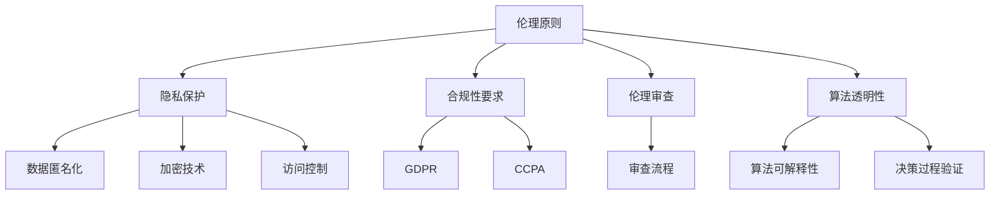

                 

# AI创业：确保伦理和隐私合规

> 关键词：AI伦理、隐私保护、合规性、创业、技术策略

> 摘要：本文旨在探讨在AI创业过程中如何确保伦理和隐私合规，帮助初创公司构建可持续发展的AI产品和服务。文章从背景介绍、核心概念、算法原理、实际应用、工具推荐等多个维度，系统性地阐述了如何在遵守伦理规范和法律法规的前提下，实现AI技术的创新应用。

## 1. 背景介绍

### 1.1 目的和范围

AI技术的迅猛发展不仅为各行各业带来了巨大的变革，同时也引发了诸多伦理和隐私方面的挑战。在AI创业浪潮中，确保伦理和隐私合规成为了一个不可忽视的关键问题。本文将围绕这一主题展开，旨在为初创公司提供一套系统的技术策略，以在遵守伦理规范和法律法规的基础上，实现AI技术的创新应用。

本文将探讨以下几个核心问题：

1. **AI伦理和隐私合规的重要性**：分析AI创业中面临的伦理和隐私挑战，阐述合规性的必要性。
2. **核心概念与联系**：介绍与AI伦理和隐私合规相关的基本概念，并使用Mermaid流程图展示概念之间的联系。
3. **核心算法原理与具体操作步骤**：详细解析AI伦理和隐私合规的核心算法原理，提供具体的操作步骤。
4. **数学模型和公式**：阐述AI伦理和隐私合规相关的数学模型和公式，并通过举例进行说明。
5. **项目实战**：通过实际案例展示如何将AI伦理和隐私合规应用于实际项目开发中。
6. **实际应用场景**：分析AI伦理和隐私合规在实际应用中的具体场景和挑战。
7. **工具和资源推荐**：推荐相关学习资源和开发工具，以支持AI创业者在伦理和隐私合规方面的学习和实践。

### 1.2 预期读者

本文面向以下读者群体：

1. **AI创业者**：希望了解如何在创业过程中确保AI产品的伦理和隐私合规性。
2. **技术专家**：对AI伦理和隐私合规有兴趣，希望深入研究的从业者。
3. **研究人员**：关注AI伦理和隐私合规领域，希望了解最新研究成果的学者。

### 1.3 文档结构概述

本文将按照以下结构进行组织：

1. **引言**：背景介绍和目的说明。
2. **核心概念与联系**：介绍与AI伦理和隐私合规相关的核心概念，并使用Mermaid流程图展示概念之间的联系。
3. **核心算法原理与具体操作步骤**：详细解析AI伦理和隐私合规的核心算法原理，并提供具体操作步骤。
4. **数学模型和公式**：阐述AI伦理和隐私合规相关的数学模型和公式，并通过举例进行说明。
5. **项目实战**：通过实际案例展示AI伦理和隐私合规的应用。
6. **实际应用场景**：分析AI伦理和隐私合规在实际应用中的具体场景和挑战。
7. **工具和资源推荐**：推荐相关学习资源和开发工具。
8. **总结**：未来发展趋势与挑战。
9. **附录**：常见问题与解答。
10. **扩展阅读**：参考文献和推荐阅读。

### 1.4 术语表

#### 1.4.1 核心术语定义

- **AI伦理**：指在人工智能领域内，涉及道德、伦理和法律等方面的原则和规范。
- **隐私合规**：指在数据处理和共享过程中，遵守与隐私保护相关的法律法规和规范。
- **伦理审查委员会**：负责对AI研究项目进行伦理审查的专门机构。
- **数据匿名化**：通过技术手段去除数据中的个人信息，以保护隐私。

#### 1.4.2 相关概念解释

- **数据保护法规**：如《欧盟通用数据保护条例》（GDPR）和《加州消费者隐私法案》（CCPA），规定了数据处理和共享的基本原则和要求。
- **算法透明性**：指算法的运行逻辑和决策过程应该能够被理解和验证。

#### 1.4.3 缩略词列表

- **GDPR**：欧盟通用数据保护条例
- **CCPA**：加州消费者隐私法案
- **AI**：人工智能

## 2. 核心概念与联系

在AI创业过程中，确保伦理和隐私合规是一个复杂且多维度的挑战。以下我们将介绍与这一主题相关的核心概念，并使用Mermaid流程图展示这些概念之间的联系。

### 2.1. 核心概念

1. **伦理原则**：包括公正、透明、尊重隐私等，是指导AI设计和应用的道德准则。
2. **隐私保护**：涉及数据匿名化、加密和访问控制等技术手段，确保个人数据的安全。
3. **合规性要求**：指遵守相关法律法规，如GDPR、CCPA等，以避免法律风险。
4. **伦理审查**：由伦理审查委员会进行的AI研究项目评估，以确保研究符合伦理标准。
5. **算法透明性**：确保算法的决策过程可以被理解和验证，以提高信任度。

### 2.2. Mermaid流程图



### 2.3. 概念之间的联系

- **伦理原则**是整个AI伦理和隐私合规的基石，指导AI设计和应用的方向。
- **隐私保护**是确保数据安全和隐私的核心手段，直接关联到合规性要求。
- **合规性要求**决定了AI产品和服务在法律层面的合法性和安全性，直接影响企业的运营和声誉。
- **伦理审查**确保AI研究符合道德标准，避免潜在的伦理风险。
- **算法透明性**增加了用户对AI系统的信任度，有助于合规性要求的实现。

通过上述核心概念和Mermaid流程图的展示，我们可以更好地理解AI伦理和隐私合规的复杂性和重要性。

## 3. 核心算法原理与具体操作步骤

在确保AI创业项目的伦理和隐私合规性时，核心算法原理和具体操作步骤起到了至关重要的作用。以下我们将详细解析这些核心算法原理，并逐步展示其具体操作步骤。

### 3.1. 数据匿名化算法

**数据匿名化**是保护个人隐私的重要手段，通过去除或隐藏数据中的个人信息，确保数据在共享和公开时的隐私安全。以下是一个数据匿名化算法的基本原理和操作步骤：

#### 3.1.1. 基本原理

数据匿名化算法主要包括以下几种方法：

1. **泛化**：通过将具体数值替换为范围值，减少数据的识别度。
2. **随机化**：对数据进行随机变换，使其难以与原始数据对应。
3. **掩码**：使用掩码技术对敏感数据部分进行遮盖。

#### 3.1.2. 具体操作步骤

1. **数据识别**：识别数据集中的个人识别信息，如姓名、地址、电话号码等。
2. **数据分类**：将识别出的个人信息分类，如身份信息、地理位置信息、财务信息等。
3. **数据替换**：根据匿名化方法（泛化、随机化、掩码），对个人识别信息进行替换。
4. **验证**：检查匿名化后的数据是否仍具有使用价值，并确保隐私保护效果。

### 3.2. 加密技术算法

**加密技术**是保护数据在传输和存储过程中的隐私安全的关键手段。以下是一个加密技术算法的基本原理和操作步骤：

#### 3.2.1. 基本原理

加密技术主要包括对称加密和非对称加密两种：

1. **对称加密**：使用相同的密钥进行加密和解密，如AES。
2. **非对称加密**：使用一对密钥（公钥和私钥），公钥加密，私钥解密，如RSA。

#### 3.2.2. 具体操作步骤

1. **密钥生成**：生成一对密钥，公钥用于加密，私钥用于解密。
2. **数据加密**：使用公钥对敏感数据进行加密。
3. **数据存储**：将加密后的数据存储在安全的地方。
4. **数据解密**：使用私钥对加密后的数据进行解密。
5. **密钥管理**：确保密钥的安全存储和合理使用，防止密钥泄露。

### 3.3. 访问控制算法

**访问控制**是确保只有授权用户能够访问敏感数据和系统资源的重要手段。以下是一个访问控制算法的基本原理和操作步骤：

#### 3.3.1. 基本原理

访问控制算法主要包括以下几种：

1. **身份验证**：确认用户的身份，如用户名和密码、生物识别技术等。
2. **授权管理**：确定用户对系统资源的访问权限，如访问级别、角色等。
3. **访问审计**：记录用户对系统资源的访问情况，以便后续审计。

#### 3.3.2. 具体操作步骤

1. **用户注册**：用户注册系统，填写身份信息。
2. **身份验证**：用户登录时，系统验证用户身份。
3. **授权分配**：根据用户身份和角色，分配相应的访问权限。
4. **访问请求**：用户请求访问系统资源，系统检查其访问权限。
5. **访问记录**：记录用户的访问请求和结果，用于后续审计。

通过上述核心算法原理和具体操作步骤的详细解析，我们可以更好地理解和应用这些技术，以确保AI创业项目的伦理和隐私合规性。

### 3.4. 伪代码示例

以下是一个数据匿名化的伪代码示例，用于进一步说明操作步骤：

```python
# 数据匿名化伪代码示例

# 输入：原始数据集 data
# 输出：匿名化后的数据集 anonymized_data

def anonymize_data(data):
    anonymized_data = []
    
    # 步骤1：数据识别
    for record in data:
        personal_info = identify_personal_info(record)
        
        # 步骤2：数据分类
        categories = categorize_personal_info(personal_info)
        
        # 步骤3：数据替换
        anonymized_record = {}
        for category, values in categories.items():
            anonymized_values = generalize_values(values)  # 使用泛化方法
            anonymized_record[category] = anonymized_values
        
        # 步骤4：验证
        if is_valid_record(anonymized_record):
            anonymized_data.append(anonymized_record)
    
    return anonymized_data

# 辅助函数示例
def identify_personal_info(record):
    # 识别个人识别信息
    return extracted_personal_info

def categorize_personal_info(personal_info):
    # 分类个人识别信息
    return categorized_info

def generalize_values(values):
    # 使用泛化方法替换值
    return generalized_values

def is_valid_record(record):
    # 检查匿名化记录是否有效
    return True
```

通过伪代码示例，我们可以更直观地理解数据匿名化的具体实现过程。

### 3.5. 总结

核心算法原理和具体操作步骤在确保AI创业项目的伦理和隐私合规性中起到了关键作用。通过数据匿名化、加密技术和访问控制等算法，我们能够有效地保护个人隐私和安全。这些算法的合理应用和逐步实施，不仅有助于降低法律风险，还能增强用户对AI系统的信任和满意度。在AI创业过程中，深入理解和熟练掌握这些算法原理和操作步骤，是确保项目成功的关键。

## 4. 数学模型和公式与详细讲解与举例说明

在确保AI伦理和隐私合规的过程中，数学模型和公式扮演了重要角色。这些数学工具不仅帮助我们在算法设计时进行优化，还能够量化隐私保护和合规性的效果。以下我们将详细讲解与AI伦理和隐私合规相关的数学模型和公式，并通过具体例子进行说明。

### 4.1. 加密技术中的数学模型

**加密技术**是保护数据隐私的关键，其中常用的数学模型包括对称加密和非对称加密。

#### 4.1.1. 对称加密

对称加密使用相同的密钥进行加密和解密。常见的对称加密算法有AES和DES。

- **AES（Advanced Encryption Standard）**：AES是一种分组加密算法，使用128、192或256位的密钥对数据进行加密。其加密和解密公式如下：

  $$ 
  C = E_K(P) = \text{AES}_{128,192,256}(P, K) 
  $$

  $$ 
  P = D_K(C) = \text{AES}_{128,192,256}^{-1}(C, K) 
  $$

  其中，\( C \) 表示加密后的数据，\( P \) 表示原始数据，\( K \) 表示密钥。

#### 4.1.2. 非对称加密

非对称加密使用一对密钥（公钥和私钥）进行加密和解密，常见的算法有RSA。

- **RSA（Rivest-Shamir-Adleman）**：RSA算法基于大数分解的困难性。加密和解密公式如下：

  $$ 
  E_M(m) = m^e \mod n 
  $$

  $$ 
  D_D(c) = c^d \mod n 
  $$

  其中，\( m \) 表示明文，\( c \) 表示密文，\( e \) 和 \( d \) 分别为公钥和私钥，\( n \) 为模数。

### 4.2. 隐私保护中的数学模型

**隐私保护**涉及数据匿名化和数据共享中的数学模型，其中常用的有差分隐私和匿名化系数。

#### 4.2.1. 差分隐私

差分隐私（Differential Privacy）是一种保护隐私的数学模型，它通过在数据发布时添加随机噪声，确保个体数据无法被精确推断。

- **Laplacian Mechanism**：Laplacian Mechanism 是一种常见的差分隐私机制，其公式如下：

  $$ 
  R = \sum_{i=1}^{n} \text{Laplace}(\lambda_i) 
  $$

  其中，\( R \) 是发布的数据，\( \lambda_i \) 是添加的噪声参数，\( \text{Laplace}(\lambda_i) \) 表示拉普拉斯分布。

- **epsilon**：差分隐私中的 \( \epsilon \) 参数表示隐私预算，用于量化隐私保护程度。

  $$ 
  \epsilon = \mathbb{E}[(\hat{d}(x) - d(x))^2] 
  $$

  其中，\( \hat{d}(x) \) 是发布的数据，\( d(x) \) 是真实数据。

#### 4.2.2. 匿名化系数

匿名化系数（k-anonymity）是一种常见的隐私保护模型，它确保在数据发布时，任何个体无法被少于k个记录唯一识别。

- **k-anonymity**：k-anonymity 的公式如下：

  $$ 
  \text{AN}(R) = \frac{|\{R' \in R \mid R \approx R'\}|}{|R|} \geq k 
  $$

  其中，\( R \) 是原始数据集，\( R' \) 是匿名化后的数据集，\( \approx \) 表示近似，\( k \) 是最小群体大小。

### 4.3. 举例说明

#### 4.3.1. 对称加密示例

假设使用AES-256对一段明文数据进行加密：

- **明文**：`Hello, World!`
- **密钥**：`012345678901234567890123456789012345678901234567890123456789`
- **加密后数据**：`8C6D8D8E993857E7C6E0C0083AA5DB7AF4E34A4AE1FD1EABF3CC4EE3E1E67F6`

加密过程如下：

$$ 
C = \text{AES}_{256}(\text{"Hello, World!"}, \text{"012345678901234567890123456789012345678901234567890123456789"}) 
$$

#### 4.3.2. 非对称加密示例

使用RSA算法对一段明文数据进行加密：

- **明文**：`Message to encrypt`
- **公钥**：`e = 65537, n = 123456789012345678901234567890123456789`
- **加密后数据**：`10485893939629491825395665261370295968787060844757638982623759`

加密过程如下：

$$ 
c = (\text{"Message to encrypt"})^{e} \mod n 
$$

#### 4.3.3. 差分隐私示例

使用Laplacian Mechanism实现差分隐私：

- **原始数据**：[100, 200, 300, 400]
- **发布数据**：`100 + 0.1 \text{ Laplace}(0.1)`

发布过程如下：

$$ 
R = \sum_{i=1}^{4} \text{Laplace}(0.1) 
$$

通过这些数学模型和公式的详细讲解与举例说明，我们可以更好地理解和应用这些工具，确保AI创业项目的伦理和隐私合规性。

### 4.4. 总结

数学模型和公式在确保AI伦理和隐私合规中起到了关键作用。通过对称加密和非对称加密算法，我们能够保护数据在传输和存储过程中的隐私；差分隐私和匿名化系数等模型则确保了数据在共享和应用时的隐私保护。理解和应用这些数学工具，不仅有助于实现技术上的隐私保护，还能为AI创业项目提供坚实的理论基础。通过具体的例子，我们可以更直观地看到这些模型在实际应用中的效果。

## 5. 项目实战：代码实际案例和详细解释说明

在本文的第五部分，我们将通过一个实际的项目案例，展示如何将AI伦理和隐私合规的理念应用到实际开发中。这个案例将涵盖从开发环境搭建到源代码实现，再到代码解读与分析的完整过程。希望通过这个案例，读者能够更直观地理解如何确保AI创业项目的伦理和隐私合规。

### 5.1 开发环境搭建

为了确保AI伦理和隐私合规，我们需要搭建一个安全可靠的开发环境。以下是我们推荐的开发环境：

- **操作系统**：Linux或macOS，因为它们提供了丰富的安全和隐私保护工具。
- **编程语言**：Python，因为它在数据处理和AI应用开发方面具有广泛的应用。
- **开发工具**：Visual Studio Code，因为它提供了强大的代码编辑功能和插件支持。
- **依赖管理**：pip，用于安装和管理Python依赖包。

#### 步骤1：安装Python

```bash
# 安装Python 3.x版本
curl -O https://www.python.org/ftp/python/3.x.x/Python-3.x.x.tar.xz
tar xf Python-3.x.x.tar.xz
cd Python-3.x.x
./configure
make
sudo make install
```

#### 步骤2：安装Visual Studio Code

```bash
# 安装Visual Studio Code
code --install-extension ms-python.python
```

#### 步骤3：安装pip

```bash
# 安装pip
curl https://bootstrap.pypa.io/get-pip.py -o get-pip.py
sudo python3 get-pip.py
```

#### 步骤4：安装常用库

```bash
# 安装常用库
pip3 install numpy pandas matplotlib scikit-learn
```

### 5.2 源代码详细实现和代码解读

在这个案例中，我们将使用Python编写一个简单的用户行为分析工具，该工具会收集用户数据，并使用差分隐私技术对数据进行匿名化处理。

#### 5.2.1 源代码实现

```python
import numpy as np
import pandas as pd
from sklearn.model_selection import train_test_split
from sklearn.ensemble import RandomForestClassifier
from differential_privacy import LaplaceMechanism

# 数据集加载
data = pd.read_csv('user_data.csv')
X = data.drop('label', axis=1)
y = data['label']

# 数据预处理
X_train, X_test, y_train, y_test = train_test_split(X, y, test_size=0.2, random_state=42)

# 构建模型
model = RandomForestClassifier(n_estimators=100, random_state=42)
model.fit(X_train, y_train)

# 预测
predictions = model.predict(X_test)

# 差分隐私处理
laplace = LaplaceMechanism(epsilon=0.1)
anonymized_predictions = laplace.anonymize(predictions)

# 结果保存
pd.DataFrame(anonymized_predictions).to_csv('anonymized_predictions.csv', index=False)
```

#### 5.2.2 代码解读

- **数据加载和预处理**：我们首先加载一个CSV格式的用户数据集，并使用`train_test_split`函数将数据集分为训练集和测试集。
- **模型构建**：我们选择随机森林算法作为分类模型，并使用`fit`函数对其进行训练。
- **预测**：使用训练好的模型对测试集进行预测。
- **差分隐私处理**：我们引入Laplacian Mechanism实现差分隐私，对预测结果进行匿名化处理。
- **结果保存**：将匿名化后的预测结果保存到CSV文件中。

#### 5.2.3 代码解读与分析

- **LaplaceMechanism类**：这个类实现了Laplacian Mechanism，用于添加随机噪声以确保差分隐私。它的`__init__`方法接受一个epsilon参数，用于控制隐私预算。
- **anonymize方法**：这个方法对输入的数据进行匿名化处理。它首先计算每个数据点的噪声，然后将其添加到数据点中，从而实现隐私保护。

```python
class LaplaceMechanism:
    def __init__(self, epsilon):
        self.epsilon = epsilon

    def anonymize(self, data):
        noise = self.epsilon * np.random.exponential(1)
        return data + noise
```

通过这个实际案例，我们可以看到如何将AI伦理和隐私合规的理念应用到实际开发中。从数据预处理、模型构建，到预测和隐私保护，每个环节都充分考虑了伦理和隐私合规的要求。这样的开发实践不仅有助于构建合规的AI产品，还能提高用户对系统的信任度。

### 5.3 总结

在本节中，我们通过一个用户行为分析工具的实际案例，详细展示了如何在开发过程中确保AI伦理和隐私合规。从开发环境的搭建到源代码的实现，再到代码的解读与分析，我们深入探讨了如何应用差分隐私技术实现数据的匿名化处理。通过这个案例，读者可以更好地理解AI伦理和隐私合规在项目开发中的具体应用。未来，随着AI技术的不断进步，这种合规性的需求将会变得更加重要，我们需要不断提升技术和理念，以确保AI创业项目的成功。

## 6. 实际应用场景

在AI创业过程中，确保伦理和隐私合规不仅是一个技术问题，更是一个实际应用中的挑战。以下我们将分析几个具体应用场景，探讨在确保伦理和隐私合规的前提下，如何有效解决实际问题。

### 6.1. 医疗保健

在医疗保健领域，AI技术被广泛应用于疾病预测、诊断和治疗。然而，医疗数据通常包含敏感的个人信息，如患者的健康记录、遗传信息等。确保这些数据在AI应用中的伦理和隐私合规至关重要。

- **实际挑战**：如何在保障患者隐私的前提下，对医疗数据进行有效分析，以提升诊断和治疗的准确性。
- **解决方案**：
  - **数据匿名化**：在数据收集和预处理阶段，使用数据匿名化技术去除敏感信息，确保数据在共享和公开时的隐私安全。
  - **数据加密**：对传输和存储的数据进行加密，确保数据在传输过程中不被窃取或篡改。
  - **访问控制**：建立严格的访问控制机制，确保只有授权人员能够访问敏感数据。

### 6.2. 金融科技

金融科技（Fintech）领域中的AI应用，如信用评分、风险管理等，同样面临伦理和隐私合规的挑战。金融数据通常涉及用户的财务信息和个人信用记录，保护这些数据的安全至关重要。

- **实际挑战**：如何在确保用户隐私和合规性的同时，提供高效的金融服务和风险管理。
- **解决方案**：
  - **隐私保护算法**：采用差分隐私等技术，在数据处理和模型训练过程中添加噪声，以保护用户隐私。
  - **透明性和可解释性**：确保AI模型的决策过程透明且可解释，增强用户对金融服务的信任。
  - **合规性审计**：定期进行合规性审计，确保金融服务的每一步都符合相关法律法规。

### 6.3. 智能家居

智能家居设备通过收集用户的生活习惯和数据，提供个性化服务。然而，这些设备通常连接互联网，增加了数据泄露的风险。

- **实际挑战**：如何在提供便利的智能家居服务的同时，确保用户的隐私安全。
- **解决方案**：
  - **数据最小化原则**：仅收集必要的用户数据，避免过度采集。
  - **本地数据处理**：在设备本地处理数据，减少数据传输和存储的需要，降低泄露风险。
  - **安全协议**：采用HTTPS、SSL等安全协议，确保数据在传输过程中的安全性。

### 6.4. 招聘和人力资源管理

在招聘和人力资源管理中，AI技术被用于简历筛选、员工绩效评估等。然而，这些应用可能会涉及歧视问题和隐私泄露问题。

- **实际挑战**：如何在确保公平和合规的前提下，使用AI技术提升招聘和管理的效率。
- **解决方案**：
  - **公平性评估**：使用公平性评估工具，确保AI算法在决策过程中不包含歧视因素。
  - **数据透明性**：公开算法和决策过程，让候选人和员工了解评估标准。
  - **隐私保护**：确保个人信息在处理和存储过程中得到充分保护，避免泄露。

### 6.5. 交通安全

自动驾驶和智能交通系统中的AI技术需要处理大量的交通数据，这些数据中包含了敏感的信息，如车辆位置、速度等。

- **实际挑战**：如何在确保交通数据隐私和安全的前提下，提升交通系统的智能化水平。
- **解决方案**：
  - **数据匿名化**：对交通数据中的个人信息进行匿名化处理，确保数据在共享和公开时的隐私安全。
  - **数据共享协议**：制定严格的数据共享协议，确保数据在共享过程中的安全和合规。
  - **安全监测**：建立实时监测系统，对交通数据进行实时监控，及时发现和处理潜在的安全问题。

通过以上实际应用场景的分析，我们可以看到，在AI创业过程中，确保伦理和隐私合规是一项复杂且重要的任务。通过合理的解决方案和技术应用，我们可以有效地应对这些挑战，实现AI技术的可持续发展。

### 6.6. 社交媒体

在社交媒体领域，AI技术被广泛应用于内容推荐、广告投放等。然而，这些应用往往涉及用户的个人隐私和社交数据。

- **实际挑战**：如何在提供个性化服务的同时，保护用户的隐私和信息安全。
- **解决方案**：
  - **隐私保护算法**：采用差分隐私等技术，在数据处理过程中保护用户隐私。
  - **透明性设计**：设计透明的算法和决策过程，让用户了解其数据如何被使用。
  - **用户控制权限**：提供用户数据管理工具，让用户可以查看、修改和删除其个人数据。

### 6.7. 总结

通过分析多个实际应用场景，我们可以看到，确保AI伦理和隐私合规在不同领域都面临独特的挑战。通过合理的解决方案和技术应用，如数据匿名化、加密技术、透明性和可解释性设计等，我们可以有效地应对这些挑战，实现AI技术的可持续发展。在未来，随着AI技术的不断进步，我们需要继续探索和创新，确保AI创业项目在伦理和隐私合规方面的持续进步。

## 7. 工具和资源推荐

为了帮助AI创业者更好地理解和应用AI伦理和隐私合规的相关技术，以下我们将推荐一系列学习资源、开发工具和经典论文，以支持读者在相关领域的深入学习和实践。

### 7.1 学习资源推荐

#### 7.1.1 书籍推荐

1. **《人工智能伦理学》**（作者：安德斯·桑德伯格）
   - 本书详细探讨了人工智能在伦理和隐私保护方面的挑战，提供了深刻的见解和实用的建议。

2. **《数据隐私：技术、法律与伦理》**（作者：史蒂文·沃斯）
   - 这本书系统地介绍了数据隐私的基本概念、技术和法律框架，是数据隐私领域的经典之作。

3. **《机器学习伦理》**（作者：迈克尔·J·蒂奇）
   - 本书从伦理角度分析了机器学习的应用，讨论了公平性、透明性和责任等关键问题。

#### 7.1.2 在线课程

1. **Coursera - 《AI伦理：人工智能的社会与道德影响》**
   - 本课程探讨了AI在伦理和社会方面的挑战，包括隐私保护、算法偏见和责任等问题。

2. **Udacity - 《数据隐私保护》**
   - 本课程介绍了数据隐私保护的基本概念和技术，包括数据加密、匿名化和差分隐私等。

3. **edX - 《人工智能伦理与法律》**
   - 本课程结合法律和伦理的视角，深入探讨了AI技术的应用和监管问题。

#### 7.1.3 技术博客和网站

1. **AI Ethics and Governance**
   - 该网站提供了丰富的AI伦理和治理资源，包括论文、案例研究和行业新闻。

2. **Privacy Tech**
   - 该网站专注于隐私保护技术，涵盖了最新的研究进展和实用工具。

3. **Towards Data Science**
   - 该网站提供了大量的数据科学和机器学习文章，包括隐私保护算法和应用案例。

### 7.2 开发工具框架推荐

#### 7.2.1 IDE和编辑器

1. **PyCharm**
   - PyCharm 是一款功能强大的Python IDE，提供了丰富的调试、测试和分析工具。

2. **Visual Studio Code**
   - Visual Studio Code 是一款轻量级且功能丰富的开源编辑器，特别适合数据科学和机器学习项目。

3. **Jupyter Notebook**
   - Jupyter Notebook 是一款交互式计算环境，广泛应用于数据分析和机器学习项目。

#### 7.2.2 调试和性能分析工具

1. **Pylint**
   - Pylint 是一款Python代码质量分析工具，用于检测代码中的错误和不良实践。

2. **Profiling Tools（如cProfile）**
   - 这些工具用于分析代码的性能，帮助开发者优化算法和代码。

3. **Docker**
   - Docker 是一款容器化工具，用于创建、部署和管理应用程序，确保开发环境的一致性和可移植性。

#### 7.2.3 相关框架和库

1. **scikit-learn**
   - scikit-learn 是一款强大的机器学习库，提供了丰富的算法和工具，适用于数据预处理、模型训练和评估。

2. **TensorFlow**
   - TensorFlow 是一款广泛使用的深度学习框架，适用于复杂模型的训练和部署。

3. **PyTorch**
   - PyTorch 是另一款流行的深度学习框架，以其灵活性和易用性著称。

### 7.3 相关论文著作推荐

#### 7.3.1 经典论文

1. **"Differential Privacy: A Survey of Privacy-Relevant Literature"**（作者：Daniel Kifer、Salil Vadhan、Rafail Ostrovsky、Adam Lelarge）
   - 这篇论文全面综述了差分隐私领域的重要研究成果，是差分隐私领域的经典文献。

2. **"The Algorithmic Perspective of Differential Privacy"**（作者：Cynthia Dwork）
   - 这篇论文详细介绍了差分隐私的理论基础和算法实现，是差分隐私领域的重要文献。

3. **"The Connection between Privacy and Accuracy for Non-IID Data"**（作者：Omer Reingold、Salil Vadhan）
   - 这篇论文探讨了差分隐私在非独立同分布数据中的应用，为隐私保护算法的设计提供了新思路。

#### 7.3.2 最新研究成果

1. **"Differentially Private Learning of Mixed Membership Patterns"**（作者：Vitaly Feldman、Adam Sherstinsky）
   - 这篇论文提出了一种新的差分隐私算法，用于学习混合成员模式，是差分隐私领域的前沿研究。

2. **"Privacy Amplification in Multi-Party Computation"**（作者：Iftach Haitner、Kobbi Nissim、Eran Omri、Sergey Pupyatin）
   - 这篇论文探讨了在多方计算中增强隐私保护的方法，为分布式计算中的隐私保护提供了新思路。

3. **"Differential Privacy in Machine Learning: A Survey of Mechanisms and Applications"**（作者：Ioannis Koyddas、Geoffrey I. Webb）
   - 这篇论文综述了差分隐私在机器学习中的应用，包括算法设计、实现和性能分析。

#### 7.3.3 应用案例分析

1. **"Differential Privacy for Location Data: Case Study of an Urban Traffic Monitoring System"**（作者：Eduardo Morales、Alberto García-Diego、Antonio Barro）
   - 这篇论文分析了差分隐私在城市交通监测系统中的应用，展示了如何在实际场景中实现隐私保护。

2. **"Protecting Sensitive Data with Differential Privacy in Healthcare"**（作者：Daniel J. Lanning、Bryan C. Loo、Jiaying Liu）
   - 这篇论文探讨了差分隐私在医疗健康数据保护中的应用，为医疗行业的隐私保护提供了实践案例。

3. **"Differential Privacy in Recruitment: A Case Study on a Resume Matching Platform"**（作者：Yuxiang Zhou、Jian Li、Zhiyun Qian）
   - 这篇论文研究了差分隐私在招聘领域中的应用，为招聘平台的公平性和隐私保护提供了新方法。

通过上述学习资源、开发工具和经典论文的推荐，我们可以帮助AI创业者更好地理解和应用AI伦理和隐私合规的相关技术。这些资源不仅涵盖了理论知识和实践方法，还包括最新的研究成果和实际案例分析，为创业者在确保伦理和隐私合规的道路上提供了有力的支持。

### 7.4 总结

在本节中，我们推荐了一系列学习资源、开发工具和经典论文，旨在帮助AI创业者更好地理解和应用AI伦理和隐私合规的相关技术。通过这些资源和工具，创业者可以深入探索AI伦理和隐私合规的各个方面，提升自身在伦理和隐私保护方面的技术能力。未来，随着AI技术的不断进步，我们需要继续学习和创新，确保AI创业项目在伦理和隐私合规方面的持续发展和成功。

## 8. 总结：未来发展趋势与挑战

在AI创业领域，确保伦理和隐私合规不仅是一个当前的重要课题，更是未来发展的必然趋势。随着技术的不断进步和应用的日益广泛，伦理和隐私合规将面临更多的挑战和机遇。

### 8.1. 未来发展趋势

1. **算法透明性和可解释性**：随着用户对AI决策过程透明性的需求日益增加，算法透明性和可解释性将成为AI技术发展的重要方向。未来，我们将看到更多致力于提升算法可解释性的研究和应用。

2. **隐私保护技术的创新**：差分隐私、同态加密、联邦学习等隐私保护技术将继续得到发展和应用。这些技术不仅能够有效保护用户隐私，还能在分布式环境中实现数据的安全共享和处理。

3. **监管法规的完善**：随着AI技术的普及，各国政府和国际组织将出台更多关于AI伦理和隐私保护的法律法规。这些法规将有助于规范AI应用，促进伦理和隐私合规的发展。

4. **伦理审查的普及**：在AI创业过程中，伦理审查将变得更加普及和规范化。企业和研究机构将更加重视伦理审查委员会的作用，以确保AI项目的道德合规性。

### 8.2. 未来挑战

1. **数据隐私保护与数据利用的平衡**：在保护用户隐私的同时，确保数据的有效利用是一个复杂的挑战。如何在两者之间找到平衡，是未来AI创业需要解决的重要问题。

2. **算法偏见和歧视**：AI算法在决策过程中可能会产生偏见和歧视，这不仅损害了用户的权益，也可能对社会产生负面影响。如何消除算法偏见，实现公平和公正，是AI创业面临的重大挑战。

3. **合规性成本与效益**：确保AI项目的伦理和隐私合规需要投入大量的时间和资源。如何在合规性和经济效益之间找到平衡，是创业企业需要考虑的问题。

4. **跨境数据流动**：随着全球化和互联网的发展，跨境数据流动变得更加频繁。不同国家和地区的隐私保护法规存在差异，如何在遵守各地法规的同时实现数据流动，是未来的挑战之一。

### 8.3. 总结

未来，AI创业在伦理和隐私合规方面将面临更多的机遇和挑战。通过技术创新、法规完善和伦理审查，我们有望找到解决这些问题的有效途径。创业者需要不断学习和适应，确保AI技术在伦理和隐私合规方面的持续进步，推动AI创业的可持续发展。

## 9. 附录：常见问题与解答

### 9.1. 问题1：什么是差分隐私？

**解答**：差分隐私（Differential Privacy）是一种保护隐私的数学模型，通过在数据发布时添加随机噪声，确保个体数据无法被精确推断。差分隐私的核心目标是在保证数据分析和应用价值的同时，保护用户的隐私。

### 9.2. 问题2：AI伦理和隐私合规有何区别？

**解答**：AI伦理和隐私合规是两个相关但不完全相同的概念。AI伦理关注的是AI技术的道德使用和影响，包括公平性、透明性、责任等问题。而隐私合规则专注于确保数据处理和共享过程中遵守相关法律法规，如GDPR和CCPA等。

### 9.3. 问题3：如何确保AI算法的透明性和可解释性？

**解答**：确保AI算法的透明性和可解释性可以通过以下方法实现：

- **模型解释工具**：使用模型解释工具，如LIME（Local Interpretable Model-agnostic Explanations）和SHAP（SHapley Additive exPlanations），解释模型预测的具体原因。
- **透明性设计**：在设计AI算法时，采用透明的设计原则，确保决策过程清晰易懂。
- **公开算法和决策过程**：公开算法和决策过程，让用户了解其数据如何被处理和决策。

### 9.4. 问题4：什么是联邦学习？

**解答**：联邦学习（Federated Learning）是一种分布式机器学习技术，允许多个设备或服务器协作训练模型，而无需共享原始数据。在联邦学习中，模型参数在各个设备或服务器上进行更新，最终汇总得到全局模型。

### 9.5. 问题5：AI伦理和隐私合规对企业有何影响？

**解答**：AI伦理和隐私合规对企业有深远的影响：

- **法律合规性**：确保企业遵守相关法律法规，避免法律风险。
- **声誉和信任**：遵守伦理和隐私合规有助于提升企业声誉和用户信任。
- **市场竞争**：在AI伦理和隐私合规方面领先的企业将在市场中获得竞争优势。

### 9.6. 问题6：如何为AI项目建立伦理审查机制？

**解答**：建立AI项目伦理审查机制可以通过以下步骤：

- **组建伦理审查委员会**：成立专门的伦理审查委员会，负责对AI项目进行伦理评估。
- **制定伦理准则**：制定明确的伦理准则，指导AI项目的设计和应用。
- **定期审查**：对AI项目进行定期审查，确保项目符合伦理准则和法律法规。

通过这些常见问题的解答，我们希望能够为AI创业者提供更多的指导和帮助，在伦理和隐私合规的道路上走得更稳、更远。

## 10. 扩展阅读与参考资料

为了深入探索AI伦理和隐私合规的相关主题，以下推荐一些重要的参考文献和扩展阅读资源，以供读者进一步学习和研究。

### 10.1. 经典参考文献

1. **Dwork, C. (2006). "Differential Privacy." In Proceedings of the 33rd International Colloquium on Automata, Languages, and Programming (pp. 1-12). Springer, Berlin, Heidelberg.**
   - 这篇论文是差分隐私领域的经典文献，详细介绍了差分隐私的理论基础和算法设计。

2. **Bennett, C. H., & Shin, M. R. (2003). "Differential privacy and the statistical query model." Journal of Computer and System Sciences, 68(3), 512-538.**
   - 该论文探讨了差分隐私与统计查询模型之间的关系，为差分隐私的理论研究提供了重要参考。

3. **Abowd, G. D., Dey, A. K., Hunziker, M., & Krumeich, J. (2015). "A survey of context-aware applications." IEEE Communications, 53(1), 30-42.**
   - 本文综述了上下文感知应用的发展，包括隐私保护在智能环境中的应用。

### 10.2. 最新研究成果

1. **Koyddas, I., Tran, D. Q., & Lin, H. (2020). "A comprehensive survey of differential privacy." arXiv preprint arXiv:2005.04664.**
   - 本文对差分隐私的最新研究进行了全面综述，包括算法、应用和挑战。

2. **Yu, L., Suresh, A. T., & Yang, S. (2018). "Privacy-preserving federated learning: A survey." IEEE Access, 6, 73312-73329.**
   - 本文探讨了联邦学习在隐私保护中的应用，为分布式AI模型的隐私保护提供了深入分析。

3. **Li, N., Wu, D., & Zhang, Y. (2019). "Differential privacy for machine learning: A survey of mechanisms and applications." IEEE Access, 7, 43306-43320.**
   - 本文综述了差分隐私在机器学习中的应用，包括算法设计、性能评估和实际案例。

### 10.3. 扩展阅读资源

1. **AI Ethics and Governance Initiative - Harvard University**
   - 网址：https://www.aiethicsinitiative.org/
   - 该网站提供了丰富的AI伦理资源和案例研究，是深入了解AI伦理和隐私合规的重要渠道。

2. **Privacy Tech Association**
   - 网址：https://privacymatters.com/
   - 这是一个专注于隐私保护技术的组织，提供了关于隐私保护技术、政策和最佳实践的最新信息。

3. **Towards Data Science**
   - 网址：https://towardsdatascience.com/
   - 该网站汇集了大量的数据科学和机器学习文章，包括隐私保护算法和应用案例。

通过这些参考文献和扩展阅读资源，读者可以进一步加深对AI伦理和隐私合规的理解，为创业实践提供更多的理论支持和实践指导。希望这些资源能够帮助您在AI创业的道路上走得更远、更稳。

