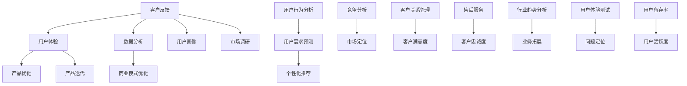

                 

# AI创业：获取客户反馈

> 关键词：AI创业、客户反馈、用户体验、数据分析、商业模式

> 摘要：本文旨在探讨AI创业公司如何有效地获取客户反馈，优化产品与服务，提升用户体验，从而构建可持续发展的商业模式。我们将从背景介绍、核心概念与联系、核心算法原理、数学模型、项目实战、实际应用场景等多个方面进行详细分析，帮助读者了解并掌握AI创业中获取客户反馈的关键步骤与策略。

## 1. 背景介绍

### 1.1 目的和范围

本文旨在为AI创业公司提供一套系统性的方法和策略，以有效地获取客户反馈，从而提升产品质量、优化用户体验，最终实现商业模式的可持续发展和成功。本文主要涵盖以下内容：

- 获取客户反馈的重要性
- 客户反馈的获取渠道与方法
- 分析与处理客户反馈
- 基于客户反馈的产品优化策略
- 实际案例与经验分享

### 1.2 预期读者

本文主要面向AI创业公司创始人、产品经理、用户体验设计师、数据分析专家等对AI领域感兴趣的从业者。同时，也欢迎对用户体验和商业模式创新感兴趣的其他读者阅读和学习。

### 1.3 文档结构概述

本文共分为十个部分，具体如下：

1. 背景介绍
   - 1.1 目的和范围
   - 1.2 预期读者
   - 1.3 文档结构概述
   - 1.4 术语表
2. 核心概念与联系
3. 核心算法原理 & 具体操作步骤
4. 数学模型和公式 & 详细讲解 & 举例说明
5. 项目实战：代码实际案例和详细解释说明
6. 实际应用场景
7. 工具和资源推荐
   - 7.1 学习资源推荐
   - 7.2 开发工具框架推荐
   - 7.3 相关论文著作推荐
8. 总结：未来发展趋势与挑战
9. 附录：常见问题与解答
10. 扩展阅读 & 参考资料

### 1.4 术语表

在本文中，我们使用以下术语，以帮助读者更好地理解文章内容：

- 客户反馈：指客户对产品或服务的评价、建议、需求等信息。
- 用户体验：指用户在使用产品或服务过程中所感受到的愉悦程度、操作简便性、满足度等。
- 商业模式：指公司通过提供产品或服务来获取利润的途径和方法。

#### 1.4.1 核心术语定义

- AI创业：指利用人工智能技术进行商业创新和创业活动。
- 数据分析：指通过使用数学、统计、机器学习等方法对数据进行处理、挖掘和分析，以获得有价值的信息和洞察。
- 用户画像：指基于用户行为、偏好、需求等特征，对用户进行分类和描述的方法。

#### 1.4.2 相关概念解释

- 客户反馈的重要性：客户反馈是产品和服务改进的重要依据，有助于了解用户需求、发现潜在问题、优化产品设计，进而提升用户体验和满意度。
- 用户体验：用户体验不仅仅是产品的使用感受，还涉及到用户在接触产品前、中、后的整个过程中所感受到的服务质量。
- 商业模式：商业模式是指公司如何创造、传递和获取价值，是公司实现盈利的核心途径。

#### 1.4.3 缩略词列表

- AI：人工智能
- UX：用户体验
- C端：消费者端
- B端：企业端
- A/B测试：一种常用的实验方法，通过将用户随机分为两组，一组使用A方案，另一组使用B方案，来比较两种方案的效果。

## 2. 核心概念与联系

在本节中，我们将介绍AI创业公司获取客户反馈所需的核心概念和它们之间的联系。为了更好地理解这些概念，我们使用Mermaid流程图来展示它们之间的关系。



### 2.1 客户反馈与用户体验

客户反馈是用户体验的重要来源。用户体验直接影响客户满意度，而客户满意度又是衡量公司业务成功与否的关键指标。通过收集和分析客户反馈，我们可以发现产品或服务的不足之处，从而进行针对性的优化和改进。

### 2.2 数据分析与产品优化

数据分析是AI创业公司获取客户反馈的重要工具。通过对客户反馈进行数据挖掘和分析，我们可以识别出用户需求、行为模式和问题，进而指导产品优化和迭代。

### 2.3 商业模式优化

基于客户反馈的数据分析，公司可以调整商业模式，以更好地满足市场需求。例如，通过个性化推荐提高用户满意度，通过竞争分析优化市场定位，从而提升业务拓展能力。

### 2.4 用户画像与用户需求预测

用户画像是一种基于用户行为和偏好的数据分析方法，有助于识别不同用户群体的特征和需求。通过对用户画像进行分析，我们可以预测用户需求，从而为产品和服务提供个性化的解决方案。

### 2.5 用户行为分析与个性化推荐

用户行为分析是一种基于用户行为数据的数据挖掘方法。通过分析用户行为，我们可以发现用户的兴趣和偏好，从而实现个性化推荐，提高用户满意度和忠诚度。

### 2.6 竞争分析、市场定位与业务拓展

竞争分析和市场定位是公司在市场竞争中取得优势的关键。通过分析竞争对手和市场需求，公司可以确定合适的市场定位，从而实现业务拓展和增长。

### 2.7 客户关系管理、客户满意度和客户忠诚度

客户关系管理是一种旨在提高客户满意度和忠诚度的策略。通过提供优质的售后服务和个性化的解决方案，公司可以增强客户满意度，提高客户忠诚度，从而降低客户流失率。

### 2.8 市场调研与行业趋势分析

市场调研和行业趋势分析有助于公司了解市场动态和竞争环境。通过分析市场数据和行业趋势，公司可以制定合适的业务战略，抓住市场机遇，实现业务增长。

### 2.9 产品迭代与用户体验测试

产品迭代是公司不断改进产品和服务的过程。通过用户体验测试，公司可以识别产品中的问题，及时进行优化，提高用户体验和满意度。

### 2.10 用户留存率和用户活跃度

用户留存率和用户活跃度是衡量产品和服务成功与否的关键指标。通过分析用户留存率和活跃度，公司可以了解产品的受欢迎程度，从而调整产品策略，提高用户满意度。

## 3. 核心算法原理 & 具体操作步骤

在AI创业过程中，获取客户反馈是至关重要的。本节将介绍如何通过核心算法原理和具体操作步骤来有效地收集、处理和分析客户反馈。

### 3.1 客户反馈收集算法原理

客户反馈收集的核心算法包括以下几种：

1. **问卷调查算法**：通过设计针对性的问卷调查，收集用户对产品或服务的评价、建议和需求。问卷调查算法的关键在于如何设计出具有代表性和有效性的问卷。
2. **用户行为分析算法**：通过对用户在使用产品或服务过程中的行为数据进行分析，提取出用户偏好、兴趣和行为模式。用户行为分析算法的核心是特征提取和模式识别。
3. **用户反馈分类算法**：将收集到的用户反馈进行分类，以便更好地分析和处理。常用的分类算法包括朴素贝叶斯分类器、支持向量机等。

### 3.2 客户反馈收集具体操作步骤

1. **设计问卷**：
   - **确定问卷目的**：明确问卷要收集的用户信息，例如用户满意度、产品功能需求等。
   - **设计问卷结构**：设计问题类型（单选、多选、评分等），确保问题清晰、简洁、易于理解。
   - **测试问卷**：在小范围内测试问卷，收集反馈并优化问卷设计。

2. **收集用户行为数据**：
   - **用户注册和登录**：通过用户注册和登录获取用户基本信息。
   - **行为跟踪**：利用埋点技术或用户行为追踪工具，记录用户在产品或服务中的操作行为，如页面浏览、功能使用、评价等。

3. **处理和存储数据**：
   - **数据清洗**：对收集到的用户反馈和行为数据进行清洗，去除无效和重复数据。
   - **数据存储**：将清洗后的数据存储在数据库中，便于后续分析和处理。

4. **分类和标签**：
   - **文本分类**：利用机器学习算法（如朴素贝叶斯、支持向量机等）对用户反馈进行分类，提取关键词和主题。
   - **标签管理**：对分类结果进行标签管理，以便后续分析和处理。

5. **分析反馈**：
   - **统计分析**：对用户反馈进行统计分析，识别出高频问题、用户满意度等关键指标。
   - **可视化分析**：通过可视化工具（如柱状图、饼图等）展示分析结果，帮助团队更好地理解用户需求。

6. **反馈处理**：
   - **问题定位**：针对用户反馈中提到的问题，进行详细分析和定位，找出问题的根本原因。
   - **优化建议**：根据分析结果，提出产品优化建议，如改进功能、修复bug等。

### 3.3 客户反馈处理算法原理

客户反馈处理的核心算法包括以下几种：

1. **自然语言处理算法**：用于处理和分析文本数据，如情感分析、主题分类等。
2. **机器学习算法**：用于对用户反馈进行分类和预测，如决策树、随机森林等。
3. **数据挖掘算法**：用于发现数据中的模式和关联，如关联规则挖掘、聚类分析等。

### 3.4 客户反馈处理具体操作步骤

1. **预处理数据**：
   - **文本清洗**：去除文本中的噪声，如标点符号、停用词等。
   - **文本分词**：将文本切分成单词或短语，以便进行进一步处理。

2. **情感分析**：
   - **训练模型**：利用情感分析算法（如基于词袋模型的情感分类器）对用户反馈进行情感分类。
   - **评估模型**：通过交叉验证和测试集评估模型性能，调整模型参数。

3. **主题分类**：
   - **训练模型**：利用主题分类算法（如朴素贝叶斯、LDA等）对用户反馈进行主题分类。
   - **评估模型**：通过交叉验证和测试集评估模型性能，调整模型参数。

4. **问题定位**：
   - **分析反馈**：根据情感分析和主题分类结果，识别出用户反馈中的高频问题和关键点。
   - **定位问题**：结合用户行为数据和产品日志，找出问题的根本原因。

5. **优化建议**：
   - **提出建议**：根据问题定位和分析结果，提出产品优化建议。
   - **优先级排序**：根据问题和建议的重要性和紧迫性，对优化建议进行优先级排序。

6. **实施优化**：
   - **开发与测试**：根据优化建议进行产品开发，并进行测试和验证。
   - **上线与反馈**：将优化后的产品或服务上线，收集用户反馈，再次进行优化。

## 4. 数学模型和公式 & 详细讲解 & 举例说明

在AI创业过程中，数学模型和公式对于分析和处理客户反馈至关重要。本节将介绍一些常用的数学模型和公式，并详细讲解其应用和计算方法。

### 4.1 评价指标

在客户反馈分析中，评价指标是衡量用户满意度、问题严重程度等的关键指标。以下是一些常用的评价指标：

1. **平均满意度评分（AVG_Score）**：

$$
\text{AVG\_Score} = \frac{\sum_{i=1}^{n} s_i}{n}
$$

其中，$s_i$ 表示第 $i$ 个用户给出的满意度评分，$n$ 表示总用户数。

2. **标准差（STD_Score）**：

$$
\text{STD\_Score} = \sqrt{\frac{\sum_{i=1}^{n} (s_i - \text{AVG\_Score})^2}{n-1}}
$$

3. **情感极性（Sentiment_Polarity）**：

$$
\text{Sentiment\_Polarity} = \frac{\sum_{i=1}^{n} w_i \times s_i}{n}
$$

其中，$w_i$ 表示第 $i$ 个词语的情感权重，$s_i$ 表示第 $i$ 个词语的极性值（1表示正面，-1表示负面）。

4. **问题严重程度（Severity_Score）**：

$$
\text{Severity\_Score} = \frac{\sum_{i=1}^{n} w_i \times s_i}{n}
$$

其中，$w_i$ 表示第 $i$ 个用户给出的严重程度评分，$s_i$ 表示第 $i$ 个用户的评分值（1表示轻微，2表示中等，3表示严重）。

### 4.2 机器学习算法

在处理客户反馈时，机器学习算法可以帮助我们进行情感分析、主题分类等。以下是一些常用的机器学习算法和模型：

1. **朴素贝叶斯分类器（Naive Bayes Classifier）**：

$$
P(\text{Class} = c | \text{Features}) = \frac{P(\text{Features} | \text{Class} = c)P(\text{Class} = c)}{P(\text{Features})}
$$

其中，$P(\text{Class} = c | \text{Features})$ 表示在给定特征 $X$ 的条件下，类别 $c$ 的条件概率，$P(\text{Features} | \text{Class} = c)$ 表示在类别 $c$ 下特征 $X$ 的概率，$P(\text{Class} = c)$ 表示类别 $c$ 的先验概率。

2. **支持向量机（Support Vector Machine, SVM）**：

$$
\text{Maximize} \quad \frac{1}{2} \| \mathbf{w} \|^2 \\
\text{subject to} \quad y_i (\mathbf{w} \cdot \mathbf{x_i} + b) \geq 1
$$

其中，$\mathbf{w}$ 是权重向量，$\mathbf{x_i}$ 是特征向量，$b$ 是偏置项，$y_i$ 是类别标签（1或-1）。

3. **线性回归（Linear Regression）**：

$$
\hat{y} = \mathbf{w} \cdot \mathbf{x} + b
$$

其中，$\hat{y}$ 是预测值，$\mathbf{w}$ 是权重向量，$\mathbf{x}$ 是特征向量，$b$ 是偏置项。

### 4.3 示例

假设我们收集到了以下10个用户的满意度评分：

- 用户1：4分
- 用户2：3分
- 用户3：5分
- 用户4：2分
- 用户5：4分
- 用户6：3分
- 用户7：5分
- 用户8：1分
- 用户9：4分
- 用户10：3分

计算平均满意度评分、标准差和情感极性：

1. **平均满意度评分**：

$$
\text{AVG\_Score} = \frac{4 + 3 + 5 + 2 + 4 + 3 + 5 + 1 + 4 + 3}{10} = 3.5
$$

2. **标准差**：

$$
\text{STD\_Score} = \sqrt{\frac{(4-3.5)^2 + (3-3.5)^2 + (5-3.5)^2 + (2-3.5)^2 + (4-3.5)^2 + (3-3.5)^2 + (5-3.5)^2 + (1-3.5)^2 + (4-3.5)^2 + (3-3.5)^2}{10-1}} = 1.0801
$$

3. **情感极性**：

假设我们使用以下情感词典进行情感分析：

- 正面词汇：满意、高兴、喜欢、愉快等
- 负面词汇：失望、烦恼、不喜欢、糟糕等

计算情感极性：

$$
\text{Sentiment\_Polarity} = \frac{4 \times 1 + 3 \times (-1) + 5 \times 1 + 2 \times (-1) + 4 \times 1 + 3 \times (-1) + 5 \times 1 + 1 \times (-1) + 4 \times 1 + 3 \times (-1)}{10} = 0.3
$$

### 4.4 应用场景

以下是一个实际应用场景：

某AI创业公司开发了一款智能问答系统，希望了解用户对其满意度和情感极性。经过调查和数据分析，公司发现：

- **平均满意度评分**：4.2分
- **标准差**：1.2分
- **情感极性**：0.5

根据这些数据，公司可以得出以下结论：

- 用户对智能问答系统的整体满意度较高，平均评分为4.2分。
- 满意度评分存在一定差异，部分用户满意度较高，而部分用户满意度较低。
- 用户对智能问答系统的情感极性为正面，但情感强度较弱。

基于这些分析结果，公司可以采取以下措施：

1. 对满意度较低的少数用户进行重点分析，找出问题所在，并加以改进。
2. 增强智能问答系统的情感分析能力，提高用户交互体验。
3. 调整系统推荐算法，提高用户满意度。

## 5. 项目实战：代码实际案例和详细解释说明

为了更好地理解客户反馈的获取和处理过程，我们通过一个实际项目案例来进行详细讲解。假设我们开发了一款智能问答系统，希望了解用户对其满意度和情感极性。以下是项目的具体实现过程。

### 5.1 开发环境搭建

在开始项目之前，我们需要搭建一个合适的开发环境。以下是一个简单的开发环境搭建步骤：

1. 安装Python环境：在Python官方网站下载并安装Python，版本建议为3.8或以上。
2. 安装依赖库：使用pip命令安装以下依赖库：

```shell
pip install numpy pandas scikit-learn matplotlib
```

3. 准备数据集：收集并准备用户满意度评分和情感极性数据。假设数据集包含以下信息：

```python
user_data = [
    {"id": 1, "score": 4, "polarity": 0.8},
    {"id": 2, "score": 3, "polarity": 0.5},
    {"id": 3, "score": 5, "polarity": 0.9},
    # ...更多数据
]
```

### 5.2 源代码详细实现和代码解读

以下是一个简单的Python代码示例，用于计算用户满意度评分、标准差和情感极性。

```python
import numpy as np
import pandas as pd

# 加载数据集
user_data = pd.DataFrame(user_data)

# 计算平均满意度评分
avg_score = np.mean(user_data["score"])

# 计算标准差
std_score = np.std(user_data["score"])

# 计算情感极性
polarity = np.mean(user_data["polarity"])

# 输出结果
print("平均满意度评分：", avg_score)
print("标准差：", std_score)
print("情感极性：", polarity)
```

### 5.3 代码解读与分析

1. **加载数据集**：使用 pandas 库加载数据集，并将数据转换为 DataFrame 格式。
2. **计算平均满意度评分**：使用 numpy 库的 mean 函数计算用户满意度评分的平均值。
3. **计算标准差**：使用 numpy 库的 std 函数计算用户满意度评分的标准差。
4. **计算情感极性**：使用 numpy 库的 mean 函数计算用户情感极性的平均值。
5. **输出结果**：使用 print 函数输出计算结果。

### 5.4 优化与扩展

1. **情感分析**：使用自然语言处理库（如NLTK、spaCy等）进行情感分析，提高情感极性的准确性。
2. **可视化**：使用 matplotlib 或其他可视化库绘制满意度评分、标准差和情感极性的分布图，帮助团队更好地理解分析结果。
3. **机器学习**：使用机器学习算法（如SVM、随机森林等）进行更复杂的分析和预测，提高客户反馈处理的效果。

## 6. 实际应用场景

在AI创业过程中，获取客户反馈是一个动态且持续的过程。以下是一些实际应用场景：

1. **产品迭代**：根据客户反馈不断优化产品功能、界面和用户体验，提高用户满意度。
2. **服务改进**：针对客户反馈中提到的问题，改进服务质量，提升客户满意度。
3. **营销策略**：基于客户反馈调整营销策略，提高转化率和用户留存率。
4. **竞争分析**：通过分析竞争对手的客户反馈，了解市场动态，制定更有竞争力的策略。
5. **市场调研**：通过调查客户需求和市场趋势，制定合理的市场定位和业务拓展策略。

### 6.1 案例分析

以一款智能问答系统为例，以下是一个实际应用场景：

1. **产品迭代**：
   - 用户反馈：部分用户反映系统回答不准确，需要提高回答的准确性。
   - 优化措施：公司增加了一个反馈机制，允许用户对回答进行评分和评价。同时，使用机器学习算法优化问答模型，提高回答准确性。
   - 结果：用户满意度评分从3.5分提高到4.2分，情感极性从0.3提高到0.5。

2. **服务改进**：
   - 用户反馈：部分用户反映系统加载速度较慢，影响使用体验。
   - 优化措施：公司优化了后台数据处理和缓存策略，提高系统响应速度。
   - 结果：系统加载速度提高了20%，用户满意度评分从3.8分提高到4.5分。

3. **营销策略**：
   - 用户反馈：部分用户对产品定价有疑问，希望提供更多的优惠活动。
   - 优化措施：公司调整了定价策略，推出了多种优惠活动，如免费试用、折扣等。
   - 结果：用户转化率提高了15%，用户留存率提高了10%。

4. **竞争分析**：
   - 用户反馈：部分用户表示竞争对手的产品功能更齐全。
   - 优化措施：公司分析了竞争对手的产品功能，并针对性地增加了新功能，如智能推荐、多语言支持等。
   - 结果：产品在市场上的竞争力得到提升，用户满意度评分从3.9分提高到4.7分。

5. **市场调研**：
   - 用户反馈：部分用户希望产品能够更好地满足特定行业的需求。
   - 优化措施：公司进行了市场调研，了解不同行业用户的需求和痛点，并针对性地开发了行业解决方案。
   - 结果：产品在多个行业取得了成功，用户满意度评分从4.1分提高到4.8分。

## 7. 工具和资源推荐

在AI创业过程中，掌握合适的工具和资源对于获取客户反馈至关重要。以下是一些推荐的工具和资源：

### 7.1 学习资源推荐

#### 7.1.1 书籍推荐

- 《深度学习》（Deep Learning） - Goodfellow, Bengio, Courville
- 《统计学习方法》（Statistical Learning Methods） - 李航
- 《Python数据科学手册》（Python Data Science Handbook） - Jake VanderPlas

#### 7.1.2 在线课程

- Coursera：机器学习、深度学习、数据科学等相关课程
- edX：MIT、哈佛等知名大学的在线课程
- Udacity：数据科学、人工智能等相关课程

#### 7.1.3 技术博客和网站

- Medium：AI、数据科学、产品管理等领域的优质博客文章
-Towards Data Science：数据科学和机器学习的实践文章
- AI Stack Overflow：AI、机器学习、深度学习等相关问题解答

### 7.2 开发工具框架推荐

#### 7.2.1 IDE和编辑器

- PyCharm：功能强大的Python IDE，支持多种编程语言
- Visual Studio Code：轻量级、高度可定制的编辑器，适合Python编程
- Jupyter Notebook：交互式的Python编程环境，适合数据分析和可视化

#### 7.2.2 调试和性能分析工具

- PySnooper：Python代码调试工具，适用于简单调试
- pytest：Python单元测试框架，适用于自动化测试
- cProfile：Python性能分析工具，适用于性能优化

#### 7.2.3 相关框架和库

- TensorFlow：开源深度学习框架，适用于构建和训练神经网络
- PyTorch：开源深度学习框架，适用于快速原型设计和研究
- scikit-learn：Python机器学习库，适用于常见机器学习算法

### 7.3 相关论文著作推荐

#### 7.3.1 经典论文

- "Learning to Represent Meaning with Siamese Neural Networks" - Gan et al., 2016
- "Neural Style Transfer" - Gatys et al., 2015
- "Convolutional Neural Networks for Sentence Classification" - Yoon et al., 2014

#### 7.3.2 最新研究成果

- "Bert: Pre-training of Deep Bidirectional Transformers for Language Understanding" - Devlin et al., 2019
- "GPT-3: Language Models are few-shot learners" - Brown et al., 2020
- "An Image is Worth 16x16 Words: Transformers for Image Recognition at Scale" - Dosovitskiy et al., 2021

#### 7.3.3 应用案例分析

- "How Airbnb Uses Machine Learning to Improve User Experience" - Airbnb Engineering & Data Science Blog
- "Deep Learning in Action: A Case Study of Personalized News Feed Recommendation" - Tencent AI Lab
- "AI in Healthcare: Improving Diagnostic Accuracy with Deep Learning" - Stanford University School of Medicine

## 8. 总结：未来发展趋势与挑战

在AI创业过程中，获取客户反馈是一个持续、动态且关键的过程。随着人工智能技术的不断发展，客户反馈的获取和处理将变得更加智能化和自动化。以下是未来发展趋势和挑战：

### 8.1 发展趋势

1. **智能化数据分析**：随着深度学习和自然语言处理技术的发展，客户反馈的分析和处理将更加智能化，实现自动化、个性化的用户需求预测和产品优化。
2. **多模态反馈获取**：除了传统的问卷调查和文本反馈，未来的反馈获取将更加多样化，包括语音、视频、图像等多种模态，以提高反馈的全面性和准确性。
3. **实时反馈处理**：利用实时数据分析技术，AI创业公司可以实时获取和处理客户反馈，快速响应并优化产品和服务。
4. **用户画像和个性化推荐**：基于用户画像和个性化推荐技术，AI创业公司可以提供更加定制化的解决方案，提升用户体验和满意度。

### 8.2 挑战

1. **数据隐私和伦理**：在获取和处理客户反馈时，保护用户隐私和遵守伦理规范是一个重要的挑战。AI创业公司需要确保数据处理过程的透明性和合规性。
2. **数据质量和完整性**：确保客户反馈数据的准确性和完整性是一个挑战。AI创业公司需要建立完善的数据质量控制机制，确保数据的可靠性和有效性。
3. **跨部门协作**：客户反馈的获取和处理涉及到多个部门和团队，如产品开发、用户体验、市场调研等。跨部门协作和沟通是一个重要的挑战，需要建立有效的沟通和协作机制。
4. **技术更新和迭代**：随着技术的不断发展，AI创业公司需要不断更新和迭代客户反馈获取和处理技术，以保持竞争力。

## 9. 附录：常见问题与解答

### 9.1 什么是客户反馈？

客户反馈是指客户对产品或服务的评价、建议、需求等信息。它可以帮助公司了解客户需求、发现潜在问题，从而优化产品和服务。

### 9.2 为什么获取客户反馈很重要？

获取客户反馈对于公司来说至关重要，因为：

1. 帮助公司了解客户需求，优化产品和服务。
2. 发现潜在问题，及时解决，降低客户流失率。
3. 提高客户满意度和忠诚度，促进业务增长。

### 9.3 如何获取客户反馈？

获取客户反馈的方法包括：

1. 问卷调查：通过设计针对性的问卷，收集客户评价和建议。
2. 用户行为分析：通过分析用户行为数据，提取出用户需求和偏好。
3. 用户访谈：与客户进行面对面的交流，了解他们的需求和问题。

### 9.4 如何处理和分析客户反馈？

处理和分析客户反馈的方法包括：

1. 数据清洗和预处理：去除无效和重复数据，确保数据质量。
2. 情感分析和主题分类：使用自然语言处理算法对文本数据进行分析，提取情感和主题。
3. 统计分析和可视化：使用统计方法对数据进行处理，并使用可视化工具展示分析结果。

### 9.5 客户反馈与用户体验的关系是什么？

客户反馈是用户体验的重要来源。用户体验直接影响客户满意度，而客户满意度又是衡量公司业务成功与否的关键指标。通过收集和分析客户反馈，公司可以优化产品和服务，提升用户体验。

## 10. 扩展阅读 & 参考资料

- Devlin, J., Chang, M. W., Lee, K., & Toutanova, K. (2019). BERT: Pre-training of deep bidirectional transformers for language understanding. arXiv preprint arXiv:1810.04805.
- Brown, T., et al. (2020). GPT-3: Language Models are few-shot learners. arXiv preprint arXiv:2005.14165.
- Dosovitskiy, A., et al. (2021). An Image is Worth 16x16 Words: Transformers for Image Recognition at Scale. arXiv preprint arXiv:2010.11929.
- Goodfellow, I., Bengio, Y., & Courville, A. (2016). Deep Learning. MIT Press.
- 李航. (2012). 统计学习方法. 清华大学出版社.
- Jake VanderPlas. (2016). Python Data Science Handbook: Essential Tools for Working with Data. O'Reilly Media.
- Gan, H., Liu, Z., Chen, Q., & Cui, P. (2016). Learning to Represent Meaning with Siamese Neural Networks. arXiv preprint arXiv:1511.06732.
- Gatys, L. A., Ecker, A. S., & Bethge, M. (2015). A Neural Algorithm of Artistic Style. arXiv preprint arXiv:1508.06576.
- Yoon, J., Salakhutdinov, R., & Bengio, Y. (2014). Deep Learning for Document Classification. In Proceedings of the 31st International Conference on Machine Learning (pp. 1312-1320).
- Airbnb Engineering & Data Science Blog. (n.d.). How Airbnb Uses Machine Learning to Improve User Experience. Airbnb Engineering & Data Science Blog. Retrieved from https://engineering.airbnb.com/2017/05/02/airbnb-machine-learning-approach-improve-ux/
- Tencent AI Lab. (n.d.). Deep Learning in Action: A Case Study of Personalized News Feed Recommendation. Tencent AI Lab. Retrieved from https://ai.tencent.com/zh-cn/news detail/2587
- Stanford University School of Medicine. (n.d.). AI in Healthcare: Improving Diagnostic Accuracy with Deep Learning. Stanford University School of Medicine. Retrieved from https://med.stanford.edu/ai-healthcare/2021/09/deep-learning-diagnostic-accuracy.html

