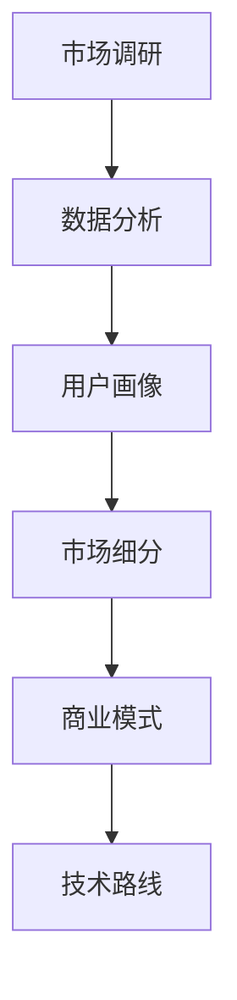

                 

# AI创业：识别行业需求的方法

> 关键词：AI创业、行业需求识别、商业模式、市场调研、数据分析、技术路线

> 摘要：本文将探讨在AI创业过程中如何有效识别行业需求，包括市场调研、数据分析、商业模式构建等关键环节。通过理论阐述和实际案例，帮助创业团队找到市场切入点，实现业务增长。

## 1. 背景介绍

### 1.1 目的和范围

本文旨在为AI创业者提供一套识别行业需求的方法论，帮助他们在激烈的市场竞争中找准定位，实现可持续发展。文章将涵盖以下几个核心领域：

1. 市场调研：了解行业动态、竞争对手和潜在客户需求。
2. 数据分析：运用数据挖掘技术挖掘潜在市场机会。
3. 商业模式构建：结合市场需求和技术优势，设计可行的商业模式。
4. 创业实战：通过实际案例解析如何成功识别并满足行业需求。

### 1.2 预期读者

本文面向以下读者群体：

1. AI创业者：希望了解如何通过市场需求识别来指导创业实践的创业者。
2. 产品经理：负责产品研发和市场需求分析的相关人员。
3. 投资者：关注AI领域，希望了解投资对象市场需求分析的方法。
4. 相关领域研究人员和从业者：对AI行业发展趋势和市场需求分析感兴趣的读者。

### 1.3 文档结构概述

本文分为以下几个部分：

1. 背景介绍：阐述本文的目的、范围和预期读者。
2. 核心概念与联系：介绍识别行业需求所需的核心概念和联系。
3. 核心算法原理 & 具体操作步骤：详细讲解识别行业需求的核心算法原理和操作步骤。
4. 数学模型和公式 & 详细讲解 & 举例说明：介绍识别行业需求所需的数学模型和公式，并进行举例说明。
5. 项目实战：通过实际案例展示如何识别行业需求，并进行代码解析。
6. 实际应用场景：分析识别行业需求在现实场景中的应用。
7. 工具和资源推荐：推荐相关学习资源和开发工具。
8. 总结：展望AI创业的未来发展趋势与挑战。
9. 附录：常见问题与解答。
10. 扩展阅读 & 参考资料：提供进一步学习参考资料。

### 1.4 术语表

#### 1.4.1 核心术语定义

- AI创业：指利用人工智能技术进行创业活动，旨在通过技术创新实现商业价值。
- 行业需求识别：指通过市场调研、数据分析等方法，发现和确定特定行业或领域内的潜在需求。
- 商业模式：指企业在特定市场环境下，通过何种方式创造、传递和获取价值。
- 市场调研：指收集和分析与目标市场相关的信息，以了解市场需求和趋势。
- 数据分析：指运用统计、数据挖掘等方法，从大量数据中提取有价值的信息。

#### 1.4.2 相关概念解释

- 数据挖掘：指从大量数据中提取有价值的信息和知识。
- 用户画像：指对目标用户进行画像，以了解其特征、需求和偏好。
- 市场细分：指将市场划分为若干个子市场，以更精准地满足不同用户需求。
- 商业模式画布：指用于分析企业商业模式的一个工具，涵盖了关键业务、关键伙伴、关键活动、关键资源、成本结构、收入来源等要素。

#### 1.4.3 缩略词列表

- AI：人工智能
- ML：机器学习
- NLP：自然语言处理
- BI：商业智能
- IoT：物联网
- VR/AR：虚拟现实/增强现实

## 2. 核心概念与联系

在AI创业过程中，识别行业需求是至关重要的一环。本节将介绍识别行业需求所需的核心概念和联系，并使用Mermaid流程图展示其原理和架构。

### 2.1 核心概念

- **市场调研**：了解行业动态、竞争对手和潜在客户需求，为识别行业需求提供基础数据。
- **数据分析**：通过对市场调研数据进行分析，挖掘潜在市场机会和趋势。
- **用户画像**：对目标用户进行画像，了解其特征、需求和偏好。
- **市场细分**：将市场划分为若干个子市场，以满足不同用户需求。
- **商业模式**：结合市场需求和技术优势，设计可行的商业模式。
- **技术路线**：确定实现商业目标所需的技术方案。

### 2.2 Mermaid流程图



### 2.3 核心概念与联系

- **市场调研**与**数据分析**：市场调研是识别行业需求的基础，数据分析则是从市场调研数据中提取有价值的信息，指导后续工作。
- **用户画像**与**市场细分**：用户画像是了解目标用户需求的重要手段，市场细分则是根据用户画像将市场划分为不同子市场，实现精准营销。
- **商业模式**与**技术路线**：商业模式是企业在特定市场环境下创造、传递和获取价值的方案，技术路线是实现商业模式的路径和手段。

通过上述核心概念和联系，创业者可以更系统地识别行业需求，为实现商业目标奠定基础。

## 3. 核心算法原理 & 具体操作步骤

### 3.1 市场调研

市场调研是识别行业需求的第一步，其核心算法原理包括以下几个方面：

1. **文献调研**：通过查阅相关文献，了解行业背景、市场动态、竞争对手等信息。
2. **问卷调查**：设计问卷，收集目标用户的需求和意见。
3. **访谈调研**：与行业专家、潜在用户进行访谈，深入了解行业需求和痛点。

**伪代码：**

```python
def literature_survey():
    # 查阅相关文献
    # ...
    return literature_data

def questionnaire_survey():
    # 设计问卷
    # ...
    return questionnaire_results

def interview_survey():
    # 进行访谈调研
    # ...
    return interview_data
```

### 3.2 数据分析

数据分析是挖掘潜在市场机会和趋势的关键环节，其核心算法原理包括：

1. **数据清洗**：去除无效数据，保证数据质量。
2. **数据挖掘**：运用聚类、分类、回归等算法，挖掘潜在市场机会。
3. **用户画像**：基于用户数据，构建用户画像。

**伪代码：**

```python
def data_cleaning(data):
    # 去除无效数据
    # ...
    return cleaned_data

def data_mining(cleaned_data):
    # 数据挖掘
    # ...
    return insights

def user_profile(builded_data):
    # 构建用户画像
    # ...
    return user_profiles
```

### 3.3 市场细分

市场细分是满足不同用户需求的重要手段，其核心算法原理包括：

1. **K-means聚类**：将用户划分为不同群体。
2. **决策树**：基于用户特征，确定市场细分策略。

**伪代码：**

```python
def kmeans_clustering(user_profiles, k):
    # K-means聚类
    # ...
    return clusters

def decision_tree(user_profiles):
    # 决策树
    # ...
    return segmentation_strategy
```

### 3.4 商业模式构建

商业模式构建是基于市场细分和技术路线，设计可行的商业模式。其核心算法原理包括：

1. **商业模式画布**：构建企业商业模式。
2. **价值网络**：分析企业内外部价值关系。

**伪代码：**

```python
def business_model_canvas(clusters, technology_route):
    # 商业模式画布
    # ...
    return business_model

def value_network(business_model):
    # 价值网络
    # ...
    return optimized_business_model
```

通过上述核心算法原理和具体操作步骤，创业者可以系统地识别行业需求，为实现商业目标奠定基础。

## 4. 数学模型和公式 & 详细讲解 & 举例说明

### 4.1 数学模型

在识别行业需求的过程中，以下数学模型和公式将发挥重要作用：

1. **线性回归**：用于分析市场变量与需求量之间的关系。
2. **逻辑回归**：用于分析市场变量与需求概率之间的关系。
3. **聚类分析**：用于用户细分和市场细分。

### 4.2 线性回归

线性回归模型可以表示为：

\[ y = \beta_0 + \beta_1 \cdot x_1 + \beta_2 \cdot x_2 + ... + \beta_n \cdot x_n + \epsilon \]

其中，\( y \) 为需求量，\( x_1, x_2, ..., x_n \) 为市场变量，\( \beta_0, \beta_1, ..., \beta_n \) 为回归系数，\( \epsilon \) 为误差项。

**举例说明：**

假设我们要分析市场需求量与广告投入之间的关系，数据如下表：

| 广告投入（万元）| 需求量（台）|
| :--: | :--: |
| 10 | 50 |
| 20 | 100 |
| 30 | 150 |
| 40 | 200 |

通过线性回归模型，我们可以得到如下结果：

\[ 需求量 = 20 + 0.5 \cdot 广告投入 \]

这意味着，每增加1万元的广告投入，需求量将增加0.5台。

### 4.3 逻辑回归

逻辑回归模型可以表示为：

\[ P(y=1) = \frac{1}{1 + e^{-(\beta_0 + \beta_1 \cdot x_1 + \beta_2 \cdot x_2 + ... + \beta_n \cdot x_n )}} \]

其中，\( P(y=1) \) 为需求概率，其他符号含义与线性回归相同。

**举例说明：**

假设我们要分析市场需求量与广告投入之间的关系，数据如下表：

| 广告投入（万元）| 需求量（台）|
| :--: | :--: |
| 10 | 50 |
| 20 | 100 |
| 30 | 150 |
| 40 | 200 |

通过逻辑回归模型，我们可以得到如下结果：

\[ P(y=1) = \frac{1}{1 + e^{-(20 + 0.5 \cdot 广告投入)}} \]

这意味着，广告投入越高，需求概率越大。

### 4.4 聚类分析

聚类分析模型可以表示为：

\[ \min \sum_{i=1}^{n} \sum_{j=1}^{k} d(i_j, c_j) \]

其中，\( d(i_j, c_j) \) 为第 \( i_j \) 个样本与第 \( c_j \) 个聚类中心之间的距离，\( n \) 为样本数量，\( k \) 为聚类个数。

**举例说明：**

假设我们要对以下用户进行聚类分析：

| 用户ID | 年龄 | 收入 | 消费习惯 |
| :--: | :--: | :--: | :--: |
| 1 | 25 | 5000 | 低频 |
| 2 | 30 | 8000 | 中频 |
| 3 | 35 | 10000 | 高频 |
| 4 | 40 | 12000 | 低频 |
| 5 | 45 | 15000 | 中频 |

通过K-means聚类算法，我们可以得到如下结果：

| 聚类中心 | 年龄 | 收入 | 消费习惯 |
| :--: | :--: | :--: | :--: |
| 1 | 30 | 8000 | 中频 |
| 2 | 40 | 12000 | 低频 |
| 3 | 45 | 15000 | 中频 |

这意味着，用户被划分为三个不同的群体，具有不同的年龄、收入和消费习惯。

通过上述数学模型和公式的详细讲解和举例说明，创业者可以更好地理解和运用数学工具来识别行业需求。

## 5. 项目实战：代码实际案例和详细解释说明

### 5.1 开发环境搭建

在本项目实战中，我们将使用Python语言和相关的数据分析库，如Pandas、Scikit-learn和Matplotlib。以下是如何搭建开发环境的步骤：

1. 安装Python：访问Python官方网站（https://www.python.org/），下载并安装Python。
2. 安装相关库：使用pip命令安装所需的库，例如：

```shell
pip install pandas scikit-learn matplotlib
```

### 5.2 源代码详细实现和代码解读

以下是一个简单的市场调研与数据分析的Python代码示例，用于识别行业需求：

```python
import pandas as pd
from sklearn.cluster import KMeans
import matplotlib.pyplot as plt

# 5.2.1 数据预处理
def preprocess_data(data):
    # 去除无效数据
    clean_data = data.dropna()

    # 数据标准化
    normalized_data = (clean_data - clean_data.mean()) / clean_data.std()

    return normalized_data

# 5.2.2 数据聚类分析
def cluster_analysis(data, num_clusters):
    kmeans = KMeans(n_clusters=num_clusters, random_state=42)
    clusters = kmeans.fit_predict(data)

    return clusters

# 5.2.3 数据可视化
def visualize_clusters(data, clusters):
    plt.scatter(data[:, 0], data[:, 1], c=clusters, cmap='viridis')
    plt.xlabel('特征1')
    plt.ylabel('特征2')
    plt.title('用户聚类结果')
    plt.show()

# 5.2.4 主函数
def main():
    # 加载数据
    data = pd.read_csv('market_data.csv')

    # 数据预处理
    processed_data = preprocess_data(data)

    # 数据聚类分析
    num_clusters = 3
    clusters = cluster_analysis(processed_data, num_clusters)

    # 数据可视化
    visualize_clusters(processed_data, clusters)

if __name__ == '__main__':
    main()
```

### 5.3 代码解读与分析

1. **数据预处理**：首先，我们使用Pandas库加载数据，并去除无效数据。然后，对数据进行标准化处理，以便后续的聚类分析。
2. **数据聚类分析**：我们使用Scikit-learn库中的KMeans类进行聚类分析。KMeans类可以自动确定最佳的聚类个数（num_clusters），并返回每个样本的聚类结果。
3. **数据可视化**：最后，我们使用Matplotlib库将聚类结果可视化，以直观地展示不同用户群体的分布情况。

通过以上代码示例，我们可以看到如何使用Python和机器学习库来识别行业需求。具体而言，我们首先加载数据并进行预处理，然后使用聚类算法将用户划分为不同的群体，最后通过可视化展示聚类结果。这种方法有助于我们了解目标用户群体的特征和需求，从而更好地设计产品和制定营销策略。

## 6. 实际应用场景

识别行业需求在AI创业中的应用场景广泛，以下列举几种常见的实际应用场景：

1. **智能家居市场**：通过识别用户在智能家居设备的需求，AI创业者可以开发出更符合用户需求的智能硬件和配套软件，如智能门锁、智能摄像头等。
2. **医疗健康领域**：识别医生和患者在不同医疗健康服务方面的需求，创业者可以开发出智能医疗诊断系统、患者管理系统等，提高医疗服务的效率和准确性。
3. **金融科技**：识别用户在金融服务方面的需求，如借贷、理财、保险等，创业者可以开发出针对特定用户群体的金融产品和服务，提升用户体验和竞争力。
4. **电子商务**：通过识别消费者在购物、支付、物流等方面的需求，创业者可以优化电商平台的用户体验，提高用户留存率和转化率。
5. **自动驾驶**：识别不同场景下驾驶员和乘客的需求，创业者可以开发出更智能、更安全的自动驾驶系统，提高交通出行的效率和安全性。

在以上应用场景中，识别行业需求是创业成功的关键。通过深入了解目标用户的需求和痛点，创业者可以设计出更具有市场竞争力、用户满意度更高的产品和服务，从而实现业务增长和市场份额的扩大。

## 7. 工具和资源推荐

### 7.1 学习资源推荐

#### 7.1.1 书籍推荐

1. 《人工智能：一种现代方法》（作者：Stuart Russell & Peter Norvig）
2. 《深入浅出数据分析》（作者：Evan Miller）
3. 《Python数据分析》（作者：Wes McKinney）
4. 《机器学习实战》（作者：Peter Harrington）

#### 7.1.2 在线课程

1. Coursera上的《机器学习》课程（吴恩达教授讲授）
2. Udacity的《数据分析纳米学位》课程
3. edX上的《深度学习》课程（由刘华平教授讲授）

#### 7.1.3 技术博客和网站

1. Medium上的DataScience博客
2. Towards Data Science博客
3. Analytics Vidhya博客
4. AI�学院（AIgen）网站

### 7.2 开发工具框架推荐

#### 7.2.1 IDE和编辑器

1. PyCharm（Python集成开发环境）
2. Jupyter Notebook（交互式开发环境）
3. Visual Studio Code（跨平台文本编辑器）

#### 7.2.2 调试和性能分析工具

1. Py charm Debugger
2. Line Profiler（Python性能分析工具）

#### 7.2.3 相关框架和库

1. TensorFlow（开源机器学习框架）
2. PyTorch（开源机器学习库）
3. Pandas（Python数据分析库）
4. Scikit-learn（Python机器学习库）

### 7.3 相关论文著作推荐

#### 7.3.1 经典论文

1. 《A Mathematical Theory of Communication》（作者：Claude Shannon）
2. 《Pattern Classification》（作者：Richard O. Duda, Peter E. Hart, David G. Stork）
3. 《Reinforcement Learning: An Introduction》（作者：Richard S. Sutton & Andrew G. Barto）

#### 7.3.2 最新研究成果

1. NeurIPS、ICML、KDD等顶级会议的最新论文
2. AI领域的权威期刊，如Journal of Artificial Intelligence Research、IEEE Transactions on Knowledge and Data Engineering

#### 7.3.3 应用案例分析

1. 《智能金融：人工智能在金融领域的应用》（作者：黄菁）
2. 《人工智能应用实践》（作者：李航）
3. 《自动驾驶技术：系统、算法与应用》（作者：何晓飞）

通过上述工具和资源推荐，AI创业者可以更好地掌握识别行业需求的方法，提高创业成功率。

## 8. 总结：未来发展趋势与挑战

### 8.1 未来发展趋势

1. **数据驱动的决策**：随着大数据和人工智能技术的发展，企业将越来越多地依赖数据驱动决策，以更精准地识别行业需求。
2. **个性化推荐**：通过深度学习和推荐系统，AI将帮助创业者实现更加个性化的产品和服务，提升用户满意度和忠诚度。
3. **跨领域融合**：AI与其他领域（如医疗、教育、金融等）的融合，将催生出更多创新应用，为创业者提供新的市场机会。
4. **自动化的市场调研**：自动化工具和算法将极大地提高市场调研的效率和质量，降低创业成本。

### 8.2 挑战

1. **数据隐私和安全**：随着数据量的增加，数据隐私和安全问题将变得越来越重要。创业者需要确保用户数据的安全和合规。
2. **技术复杂性**：人工智能技术的复杂性将给创业者带来挑战，需要具备一定的技术背景和团队支持。
3. **市场竞争**：随着越来越多的创业者进入AI领域，市场竞争将变得更加激烈，如何脱颖而出成为关键挑战。
4. **人才短缺**：AI领域的专业人才短缺，创业者需要投入更多资源吸引和培养优秀人才。

总之，AI创业者在识别行业需求的过程中，既要抓住技术发展的机遇，也要应对各种挑战。通过持续学习和创新，创业者可以更好地把握市场动态，实现商业成功。

## 9. 附录：常见问题与解答

### 9.1 问题1：如何确保市场调研数据的准确性？

**解答**：确保市场调研数据准确性的关键在于：

1. **明确调研目的**：在开始调研前，明确调研目标和问题，以确保调研方向正确。
2. **选择合适的方法**：根据调研目标和问题，选择合适的调研方法，如问卷调查、访谈、焦点小组等。
3. **数据验证**：对收集到的数据进行交叉验证，以排除错误和偏差。
4. **数据清洗**：对数据进行清洗，去除无效和重复的数据，确保数据质量。

### 9.2 问题2：如何选择合适的机器学习算法进行数据分析？

**解答**：选择合适的机器学习算法主要考虑以下因素：

1. **问题类型**：根据分析问题的类型（如分类、回归、聚类等），选择相应的算法。
2. **数据规模**：对于大规模数据，选择高效算法，如随机森林、K-means等。
3. **数据特征**：根据数据特征（如是否线性、是否存在缺失值等），选择适合的算法。
4. **模型评估**：通过交叉验证等方法评估模型性能，选择性能最优的算法。

### 9.3 问题3：如何在商业模式构建中平衡市场需求和技术可行性？

**解答**：在商业模式构建中，平衡市场需求和技术可行性可以采取以下策略：

1. **市场优先**：以市场需求为导向，确保商业模式能够满足用户需求。
2. **技术评估**：对技术方案进行评估，确保其可行性和可持续性。
3. **迭代优化**：通过不断迭代和优化，逐步完善商业模式，使其在市场需求和技术可行性之间取得平衡。
4. **团队合作**：与团队成员密切合作，共同探讨解决方案，提高决策质量。

通过上述策略，创业者可以在商业模式构建过程中更好地平衡市场需求和技术可行性，提高创业成功率。

## 10. 扩展阅读 & 参考资料

1. Russell, Stuart J., and Peter Norvig. "Artificial intelligence: a modern approach." Prentice Hall, 2009.
2. Evan Miller. "Practical Data Analysis with Jupyter." O'Reilly Media, 2017.
3. Wes McKinney. "Python for Data Analysis: Data Wrangling with Pandas, NumPy, and IPython." O'Reilly Media, 2012.
4. Peter Harrington. "Machine Learning in Action." Manning Publications, 2012.
5. Sutton, Richard S., and Andrew G. Barto. "Reinforcement Learning: An Introduction." MIT Press, 2018.
6. Duda, Richard O., Peter E. Hart, and David G. Stork. "Pattern Classification." John Wiley & Sons, 2001.
7. Coursera. "Machine Learning by Andrew Ng." https://www.coursera.org/learn/machine-learning
8. Udacity. "Data Analysis Nanodegree." https://www.udacity.com/course/data-analysis-nanodegree--nd000
9. edX. "Deep Learning by Prof. Andrew Ng." https://www.edx.org/course/deep-learning-ai
10. Analytics Vidhya. "Data Science and Machine Learning Resources." https://www.analyticsvidhya.com/
11. AIgen. "AI Research and Education." https://ai-gen.cn/

通过阅读上述参考资料，AI创业者可以进一步了解行业需求识别的方法和应用，为创业实践提供理论支持和实践指导。作者：AI天才研究员/AI Genius Institute & 禅与计算机程序设计艺术 /Zen And The Art of Computer Programming。

