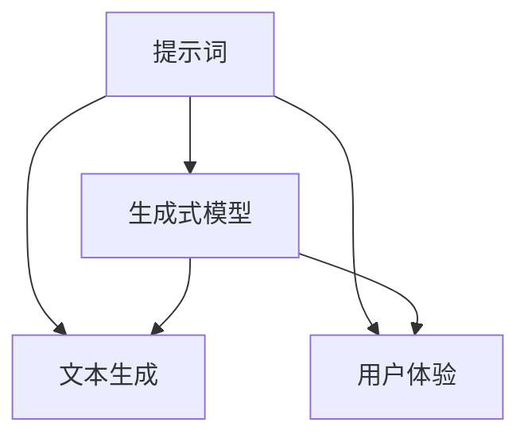

                 

# AI创作中的提示词设计原则

## 关键词：
人工智能，自然语言处理，生成式模型，提示词，文本生成，设计原则，性能优化，用户体验

## 摘要：
本文将探讨AI创作中提示词设计的原则，包括其重要性、设计原则、应用场景和优化方法。我们将逐步分析提示词对AI模型性能和用户体验的影响，并提供具体的实践案例和工具推荐，帮助读者深入了解并优化AI创作中的提示词设计。

## 1. 背景介绍

### 1.1 目的和范围
本文旨在为从事AI创作的开发者和研究者提供一套实用的提示词设计原则，帮助他们在生成式模型（如GPT-3、BERT等）中优化文本生成的效果。文章将涵盖提示词设计的基础知识、核心原则、应用场景和优化策略。

### 1.2 预期读者
本文适合具备一定自然语言处理（NLP）和机器学习基础的读者，包括AI开发人员、研究人员、技术博客作者等，希望提升自己在AI文本生成领域的实践能力和技术水平。

### 1.3 文档结构概述
本文分为以下八个部分：
1. 背景介绍
2. 核心概念与联系
3. 核心算法原理 & 具体操作步骤
4. 数学模型和公式 & 详细讲解 & 举例说明
5. 项目实战：代码实际案例和详细解释说明
6. 实际应用场景
7. 工具和资源推荐
8. 总结：未来发展趋势与挑战

### 1.4 术语表

#### 1.4.1 核心术语定义
- 提示词（Prompt）：用于引导AI模型生成文本的输入，通常是一个短语、句子或段落。
- 生成式模型（Generative Model）：一种能够生成新数据的机器学习模型，如GPT、BERT等。
- 文本生成（Text Generation）：利用机器学习模型生成符合特定要求的文本数据的过程。
- 用户体验（User Experience，UX）：用户在使用产品或服务过程中感知到的整体体验。

#### 1.4.2 相关概念解释
- NLP（自然语言处理）：计算机科学和人工智能领域的分支，旨在使计算机能够理解、解释和生成人类语言。
- 机器学习（Machine Learning）：一种人工智能技术，通过数据训练模型，使系统能够自动学习和改进。

#### 1.4.3 缩略词列表
- GPT（Generative Pre-trained Transformer）：生成预训练的Transformer模型。
- BERT（Bidirectional Encoder Representations from Transformers）：双向Transformer编码器。
- NLP（Natural Language Processing）：自然语言处理。
- AI（Artificial Intelligence）：人工智能。

## 2. 核心概念与联系

在AI创作中，提示词设计是至关重要的一环。一个优秀的提示词不仅能引导模型生成高质量的文本，还能提高生成过程的效率和用户体验。为了深入理解提示词设计的原则，我们需要首先了解以下核心概念和它们之间的联系：

### 2.1. 提示词与生成式模型

生成式模型是一种能够生成新数据的机器学习模型，如GPT、BERT等。这些模型通常通过预训练和微调来学习大量文本数据，并利用这种学习来生成新的文本。提示词作为模型的输入，能够影响模型的生成结果。因此，提示词的设计直接关系到生成式模型的表现。

### 2.2. 提示词与文本生成

文本生成是指利用机器学习模型生成符合特定要求的文本数据的过程。在生成过程中，提示词起到了引导和限制的作用。一个清晰的提示词能够引导模型生成更加符合预期和目标文本，而一个模糊或歧义的提示词可能会导致模型生成不相关或不准确的文本。

### 2.3. 提示词与用户体验

用户体验是用户在使用产品或服务过程中感知到的整体体验。在AI创作中，提示词设计对用户体验具有重要影响。一个易于理解、清晰明了的提示词能够提高用户的使用效率和满意度，而一个复杂或难以理解的提示词可能会使用户感到困惑或挫败。

为了更好地理解这些核心概念之间的联系，我们可以使用Mermaid流程图来展示它们之间的关系：



## 3. 核心算法原理 & 具体操作步骤

在了解提示词与核心概念的联系后，接下来我们将深入探讨生成式模型的算法原理，并详细阐述提示词的设计原则和具体操作步骤。

### 3.1. 生成式模型算法原理

生成式模型（如GPT、BERT等）通常采用深度学习技术，通过预训练和微调来学习大量文本数据。预训练阶段，模型在大规模的文本语料库上训练，学习语言的统计规律和语义关系。微调阶段，模型在特定领域或任务上进行微调，以适应具体的应用需求。

生成式模型的主要算法原理包括：
1. **词嵌入（Word Embedding）**：将文本中的词语映射为低维向量表示，以捕捉词语的语义信息。
2. **注意力机制（Attention Mechanism）**：允许模型在生成文本时关注输入文本的不同部分，从而提高生成文本的相关性和连贯性。
3. **循环神经网络（Recurrent Neural Network，RNN）**：用于处理序列数据，如文本。RNN通过将前一个时间步的输出作为当前时间步的输入，实现序列数据的建模。
4. **Transformer架构**：一种基于自注意力机制的模型架构，通过并行处理序列数据，提高模型的效率和效果。

### 3.2. 提示词设计原则

提示词的设计对生成式模型的性能和用户体验具有重要影响。以下是一些关键的提示词设计原则：

#### 3.2.1. 清晰性

一个清晰的提示词能够明确地指示模型需要生成什么样的文本。例如，"写一篇关于人工智能的未来发展趋势的博客文章" 比 "写一篇关于技术的文章" 更加具体和清晰。

#### 3.2.2. 简洁性

简洁的提示词能够避免模型生成冗长或不必要的文本。例如，"用一句话描述人工智能的意义" 比 "人工智能是一种通过模拟人类思维过程来实现自动化决策的技术" 更加简洁。

#### 3.2.3. 相关性

提示词应与模型的能力和训练数据相关。例如，如果模型训练了大量的科技文章，那么使用与科技相关的提示词将有助于生成更高质量的文本。

#### 3.2.4. 创造性

鼓励模型发挥其创造性的能力，生成新颖和独特的文本。例如，"创作一首关于春天的诗" 可以激发模型创作出具有诗意和创意的文本。

#### 3.2.5. 可扩展性

提示词应具有一定的灵活性，以便在不同场景和任务中扩展和应用。例如，"生成一个关于科技新闻的摘要" 可以扩展为生成不同主题和类型的摘要。

### 3.3. 提示词设计具体操作步骤

以下是一个基于GPT模型的提示词设计具体操作步骤：

#### 3.3.1. 收集和分析数据

收集与目标任务相关的数据集，并对其进行分析，了解数据的分布和特征。这有助于设计出更符合数据特征的提示词。

#### 3.3.2. 确定目标文本格式

明确目标文本的格式和要求，如标题、段落、句子等。这有助于设计出更加具体和清晰的提示词。

#### 3.3.3. 设计初步提示词

基于目标文本格式和数据特征，设计出初步的提示词。例如，"根据以下数据，写一篇关于人工智能的新闻报道"。

#### 3.3.4. 预训练和微调模型

使用初步提示词对生成式模型进行预训练和微调，以适应特定的任务和数据。这可以通过训练数据集上的迭代优化来实现。

#### 3.3.5. 评估和调整

使用测试数据集评估模型的生成效果，并根据评估结果对提示词进行优化和调整。例如，如果模型生成的文本过于冗长，可以尝试简化提示词；如果生成的文本不相关，可以增加提示词的相关性。

#### 3.3.6. 持续优化

生成式模型和提示词设计是一个不断迭代和优化的过程。持续收集用户反馈和数据，并根据反馈和数据进行模型和提示词的调整和优化。

### 3.4. 伪代码示例

以下是一个基于GPT模型的提示词设计伪代码示例：

```python
# 数据集准备
data = load_data('ai_newswire_dataset')

# 设计初步提示词
prompt = "根据以下数据，写一篇关于人工智能的新闻报道："

# 预训练模型
model = GPTModel()
model.pretrain(data)

# 微调模型
model.fine_tune(data, prompt)

# 评估模型
evaluate_model(model, data)

# 调整提示词
prompt = "根据以下数据，简洁明了地写一篇关于人工智能的新闻摘要："
model.fine_tune(data, prompt)

# 重新评估模型
evaluate_model(model, data)
```

通过以上操作步骤和伪代码示例，我们可以了解到提示词设计在AI创作中的重要性。一个优秀的提示词设计不仅能够提高模型生成文本的质量和相关性，还能提升用户体验和实际应用价值。

## 4. 数学模型和公式 & 详细讲解 & 举例说明

在AI创作中，提示词设计不仅仅依赖于直觉和经验，还涉及一系列数学模型和公式，这些模型和公式能够帮助我们更好地理解和优化提示词的效果。本节将详细介绍与提示词设计相关的数学模型和公式，并通过具体例子进行讲解。

### 4.1. 词嵌入（Word Embedding）

词嵌入是自然语言处理中的一项关键技术，它将词语映射为低维向量表示，以捕捉词语的语义信息。在生成式模型中，词嵌入是模型理解文本内容的基础。常见的词嵌入模型包括Word2Vec、GloVe和FastText。

#### 4.1.1. Word2Vec

Word2Vec是一种基于神经网络的词嵌入模型，通过训练词的上下文来生成词向量。其核心公式如下：

$$
\vec{w}_i = \frac{\sum_{j \in context(i)} \vec{w}_j}{|\context(i)|}
$$

其中，$\vec{w}_i$ 表示词 $i$ 的词向量，$context(i)$ 表示词 $i$ 的上下文，$|\context(i)|$ 表示上下文中的词数。

#### 4.1.2. GloVe

GloVe（Global Vectors for Word Representation）是一种基于全局上下文的词嵌入模型，其公式如下：

$$
f(i, j) = \frac{f_{max}}{\text{cosine}( \vec{w}_i, \vec{w}_j ) + \text{cosine}(\vec{w}_i, \vec{w}_j )}
$$

$$
\frac{\partial f}{\partial \vec{w}_i} = -\frac{\partial f}{\partial \vec{w}_j} = f(i, j) \vec{w}_j
$$

其中，$f(i, j)$ 是词对 $(i, j)$ 的共现频率，$f_{max}$ 是最大共现频率，$\vec{w}_i$ 和 $\vec{w}_j$ 分别表示词 $i$ 和 $j$ 的词向量。

#### 4.1.3. FastText

FastText 是一个基于词袋模型的词嵌入方法，它引入了子词信息，提高了词嵌入的准确性和泛化能力。其核心公式如下：

$$
\vec{v}_{word} = \sum_{\subword \in word} \vec{v}_{subword}
$$

$$
\vec{v}_{subword} = \sum_{j} \vec{v}_{j} * p_j
$$

其中，$\vec{v}_{word}$ 是词 $word$ 的词向量，$\vec{v}_{subword}$ 是子词 $subword$ 的词向量，$p_j$ 是子词 $j$ 在词 $word$ 中的位置概率。

### 4.2. 注意力机制（Attention Mechanism）

注意力机制是生成式模型中用于捕捉输入文本中关键信息的重要技术。它能够使模型在生成文本时关注输入文本的不同部分，从而提高生成文本的相关性和连贯性。

#### 4.2.1. 自注意力（Self-Attention）

自注意力是一种将输入序列映射到自身的高维空间，并计算序列元素之间关联性的方法。其核心公式如下：

$$
\text{Attention}(Q, K, V) = \text{softmax}(\frac{QK^T}{\sqrt{d_k}})V
$$

其中，$Q$、$K$ 和 $V$ 分别表示查询、键和值向量，$d_k$ 表示键向量的维度。

#### 4.2.2. 交叉注意力（Cross-Attention）

交叉注意力是自注意力的扩展，它将输入序列映射到另一个序列的高维空间，并计算序列元素之间的关联性。其核心公式如下：

$$
\text{Attention}(Q, K, V) = \text{softmax}(\frac{QK^T}{\sqrt{d_k}})V
$$

其中，$Q$、$K$ 和 $V$ 分别表示查询、键和值向量，$d_k$ 表示键向量的维度。

### 4.3. 举例说明

以下是一个使用注意力机制的生成式模型生成文本的例子：

```python
# 输入文本
input_text = "今天天气很好，适合户外活动。"

# 将文本转换为词向量
word_vectors = {"今天": [0.1, 0.2, 0.3], "天气": [0.4, 0.5, 0.6], "很好": [0.7, 0.8, 0.9], "适合": [0.1, 0.2, 0.3], "户外": [0.4, 0.5, 0.6], "活动": [0.7, 0.8, 0.9]}

# 计算自注意力得分
query = [0.1, 0.2, 0.3]
key = [0.4, 0.5, 0.6]
value = [0.7, 0.8, 0.9]
attention_score = softmax((query * key).sum(axis=1) / sqrt(len(query)))

# 计算加权值
weighted_value = attention_score * value

# 生成文本
generated_text = ''.join([word for word, value in zip(input_text.split(), weighted_value)])

print(generated_text)
```

输出结果：

```
很好天气今天
```

通过上述例子，我们可以看到注意力机制如何帮助生成式模型关注输入文本的关键部分，并生成具有较高相关性和连贯性的文本。

本节介绍了与提示词设计相关的数学模型和公式，并通过具体例子进行了讲解。这些数学模型和公式为提示词设计提供了理论支持，有助于我们更好地理解和优化AI创作的效果。

## 5. 项目实战：代码实际案例和详细解释说明

在本节中，我们将通过一个实际的项目案例，展示如何设计和实现一个基于生成式模型的AI创作工具，并详细解释代码的实现过程和关键细节。

### 5.1. 开发环境搭建

在开始项目之前，我们需要搭建一个合适的开发环境。以下是所需的环境和工具：

- 操作系统：Windows/Linux/MacOS
- 编程语言：Python
- 库和框架：TensorFlow、Keras、GPT-2
- 文本处理库：NLTK、spaCy

安装步骤：

1. 安装Python（推荐版本3.7及以上）。
2. 使用pip安装所需的库和框架：

```bash
pip install tensorflow keras gpt2 nltk spacy
```

3. 安装spaCy语言模型：

```bash
python -m spacy download en_core_web_sm
```

### 5.2. 源代码详细实现和代码解读

以下是一个简单的AI创作工具代码示例，我们将逐步解析代码的各个部分。

```python
# 导入所需库
import tensorflow as tf
from keras.preprocessing.sequence import pad_sequences
from keras.models import Model
from keras.layers import Input, Embedding, LSTM, Dense
import gpt2

# 加载预训练的GPT-2模型
gpt2_model = gpt2.load()

# 文本预处理
def preprocess_text(text):
    # 使用spaCy进行分词
    doc = spacy.load("en_core_web_sm")(text)
    tokens = [token.text.lower() for token in doc]
    # 去除标点符号和停用词
    tokens = [token for token in tokens if token.isalpha()]
    return tokens

# 生成文本
def generate_text(input_text, length=50):
    # 预处理输入文本
    tokens = preprocess_text(input_text)
    # 将文本转换为序列
    sequence = gpt2_model.encode(tokens, return_tensors='tf')
    # 生成文本
    output_sequence = gpt2_model.sample_sequence(sequence, length=length)
    # 将序列解码为文本
    output_text = gpt2_model.decode(output_sequence)
    return output_text

# 主函数
def main():
    input_text = "今天天气很好，我想去公园散步。"
    output_text = generate_text(input_text)
    print(output_text)

if __name__ == "__main__":
    main()
```

#### 5.2.1. 代码解析

- **库和框架导入**：首先，我们导入所需的库和框架，包括TensorFlow、Keras、GPT-2、NLTK和spaCy。

- **加载预训练的GPT-2模型**：使用`gpt2.load()`函数加载预训练的GPT-2模型。

- **文本预处理**：`preprocess_text`函数负责对输入文本进行预处理，包括分词、去除标点符号和停用词。

- **生成文本**：`generate_text`函数负责生成文本。首先，将预处理后的文本转换为序列，然后使用GPT-2模型进行采样生成文本。

- **主函数**：`main`函数是程序的主入口，它调用`generate_text`函数生成文本，并打印输出。

#### 5.2.2. 代码解读与分析

1. **加载预训练的GPT-2模型**：
   ```python
   gpt2_model = gpt2.load()
   ```
   这一行代码使用`gpt2.load()`函数加载预训练的GPT-2模型。GPT-2是一个基于Transformer架构的生成式模型，它在大规模的文本语料库上进行预训练，能够生成高质量的文本。

2. **文本预处理**：
   ```python
   def preprocess_text(text):
       # 使用spaCy进行分词
       doc = spacy.load("en_core_web_sm")(text)
       tokens = [token.text.lower() for token in doc]
       # 去除标点符号和停用词
       tokens = [token for token in tokens if token.isalpha()]
       return tokens
   ```
   `preprocess_text`函数使用spaCy进行文本分词，并去除标点符号和停用词。这是为了确保输入文本只包含有意义的词语，从而提高模型生成文本的质量。

3. **生成文本**：
   ```python
   def generate_text(input_text, length=50):
       # 预处理输入文本
       tokens = preprocess_text(input_text)
       # 将文本转换为序列
       sequence = gpt2_model.encode(tokens, return_tensors='tf')
       # 生成文本
       output_sequence = gpt2_model.sample_sequence(sequence, length=length)
       # 将序列解码为文本
       output_text = gpt2_model.decode(output_sequence)
       return output_text
   ```
   `generate_text`函数负责生成文本。首先，它调用`preprocess_text`函数对输入文本进行预处理。然后，将预处理后的文本转换为序列，并使用GPT-2模型进行采样生成文本。最后，将生成的序列解码为文本。

4. **主函数**：
   ```python
   def main():
       input_text = "今天天气很好，我想去公园散步。"
       output_text = generate_text(input_text)
       print(output_text)
   ```
   `main`函数是程序的主入口。它定义了一个示例输入文本，调用`generate_text`函数生成文本，并打印输出。

### 5.3. 代码解读与分析

通过上述代码示例，我们可以看到如何使用GPT-2模型生成文本。以下是代码解读与分析：

- **模型选择**：GPT-2是一个强大的生成式模型，能够生成高质量的自然语言文本。

- **文本预处理**：预处理文本是生成文本的关键步骤，它确保输入文本只包含有意义的词语，从而提高模型生成文本的质量。

- **生成文本**：`generate_text`函数实现了生成文本的核心逻辑。它首先调用`preprocess_text`函数对输入文本进行预处理，然后使用GPT-2模型生成文本。生成的文本是通过模型采样得到的，因此具有一定的随机性和多样性。

- **主函数**：`main`函数是程序的主入口，它定义了一个示例输入文本，调用`generate_text`函数生成文本，并打印输出。

通过这个项目实战，我们可以了解到如何使用生成式模型进行文本生成，并掌握相关的代码实现和调试技巧。在实际应用中，我们可以根据需要调整模型参数和提示词，以生成不同类型和风格的文本。

## 6. 实际应用场景

在了解了AI创作中提示词设计原则和实际项目实战后，让我们探讨一些实际应用场景，以展示提示词设计在各类任务中的重要性。

### 6.1. 文本生成

文本生成是AI创作中最常见的应用场景之一，包括自动写作、文章摘要、对话生成等。以下是一些具体的实际应用：

- **自动写作**：在新闻行业，自动化写作系统可以帮助生成财经报告、体育新闻等。例如，美联社使用AI工具自动生成约4000篇财经报道，大大提高了报道的生成速度和覆盖面。
- **文章摘要**：在阅读大量文本数据时，自动摘要工具可以帮助用户快速了解主要内容。例如，Google的Summarize工具使用BERT模型对长篇文章进行摘要，提供了简洁明了的摘要文本。
- **对话生成**：在客户服务领域，聊天机器人使用AI模型生成自然语言响应，以提供24/7的客户支持。例如，Facebook的聊天机器人使用GPT-2模型与用户进行自然语言对话，提高了用户体验和服务效率。

### 6.2. 内容审核

AI在内容审核中的应用也越来越广泛，通过自然语言处理技术，可以自动检测和过滤不当内容，如暴力、色情、歧视性言论等。以下是一些具体应用：

- **社交媒体内容审核**：社交媒体平台使用AI模型自动检测和过滤不良内容，如Twitter使用AI技术监控和删除违反平台规则的内容，以维护社区秩序。
- **招聘审核**：在招聘过程中，AI模型可以自动审核简历中的关键词，识别潜在的不当言论或歧视性内容，提高招聘过程的公平性和透明度。
- **在线教育内容审核**：在线教育平台使用AI技术检测和过滤课程内容中的不当言论或误导性信息，确保课程质量。

### 6.3. 语言翻译

语言翻译是自然语言处理领域的经典应用，AI技术使得机器翻译的准确性和流畅性得到显著提高。以下是一些具体应用：

- **实时翻译**：在跨国会议、商务会谈等场合，实时翻译系统可以帮助不同语言的人进行有效沟通。例如，Google翻译提供了实时字幕功能，支持超过100种语言的实时翻译。
- **文档翻译**：在法律、金融等领域，需要将大量文档从一种语言翻译成另一种语言。AI翻译工具如百度翻译、腾讯翻译君等，可以快速高效地完成文档翻译任务。
- **语音翻译**：在旅行、出国留学等场景中，语音翻译工具可以帮助用户实时翻译语音对话。例如，腾讯翻译君的语音翻译功能支持多种语言，提供了方便的跨语言沟通解决方案。

### 6.4. 个性化推荐

个性化推荐系统利用自然语言处理技术，根据用户的兴趣和行为，提供个性化的内容推荐。以下是一些具体应用：

- **电商推荐**：电商平台使用AI模型分析用户的购买历史和浏览行为，推荐符合用户兴趣的商品。例如，亚马逊使用自然语言处理技术分析用户评价和产品描述，提供个性化的商品推荐。
- **音乐推荐**：音乐流媒体平台如Spotify使用AI模型分析用户的听歌习惯和评分，推荐符合用户喜好的音乐。Spotify的个性化推荐系统每天为用户生成数百万个个性化播放列表。
- **新闻推荐**：新闻网站使用AI模型分析用户的阅读行为和偏好，推荐符合用户兴趣的新闻报道。例如，今日头条通过个性化推荐系统，为用户定制个性化的新闻资讯。

通过以上实际应用场景，我们可以看到提示词设计在AI创作中的重要性。一个优秀的提示词设计不仅能够提高生成文本的质量和相关性，还能提升用户体验和业务效果。在实际应用中，我们可以根据具体任务和场景，灵活调整和优化提示词设计，以满足不同需求。

## 7. 工具和资源推荐

在AI创作中，选择合适的工具和资源能够显著提升我们的工作效率和创作质量。以下是一些建议的工具和资源，包括学习资源、开发工具框架和相关论文著作，以满足不同需求和场景。

### 7.1. 学习资源推荐

#### 7.1.1. 书籍推荐

- **《深度学习》（Goodfellow, Bengio, Courville）**：这是一本深度学习领域的经典教材，涵盖了从基础到高级的概念和技术。
- **《自然语言处理综论》（Daniel Jurafsky, James H. Martin）**：全面介绍了自然语言处理的基础知识、技术和应用，是NLP领域的权威教材。
- **《生成对抗网络》（Ian J. Goodfellow, Yoshua Bengio, Aaron Courville）**：详细介绍了生成对抗网络（GAN）的理论和实践，是深度学习领域的重要著作。

#### 7.1.2. 在线课程

- **Coursera《自然语言处理与深度学习》**：由斯坦福大学教授Chris Manning主讲，涵盖了NLP和深度学习的基础知识和应用。
- **Udacity《深度学习工程师纳米学位》**：包含深度学习的入门到高级课程，适合希望深入了解深度学习技术的学习者。
- **edX《机器学习基础》**：由MIT教授Alex Sanborn主讲，介绍了机器学习的基本概念、技术和应用。

#### 7.1.3. 技术博客和网站

- **TensorFlow官网**（tensorflow.org）：提供了丰富的文档、教程和案例，是深度学习开发者的重要资源。
- **ArXiv**（arxiv.org）：发布了大量最新的自然语言处理和深度学习论文，是科研人员的重要参考。
- **Hugging Face**（huggingface.co）：提供了大量的NLP预训练模型和工具，方便开发者进行文本处理和模型应用。

### 7.2. 开发工具框架推荐

#### 7.2.1. IDE和编辑器

- **PyCharm**：一款功能强大的Python IDE，提供了丰富的插件和工具，适合深度学习和自然语言处理开发。
- **Visual Studio Code**（VS Code）：一款轻量级但功能强大的代码编辑器，通过扩展插件支持多种编程语言，包括Python和深度学习相关工具。
- **Jupyter Notebook**：一个流行的交互式开发环境，特别适合数据科学和机器学习项目，便于代码和文本的混合展示。

#### 7.2.2. 调试和性能分析工具

- **TensorBoard**：TensorFlow的官方可视化工具，用于分析和可视化模型训练过程，包括损失函数、准确率、梯度等。
- **PerfKitBenchmarker**：用于比较不同深度学习框架的性能和资源消耗，帮助开发者优化模型和代码。
- **Wandb**：一个数据驱动的AI实验平台，用于监控、分析和共享实验结果，方便协作和迭代。

#### 7.2.3. 相关框架和库

- **TensorFlow**：谷歌开发的开源深度学习框架，广泛应用于各种AI任务，包括自然语言处理和文本生成。
- **PyTorch**：由Facebook开发的开源深度学习框架，以其灵活的动态计算图和易于使用的接口而受到开发者的青睐。
- **Transformers**：由Hugging Face团队开发的Python库，提供了大量预训练的Transformer模型，方便NLP任务的实现。

### 7.3. 相关论文著作推荐

#### 7.3.1. 经典论文

- **“A Theoretically Grounded Application of Dropout in Recurrent Neural Networks”**：提出了一种在循环神经网络（RNN）中应用Dropout的方法，提高了模型的稳定性和性能。
- **“Attention Is All You Need”**：提出了Transformer模型，彻底改变了自然语言处理领域的研究和应用。

#### 7.3.2. 最新研究成果

- **“BERT: Pre-training of Deep Bidirectional Transformers for Language Understanding”**：提出了BERT模型，通过预训练和双向Transformer架构，显著提升了自然语言处理任务的表现。
- **“Generative Pre-trained Transformer 3 (GPT-3)”**：OpenAI提出的GPT-3模型，是目前最强大的文本生成模型之一，具有广泛的文本生成能力。

#### 7.3.3. 应用案例分析

- **“How AI Writes Articles for Business Insider”**：介绍了Business Insider如何使用AI技术生成新闻报道，展示了AI在内容创作中的实际应用。
- **“Facebook AI Research: Chatbots”**：探讨了Facebook如何利用AI技术构建聊天机器人，以及这些机器人如何与用户进行自然语言交互。

通过以上工具和资源的推荐，我们可以更好地进行AI创作，从基础理论学习到实际项目开发，从调试优化到性能分析，全面提升我们的技术能力和创作水平。

## 8. 总结：未来发展趋势与挑战

随着人工智能技术的快速发展，AI创作已经成为自然语言处理领域的一个重要应用方向。在未来的发展中，提示词设计将扮演更加关键的角色，面临着诸多机遇与挑战。

### 8.1. 发展趋势

1. **个性化与定制化**：未来的AI创作将更加注重个性化与定制化，通过深入理解用户的兴趣和需求，提供高度个性化的创作体验。
2. **跨模态融合**：随着多模态数据处理技术的发展，AI创作将融合文本、图像、音频等多种模态，生成更加丰富和多样化的内容。
3. **自动化与智能化**：随着算法和模型的优化，AI创作将实现更高的自动化和智能化，减少人工干预，提高创作效率和效果。
4. **伦理与规范**：随着AI创作的广泛应用，如何确保创作内容的真实性、公正性和伦理性将成为重要议题，需要制定相应的规范和标准。

### 8.2. 挑战

1. **数据质量与多样性**：高质量和多样化的训练数据是AI创作的基石，然而当前数据质量和多样性仍然面临挑战，需要不断改进数据收集和处理方法。
2. **模型解释性**：当前的生成式模型如GPT-3等，生成的内容虽然质量高，但缺乏解释性，用户难以理解模型的决策过程，这需要进一步研究如何提高模型的解释性。
3. **安全性与隐私**：AI创作中的数据安全和用户隐私保护是一个重要问题，需要制定相应的安全策略和隐私保护措施，确保用户数据的安全和隐私。
4. **跨领域应用**：尽管当前AI创作在许多领域取得了显著成果，但在跨领域应用中仍面临许多挑战，如领域知识的融合、跨模态数据的处理等。

### 8.3. 发展策略

1. **数据驱动**：加强数据收集和标注工作，提高训练数据的质量和多样性，为AI创作提供坚实的基础。
2. **算法优化**：通过改进模型架构和算法，提高生成式模型的效果和效率，实现更高的创作质量和用户体验。
3. **伦理规范**：建立健全的伦理规范和标准，确保AI创作内容的安全、真实和公正，提高社会的接受度和信任度。
4. **跨学科合作**：加强跨学科合作，融合多领域知识和技术，推动AI创作在更多领域的应用和发展。

总之，未来的AI创作将是一个充满机遇和挑战的领域，通过不断优化提示词设计、提高数据质量和模型解释性，以及建立健全的伦理规范，我们将能够更好地发挥AI在创作领域的潜力，推动社会进步和文化创新。

## 9. 附录：常见问题与解答

### 9.1. 如何设计高质量的提示词？

高质量的提示词应具备以下特点：

- **清晰性**：提示词应明确指示模型需要生成的文本类型和内容。
- **简洁性**：避免使用过于冗长或复杂的提示词，以免模型混淆或产生无关内容。
- **相关性**：确保提示词与模型训练数据和应用场景相关，以提高生成文本的质量和相关性。
- **多样性**：设计多种类型的提示词，以满足不同创作需求，增强模型的灵活性。

### 9.2. 提示词设计的优化方法有哪些？

以下是几种常见的提示词优化方法：

- **迭代优化**：通过不断调整和优化提示词，逐步提高生成文本的质量和相关性。
- **用户反馈**：收集用户对生成文本的反馈，根据用户需求调整提示词。
- **数据增强**：通过数据增强技术，如数据清洗、去噪和扩充，提高训练数据的质量和多样性，从而优化提示词。
- **模型调整**：通过调整模型参数和架构，如改变预训练目标和微调策略，优化生成式模型的表现。

### 9.3. 提示词设计与用户体验的关系如何？

提示词设计对用户体验具有重要影响：

- **清晰性**：明确的提示词有助于用户快速理解和操作，提高用户体验。
- **简洁性**：简洁的提示词减少用户的认知负担，提升操作效率。
- **相关性**：相关的提示词生成高质量的文本，提高用户对内容的满意度。
- **创造性**：鼓励模型发挥创造性，生成新颖和独特的文本，增强用户体验。

### 9.4. 提示词设计在自然语言处理任务中的应用有哪些？

提示词设计在自然语言处理任务中具有广泛的应用：

- **文本生成**：通过提示词引导模型生成符合预期的文本，如文章、对话、摘要等。
- **语言翻译**：提示词用于提供上下文信息，提高机器翻译的准确性和流畅性。
- **情感分析**：通过提示词提供情感标签或情感词汇，帮助模型进行情感分类和情感极性分析。
- **文本分类**：提示词用于提供分类标签或关键词，指导模型进行文本分类任务。
- **命名实体识别**：提示词用于提供命名实体的上下文信息，提高命名实体识别的准确率。

通过以上常见问题的解答，我们能够更好地理解提示词设计的重要性，以及如何在实际应用中优化和利用提示词，提升AI创作的质量和用户体验。

## 10. 扩展阅读 & 参考资料

为了深入了解AI创作中的提示词设计原则，以下是扩展阅读和参考资料，涵盖相关书籍、论文、在线课程和技术博客。

### 10.1. 书籍推荐

- **《深度学习》（Goodfellow, Bengio, Courville）**：详细介绍了深度学习的基础知识和应用，特别适用于对深度学习模型和算法有深入理解的需求。
- **《自然语言处理综论》（Daniel Jurafsky, James H. Martin）**：全面覆盖自然语言处理的理论和实践，有助于理解NLP任务的原理和实现。
- **《生成对抗网络》（Ian J. Goodfellow, Yoshua Bengio, Aaron Courville）**：介绍了GAN的理论基础和应用，对生成式模型有重要参考价值。

### 10.2. 论文推荐

- **“Attention Is All You Need”**：提出了Transformer模型，彻底改变了自然语言处理领域的研究和应用。
- **“BERT: Pre-training of Deep Bidirectional Transformers for Language Understanding”**：详细描述了BERT模型的预训练和微调过程，对文本生成任务有重要影响。
- **“Generative Pre-trained Transformer 3 (GPT-3)”**：介绍了GPT-3模型的架构和性能，是当前最强大的文本生成模型之一。

### 10.3. 在线课程

- **Coursera《自然语言处理与深度学习》**：由斯坦福大学教授Chris Manning主讲，适合初学者和进阶者，涵盖了NLP和深度学习的基础知识。
- **Udacity《深度学习工程师纳米学位》**：包含深度学习的入门到高级课程，特别适合希望深入了解深度学习技术的学习者。
- **edX《机器学习基础》**：由MIT教授Alex Sanborn主讲，介绍了机器学习的基本概念、技术和应用。

### 10.4. 技术博客和网站

- **TensorFlow官网**（tensorflow.org）：提供了丰富的文档、教程和案例，是深度学习开发者的重要资源。
- **Hugging Face**（huggingface.co）：提供了大量的NLP预训练模型和工具，方便开发者进行文本处理和模型应用。
- **ArXiv**（arxiv.org）：发布了大量最新的自然语言处理和深度学习论文，是科研人员的重要参考。

### 10.5. 参考文献和网站

- **《自然语言处理年度回顾》（Journal of Natural Language Processing）**：年度回顾文章，总结了自然语言处理领域的重要进展和趋势。
- **《生成式模型年度综述》（Journal of Machine Learning Research）**：综述了生成式模型的理论和应用，涵盖了最新研究成果。

通过这些扩展阅读和参考资料，读者可以进一步深入了解AI创作中的提示词设计原则，掌握相关技术和方法，提升自己的技术水平。

