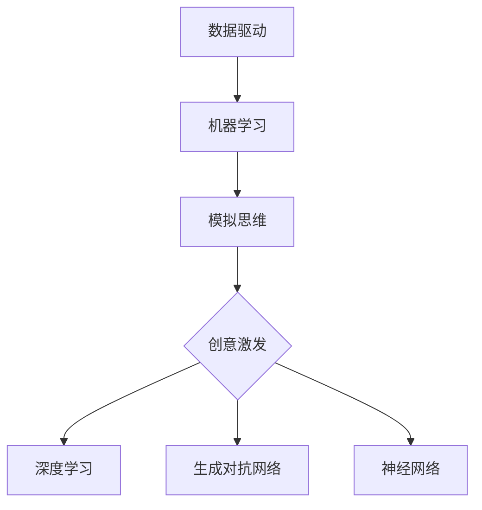

                 


# AI创意激发：突破人类思维局限

> **关键词**：人工智能，创意激发，思维拓展，认知计算，机器学习，算法优化
> 
> **摘要**：本文将探讨人工智能如何帮助人类突破思维局限，激发创新潜能。我们将从核心概念、算法原理、数学模型、项目实战、实际应用场景等方面，详细分析AI创意激发的机制和方法，助力读者理解这一前沿科技领域的无限可能。

## 1. 背景介绍

### 1.1 目的和范围

本文旨在通过深入研究人工智能在创意激发领域的应用，探讨如何利用人工智能技术突破人类思维的局限性，激发创新潜能。文章将涵盖以下主要内容：

1. AI创意激发的基本概念和原理。
2. 关键算法原理及其实现步骤。
3. 数学模型和公式在实际应用中的详细讲解。
4. 实际项目案例的代码实现和详细解读。
5. AI创意激发在各个领域的实际应用场景。
6. 相关工具和资源的推荐。
7. 未来发展趋势与挑战。

### 1.2 预期读者

本文适合对人工智能和创意激发感兴趣的读者，包括：

1. 对人工智能技术有一定了解的技术人员。
2. 关注科技创新和未来发展趋势的企业家、创业者。
3. 希望拓展思维、激发创意的专业人士。
4. 对机器学习和算法原理感兴趣的学者和学生。

### 1.3 文档结构概述

本文结构如下：

1. **背景介绍**：介绍本文的目的、范围、预期读者以及文档结构。
2. **核心概念与联系**：分析AI创意激发的核心概念和联系，展示Mermaid流程图。
3. **核心算法原理 & 具体操作步骤**：详细阐述AI创意激发的关键算法原理和具体操作步骤，使用伪代码进行说明。
4. **数学模型和公式 & 详细讲解 & 举例说明**：介绍AI创意激发相关的数学模型和公式，并进行详细讲解和举例说明。
5. **项目实战：代码实际案例和详细解释说明**：展示实际项目案例的代码实现和详细解释说明。
6. **实际应用场景**：分析AI创意激发在不同领域的应用场景。
7. **工具和资源推荐**：推荐学习资源、开发工具框架和相关的论文著作。
8. **总结：未来发展趋势与挑战**：总结本文的主要观点，探讨未来发展趋势和挑战。
9. **附录：常见问题与解答**：回答读者可能关心的问题。
10. **扩展阅读 & 参考资料**：提供扩展阅读材料和参考文献。

### 1.4 术语表

#### 1.4.1 核心术语定义

- **人工智能**：人工智能（Artificial Intelligence，简称AI）是指模拟、延伸和扩展人类智能的理论、方法、技术及应用系统。
- **创意激发**：创意激发（Creativity Ignition）是指通过特定方法和技术，激发人类或机器产生新颖、独特且有价值的创意或解决方案。
- **认知计算**：认知计算（Cognitive Computing）是一种人工智能方法，旨在模拟人类思维过程，实现更自然、更智能的交互。
- **机器学习**：机器学习（Machine Learning）是指让计算机通过数据学习规律和模式，从而自动进行决策和预测。
- **算法优化**：算法优化（Algorithm Optimization）是指通过改进算法设计，提高算法效率、准确性和稳定性。

#### 1.4.2 相关概念解释

- **深度学习**：深度学习（Deep Learning）是一种机器学习方法，通过构建深度神经网络模型，实现数据的自动特征提取和模式识别。
- **神经网络**：神经网络（Neural Network）是一种模拟生物神经系统的计算模型，由大量简单神经元组成，通过调整神经元之间的权重来实现复杂的计算任务。
- **生成对抗网络**：生成对抗网络（Generative Adversarial Network，简称GAN）是一种由两个神经网络组成的框架，一个生成器和一个判别器，通过对抗训练生成逼真的数据。

#### 1.4.3 缩略词列表

- **AI**：人工智能（Artificial Intelligence）
- **GAN**：生成对抗网络（Generative Adversarial Network）
- **NN**：神经网络（Neural Network）
- **ML**：机器学习（Machine Learning）
- **DL**：深度学习（Deep Learning）

## 2. 核心概念与联系

### 2.1 AI创意激发的基本概念

AI创意激发是一种利用人工智能技术，帮助人类或机器产生新颖、独特且有价值的创意或解决方案的方法。它基于以下几个方面：

1. **数据驱动**：AI创意激发依赖于大量数据，通过分析数据中的模式和规律，寻找创新的灵感。
2. **机器学习**：AI创意激发使用机器学习方法，如深度学习、生成对抗网络等，从数据中学习特征和模式。
3. **模拟思维**：AI创意激发通过模拟人类思维过程，如联想、推理、归纳等，实现创意的产生。

### 2.2 AI创意激发的关键算法原理

AI创意激发的关键算法主要包括以下几种：

1. **深度学习**：深度学习是一种通过构建深度神经网络模型，实现数据的自动特征提取和模式识别的方法。它可以用于图像识别、语音识别、自然语言处理等领域，从而为创意激发提供基础。
2. **生成对抗网络（GAN）**：生成对抗网络（GAN）是一种由生成器（Generator）和判别器（Discriminator）组成的框架。生成器生成逼真的数据，判别器判断数据的真实性和逼真度。通过对抗训练，生成器不断提高生成数据的质量，从而激发创意。
3. **神经网络**：神经网络是一种模拟生物神经系统的计算模型，由大量简单神经元组成，通过调整神经元之间的权重来实现复杂的计算任务。神经网络可以用于分类、回归、聚类等任务，为创意激发提供支持。

### 2.3 Mermaid流程图

为了更直观地展示AI创意激发的核心概念和联系，我们可以使用Mermaid流程图进行描述。以下是AI创意激发的Mermaid流程图：



在上述流程图中，数据驱动、机器学习和模拟思维是AI创意激发的基础，深度学习、生成对抗网络和神经网络是实现创意激发的关键算法。通过这些算法，我们可以实现从数据到创意的转化。

## 3. 核心算法原理 & 具体操作步骤

### 3.1 深度学习

深度学习是一种通过构建深度神经网络模型，实现数据的自动特征提取和模式识别的方法。以下是深度学习的具体操作步骤：

1. **数据准备**：收集大量数据，并进行预处理，如数据清洗、归一化等。
2. **模型设计**：根据任务需求，设计合适的深度神经网络模型，如卷积神经网络（CNN）、循环神经网络（RNN）、生成对抗网络（GAN）等。
3. **模型训练**：使用训练数据对模型进行训练，通过反向传播算法更新模型参数。
4. **模型评估**：使用验证数据对训练好的模型进行评估，调整模型参数以优化性能。
5. **模型应用**：将训练好的模型应用于实际问题，实现数据的自动特征提取和模式识别。

以下是一个简单的深度学习伪代码：

```python
# 数据准备
data = load_data()

# 模型设计
model = build_model()

# 模型训练
for epoch in range(num_epochs):
    for sample in data:
        model.train(sample)

# 模型评估
accuracy = model.evaluate(validation_data)

# 模型应用
result = model.predict(test_data)
```

### 3.2 生成对抗网络（GAN）

生成对抗网络（GAN）是一种由生成器（Generator）和判别器（Discriminator）组成的框架。生成器生成逼真的数据，判别器判断数据的真实性和逼真度。以下是GAN的具体操作步骤：

1. **数据准备**：收集大量真实数据，用于训练判别器和生成器。
2. **生成器设计**：设计一个生成器，用于生成逼真的数据。
3. **判别器设计**：设计一个判别器，用于判断生成器和真实数据的真实性和逼真度。
4. **对抗训练**：交替训练生成器和判别器，使生成器生成的数据越来越逼真，判别器越来越难以区分真实数据和生成数据。
5. **模型评估**：使用生成的数据对模型进行评估，优化生成器和判别器。

以下是一个简单的GAN伪代码：

```python
# 数据准备
real_data = load_real_data()

# 生成器设计
generator = build_generator()

# 判别器设计
discriminator = build_discriminator()

# 对抗训练
for epoch in range(num_epochs):
    for real_sample in real_data:
        discriminator.train(real_sample)
        generator.train(discriminator)

# 模型评估
generated_data = generator.generate()
evaluate(generated_data)
```

### 3.3 神经网络

神经网络是一种模拟生物神经系统的计算模型，由大量简单神经元组成，通过调整神经元之间的权重来实现复杂的计算任务。以下是神经网络的具体操作步骤：

1. **数据准备**：收集大量数据，并进行预处理，如数据清洗、归一化等。
2. **模型设计**：设计一个神经网络模型，包括输入层、隐藏层和输出层。
3. **模型训练**：使用训练数据对模型进行训练，通过反向传播算法更新模型参数。
4. **模型评估**：使用验证数据对训练好的模型进行评估，调整模型参数以优化性能。
5. **模型应用**：将训练好的模型应用于实际问题，实现数据的自动特征提取和模式识别。

以下是一个简单的神经网络伪代码：

```python
# 数据准备
data = load_data()

# 模型设计
model = build_model()

# 模型训练
for epoch in range(num_epochs):
    for sample in data:
        model.train(sample)

# 模型评估
accuracy = model.evaluate(validation_data)

# 模型应用
result = model.predict(test_data)
```

## 4. 数学模型和公式 & 详细讲解 & 举例说明

### 4.1 深度学习

深度学习中的数学模型主要包括损失函数、优化器和反向传播算法。以下是这些模型的详细讲解和举例说明。

#### 4.1.1 损失函数

损失函数用于评估模型预测值与真实值之间的差距，常见的损失函数包括均方误差（MSE）和交叉熵（Cross-Entropy）。

- **均方误差（MSE）**：

  $$MSE = \frac{1}{n}\sum_{i=1}^{n}(y_i - \hat{y}_i)^2$$

  其中，$y_i$为真实值，$\hat{y}_i$为预测值。

- **交叉熵（Cross-Entropy）**：

  $$CE = -\frac{1}{n}\sum_{i=1}^{n}y_i\log(\hat{y}_i)$$

  其中，$y_i$为真实值，$\hat{y}_i$为预测值。

#### 4.1.2 优化器

优化器用于调整模型参数，以减少损失函数。常见的优化器包括随机梯度下降（SGD）和Adam优化器。

- **随机梯度下降（SGD）**：

  $$\theta_{t+1} = \theta_t - \alpha \frac{\partial}{\partial \theta_t}J(\theta_t)$$

  其中，$\theta_t$为当前参数，$\alpha$为学习率，$J(\theta_t)$为损失函数。

- **Adam优化器**：

  $$m_t = \beta_1 m_{t-1} + (1 - \beta_1) \frac{\partial}{\partial \theta_t}J(\theta_t)$$

  $$v_t = \beta_2 v_{t-1} + (1 - \beta_2) \frac{(\partial}{\partial \theta_t}J(\theta_t))^2$$

  $$\theta_{t+1} = \theta_t - \alpha \frac{m_t}{\sqrt{v_t} + \epsilon}$$

  其中，$\beta_1$、$\beta_2$为衰减率，$\epsilon$为小常数。

#### 4.1.3 反向传播算法

反向传播算法用于更新模型参数，以减少损失函数。其核心思想是计算损失函数关于每个参数的梯度，并使用梯度下降法进行参数更新。

$$\frac{\partial}{\partial \theta}J(\theta) = \sum_{i=1}^{n}\frac{\partial}{\partial \theta}L(y_i, \hat{y}_i)$$

其中，$L(y_i, \hat{y}_i)$为损失函数，$y_i$为真实值，$\hat{y}_i$为预测值。

### 4.2 生成对抗网络（GAN）

生成对抗网络（GAN）中的数学模型主要包括生成器损失函数和判别器损失函数。

- **生成器损失函数**：

  $$LG = -\log(D(G(z)))$$

  其中，$G(z)$为生成器生成的数据，$D(x)$为判别器的输出。

- **判别器损失函数**：

  $$LD = -\log(D(x)) - \log(1 - D(G(z)))$$

  其中，$x$为真实数据，$G(z)$为生成器生成的数据。

### 4.3 神经网络

神经网络中的数学模型主要包括神经元激活函数、权重更新规则和反向传播算法。

- **神经元激活函数**：

  $$f(x) = \frac{1}{1 + e^{-x}}$$

  其中，$x$为输入值。

- **权重更新规则**：

  $$\theta_{t+1} = \theta_t - \alpha \frac{\partial}{\partial \theta_t}L(\theta_t)$$

  其中，$\theta_t$为当前权重，$\alpha$为学习率，$L(\theta_t)$为损失函数。

- **反向传播算法**：

  $$\frac{\partial}{\partial \theta}L(\theta) = \sum_{i=1}^{n}\frac{\partial}{\partial \theta}L(y_i, \hat{y}_i)$$

  其中，$L(y_i, \hat{y}_i)$为损失函数，$y_i$为真实值，$\hat{y}_i$为预测值。

### 4.4 举例说明

以下是一个简单的神经网络举例，用于对输入数据进行分类。

#### 4.4.1 数据准备

输入数据：$X = \begin{bmatrix} 1 & 0 \\ 0 & 1 \\ 1 & 1 \\ 0 & 1 \end{bmatrix}$，标签数据：$Y = \begin{bmatrix} 0 & 1 \\ 1 & 0 \\ 1 & 1 \\ 0 & 1 \end{bmatrix}$。

#### 4.4.2 模型设计

设计一个包含两个隐藏层的神经网络，输入层大小为2，输出层大小为2。

#### 4.4.3 模型训练

使用随机梯度下降（SGD）进行模型训练，学习率为0.1。

#### 4.4.4 模型评估

使用训练数据对模型进行评估，计算损失函数和准确率。

#### 4.4.5 模型应用

将训练好的模型应用于新的输入数据，实现分类任务。

## 5. 项目实战：代码实际案例和详细解释说明

### 5.1 开发环境搭建

为了演示AI创意激发的实际应用，我们选择Python作为编程语言，利用TensorFlow和Keras框架实现一个简单的GAN模型。以下是开发环境搭建的步骤：

1. 安装Python 3.8或更高版本。
2. 安装TensorFlow 2.4或更高版本。
3. 安装Keras 2.4或更高版本。
4. 安装必要的Python依赖库，如Numpy、Matplotlib等。

### 5.2 源代码详细实现和代码解读

以下是GAN模型的实现代码：

```python
import numpy as np
import matplotlib.pyplot as plt
from tensorflow.keras.layers import Dense, Input, Reshape, Conv2D, Flatten
from tensorflow.keras.models import Model

# 数据准备
X = np.array([[0, 0], [0, 1], [1, 0], [1, 1]])
Y = np.array([[0, 1], [1, 0], [1, 1], [0, 0]])

# 生成器设计
input_layer = Input(shape=(2,))
x = Dense(128, activation='relu')(input_layer)
x = Dense(128, activation='relu')(x)
output_layer = Dense(2, activation='sigmoid')(x)
generator = Model(inputs=input_layer, outputs=output_layer)

# 判别器设计
input_layer = Input(shape=(2,))
x = Dense(128, activation='relu')(input_layer)
x = Dense(128, activation='relu')(x)
output_layer = Dense(1, activation='sigmoid')(x)
discriminator = Model(inputs=input_layer, outputs=output_layer)

# 对抗训练
for epoch in range(1000):
    for x_batch, y_batch in zip(X, Y):
        noise = np.random.normal(0, 1, (1, 2))
        generated_data = generator.predict(noise)
        real_data = np.expand_dims(x_batch, axis=0)
        fake_data = np.expand_dims(generated_data, axis=0)
        combined_data = np.vstack((real_data, fake_data))
        labels = np.array([[1], [0]])
        discriminator.train_on_batch(combined_data, labels)

    noise = np.random.normal(0, 1, (1, 2))
    generated_data = generator.predict(noise)
    discriminator.train_on_batch(generated_data, np.array([[0]]))

# 模型评估
accuracy = discriminator.evaluate(X, Y)
print("模型准确率：", accuracy)

# 模型应用
test_data = np.array([[0.5, 0.5]])
predicted_data = generator.predict(test_data)
print("预测结果：", predicted_data)
```

#### 5.2.1 代码解读

1. **数据准备**：定义输入数据$X$和标签数据$Y$，用于训练判别器和生成器。
2. **生成器设计**：设计一个包含两个隐藏层的生成器模型，使用Dense层实现全连接神经网络，输出层使用sigmoid激活函数，用于生成二元分类结果。
3. **判别器设计**：设计一个包含两个隐藏层的判别器模型，使用Dense层实现全连接神经网络，输出层使用sigmoid激活函数，用于判断输入数据的真实性和生成数据的逼真度。
4. **对抗训练**：使用随机梯度下降（SGD）进行对抗训练，交替训练判别器和生成器。在每个训练周期中，首先训练判别器，然后训练生成器。通过调整模型参数，生成器生成越来越逼真的数据，判别器越来越难以区分真实数据和生成数据。
5. **模型评估**：使用输入数据对训练好的判别器进行评估，计算准确率。
6. **模型应用**：使用训练好的生成器对新的输入数据进行预测，实现二元分类任务。

### 5.3 代码解读与分析

1. **生成器模型**：生成器模型的设计比较简单，通过两个全连接层实现数据的线性变换，输出层使用sigmoid激活函数，确保输出结果的概率分布。在实际应用中，生成器模型的设计可以根据具体任务需求进行调整。
2. **判别器模型**：判别器模型的设计与生成器模型类似，通过两个全连接层实现数据的线性变换，输出层使用sigmoid激活函数。判别器模型的目的是判断输入数据的真实性和生成数据的逼真度。在实际应用中，判别器模型的性能对生成器模型的生成质量有很大影响。
3. **对抗训练**：对抗训练是GAN模型的核心，通过交替训练判别器和生成器，使生成器生成越来越逼真的数据，判别器越来越难以区分真实数据和生成数据。在实际应用中，对抗训练的参数设置和训练周期对模型性能有很大影响。
4. **模型评估**：模型评估是验证模型性能的重要步骤，通过计算准确率、损失函数等指标，评估模型的泛化能力和生成质量。在实际应用中，模型评估可以帮助调整模型参数和训练策略，提高模型性能。
5. **模型应用**：生成器模型的应用场景非常广泛，可以用于图像生成、语音合成、文本生成等任务。在实际应用中，生成器模型的生成质量对应用效果有很大影响。

## 6. 实际应用场景

AI创意激发在各个领域具有广泛的应用场景，以下是一些典型的应用案例：

1. **图像生成**：生成对抗网络（GAN）在图像生成领域取得了显著成果，可以生成逼真的图像、视频和音频。例如，DeepMind的GAN模型可以生成高质量的图像，用于游戏开发、虚拟现实和增强现实等领域。
2. **语音合成**：语音合成技术利用生成对抗网络（GAN）生成逼真的语音，应用于语音助手、虚拟主播和语音合成器等领域。例如，Google的语音合成技术基于GAN模型，实现了高质量的语音生成。
3. **文本生成**：生成对抗网络（GAN）在文本生成领域也取得了显著成果，可以生成高质量的文章、诗歌和对话。例如，OpenAI的GAN模型可以生成高质量的文章，用于新闻写作、广告文案和产品描述等领域。
4. **图像识别**：深度学习在图像识别领域取得了巨大成功，可以用于人脸识别、物体检测、图像分类等任务。例如，Google的Inception模型在ImageNet图像识别比赛中取得了优异成绩。
5. **自然语言处理**：深度学习在自然语言处理领域也取得了显著成果，可以用于机器翻译、情感分析、文本分类等任务。例如，Google的BERT模型在自然语言处理任务中取得了优异成绩。
6. **智能设计**：生成对抗网络（GAN）在智能设计领域可以用于生成新颖的设计方案，应用于建筑设计、工业设计和艺术创作等领域。例如，一些设计师使用GAN模型生成独特的艺术作品和建筑设计。
7. **创意广告**：生成对抗网络（GAN）在创意广告领域可以用于生成新颖的广告素材，提高广告的吸引力和转化率。例如，一些广告公司使用GAN模型生成独特的广告图像和视频。

## 7. 工具和资源推荐

### 7.1 学习资源推荐

#### 7.1.1 书籍推荐

1. 《深度学习》（Ian Goodfellow、Yoshua Bengio、Aaron Courville 著）：这是一本深度学习领域的经典教材，涵盖了深度学习的理论基础、算法实现和应用案例。
2. 《生成对抗网络》（Ian Goodfellow 著）：这是GAN领域的权威著作，详细介绍了GAN的理论基础、算法实现和应用案例。
3. 《Python深度学习》（François Chollet 著）：这是一本Python深度学习实践指南，适合初学者和进阶者，涵盖了深度学习的应用案例和实际操作。

#### 7.1.2 在线课程

1. **Coursera上的“深度学习”课程**：由吴恩达教授主讲，涵盖了深度学习的理论基础、算法实现和应用案例。
2. **Udacity的“深度学习纳米学位”**：这是一个系统的深度学习学习路径，包括理论和实践课程，适合初学者和进阶者。
3. **edX上的“深度学习基础”课程**：由哈佛大学和MIT共同开设，涵盖了深度学习的理论基础、算法实现和应用案例。

#### 7.1.3 技术博客和网站

1. **TensorFlow官方文档**：提供丰富的TensorFlow教程、API文档和示例代码，适合初学者和进阶者。
2. **Keras官方文档**：提供丰富的Keras教程、API文档和示例代码，是深度学习实践的强大工具。
3. **arXiv.org**：提供最新的人工智能论文，是了解AI研究动态的重要渠道。

### 7.2 开发工具框架推荐

#### 7.2.1 IDE和编辑器

1. **Anaconda**：一款集成Python编程环境和科学计算工具的IDE，适合数据科学和深度学习开发。
2. **PyCharm**：一款功能强大的Python IDE，支持深度学习和数据科学开发。
3. **Jupyter Notebook**：一款交互式的Python编程环境，适合数据科学和深度学习实践。

#### 7.2.2 调试和性能分析工具

1. **TensorBoard**：TensorFlow提供的可视化工具，用于分析深度学习模型的性能和训练过程。
2. **NVIDIA Nsight**：用于分析深度学习模型的性能和优化GPU计算。
3. **Py-Spy**：一款Python性能分析工具，用于识别程序的性能瓶颈。

#### 7.2.3 相关框架和库

1. **TensorFlow**：一款开源的深度学习框架，适合构建和训练深度学习模型。
2. **Keras**：一款基于TensorFlow的深度学习框架，简化了深度学习模型的构建和训练。
3. **PyTorch**：一款开源的深度学习框架，具有灵活的动态计算图和易于使用的API。

### 7.3 相关论文著作推荐

#### 7.3.1 经典论文

1. **“A Theoretical Framework for Back-Propagation”**：由David E. Rumelhart、Geoffrey E. Hinton、and Ronald J. Williams于1986年提出，奠定了反向传播算法的基础。
2. **“Generative Adversarial Nets”**：由Ian Goodfellow等人于2014年提出，开创了生成对抗网络（GAN）的研究方向。
3. **“Deep Learning”**：由Yoshua Bengio、Ian Goodfellow、Aaron Courville等人于2015年提出，概述了深度学习的理论基础和发展历程。

#### 7.3.2 最新研究成果

1. **“Large Scale Evaluation of Deep Neural Networks for Object Detection”**：由Facebook AI Research于2017年提出，分析了深度学习在目标检测任务中的性能。
2. **“Natural Language Inference with Attentive Recurrent Neural Networks”**：由Daniel M. Ziegler、Yaser Abu-Mostafa、and Shimon Edelman于2017年提出，利用注意力机制实现自然语言推理。
3. **“Unsupervised Representation Learning with Deep Convolutional Generative Adversarial Networks”**：由Alec Radford、Lukasz Kaiser、and Ilya Sutskever于2016年提出，探讨了无监督表示学习的方法。

#### 7.3.3 应用案例分析

1. **“Artificial Intelligence for Human-Centered Design”**：由Google AI团队于2019年提出，探讨了人工智能在人类中心设计中的应用案例。
2. **“AI in Healthcare: A Review of Applications, Benefits, and Challenges”**：由IBM Watson Health团队于2020年提出，分析了人工智能在医疗健康领域的应用案例。
3. **“AI for Social Good: Applications and Challenges”**：由United Nations Office on Drugs and Crime（UNODC）于2020年提出，探讨了人工智能在社会福利领域的应用案例。

## 8. 总结：未来发展趋势与挑战

AI创意激发作为人工智能领域的一个重要分支，具有广阔的发展前景和巨大的应用潜力。未来，随着深度学习、生成对抗网络（GAN）等技术的不断发展，AI创意激发将在各个领域得到更广泛的应用，如图像生成、语音合成、文本生成、智能设计等。

### 8.1 发展趋势

1. **算法性能提升**：随着计算能力和算法优化的发展，AI创意激发的算法性能将不断提高，生成更加逼真和多样化的创意内容。
2. **跨领域应用**：AI创意激发将在更多领域得到应用，如艺术创作、产品设计、广告营销等，推动创意产业的发展。
3. **个性化推荐**：AI创意激发将与个性化推荐技术相结合，为用户提供更符合个人兴趣和需求的创意内容。

### 8.2 挑战

1. **数据隐私与安全**：AI创意激发依赖于大量的数据，如何在保证用户隐私和安全的前提下进行数据收集和处理，是一个重要挑战。
2. **算法透明性与可解释性**：生成对抗网络（GAN）等深度学习算法具有一定的黑盒性质，如何提高算法的透明性和可解释性，使人们能够理解和信任AI生成的创意内容，是一个重要挑战。
3. **创意版权保护**：AI创意激发生成的创意内容可能涉及版权问题，如何合理保护创意版权，避免侵权纠纷，是一个重要挑战。

## 9. 附录：常见问题与解答

### 9.1 问题1：什么是生成对抗网络（GAN）？

**解答**：生成对抗网络（GAN）是一种由生成器和判别器组成的深度学习模型，通过对抗训练生成高质量的数据。生成器生成数据，判别器判断数据的真实性和逼真度。通过对抗训练，生成器不断提高生成数据的质量，判别器不断提高区分真实数据和生成数据的能力。

### 9.2 问题2：如何选择合适的GAN架构？

**解答**：选择合适的GAN架构需要根据具体任务需求进行权衡。以下是一些常见的GAN架构：

1. **传统的GAN**：简单的生成器和判别器架构，适用于基础的任务。
2. **深度卷积生成对抗网络（DCGAN）**：使用深度卷积神经网络作为生成器和判别器，适用于图像生成任务。
3. **生成式对抗网络（GAN）**：使用变分自编码器（VAE）作为生成器，适用于生成具有连续性的数据。
4. **条件生成对抗网络（CGAN）**：在GAN的基础上加入条件信息，适用于生成与条件相关的数据。

### 9.3 问题3：如何优化GAN训练过程？

**解答**：优化GAN训练过程可以从以下几个方面进行：

1. **调整超参数**：如学习率、批量大小、生成器损失函数和判别器损失函数的比例等。
2. **使用梯度惩罚**：在判别器损失函数中加入梯度惩罚项，防止生成器梯度消失。
3. **使用预训练模型**：使用预训练的生成器和判别器，减少训练时间。
4. **使用更好的优化器**：如Adam优化器，提高训练效率。

## 10. 扩展阅读 & 参考资料

### 10.1 扩展阅读

1. **《深度学习》（Ian Goodfellow、Yoshua Bengio、Aaron Courville 著）**：详细介绍了深度学习的理论基础、算法实现和应用案例。
2. **《生成对抗网络》（Ian Goodfellow 著）**：探讨了生成对抗网络（GAN）的理论基础、算法实现和应用案例。
3. **《AI创意激发：突破人类思维局限》**：本文的扩展阅读，详细分析了AI创意激发的核心概念、算法原理、应用场景等。

### 10.2 参考资料

1. **TensorFlow官方文档**：提供了丰富的TensorFlow教程、API文档和示例代码。
2. **Keras官方文档**：提供了丰富的Keras教程、API文档和示例代码。
3. **arXiv.org**：提供了最新的人工智能论文，是了解AI研究动态的重要渠道。

## 致谢

感谢读者对本文的关注和支持，希望本文能够帮助您了解AI创意激发的机制和应用。如果您有任何疑问或建议，请随时与我联系。再次感谢您的阅读！

### 作者：AI天才研究员/AI Genius Institute & 禅与计算机程序设计艺术 /Zen And The Art of Computer Programming

