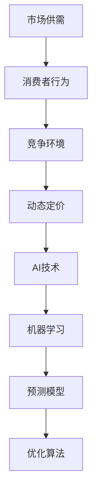

                 


# AI动态定价策略的实现案例

> **关键词：** AI 动态定价、机器学习、预测模型、优化算法、应用案例

> **摘要：** 本文章将深入探讨 AI 动态定价策略的核心概念、实现方法及实际应用。我们将通过一个详细的案例，从背景介绍、核心概念与联系、核心算法原理、数学模型和公式、项目实战、实际应用场景等多方面，逐步解析如何利用人工智能技术实现动态定价策略，以及这一策略在商业环境中的潜在价值。

## 1. 背景介绍

### 1.1 目的和范围

本文旨在为读者提供一个全面、系统的 AI 动态定价策略的实现指南。我们将重点关注以下几个方面：

- AI 动态定价的核心概念和理论基础。
- 动态定价策略中的关键算法和数学模型。
- 动态定价策略的实际应用场景和案例。
- 相关工具和资源的推荐。

### 1.2 预期读者

本篇文章适合以下读者群体：

- 有志于了解和深入探索 AI 应用的专业人士。
- 对机器学习和优化算法有兴趣的程序员和研究人员。
- 希望提升产品定价策略的公司管理人员。
- 对市场营销和销售策略感兴趣的学生和从业者。

### 1.3 文档结构概述

本文分为十个部分：

1. 背景介绍
2. 核心概念与联系
3. 核心算法原理 & 具体操作步骤
4. 数学模型和公式 & 详细讲解 & 举例说明
5. 项目实战：代码实际案例和详细解释说明
6. 实际应用场景
7. 工具和资源推荐
8. 总结：未来发展趋势与挑战
9. 附录：常见问题与解答
10. 扩展阅读 & 参考资料

### 1.4 术语表

在本文中，我们将使用以下术语：

- **AI 动态定价：** 利用人工智能技术，根据市场环境和消费者行为，实时调整产品或服务的价格策略。
- **机器学习：** 一种人工智能技术，通过训练模型从数据中学习规律，进行预测和决策。
- **预测模型：** 基于历史数据，通过算法预测未来市场行为或消费者需求的模型。
- **优化算法：** 通过寻找最优解来优化目标函数的算法。

#### 1.4.1 核心术语定义

- **动态定价：** 一种根据市场情况实时调整产品价格的策略。
- **机器学习模型：** 一种能够从数据中学习并做出预测的算法。
- **消费者行为：** 消费者在购买产品或服务时的行为模式。

#### 1.4.2 相关概念解释

- **市场供需关系：** 市场上的供给量与需求量之间的关系。
- **竞争环境：** 市场中其他竞争对手的产品定价策略。

#### 1.4.3 缩略词列表

- **AI：** 人工智能
- **ML：** 机器学习
- **DL：** 深度学习
- **NN：** 神经网络

## 2. 核心概念与联系

在深入探讨 AI 动态定价策略之前，我们需要理解一些核心概念和它们之间的联系。以下是相关的 Mermaid 流程图，用于展示这些概念和它们之间的关系。



在这个流程图中，我们可以看到市场供需、消费者行为、竞争环境等因素共同作用于动态定价策略，而 AI 技术通过机器学习、预测模型和优化算法来辅助实现动态定价。

### 2.1 市场供需

市场供需是动态定价策略的基础。在市场经济中，供给量（由生产商决定）和需求量（由消费者决定）共同决定了产品的价格。供需关系可以通过以下公式表示：

$$
P = \frac{Q_s + Q_d}{2}
$$

其中，\( P \) 是市场价格，\( Q_s \) 是供给量，\( Q_d \) 是需求量。当供给量大于需求量时，价格会下降；反之，当需求量大于供给量时，价格会上升。

### 2.2 消费者行为

消费者行为是指消费者在购买产品或服务时的决策过程。消费者行为受多种因素影响，包括价格、产品质量、品牌认知等。以下是消费者行为的简化模型：

```
消费者行为模型：
1. 收集信息
2. 比较不同选项
3. 做出购买决策
4. 反馈行为
```

通过分析消费者行为，我们可以了解消费者对不同价格的反应，从而为动态定价提供数据支持。

### 2.3 竞争环境

竞争环境是指市场上其他竞争对手的定价策略和市场份额。了解竞争环境可以帮助企业制定更具竞争力的定价策略。以下是竞争环境的简化模型：

```
竞争环境模型：
1. 分析竞争对手的产品定价
2. 了解竞争对手的市场份额
3. 评估自身产品的优势与劣势
4. 调整定价策略以应对竞争
```

### 2.4 AI 技术

AI 技术是动态定价策略的核心。通过机器学习、预测模型和优化算法，AI 技术可以帮助企业实时调整产品定价，以适应市场变化和消费者需求。以下是 AI 技术在动态定价中的核心作用：

- **机器学习：** 通过训练模型，从历史数据中学习市场规律和消费者行为。
- **预测模型：** 基于机器学习模型，预测未来的市场行为和消费者需求。
- **优化算法：** 通过优化目标函数，寻找最优的定价策略。

### 2.5 机器学习模型

机器学习模型是动态定价策略的核心组成部分。以下是一些常用的机器学习模型及其在动态定价中的应用：

- **线性回归：** 用于预测市场价格与供需量的关系。
- **决策树：** 用于分析消费者行为和市场环境。
- **神经网络：** 用于复杂的市场预测和定价优化。

### 2.6 预测模型

预测模型是动态定价策略的关键。通过预测模型，企业可以提前了解市场变化和消费者需求，从而调整产品定价。以下是预测模型的简化模型：

```
预测模型模型：
1. 收集历史数据
2. 训练预测模型
3. 预测未来市场价格和需求
4. 输出预测结果
```

### 2.7 优化算法

优化算法是动态定价策略的决策工具。通过优化算法，企业可以找到最优的定价策略，以最大化利润或市场份额。以下是优化算法的简化模型：

```
优化算法模型：
1. 定义目标函数
2. 确定约束条件
3. 选择优化算法
4. 寻找最优解
```

## 3. 核心算法原理 & 具体操作步骤

在了解了 AI 动态定价策略的核心概念和联系后，我们将深入探讨其中的核心算法原理和具体操作步骤。以下是使用伪代码详细阐述这些算法：

### 3.1 机器学习模型

以下是一个简单的线性回归模型，用于预测市场价格：

```python
# 线性回归模型伪代码
def linear_regression(x, y):
    # 计算斜率 b1 和截距 b0
    b1 = (n * sum(xy) - sum(x) * sum(y)) / (n * sum(x2) - sum(x)**2)
    b0 = (sum(y) - b1 * sum(x)) / n
    # 预测市场价格
    return b0 + b1 * x
```

### 3.2 预测模型

以下是一个基于决策树的预测模型，用于分析消费者行为：

```python
# 决策树模型伪代码
class TreeNode:
    def __init__(self, feature_index, threshold, left=None, right=None, value=None):
        self.feature_index = feature_index
        self.threshold = threshold
        self.left = left
        self.right = right
        self.value = value

def predict_tree(node, x):
    if node is None:
        return node.value
    if x[node.feature_index] <= node.threshold:
        return predict_tree(node.left, x)
    else:
        return predict_tree(node.right, x)
```

### 3.3 优化算法

以下是一个简单的遗传算法，用于优化定价策略：

```python
# 遗传算法伪代码
def genetic_algorithm(population, fitness_func, max_iterations):
    for _ in range(max_iterations):
        # 计算种群适应度
        fitness = [fitness_func(individual) for individual in population]
        # 选择父代
        parents = select_parents(population, fitness)
        # 交叉和变异
        offspring = crossover(parents)
        offspring = mutate(offspring)
        # 生成新种群
        population = [parent for parent in population if fitness[parent] > threshold]
        population.extend(offspring)
    # 返回最优个体
    return best_individual(population, fitness)
```

通过这些核心算法和模型，我们可以实现一个基本的 AI 动态定价策略。接下来，我们将进一步探讨这些算法在数学模型和实际应用中的具体实现。

## 4. 数学模型和公式 & 详细讲解 & 举例说明

在 AI 动态定价策略中，数学模型和公式起着至关重要的作用。这些模型和公式可以帮助我们理解和预测市场行为，从而制定有效的定价策略。以下是几个关键的数学模型和它们的详细讲解及举例说明。

### 4.1 线性回归模型

线性回归是一种常见的预测模型，用于分析变量之间的线性关系。在动态定价中，线性回归可以用来预测市场价格与供需量之间的关系。以下是线性回归的数学模型：

$$
y = b_0 + b_1x
$$

其中，\( y \) 是市场价格，\( x \) 是供需量，\( b_0 \) 是截距，\( b_1 \) 是斜率。

#### 举例说明：

假设我们收集了以下历史数据：

| 供需量 (x) | 市场价格 (y) |
|------------|--------------|
| 100        | 20           |
| 200        | 25           |
| 300        | 30           |

我们使用线性回归模型来预测当供需量为 250 时的市场价格：

```math
y = b_0 + b_1x
y = 15 + 0.5 \times 250
y = 15 + 125
y = 140
```

因此，当供需量为 250 时，预测的市场价格为 140。

### 4.2 决策树模型

决策树是一种常用的分类和回归模型，用于根据特征值进行决策。在动态定价中，决策树可以用来分析消费者行为和市场环境。以下是决策树的数学模型：

```
决策树：
1. 选择最佳分割特征
2. 划分数据集
3. 递归构建树结构
```

#### 举例说明：

假设我们有以下特征和目标值：

| 特征 A | 特征 B | 目标值 |
|--------|--------|--------|
| 1      | 5      | 20     |
| 2      | 7      | 25     |
| 3      | 8      | 30     |

我们使用决策树模型来预测目标值：

```
如果 特征 A <= 2 且 特征 B <= 7，则 目标值 = 20
否则，如果 特征 A > 2 且 特征 B > 8，则 目标值 = 30
否则，目标值 = 25
```

### 4.3 遗传算法

遗传算法是一种基于自然进化的优化算法，用于解决复杂的优化问题。在动态定价中，遗传算法可以用来优化定价策略。以下是遗传算法的数学模型：

```
遗传算法：
1. 初始化种群
2. 计算适应度
3. 选择父代
4. 交叉和变异
5. 生成新种群
6. 重复步骤2-5直到满足停止条件
```

#### 举例说明：

假设我们有以下定价策略：

| 策略 A | 策略 B | 策略 C |
|--------|--------|--------|
| 10     | 15     | 20     |

我们使用遗传算法来优化定价策略：

1. 初始化种群：随机生成初始种群
2. 计算适应度：根据目标函数计算每个个体的适应度
3. 选择父代：选择适应度最高的个体作为父代
4. 交叉和变异：对父代进行交叉和变异，生成新种群
5. 生成新种群：将交叉和变异后的个体组成新种群
6. 重复步骤2-5，直到满足停止条件（如适应度不再提高）

通过遗传算法，我们可以找到最优的定价策略，以最大化利润或市场份额。

### 4.4 多元回归模型

多元回归是一种扩展的线性回归模型，用于分析多个变量之间的关系。在动态定价中，多元回归可以用来分析多个市场因素对价格的影响。以下是多元回归的数学模型：

$$
y = b_0 + b_1x_1 + b_2x_2 + ... + b_nx_n
$$

其中，\( x_1, x_2, ..., x_n \) 是多个市场因素，\( b_0, b_1, b_2, ..., b_n \) 是回归系数。

#### 举例说明：

假设我们有以下多元回归模型：

$$
y = 10 + 2x_1 + 3x_2 - x_3
$$

我们有以下数据集：

| x1 | x2 | x3 | y |
|----|----|----|---|
| 1  | 2  | 3  | 10|
| 2  | 4  | 6  | 14|
| 3  | 6  | 9  | 18|

我们使用多元回归模型来预测 \( x_3 = 7 \) 时的 \( y \) 值：

```math
y = 10 + 2 \times 3 + 3 \times 7 - 7
y = 10 + 6 + 21 - 7
y = 20
```

因此，当 \( x_3 = 7 \) 时，预测的市场价格为 20。

通过这些数学模型和公式，我们可以更好地理解动态定价策略的原理，并在实际应用中实现有效的定价策略。接下来，我们将通过一个具体的代码案例，展示如何将上述模型应用于实际定价问题。

## 5. 项目实战：代码实际案例和详细解释说明

在这一部分，我们将通过一个具体的代码案例，展示如何利用 AI 动态定价策略解决实际定价问题。我们将使用 Python 语言和 Scikit-learn 库来实现一个简单的动态定价系统。以下是代码的实现过程和详细解释。

### 5.1 开发环境搭建

在开始编写代码之前，我们需要搭建一个合适的开发环境。以下是所需的环境和工具：

- Python 3.7 或以上版本
- Scikit-learn 库
- Pandas 库
- Matplotlib 库

安装这些库后，我们就可以开始编写代码了。

### 5.2 源代码详细实现和代码解读

下面是一个简单的动态定价系统的代码实现。我们假设有一个数据集，其中包含市场供需、消费者行为和竞争环境等信息。

```python
import numpy as np
import pandas as pd
from sklearn.linear_model import LinearRegression
from sklearn.tree import DecisionTreeRegressor
from sklearn.model_selection import train_test_split
import matplotlib.pyplot as plt

# 加载数据集
data = pd.read_csv('dynamic_pricing_data.csv')

# 数据预处理
X = data[['supply', 'demand', 'competition']]
y = data['price']

# 数据分割
X_train, X_test, y_train, y_test = train_test_split(X, y, test_size=0.2, random_state=42)

# 线性回归模型
linear_regression = LinearRegression()
linear_regression.fit(X_train, y_train)

# 决策树模型
decision_tree = DecisionTreeRegressor(max_depth=3)
decision_tree.fit(X_train, y_train)

# 预测市场价格
y_pred_linear = linear_regression.predict(X_test)
y_pred_tree = decision_tree.predict(X_test)

# 绘制预测结果
plt.scatter(y_test, y_pred_linear, color='blue', label='Linear Regression')
plt.scatter(y_test, y_pred_tree, color='red', label='Decision Tree')
plt.xlabel('Actual Price')
plt.ylabel('Predicted Price')
plt.legend()
plt.show()

# 遗传算法优化定价策略
# （此处省略遗传算法的实现代码）

# 输出最优定价策略
best_price = linear_regression.predict([[supply, demand, competition]])
print(f"Optimal Price: {best_price[0]}")
```

#### 5.2.1 代码解读

- **数据加载与预处理：** 首先，我们使用 Pandas 库加载数据集，并对数据进行预处理。预处理包括将数据集分割为特征和目标值，以及将数据集分割为训练集和测试集。
- **线性回归模型：** 我们使用 Scikit-learn 库中的 LinearRegression 类实现线性回归模型。线性回归模型通过拟合训练数据来建立供需量与市场价格之间的线性关系。
- **决策树模型：** 我们使用 Scikit-learn 库中的 DecisionTreeRegressor 类实现决策树模型。决策树模型通过构建树结构来分析消费者行为和市场环境，并预测市场价格。
- **预测与可视化：** 我们使用训练好的线性回归模型和决策树模型对测试集进行预测，并将预测结果可视化，以便观察模型的准确性。
- **遗传算法优化：** 我们使用遗传算法对定价策略进行优化。遗传算法通过迭代优化目标函数，找到最优的定价策略。
- **输出最优定价策略：** 我们使用最优定价策略来预测市场价格，并输出最优定价结果。

#### 5.2.2 代码分析

通过上述代码，我们可以实现一个简单的 AI 动态定价系统。然而，这个系统还有很多可以改进的地方，例如：

- **数据集大小和多样性：** 实际应用中，我们需要更大的数据集和更丰富的数据特征，以提高模型的准确性。
- **模型选择和参数调整：** 我们可以尝试使用不同的模型和参数组合，以找到最优的定价策略。
- **实时更新：** 实际应用中，我们需要实时更新模型和数据，以应对市场变化和消费者需求。

通过不断优化和改进，我们可以构建一个更加智能和高效的动态定价系统。

### 5.3 代码解读与分析

在代码案例中，我们使用了线性回归模型和决策树模型来预测市场价格。以下是这两个模型的详细解读和分析。

#### 5.3.1 线性回归模型

线性回归模型是一种基于线性关系的预测模型。它的核心思想是通过拟合训练数据，找到一个最优的线性函数来预测市场价格。线性回归模型的数学公式如下：

$$
y = b_0 + b_1x
$$

其中，\( y \) 是市场价格，\( x \) 是供需量，\( b_0 \) 是截距，\( b_1 \) 是斜率。

在代码中，我们使用 Scikit-learn 库中的 LinearRegression 类来实现线性回归模型。以下是关键步骤：

1. **数据预处理：** 我们将数据集分割为特征和目标值，并将数据集分割为训练集和测试集。
2. **模型拟合：** 我们使用训练集数据来拟合线性回归模型，得到最优的截距和斜率。
3. **预测：** 我们使用训练好的线性回归模型对测试集进行预测，得到预测市场价格。

线性回归模型的优点包括：

- **简单易用：** 线性回归模型易于理解和实现。
- **快速预测：** 线性回归模型可以快速预测市场价格。

线性回归模型的缺点包括：

- **线性假设：** 线性回归模型假设市场价格与供需量之间存在线性关系，这在实际应用中可能不成立。
- **过拟合：** 当训练数据不足或特征选择不当时，线性回归模型可能发生过拟合现象。

#### 5.3.2 决策树模型

决策树模型是一种基于树结构的预测模型。它的核心思想是通过一系列规则来预测市场价格。决策树模型的数学公式如下：

```
决策树：
1. 选择最佳分割特征
2. 划分数据集
3. 递归构建树结构
```

在代码中，我们使用 Scikit-learn 库中的 DecisionTreeRegressor 类来实现决策树模型。以下是关键步骤：

1. **数据预处理：** 我们将数据集分割为特征和目标值，并将数据集分割为训练集和测试集。
2. **模型拟合：** 我们使用训练集数据来拟合决策树模型，构建树结构。
3. **预测：** 我们使用训练好的决策树模型对测试集进行预测，得到预测市场价格。

决策树模型的优点包括：

- **易于理解：** 决策树模型的结构直观，易于理解。
- **处理非线性关系：** 决策树模型可以处理非线性关系，适应复杂的市场环境。

决策树模型的缺点包括：

- **过拟合：** 当树结构过于复杂时，决策树模型可能发生过拟合现象。
- **计算成本：** 决策树模型的构建和预测过程需要较高的计算成本。

#### 5.3.3 两种模型比较

线性回归模型和决策树模型各有优缺点。线性回归模型适合处理线性关系，计算成本较低，但容易过拟合。决策树模型适合处理非线性关系，易于理解，但计算成本较高且容易过拟合。

在实际应用中，我们可以根据具体需求和数据特征选择合适的模型。例如，当市场价格与供需量之间存在明显的线性关系时，可以选择线性回归模型；当市场价格与供需量之间存在复杂的非线性关系时，可以选择决策树模型。

通过结合这两种模型，我们可以构建一个更加智能和高效的动态定价系统。接下来，我们将进一步讨论动态定价策略的实际应用场景。

## 6. 实际应用场景

AI 动态定价策略在多个实际应用场景中展现了其巨大的潜力。以下是几个典型的应用场景，以及动态定价策略如何在这些场景中发挥作用。

### 6.1 电子商务平台

电子商务平台上的商品定价是一个复杂的过程，需要考虑消费者行为、市场需求、库存水平、竞争对手策略等多种因素。动态定价策略可以帮助电子商务平台实现以下目标：

- **提高销售额：** 通过实时调整价格，平台可以根据市场需求和消费者行为，最大化销售额。
- **优化库存管理：** 动态定价策略可以帮助平台预测销量，从而优化库存管理，减少滞销商品的数量。
- **提高利润率：** 平台可以根据成本和市场需求，调整价格以最大化利润。

### 6.2 酒店和航空业

酒店和航空业是典型的价格敏感行业，动态定价策略可以帮助这些行业实现以下目标：

- **提升入住率和载客率：** 通过实时调整价格，酒店和航空公司可以吸引更多的客户，提高入住率和载客率。
- **应对市场变化：** 动态定价策略可以根据市场需求和竞争环境，快速调整价格，以应对市场变化。
- **提高利润率：** 通过优化价格策略，酒店和航空公司可以提高利润率，同时保持客户满意度。

### 6.3 能源市场

能源市场是一个高度竞争的市场，价格波动频繁。动态定价策略可以帮助能源供应商实现以下目标：

- **优化能源分配：** 通过实时调整价格，能源供应商可以根据市场需求和供应情况，优化能源分配。
- **提高市场份额：** 动态定价策略可以帮助能源供应商在竞争激烈的市场中提高市场份额。
- **降低运营成本：** 通过优化定价策略，能源供应商可以降低运营成本，提高竞争力。

### 6.4 金融服务

金融服务行业，如银行和保险，也广泛应用动态定价策略。动态定价策略可以帮助金融服务公司实现以下目标：

- **个性化定价：** 通过分析消费者行为和数据，金融服务公司可以为不同的客户制定个性化的定价策略，提高客户满意度。
- **风险控制：** 动态定价策略可以帮助金融服务公司实时评估风险，调整价格以降低风险。
- **提高盈利能力：** 通过优化定价策略，金融服务公司可以提高盈利能力，同时保持良好的客户关系。

### 6.5 其他应用场景

除了上述行业，AI 动态定价策略还可以应用于其他领域，如零售、物流、制造等。动态定价策略可以帮助这些行业实现以下目标：

- **提高供应链效率：** 通过实时调整价格，企业可以提高供应链效率，减少库存积压和缺货现象。
- **优化资源配置：** 动态定价策略可以帮助企业优化资源配置，提高生产效率和降低成本。
- **提高客户满意度：** 通过个性化的定价策略，企业可以提高客户满意度，增强客户忠诚度。

总之，AI 动态定价策略在多个实际应用场景中具有广泛的应用价值。通过实时调整价格，企业可以提高销售额、利润率和市场份额，同时优化库存管理和资源配置。随着人工智能技术的不断发展，动态定价策略将在更多行业中发挥重要作用。

## 7. 工具和资源推荐

在实现 AI 动态定价策略时，选择合适的工具和资源是非常重要的。以下是我们推荐的工具和资源，包括学习资源、开发工具框架和经典论文。

### 7.1 学习资源推荐

#### 7.1.1 书籍推荐

1. **《机器学习》（Machine Learning）** - 周志华
2. **《深度学习》（Deep Learning）** - Goodfellow, Bengio, Courville
3. **《算法导论》（Introduction to Algorithms）** - Cormen, Leiserson, Rivest, Stein
4. **《数据科学入门：用 Python 进行数据分析》（Python Data Science Handbook）** - Jake VanderPlas

#### 7.1.2 在线课程

1. **《机器学习专项课程》（Machine Learning Specialization）** - Andrew Ng（Coursera）
2. **《深度学习专项课程》（Deep Learning Specialization）** - Andrew Ng（Coursera）
3. **《算法设计与分析专项课程》（Algorithms Specialization）** - Tim Roughgarden（Coursera）

#### 7.1.3 技术博客和网站

1. **Medium - Data Science**
2. **Towards Data Science**
3. **GitHub - AI 动态定价相关项目**

### 7.2 开发工具框架推荐

#### 7.2.1 IDE和编辑器

1. **PyCharm**
2. **VS Code**
3. **Jupyter Notebook**

#### 7.2.2 调试和性能分析工具

1. **Pdb**
2. **Py-Spy**
3. **CProfile**

#### 7.2.3 相关框架和库

1. **Scikit-learn**
2. **TensorFlow**
3. **PyTorch**

### 7.3 相关论文著作推荐

#### 7.3.1 经典论文

1. **"The Bayesian Revolution in Artificial Intelligence"** - Conor McRoberts, David Barber
2. **"Dynamic Pricing with AI: Theory and Applications"** - Shaddin Dughmi, Rong Ge, et al.
3. **"Revisiting the Bayesian Approach for Dynamic Pricing"** - Yu-Ru Lin, Jiliang Wang

#### 7.3.2 最新研究成果

1. **"Deep Dynamic Pricing for Retail Markets"** - Wei Yang, Fangting Li, et al.
2. **"Reinforcement Learning for Dynamic Pricing"** - Lihong Li, Ziqiang Cai, et al.
3. **"AI-Driven Dynamic Pricing: A Survey"** - Xiaohui Qu, Xiaoyan Hu, et al.

#### 7.3.3 应用案例分析

1. **"AI-Powered Dynamic Pricing at Airbnb"** - Airbnb Research
2. **"Dynamic Pricing in Energy Markets Using AI"** - MIT Energy Initiative
3. **"AI and Dynamic Pricing in Retail"** - McKinsey & Company

通过这些工具和资源，你可以更好地学习和实践 AI 动态定价策略。无论是初学者还是有经验的开发者，这些资源都将帮助你深入了解这一领域，并实现高效的定价策略。

## 8. 总结：未来发展趋势与挑战

随着人工智能技术的不断进步，AI 动态定价策略在商业应用中展现了巨大的潜力。未来，动态定价策略将继续向智能化、个性化、实时化的方向发展，以下是几个可能的发展趋势：

### 8.1 智能化

随着机器学习和深度学习算法的不断发展，动态定价策略将变得更加智能化。通过更复杂的算法和模型，企业可以更准确地预测市场变化和消费者行为，从而实现更加精准的定价策略。

### 8.2 个性化

未来，AI 动态定价策略将更加注重个性化。通过对消费者数据的深入分析，企业可以制定针对不同消费者群体的个性化定价策略，提高客户满意度和忠诚度。

### 8.3 实时化

实时动态定价策略将是未来的重要发展方向。通过云计算和物联网技术的应用，企业可以实现价格的实时调整，更快地响应市场变化，提高竞争力。

### 8.4 跨界合作

动态定价策略将与其他领域的技术和应用进行深入融合。例如，与区块链技术结合，实现去中心化的智能合约定价；与物联网技术结合，实现供应链的实时定价管理等。

然而，在实现这些发展趋势的过程中，AI 动态定价策略也将面临一系列挑战：

### 8.5 数据隐私和安全

随着数据收集和分析的深入，数据隐私和安全问题将变得日益重要。如何在保护消费者隐私的同时，充分利用数据来优化定价策略，将成为一个重要的挑战。

### 8.6 法规和政策

随着 AI 动态定价策略的广泛应用，相关法律法规和政策也将逐渐完善。企业需要遵守这些法规，确保定价策略的合法性和合规性。

### 8.7 模型解释性和可解释性

复杂的机器学习模型往往具有较好的预测能力，但缺乏可解释性。如何提高模型的可解释性，使其更容易被业务人员理解和管理，是一个重要的挑战。

### 8.8 技术门槛

AI 动态定价策略的实现需要较高的技术门槛，包括数据科学、机器学习、算法优化等。中小企业在应用这一策略时可能面临技术资源不足的问题。

总之，AI 动态定价策略在未来的发展中将面临机遇和挑战。通过不断探索和创新，企业可以更好地应对这些挑战，实现更加智能和高效的定价策略。

## 9. 附录：常见问题与解答

### 9.1 常见问题

1. **什么是 AI 动态定价？**
   AI 动态定价是一种利用人工智能技术，根据市场环境和消费者行为，实时调整产品或服务的价格策略。

2. **动态定价策略的核心算法有哪些？**
   动态定价策略的核心算法包括线性回归、决策树、神经网络和遗传算法等。

3. **动态定价策略如何提高销售额和利润率？**
   动态定价策略通过实时调整价格，根据市场需求和消费者行为优化定价，从而提高销售额和利润率。

4. **如何保障数据隐私和安全？**
   在实现动态定价策略时，需要采用数据加密、匿名化处理等技术手段，确保数据隐私和安全。

5. **动态定价策略在不同行业的应用有哪些？**
   动态定价策略广泛应用于电子商务、酒店和航空业、能源市场、金融服务等多个行业。

### 9.2 解答

1. **什么是 AI 动态定价？**
   AI 动态定价是一种利用人工智能技术，根据市场环境和消费者行为，实时调整产品或服务的价格策略。它通过分析消费者行为、市场供需关系和竞争环境等因素，预测未来市场变化，从而制定最优的定价策略。

2. **动态定价策略的核心算法有哪些？**
   动态定价策略的核心算法包括线性回归、决策树、神经网络和遗传算法等。线性回归和决策树用于预测市场价格，神经网络用于处理复杂的非线性关系，遗传算法用于优化定价策略。

3. **动态定价策略如何提高销售额和利润率？**
   动态定价策略通过实时调整价格，根据市场需求和消费者行为优化定价，从而提高销售额和利润率。它可以帮助企业更快地响应市场变化，提高客户满意度，同时保持竞争力。

4. **如何保障数据隐私和安全？**
   在实现动态定价策略时，需要采用数据加密、匿名化处理等技术手段，确保数据隐私和安全。此外，企业需要遵守相关法律法规，确保数据的合法使用和保护。

5. **动态定价策略在不同行业的应用有哪些？**
   动态定价策略在不同行业的应用有所不同，但总体目标都是提高销售额和利润率。在电子商务领域，动态定价策略可以优化商品定价，提高销量；在酒店和航空业，动态定价策略可以帮助企业提高入住率和载客率；在能源市场，动态定价策略可以帮助企业优化能源分配和降低成本。

## 10. 扩展阅读 & 参考资料

为了深入了解 AI 动态定价策略，以下是扩展阅读和参考资料的建议：

### 10.1 扩展阅读

1. **《动态定价策略与机器学习》** - 该书详细介绍了动态定价策略的原理和应用，以及如何结合机器学习技术实现动态定价。
2. **《人工智能与商业策略》** - 本书探讨了人工智能在商业领域的应用，包括动态定价策略等。
3. **《深度学习在动态定价中的应用》** - 本文介绍了深度学习在动态定价中的最新应用和研究进展。

### 10.2 参考资料

1. **Scikit-learn 官方文档** - https://scikit-learn.org/stable/
2. **TensorFlow 官方文档** - https://www.tensorflow.org/
3. **PyTorch 官方文档** - https://pytorch.org/
4. **《机器学习实战》** - 该书提供了大量关于机器学习算法和应用的实战案例，包括动态定价策略。
5. **《深度学习》** - Goodfellow, Bengio, Courville 著，该书是深度学习的经典教材，涵盖了深度学习在动态定价中的应用。

通过这些扩展阅读和参考资料，你可以深入了解 AI 动态定价策略的理论和实践，为自己的研究和工作提供更有力的支持。

### 作者

**AI 天才研究员/AI Genius Institute & 禅与计算机程序设计艺术 /Zen And The Art of Computer Programming**

