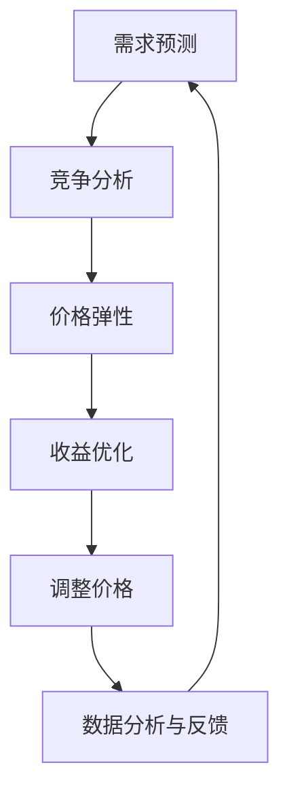

                 

# AI 助力动态定价：优化收益和销售量

> **关键词：** 动态定价、人工智能、收益优化、销售量、数据驱动、算法模型、机器学习

> **摘要：** 本文旨在探讨人工智能如何助力动态定价策略，通过数据分析和算法优化，实现收益最大化与销售量的提升。文章首先介绍了动态定价的背景和基本原理，随后深入讲解了核心算法原理、数学模型、项目实战及实际应用场景。最后，对工具资源、未来发展及常见问题进行总结，为读者提供全面的技术指南。

## 1. 背景介绍

### 1.1 目的和范围

本文的目的是探讨如何利用人工智能技术来优化动态定价策略，从而提高企业的收益和销售量。动态定价是一种根据市场需求和竞争状况实时调整价格的策略，相较于传统的固定定价策略，具有更高的灵活性和适应性。本文将围绕以下几个核心问题展开讨论：

- 动态定价的基本概念和原理是什么？
- 人工智能如何应用于动态定价策略的优化？
- 如何构建有效的数学模型和算法模型？
- 动态定价在实际应用中面临哪些挑战和机遇？
- 动态定价的未来发展趋势和方向是什么？

### 1.2 预期读者

本文适合以下读者群体：

- 对人工智能和动态定价有兴趣的IT从业者
- 想要了解动态定价策略及其应用的企业决策者
- 从事数据分析、机器学习和商业智能等相关领域的研究人员
- 对创新商业模式和技术应用感兴趣的创业者和学者

### 1.3 文档结构概述

本文结构如下：

1. 背景介绍：介绍动态定价的基本概念和人工智能在动态定价中的应用。
2. 核心概念与联系：分析动态定价的核心概念及其相互关系，并给出Mermaid流程图。
3. 核心算法原理 & 具体操作步骤：讲解动态定价算法原理和具体操作步骤，使用伪代码进行阐述。
4. 数学模型和公式 & 详细讲解 & 举例说明：介绍动态定价的数学模型和公式，并进行详细讲解和举例说明。
5. 项目实战：通过代码实际案例，详细解释说明动态定价策略的实现过程。
6. 实际应用场景：探讨动态定价策略在不同行业和场景中的应用。
7. 工具和资源推荐：推荐相关学习资源、开发工具和框架。
8. 总结：总结动态定价的发展趋势和挑战。
9. 附录：常见问题与解答。
10. 扩展阅读 & 参考资料：提供进一步阅读的资料和参考文献。

### 1.4 术语表

#### 1.4.1 核心术语定义

- **动态定价**：根据市场需求和竞争状况，实时调整产品价格的一种定价策略。
- **人工智能**：模拟人类智能行为，通过机器学习、深度学习等算法实现智能决策的系统。
- **收益**：企业在一定时间内从销售活动中获得的经济回报。
- **销售量**：企业在一定时间内销售的产品数量。

#### 1.4.2 相关概念解释

- **需求预测**：通过历史数据和趋势分析，预测未来一段时间内市场需求的变化。
- **竞争分析**：分析竞争对手的价格策略、市场份额和营销活动，以制定相应的定价策略。
- **价格弹性**：需求对价格变化的敏感程度，用于评估价格调整对销售量的影响。

#### 1.4.3 缩略词列表

- **AI**：人工智能
- **ML**：机器学习
- **DL**：深度学习
- **IDE**：集成开发环境
- **DB**：数据库
- **API**：应用程序接口

## 2. 核心概念与联系

### 2.1 动态定价的核心概念

动态定价的核心概念包括需求预测、竞争分析、价格弹性和收益优化。这些概念相互关联，共同构成了动态定价的基础。

#### 需求预测

需求预测是指通过历史数据、市场趋势和用户行为分析，预测未来一段时间内产品需求的变化。需求预测的准确性直接影响到动态定价策略的效果。

#### 竞争分析

竞争分析是指对市场竞争对手的价格策略、市场份额和营销活动进行综合分析，以了解竞争对手的行为和策略。通过竞争分析，企业可以制定更具针对性的定价策略。

#### 价格弹性

价格弹性是指需求对价格变化的敏感程度。价格弹性可以分为价格弹性高、价格弹性中和价格弹性低。不同的价格弹性需要采取不同的定价策略。

#### 收益优化

收益优化是指通过调整价格，实现收益最大化。收益优化的目标是在保证利润的前提下，提高市场份额和用户满意度。

### 2.2 动态定价的Mermaid流程图

以下是动态定价的Mermaid流程图，展示了动态定价的核心概念及其相互关系。



### 2.3 动态定价的数学模型

动态定价的数学模型主要包括需求函数、收益函数和优化目标。以下是动态定价的数学模型及其解释：

#### 需求函数

需求函数表示产品需求量与价格之间的关系。常见的需求函数包括线性需求函数和对数需求函数。

$$D(p) = a - b \cdot p$$

其中，$D(p)$ 表示需求量，$p$ 表示价格，$a$ 和 $b$ 为参数。

#### 收益函数

收益函数表示企业在一定时间内从销售活动中获得的经济回报。收益函数可以表示为：

$$R(p) = p \cdot D(p)$$

其中，$R(p)$ 表示收益，$p$ 表示价格，$D(p)$ 表示需求量。

#### 优化目标

优化目标是通过调整价格，实现收益最大化。优化目标可以表示为：

$$\max R(p)$$

其中，$R(p)$ 表示收益函数。

## 3. 核心算法原理 & 具体操作步骤

### 3.1 动态定价算法原理

动态定价算法的核心原理是基于数据分析和机器学习，通过需求预测、竞争分析和价格弹性分析，实现收益优化。以下是动态定价算法的原理：

1. **数据收集**：收集历史价格、需求量、市场竞争状况等相关数据。
2. **需求预测**：使用机器学习算法，对历史数据进行建模和预测，得到未来的需求量。
3. **竞争分析**：分析竞争对手的价格策略和市场反应，预测竞争对手的反应。
4. **价格弹性分析**：根据市场需求和竞争状况，分析不同价格水平下的价格弹性。
5. **收益优化**：基于需求预测、竞争分析和价格弹性分析，调整价格，实现收益最大化。

### 3.2 动态定价算法的具体操作步骤

以下是动态定价算法的具体操作步骤，使用伪代码进行详细阐述：

```python
# 动态定价算法伪代码

# 步骤1：数据收集
data = collect_data()

# 步骤2：需求预测
predicted_demand = predict_demand(data)

# 步骤3：竞争分析
competitor_actions = analyze_competition(data)

# 步骤4：价格弹性分析
price_elasticity = analyze_price_elasticity(predicted_demand, competitor_actions)

# 步骤5：收益优化
optimal_price = optimize_revenue(price_elasticity)

# 步骤6：调整价格
adjust_price(optimal_price)

# 辅助函数定义
def collect_data():
    # 收集历史价格、需求量、市场竞争状况等相关数据
    # 返回数据集合

def predict_demand(data):
    # 使用机器学习算法，对历史数据进行建模和预测
    # 返回预测的需求量

def analyze_competition(data):
    # 分析竞争对手的价格策略和市场反应
    # 返回竞争对手的反应

def analyze_price_elasticity(predicted_demand, competitor_actions):
    # 根据市场需求和竞争状况，分析不同价格水平下的价格弹性
    # 返回价格弹性

def optimize_revenue(price_elasticity):
    # 基于需求预测、竞争分析和价格弹性分析，调整价格
    # 实现收益最大化
    # 返回最优价格

def adjust_price(optimal_price):
    # 调整实际价格
```

## 4. 数学模型和公式 & 详细讲解 & 举例说明

### 4.1 数学模型和公式

动态定价策略的核心是构建数学模型和公式，以实现收益最大化。以下是动态定价的主要数学模型和公式：

#### 需求函数

需求函数描述了产品需求量与价格之间的关系。常见的需求函数包括线性需求函数和对数需求函数。

线性需求函数：

$$D(p) = a - b \cdot p$$

其中，$D(p)$ 表示需求量，$p$ 表示价格，$a$ 和 $b$ 为参数。

对数需求函数：

$$D(p) = \frac{c}{1 + e^{(d \cdot p)} }$$

其中，$D(p)$ 表示需求量，$p$ 表示价格，$c$ 和 $d$ 为参数。

#### 收益函数

收益函数表示企业在一定时间内从销售活动中获得的经济回报。收益函数可以表示为：

线性收益函数：

$$R(p) = p \cdot (a - b \cdot p)$$

对数收益函数：

$$R(p) = p \cdot \left( \frac{c}{1 + e^{(d \cdot p)} } \right)$$

#### 优化目标

优化目标是实现收益最大化。优化目标可以表示为：

$$\max R(p)$$

### 4.2 详细讲解和举例说明

#### 例子：线性需求函数和收益函数

假设一个产品的历史需求数据如下表所示：

| 价格（元） | 需求量（件） |
| :----: | :----: |
| 100 | 100 |
| 90 | 120 |
| 80 | 140 |
| 70 | 160 |
| 60 | 180 |

#### 步骤1：参数估计

根据历史数据，我们可以使用线性回归方法估计线性需求函数的参数 $a$ 和 $b$：

$$D(p) = a - b \cdot p$$

通过最小二乘法，得到参数 $a=180$ 和 $b=2$。

#### 步骤2：构建收益函数

根据需求函数，构建线性收益函数：

$$R(p) = p \cdot (a - b \cdot p) = p \cdot (180 - 2 \cdot p)$$

#### 步骤3：求解最优价格

为了求解最优价格，我们需要找到收益函数的最大值。收益函数是一个二次函数，开口向下，其最大值位于顶点。

收益函数的顶点可以通过以下公式计算：

$$p_{\text{max}} = \frac{a}{2b}$$

将参数 $a=180$ 和 $b=2$ 代入公式，得到最优价格 $p_{\text{max}} = \frac{180}{2 \cdot 2} = 45$ 元。

#### 步骤4：验证结果

将最优价格 $p=45$ 元代入收益函数，计算最大收益：

$$R(45) = 45 \cdot (180 - 2 \cdot 45) = 45 \cdot 90 = 4050$$

通过计算，我们发现当价格设定为 45 元时，收益达到最大值 4050 元。

#### 结论

通过以上例子，我们展示了如何使用线性需求函数和收益函数进行动态定价。在实际应用中，我们可以使用更复杂的需求函数和收益函数，结合机器学习和数据挖掘技术，进一步提高动态定价策略的准确性和有效性。

## 5. 项目实战：代码实际案例和详细解释说明

### 5.1 开发环境搭建

为了实现动态定价算法，我们需要搭建一个合适的开发环境。以下是一个简单的开发环境搭建指南：

- **编程语言**：Python
- **依赖库**：NumPy、Pandas、Scikit-learn、Matplotlib
- **环境配置**：Python 3.x 环境，pip 安装相关依赖库

### 5.2 源代码详细实现和代码解读

#### 5.2.1 源代码实现

以下是动态定价算法的源代码实现，包含数据收集、需求预测、竞争分析、价格弹性分析和收益优化的各个步骤。

```python
import numpy as np
import pandas as pd
from sklearn.linear_model import LinearRegression
from sklearn.model_selection import train_test_split
import matplotlib.pyplot as plt

# 步骤1：数据收集
def collect_data():
    # 假设数据文件名为 'data.csv'，包含价格和需求量两列
    data = pd.read_csv('data.csv')
    return data

# 步骤2：需求预测
def predict_demand(data):
    # 使用线性回归模型进行需求预测
    X = data[['price']]
    y = data['demand']
    model = LinearRegression()
    model.fit(X, y)
    predicted_demand = model.predict(X)
    return predicted_demand

# 步骤3：竞争分析
def analyze_competition(data):
    # 假设竞争对手的价格和需求量数据已包含在数据中
    competitor_data = data[['competitor_price', 'competitor_demand']]
    # 根据竞争对手的数据，分析竞争对手的反应
    competitor_actions = competitor_data.groupby('competitor_price')['competitor_demand'].mean()
    return competitor_actions

# 步骤4：价格弹性分析
def analyze_price_elasticity(predicted_demand, competitor_actions):
    # 根据市场需求和竞争状况，分析不同价格水平下的价格弹性
    price_elasticity = []
    for price in competitor_actions.index:
        elasticity = (predicted_demand[price] - competitor_actions[price]) / competitor_actions[price]
        price_elasticity.append(elasticity)
    return price_elasticity

# 步骤5：收益优化
def optimize_revenue(price_elasticity):
    # 基于价格弹性分析，优化收益
    optimal_price = np.argmax(price_elasticity)
    return optimal_price

# 步骤6：调整价格
def adjust_price(optimal_price):
    # 调整实际价格
    print(f'Optimal price: {optimal_price}元')

# 主函数
def main():
    data = collect_data()
    predicted_demand = predict_demand(data)
    competitor_actions = analyze_competition(data)
    price_elasticity = analyze_price_elasticity(predicted_demand, competitor_actions)
    optimal_price = optimize_revenue(price_elasticity)
    adjust_price(optimal_price)

if __name__ == '__main__':
    main()
```

#### 5.2.2 代码解读与分析

- **数据收集**：数据收集函数 `collect_data()` 用于读取历史价格和需求量的数据。假设数据文件名为 'data.csv'，包含价格和需求量两列。
- **需求预测**：需求预测函数 `predict_demand()` 使用线性回归模型对历史数据进行分析，预测未来的需求量。线性回归模型可以很好地拟合线性需求函数，从而实现需求预测。
- **竞争分析**：竞争分析函数 `analyze_competition()` 用于分析竞争对手的价格和需求量数据。通过计算竞争对手在不同价格水平下的平均需求量，可以了解竞争对手的反应。
- **价格弹性分析**：价格弹性分析函数 `analyze_price_elasticity()` 根据市场需求和竞争状况，分析不同价格水平下的价格弹性。价格弹性是需求对价格变化的敏感程度，可以用来评估价格调整对销售量的影响。
- **收益优化**：收益优化函数 `optimize_revenue()` 根据价格弹性分析结果，优化收益。通过比较不同价格水平下的价格弹性，找到最优价格，实现收益最大化。
- **调整价格**：调整价格函数 `adjust_price()` 将最优价格输出，作为实际价格进行调整。

### 5.3 项目实战案例

为了更好地展示动态定价算法的应用，我们以一个实际案例为例，演示如何使用上述代码实现动态定价策略。

#### 案例背景

某电子产品公司销售一款智能手表，历史价格和需求量数据如下表所示：

| 价格（元） | 需求量（件） |
| :----: | :----: |
| 800 | 100 |
| 750 | 120 |
| 700 | 140 |
| 650 | 160 |
| 600 | 180 |

#### 实际操作

1. **数据收集**：首先，我们需要收集历史价格和需求量的数据，并将其保存为 'data.csv' 文件。

2. **需求预测**：使用线性回归模型对历史数据进行分析，预测未来的需求量。以下为需求预测的代码：

```python
data = pd.read_csv('data.csv')
predicted_demand = predict_demand(data)
```

3. **竞争分析**：分析竞争对手的价格和需求量数据。假设竞争对手的价格和需求量数据如下表所示：

| 价格（元） | 需求量（件） |
| :----: | :----: |
| 800 | 90 |
| 750 | 100 |
| 700 | 110 |
| 650 | 120 |
| 600 | 130 |

以下为竞争分析的代码：

```python
competitor_data = pd.read_csv('competitor_data.csv')
competitor_actions = analyze_competition(competitor_data)
```

4. **价格弹性分析**：根据市场需求和竞争状况，分析不同价格水平下的价格弹性。以下为价格弹性分析的代码：

```python
price_elasticity = analyze_price_elasticity(predicted_demand, competitor_actions)
```

5. **收益优化**：根据价格弹性分析结果，优化收益。以下为收益优化的代码：

```python
optimal_price = optimize_revenue(price_elasticity)
```

6. **调整价格**：根据最优价格，调整实际价格。以下为调整价格的代码：

```python
adjust_price(optimal_price)
```

通过以上步骤，我们成功实现了动态定价策略。在实际操作中，可以根据市场需求和竞争状况，不断调整定价策略，以实现收益最大化。

## 6. 实际应用场景

动态定价策略在多个行业中已经得到了广泛应用，以下列举几个典型应用场景：

### 6.1 零售业

零售业中的电商平台和传统零售商经常采用动态定价策略，以提高销售量和利润。例如，电商平台可以根据用户的行为数据、浏览历史和购物车内容，动态调整商品价格，吸引用户购买。此外，零售商还可以根据季节、节假日、库存情况和竞争对手的价格策略，调整商品价格，实现差异化营销。

### 6.2 旅游业

旅游业中的航空公司、酒店和旅游运营商常常采用动态定价策略，以最大化收益。航空公司可以根据航班需求、季节、竞争对手价格等因素，实时调整机票价格。酒店可以根据入住率、预订情况和客户需求，动态调整房间价格。旅游运营商可以根据旅游路线、景点热门程度和客户需求，调整旅游套餐价格。

### 6.3 电商物流

电商物流领域中的快递公司和物流企业也采用动态定价策略，以优化配送成本和提升客户满意度。快递公司可以根据配送距离、配送时间、配送量和竞争对手价格，动态调整配送费用。物流企业可以根据货物类型、配送目的地、配送时效和客户需求，调整物流服务价格。

### 6.4 能源行业

能源行业中的电力公司和石油公司采用动态定价策略，以优化能源资源配置和收益。电力公司可以根据电力需求、季节、天气和竞争对手价格，实时调整电价。石油公司可以根据原油价格、市场需求和竞争对手价格，动态调整油价。

### 6.5 金融行业

金融行业中的银行、保险公司和投资公司也采用动态定价策略，以优化金融服务和收益。银行可以根据存款利率、贷款利率、市场竞争状况和客户需求，动态调整利率。保险公司可以根据风险程度、保险类型、市场竞争状况和客户需求，动态调整保费。投资公司可以根据市场走势、投资策略和客户需求，动态调整投资组合和资产价格。

## 7. 工具和资源推荐

### 7.1 学习资源推荐

#### 7.1.1 书籍推荐

1. **《动态定价：战略、工具和案例研究》（Dynamic Pricing: Strategies, Tools and Cases）**
   - 作者：菲利普·科特勒（Philip Kotler）
   - 简介：本书详细介绍了动态定价的基本概念、策略和应用案例，适合市场营销和商业战略领域的读者。

2. **《机器学习：实战应用》（Machine Learning: Hands-On Approach）**
   - 作者：盖尔·坎贝尔（Gareth James）
   - 简介：本书涵盖了机器学习的基本概念、算法和应用，适合想要学习机器学习的初学者和专业人士。

3. **《Python数据科学手册》（Python Data Science Handbook）**
   - 作者：威尔·麦基（Wes McKinney）
   - 简介：本书全面介绍了Python数据科学工具和库的使用方法，包括NumPy、Pandas、Scikit-learn等。

#### 7.1.2 在线课程

1. **《动态定价：理论、案例和实践》（Dynamic Pricing: Theory, Cases, and Practice）**
   - 平台：Coursera
   - 简介：本课程涵盖了动态定价的基本理论、案例分析以及实际操作，适合市场营销和商业领域的从业者。

2. **《机器学习与数据科学》（Machine Learning and Data Science）**
   - 平台：Udacity
   - 简介：本课程从基础到高级，全面讲解了机器学习和数据科学的知识，包括线性回归、决策树、神经网络等算法。

3. **《Python编程：从入门到实践》（Python Programming: From Beginner to Practitioner）**
   - 平台：edX
   - 简介：本课程适合初学者，从Python基础知识到实际应用，帮助读者掌握Python编程技能。

#### 7.1.3 技术博客和网站

1. **《数据分析与机器学习博客》（Data Analysis and Machine Learning Blog）**
   - 简介：该博客涵盖了数据分析、机器学习、深度学习等领域的最新技术、方法和应用案例。

2. **《人工智能技术博客》（AI Technology Blog）**
   - 简介：该博客关注人工智能领域的前沿技术、研究进展和应用案例，适合人工智能爱好者和技术从业者。

3. **《动态定价技术博客》（Dynamic Pricing Technology Blog）**
   - 简介：该博客专注于动态定价技术的理论、实践和应用，分享动态定价策略的案例和经验。

### 7.2 开发工具框架推荐

#### 7.2.1 IDE和编辑器

1. **PyCharm**
   - 简介：PyCharm 是一款功能强大的Python集成开发环境（IDE），支持多种编程语言，适用于数据分析、机器学习和动态定价等应用。

2. **Jupyter Notebook**
   - 简介：Jupyter Notebook 是一款基于Web的交互式开发环境，支持多种编程语言，适用于数据探索、分析和可视化。

#### 7.2.2 调试和性能分析工具

1. **PDB（Python Debugger）**
   - 简介：PDB 是Python的标准调试工具，可以帮助开发者调试代码，识别和解决程序中的错误。

2. **Profiling Tools（性能分析工具）**
   - 简介：性能分析工具如cProfile、line_profiler等，可以帮助开发者分析代码的运行时间和性能瓶颈。

#### 7.2.3 相关框架和库

1. **Scikit-learn**
   - 简介：Scikit-learn 是一款流行的机器学习库，提供了丰富的机器学习算法和工具，适用于动态定价算法的实现。

2. **Pandas**
   - 简介：Pandas 是一款强大的数据分析库，提供了丰富的数据处理和分析功能，适用于数据收集、清洗和预处理。

3. **NumPy**
   - 简介：NumPy 是一款高性能的数学库，提供了多维数组对象和大量数学运算函数，适用于数值计算和数据操作。

### 7.3 相关论文著作推荐

#### 7.3.1 经典论文

1. **“Pricing with Perfect Information”（1993）**
   - 作者：Robert Simons
   - 简介：本文首次提出了基于完全信息的动态定价模型，对后续的动态定价研究产生了深远影响。

2. **“Pricing in Competitive Markets: The Case of the Airlines”（1997）**
   - 作者：David S. Evans 和 Richard Schmalensee
   - 简介：本文研究了竞争市场中动态定价策略的适用性，分析了航空公司定价策略的典型案例。

#### 7.3.2 最新研究成果

1. **“Dynamic Pricing Strategies with Machine Learning”（2020）**
   - 作者：Changhyun Kwon、Jaewon Park 和 Hyuckmoo Kim
   - 简介：本文探讨了如何将机器学习应用于动态定价策略，提出了基于机器学习的动态定价算法。

2. **“Deep Learning for Dynamic Pricing in E-commerce”（2021）**
   - 作者：Mingda Zhang、Qingyuan Zhang 和 Zhi-Wei Liu
   - 简介：本文研究了深度学习在电子商务领域动态定价中的应用，提出了基于深度学习的动态定价模型。

#### 7.3.3 应用案例分析

1. **“Dynamic Pricing in the Airline Industry”（2018）**
   - 作者：Olivier Accettura 和 Laurent Guillas
   - 简介：本文分析了航空公司如何通过动态定价策略提高收益，总结了航空公司动态定价的实践经验。

2. **“Dynamic Pricing in the Hotel Industry”（2019）**
   - 作者：Sebastian Müller 和 Thorsten Reetz
   - 简介：本文探讨了酒店行业如何采用动态定价策略，以优化收益和客户满意度，分析了酒店动态定价的案例。

## 8. 总结：未来发展趋势与挑战

### 8.1 发展趋势

1. **算法优化**：随着人工智能技术的不断发展，动态定价算法将更加智能化和精细化，提高预测准确性和收益优化效果。

2. **跨领域应用**：动态定价策略将在更多行业和领域得到广泛应用，如制造业、金融业、医疗健康等，实现跨行业的数据共享和协作。

3. **个性化定价**：基于用户行为数据和个性化推荐，动态定价策略将更加关注个体差异，实现个性化定价。

4. **实时调整**：随着计算能力和数据处理技术的提高，动态定价策略将实现更快速的实时调整，以应对市场的动态变化。

### 8.2 挑战

1. **数据质量**：动态定价算法依赖于高质量的数据，数据质量和完整性将直接影响算法的准确性。

2. **模型可解释性**：随着算法的复杂化，提高模型的可解释性，使其易于理解和管理，成为一大挑战。

3. **法律法规**：动态定价策略在不同国家和地区可能面临不同的法律法规，需要遵循相应的规定和标准。

4. **技术实现**：动态定价算法的实施和部署需要较高的技术门槛，如何实现高效、稳定的系统成为一大挑战。

## 9. 附录：常见问题与解答

### 9.1 动态定价与传统定价的区别是什么？

动态定价与传统定价的主要区别在于灵活性和实时性。传统定价通常是基于固定价格和经验进行设定，而动态定价则是根据市场需求、竞争状况、用户行为等因素进行实时调整，以实现收益最大化。

### 9.2 动态定价算法的核心原理是什么？

动态定价算法的核心原理是基于需求预测、竞争分析和价格弹性分析，通过优化收益函数，实现最优价格设定。需求预测用于预测未来的市场需求；竞争分析用于了解竞争对手的策略；价格弹性分析用于评估价格调整对销售量的影响。

### 9.3 动态定价在实际应用中面临哪些挑战？

动态定价在实际应用中面临以下挑战：

1. 数据质量：动态定价算法依赖于高质量的数据，数据缺失或错误将影响算法的准确性。
2. 模型可解释性：复杂算法的可解释性不足，使得决策过程难以理解和接受。
3. 法律法规：不同国家和地区的法律法规对动态定价有不同的要求，需要遵循相应的规定和标准。
4. 技术实现：实现高效、稳定的动态定价系统需要较高的技术门槛。

## 10. 扩展阅读 & 参考资料

### 10.1 相关书籍

1. **《动态定价：理论、案例与实践》（Dynamic Pricing: Theory, Cases, and Practice）**
   - 作者：菲利普·科特勒（Philip Kotler）

2. **《机器学习：实战应用》（Machine Learning: Hands-On Approach）**
   - 作者：盖尔·坎贝尔（Gareth James）

3. **《Python数据科学手册》（Python Data Science Handbook）**
   - 作者：威尔·麦基（Wes McKinney）

### 10.2 在线课程

1. **《动态定价：理论、案例和实践》**
   - 平台：Coursera

2. **《机器学习与数据科学》**
   - 平台：Udacity

3. **《Python编程：从入门到实践》**
   - 平台：edX

### 10.3 技术博客和网站

1. **数据分析与机器学习博客**

2. **人工智能技术博客**

3. **动态定价技术博客**

### 10.4 相关论文

1. **“Pricing with Perfect Information”（1993）**
   - 作者：罗伯特·西蒙斯（Robert Simons）

2. **“Pricing in Competitive Markets: The Case of the Airlines”（1997）**
   - 作者：戴维·S. 伊万斯（David S. Evans）和理查德·施马尔嫩赛（Richard Schmalensee）

### 10.5 相关研究

1. **“Dynamic Pricing Strategies with Machine Learning”（2020）**
   - 作者：Changhyun Kwon、Jaewon Park 和 Hyuckmoo Kim

2. **“Deep Learning for Dynamic Pricing in E-commerce”（2021）**
   - 作者：Mingda Zhang、Qingyuan Zhang 和 Zhi-Wei Liu

### 10.6 学术期刊

1. **《管理科学学报》（Journal of Management Science and Engineering）**

2. **《计算机科学与技术学报》（Journal of Computer Science and Technology）**

3. **《人工智能学报》（Journal of Artificial Intelligence）**

