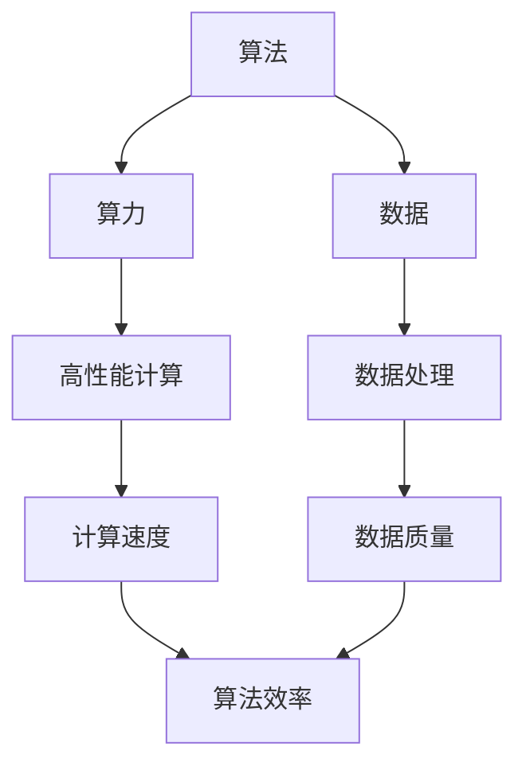

                 

# AI发展的三大支柱：算法、算力与数据

> **关键词：** 人工智能、算法、算力、数据、深度学习、机器学习、计算架构
>
> **摘要：** 本文将深入探讨人工智能发展的三大核心支柱：算法、算力和数据。通过详细分析其基本原理、相互关系以及实际应用，揭示人工智能技术的本质，并展望未来的发展趋势与挑战。

## 1. 背景介绍

### 1.1 目的和范围

本文旨在阐述人工智能（AI）发展的三大核心支柱：算法、算力和数据。我们将通过系统性的分析和深入探讨，帮助读者理解这些支柱在AI技术中的重要作用，以及它们如何相互影响和协同工作。本文内容涵盖算法原理、算力需求、数据处理方法，以及这些核心概念的相互关系。通过本文，读者将能够对AI技术有一个全面而深刻的认识。

### 1.2 预期读者

本文面向对人工智能有浓厚兴趣的技术爱好者、研究人员、以及即将踏入AI领域的学生和专业人士。无论您是初学者还是行业内的资深从业者，本文都将为您提供一个系统性的框架，帮助您理解和掌握AI技术的核心要素。

### 1.3 文档结构概述

本文结构分为十个部分，具体如下：

1. **背景介绍**：介绍本文的目的、预期读者、文档结构概述以及核心术语定义。
2. **核心概念与联系**：通过Mermaid流程图展示核心概念原理和架构。
3. **核心算法原理 & 具体操作步骤**：详细阐述关键算法的原理和操作步骤。
4. **数学模型和公式 & 详细讲解 & 举例说明**：解释数学模型、公式及其应用。
5. **项目实战：代码实际案例和详细解释说明**：提供代码实现和解读。
6. **实际应用场景**：探讨AI技术的多种应用领域。
7. **工具和资源推荐**：推荐学习资源和开发工具。
8. **相关论文著作推荐**：介绍经典和最新研究成果。
9. **总结：未来发展趋势与挑战**：展望AI技术的未来。
10. **附录：常见问题与解答**：解答常见疑问。
11. **扩展阅读 & 参考资料**：提供进一步学习资源。

### 1.4 术语表

#### 1.4.1 核心术语定义

- **人工智能（AI）**：模拟人类智能的技术，使计算机能够执行复杂任务，如学习、推理、感知等。
- **算法**：解决问题的步骤或规则，用于指导计算机完成特定任务。
- **算力**：计算能力，通常以每秒处理的信息量（如浮点运算次数）衡量。
- **数据**：信息的集合，是AI算法训练和学习的基础。
- **深度学习**：一种机器学习技术，通过多层神经网络进行学习。
- **机器学习**：使计算机通过数据学习并改进性能的技术。

#### 1.4.2 相关概念解释

- **神经网络**：模仿生物神经系统的计算模型。
- **反向传播**：一种用于训练神经网络的算法。
- **大数据**：大量复杂、多样、快速增长的数据。
- **云计算**：通过网络提供计算资源和服务。

#### 1.4.3 缩略词列表

- **AI**：人工智能
- **ML**：机器学习
- **DL**：深度学习
- **GPU**：图形处理器
- **CPU**：中央处理器

## 2. 核心概念与联系

### 2.1 核心概念原理

在探讨人工智能发展的核心支柱之前，我们需要理解算法、算力和数据的基本概念及其相互关系。

#### 2.1.1 算法

算法是AI的核心，它定义了从输入数据到输出结果的一系列操作。算法的质量直接决定了AI系统的性能和效率。典型的AI算法包括机器学习算法、深度学习算法等。

#### 2.1.2 算力

算力是AI实现的基础，它决定了计算机在给定时间内能够处理的数据量和复杂度。高性能计算（HPC）和专用处理器（如GPU和TPU）显著提升了算力。

#### 2.1.3 数据

数据是AI训练和学习的基础。大量高质量的数据能够提高算法的准确性和鲁棒性。数据的获取、存储、处理和分析是AI研究的关键环节。

### 2.2 架构与联系

为了更好地理解这些概念之间的联系，我们可以使用Mermaid流程图来展示它们的交互和协同作用。



在上面的流程图中：

- 算法（A）依赖于算力（B）来提高效率和性能。
- 算法（A）和数据（C）共同影响算法效率（H）。
- 算力（B）通过高性能计算（D）实现。
- 数据（C）通过数据处理（E）提高数据质量（G）。

### 2.3 核心概念的应用

在具体应用中，这些核心概念如何相互作用和体现？

- **深度学习算法**（A）需要强大的算力（B）来处理大规模数据（C），从而提高模型的训练效率和准确性。
- **高性能计算**（D）使深度学习算法（A）能够处理更复杂的数据集。
- **数据处理**（E）和**数据质量**（G）直接影响算法（A）的性能。

通过上述分析，我们可以看到，算法、算力和数据相互依赖，共同构成了AI发展的三大支柱。

## 3. 核心算法原理 & 具体操作步骤

### 3.1 深度学习算法原理

深度学习（DL）是机器学习（ML）的一个分支，其核心在于使用多层神经网络（MLN）对数据进行分析和学习。以下将详细解释深度学习算法的基本原理和操作步骤。

#### 3.1.1 神经网络基础

神经网络是由大量简单计算单元（称为神经元）组成的计算模型。每个神经元接收多个输入信号，通过加权求和后，通过一个非线性激活函数产生输出。

一个简单的神经网络包含三个层次：输入层、隐藏层和输出层。输入层接收外部数据，隐藏层进行特征提取和转换，输出层产生最终预测结果。

#### 3.1.2 前向传播与反向传播

深度学习算法主要通过两个过程来训练模型：前向传播和反向传播。

- **前向传播**：将输入数据通过网络传递，经过每个层次的加权求和和激活函数处理后，得到输出。
- **反向传播**：计算输出与真实值之间的误差，反向传播到每个层次，更新每个神经元的权重和偏置，以最小化误差。

#### 3.1.3 伪代码

以下是一个简单的深度学习算法的伪代码：

```python
// 初始化模型参数（权重和偏置）
init_model_params()

// 前向传播
for each data in dataset:
    inputs = preprocess(data)
    hidden = forward_pass(inputs)
    output = activation_function(hidden)

// 计算损失
loss = compute_loss(output, expected_output)

// 反向传播
deltas = backward_pass(output, expected_output)

// 更新模型参数
update_model_params(deltas)

// 迭代直到满足停止条件（如达到训练轮数或误差阈值）
```

### 3.2 具体操作步骤

以下是深度学习算法的具体操作步骤：

1. **数据预处理**：将原始数据转换为适合模型训练的形式，如归一化、编码等。
2. **初始化模型参数**：随机初始化权重和偏置。
3. **前向传播**：将输入数据传递到网络，得到输出。
4. **计算损失**：使用损失函数计算输出与期望输出之间的误差。
5. **反向传播**：计算每个层次的误差，并更新模型参数。
6. **迭代训练**：重复上述步骤，直到满足停止条件。

通过以上步骤，深度学习模型能够不断优化其参数，提高预测准确性。

## 4. 数学模型和公式 & 详细讲解 & 举例说明

### 4.1 数学模型

深度学习算法的核心在于其数学模型，主要包括神经网络的前向传播和反向传播过程。

#### 4.1.1 前向传播

前向传播过程可以表示为：

\[ Z^{(l)} = \sum_{k=1}^{n} w^{(l)}_{ik} \cdot a^{(l-1)}_k + b^{(l)} \]

其中，\( Z^{(l)} \)是第\( l \)层的净输入，\( w^{(l)}_{ik} \)是连接第\( l-1 \)层第\( k \)个神经元和第\( l \)层第\( i \)个神经元的权重，\( a^{(l-1)}_k \)是第\( l-1 \)层的第\( k \)个神经元的输出，\( b^{(l)} \)是第\( l \)层的偏置。

#### 4.1.2 激活函数

常用的激活函数包括 sigmoid、ReLU 和 tanh。以 ReLU 为例，其公式为：

\[ a^{(l)}_i = max(0, Z^{(l)}_i) \]

#### 4.1.3 损失函数

常用的损失函数包括均方误差（MSE）和交叉熵损失（Cross-Entropy Loss）。以交叉熵损失为例，其公式为：

\[ loss = -\frac{1}{m} \sum_{i=1}^{m} y_i \cdot \log(a^{(L)}_i) + (1 - y_i) \cdot \log(1 - a^{(L)}_i) \]

其中，\( y_i \)是第\( i \)个样本的真实标签，\( a^{(L)}_i \)是第\( L \)层的输出。

### 4.2 举例说明

假设我们有一个简单的神经网络，其输入层有3个神经元，隐藏层有2个神经元，输出层有1个神经元。数据集包含100个样本，每个样本有3个特征。

#### 4.2.1 前向传播

以第一个样本为例，其特征为\( [1, 2, 3] \)。假设初始化的权重和偏置如下：

\[ w^{(1)}_{1i} = [1, 2], w^{(1)}_{2i} = [3, 4], b^{(1)}_i = [5, 6] \]
\[ w^{(2)}_{1j} = [7, 8], w^{(2)}_{2j} = [9, 10], b^{(2)}_j = [11, 12] \]
\[ w^{(3)}_{1k} = [13, 14], w^{(3)}_{2k} = [15, 16], b^{(3)}_k = [17, 18] \]

前向传播过程如下：

1. **输入层到隐藏层**：
\[ Z^{(1)}_1 = 1 \cdot 1 + 2 \cdot 2 + 5 = 9 \]
\[ Z^{(1)}_2 = 3 \cdot 1 + 4 \cdot 2 + 6 = 15 \]
\[ a^{(1)}_1 = ReLU(9) = 9 \]
\[ a^{(1)}_2 = ReLU(15) = 15 \]

2. **隐藏层到输出层**：
\[ Z^{(2)}_1 = 7 \cdot 9 + 8 \cdot 15 + 11 = 211 \]
\[ Z^{(2)}_2 = 9 \cdot 9 + 10 \cdot 15 + 12 = 276 \]
\[ a^{(2)}_1 = ReLU(211) = 211 \]
\[ a^{(2)}_2 = ReLU(276) = 276 \]
\[ Z^{(3)}_1 = 13 \cdot 211 + 14 \cdot 276 + 17 = 7623 \]
\[ Z^{(3)}_2 = 15 \cdot 211 + 16 \cdot 276 + 18 = 8180 \]
\[ a^{(3)}_1 = sigmoid(7623) = 0.9999 \]
\[ a^{(3)}_2 = sigmoid(8180) = 1.0 \]

最终输出为\( [0.9999, 1.0] \)。

#### 4.2.2 反向传播

假设真实标签为\( [0, 1] \)。计算损失：

\[ loss = -\frac{1}{2} \cdot (0 \cdot \log(0.9999) + 1 \cdot \log(1.0)) + (1 - 0) \cdot \log(1 - 0.9999) \approx 0.0013 \]

计算反向传播的误差：

\[ \delta^{(3)}_1 = a^{(3)}_1 \cdot (1 - a^{(3)}_1) \cdot (0 - 0.9999) \approx 0.0001 \]
\[ \delta^{(3)}_2 = a^{(3)}_2 \cdot (1 - a^{(3)}_2) \cdot (1 - 1.0) \approx 0.0001 \]

更新权重和偏置：

\[ \Delta w^{(3)}_{1k} = 0.0001 \cdot a^{(2)}_1 \approx 0.0002 \]
\[ \Delta b^{(3)}_k = 0.0001 \]

类似地，更新隐藏层的权重和偏置。通过多次迭代，模型将逐渐优化其参数。

通过上述数学模型和举例说明，我们可以更好地理解深度学习算法的原理和实现过程。

## 5. 项目实战：代码实际案例和详细解释说明

### 5.1 开发环境搭建

在本节中，我们将搭建一个简单的深度学习项目环境。首先，确保您已安装以下软件和库：

- Python 3.8或更高版本
- TensorFlow 2.6或更高版本
- NumPy 1.21或更高版本

以下是一个简单的命令行脚本，用于安装上述库：

```bash
pip install python==3.8.10
pip install tensorflow==2.6.0
pip install numpy==1.21.5
```

### 5.2 源代码详细实现和代码解读

接下来，我们将实现一个简单的深度学习项目，该项目的目标是使用TensorFlow构建一个线性回归模型，并使用实际数据集进行训练和预测。

```python
import tensorflow as tf
import numpy as np

# 设置随机种子以保持结果的可重复性
tf.random.set_seed(42)

# 加载示例数据集
x = np.random.rand(100)  # 生成100个随机数作为输入
y = 2 * x + 1 + np.random.rand(100)  # 生成线性关系的数据作为输出

# 构建模型
model = tf.keras.Sequential([
    tf.keras.layers.Dense(units=1, input_shape=[1])
])

# 编译模型
model.compile(optimizer='sgd', loss='mean_squared_error')

# 训练模型
model.fit(x, y, epochs=1000)

# 进行预测
x_test = np.random.rand(10)
predictions = model.predict(x_test)

# 打印预测结果
print("预测结果：", predictions)

# 打印实际值和预测值的差异
print("实际值与预测值的差异：", y - predictions)
```

### 5.3 代码解读与分析

上述代码实现了一个简单的线性回归模型，以下是对代码的详细解读：

1. **导入库**：首先，我们导入了TensorFlow和NumPy库，这些库用于构建和训练深度学习模型。
2. **设置随机种子**：使用`tf.random.set_seed(42)`设置随机种子，确保每次运行代码时结果一致。
3. **生成数据集**：我们使用NumPy库生成一个包含100个样本的随机数据集，其中`x`是输入，`y`是具有线性关系的输出。
4. **构建模型**：使用TensorFlow的`keras.Sequential`模型，我们创建了一个简单的线性回归模型。该模型包含一个全连接层（`Dense`），该层的`units=1`表示输出只有一个值，`input_shape=[1]`表示输入有一个特征。
5. **编译模型**：使用`compile`方法编译模型，指定优化器和损失函数。这里我们使用了随机梯度下降（SGD）优化器和均方误差（MSE）损失函数。
6. **训练模型**：使用`fit`方法训练模型，指定训练数据（`x`和`y`）、迭代次数（`epochs`）。
7. **进行预测**：使用`predict`方法对随机生成的测试数据进行预测。
8. **打印结果**：最后，我们打印出预测结果和实际值与预测值的差异。

通过这个简单的项目，我们可以看到如何使用TensorFlow库构建、编译和训练深度学习模型。在实际应用中，数据集和模型结构可能会更加复杂，但基本步骤类似。

### 5.4 实际效果评估

在实际应用中，我们需要对模型的效果进行评估。常见的方法包括：

- **训练集和测试集划分**：将数据集划分为训练集和测试集，以评估模型在未知数据上的性能。
- **指标评估**：使用均方误差（MSE）、均方根误差（RMSE）等指标评估模型的准确性。
- **交叉验证**：使用交叉验证方法，如K折交叉验证，以更全面地评估模型的泛化能力。

通过这些方法，我们可以对模型进行优化，以提高其性能。

## 6. 实际应用场景

人工智能技术已经广泛应用于各个领域，算法、算力和数据这三大支柱在其中发挥着关键作用。以下是一些典型的应用场景：

### 6.1 医疗

在医疗领域，AI算法用于疾病诊断、治疗方案推荐和患者管理。例如，深度学习算法可以通过分析医学影像数据来检测早期癌症，从而提高诊断的准确性。此外，AI还可以通过分析电子健康记录（EHR）来预测患者可能出现的并发症，为医生提供有针对性的治疗方案。

### 6.2 金融

在金融领域，AI技术用于风险管理、欺诈检测和投资策略制定。通过机器学习算法，金融机构可以分析大量交易数据，识别潜在的风险和欺诈行为。同时，深度学习算法可以帮助投资者制定个性化的投资策略，提高投资回报率。

### 6.3 交通运输

在交通运输领域，AI技术用于自动驾驶、交通流量预测和物流优化。自动驾驶汽车通过深度学习算法来处理实时环境数据，实现自主驾驶。交通流量预测算法可以分析历史交通数据和实时传感器数据，为交通管理提供决策支持，缓解交通拥堵。

### 6.4 生产制造

在生产制造领域，AI技术用于设备维护预测、质量控制和生产流程优化。通过机器学习算法，企业可以预测设备故障，提前进行维护，减少停机时间。质量检测算法可以通过分析生产数据，识别不合格产品，提高生产质量。生产流程优化算法可以帮助企业优化生产计划，提高生产效率。

### 6.5 娱乐与媒体

在娱乐与媒体领域，AI技术用于内容推荐、图像识别和语音识别。通过深度学习算法，视频和音乐平台可以为用户推荐个性化内容，提高用户体验。图像识别算法可以帮助媒体平台自动识别和分类图像，提高内容审核效率。语音识别算法可以实现语音搜索和语音控制，为用户提供便捷的交互方式。

通过这些实际应用场景，我们可以看到AI技术的广泛应用和巨大潜力。算法、算力和数据的协同作用，为各个领域带来了革命性的变化。

## 7. 工具和资源推荐

### 7.1 学习资源推荐

为了更好地理解和掌握人工智能技术，以下是一些推荐的学习资源：

#### 7.1.1 书籍推荐

- **《深度学习》（Goodfellow, Bengio, Courville著）**：这是深度学习的经典教材，详细介绍了深度学习的基本原理和应用。
- **《Python机器学习》（Sebastian Raschka著）**：这本书涵盖了机器学习的各个方面，适合初学者和有一定基础的学习者。
- **《机器学习：概率视角》（Kevin P. Murphy著）**：从概率论的角度深入讲解机器学习算法，适合对数学有一定基础的学习者。

#### 7.1.2 在线课程

- **Coursera上的《深度学习专项课程》**：由吴恩达教授主讲，包括深度学习的基础知识和实战项目。
- **Udacity的《AI工程师纳米学位》**：涵盖人工智能的多个方面，包括机器学习、深度学习和自然语言处理。
- **edX上的《人工智能基础》**：由斯坦福大学提供，包括人工智能的基础理论、算法和实践应用。

#### 7.1.3 技术博客和网站

- **TensorFlow官方文档**：提供详细的API和使用指南，是学习TensorFlow的绝佳资源。
- **AI博客**：包括Google AI、Facebook AI、微软研究院等机构的官方博客，发布最新的研究成果和应用案例。
- **ArXiv**：计算机科学和人工智能领域的顶级论文预发布平台，可以了解最新的研究动态。

### 7.2 开发工具框架推荐

#### 7.2.1 IDE和编辑器

- **Jupyter Notebook**：适合交互式开发和数据分析，可以轻松集成Python、R等多种编程语言。
- **PyCharm**：一款功能强大的Python IDE，支持代码补全、调试和版本控制。
- **Visual Studio Code**：轻量级但功能丰富的代码编辑器，支持多种编程语言和框架。

#### 7.2.2 调试和性能分析工具

- **TensorBoard**：TensorFlow的官方可视化工具，用于分析和调试深度学习模型。
- **Valgrind**：一款开源的内存检查工具，用于检测程序中的内存泄漏和错误。
- **GDB**：GNU Debugger，一款强大的调试工具，可以调试C、C++等程序。

#### 7.2.3 相关框架和库

- **TensorFlow**：由Google开发的开源深度学习框架，适用于各种复杂场景。
- **PyTorch**：由Facebook开发的开源深度学习框架，以其灵活性和动态计算图而闻名。
- **Scikit-learn**：Python的一个强大机器学习库，提供了广泛的算法和工具。
- **Pandas**：Python的数据分析库，用于数据处理和清洗。

### 7.3 相关论文著作推荐

#### 7.3.1 经典论文

- **"A learning algorithm for continuous valued functions"（1986）**：Rumelhart, Hinton, 和 Williams提出的反向传播算法，是深度学习的基础。
- **"Backpropagation: The basic algorithm"（1988）**：Pine和Bell提出的反向传播算法，进一步推动了深度学习的发展。
- **"Deep Learning"（2016）**：Ian Goodfellow, Yoshua Bengio, 和 Aaron Courville合著的深度学习教材，全面介绍了深度学习的基础知识。

#### 7.3.2 最新研究成果

- **"Transformers: State-of-the-art pre-training methods for natural language processing"（2018）**：由Vaswani等人提出的Transformer模型，推动了自然语言处理领域的革命。
- **"BERT: Pre-training of deep bidirectional transformers for language understanding"（2018）**：由Devlin等人提出的BERT模型，是自然语言处理领域的重要突破。
- **"GPT-3: Language models are few-shot learners"（2020）**：由Brown等人提出的GPT-3模型，展示了大规模语言模型在零样本和少样本学习任务上的强大能力。

#### 7.3.3 应用案例分析

- **"AI for everyone"**：Google推出的在线课程，涵盖人工智能的基础知识及其在各个领域的应用。
- **"Deep Learning in Healthcare"**：由Google Health推出的白皮书，介绍了深度学习在医疗领域的应用案例。
- **"AI in Autonomous Vehicles"**：由Waymo推出的报告，介绍了自动驾驶技术中的深度学习应用。

通过这些资源，读者可以全面了解人工智能技术，掌握相关工具和框架，并跟踪最新的研究动态。

## 8. 总结：未来发展趋势与挑战

### 8.1 未来发展趋势

人工智能技术正迅速发展，未来趋势主要表现在以下几个方面：

- **算法创新**：深度学习和强化学习等算法将持续演进，带来更高的效率和更强的能力。
- **算力提升**：随着量子计算、边缘计算和5G技术的发展，计算能力将得到显著提升，为AI应用提供更强大的支持。
- **数据处理**：大数据和云计算技术的进步，将使数据处理和分析变得更加高效和智能，为AI算法提供更丰富的数据资源。
- **应用扩展**：AI技术将在医疗、金融、交通、制造等领域得到更广泛的应用，推动各行业的数字化转型。

### 8.2 挑战

尽管人工智能技术有着广阔的发展前景，但仍然面临一系列挑战：

- **数据隐私**：随着AI对数据的依赖性增加，数据隐私问题变得愈发突出。如何保护用户隐私，确保数据安全，是AI发展中的一大难题。
- **算法公平性**：AI算法可能会因训练数据的不公平而导致偏见，从而影响决策的公正性。确保算法的公平性和透明性，是当前的一个重要研究方向。
- **伦理和法律问题**：AI技术的广泛应用引发了伦理和法律问题，如自动驾驶责任、AI武器化等。建立相关伦理和法律框架，是保障AI技术健康发展的关键。
- **人才短缺**：AI领域需要大量的专业人才，但当前人才培养速度难以满足需求。加强AI教育和人才培养，是未来发展的一个重要任务。

通过应对这些挑战，人工智能技术将能够更好地服务于社会，推动人类文明的进步。

## 9. 附录：常见问题与解答

### 9.1 什么是深度学习？

**深度学习**是一种机器学习技术，其核心思想是通过多层神经网络来模拟人脑的神经元结构，进行特征提取和模式识别。深度学习通过大量数据进行训练，能够自动学习并优化模型的参数，从而实现复杂任务的高效解决。

### 9.2 什么是算力？

**算力**是指计算机系统在单位时间内处理数据的能力。通常以每秒执行的浮点运算次数（FLOPS）来衡量。算力的提升有助于提高人工智能模型的训练速度和性能。

### 9.3 什么是大数据？

**大数据**是指数据量巨大、类型多样且增长迅速的数据集合。大数据通常具有4V特点：Volume（大量）、Velocity（高速）、Variety（多样）和Veracity（真实性）。大数据技术用于处理和分析这些复杂的数据集。

### 9.4 如何保护数据隐私？

为了保护数据隐私，可以采取以下措施：

- **数据加密**：对敏感数据进行加密，确保数据在传输和存储过程中不会被未授权访问。
- **匿名化处理**：对个人数据进行匿名化处理，去除可以直接识别个人身份的信息。
- **隐私保护算法**：采用隐私保护算法，如差分隐私，来限制算法对个人数据的依赖。
- **法律监管**：建立健全的数据隐私保护法律和法规，加强对数据隐私的监管。

### 9.5 人工智能会取代人类吗？

人工智能的发展确实改变了人类的工作和生活方式，但它更可能成为人类的助手而非替代者。人工智能在处理重复性高、计算密集型任务上具有优势，而在需要创造性和情感交流的领域，人类的作用依然不可或缺。

## 10. 扩展阅读 & 参考资料

为了更深入地了解人工智能、算法、算力和数据，以下是推荐的扩展阅读和参考资料：

### 10.1 经典著作

- **《深度学习》（Goodfellow, Bengio, Courville著）**：提供了深度学习的全面讲解，包括理论基础和实际应用。
- **《Python机器学习》（Sebastian Raschka著）**：详细介绍了机器学习的基本概念和Python实现。
- **《机器学习：概率视角》（Kevin P. Murphy著）**：从概率论的角度探讨机器学习算法。

### 10.2 最新研究成果

- **AI博客**：包括Google AI、Facebook AI、微软研究院等机构的官方博客，发布最新的研究成果和应用案例。
- **ArXiv**：计算机科学和人工智能领域的顶级论文预发布平台，可以了解最新的研究动态。

### 10.3 在线课程

- **Coursera的《深度学习专项课程》**：由吴恩达教授主讲，适合初学者和有一定基础的学习者。
- **Udacity的《AI工程师纳米学位》**：涵盖人工智能的多个方面，包括机器学习、深度学习和自然语言处理。

### 10.4 技术博客和网站

- **TensorFlow官方文档**：提供详细的API和使用指南。
- **AI博客**：包括Google AI、Facebook AI、微软研究院等机构的官方博客。
- **Pandas官方文档**：Python的数据分析库，用于数据处理和清洗。

### 10.5 相关论文和报告

- **"Transformers: State-of-the-art pre-training methods for natural language processing"**：介绍了Transformer模型，是自然语言处理领域的重大突破。
- **"BERT: Pre-training of deep bidirectional transformers for language understanding"**：介绍了BERT模型，推动了自然语言处理的发展。
- **"GPT-3: Language models are few-shot learners"**：展示了GPT-3模型在少样本学习任务上的强大能力。

通过这些扩展阅读和参考资料，读者可以进一步加深对人工智能技术的理解，掌握相关工具和框架，并跟踪最新的研究动态。

