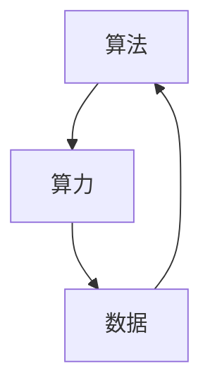

                 

# AI发展的三大支柱：算法、算力与数据

> **关键词：**人工智能，算法，算力，数据，深度学习，神经网络，机器学习，计算能力，数据处理。

> **摘要：**本文将深入探讨人工智能发展的三大支柱：算法、算力与数据。我们将从基础概念出发，逐步分析这些支柱在人工智能中的重要性、相互关系及其发展趋势，旨在为读者提供一个全面而清晰的视角。

## 1. 背景介绍

### 1.1 目的和范围

本文旨在梳理和分析人工智能发展的三大关键因素：算法、算力与数据。我们将探讨这些因素的内涵、相互关系以及它们在人工智能应用中的具体体现。

### 1.2 预期读者

本文适合对人工智能有一定了解的读者，包括计算机科学家、工程师、研究人员以及对此领域感兴趣的学者和学生。

### 1.3 文档结构概述

本文分为十个主要部分：

1. **背景介绍**：介绍文章的目的、范围、预期读者和文档结构。
2. **核心概念与联系**：阐述算法、算力与数据的基本概念及其关系。
3. **核心算法原理 & 具体操作步骤**：介绍人工智能中的核心算法及其工作原理。
4. **数学模型和公式 & 详细讲解 & 举例说明**：讨论数学模型在人工智能中的应用。
5. **项目实战：代码实际案例和详细解释说明**：通过具体代码案例展示人工智能的实际应用。
6. **实际应用场景**：分析人工智能在不同领域的应用。
7. **工具和资源推荐**：推荐学习资源和开发工具。
8. **总结：未来发展趋势与挑战**：预测人工智能的未来发展趋势和面临的挑战。
9. **附录：常见问题与解答**：回答读者可能关心的问题。
10. **扩展阅读 & 参考资料**：提供进一步阅读的参考资料。

### 1.4 术语表

#### 1.4.1 核心术语定义

- **算法**：解决问题的步骤或规则。
- **算力**：计算机处理数据的能力。
- **数据**：用来训练和优化算法的信息。

#### 1.4.2 相关概念解释

- **机器学习**：使计算机能够从数据中学习并作出决策或预测的方法。
- **深度学习**：一种利用多层神经网络进行学习的机器学习技术。
- **神经网络**：由大量简单单元（神经元）组成，能够模拟人脑信息处理过程的计算模型。

#### 1.4.3 缩略词列表

- **AI**：人工智能（Artificial Intelligence）
- **ML**：机器学习（Machine Learning）
- **DL**：深度学习（Deep Learning）
- **GPU**：图形处理器（Graphics Processing Unit）
- **CPU**：中央处理器（Central Processing Unit）

## 2. 核心概念与联系

在人工智能领域，算法、算力和数据是三大核心概念。它们之间紧密联系，共同推动人工智能的发展。

### 2.1 算法

算法是人工智能的核心，它决定了人工智能系统能够解决什么样的问题。从简单的规则系统到复杂的深度学习模型，算法在不断进化，以应对更加复杂的任务。算法的优劣直接影响人工智能系统的性能和效率。

### 2.2 算力

算力是人工智能系统运行的基础，它决定了算法能否高效地执行。随着计算机硬件的发展，特别是GPU和TPU等专用处理器的出现，算力得到了极大的提升，使得深度学习等复杂算法能够得到有效执行。

### 2.3 数据

数据是人工智能系统的学习素材。丰富的、高质量的数据可以提升算法的准确性和泛化能力。数据的获取、存储、处理和传输是人工智能发展的重要挑战。

### 2.4 算法、算力与数据的相互关系

算法、算力和数据相互依存，共同推动人工智能的发展。算法需要算力来高效执行，而算力的发展又推动了更复杂算法的出现。数据是算法训练的基础，高质量的算法和算力能够更好地处理数据，提升系统的性能。

### 2.5 Mermaid 流程图

以下是一个简单的 Mermaid 流程图，展示了算法、算力和数据之间的相互关系。



## 3. 核心算法原理 & 具体操作步骤

在人工智能领域，核心算法包括机器学习和深度学习。这些算法通过特定步骤来训练模型，以解决实际问题。

### 3.1 机器学习算法

**步骤 1：数据收集**  
首先，需要收集大量的训练数据。这些数据可以来自公开数据集、企业内部数据或网络爬虫。

**步骤 2：数据预处理**  
对收集到的数据执行清洗、归一化和特征提取等操作，以提高数据质量。

**步骤 3：模型选择**  
根据问题的性质选择合适的模型。常见的机器学习模型包括线性回归、决策树、支持向量机等。

**步骤 4：模型训练**  
使用训练数据对选定的模型进行训练，通过调整模型参数来优化性能。

**步骤 5：模型评估**  
使用验证数据集对训练好的模型进行评估，以确定模型的泛化能力。

**步骤 6：模型部署**  
将训练好的模型部署到生产环境中，用于实际问题的解决。

### 3.2 深度学习算法

**步骤 1：数据收集**  
与机器学习类似，首先需要收集大量的训练数据。

**步骤 2：数据预处理**  
对训练数据进行预处理，包括归一化和特征提取。

**步骤 3：模型架构设计**  
设计深度学习模型的架构，包括选择合适的神经网络结构。

**步骤 4：模型训练**  
使用训练数据对深度学习模型进行训练，通过反向传播算法调整模型参数。

**步骤 5：模型评估**  
使用验证数据集对训练好的模型进行评估。

**步骤 6：模型优化**  
根据评估结果对模型进行优化，以提高性能。

**步骤 7：模型部署**  
将优化后的模型部署到生产环境中。

### 3.3 伪代码示例

以下是一个简单的线性回归算法的伪代码示例。

```python
# 线性回归算法伪代码

# 步骤 1：数据收集
X_train, y_train = 数据收集()

# 步骤 2：数据预处理
X_train = 数据清洗(X_train)
y_train = 数据清洗(y_train)

# 步骤 3：模型选择
model = 线性回归()

# 步骤 4：模型训练
model.fit(X_train, y_train)

# 步骤 5：模型评估
score = model.score(X_train, y_train)

# 步骤 6：模型部署
模型部署(model)
```

## 4. 数学模型和公式 & 详细讲解 & 举例说明

在人工智能领域，数学模型是算法的核心。以下我们将介绍一些常见的数学模型，并使用LaTeX格式详细讲解。

### 4.1 线性回归模型

线性回归模型是最简单的机器学习模型之一，其数学模型可以表示为：

$$
y = \beta_0 + \beta_1 x + \epsilon
$$

其中，$y$ 是目标变量，$x$ 是输入变量，$\beta_0$ 和 $\beta_1$ 是模型参数，$\epsilon$ 是误差项。

**例子：**假设我们要预测房价，输入变量是房屋面积（$x$），目标变量是房价（$y$）。通过收集大量房屋面积和房价的数据，我们可以使用线性回归模型来预测未知房屋的房价。

### 4.2 深度学习中的反向传播算法

深度学习模型通常包含多层神经元，反向传播算法用于计算和更新模型参数。其核心公式为：

$$
\frac{\partial E}{\partial \theta} = \frac{\partial E}{\partial z} \cdot \frac{\partial z}{\partial \theta}
$$

其中，$E$ 是损失函数，$\theta$ 是模型参数，$z$ 是中间层神经元的输出。

**例子：**假设我们有一个两层神经网络，输入层和输出层之间的损失函数为均方误差（MSE）。通过反向传播算法，我们可以计算每个参数的梯度，从而更新参数，以降低损失函数的值。

### 4.3 支持向量机（SVM）模型

支持向量机是一种常见的分类模型，其数学模型可以表示为：

$$
w \cdot x + b = 0
$$

其中，$w$ 是权重向量，$x$ 是输入向量，$b$ 是偏置。

**例子：**假设我们要分类手写数字图像，输入向量是图像的特征向量，目标变量是数字标签。通过训练支持向量机模型，我们可以找到一个最优的决策边界，以正确分类图像。

## 5. 项目实战：代码实际案例和详细解释说明

在本节中，我们将通过一个简单的深度学习项目来展示如何使用算法、算力和数据。我们将使用Python和TensorFlow来实现一个简单的图像分类器。

### 5.1 开发环境搭建

首先，我们需要搭建开发环境。以下是在Ubuntu 18.04上安装TensorFlow所需的步骤：

```bash
# 更新系统软件包
sudo apt update && sudo apt upgrade

# 安装Python 3和pip
sudo apt install python3 python3-pip

# 安装TensorFlow
pip3 install tensorflow
```

### 5.2 源代码详细实现和代码解读

以下是一个简单的CNN图像分类器的代码示例。

```python
import tensorflow as tf
from tensorflow.keras import datasets, layers, models

# 加载数据集
(train_images, train_labels), (test_images, test_labels) = datasets.cifar10.load_data()

# 预处理数据
train_images, test_images = train_images / 255.0, test_images / 255.0

# 构建模型
model = models.Sequential()
model.add(layers.Conv2D(32, (3, 3), activation='relu', input_shape=(32, 32, 3)))
model.add(layers.MaxPooling2D((2, 2)))
model.add(layers.Conv2D(64, (3, 3), activation='relu'))
model.add(layers.MaxPooling2D((2, 2)))
model.add(layers.Conv2D(64, (3, 3), activation='relu'))
model.add(layers.Flatten())
model.add(layers.Dense(64, activation='relu'))
model.add(layers.Dense(10))

# 编译模型
model.compile(optimizer='adam',
              loss=tf.keras.losses.SparseCategoricalCrossentropy(from_logits=True),
              metrics=['accuracy'])

# 训练模型
model.fit(train_images, train_labels, epochs=10, validation_data=(test_images, test_labels))

# 评估模型
test_loss, test_acc = model.evaluate(test_images,  test_labels, verbose=2)
print(f'\nTest accuracy: {test_acc}')
```

### 5.3 代码解读与分析

这段代码实现了一个简单的卷积神经网络（CNN）图像分类器。下面是代码的详细解读：

- **数据加载**：我们使用TensorFlow内置的CIFAR-10数据集，它包含了60000个32x32的彩色图像，分为10个类别。
- **数据预处理**：我们将图像的像素值归一化到0到1之间，以适应模型训练。
- **模型构建**：我们使用TensorFlow的`Sequential`模型，依次添加卷积层、池化层和全连接层。卷积层用于提取图像特征，池化层用于降采样，全连接层用于分类。
- **模型编译**：我们指定使用`adam`优化器和`SparseCategoricalCrossentropy`损失函数，并设置评估指标为准确率。
- **模型训练**：我们使用训练数据训练模型10个周期，并使用测试数据验证模型性能。
- **模型评估**：我们使用测试数据评估模型的准确率。

通过这个简单的项目，我们可以看到如何将算法、算力和数据结合起来，实现一个基本的深度学习模型。

## 6. 实际应用场景

人工智能在各个领域都有广泛的应用，以下列举一些典型的实际应用场景：

### 6.1 医疗健康

- **疾病诊断**：使用深度学习模型分析医学影像，如X光、CT和MRI，帮助医生诊断疾病。
- **药物研发**：通过模拟和预测药物分子与生物大分子的相互作用，加速新药的发现。
- **健康管理**：使用人工智能分析个人健康数据，提供个性化的健康建议和预防措施。

### 6.2 金融服务

- **风险控制**：使用机器学习算法预测金融市场波动，帮助金融机构控制风险。
- **信用评估**：通过分析个人信用历史和行为数据，评估客户的信用等级。
- **智能投顾**：利用人工智能为投资者提供个性化的投资建议。

### 6.3 智能制造

- **质量控制**：使用计算机视觉技术实时检测生产线上的缺陷产品。
- **生产调度**：通过优化算法优化生产流程，提高生产效率。
- **设备维护**：利用预测性维护技术，预测设备故障，减少停机时间。

### 6.4 自动驾驶

- **环境感知**：使用传感器和数据融合技术，实时感知车辆周围环境。
- **路径规划**：通过规划算法确定车辆的行驶路径，避免碰撞和拥堵。
- **决策控制**：结合传感器数据和路径规划结果，控制车辆的加速、制动和转向。

### 6.5 娱乐与媒体

- **内容推荐**：使用推荐系统为用户提供个性化的内容推荐。
- **图像和视频处理**：通过计算机视觉技术实现图像和视频的增强、修复和特效。
- **自然语言处理**：利用自然语言处理技术实现智能客服、语音识别和机器翻译。

## 7. 工具和资源推荐

### 7.1 学习资源推荐

#### 7.1.1 书籍推荐

- **《深度学习》（Goodfellow, Bengio, Courville）**：深度学习的经典教材，适合初学者和高级读者。
- **《Python机器学习》（Sebastian Raschka）**：介绍Python在机器学习领域的应用，包括算法实现和实际应用。
- **《机器学习实战》（Peter Harrington）**：通过大量实例介绍机器学习算法的原理和应用。

#### 7.1.2 在线课程

- **Coursera上的《机器学习》（吴恩达）**：一门著名的在线课程，适合初学者入门。
- **Udacity的《深度学习纳米学位》**：提供系统的深度学习知识体系，适合有一定基础的读者。
- **edX上的《人工智能导论》（斯坦福大学）**：由斯坦福大学提供，涵盖人工智能的基础和前沿。

#### 7.1.3 技术博客和网站

- **Medium上的`/ai`类别**：收集了大量的人工智能相关文章，适合学习和了解最新的技术动态。
- **ArXiv.org**：提供最新的科研论文，涵盖人工智能的各个分支。
- **Medium上的`/data-science`和`/machine-learning`类别**：类似于`/ai`类别，但更专注于数据科学和机器学习。

### 7.2 开发工具框架推荐

#### 7.2.1 IDE和编辑器

- **Jupyter Notebook**：强大的交互式开发环境，适合数据分析和原型设计。
- **PyCharm**：功能丰富的Python IDE，适合开发和调试代码。
- **Visual Studio Code**：轻量级的代码编辑器，适合快速开发和调试。

#### 7.2.2 调试和性能分析工具

- **TensorBoard**：TensorFlow提供的可视化工具，用于分析和优化模型性能。
- **Docker**：容器化技术，用于开发和部署应用程序。
- **Jenkins**：持续集成工具，用于自动化构建和部署应用程序。

#### 7.2.3 相关框架和库

- **TensorFlow**：谷歌开发的深度学习框架，广泛用于研究和生产。
- **PyTorch**：Facebook开发的深度学习框架，以其灵活的动态计算图著称。
- **Scikit-learn**：Python机器学习库，提供丰富的算法和工具。

### 7.3 相关论文著作推荐

#### 7.3.1 经典论文

- **“A Learning Algorithm for Continually Running Fully Recurrent Neural Networks”（1986）**：Humphrey N. Nickolls等人提出的学习算法，对深度学习的发展产生了深远影响。
- **“Gradient-Based Learning Applied to Document Recognition”（1989）**：Yann LeCun等人提出的卷积神经网络，是图像识别领域的里程碑。
- **“Deep Learning”（2015）**：Ian Goodfellow、Yoshua Bengio和Aaron Courville合著的书籍，全面介绍了深度学习的原理和应用。

#### 7.3.2 最新研究成果

- **“Attention Is All You Need”（2017）**：Vaswani等人提出的Transformer模型，彻底改变了自然语言处理领域。
- **“BERT: Pre-training of Deep Neural Networks for Language Understanding”（2018）**：Google提出的BERT模型，推动了自然语言处理的发展。
- **“Gshard: Scaling Giant Neural Networks using Universal Linear Units, Multi-head Attention, and Mixed Precision”（2019）**：Google提出的Gshard技术，通过混合精度训练大型神经网络。

#### 7.3.3 应用案例分析

- **“BERT for Sentiment Analysis”（2019）**：Google使用BERT模型进行情感分析，取得了显著效果。
- **“Robust BERT: A Consistency-based Approach to Improve Pre-trained Language Representations”（2020）**：微软研究团队通过一致性技术提高BERT模型的鲁棒性。
- **“ERNIE 3.0: Knowledge Enhanced General Pre-Trained Language Model”（2021）**：百度提出的ERNIE 3.0模型，结合知识图谱增强语言模型。

## 8. 总结：未来发展趋势与挑战

随着人工智能技术的不断进步，算法、算力和数据三大支柱将继续发挥关键作用。以下是未来人工智能发展的一些趋势和挑战：

### 8.1 发展趋势

1. **算法创新**：深度学习和其他先进算法将继续推动人工智能的发展，特别是在自然语言处理、计算机视觉和强化学习等领域。
2. **算力提升**：随着GPU、TPU和其他专用处理器的不断发展，算力将持续提升，使得更复杂的算法能够得到有效执行。
3. **数据治理**：随着数据量的爆炸性增长，如何有效地收集、存储、处理和利用数据将成为重要挑战。数据治理、隐私保护和数据安全将是未来研究的重要方向。
4. **跨学科融合**：人工智能与其他学科（如生物学、心理学、经济学等）的交叉融合，将推动人工智能的全面发展和应用。

### 8.2 挑战

1. **算法透明性和可解释性**：随着人工智能系统的复杂度增加，如何确保算法的透明性和可解释性，使其对人类用户更加友好，是一个亟待解决的问题。
2. **计算资源分配**：在分布式计算环境中，如何优化计算资源的分配，提高整体系统效率，是一个重要的挑战。
3. **隐私和安全**：随着人工智能系统的广泛应用，如何确保用户隐私和数据安全，防止数据泄露和滥用，是一个关键问题。
4. **伦理和责任**：人工智能系统的决策过程和结果可能涉及伦理和道德问题，如何确保系统的公正性和社会责任，是一个重要挑战。

## 9. 附录：常见问题与解答

### 9.1 什么是人工智能？

人工智能（AI）是指模拟人类智能行为的计算机系统。它包括机器学习、深度学习、自然语言处理、计算机视觉等领域。

### 9.2 算法和算法有哪些类型？

算法是一系列解决问题的步骤或规则。常见的算法类型包括排序算法、搜索算法、机器学习算法和深度学习算法。

### 9.3 算力和算力有哪些衡量指标？

算力是计算机处理数据的能力。常见的算力衡量指标包括CPU主频、内存容量、硬盘速度和GPU性能。

### 9.4 数据在人工智能中的重要性是什么？

数据是人工智能系统的学习素材。高质量的数据可以提升算法的准确性和泛化能力，是实现人工智能应用的基础。

## 10. 扩展阅读 & 参考资料

- **《深度学习》（Goodfellow, Bengio, Courville）**：https://www.deeplearningbook.org/
- **《Python机器学习》（Sebastian Raschka）**：https://python-machine-learning-book.com/
- **《机器学习实战》（Peter Harrington）**：https://www.manning.com/books/machine-learning-in-action
- **Coursera的《机器学习》（吴恩达）**：https://www.coursera.org/learn/machine-learning
- **Udacity的《深度学习纳米学位》**：https://www.udacity.com/course/deep-learning-nanodegree--nd118
- **edX的《人工智能导论》（斯坦福大学）**：https://www.edx.org/course/introduction-to-artificial-intelligence
- **TensorFlow官方文档**：https://www.tensorflow.org/tutorials
- **PyTorch官方文档**：https://pytorch.org/tutorials/beginner/basics.htm
- **Scikit-learn官方文档**：https://scikit-learn.org/stable/tutorial/index.html
- **ArXiv.org**：https://arxiv.org/
- **Medium上的`/ai`类别**：https://medium.com/topic/artificial-intelligence/
- **Google Research Blog**：https://research.googleblog.com/
- **AI Papers**：https://ai-papers.com/

