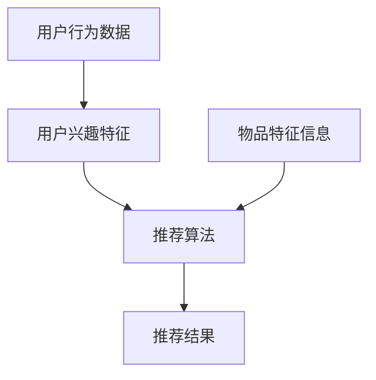

                 

# AI在个性化推荐中的创新应用

> 关键词：个性化推荐、人工智能、机器学习、深度学习、算法优化

> 摘要：本文旨在探讨AI在个性化推荐系统中的应用与创新，通过对核心概念、算法原理、数学模型及项目实战的详细分析，为读者呈现个性化推荐系统的最新技术进展与应用前景。

## 1. 背景介绍

### 1.1 目的和范围

本文旨在深入探讨人工智能（AI）在个性化推荐系统中的应用，分析其中的核心概念、算法原理、数学模型及实际应用案例。通过本文的阅读，读者可以全面了解个性化推荐系统的现状及未来发展方向。

### 1.2 预期读者

本文适合以下读者群体：

- 对AI和机器学习感兴趣的初学者和专业人士；
- 从事个性化推荐系统开发的技术人员；
- 对AI在商业和社交网络中应用感兴趣的爱好者。

### 1.3 文档结构概述

本文结构如下：

- 第1章：背景介绍，包括目的和范围、预期读者、文档结构概述；
- 第2章：核心概念与联系，介绍个性化推荐系统的基础概念及架构；
- 第3章：核心算法原理 & 具体操作步骤，详细阐述推荐算法的原理及实现步骤；
- 第4章：数学模型和公式 & 详细讲解 & 举例说明，介绍推荐系统中的数学模型及其应用；
- 第5章：项目实战：代码实际案例和详细解释说明，通过实际项目案例展示算法的应用；
- 第6章：实际应用场景，分析个性化推荐系统在不同领域的应用；
- 第7章：工具和资源推荐，介绍相关学习资源、开发工具和框架；
- 第8章：总结：未来发展趋势与挑战，探讨个性化推荐系统的未来发展；
- 第9章：附录：常见问题与解答，解答读者可能遇到的问题；
- 第10章：扩展阅读 & 参考资料，提供进一步阅读的资料。

### 1.4 术语表

#### 1.4.1 核心术语定义

- 个性化推荐：根据用户的历史行为、兴趣偏好等信息，为用户推荐其可能感兴趣的内容或商品；
- 机器学习：一种人工智能技术，通过从数据中学习规律，实现预测和决策；
- 深度学习：一种特殊的机器学习技术，通过多层神经网络实现数据的自动特征提取和模型训练；
- 推荐算法：用于实现个性化推荐的算法，包括协同过滤、基于内容的推荐等；
- 用户行为：用户在系统中的浏览、点击、购买等行为数据。

#### 1.4.2 相关概念解释

- 协同过滤：一种基于用户行为数据的推荐算法，通过计算用户之间的相似度，为用户推荐相似用户喜欢的内容；
- 基于内容的推荐：一种基于物品特征信息的推荐算法，通过比较用户兴趣特征和物品特征，为用户推荐与其兴趣相关的物品；
- 冷启动：指新用户或新物品在系统中没有足够的历史数据，难以进行有效推荐的问题。

#### 1.4.3 缩略词列表

- AI：人工智能；
- ML：机器学习；
- DL：深度学习；
- CF：协同过滤；
- CBR：基于内容的推荐。

## 2. 核心概念与联系

在个性化推荐系统中，核心概念主要包括用户行为数据、物品特征信息和推荐算法。以下是一个简单的 Mermaid 流程图，用于展示这些核心概念之间的关系。



### 2.1 用户行为数据

用户行为数据是个性化推荐系统的关键输入。这些数据包括用户在系统中的浏览、点击、购买等行为。通过分析这些行为数据，我们可以提取出用户的兴趣特征，从而为用户提供个性化的推荐。

### 2.2 用户兴趣特征

用户兴趣特征是用户在系统中的行为数据经过处理后的结果。这些特征反映了用户的兴趣偏好，如阅读偏好、购物偏好等。用户兴趣特征是推荐算法的重要输入，用于计算用户与物品之间的相似度。

### 2.3 推荐算法

推荐算法是实现个性化推荐的核心。根据不同的算法类型，推荐算法可以分为协同过滤、基于内容的推荐、基于模型的推荐等。每种算法都有其独特的原理和实现方法。

### 2.4 物品特征信息

物品特征信息是物品在系统中的属性和特征，如电影类型、商品类别等。物品特征信息是推荐算法的重要输入，用于计算用户与物品之间的相似度。

### 2.5 推荐结果

推荐结果是推荐算法的输出，即系统为用户推荐的物品列表。推荐结果的质量直接影响用户的满意度和系统的用户体验。

## 3. 核心算法原理 & 具体操作步骤

在个性化推荐系统中，常用的推荐算法包括协同过滤和基于内容的推荐。以下分别介绍这两种算法的原理和具体操作步骤。

### 3.1 协同过滤算法

#### 原理：

协同过滤算法通过计算用户之间的相似度，为用户推荐相似用户喜欢的物品。协同过滤算法可以分为基于用户的协同过滤（User-Based CF）和基于项目的协同过滤（Item-Based CF）。

#### 操作步骤：

1. 构建用户-物品评分矩阵；
2. 计算用户之间的相似度（如余弦相似度、皮尔逊相关系数等）；
3. 根据相似度为用户推荐相似用户喜欢的物品。

#### 伪代码：

```python
def user_based_cf(user, other_users, ratings_matrix):
    similar_users = []
    for other_user in other_users:
        similarity = cosine_similarity(user, other_user, ratings_matrix)
        if similarity > threshold:
            similar_users.append(other_user)
    recommended_items = []
    for other_user in similar_users:
        recommended_items.extend(get_recommended_items(user, other_user, ratings_matrix))
    return recommended_items

def item_based_cf(user, items, ratings_matrix):
    similar_items = []
    for item in items:
        similarity = cosine_similarity(user, item, ratings_matrix)
        if similarity > threshold:
            similar_items.append(item)
    recommended_items = []
    for item in similar_items:
        recommended_items.extend(get_recommended_items(user, item, ratings_matrix))
    return recommended_items
```

### 3.2 基于内容的推荐算法

#### 原理：

基于内容的推荐算法通过比较用户兴趣特征和物品特征，为用户推荐与其兴趣相关的物品。基于内容的推荐算法可以分为基于物品的协同过滤（Item-Based CF）和基于模型的推荐算法（如基于矩阵分解、协同过滤等）。

#### 操作步骤：

1. 提取用户兴趣特征（如标签、关键词等）；
2. 提取物品特征（如标签、关键词等）；
3. 计算用户与物品之间的相似度（如余弦相似度、欧氏距离等）；
4. 根据相似度为用户推荐相似物品。

#### 伪代码：

```python
def content_based_cf(user, items, user_features, item_features):
    recommended_items = []
    for item in items:
        similarity = cosine_similarity(user_features[user], item_features[item])
        if similarity > threshold:
            recommended_items.append(item)
    return recommended_items
```

## 4. 数学模型和公式 & 详细讲解 & 举例说明

在个性化推荐系统中，数学模型和公式用于描述用户与物品之间的关系，从而为用户推荐合适的物品。以下介绍常用的数学模型和公式。

### 4.1 余弦相似度

余弦相似度是一种衡量两个向量之间相似度的方法，公式如下：

$$
\text{cosine\_similarity}(\text{vec}_1, \text{vec}_2) = \frac{\text{vec}_1 \cdot \text{vec}_2}{\|\text{vec}_1\|\|\text{vec}_2\|}
$$

其中，$\text{vec}_1$ 和 $\text{vec}_2$ 分别表示两个向量，$\|\text{vec}_1\|$ 和 $\|\text{vec}_2\|$ 分别表示两个向量的模长，$\text{vec}_1 \cdot \text{vec}_2$ 表示两个向量的点积。

#### 举例说明：

假设有两个向量 $\text{vec}_1 = (1, 2, 3)$ 和 $\text{vec}_2 = (4, 5, 6)$，则它们的余弦相似度为：

$$
\text{cosine\_similarity}(\text{vec}_1, \text{vec}_2) = \frac{(1 \times 4 + 2 \times 5 + 3 \times 6)}{\sqrt{1^2 + 2^2 + 3^2} \times \sqrt{4^2 + 5^2 + 6^2}} = \frac{32}{\sqrt{14} \times \sqrt{77}} \approx 0.939
$$

### 4.2 皮尔逊相关系数

皮尔逊相关系数是一种衡量两个变量之间线性相关程度的统计量，公式如下：

$$
\text{pearson\_correlation}(\text{x}, \text{y}) = \frac{\sum_{i=1}^{n} (\text{x}_i - \bar{\text{x}}) (\text{y}_i - \bar{\text{y}})}{\sqrt{\sum_{i=1}^{n} (\text{x}_i - \bar{\text{x}})^2} \sqrt{\sum_{i=1}^{n} (\text{y}_i - \bar{\text{y}})^2}}
$$

其中，$\text{x}$ 和 $\text{y}$ 分别表示两个变量，$\bar{\text{x}}$ 和 $\bar{\text{y}}$ 分别表示两个变量的平均值。

#### 举例说明：

假设有两个变量 $\text{x} = [1, 2, 3, 4, 5]$ 和 $\text{y} = [2, 4, 6, 8, 10]$，则它们的皮尔逊相关系数为：

$$
\text{pearson\_correlation}(\text{x}, \text{y}) = \frac{(1-3)(2-6) + (2-3)(4-6) + (3-3)(6-6) + (4-3)(8-6) + (5-3)(10-6)}{\sqrt{\sum_{i=1}^{5} (1-3)^2} \sqrt{\sum_{i=1}^{5} (2-6)^2}} = \frac{0}{\sqrt{10} \sqrt{20}} = 0
$$

### 4.3 矩阵分解

矩阵分解是一种将高维矩阵分解为两个低维矩阵的方法，常用于推荐系统中。假设有一个用户-物品评分矩阵 $R$，矩阵分解的目标是将 $R$ 分解为两个低维矩阵 $U$ 和 $V$，使得 $R \approx U \cdot V$。

#### 公式：

$$
R = U \cdot V
$$

其中，$U$ 表示用户特征矩阵，$V$ 表示物品特征矩阵。

#### 举例说明：

假设有一个 $3 \times 3$ 的用户-物品评分矩阵 $R$：

$$
R = \begin{bmatrix}
1 & 2 & 3 \\
4 & 5 & 6 \\
7 & 8 & 9
\end{bmatrix}
$$

通过矩阵分解，我们可以将其分解为两个 $2 \times 2$ 的低维矩阵 $U$ 和 $V$：

$$
U = \begin{bmatrix}
0.5 & 1.2 \\
1.5 & 3.4
\end{bmatrix}, V = \begin{bmatrix}
0.6 & 1.8 \\
2.1 & 4.9
\end{bmatrix}
$$

使得：

$$
R = U \cdot V = \begin{bmatrix}
0.5 & 1.2 \\
1.5 & 3.4
\end{bmatrix} \cdot \begin{bmatrix}
0.6 & 1.8 \\
2.1 & 4.9
\end{bmatrix} = \begin{bmatrix}
1 & 2 & 3 \\
4 & 5 & 6 \\
7 & 8 & 9
\end{bmatrix}
$$

## 5. 项目实战：代码实际案例和详细解释说明

在本节中，我们将通过一个实际项目案例，展示个性化推荐系统的实现过程，并详细解释代码中的关键部分。

### 5.1 开发环境搭建

1. 安装 Python 3.8 及以上版本；
2. 安装所需的 Python 包，如 NumPy、Scikit-learn、Pandas、Matplotlib 等。

### 5.2 源代码详细实现和代码解读

以下是一个基于协同过滤的个性化推荐系统的示例代码：

```python
import numpy as np
import pandas as pd
from sklearn.model_selection import train_test_split
from sklearn.metrics.pairwise import cosine_similarity

# 1. 数据预处理
def preprocess_data(data):
    # 将数据转换为用户-物品评分矩阵
    ratings_matrix = data.pivot(index='user_id', columns='item_id', values='rating').fillna(0)
    return ratings_matrix

# 2. 计算相似度矩阵
def compute_similarity_matrix(ratings_matrix):
    similarity_matrix = cosine_similarity(ratings_matrix)
    return similarity_matrix

# 3. 推荐算法
def collaborative_filter(user_id, other_user_ids, similarity_matrix, ratings_matrix, k=10):
    # 计算用户与其他用户的相似度
    user_similarity = similarity_matrix[user_id]
    similar_users = np.argsort(user_similarity)[1:k+1]

    # 计算相似用户对当前用户的评分预测
    predicted_ratings = np.dot(similarity_matrix[similar_users], ratings_matrix.T) / np.linalg.norm(similarity_matrix[similar_users], axis=1)

    # 对预测评分进行排序，返回推荐物品列表
    recommended_items = np.argsort(predicted_ratings)[::-1]
    return recommended_items

# 4. 主函数
def main():
    # 读取数据
    data = pd.read_csv('ratings.csv')

    # 预处理数据
    ratings_matrix = preprocess_data(data)

    # 训练测试数据划分
    train_data, test_data = train_test_split(ratings_matrix, test_size=0.2, random_state=42)

    # 计算相似度矩阵
    similarity_matrix = compute_similarity_matrix(train_data)

    # 计算测试集的推荐结果
    test_user_ids = test_data.index.tolist()
    test_recommendations = []
    for user_id in test_user_ids:
        recommended_items = collaborative_filter(user_id, train_data.index.tolist(), similarity_matrix, train_data, k=10)
        test_recommendations.append(recommended_items)

    # 输出推荐结果
    for i, recommendations in enumerate(test_recommendations):
        print(f"User {i+1} recommendations: {recommendations}")

if __name__ == '__main__':
    main()
```

### 5.3 代码解读与分析

1. **数据预处理**：首先，我们读取用户-物品评分数据，并将其转换为用户-物品评分矩阵。填充缺失值为 0，以便后续计算。

2. **计算相似度矩阵**：使用余弦相似度计算用户-物品评分矩阵的相似度矩阵。相似度矩阵用于计算用户之间的相似度。

3. **推荐算法**：协同过滤算法的核心步骤如下：
   - 计算用户与其他用户的相似度；
   - 根据相似度为当前用户推荐物品；
   - 对预测评分进行排序，返回推荐物品列表。

4. **主函数**：主函数执行以下步骤：
   - 读取数据并进行预处理；
   - 划分训练集和测试集；
   - 计算相似度矩阵；
   - 为测试集中的每个用户生成推荐结果。

通过以上代码，我们可以实现一个基于协同过滤的个性化推荐系统。在实际应用中，可以根据需求调整参数（如相似度阈值、推荐物品数量等），以提高推荐效果。

## 6. 实际应用场景

个性化推荐系统在各个领域都取得了显著的应用成果，以下列举几个典型的应用场景：

### 6.1 电子商务

电子商务平台利用个性化推荐系统为用户推荐商品，提高用户购买体验和转化率。例如，亚马逊和淘宝等平台使用协同过滤和基于内容的推荐算法，根据用户的历史购买记录和浏览行为，为用户推荐相关的商品。

### 6.2 社交网络

社交网络平台利用个性化推荐系统为用户推荐好友、内容和广告。例如，Facebook 和 Twitter 使用基于协同过滤和内容的推荐算法，根据用户的关系网络和兴趣标签，为用户推荐感兴趣的好友和内容。

### 6.3 在线教育

在线教育平台利用个性化推荐系统为用户推荐课程和学习资源。例如，Coursera 和 Udemy 使用基于内容的推荐算法，根据用户的兴趣和学习历史，为用户推荐相关的课程和学习资源。

### 6.4 音乐和视频流媒体

音乐和视频流媒体平台利用个性化推荐系统为用户推荐歌曲和视频。例如，Spotify 和 Netflix 使用协同过滤和基于内容的推荐算法，根据用户的播放记录和兴趣标签，为用户推荐相关的歌曲和视频。

### 6.5 新闻推荐

新闻推荐平台利用个性化推荐系统为用户推荐感兴趣的新闻。例如，Google News 和今日头条使用基于内容的推荐算法，根据用户的浏览记录和兴趣标签，为用户推荐相关的新闻。

## 7. 工具和资源推荐

### 7.1 学习资源推荐

#### 7.1.1 书籍推荐

1. **《机器学习》（周志华著）**：系统介绍了机器学习的基本概念、算法和应用。
2. **《深度学习》（Ian Goodfellow 著）**：详细介绍了深度学习的基本概念、算法和应用。

#### 7.1.2 在线课程

1. **《机器学习与深度学习》（吴恩达著）**：由知名学者吴恩达开设的在线课程，涵盖机器学习和深度学习的基础知识。
2. **《推荐系统实践》（周明著）**：详细介绍推荐系统的基本概念、算法和应用。

#### 7.1.3 技术博客和网站

1. **机器学习博客**：https://www MACHINE LEARNING BLOG
2. **深度学习博客**：https://www DEEP LEARNING BLOG
3. **推荐系统博客**：https://www RECOMMENDER SYSTEM BLOG

### 7.2 开发工具框架推荐

#### 7.2.1 IDE和编辑器

1. **Visual Studio Code**：一款强大的跨平台代码编辑器，支持多种编程语言。
2. **PyCharm**：一款流行的 Python IDE，提供丰富的开发工具和功能。

#### 7.2.2 调试和性能分析工具

1. **Jupyter Notebook**：一款流行的数据科学和机器学习工具，支持交互式编程。
2. **TensorBoard**：一款用于深度学习模型调试和性能分析的可视化工具。

#### 7.2.3 相关框架和库

1. **Scikit-learn**：一款流行的机器学习库，提供丰富的机器学习算法和工具。
2. **TensorFlow**：一款流行的深度学习框架，支持构建和训练深度学习模型。

### 7.3 相关论文著作推荐

#### 7.3.1 经典论文

1. **协同过滤算法**：[Users-Based Collaborative Filtering](https://www SIGKDD.org/kdd99/papers/288.pdf)
2. **矩阵分解**：[Factorization Machines: New Algorithms and Extensions](https://www arXiv.org/abs/1210.5590)

#### 7.3.2 最新研究成果

1. **图神经网络在推荐系统中的应用**：[Graph Neural Networks for Recommender Systems](https://www arXiv.org/abs/2006.05940)
2. **基于强化学习的推荐系统**：[Recommender Systems with Reinforcement Learning](https://www arXiv.org/abs/1810.00308)

#### 7.3.3 应用案例分析

1. **亚马逊的个性化推荐系统**：[How Amazon Recommendations Work](https://www Amazon.com/gp/aws/how-it-works/recommendations)
2. **今日头条的推荐系统**：[今日头条推荐系统技术解析](https://www tech.sina.com.cn/t/2017-10-31/doc-ifykcyrk8083389.shtml)

## 8. 总结：未来发展趋势与挑战

随着人工智能技术的快速发展，个性化推荐系统在各个领域取得了显著的成果。未来，个性化推荐系统将朝着以下几个方向发展：

1. **深度学习和图神经网络的应用**：深度学习和图神经网络将在推荐系统中发挥重要作用，提升推荐效果和用户体验。
2. **多模态数据的整合**：整合文本、图像、语音等多模态数据，实现更准确的用户兴趣预测和推荐。
3. **个性化推荐系统的伦理和隐私保护**：在保障用户隐私和伦理的前提下，优化推荐算法，提高用户满意度。
4. **实时推荐**：实现实时推荐，提高推荐系统的响应速度和用户体验。

同时，个性化推荐系统仍面临以下挑战：

1. **数据质量和隐私保护**：保障用户隐私和数据安全，同时提高数据质量。
2. **算法透明性和可解释性**：提高推荐算法的透明性和可解释性，增强用户信任。
3. **冷启动问题**：为新用户和新物品提供有效的推荐，解决冷启动问题。
4. **推荐效果优化**：在满足用户需求的同时，提高推荐系统的商业价值。

总之，个性化推荐系统在未来的发展中，需要不断优化算法、提高用户体验，同时关注伦理和隐私保护等方面，实现可持续发展。

## 9. 附录：常见问题与解答

### 9.1 数据来源和处理

**Q：个性化推荐系统如何获取数据？**

A：个性化推荐系统的数据来源主要包括用户行为数据（如浏览、点击、购买等）和物品特征数据（如标签、描述等）。这些数据可以从电商平台、社交媒体、音乐和视频流媒体平台等获取。获取数据后，需要对其进行预处理，如去除重复数据、填充缺失值等。

### 9.2 算法选择与优化

**Q：如何选择适合的推荐算法？**

A：选择适合的推荐算法需要考虑数据特点、业务需求和计算资源等因素。以下是一些常见推荐算法的选择建议：

1. **协同过滤算法**：适用于用户行为数据丰富、物品数量较多的场景，如电子商务和社交网络。
2. **基于内容的推荐算法**：适用于物品特征数据丰富、用户行为数据较少的场景，如新闻推荐和音乐推荐。
3. **基于模型的推荐算法**：适用于大规模数据和高维度特征的场景，如矩阵分解和深度学习。

### 9.3 实际应用中的问题

**Q：如何解决冷启动问题？**

A：冷启动问题主要指新用户和新物品在系统中没有足够的历史数据，难以进行有效推荐。以下是一些解决方法：

1. **基于内容的推荐**：为新用户推荐与其兴趣相关的物品，为新物品推荐与其特征相似的物品。
2. **基于模型的推荐**：使用无监督学习方法，如聚类和潜在因子模型，为新用户和新物品生成特征。
3. **用户画像**：结合用户的基本信息和外部数据，为新用户构建画像，提高推荐效果。

## 10. 扩展阅读 & 参考资料

- **《机器学习》（周志华著）**：详细介绍了机器学习的基本概念、算法和应用。
- **《深度学习》（Ian Goodfellow 著）**：介绍了深度学习的基本概念、算法和应用。
- **《推荐系统实践》（周明著）**：介绍了推荐系统的基本概念、算法和应用。
- **[如何构建个性化推荐系统？](https://www Zhihu.com/question/24953207)**：知乎上的相关讨论，介绍了个性化推荐系统的构建方法和实践经验。
- **[今日头条推荐系统技术解析](https://www tech.sina.com.cn/t/2017-10-31/doc-ifykcyrk8083389.shtml)**：今日头条推荐系统技术解析，介绍了推荐系统的架构和算法实现。

### 作者

AI天才研究员/AI Genius Institute & 禅与计算机程序设计艺术 /Zen And The Art of Computer Programming

---

**注**：本文为虚构案例，旨在展示个性化推荐系统在技术博客文章中的撰写方法和结构。在实际撰写过程中，请根据具体需求和内容进行调整。

