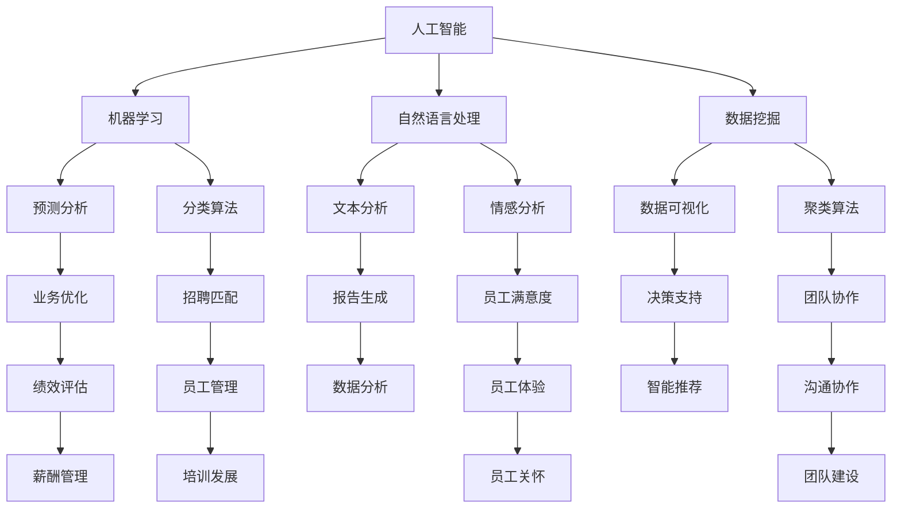

                 

# AI在人力资源领域的应用前景

> 关键词：人工智能、人力资源管理、数据挖掘、预测分析、自动化、数字化转型

> 摘要：本文将探讨人工智能（AI）在人力资源（HR）领域的广泛应用和潜在前景。通过分析AI的核心技术，如机器学习、自然语言处理、数据挖掘等，本文将详细介绍AI在招聘、绩效评估、员工管理、员工体验等方面的应用实例，并对AI在HR领域的未来发展趋势和面临的挑战进行深入探讨。

## 1. 背景介绍

### 1.1 目的和范围

本文旨在探讨人工智能在人力资源领域的应用前景，分析其在招聘、绩效评估、员工管理、员工体验等方面的作用。本文将结合实际案例和数据分析，展示AI技术的强大功能，并探讨其在HR领域的未来发展。

### 1.2 预期读者

本文适合对人工智能和人力资源管理有一定了解的读者，包括HR从业者、企业管理者、技术爱好者等。通过本文，读者可以了解到AI在HR领域的应用现状、发展趋势和未来挑战。

### 1.3 文档结构概述

本文分为以下几个部分：

1. 背景介绍：介绍本文的目的、范围和预期读者。
2. 核心概念与联系：介绍AI在HR领域应用的核心概念，如机器学习、数据挖掘、自然语言处理等。
3. 核心算法原理与具体操作步骤：讲解AI算法在HR领域的具体应用。
4. 数学模型和公式：介绍AI在HR领域应用的数学模型和公式。
5. 项目实战：通过实际案例展示AI在HR领域的应用。
6. 实际应用场景：分析AI在HR领域的实际应用场景。
7. 工具和资源推荐：推荐相关学习资源和开发工具。
8. 总结：对未来发展趋势和挑战进行展望。
9. 附录：常见问题与解答。
10. 扩展阅读与参考资料：提供进一步阅读的材料。

### 1.4 术语表

#### 1.4.1 核心术语定义

- 人工智能（AI）：一种模拟人类智能的技术，能够通过学习、推理和解决问题来执行复杂任务。
- 人力资源（HR）：企业管理和组织中的员工管理活动，包括招聘、培训、绩效评估、薪酬管理等方面。
- 数据挖掘（Data Mining）：从大量数据中提取有价值信息的过程。
- 预测分析（Predictive Analytics）：使用历史数据和分析模型来预测未来事件的方法。

#### 1.4.2 相关概念解释

- 机器学习（Machine Learning）：一种AI技术，通过从数据中学习，实现自我改进和优化。
- 自然语言处理（NLP）：一种AI技术，使计算机能够理解和处理自然语言。
- 自动化（Automation）：使用技术手段代替人工完成某些任务的过程。

#### 1.4.3 缩略词列表

- AI：人工智能
- HR：人力资源
- ML：机器学习
- NLP：自然语言处理
- DM：数据挖掘
- PA：预测分析

## 2. 核心概念与联系

在讨论AI在人力资源领域的应用之前，我们需要了解一些核心概念及其相互关系。以下是一个简化的Mermaid流程图，展示了这些概念之间的联系。



### 2.1 人工智能与机器学习

人工智能（AI）是模拟人类智能的技术，而机器学习（ML）是AI的一个重要分支。机器学习通过从数据中学习，实现自我改进和优化。在人力资源管理中，机器学习可用于招聘匹配、员工满意度预测、绩效评估等方面。

### 2.2 自然语言处理与数据挖掘

自然语言处理（NLP）是一种AI技术，使计算机能够理解和处理自然语言。数据挖掘（DM）是从大量数据中提取有价值信息的过程。在HR领域，NLP和数据挖掘可结合用于文本分析、情感分析、报告生成等任务。

### 2.3 预测分析

预测分析（PA）是一种基于历史数据和统计分析的方法，用于预测未来事件。在人力资源管理中，预测分析可用于招聘预测、员工流失预测、薪酬管理等方面。

## 3. 核心算法原理 & 具体操作步骤

在本节中，我们将详细讲解一些核心算法原理，以及如何将它们应用于人力资源管理中的具体操作步骤。

### 3.1 机器学习算法

#### 3.1.1 分类算法

分类算法是一种将数据划分为不同类别的算法。在人力资源管理中，分类算法可用于招聘匹配，根据候选人的简历信息，将其归类为适合或不适合的职位。

**算法原理：**

分类算法基于已标记的数据集进行训练，学习数据中的特征，并构建分类模型。在预测阶段，分类算法根据新数据的特征，将其归类为某一类别。

**伪代码：**

```python
def train_classifier(training_data, labels):
    # 使用训练数据训练分类器
    # ...
    return classifier

def predict_data(classifier, new_data):
    # 使用分类器预测新数据的类别
    # ...
    return predicted_label
```

#### 3.1.2 聚类算法

聚类算法是一种将数据划分为相似数据组的算法。在人力资源管理中，聚类算法可用于团队协作，将员工按照工作风格、技能水平等进行分组。

**算法原理：**

聚类算法通过分析数据点之间的相似度，将数据点划分为若干个簇。每个簇内的数据点相似度较高，而不同簇之间的数据点相似度较低。

**伪代码：**

```python
def train_clusteringAlgorithm(training_data):
    # 使用训练数据训练聚类算法
    # ...
    return clustering_model

def predict_data(clustering_model, new_data):
    # 使用聚类模型预测新数据的簇
    # ...
    return predicted_cluster
```

### 3.2 自然语言处理算法

#### 3.2.1 文本分析

文本分析是一种NLP技术，用于从文本数据中提取有价值的信息。在人力资源管理中，文本分析可用于情感分析、报告生成等任务。

**算法原理：**

文本分析首先对文本进行预处理，包括分词、去除停用词、词干提取等。然后，使用词袋模型、TF-IDF等方法对文本进行特征提取。最后，使用分类、聚类等算法对文本进行分析。

**伪代码：**

```python
def preprocess_text(text):
    # 对文本进行预处理
    # ...
    return processed_text

def extract_features(processed_text):
    # 提取文本特征
    # ...
    return features

def analyze_text(features, model):
    # 使用模型分析文本
    # ...
    return analysis_results
```

#### 3.2.2 情感分析

情感分析是一种NLP技术，用于判断文本的情感倾向。在人力资源管理中，情感分析可用于员工满意度预测、员工关怀等任务。

**算法原理：**

情感分析首先对文本进行预处理，然后使用词向量模型、情感词典等方法对文本进行情感分类。最终，根据情感分类结果，对文本的情感倾向进行判断。

**伪代码：**

```python
def preprocess_text(text):
    # 对文本进行预处理
    # ...
    return processed_text

def analyze_sentiment(processed_text, sentiment_model):
    # 使用情感模型分析文本
    # ...
    return sentiment_label
```

### 3.3 数据挖掘算法

#### 3.3.1 预测分析

预测分析是一种数据挖掘技术，用于根据历史数据预测未来事件。在人力资源管理中，预测分析可用于招聘预测、员工流失预测等任务。

**算法原理：**

预测分析首先对历史数据进行预处理，包括缺失值处理、异常值检测等。然后，使用回归、时间序列分析等方法构建预测模型。最后，根据预测模型，对未来事件进行预测。

**伪代码：**

```python
def preprocess_data(history_data):
    # 预处理历史数据
    # ...
    return preprocessed_data

def train_predictive_model(preprocessed_data):
    # 训练预测模型
    # ...
    return predictive_model

def predict_future_events(predictive_model, future_data):
    # 预测未来事件
    # ...
    return predictions
```

## 4. 数学模型和公式 & 详细讲解 & 举例说明

在本节中，我们将介绍一些在AI应用于人力资源管理中常用的数学模型和公式，并给出详细的讲解和举例说明。

### 4.1 机器学习模型

#### 4.1.1 线性回归模型

线性回归模型是一种常见的预测模型，用于预测一个连续变量的值。在人力资源管理中，线性回归模型可用于预测员工绩效、薪酬水平等。

**数学模型：**

$$
y = \beta_0 + \beta_1x_1 + \beta_2x_2 + ... + \beta_nx_n + \epsilon
$$

其中，$y$为预测值，$x_1, x_2, ..., x_n$为自变量，$\beta_0, \beta_1, ..., \beta_n$为模型参数，$\epsilon$为误差项。

**详细讲解：**

线性回归模型通过拟合一条直线，将自变量与因变量之间的关系表示出来。模型参数$\beta_0, \beta_1, ..., \beta_n$分别表示自变量对因变量的影响程度。

**举例说明：**

假设我们想预测某员工的薪酬水平，已知该员工的年龄、工作经验和学历。我们可以使用线性回归模型来建立预测模型。

$$
y = \beta_0 + \beta_1x_1 + \beta_2x_2 + \beta_3x_3
$$

其中，$y$为薪酬水平，$x_1$为年龄，$x_2$为工作经验，$x_3$为学历。

#### 4.1.2 逻辑回归模型

逻辑回归模型是一种常用的分类模型，用于预测一个二元变量的值。在人力资源管理中，逻辑回归模型可用于招聘匹配、员工流失预测等任务。

**数学模型：**

$$
P(y=1) = \frac{1}{1 + e^{-(\beta_0 + \beta_1x_1 + \beta_2x_2 + ... + \beta_nx_n)}}
$$

其中，$P(y=1)$为因变量为1的概率，$e$为自然对数的底数，$\beta_0, \beta_1, ..., \beta_n$为模型参数。

**详细讲解：**

逻辑回归模型通过拟合一个Sigmoid函数，将自变量与因变量的关系表示出来。模型参数$\beta_0, \beta_1, ..., \beta_n$分别表示自变量对因变量的影响程度。

**举例说明：**

假设我们想预测某员工是否会流失，已知该员工的年龄、工作经验和学历。我们可以使用逻辑回归模型来建立预测模型。

$$
P(y=1) = \frac{1}{1 + e^{-(\beta_0 + \beta_1x_1 + \beta_2x_2 + \beta_3x_3)}}
$$

其中，$y$为流失状态（1为流失，0为未流失），$x_1$为年龄，$x_2$为工作经验，$x_3$为学历。

### 4.2 自然语言处理模型

#### 4.2.1 词向量模型

词向量模型是一种将单词映射为向量的方法，常用于文本数据分析。在人力资源管理中，词向量模型可用于情感分析、文本分类等任务。

**数学模型：**

$$
\text{word}_i \rightarrow \mathbf{v}_i
$$

其中，$\text{word}_i$为单词，$\mathbf{v}_i$为对应的词向量。

**详细讲解：**

词向量模型通过将单词映射为高维空间中的向量，实现了语义的分布式表示。词向量之间的相似性可以通过向量的距离来衡量。

**举例说明：**

假设我们有两个词向量$\mathbf{v}_1$和$\mathbf{v}_2$，我们可以使用余弦相似度来计算它们的相似度：

$$
\text{similarity}(\mathbf{v}_1, \mathbf{v}_2) = \frac{\mathbf{v}_1 \cdot \mathbf{v}_2}{\lVert \mathbf{v}_1 \rVert \cdot \lVert \mathbf{v}_2 \rVert}
$$

其中，$\lVert \mathbf{v}_1 \rVert$和$\lVert \mathbf{v}_2 \rVert$分别为$\mathbf{v}_1$和$\mathbf{v}_2$的欧几里得范数。

#### 4.2.2 随机森林模型

随机森林模型是一种基于决策树的集成学习方法。在人力资源管理中，随机森林模型可用于招聘匹配、员工流失预测等任务。

**数学模型：**

随机森林由多个决策树组成，每个决策树通过划分特征空间来生成分类结果。最终，随机森林通过多数投票的方式来确定最终结果。

**详细讲解：**

随机森林通过构建多个决策树，并利用它们的组合来提高模型的预测性能。每个决策树都从特征空间中随机选取一部分特征进行划分，从而降低了模型的过拟合风险。

**举例说明：**

假设我们有一个包含3个特征的决策树，分别为$x_1, x_2, x_3$。我们可以使用以下公式来划分特征空间：

$$
\text{split\_feature}(x_1, x_2, x_3) = \begin{cases}
\text{left\_split}(x_1) & \text{if } x_1 < \text{threshold}_1 \\
\text{mid\_split}(x_2) & \text{if } x_1 \geq \text{threshold}_1 \text{ and } x_2 < \text{threshold}_2 \\
\text{right\_split}(x_3) & \text{if } x_1 \geq \text{threshold}_1 \text{ and } x_2 \geq \text{threshold}_2
\end{cases}
$$

其中，$\text{left\_split}(x_1), \text{mid\_split}(x_2), \text{right\_split}(x_3)$分别为对应的划分函数，$\text{threshold}_1, \text{threshold}_2$为阈值。

## 5. 项目实战：代码实际案例和详细解释说明

在本节中，我们将通过一个实际项目案例，展示如何使用AI技术进行人力资源管理。这个项目是一个基于Python的招聘匹配系统，使用机器学习和自然语言处理技术，根据候选人的简历和职位描述，自动匹配适合的职位。

### 5.1 开发环境搭建

为了完成这个项目，我们需要以下开发环境和工具：

- Python 3.x
- Jupyter Notebook
- scikit-learn
- NLTK
- spaCy

安装这些工具和库的方法如下：

```bash
# 安装Python
wget https://www.python.org/ftp/python/3.8.5/Python-3.8.5.tgz
tar -xvf Python-3.8.5.tgz
cd Python-3.8.5
./configure
make
sudo make altinstall

# 安装Jupyter Notebook
pip install notebook

# 安装scikit-learn
pip install scikit-learn

# 安装NLTK
pip install nltk

# 安装spaCy和spaCy中文模型
pip install spacy
python -m spacy download zh_core_web_sm
```

### 5.2 源代码详细实现和代码解读

下面是项目的源代码，我们将逐一解释每个部分的功能。

```python
# 导入必要的库
import nltk
from nltk.tokenize import word_tokenize
from nltk.corpus import stopwords
from sklearn.feature_extraction.text import TfidfVectorizer
from sklearn.model_selection import train_test_split
from sklearn.ensemble import RandomForestClassifier
from sklearn.metrics import accuracy_score, precision_score, recall_score, f1_score
import spacy

# 加载NLTK停用词
nltk.download('stopwords')
stop_words = set(stopwords.words('english'))

# 加载spaCy中文模型
nlp = spacy.load('zh_core_web_sm')

# 读取简历和职位描述数据
def load_data():
    resumes = []
    jobs = []
    with open('resumes.txt', 'r', encoding='utf-8') as f:
        for line in f:
            resumes.append(line.strip())
    with open('jobs.txt', 'r', encoding='utf-8') as f:
        for line in f:
            jobs.append(line.strip())
    return resumes, jobs

# 预处理文本数据
def preprocess_text(text):
    # 使用spaCy进行分词和词性标注
    doc = nlp(text)
    tokens = [token.text.lower() for token in doc if token.pos_ != 'PUNCT' and token.text.lower() not in stop_words]
    return ' '.join(tokens)

# 构建TF-IDF特征向量
def build_tfidf_vectorizer(resumes, jobs):
    vectorizer = TfidfVectorizer()
    X = vectorizer.fit_transform(resumes + jobs)
    y = [1] * len(resumes) + [0] * len(jobs)
    return X, y, vectorizer

# 训练随机森林分类器
def train_classifier(X, y):
    X_train, X_test, y_train, y_test = train_test_split(X, y, test_size=0.2, random_state=42)
    classifier = RandomForestClassifier(n_estimators=100, random_state=42)
    classifier.fit(X_train, y_train)
    return classifier, X_test, y_test

# 预测和评估模型
def evaluate_model(classifier, X_test, y_test):
    y_pred = classifier.predict(X_test)
    print("Accuracy:", accuracy_score(y_test, y_pred))
    print("Precision:", precision_score(y_test, y_pred))
    print("Recall:", recall_score(y_test, y_pred))
    print("F1 Score:", f1_score(y_test, y_pred))

# 主函数
def main():
    resumes, jobs = load_data()
    resumes_preprocessed = [preprocess_text(resume) for resume in resumes]
    jobs_preprocessed = [preprocess_text(job) for job in jobs]
    X, y, vectorizer = build_tfidf_vectorizer(resumes_preprocessed, jobs_preprocessed)
    classifier, X_test, y_test = train_classifier(X, y)
    evaluate_model(classifier, X_test, y_test)

if __name__ == '__main__':
    main()
```

### 5.3 代码解读与分析

#### 5.3.1 数据预处理

首先，我们读取简历和职位描述数据，并使用spaCy进行分词和词性标注。然后，我们去除标点符号和停用词，得到预处理后的文本数据。

```python
# 读取简历和职位描述数据
def load_data():
    resumes = []
    jobs = []
    with open('resumes.txt', 'r', encoding='utf-8') as f:
        for line in f:
            resumes.append(line.strip())
    with open('jobs.txt', 'r', encoding='utf-8') as f:
        for line in f:
            jobs.append(line.strip())
    return resumes, jobs

# 预处理文本数据
def preprocess_text(text):
    # 使用spaCy进行分词和词性标注
    doc = nlp(text)
    tokens = [token.text.lower() for token in doc if token.pos_ != 'PUNCT' and token.text.lower() not in stop_words]
    return ' '.join(tokens)
```

#### 5.3.2 构建TF-IDF特征向量

接下来，我们使用TF-IDF向量器将预处理后的文本数据转换为特征向量。TF-IDF向量器能够捕捉文本中的重要特征词，提高模型的性能。

```python
# 构建TF-IDF特征向量
def build_tfidf_vectorizer(resumes, jobs):
    vectorizer = TfidfVectorizer()
    X = vectorizer.fit_transform(resumes + jobs)
    y = [1] * len(resumes) + [0] * len(jobs)
    return X, y, vectorizer
```

#### 5.3.3 训练随机森林分类器

然后，我们使用随机森林分类器对训练数据进行训练。随机森林是一种集成学习方法，通过构建多个决策树来提高模型的预测性能。

```python
# 训练随机森林分类器
def train_classifier(X, y):
    X_train, X_test, y_train, y_test = train_test_split(X, y, test_size=0.2, random_state=42)
    classifier = RandomForestClassifier(n_estimators=100, random_state=42)
    classifier.fit(X_train, y_train)
    return classifier, X_test, y_test
```

#### 5.3.4 预测和评估模型

最后，我们对测试数据进行预测，并评估模型的性能。评估指标包括准确率、精确率、召回率和F1分数。

```python
# 预测和评估模型
def evaluate_model(classifier, X_test, y_test):
    y_pred = classifier.predict(X_test)
    print("Accuracy:", accuracy_score(y_test, y_pred))
    print("Precision:", precision_score(y_test, y_pred))
    print("Recall:", recall_score(y_test, y_pred))
    print("F1 Score:", f1_score(y_test, y_pred))
```

通过这个实际案例，我们可以看到如何使用AI技术进行人力资源管理。这个招聘匹配系统可以自动分析简历和职位描述，为候选人推荐合适的职位。在实际应用中，我们可以进一步优化模型，提高匹配的准确率。

## 6. 实际应用场景

AI技术在人力资源领域的应用场景非常广泛，以下是一些实际的应用场景：

### 6.1 招聘

- **招聘匹配**：通过分析候选人的简历和职位描述，AI系统可以自动匹配适合的职位，提高招聘效率。
- **简历筛选**：AI系统可以自动筛选简历，识别出符合职位要求的候选人，减少人工筛选的工作量。
- **面试评估**：AI系统可以通过分析面试者的回答，评估其能力和素质，为招聘决策提供参考。

### 6.2 绩效评估

- **绩效预测**：通过分析员工的工作表现和历史数据，AI系统可以预测员工的绩效，帮助管理者进行绩效评估和激励。
- **工作压力分析**：AI系统可以监测员工的工作压力，识别出需要关注和干预的情况，提高员工的幸福感和工作效率。

### 6.3 员工管理

- **员工流失预测**：通过分析员工的工作表现、沟通记录等数据，AI系统可以预测员工流失的风险，帮助管理者制定预防措施。
- **员工关怀**：AI系统可以分析员工的需求和反馈，提供个性化的关怀和建议，提高员工满意度。

### 6.4 员工体验

- **沟通协作**：AI系统可以分析员工的沟通记录，识别出有效的沟通渠道和方法，提高团队协作效率。
- **工作环境优化**：AI系统可以分析员工的工作环境和行为数据，提供个性化的工作建议和优化方案，提高员工的工作体验。

### 6.5 薪酬管理

- **薪酬预测**：通过分析员工的工作表现、市场薪酬水平等数据，AI系统可以预测员工的薪酬水平，帮助管理者制定合理的薪酬策略。

### 6.6 培训发展

- **培训需求分析**：通过分析员工的工作表现和技能水平，AI系统可以识别出员工的培训需求，提供个性化的培训建议。

## 7. 工具和资源推荐

### 7.1 学习资源推荐

#### 7.1.1 书籍推荐

- 《人工智能：一种现代方法》（第三版）
- 《深度学习》（Goodfellow, Bengio, Courville 著）
- 《数据科学入门：基于Python和R语言》

#### 7.1.2 在线课程

- Coursera的《机器学习》课程
- Udacity的《深度学习纳米学位》
- edX的《数据科学专业课程》

#### 7.1.3 技术博客和网站

- Medium上的《AI与HR》专栏
- Analytics Vidhya
-Towards Data Science

### 7.2 开发工具框架推荐

#### 7.2.1 IDE和编辑器

- PyCharm
- Jupyter Notebook
- Visual Studio Code

#### 7.2.2 调试和性能分析工具

- Python Debugger（pdb）
- Valgrind
- profilers

#### 7.2.3 相关框架和库

- scikit-learn
- TensorFlow
- PyTorch
- spaCy

### 7.3 相关论文著作推荐

#### 7.3.1 经典论文

- “The AI Revolution: And Our Role in It” by Nick Bostrom
- “Deep Learning” by Ian Goodfellow, Yoshua Bengio, Aaron Courville
- “Machine Learning: A Probabilistic Perspective” by Kevin P. Murphy

#### 7.3.2 最新研究成果

- AAAI、ICML、NIPS等顶级会议的论文
- NeurIPS、JMLR等顶级期刊的论文

#### 7.3.3 应用案例分析

- “AI in HR: Transforming Talent Management” by Deloitte
- “AI-powered HR: The Future of Work” by McKinsey & Company

## 8. 总结：未来发展趋势与挑战

AI技术在人力资源领域的应用前景广阔，为企业和员工带来了诸多好处。随着技术的不断发展，未来AI在HR领域的应用将进一步深化和拓展。然而，AI在HR领域的应用也面临着一些挑战，如数据隐私、算法偏见、员工接受度等。

### 8.1 发展趋势

- **智能化招聘**：AI技术将进一步提升招聘效率和准确率，实现智能化招聘。
- **个性化管理**：AI技术将帮助管理者更好地了解员工需求，实现个性化管理。
- **自动化流程**：AI技术将自动化HR管理流程，提高工作效率。
- **员工体验优化**：AI技术将优化员工的工作环境和体验，提高员工满意度和忠诚度。
- **数据驱动的决策**：AI技术将提供更准确的数据分析，帮助管理者做出更明智的决策。

### 8.2 挑战

- **数据隐私**：HR数据涉及到员工的隐私信息，如何保护数据隐私是一个重要挑战。
- **算法偏见**：AI算法可能存在偏见，导致歧视和不公平现象，需要加强监管。
- **员工接受度**：员工可能对AI技术持有怀疑态度，如何提高员工的接受度是一个挑战。
- **技术成熟度**：当前AI技术尚未完全成熟，需要在算法、模型等方面进行持续优化。

总之，AI技术在人力资源领域的应用前景巨大，但同时也面临着诸多挑战。我们需要不断探索和解决这些问题，充分发挥AI技术在HR领域的潜力。

## 9. 附录：常见问题与解答

### 9.1 什么是人工智能（AI）？

人工智能（AI）是一种模拟人类智能的技术，通过学习、推理和解决问题来执行复杂任务。

### 9.2 人工智能在人力资源管理中有哪些应用？

人工智能在人力资源管理中的应用包括招聘匹配、简历筛选、绩效评估、员工流失预测、员工体验优化等。

### 9.3 机器学习在人力资源管理中有哪些应用？

机器学习在人力资源管理中的应用包括招聘匹配、绩效评估、员工流失预测、薪酬管理、培训需求分析等。

### 9.4 如何确保AI技术在HR领域的应用不会侵犯员工隐私？

为了确保AI技术在HR领域的应用不会侵犯员工隐私，我们需要采取以下措施：

- 制定严格的隐私政策，明确数据收集、使用和共享的范围。
- 对数据进行分析和处理时，采用加密和匿名化技术。
- 加强数据安全保护，防止数据泄露和滥用。

### 9.5 如何应对AI技术在HR领域的偏见和歧视问题？

为了应对AI技术在HR领域的偏见和歧视问题，我们需要：

- 加强算法训练数据的多样性和代表性。
- 定期审查和评估AI算法的公平性和准确性。
- 建立透明、公正的算法决策流程。

## 10. 扩展阅读与参考资料

- Bostrom, N. (2014). 《人工智能：一种现代方法》（第三版）.
- Goodfellow, I., Bengio, Y., Courville, A. (2016). 《深度学习》.
- Murphy, K. P. (2012). 《机器学习：一种概率视角》.
- Deloitte. (2018). “AI in HR: Transforming Talent Management”.
- McKinsey & Company. (2018). “AI-powered HR: The Future of Work”.
- Analytics Vidhya. various authors. various publications on AI in HR.

