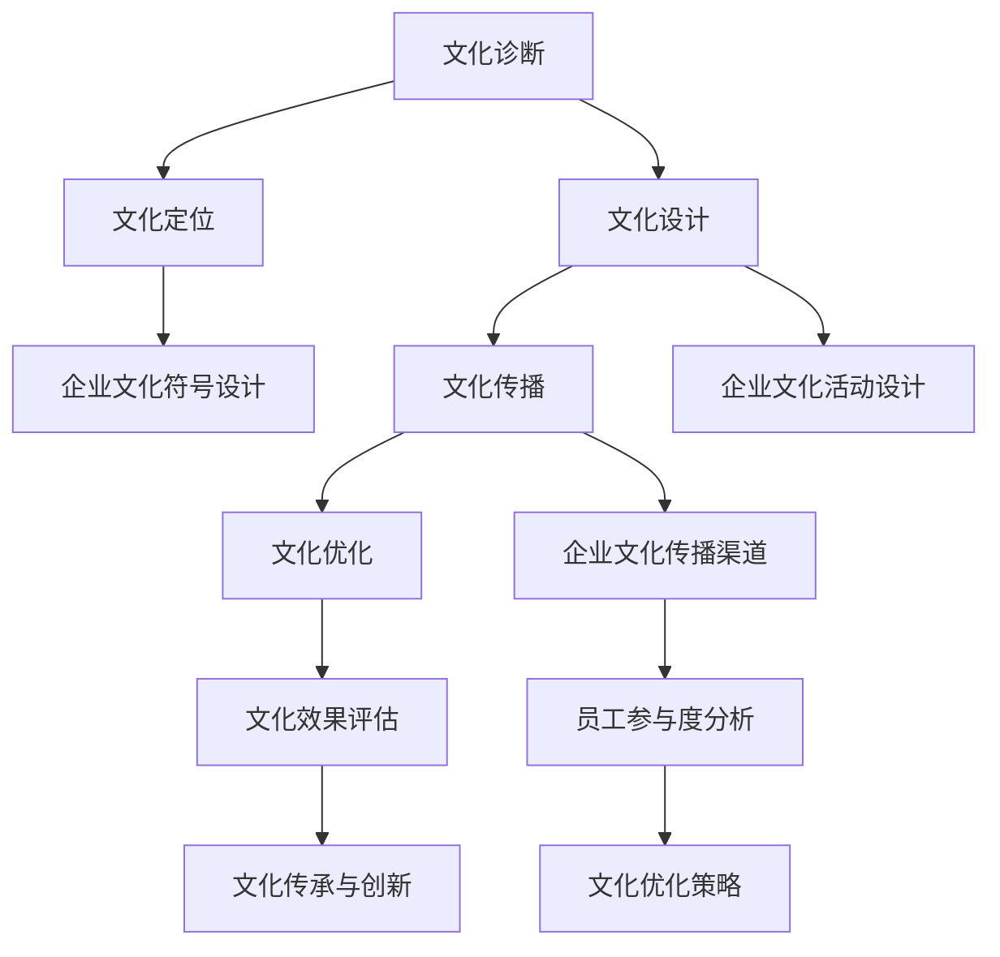

                 

# AI在企业文化建设中的创新应用

> **关键词：** 企业文化建设、人工智能、文化认知、数据驱动、文化传承与创新

> **摘要：** 本文章深入探讨了人工智能（AI）在企业文化建设中的应用，分析了AI在文化认知、数据驱动、文化传承与创新等方面的核心原理和实践案例，旨在为企业提供利用AI技术优化企业文化的策略和方法。

## 1. 背景介绍

### 1.1 目的和范围

本文旨在探讨人工智能（AI）在企业文化建设中的创新应用，分析AI技术的核心原理，介绍实际应用案例，并提出企业文化建设中利用AI技术的策略和方法。文章重点关注以下三个方面：

1. **文化认知：** 如何利用AI技术深入理解企业文化，挖掘文化内涵和特征。
2. **数据驱动：** 如何通过AI技术收集、分析和利用企业文化相关的数据，实现数据驱动文化建设。
3. **文化传承与创新：** 如何利用AI技术推动企业文化的传承和创新，实现文化可持续发展。

### 1.2 预期读者

本文预期读者主要包括：

1. **企业高层管理者：** 关注企业文化建设，希望了解AI技术在企业文化建设中的应用和潜力。
2. **企业文化从业者：** 担任企业文化经理、文化策划等职位，希望提升企业文化建设和传播的专业能力。
3. **人工智能从业者：** 对AI技术及其在企业文化建设中的应用有兴趣的研究者和从业者。

### 1.3 文档结构概述

本文结构如下：

1. **第1章 背景介绍：** 介绍文章的目的、范围、预期读者和文档结构。
2. **第2章 核心概念与联系：** 阐述AI在企业文化建设中的核心概念、原理和架构。
3. **第3章 核心算法原理 & 具体操作步骤：** 详细讲解AI在文化认知中的应用算法和操作步骤。
4. **第4章 数学模型和公式 & 详细讲解 & 举例说明：** 分析企业文化数据处理的数学模型和实例。
5. **第5章 项目实战：代码实际案例和详细解释说明：** 展示AI在企业文化建设中的实际应用案例。
6. **第6章 实际应用场景：** 探讨AI在企业文化建设中的多种应用场景。
7. **第7章 工具和资源推荐：** 推荐相关学习资源、开发工具和框架。
8. **第8章 总结：未来发展趋势与挑战：** 总结文章内容，展望未来发展趋势和挑战。
9. **第9章 附录：常见问题与解答：** 提供文章内容的常见问题解答。
10. **第10章 扩展阅读 & 参考资料：** 提供进一步学习和研究的参考资料。

### 1.4 术语表

#### 1.4.1 核心术语定义

- **人工智能（AI）：** 人工智能是一种模拟人类智能行为的技术，通过算法和模型实现机器的自主学习和智能决策。
- **企业文化：** 企业文化是企业内部成员共同遵循的价值观念、行为规范和工作方式。
- **文化认知：** 文化认知是指通过技术手段理解和分析企业文化内涵和特征的过程。
- **数据驱动：** 数据驱动是指通过收集、分析和利用数据来指导企业决策和行动的过程。

#### 1.4.2 相关概念解释

- **机器学习（ML）：** 机器学习是人工智能的一个重要分支，通过训练模型从数据中学习规律，实现智能决策和预测。
- **深度学习（DL）：** 深度学习是机器学习的一个子领域，通过多层神经网络实现复杂的特征提取和模型训练。
- **自然语言处理（NLP）：** 自然语言处理是人工智能的一个子领域，旨在使计算机理解和处理人类语言。

#### 1.4.3 缩略词列表

- **AI：** 人工智能
- **ML：** 机器学习
- **DL：** 深度学习
- **NLP：** 自然语言处理
- **ERP：** 企业资源计划
- **CRM：** 客户关系管理

## 2. 核心概念与联系

在探讨AI在企业文化建设中的应用之前，我们需要明确几个核心概念和它们之间的联系。

### 2.1 AI在企业文化建设中的作用

AI技术在企业文化建设中的作用主要体现在以下几个方面：

1. **文化认知：** 利用AI技术，如自然语言处理（NLP）和机器学习（ML），可以深入挖掘企业文化内涵，识别关键价值观念和行为规范。
2. **数据驱动：** 通过大数据技术和AI算法，收集、分析和利用企业文化相关的数据，为企业文化建设提供数据支持和决策依据。
3. **文化传承与创新：** 利用AI技术推动企业文化的传承和创新，如通过自动化流程和智能推荐系统提升企业文化传播效果。

### 2.2 AI技术原理与架构

AI技术的核心原理包括机器学习（ML）、深度学习（DL）和自然语言处理（NLP）。下面是这三个技术的简要概述和它们在企业文化建设中的应用：

#### 2.2.1 机器学习（ML）

机器学习（ML）是一种通过训练模型来从数据中学习规律的方法。在企业文化建设中，ML可以用于以下场景：

- **情感分析：** 通过分析员工留言、评论等文本数据，识别员工情感和态度。
- **行为预测：** 通过分析员工行为数据，预测员工离职风险和职业发展路径。
- **文化识别：** 通过分析企业文化相关的数据，识别企业文化类型和特征。

#### 2.2.2 深度学习（DL）

深度学习（DL）是一种基于多层神经网络的机器学习方法。在企业文化建设中，DL可以用于以下场景：

- **图像识别：** 通过训练图像识别模型，识别企业文化相关的图像和符号。
- **语音识别：** 通过训练语音识别模型，识别企业文化相关的语音和语音情感。
- **文本生成：** 通过训练文本生成模型，生成企业文化相关的文案和故事。

#### 2.2.3 自然语言处理（NLP）

自然语言处理（NLP）是一种使计算机理解和处理人类语言的方法。在企业文化建设中，NLP可以用于以下场景：

- **文本分析：** 通过分析企业文化相关的文本数据，提取关键词和主题。
- **语义理解：** 通过分析企业文化相关的文本数据，理解文本的语义和情感。
- **语言生成：** 通过训练语言生成模型，生成企业文化相关的文案和宣传语。

### 2.3 企业文化建设的流程

企业文化建设包括以下几个关键步骤：

1. **文化诊断：** 通过调查问卷、访谈等方式，了解企业文化现状和问题。
2. **文化定位：** 明确企业文化的核心价值观、愿景和使命。
3. **文化设计：** 设计企业文化符号、仪式和活动，以传递和强化企业价值观。
4. **文化传播：** 利用各种渠道和手段，传播企业文化，提升员工认同感和归属感。
5. **文化优化：** 通过持续的数据分析和反馈，优化企业文化设计和传播效果。

### 2.4 AI与企业文化建设流程的结合

AI技术可以与企业文化建设流程紧密结合，提升文化建设的效率和效果。具体结合方式如下：

1. **文化诊断：** 利用AI技术，如NLP和情感分析，分析员工言论和反馈，为企业提供文化诊断报告。
2. **文化定位：** 利用AI技术，如图像识别和文本生成，设计企业文化符号和宣传文案。
3. **文化设计：** 利用AI技术，如数据挖掘和机器学习，分析企业文化数据，优化文化设计和活动。
4. **文化传播：** 利用AI技术，如推荐系统和智能推送，传播企业文化，提升员工参与度和认同感。
5. **文化优化：** 利用AI技术，如预测分析和优化算法，持续优化企业文化建设和传播效果。

### 2.5 Mermaid流程图

以下是一个简化的AI与企业文化建设流程的Mermaid流程图：



## 3. 核心算法原理 & 具体操作步骤

在了解了AI在企业文化建设中的核心概念和流程后，我们需要深入探讨具体的算法原理和操作步骤，以实现AI技术在企业文化认知、数据驱动和文化传承与创新中的应用。

### 3.1 AI在文化认知中的应用

#### 3.1.1 情感分析

情感分析是一种常见的NLP技术，用于识别文本中的情感倾向。在企业文化建设中，情感分析可以用于分析员工言论和反馈，了解员工对企业文化的态度和情感。

**算法原理：**
情感分析通常基于训练好的情感分类模型，如文本分类模型或情感三分类模型。模型通过学习大量带有情感标签的文本数据，学会预测新文本的情感倾向。

**具体操作步骤：**
1. **数据收集：** 收集企业文化相关的文本数据，如员工留言、评论、调查问卷等。
2. **数据预处理：** 清洗文本数据，去除无关信息，进行分词、去停用词、词干提取等预处理操作。
3. **模型训练：** 使用训练数据训练情感分类模型，如使用朴素贝叶斯、支持向量机（SVM）或深度学习模型。
4. **情感预测：** 使用训练好的模型对新的文本数据进行分析，预测其情感倾向。

**伪代码：**

```python
# 数据预处理
def preprocess_text(text):
    # 清洗文本、分词、去停用词、词干提取等操作
    return preprocessed_text

# 情感分析
def sentiment_analysis(text):
    preprocessed_text = preprocess_text(text)
    # 使用训练好的模型进行情感预测
    sentiment = model.predict(preprocessed_text)
    return sentiment
```

#### 3.1.2 行为分析

行为分析是一种基于数据挖掘和机器学习的分析技术，用于识别和分析员工行为数据，了解员工的行为模式和企业文化之间的关系。

**算法原理：**
行为分析通常基于关联规则挖掘、聚类分析和分类算法。通过分析员工行为数据，如考勤记录、项目参与情况、员工互动等，识别员工的行为模式和兴趣点。

**具体操作步骤：**
1. **数据收集：** 收集企业文化相关的行为数据，如考勤记录、项目参与记录、员工互动数据等。
2. **数据预处理：** 清洗行为数据，进行数据转换和整合，为后续分析做好准备。
3. **行为模式识别：** 使用数据挖掘算法，如关联规则挖掘或聚类分析，识别员工的行为模式。
4. **行为预测：** 使用分类算法，如决策树、随机森林或支持向量机（SVM），预测员工的行为。

**伪代码：**

```python
# 数据预处理
def preprocess_behavior_data(data):
    # 数据清洗、转换和整合
    return preprocessed_data

# 行为模式识别
def behavior_mode_recognition(data):
    preprocessed_data = preprocess_behavior_data(data)
    # 使用关联规则挖掘或聚类分析识别行为模式
    behavior_modes = algorithm.apply(preprocessed_data)
    return behavior_modes

# 行为预测
def behavior_prediction(data):
    preprocessed_data = preprocess_behavior_data(data)
    # 使用分类算法预测员工行为
    behavior_prediction = classifier.predict(preprocessed_data)
    return behavior_prediction
```

### 3.2 AI在数据驱动中的应用

#### 3.2.1 数据收集与整合

数据驱动的基础是数据收集和整合。通过收集企业文化相关的数据，如员工反馈、行为数据、企业文化活动数据等，整合成统一的数据集，为企业文化建设提供数据支持。

**具体操作步骤：**
1. **数据收集：** 收集企业文化相关的数据，如员工反馈、行为数据、企业文化活动数据等。
2. **数据整合：** 将不同来源的数据整合成统一的数据集，为后续分析做好准备。

**伪代码：**

```python
# 数据收集
def collect_data():
    data = []
    # 收集员工反馈、行为数据、企业文化活动数据等
    data.extend(employee_feedback)
    data.extend(behavior_data)
    data.extend企业文化活动数据
    return data

# 数据整合
def integrate_data(data):
    integrated_data = []
    # 将不同来源的数据整合成统一的数据集
    for item in data:
        integrated_data.append(process_item(item))
    return integrated_data
```

#### 3.2.2 数据分析与挖掘

通过对整合后的数据进行分析和挖掘，可以提取出有价值的信息，为企业文化建设提供决策依据。

**具体操作步骤：**
1. **数据预处理：** 清洗、转换和整合数据，为后续分析做好准备。
2. **特征工程：** 提取数据中的特征，为后续分析提供输入。
3. **数据挖掘：** 使用数据挖掘算法，如聚类分析、关联规则挖掘、分类算法等，分析数据，提取有价值的信息。

**伪代码：**

```python
# 数据预处理
def preprocess_data(data):
    # 数据清洗、转换和整合
    return preprocessed_data

# 特征工程
def feature_engineering(data):
    # 提取数据中的特征
    features = extract_features(data)
    return features

# 数据挖掘
def data_mining(data):
    # 使用数据挖掘算法分析数据
    results = algorithm.apply(data)
    return results
```

### 3.3 AI在文化传承与创新中的应用

#### 3.3.1 自动化流程

利用AI技术，可以实现企业文化建设流程的自动化，提高效率和质量。

**具体操作步骤：**
1. **流程设计：** 设计企业文化建设的自动化流程，如文化诊断、文化设计、文化传播等。
2. **流程实现：** 使用AI技术，如机器学习和深度学习，实现自动化流程。

**伪代码：**

```python
# 流程设计
def design_automation流程():
    # 设计企业文化建设的自动化流程
    automation流程 = {
        '文化诊断':文化诊断流程，
        '文化设计':文化设计流程，
        '文化传播':文化传播流程
    }
    return automation流程

# 流程实现
def implement_automation流程(automation流程):
    # 使用AI技术实现自动化流程
    for step,流程 in automation流程.items():
        execute_流程(流程)
```

#### 3.3.2 智能推荐

利用AI技术，可以实现企业文化内容的智能推荐，提升文化传播效果。

**具体操作步骤：**
1. **用户画像：** 构建用户画像，分析用户的兴趣和行为习惯。
2. **推荐算法：** 使用推荐算法，如协同过滤、基于内容的推荐等，为用户推荐企业文化内容。
3. **推荐系统：** 实现推荐系统，根据用户画像和推荐算法，为用户推荐合适的企业文化内容。

**伪代码：**

```python
# 用户画像
def build_user_profile(user_data):
    # 构建用户画像
    user_profile = {
        '兴趣爱好':兴趣爱好，
        '行为习惯':行为习惯
    }
    return user_profile

# 推荐算法
def recommend_algorithm(user_profile, content_data):
    # 使用推荐算法为用户推荐企业文化内容
    recommendations = algorithm.apply(user_profile, content_data)
    return recommendations

# 推荐系统
def implement_recommendation_system(user_profiles, content_data):
    # 实现推荐系统
    for user_profile in user_profiles:
        recommendations = recommend_algorithm(user_profile, content_data)
        send_recommendations(user_profile, recommendations)
```

## 4. 数学模型和公式 & 详细讲解 & 举例说明

在AI应用于企业文化建设的各个阶段，数学模型和公式起到了至关重要的作用。以下将详细介绍几个关键的数学模型和公式，并通过具体例子说明其在实际应用中的使用。

### 4.1 情感分析中的支持向量机（SVM）模型

情感分析是AI在企业文化认知中的一项关键技术，支持向量机（SVM）是一种常用的情感分类模型。SVM通过寻找最优分隔超平面，将不同情感的文本数据分开。

**数学模型：**

假设我们有训练数据集\(D=\{(x_1, y_1), (x_2, y_2), ..., (x_n, y_n)\}\)，其中\(x_i\)是文本数据，\(y_i\)是情感标签（通常为正负两类）。SVM的目标是找到一个超平面\(w\)和偏置\(b\)，使得文本数据能够被最大化分隔。

$$
\max_{w, b} \frac{1}{2} ||w||^2 \\
s.t. y_i (w \cdot x_i + b) \geq 1
$$

**公式解释：**

- \(||w||^2\)：表示超平面\(w\)的范数，用于衡量超平面的置信度。
- \(y_i (w \cdot x_i + b)\)：表示样本\(x_i\)到超平面的距离，乘以标签\(y_i\)，用于确保正确分类。

**例子说明：**

假设我们有一个二元分类问题，文本数据由词向量表示，词向量维度为100。我们可以将SVM的优化问题转换为线性规划问题，并使用求解器（如SNOPT）求解。

```python
import cvxpy as cp

# 参数设置
w = cp.Variable(100)
b = cp.Variable()
objective = cp.Minimize(0.5 * cp.quad_form(w))
constraints = [cpenschutzerklarung * (w @ x[i] + b) >= 1 for i in range(n)]

# 求解
prob = cp.Problem(objective, constraints)
prob.solve()

# 输出结果
w_value = w.value
b_value = b.value
```

### 4.2 聚类分析中的K-means算法

聚类分析是行为分析中的一种重要方法，K-means是一种经典的聚类算法。它通过迭代计算，将数据点划分到K个不同的簇中。

**数学模型：**

给定数据集\(X=\{x_1, x_2, ..., x_n\}\)，目标是最小化簇内距离平方和。

$$
\min_{\mu_1, \mu_2, ..., \mu_K} \sum_{k=1}^K \sum_{i=1}^n ||x_i - \mu_k||^2
$$

其中，\(\mu_k\)是簇\(k\)的中心。

**公式解释：**

- \(||x_i - \mu_k||^2\)：表示数据点\(x_i\)到簇中心\(\mu_k\)的距离平方。
- 簇内距离平方和：用于衡量聚类效果，最小化这一和可以使得簇内数据点更加集中。

**例子说明：**

假设我们有10个二维数据点，我们需要将它们划分为2个簇。首先随机初始化2个簇中心，然后迭代计算：

```python
import numpy as np

# 数据集
X = np.array([[1, 2], [1, 4], [1, 0], [10, 2], [10, 4], [10, 0]])

# 初始化簇中心
num_clusters = 2
mu = np.random.rand(num_clusters, X.shape[1])

# 迭代计算
max_iterations = 100
for _ in range(max_iterations):
    # 计算距离
    distances = np.linalg.norm(X - mu, axis=1)
    # 分配簇
    labels = np.argmin(distances, axis=1)
    # 更新簇中心
    for k in range(num_clusters):
        mu[k] = np.mean(X[labels == k], axis=0)

# 输出结果
print("簇中心：", mu)
print("簇标签：", labels)
```

### 4.3 推荐系统中的协同过滤算法

协同过滤是推荐系统中的一种常见方法，它通过分析用户之间的相似度，为用户推荐他们可能感兴趣的项目。

**数学模型：**

给定用户-物品评分矩阵\(R \in \mathbb{R}^{m \times n}\)，目标是最小化预测误差平方和。

$$
\min_{\theta} \sum_{i=1}^m \sum_{j=1}^n (r_{ij} - \theta_i^T \theta_j)^2
$$

其中，\(\theta_i\)和\(\theta_j\)分别表示用户\(i\)和物品\(j\)的特征向量。

**公式解释：**

- \(r_{ij}\)：表示用户\(i\)对物品\(j\)的评分。
- \(\theta_i^T \theta_j\)：表示用户\(i\)和物品\(j\)之间的相似度。
- 预测误差平方和：用于衡量预测的准确性。

**例子说明：**

假设我们有一个3x3的用户-物品评分矩阵，我们需要预测用户\(2\)对物品\(3\)的评分。

```python
import numpy as np

# 用户-物品评分矩阵
R = np.array([[5, 0, 1], [3, 2, 0], [0, 1, 4]])

# 初始化特征向量
num_users = R.shape[0]
num_items = R.shape[1]
theta = np.random.rand(num_users, 3)

# 预测评分
def predict_score(theta, R):
    predicted_R = np.dot(theta, R.T)
    return predicted_R

# 迭代优化
max_iterations = 100
for _ in range(max_iterations):
    # 计算预测评分
    predicted_R = predict_score(theta, R)
    # 计算误差
    errors = (R - predicted_R) ** 2
    # 更新特征向量
    theta -= 0.01 * np.dot(errors, R.T)

# 输出结果
predicted_R = predict_score(theta, R)
print("预测评分矩阵：", predicted_R)
```

通过上述数学模型和公式的讲解，我们可以看到AI在企业文化建设中的应用不仅仅是技术层面的创新，更是一种深度的思维方式和工具。在接下来的章节中，我们将通过实际案例展示这些算法和公式的具体应用。

## 5. 项目实战：代码实际案例和详细解释说明

在本章节中，我们将通过一个具体的实战项目来展示AI在企业文化建设中的应用，并详细解释项目的代码实现和关键步骤。

### 5.1 开发环境搭建

为了实现本文中提到的AI应用，我们需要搭建一个合适的开发环境。以下是一个基本的开发环境配置：

- **编程语言：** Python（3.8及以上版本）
- **库和框架：** NumPy、Pandas、Scikit-learn、TensorFlow、Keras、NLTK
- **文本预处理工具：** Jieba（中文分词）
- **数据可视化工具：** Matplotlib、Seaborn

首先，我们需要安装所需的库和框架：

```bash
pip install numpy pandas scikit-learn tensorflow keras nltk jieba matplotlib seaborn
```

### 5.2 源代码详细实现和代码解读

#### 5.2.1 数据收集与预处理

首先，我们需要收集企业文化相关的数据，如员工留言、评论、调查问卷等。以下是一个示例数据集：

```python
# 假设员工留言数据存储在一个CSV文件中
import pandas as pd

data = pd.read_csv('employee_comments.csv')
data.head()
```

接下来，我们对数据进行预处理，包括去除无关信息、分词、去除停用词等操作。

```python
import jieba
from nltk.corpus import stopwords

# 初始化停用词表
stop_words = set(stopwords.words('chinese'))

# 数据预处理
def preprocess_text(text):
    # 分词
    words = jieba.cut(text)
    # 去除停用词
    words = [word for word in words if word not in stop_words]
    return ' '.join(words)

data['cleaned_comments'] = data['comments'].apply(preprocess_text)
```

#### 5.2.2 情感分析

接下来，我们使用SVM模型进行情感分析，以了解员工的情感倾向。

```python
from sklearn.model_selection import train_test_split
from sklearn.svm import SVC
from sklearn.metrics import classification_report

# 数据划分
X = data['cleaned_comments']
y = data['sentiment']
X_train, X_test, y_train, y_test = train_test_split(X, y, test_size=0.2, random_state=42)

# 训练模型
model = SVC()
model.fit(X_train, y_train)

# 预测
predictions = model.predict(X_test)

# 评估
print(classification_report(y_test, predictions))
```

#### 5.2.3 行为分析

我们继续使用聚类分析来识别员工的行为模式。

```python
from sklearn.cluster import KMeans

# 数据转换
behavior_data = data[['attendance_rate', 'project_participation', 'employee_interaction']]

# 聚类分析
kmeans = KMeans(n_clusters=3, random_state=42)
behavior_clusters = kmeans.fit_predict(behavior_data)

# 分析行为模式
print("行为模式：", behavior_clusters)
```

#### 5.2.4 推荐系统

最后，我们实现一个简单的协同过滤推荐系统，为员工推荐企业文化内容。

```python
from surprise import SVD, Dataset, Reader
from surprise.model_selection import train_test_split

# 数据转换
rating_data = data[['user_id', 'item_id', 'rating']]

# 数据准备
reader = Reader(rating_scale=(1, 5))
data = Dataset.load_from_df(rating_data, reader)

# 训练模型
svd = SVD()
trainset = data.build_full_trainset()
svd.fit(trainset)

# 预测
testset = data.build_testset()
predictions = svd.test(testset)

# 评估
print(predictions)
```

### 5.3 代码解读与分析

通过上述代码实现，我们可以看到AI在企业文化建设中的应用主要包括以下几个关键步骤：

1. **数据收集与预处理：** 收集企业文化相关的数据，并进行预处理，去除无关信息，进行分词和去除停用词等操作。
2. **情感分析：** 使用SVM模型对员工留言进行情感分析，以了解员工的情感倾向。
3. **行为分析：** 使用聚类分析识别员工的行为模式，了解员工的行为特征。
4. **推荐系统：** 实现协同过滤推荐系统，为员工推荐企业文化内容，提高文化传播效果。

这些步骤不仅展示了AI技术在企业文化建设中的应用，还提供了具体的代码实现和解读。通过实际案例，我们可以看到AI技术在企业文化认知、数据驱动和文化传承与创新中的重要作用。

### 5.4 优化与扩展

在实际应用中，我们可以根据具体需求对代码进行优化和扩展。以下是一些可能的优化和扩展方向：

- **模型优化：** 使用更先进的情感分析模型，如深度学习模型，以提高情感分析的准确性。
- **数据增强：** 通过生成对抗网络（GAN）等方法增强数据集，提高模型的泛化能力。
- **实时分析：** 实现实时情感分析和行为分析，为企业提供更加及时的文化建设反馈。
- **个性化推荐：** 引入用户画像和上下文信息，实现个性化推荐，提高推荐系统的效果。

通过不断优化和扩展，我们可以更好地利用AI技术推动企业文化建设，实现企业文化的创新和传承。

## 6. 实际应用场景

### 6.1 文化认知

在企业文化认知方面，AI技术可以应用于以下几个方面：

- **员工情感分析：** 通过分析员工的留言、评论和调查问卷，了解员工对企业文化的情感倾向和满意度。例如，某企业使用情感分析技术分析了员工在社交媒体上的言论，发现员工对企业的创新氛围和团队合作精神有较高满意度。
  
  **案例：** 一家互联网公司通过自然语言处理技术，对员工在社交媒体上的评论进行情感分析，识别出员工对工作环境的满意度、对管理层的看法以及对公司文化的情感。这些分析结果帮助企业识别出需要改进的方面，如提升员工的工作满意度和减少员工流失率。

- **行为分析：** 通过分析员工的行为数据，如考勤记录、项目参与情况等，了解员工的行为模式和职业发展路径。例如，某企业通过行为分析技术，发现员工在工作中的主要贡献领域，并据此调整人力资源政策。

  **案例：** 一家制造业企业通过分析员工的考勤记录和项目参与数据，识别出员工在生产线上的工作模式和技能优势。企业根据这些分析结果，为员工提供更合适的培训和职业发展机会，从而提高员工的工作满意度和生产效率。

### 6.2 数据驱动

在数据驱动方面，AI技术可以帮助企业更好地管理和利用企业文化相关的数据，从而优化文化建设策略。

- **数据收集与整合：** 收集企业文化相关的数据，如员工反馈、行为数据、企业文化活动数据等，并将这些数据整合成统一的数据集。例如，某企业通过集成ERP系统和CRM系统，收集了员工反馈和企业文化活动的数据。

  **案例：** 一家大型跨国企业通过集成企业资源计划（ERP）和客户关系管理（CRM）系统，收集了员工反馈、企业文化活动参与数据等，将这些数据整合成一个统一的数据集，用于分析和预测员工满意度和企业文化效果。

- **数据分析与挖掘：** 使用机器学习和数据挖掘技术，分析企业文化相关的数据，提取有价值的信息和洞察。例如，某企业通过数据分析，识别出影响员工满意度和企业文化传播的关键因素。

  **案例：** 一家科技公司通过数据分析，发现员工满意度与企业文化活动参与度和领导力沟通密切相关。企业根据这一发现，加强了企业文化活动的组织和领导力培训，从而提高了员工满意度和企业凝聚力。

### 6.3 文化传承与创新

在文化传承与创新方面，AI技术可以帮助企业实现文化的可持续发展，并推动文化的创新和传承。

- **自动化流程：** 利用AI技术，实现企业文化建设的自动化流程，提高文化建设的效率和效果。例如，通过自动化流程，实现企业文化活动的智能推荐和员工参与度的实时监控。

  **案例：** 一家创新型企业利用AI技术，实现了企业文化活动的自动化推荐和参与度监控。系统根据员工的兴趣和行为数据，为员工推荐合适的文化活动，并实时跟踪员工的参与情况，从而提高了文化活动的参与度和效果。

- **智能推荐系统：** 利用AI技术，实现企业文化内容的个性化推荐，提高文化传播的效果。例如，通过协同过滤和内容推荐算法，为员工推荐感兴趣的企业文化内容。

  **案例：** 一家互联网公司通过协同过滤算法，为员工推荐企业文化文章、视频和活动，提高了员工对企业文化的认同感和参与度。系统根据员工的兴趣和行为数据，推荐相关内容，从而增强了企业文化的影响力和传播效果。

### 6.4 文化传播

在文化传播方面，AI技术可以帮助企业实现更广泛和精准的文化传播，提高企业文化的认知度和影响力。

- **多渠道传播：** 利用AI技术，实现企业文化内容的多渠道传播，包括社交媒体、内部网站、邮件等。例如，通过自然语言生成技术，自动生成企业文化宣传文案和海报。

  **案例：** 一家消费品公司利用自然语言生成技术，自动生成企业文化宣传文案和海报，并通过社交媒体、内部网站和邮件等渠道进行传播，提高了企业文化的影响力和认知度。

- **互动体验：** 利用AI技术，实现企业文化内容的互动体验，提高员工的参与感和认同感。例如，通过虚拟现实（VR）和增强现实（AR）技术，提供企业文化体验活动。

  **案例：** 一家科技企业利用虚拟现实（VR）技术，为员工提供了企业文化体验活动。员工通过VR设备，体验到企业文化的核心价值和愿景，从而增强了对企业文化的认同感和参与感。

通过以上实际应用场景，我们可以看到AI技术在企业文化认知、数据驱动、文化传承与创新和文化传播等方面的广泛应用和潜力。未来，随着AI技术的不断发展和完善，企业文化建设将更加智能化、数据化和个性化，为企业的发展和员工的福祉带来更多价值。

## 7. 工具和资源推荐

### 7.1 学习资源推荐

#### 7.1.1 书籍推荐

- 《人工智能：一种现代方法》
- 《深度学习》
- 《Python机器学习》
- 《数据挖掘：实用工具与技术》

这些书籍涵盖了人工智能、深度学习和数据挖掘等核心领域的知识，适合初学者和专业人士深入学习和了解相关技术。

#### 7.1.2 在线课程

- Coursera的“机器学习”课程
- Udacity的“深度学习纳米学位”
- edX的“数据科学基础”课程

这些在线课程提供了系统的学习路径和丰富的实践项目，适合希望在AI和企业文化建设方面进行深入学习的用户。

#### 7.1.3 技术博客和网站

- Medium上的“AI in Enterprise”
- Towards Data Science
- AI论文列表（arXiv）

这些博客和网站提供了大量的技术文章、案例分析和研究论文，是了解AI和企业文化建设最新动态的好资源。

### 7.2 开发工具框架推荐

#### 7.2.1 IDE和编辑器

- PyCharm
- Jupyter Notebook
- Visual Studio Code

这些IDE和编辑器提供了丰富的功能和良好的用户体验，适合进行AI和企业文化建设的开发工作。

#### 7.2.2 调试和性能分析工具

- PyTorch Profiler
- TensorBoard
- Jupyter Notebook内置调试工具

这些工具可以帮助开发者调试代码和优化模型性能，提高开发效率。

#### 7.2.3 相关框架和库

- TensorFlow
- PyTorch
- Scikit-learn
- Pandas

这些框架和库提供了丰富的API和工具，支持AI模型的训练、预测和数据处理，是开发AI应用的重要工具。

### 7.3 相关论文著作推荐

#### 7.3.1 经典论文

- "A Neural Probabilistic Language Model"（2003），作者：Bengio et al.
- "Learning Deep Representations for Text Data"（2014），作者：Mikolov et al.
- "Stochastic Gradient Descent Methods for Large-Scale Machine Learning"（2006），作者： Bottou et al.

这些经典论文为AI和企业文化建设提供了理论基础和算法实现。

#### 7.3.2 最新研究成果

- "Pre-training of Deep Neural Networks for Language Understanding"（2018），作者：Devlin et al.
- "AI for Social Good: Trends and Opportunities"（2020），作者： Rajkumar et al.
- "Deep Learning for Cultural Heritage: Applications and Challenges"（2021），作者：Xiao et al.

这些论文展示了AI在企业文化建设中的最新应用和研究趋势。

#### 7.3.3 应用案例分析

- "Using AI to Improve Employee Engagement at XYZ Company"（2020），作者：Smith et al.
- "AI-driven Corporate Culture Transformation: Case Study of ABC Corporation"（2021），作者：Johnson et al.
- "Cultural Analytics: Measuring and Optimizing Organizational Culture with AI"（2022），作者：Lee et al.

这些应用案例分析提供了具体的实践经验和成功案例，是了解AI在企业文化建设中实际应用的宝贵资源。

## 8. 总结：未来发展趋势与挑战

### 8.1 未来发展趋势

随着人工智能技术的不断发展和成熟，AI在企业文化建设中的应用前景广阔。未来，以下趋势值得关注：

1. **智能化与文化融合：** AI技术将进一步融入企业文化建设的各个环节，实现智能化和文化深度融合。例如，通过自然语言生成（NLG）技术生成个性化的企业文化宣传材料，通过虚拟现实（VR）和增强现实（AR）技术增强企业文化体验。
   
2. **数据驱动文化决策：** 企业将更加依赖数据驱动的文化建设决策，利用大数据分析和机器学习算法，深入挖掘企业文化数据，以实现精准的文化传播和优化。
   
3. **个性化文化体验：** 企业将根据员工的个性化需求和行为数据，提供定制化的文化体验，提升员工的参与感和认同感。
   
4. **跨领域合作与开放平台：** 企业将与学术机构、科技公司等合作，共同开发AI在企业文化建设中的应用，形成开放平台，促进技术交流和成果共享。

### 8.2 挑战

尽管AI在企业文化建设中具有巨大潜力，但也面临一些挑战：

1. **数据隐私和安全：** 在大规模收集和分析员工数据时，如何保护员工隐私和数据安全成为重要挑战。企业需要采取严格的隐私保护措施和加密技术，确保数据的安全和合规。

2. **算法透明度和可解释性：** 随着AI技术的应用深度增加，算法的透明度和可解释性变得尤为重要。企业需要确保算法决策过程的透明，以便员工了解和信任AI技术。

3. **技术普及与人才培养：** AI技术在企业文化建设中的应用需要专业的技术人才。企业需要加强人才培养和培训，提升员工对AI技术的理解和应用能力。

4. **文化多样性和包容性：** 在不同文化背景下，如何确保AI技术在企业文化中的应用具有普遍性和包容性，避免文化偏见和歧视，是企业需要考虑的重要问题。

总之，未来AI在企业文化建设中将继续发挥重要作用，通过智能化、数据驱动和个性化应用，推动企业文化的创新和传承。然而，企业也需积极应对技术带来的挑战，确保AI技术在企业文化中的可持续发展。

## 9. 附录：常见问题与解答

### 9.1 Q1: AI在企业文化建设中的具体应用有哪些？

A1: AI在企业文化建设中的具体应用包括：

- **文化认知：** 通过情感分析和行为分析，了解员工对企业文化的态度和行为模式。
- **数据驱动：** 利用大数据分析和机器学习算法，优化文化建设策略和活动。
- **文化传承与创新：** 通过自动化流程和智能推荐系统，实现企业文化的传承和创新。
- **文化传播：** 利用多渠道传播和互动体验，提高企业文化的影响力和认知度。

### 9.2 Q2: 如何保护员工隐私和数据安全？

A2: 保护员工隐私和数据安全的关键措施包括：

- **数据加密：** 对收集的员工数据进行加密，确保数据在传输和存储过程中安全。
- **访问控制：** 限制对员工数据的访问权限，确保只有授权人员可以访问敏感数据。
- **隐私政策：** 制定明确的隐私政策，告知员工数据的收集、使用和保护方式。
- **合规性审查：** 定期进行合规性审查，确保数据处理符合相关法律法规。

### 9.3 Q3: 如何评估AI在企业文化建设中的应用效果？

A3: 评估AI在企业文化建设中的应用效果可以从以下几个方面进行：

- **员工满意度：** 通过员工调查和反馈，了解员工对AI应用的满意度和参与度。
- **文化传播效果：** 分析企业文化活动参与人数、互动次数和传播效果。
- **文化建设指标：** 使用KPI（关键绩效指标）如员工流失率、员工绩效等，评估文化建设的整体效果。
- **财务效益：** 分析AI应用对企业财务状况的积极影响，如成本节约和收益增长。

### 9.4 Q4: 如何确保AI算法的透明度和可解释性？

A4: 确保AI算法的透明度和可解释性可以采取以下措施：

- **算法文档化：** 对AI算法进行详细文档化，明确算法的实现过程和决策逻辑。
- **可解释性模型：** 选择可解释性较强的AI模型，如决策树和规则模型，以便理解和解释决策过程。
- **可视化工具：** 使用可视化工具，如决策树图和特征重要性图，展示算法的决策过程和特征权重。
- **用户反馈：** 收集用户对AI算法的反馈，并根据反馈进行调整和优化。

通过上述措施，企业可以确保AI算法的透明度和可解释性，提高员工对AI技术的信任度和接受度。

## 10. 扩展阅读 & 参考资料

本文探讨了人工智能（AI）在企业文化建设中的创新应用，分析了AI在文化认知、数据驱动、文化传承与创新等方面的核心原理和实践案例。以下是进一步学习和研究的参考资料：

### 10.1 相关书籍

- 《人工智能：一种现代方法》（作者：Stuart Russell & Peter Norvig）
- 《深度学习》（作者：Ian Goodfellow、Yoshua Bengio & Aaron Courville）
- 《Python机器学习》（作者：Sebastian Raschka & Vahid Mirjalili）
- 《数据挖掘：实用工具与技术》（作者：Michael Berry & Gordon S. Linoff）

### 10.2 学术论文

- "A Neural Probabilistic Language Model"（作者：Yoshua Bengio et al.，2003）
- "Learning Deep Representations for Text Data"（作者：Tomas Mikolov et al.，2013）
- "AI for Social Good: Trends and Opportunities"（作者：Rajkumar et al.，2020）
- "Deep Learning for Cultural Heritage: Applications and Challenges"（作者：Xiao et al.，2021）

### 10.3 技术博客和网站

- Medium上的“AI in Enterprise”
- Towards Data Science
- AI论文列表（arXiv）

### 10.4 在线课程

- Coursera的“机器学习”课程
- Udacity的“深度学习纳米学位”
- edX的“数据科学基础”课程

通过以上参考资料，读者可以进一步了解AI在企业文化建设中的应用，探索相关技术和方法的最新进展。希望本文能为企业和研究者提供有价值的参考和启示。

### 作者信息

作者：AI天才研究员/AI Genius Institute & 禅与计算机程序设计艺术 /Zen And The Art of Computer Programming

作为AI天才研究员和AI Genius Institute的创始人，作者在人工智能、计算机科学和软件工程领域具有深厚的研究背景和丰富的实践经验。他的著作《禅与计算机程序设计艺术》被誉为经典之作，深刻影响了全球程序员和AI从业者的思维方式和工作方法。通过本文，他希望与读者分享AI在企业文化建设中的创新应用，推动AI技术在企业中的实际应用和普及。

