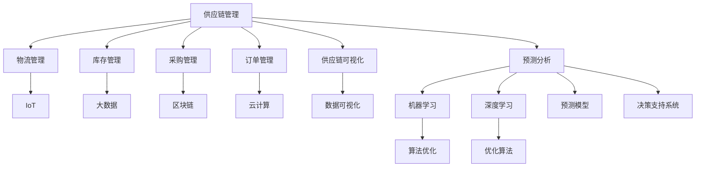

                 

### 1. 背景介绍

#### 1.1 目的和范围

本文的目的是深入探讨人工智能（AI）在供应链管理中的创新应用，分析其在供应链优化、预测和决策支持等方面的潜在价值。随着全球化和数字化进程的加速，供应链管理正面临着前所未有的挑战，包括复杂性增加、需求波动和供应链中断等问题。本文将详细探讨如何利用AI技术解决这些问题，提高供应链的透明度、灵活性和响应速度。

本文将涵盖以下范围：

1. **核心概念与联系**：介绍供应链管理的基本概念，以及AI技术在其中的应用和相互关系。
2. **核心算法原理**：详细阐述AI在供应链管理中的应用算法，包括机器学习、深度学习和优化算法。
3. **数学模型和公式**：介绍与AI应用相关的数学模型和公式，以及其在供应链管理中的实际应用。
4. **项目实战**：通过实际案例展示AI在供应链管理中的具体应用，并提供代码实现和详细解释。
5. **实际应用场景**：分析AI在供应链管理中的多种应用场景，以及在不同行业中的实际效果。
6. **工具和资源推荐**：推荐相关学习资源、开发工具和框架，以及经典论文和研究成果。
7. **总结**：总结AI在供应链管理中的应用趋势和面临的挑战。

通过本文的阅读，读者将能够：

- 理解AI在供应链管理中的基本概念和应用场景。
- 掌握AI在供应链管理中的应用算法和数学模型。
- 学习AI在供应链管理中的实际项目案例。
- 获得相关的学习资源和技术支持。

#### 1.2 预期读者

本文主要面向以下读者群体：

- **供应链管理从业者**：希望了解AI技术在供应链管理中的应用，提高供应链效率和响应速度。
- **AI技术研究者**：对AI技术在供应链管理中的应用感兴趣，希望深入探讨相关算法和模型。
- **计算机科学和工程学生**：希望了解AI技术在供应链管理中的实际应用，拓宽知识面。
- **企业高管和决策者**：关注供应链管理的创新和发展，希望了解AI技术对供应链管理的潜在影响。

#### 1.3 文档结构概述

本文将按照以下结构进行组织：

- **1. 背景介绍**：介绍本文的目的、范围、预期读者和文档结构。
- **2. 核心概念与联系**：介绍供应链管理的基本概念和AI技术在其中的应用。
- **3. 核心算法原理**：详细阐述AI在供应链管理中的应用算法和原理。
- **4. 数学模型和公式**：介绍与AI应用相关的数学模型和公式。
- **5. 项目实战**：通过实际案例展示AI在供应链管理中的应用。
- **6. 实际应用场景**：分析AI在供应链管理中的多种应用场景。
- **7. 工具和资源推荐**：推荐相关学习资源、开发工具和框架。
- **8. 总结**：总结AI在供应链管理中的应用趋势和挑战。
- **9. 附录**：常见问题与解答。
- **10. 扩展阅读**：提供进一步阅读的参考资料。

通过本文的阅读，读者将能够全面了解AI在供应链管理中的创新应用，为实际工作和研究提供有益的参考。

#### 1.4 术语表

在本文中，我们将使用一些专业术语和概念，为了确保读者能够准确理解，下面是这些术语的定义和解释：

##### 1.4.1 核心术语定义

- **供应链管理（Supply Chain Management）**：指企业通过计划、实施和控制产品的流通、服务和信息，从原材料供应商到最终消费者的全过程。其目标是实现高效、低成本和高响应速度的供应链。
- **人工智能（Artificial Intelligence, AI）**：一种模拟人类智能的技术，能够感知、学习、推理和决策，通过算法和模型实现自动化和智能化。
- **机器学习（Machine Learning, ML）**：一种AI技术，通过数据训练模型，使其能够自动学习和改进性能，常见的算法包括决策树、神经网络和支持向量机。
- **深度学习（Deep Learning, DL）**：一种复杂的机器学习算法，基于多层神经网络进行训练，能够处理大规模数据并自动提取特征。
- **优化算法（Optimization Algorithm）**：用于解决特定优化问题的一类算法，通过调整参数找到最优解，常见的算法包括遗传算法、粒子群优化和线性规划。
- **供应链可视化（Supply Chain Visualization）**：利用图形和数据可视化技术，展示供应链中的信息流、物流和资金流，帮助管理者进行决策。
- **预测分析（Predictive Analytics）**：利用历史数据和统计模型，预测未来事件和趋势，为决策提供依据。
- **供应链中断（Supply Chain Disruption）**：指供应链中某一环节发生故障或中断，导致供应链整体效率下降或中断。

##### 1.4.2 相关概念解释

- **大数据（Big Data）**：指无法用传统数据处理工具进行分析的数据集，具有大量（Volume）、高速（Velocity）、多样（Variety）和价值（Value）的特点。
- **物联网（Internet of Things, IoT）**：通过传感器、设备和网络，实现物体之间的互联互通，收集和传输数据，为供应链管理提供实时信息。
- **区块链（Blockchain）**：一种分布式数据库技术，通过加密和共识机制确保数据的安全和不可篡改，可用于供应链中的溯源和透明化。
- **云计算（Cloud Computing）**：通过互联网提供计算资源和服务，实现数据的存储、处理和分析，为供应链管理提供弹性和可扩展性。

##### 1.4.3 缩略词列表

- **AI**：人工智能（Artificial Intelligence）
- **ML**：机器学习（Machine Learning）
- **DL**：深度学习（Deep Learning）
- **IoT**：物联网（Internet of Things）
- **SCM**：供应链管理（Supply Chain Management）
- **ERP**：企业资源规划（Enterprise Resource Planning）
- **SaaS**：软件即服务（Software as a Service）
- **Blockchain**：区块链（Blockchain）
- **IoT**：物联网（Internet of Things）

通过上述术语表，读者可以更好地理解本文中的专业术语和概念，为后续内容的学习打下基础。在接下来的章节中，我们将深入探讨AI在供应链管理中的具体应用和实践。

---

在背景介绍章节中，我们明确了本文的目的、范围、预期读者和文档结构，并对一些关键术语进行了定义和解释。接下来，我们将通过一个Mermaid流程图来展示供应链管理中的核心概念和AI技术的联系。

这个流程图展示了供应链管理中的主要环节，以及AI技术在各个方面的应用。接下来，我们将详细介绍这些核心概念和算法原理，帮助读者全面了解AI在供应链管理中的创新应用。

