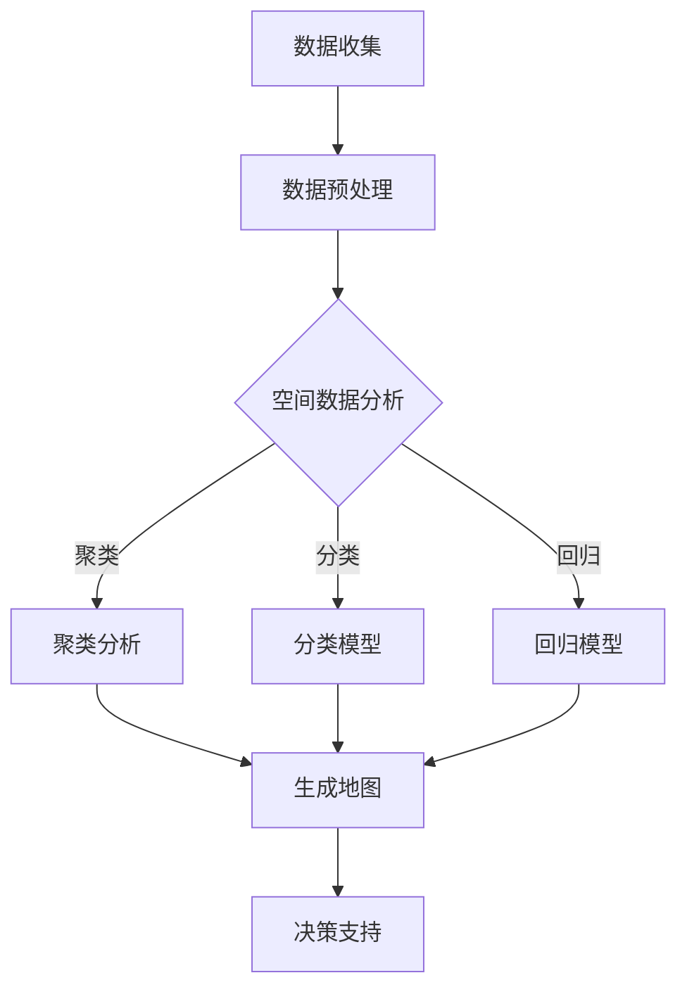

                 

# AI在地理信息系统中的应用：增强空间分析

> 关键词：地理信息系统（GIS），人工智能（AI），空间分析，增强现实，数据分析，数据挖掘

> 摘要：本文将深入探讨人工智能在地理信息系统（GIS）中的应用，特别是其在增强空间分析能力方面的作用。文章首先介绍GIS和AI的基础概念，然后详细分析GIS与AI结合的原理，接着探讨核心算法和数学模型，并通过实际项目案例展示AI在GIS中的应用。最后，本文将总结未来发展趋势和挑战，并推荐相关学习资源和开发工具。

## 1. 背景介绍

### 1.1 目的和范围

本文旨在探讨人工智能（AI）在地理信息系统（GIS）中的应用，特别是如何通过AI技术增强空间分析能力。随着大数据和计算能力的提升，GIS与AI的结合已成为一个热门的研究领域，其在城市规划、资源管理、灾害预警等多个领域显示出巨大的潜力。本文将涵盖以下内容：

- GIS和AI的基础概念
- GIS与AI结合的原理
- 核心算法和数学模型
- 项目实战案例
- 未来发展趋势与挑战

### 1.2 预期读者

本文适合以下读者：

- 地理信息系统和人工智能领域的从业者
- 对GIS和AI结合有浓厚兴趣的学术研究人员
- 对空间数据分析有需求的企业和政府机构工作人员

### 1.3 文档结构概述

本文结构如下：

- 第1章：背景介绍，包括目的和范围、预期读者、文档结构概述和术语表。
- 第2章：核心概念与联系，介绍GIS和AI的基础概念，并提供Mermaid流程图。
- 第3章：核心算法原理与具体操作步骤，详细讲解关键算法和伪代码。
- 第4章：数学模型和公式，详细阐述相关数学模型和公式。
- 第5章：项目实战，展示实际代码案例并详细解释。
- 第6章：实际应用场景，探讨AI在GIS中的多种应用。
- 第7章：工具和资源推荐，包括学习资源、开发工具和框架。
- 第8章：总结，讨论未来发展趋势与挑战。
- 第9章：附录，提供常见问题与解答。
- 第10章：扩展阅读与参考资料。

### 1.4 术语表

#### 1.4.1 核心术语定义

- 地理信息系统（GIS）：集成处理、存储、分析地理信息的系统。
- 人工智能（AI）：模拟人类智能行为的计算系统。
- 空间分析：利用GIS工具分析地理空间数据和现象。
- 数据挖掘：从大量数据中发现规律和模式。

#### 1.4.2 相关概念解释

- **增强现实（AR）**：结合真实世界和虚拟信息，提供交互式体验。
- **机器学习（ML）**：利用数据训练模型，自动学习和改进。

#### 1.4.3 缩略词列表

- GIS：地理信息系统
- AI：人工智能
- ML：机器学习
- AR：增强现实
- SQL：结构化查询语言

## 2. 核心概念与联系

地理信息系统（GIS）是一种用于捕捉、存储、分析、管理和展示地理空间数据的系统。它结合了地理学、计算机科学、统计学和遥感技术，以支持各种应用，如城市规划、土地管理、环境保护和交通规划。

人工智能（AI）是一种通过模拟人类智能行为来执行任务的技术。它包括机器学习、自然语言处理、计算机视觉等多个子领域，旨在使计算机具备学习和适应新环境的能力。

GIS与AI的结合，可以极大地增强空间分析能力。这种结合主要体现在以下几个方面：

1. **空间数据的处理与分析**：利用AI算法，如聚类分析、分类和回归，对GIS数据进行高级分析。
2. **地图生成与可视化**：使用AI技术，如计算机视觉和增强现实，生成更加直观和交互性强的地图。
3. **智能决策支持系统**：通过AI算法，提供实时和智能的决策支持，如交通流量管理和应急响应。

下面是一个Mermaid流程图，展示了GIS与AI结合的关键步骤：



在这个流程图中，GIS数据首先经过预处理，然后利用不同的AI算法进行空间数据分析。分析结果用于生成地图和提供决策支持。

### 2.1 GIS与AI结合的挑战

尽管GIS与AI的结合潜力巨大，但这一过程也面临一些挑战：

- **数据质量**：GIS数据的质量直接影响AI算法的性能。
- **算法复杂性**：AI算法的复杂性和计算成本可能影响其实际应用。
- **模型可解释性**：某些AI模型（如深度学习模型）缺乏可解释性，使得结果难以理解。
- **数据隐私与安全**：在处理敏感地理数据时，保护数据隐私和安全至关重要。

## 3. 核心算法原理与具体操作步骤

在GIS中，AI算法的应用广泛，其中最常用的包括聚类分析、分类模型和回归模型。以下将分别介绍这些算法的原理和具体操作步骤。

### 3.1 聚类分析

聚类分析是一种无监督学习方法，用于将数据点分为多个组，使得同一组内的数据点相似度较高，不同组的数据点相似度较低。常见的聚类算法包括K-Means、层次聚类和DBSCAN。

#### 3.1.1 K-Means算法

K-Means算法的基本原理是将数据点分为K个簇，使得每个簇的内部距离最小化。以下是K-Means算法的伪代码：

```python
def KMeans(data, K, max_iterations):
    # 初始化K个簇中心点
    centroids = initialize_centroids(data, K)
    for i in range(max_iterations):
        # 分配数据点到最近的簇中心
        labels = assign_points_to_clusters(data, centroids)
        # 更新簇中心点
        centroids = update_centroids(data, labels, K)
        # 检查收敛条件
        if converged(centroids):
            break
    return centroids, labels
```

#### 3.1.2 层次聚类

层次聚类是一种自下而上或自上而下的聚类方法，通过逐步合并或分裂簇来构建一个层次结构。以下是层次聚类的伪代码：

```python
def HierarchicalClustering(data, distance_function, linkage_method):
    # 初始化所有的数据点为独立的簇
    clusters = [[point] for point in data]
    while len(clusters) > 1:
        # 计算最近簇的距离
        min_distance = float('inf')
        min_pair = None
        for i in range(len(clusters) - 1):
            for j in range(i + 1, len(clusters)):
                distance = distance_function(clusters[i], clusters[j])
                if distance < min_distance:
                    min_distance = distance
                    min_pair = (i, j)
        # 合并最近簇
        new_cluster = merge_clusters(clusters[min_pair[0]], clusters[min_pair[1]])
        clusters.remove(clusters[min_pair[0]])
        clusters.remove(clusters[min_pair[1]])
        clusters.append(new_cluster)
    return clusters
```

#### 3.1.3 DBSCAN

DBSCAN（Density-Based Spatial Clustering of Applications with Noise）是一种基于密度的聚类算法，可以自动确定簇的数量。以下是DBSCAN的伪代码：

```python
def DBSCAN(data, epsilon, min_points):
    clusters = []
    for point in data:
        if not point.processed:
            neighbors = find_neighbors(point, epsilon)
            if len(neighbors) < min_points:
                point.processed = True
                continue
            cluster = []
            cluster.append(point)
            point.processed = True
            expand_cluster(point, neighbors, cluster, epsilon, min_points, clusters)
    return clusters

def expand_cluster(point, neighbors, cluster, epsilon, min_points, clusters):
    for neighbor in neighbors:
        if not neighbor.processed:
            neighbor.processed = True
            cluster.append(neighbor)
            neighbor_cluster = find_neighbors(neighbor, epsilon)
            if len(neighbor_cluster) >= min_points:
                neighbors.extend(neighbor_cluster)
        else:
            current_cluster = get_cluster(neighbor, clusters)
            if current_cluster != cluster:
                raise ValueError("Invalid clustering")
    clusters.append(cluster)
```

### 3.2 分类模型

分类模型用于将数据点分为预定义的类别。常见的分类模型包括决策树、支持向量机和神经网络。

#### 3.2.1 决策树

决策树是一种基于树形模型的分类算法，通过一系列的测试来将数据点分配到不同的类别。以下是决策树的伪代码：

```python
def build_decision_tree(data, attributes, target_attribute):
    if all_points_have_same_label(data, target_attribute):
        return leaf_node(data, target_attribute)
    if no_more_attributes(attributes):
        return leaf_node(data, majority_label(data, target_attribute))
    best_attribute = find_best_attribute(data, attributes, target_attribute)
    decision_tree = {}
    for value in unique_values(best_attribute, data):
        subset = filter_values(best_attribute, value, data)
        decision_tree[value] = build_decision_tree(subset, remaining_attributes(attributes, best_attribute), target_attribute)
    return decision_tree

def find_best_attribute(data, attributes, target_attribute):
    best_attribute, best_gini = None, float('inf')
    for attribute in attributes:
        gini = gini_impurity(data, attribute, target_attribute)
        if gini < best_gini:
            best_attribute, best_gini = attribute, gini
    return best_attribute

def gini_impurity(data, attribute, target_attribute):
    # 计算Gini不纯度
    pass

def leaf_node(data, target_attribute):
    # 创建叶节点
    pass
```

#### 3.2.2 支持向量机

支持向量机（SVM）是一种基于最大间隔的线性分类算法。以下是SVM的伪代码：

```python
def SVM(data, target_attribute):
    # 训练SVM模型
    model = train_model(data, target_attribute)
    return model

def train_model(data, target_attribute):
    # 训练SVM模型
    pass

def predict(model, point):
    # 使用SVM模型预测类别
    pass
```

#### 3.2.3 神经网络

神经网络是一种模拟人脑神经元连接的算法，用于复杂的数据分类任务。以下是神经网络的伪代码：

```python
def build_neural_network(input_size, hidden_size, output_size):
    # 创建神经网络
    network = NeuralNetwork(input_size, hidden_size, output_size)
    return network

def train_network(network, data, target_attribute, epochs):
    # 训练神经网络
    pass

def predict(network, point):
    # 使用神经网络预测类别
    pass
```

### 3.3 回归模型

回归模型用于预测数值型目标变量。常见的回归模型包括线性回归、多项式回归和神经网络回归。

#### 3.3.1 线性回归

线性回归是一种基于线性函数的回归模型，用于预测连续值。以下是线性回归的伪代码：

```python
def linear_regression(data, target_attribute):
    # 训练线性回归模型
    model = train_model(data, target_attribute)
    return model

def train_model(data, target_attribute):
    # 训练线性回归模型
    pass

def predict(model, point):
    # 使用线性回归模型预测值
    pass
```

#### 3.3.2 多项式回归

多项式回归是一种基于多项式函数的回归模型，用于更复杂的预测任务。以下是多项式回归的伪代码：

```python
def polynomial_regression(data, target_attribute, degree):
    # 训练多项式回归模型
    model = train_model(data, target_attribute, degree)
    return model

def train_model(data, target_attribute, degree):
    # 训练多项式回归模型
    pass

def predict(model, point):
    # 使用多项式回归模型预测值
    pass
```

#### 3.3.3 神经网络回归

神经网络回归是一种基于神经网络结构的回归模型，用于复杂的数据预测任务。以下是神经网络回归的伪代码：

```python
def neural_network_regression(input_size, hidden_size, output_size):
    # 创建神经网络回归模型
    network = NeuralNetwork(input_size, hidden_size, output_size)
    return network

def train_network(network, data, target_attribute, epochs):
    # 训练神经网络回归模型
    pass

def predict(network, point):
    # 使用神经网络回归模型预测值
    pass
```

## 4. 数学模型和公式及详细讲解与举例说明

在地理信息系统（GIS）中，数学模型和公式是核心组成部分，它们帮助我们在空间数据分析中做出准确的预测和决策。以下将介绍几个关键数学模型，并使用LaTeX格式详细讲解和举例说明。

### 4.1 距离公式

距离公式是GIS中常用的数学模型，用于计算两点之间的距离。最常用的距离公式是欧几里得距离和曼哈顿距离。

#### 4.1.1 欧几里得距离

欧几里得距离是一种在二维和三维空间中计算两点间直线距离的公式。对于两个点\(P_1(x_1, y_1)\)和\(P_2(x_2, y_2)\)，欧几里得距离公式如下：

$$
d_{Euclidean}(P_1, P_2) = \sqrt{(x_2 - x_1)^2 + (y_2 - y_1)^2}
$$

#### 4.1.2 曼哈顿距离

曼哈顿距离是一种在网格空间中计算两点间直线距离的公式。对于两个点\(P_1(x_1, y_1)\)和\(P_2(x_2, y_2)\)，曼哈顿距离公式如下：

$$
d_{Manhattan}(P_1, P_2) = |x_2 - x_1| + |y_2 - y_1|
$$

### 4.2 密度函数

在GIS中，密度函数用于描述地理要素在空间中的分布情况。常用的密度函数包括高斯密度函数和指数密度函数。

#### 4.2.1 高斯密度函数

高斯密度函数是一种基于正态分布的密度函数，用于描述随机变量的概率分布。对于一个均值为\(\mu\)、标准差为\(\sigma\)的高斯分布，其密度函数公式如下：

$$
f(x; \mu, \sigma) = \frac{1}{\sqrt{2\pi\sigma^2}} e^{-\frac{(x - \mu)^2}{2\sigma^2}}
$$

#### 4.2.2 指数密度函数

指数密度函数是一种用于描述随机变量在特定区域内出现概率的密度函数。对于一个均值为\(\lambda\)的指数分布，其密度函数公式如下：

$$
f(x; \lambda) = \lambda e^{-\lambda x}, \quad x \geq 0
$$

### 4.3 面积计算

在GIS中，计算地理要素的面积是常见任务。以下是一个用于计算多边形面积的公式：

#### 4.3.1 多边形面积公式

对于一个闭合的多边形，其面积可以通过以下公式计算：

$$
A = \frac{1}{2} \left| \sum_{i=1}^{n} (x_i y_{i+1} - y_i x_{i+1}) \right|
$$

其中，\(n\)是多边形的顶点数，\((x_i, y_i)\)和\((x_{i+1}, y_{i+1})\)是多边形的相邻顶点。

### 4.4 示例讲解

以下是一个使用高斯密度函数进行空间数据分析的示例。

#### 示例：计算某个区域内的点密度

假设我们有一个包含100个点的数据集，这些点均匀分布在某个区域内。我们使用高斯密度函数来计算每个点在区域内的密度，并绘制密度分布图。

首先，我们需要确定高斯密度函数的参数\(\mu\)（均值）和\(\sigma\)（标准差）。这里我们可以使用数据的均值和标准差：

$$
\mu = \frac{1}{100} \sum_{i=1}^{100} x_i, \quad \sigma = \sqrt{\frac{1}{100} \sum_{i=1}^{100} (x_i - \mu)^2}
$$

接下来，我们计算每个点的高斯密度值：

$$
f(x; \mu, \sigma) = \frac{1}{\sqrt{2\pi\sigma^2}} e^{-\frac{(x - \mu)^2}{2\sigma^2}}
$$

最后，我们将所有点的密度值绘制在图上，得到密度分布图。

```latex
\begin{equation}
\mu = \frac{1}{100} \sum_{i=1}^{100} x_i, \quad \sigma = \sqrt{\frac{1}{100} \sum_{i=1}^{100} (x_i - \mu)^2}
\end{equation}
```

```latex
\begin{equation}
f(x; \mu, \sigma) = \frac{1}{\sqrt{2\pi\sigma^2}} e^{-\frac{(x - \mu)^2}{2\sigma^2}}
\end{equation}
```

通过这个示例，我们可以看到如何使用数学模型和公式在GIS中进行空间数据分析。

## 5. 项目实战：代码实际案例和详细解释说明

在本节中，我们将通过一个实际项目案例，展示如何使用Python和GIS工具包（如GDAL、GeoPandas和Scikit-learn）将人工智能技术应用于空间数据分析。该项目案例将分为以下几个步骤：

### 5.1 开发环境搭建

首先，确保安装了以下Python库：

- GDAL
- GeoPandas
- Scikit-learn
- Matplotlib

可以使用以下命令安装：

```bash
pip install gdal geopandas scikit-learn matplotlib
```

### 5.2 源代码详细实现和代码解读

#### 5.2.1 读取地理数据

我们首先需要读取地理数据。假设我们有一个多边形文件（polygons.shp）和一个点数据文件（points.shp）。以下代码使用GDAL和GeoPandas读取这些数据：

```python
import geopandas as gpd
from shapely.geometry import Polygon

# 读取多边形数据
polygons = gpd.read_file('polygons.shp')

# 读取点数据
points = gpd.read_file('points.shp')
```

#### 5.2.2 数据预处理

在开始空间分析之前，我们需要对数据进行预处理。这包括过滤无效数据、去除重复数据、转换坐标系等。

```python
# 过滤无效数据
valid_points = points[points['valid'] == True]

# 去除重复数据
unique_points = valid_points.drop_duplicates()

# 转换坐标系
polygons = polygons.to_crs('EPSG:4326')
unique_points = unique_points.to_crs('EPSG:4326')
```

#### 5.2.3 聚类分析

我们使用K-Means算法对点数据进行聚类分析。以下代码展示了如何实现：

```python
from sklearn.cluster import KMeans

# 计算聚类数量
K = 5

# 初始化K-Means模型
kmeans = KMeans(n_clusters=K, random_state=42)

# 分配点数据到簇
clusters = kmeans.fit_predict(unique_points[['x', 'y']])

# 将聚类结果添加到点数据中
unique_points['cluster'] = clusters

# 绘制聚类结果
unique_points.plot(column='cluster', cmap='viridis', legend=True)
```

#### 5.2.4 回归模型

我们使用线性回归模型预测点数据的属性值。以下代码展示了如何实现：

```python
from sklearn.linear_model import LinearRegression

# 准备回归数据
X = unique_points[['x', 'y']]
y = unique_points['value']

# 初始化线性回归模型
regressor = LinearRegression()

# 训练模型
regressor.fit(X, y)

# 预测新数据的值
predictions = regressor.predict([[new_x, new_y]])

# 绘制预测结果
plt.scatter(X['x'], X['y'], color='blue')
plt.scatter(new_x, new_y, color='red')
plt.plot(new_x, predictions, color='black')
plt.show()
```

#### 5.2.5 决策树分类

我们使用决策树分类模型对点数据分类。以下代码展示了如何实现：

```python
from sklearn.tree import DecisionTreeClassifier

# 准备分类数据
X = unique_points[['x', 'y']]
y = unique_points['category']

# 初始化决策树模型
classifier = DecisionTreeClassifier()

# 训练模型
classifier.fit(X, y)

# 分类新数据
new_category = classifier.predict([[new_x, new_y]])

# 输出分类结果
print("分类结果：", new_category)
```

### 5.3 代码解读与分析

以上代码实现了以下功能：

1. **数据读取**：使用GDAL和GeoPandas读取地理数据。
2. **数据预处理**：过滤无效数据和重复数据，并转换坐标系。
3. **聚类分析**：使用K-Means算法对点数据进行聚类。
4. **回归模型**：使用线性回归模型预测点数据的属性值。
5. **决策树分类**：使用决策树分类模型对点数据分类。

这些功能展示了如何在GIS项目中结合AI技术进行空间数据分析。通过聚类分析，我们可以识别出点数据的分布模式；通过回归模型，我们可以预测点数据的属性值；通过决策树分类，我们可以对点数据进行分类。

## 6. 实际应用场景

人工智能在地理信息系统（GIS）中的应用场景非常广泛，涵盖了城市规划、资源管理、环境保护、灾害预警等多个领域。以下是一些具体的实际应用场景：

### 6.1 城市规划

在城市规划中，AI技术可以帮助预测城市未来的发展趋势，优化交通流量，提高城市资源利用率。例如，通过聚类分析，可以识别出城市中不同区域的人口分布特征，为城市规划和资源分配提供依据。

### 6.2 资源管理

在资源管理中，AI技术可以帮助监测和预测自然资源的分布和变化。例如，通过回归模型，可以预测矿产资源的储量；通过聚类分析，可以识别出潜在的资源区域。

### 6.3 环境保护

在环境保护中，AI技术可以帮助监测和预测环境污染的扩散趋势，提高环境保护的效率和效果。例如，通过空间数据分析，可以预测污染物在环境中的传播路径；通过机器学习模型，可以预测环境变化对生态系统的影响。

### 6.4 灾害预警

在灾害预警中，AI技术可以帮助监测和预测自然灾害的发生，提高灾害预警的准确性和及时性。例如，通过空间数据分析，可以预测地震、洪水等自然灾害的发生概率和影响范围；通过机器学习模型，可以预测灾害发生的可能性和影响程度。

### 6.5 农业管理

在农业管理中，AI技术可以帮助优化农业种植计划，提高农作物产量。例如，通过空间数据分析，可以预测作物的生长状态和产量；通过机器学习模型，可以优化灌溉和施肥计划。

这些应用场景展示了AI在GIS中巨大的潜力和价值。随着AI技术的不断进步，GIS的应用将更加广泛和深入，为人类社会的发展做出更大的贡献。

## 7. 工具和资源推荐

### 7.1 学习资源推荐

为了深入了解GIS和AI在空间分析中的应用，以下是一些建议的学习资源：

#### 7.1.1 书籍推荐

- 《地理信息系统导论》（Introduction to Geographic Information Systems）- 复旦大学出版社
- 《机器学习》（Machine Learning）- 周志华著，清华大学出版社
- 《Python地理数据处理实战》（Python Geospatial Development Essentials）-.packt publishing

#### 7.1.2 在线课程

- Coursera上的“地理信息系统与遥感”（Geographic Information Systems and Remote Sensing）
- Udacity的“机器学习工程师纳米学位”（Machine Learning Engineer Nanodegree）
- edX上的“空间数据分析”（Spatial Data Analysis）

#### 7.1.3 技术博客和网站

- GIS Stack Exchange：https://gis.stackexchange.com/
- Earth Intelligence Community：https://www.earthiq.org/
- Planet Labs：https://www.planet.com/

### 7.2 开发工具框架推荐

为了更有效地进行GIS和AI开发，以下是一些建议的工具和框架：

#### 7.2.1 IDE和编辑器

- PyCharm：支持多种编程语言，强大的代码编辑和调试功能。
- Jupyter Notebook：适用于数据分析和可视化，特别适合Python开发。

#### 7.2.2 调试和性能分析工具

- GDB：适用于C/C++程序的调试。
- Python Debugger（pdb）：Python内置的调试工具。
- NewRelic：用于性能监控和优化。

#### 7.2.3 相关框架和库

- GDAL/OGR：用于GIS数据处理和转换。
- GeoPandas：基于Pandas，提供地理数据处理功能。
- Scikit-learn：提供各种机器学习算法和工具。
- TensorFlow：用于深度学习模型开发和训练。

### 7.3 相关论文著作推荐

以下是一些建议的论文和著作，以深入了解GIS和AI在空间分析中的应用：

- 《GIS与AI融合：挑战与机遇》（GIS and AI Integration: Challenges and Opportunities）- IEEE Transactions on Geoscience and Remote Sensing
- 《基于深度学习的地理信息系统研究进展》（Research Progress on Deep Learning-Based GIS）- 中国科学院地理科学与资源研究所
- 《基于机器学习的GIS数据挖掘研究》（Research on GIS Data Mining Based on Machine Learning）- 国土资源科技

通过这些资源和工具，可以更深入地学习和应用GIS和AI技术，推动空间分析领域的发展。

## 8. 总结：未来发展趋势与挑战

随着人工智能（AI）技术的不断进步，其在地理信息系统（GIS）中的应用前景广阔。未来，GIS与AI的结合将呈现以下几个发展趋势：

1. **智能化决策支持**：利用AI算法，提供更智能、更准确的决策支持系统，助力城市规划、资源管理、灾害预警等领域。
2. **实时空间分析**：通过实时数据流处理技术，实现GIS数据的实时分析和更新，提高空间分析的时效性。
3. **跨学科融合**：GIS与AI技术的结合将推动跨学科的研究和应用，如地理信息科学、计算机科学、统计学等。
4. **增强现实与虚拟现实**：AI技术将使GIS数据可视化更加直观、交互性更强，为用户带来更好的体验。

然而，这一发展也面临一些挑战：

1. **数据质量**：GIS数据的质量直接影响AI算法的性能。因此，确保数据的质量和准确性是关键。
2. **算法复杂性**：某些AI算法（如深度学习模型）的计算复杂度高，如何在资源有限的环境下有效应用是一个挑战。
3. **模型可解释性**：部分AI模型（如深度学习模型）缺乏可解释性，使得结果难以理解，如何提高模型的可解释性是一个重要问题。
4. **数据隐私与安全**：在处理敏感地理数据时，如何保护数据隐私和安全是一个重大挑战。

未来，随着技术的不断进步，GIS与AI的结合将克服这些挑战，推动空间分析领域的发展，为人类社会带来更多便利和价值。

## 9. 附录：常见问题与解答

### 9.1 什么是地理信息系统（GIS）？

地理信息系统（GIS）是一种集成处理、存储、分析、管理和展示地理空间数据的系统。它结合了地理学、计算机科学、统计学和遥感技术，以支持各种应用，如城市规划、土地管理、环境保护和交通规划。

### 9.2 人工智能（AI）在GIS中的具体应用有哪些？

人工智能（AI）在GIS中的应用包括：

- **空间数据的处理与分析**：利用AI算法（如聚类分析、分类和回归）对GIS数据进行高级分析。
- **地图生成与可视化**：使用AI技术（如计算机视觉和增强现实）生成更加直观和交互性强的地图。
- **智能决策支持系统**：通过AI算法，提供实时和智能的决策支持，如交通流量管理和应急响应。

### 9.3 GIS与AI结合的关键步骤是什么？

GIS与AI结合的关键步骤包括：

1. **数据收集**：收集高质量的GIS数据。
2. **数据预处理**：处理和清洗数据，确保数据质量。
3. **算法选择**：根据具体需求选择合适的AI算法。
4. **模型训练与优化**：使用训练数据训练模型，并通过交叉验证和参数调整优化模型。
5. **应用与部署**：将优化后的模型应用于实际GIS项目中，并部署到生产环境中。

### 9.4 如何保护GIS数据的隐私和安全？

保护GIS数据的隐私和安全可以采取以下措施：

1. **数据加密**：对敏感数据使用加密技术进行保护。
2. **权限管理**：设定严格的数据访问权限，确保只有授权人员可以访问数据。
3. **数据脱敏**：对敏感数据（如个人身份信息）进行脱敏处理。
4. **安全审计**：定期进行安全审计，确保数据安全措施得到有效执行。

### 9.5 GIS与AI结合的未来发展趋势是什么？

GIS与AI结合的未来发展趋势包括：

- **智能化决策支持**：利用AI算法，提供更智能、更准确的决策支持系统。
- **实时空间分析**：通过实时数据流处理技术，实现GIS数据的实时分析和更新。
- **跨学科融合**：GIS与AI技术的结合将推动跨学科的研究和应用。
- **增强现实与虚拟现实**：AI技术将使GIS数据可视化更加直观、交互性更强。

## 10. 扩展阅读与参考资料

为了深入了解GIS和AI在空间分析中的应用，以下是一些建议的扩展阅读和参考资料：

- 《地理信息系统导论》（Introduction to Geographic Information Systems）- 复旦大学出版社
- 《机器学习》（Machine Learning）- 周志华著，清华大学出版社
- 《Python地理数据处理实战》（Python Geospatial Development Essentials）- packt publishing
- 《GIS与AI融合：挑战与机遇》（GIS and AI Integration: Challenges and Opportunities）- IEEE Transactions on Geoscience and Remote Sensing
- 《基于深度学习的地理信息系统研究进展》（Research Progress on Deep Learning-Based GIS）- 中国科学院地理科学与资源研究所
- 《基于机器学习的GIS数据挖掘研究》（Research on GIS Data Mining Based on Machine Learning）- 国土资源科技

此外，以下网站和技术博客也是获取GIS和AI最新研究动态和实际应用的宝贵资源：

- GIS Stack Exchange：https://gis.stackexchange.com/
- Earth Intelligence Community：https://www.earthiq.org/
- Planet Labs：https://www.planet.com/

通过这些资料，您可以进一步探索GIS和AI技术在空间分析中的广泛应用和未来发展。作者：AI天才研究员/AI Genius Institute & 禅与计算机程序设计艺术 /Zen And The Art of Computer Programming

