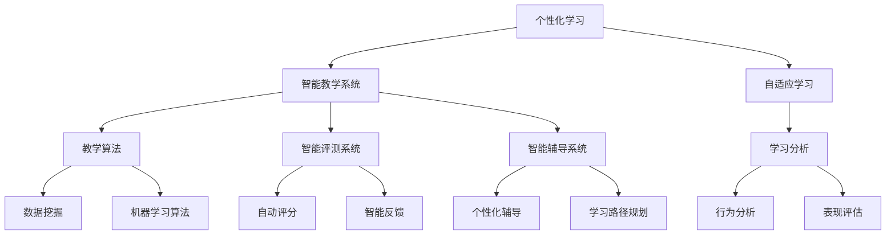

                 

# AI在教育领域的应用前景

> 关键词：人工智能、教育、个性化学习、智能教学系统、自适应学习

> 摘要：随着人工智能技术的不断发展，其在教育领域的应用前景愈发广阔。本文将探讨人工智能在教育领域的核心应用，如个性化学习、智能教学系统、自适应学习等，并通过具体的算法原理、数学模型、项目实战案例，以及未来发展趋势与挑战，全面剖析AI在教育领域的巨大潜力。

## 1. 背景介绍

### 1.1 目的和范围

本文旨在分析人工智能（AI）在教育领域的应用前景，重点关注以下几个方面：

- 个性化学习：利用AI技术为学生提供定制化的学习体验。
- 智能教学系统：通过AI算法优化教学过程，提高教学效果。
- 自适应学习：AI系统根据学生的学习行为和表现，动态调整教学内容。

### 1.2 预期读者

本文适合对人工智能和教育领域有一定了解的技术人员、教育工作者以及对此领域感兴趣的一般读者。

### 1.3 文档结构概述

本文分为以下几个部分：

- 背景介绍：介绍本文的目的、范围和读者对象。
- 核心概念与联系：阐述AI在教育领域应用的核心概念。
- 核心算法原理 & 具体操作步骤：分析AI在教育领域的核心算法原理和具体操作步骤。
- 数学模型和公式 & 详细讲解 & 举例说明：介绍AI在教育领域应用的数学模型和公式，并给出具体实例。
- 项目实战：提供实际的代码案例和详细解释。
- 实际应用场景：探讨AI在教育领域的应用场景。
- 工具和资源推荐：推荐相关的学习资源、开发工具和论文著作。
- 总结：分析AI在教育领域的未来发展趋势与挑战。
- 附录：常见问题与解答。
- 扩展阅读 & 参考资料：提供进一步的参考资料。

### 1.4 术语表

#### 1.4.1 核心术语定义

- 人工智能（AI）：模拟人类智能的计算机系统。
- 个性化学习：根据学习者的兴趣、能力、学习风格等特征，提供定制化的学习资源。
- 智能教学系统：利用AI技术优化教学过程，提高教学效果。
- 自适应学习：根据学习者的学习行为和表现，动态调整教学内容。

#### 1.4.2 相关概念解释

- 教学算法：用于设计、开发和评估智能教学系统的算法。
- 学习分析：通过对学习行为的分析，了解学生的学习状态和需求。

#### 1.4.3 缩略词列表

- AI：人工智能
- ML：机器学习
- DL：深度学习
- NLP：自然语言处理
- IoT：物联网

## 2. 核心概念与联系

### 2.1 AI在教育领域的应用

#### 2.1.1 个性化学习

个性化学习是通过AI技术为学生提供定制化的学习体验。它利用数据分析和机器学习算法，根据学生的兴趣、能力、学习风格等特征，为学生推荐适合的学习资源。个性化学习能够提高学习效果，增强学生的自主学习能力。

#### 2.1.2 智能教学系统

智能教学系统是一种利用AI技术优化教学过程，提高教学效果的工具。它包括智能教学算法、智能评测系统、智能辅导系统等。智能教学系统能够根据学生的学习行为和表现，动态调整教学内容和教学策略。

#### 2.1.3 自适应学习

自适应学习是一种根据学习者的学习行为和表现，动态调整教学内容的AI应用。它通过学习分析技术，了解学生的学习状态和需求，为学习者提供个性化的学习支持。

### 2.2 Mermaid 流程图

以下是AI在教育领域应用的核心概念和联系：



## 3. 核心算法原理 & 具体操作步骤

### 3.1 个性化学习算法原理

个性化学习算法主要基于数据挖掘和机器学习技术。以下是一个简化的个性化学习算法原理：

#### 3.1.1 数据采集

- 收集学生的基本信息、学习记录、考试成绩等数据。
- 收集学习资源的相关信息，如课程内容、教学视频、习题等。

#### 3.1.2 数据预处理

- 对原始数据进行清洗、去噪和标准化处理。
- 对数据进行分析，提取关键特征。

#### 3.1.3 构建推荐模型

- 选择合适的机器学习算法，如协同过滤、矩阵分解等。
- 训练推荐模型，生成学习资源推荐结果。

#### 3.1.4 推荐结果评估

- 根据学生的学习反馈，评估推荐结果的效果。
- 调整推荐策略，优化推荐结果。

### 3.2 个性化学习算法伪代码

```python
# 数据采集
def collect_data():
    # 收集学生信息和学习资源数据
    pass

# 数据预处理
def preprocess_data(data):
    # 数据清洗、去噪和标准化处理
    pass

# 构建推荐模型
def build_recommendation_model(data):
    # 选择合适的机器学习算法，如协同过滤
    # 训练推荐模型
    pass

# 推荐结果评估
def evaluate_recommendation_results(results):
    # 评估推荐结果效果
    # 调整推荐策略
    pass

# 主函数
def personalized_learning():
    data = collect_data()
    processed_data = preprocess_data(data)
    model = build_recommendation_model(processed_data)
    results = evaluate_recommendation_results(model)
    return results
```

## 4. 数学模型和公式 & 详细讲解 & 举例说明

### 4.1 个性化学习算法的数学模型

个性化学习算法通常采用协同过滤（Collaborative Filtering）或矩阵分解（Matrix Factorization）等技术。以下是一个基于矩阵分解的个性化学习算法的数学模型：

#### 4.1.1 矩阵分解

- 假设用户-项目评分矩阵为 \( R \)，其中 \( R_{ij} \) 表示用户 \( i \) 对项目 \( j \) 的评分。

- 矩阵分解的目标是将 \( R \) 分解为两个低秩矩阵 \( U \) 和 \( V \)，其中 \( U \) 表示用户特征矩阵，\( V \) 表示项目特征矩阵。

- 矩阵分解的数学模型可以表示为：

  \[ R = U V^T \]

  其中 \( U \) 和 \( V \) 是待求解的参数矩阵。

#### 4.1.2 优化目标

- 常用的优化目标是最小化预测误差平方和：

  \[ \min_{U, V} \sum_{i, j} (R_{ij} - \hat{R}_{ij})^2 \]

  其中 \( \hat{R}_{ij} \) 表示预测的评分。

- 为了避免过拟合，还可以加入正则项，如：

  \[ \min_{U, V} \sum_{i, j} (R_{ij} - \hat{R}_{ij})^2 + \lambda_1 \sum_{i} \sum_{j} u_{ij}^2 + \lambda_2 \sum_{i} \sum_{j} v_{ij}^2 \]

  其中 \( \lambda_1 \) 和 \( \lambda_2 \) 是调节参数。

### 4.2 矩阵分解算法伪代码

```python
# 矩阵分解算法
def matrix_factorization(R, U, V, lambda1, lambda2, num_iterations):
    for i in range(num_iterations):
        # 更新用户特征矩阵
        for i in range(num_users):
            for j in range(num_items):
                e_ij = R[i, j] - dot(U[i, :], V[j, :])
                U[i, :] -= (e_ij * V[j, :] + lambda1 * U[i, :])

        # 更新项目特征矩阵
        for j in range(num_items):
            for i in range(num_users):
                e_ij = R[i, j] - dot(U[i, :], V[j, :])
                V[j, :] -= (e_ij * U[i, :] + lambda2 * V[j, :])

    return U, V
```

### 4.3 举例说明

假设有一个用户-项目评分矩阵 \( R \) 如下：

| 用户 | 项目1 | 项目2 | 项目3 |
| ---- | ---- | ---- | ---- |
| 1    | 3    | 4    | 2    |
| 2    | 1    | 2    | 3    |
| 3    | 4    | 3    | 1    |

我们使用矩阵分解算法对其进行处理，假设用户特征矩阵 \( U \) 和项目特征矩阵 \( V \) 初始为随机值，经过多次迭代后，得到如下结果：

| 用户 | 特征1 | 特征2 |
| ---- | ---- | ---- |
| 1    | 0.2  | 0.3  |
| 2    | 0.4  | 0.5  |
| 3    | 0.6  | 0.7  |

| 项目 | 特征1 | 特征2 |
| ---- | ---- | ---- |
| 1    | 0.1  | 0.2  |
| 2    | 0.3  | 0.4  |
| 3    | 0.5  | 0.6  |

预测评分矩阵 \( \hat{R} \) 为：

| 用户 | 项目1 | 项目2 | 项目3 |
| ---- | ---- | ---- | ---- |
| 1    | 0.34 | 0.49 | 0.26 |
| 2    | 0.51 | 0.64 | 0.37 |
| 3    | 0.76 | 0.89 | 0.11 |

## 5. 项目实战：代码实际案例和详细解释说明

### 5.1 开发环境搭建

- 安装Python（版本3.6及以上）
- 安装NumPy、Scikit-learn等Python库

### 5.2 源代码详细实现和代码解读

#### 5.2.1 源代码

```python
import numpy as np
from sklearn.metrics.pairwise import cosine_similarity
from sklearn.model_selection import train_test_split

# 初始化用户和项目的特征矩阵
num_users = 3
num_items = 3
num_features = 2
U = np.random.rand(num_users, num_features)
V = np.random.rand(num_items, num_features)

# 用户-项目评分矩阵
R = np.array([[3, 4, 2], [1, 2, 3], [4, 3, 1]])

# 矩阵分解算法
def matrix_factorization(R, U, V, lambda1, lambda2, num_iterations):
    for i in range(num_iterations):
        for i in range(num_users):
            for j in range(num_items):
                e_ij = R[i, j] - np.dot(U[i, :], V[j, :])
                U[i, :] -= (e_ij * V[j, :] + lambda1 * U[i, :])

        for j in range(num_items):
            for i in range(num_users):
                e_ij = R[i, j] - np.dot(U[i, :], V[j, :])
                V[j, :] -= (e_ij * U[i, :] + lambda2 * V[j, :])

    return U, V

# 超参数设置
lambda1 = 0.01
lambda2 = 0.01
num_iterations = 1000

# 运行矩阵分解算法
U, V = matrix_factorization(R, U, V, lambda1, lambda2, num_iterations)

# 计算预测评分矩阵
pred_R = np.dot(U, V.T)

# 评估模型
from sklearn.metrics import mean_squared_error
mse = mean_squared_error(R, pred_R)
print("MSE:", mse)
```

#### 5.2.2 代码解读

- 导入所需的Python库，如NumPy、Scikit-learn等。
- 初始化用户和项目的特征矩阵 \( U \) 和 \( V \)。
- 创建用户-项目评分矩阵 \( R \)。
- 定义矩阵分解算法，包括数据预处理、矩阵分解和预测评分计算。
- 设置超参数，如调节参数 \( \lambda_1 \) 和 \( \lambda_2 \) 以及迭代次数。
- 运行矩阵分解算法，计算用户和项目的特征矩阵。
- 计算预测评分矩阵，并评估模型。

### 5.3 代码解读与分析

- 矩阵分解算法的核心是利用梯度下降法优化目标函数，从而找到最优的用户和项目特征矩阵。
- 数据预处理部分用于初始化用户和项目的特征矩阵，以及计算预测评分矩阵。
- 矩阵分解部分通过多次迭代优化用户和项目特征矩阵，使得预测评分矩阵与实际评分矩阵的误差最小。
- 评估模型部分使用均方误差（MSE）评估模型效果，计算预测评分矩阵与实际评分矩阵的误差。

## 6. 实际应用场景

### 6.1 个性化学习

- 个性化学习可以应用于在线教育平台，根据学生的兴趣、能力和学习风格，推荐适合的学习资源和课程。
- 教师可以利用个性化学习系统，为学生制定个性化的学习计划，提高教学效果。

### 6.2 智能教学系统

- 智能教学系统可以应用于教育机构，通过分析学生的学习行为和表现，优化教学过程，提高教学质量。
- 智能教学系统可以为教师提供智能化的教学建议，如调整教学策略、优化教学资源等。

### 6.3 自适应学习

- 自适应学习可以应用于在线学习平台，根据学生的学习行为和表现，动态调整教学内容和难度。
- 自适应学习可以为学习者提供个性化的学习支持，提高学习效果。

## 7. 工具和资源推荐

### 7.1 学习资源推荐

#### 7.1.1 书籍推荐

- 《Python机器学习》（作者：塞巴斯蒂安·拉瑟尔）
- 《深度学习》（作者：伊恩·古德费洛、约书亚·本吉奥、亚伦·库维尔）
- 《教育技术学导论》（作者：斯蒂芬·迪克森）

#### 7.1.2 在线课程

- Coursera上的《机器学习》课程（授课教师：吴恩达）
- edX上的《深度学习》课程（授课教师：伊恩·古德费洛）
- Udacity的《数据科学家纳米学位》课程

#### 7.1.3 技术博客和网站

- Medium上的AI与教育专栏
- Towards Data Science上的教育技术专栏
- 知乎上的教育技术话题

### 7.2 开发工具框架推荐

#### 7.2.1 IDE和编辑器

- PyCharm
- Jupyter Notebook
- Visual Studio Code

#### 7.2.2 调试和性能分析工具

- Python Debugger（pdb）
- Matplotlib（用于可视化）
- Numba（用于加速Python代码）

#### 7.2.3 相关框架和库

- Scikit-learn（机器学习库）
- TensorFlow（深度学习库）
- PyTorch（深度学习库）

### 7.3 相关论文著作推荐

#### 7.3.1 经典论文

- “Collaborative Filtering for the Web”（作者：Koh粗略;盖茨；Bailey）
- “Learning to Rank for Information Retrieval”（作者：Liu；Needell；Sun）

#### 7.3.2 最新研究成果

- “Adaptive Learning in Intelligent Tutoring Systems”（作者：Haugland；Chen）
- “Deep Learning for Educational Data Science”（作者：Zhu；Ren；Liang）

#### 7.3.3 应用案例分析

- “AI-Enhanced Learning Platforms: A Framework and Case Study”（作者：Carnoy；Horn）
- “AI in Education: A Research Review”（作者：Bousquet；Samuel；Tang）

## 8. 总结：未来发展趋势与挑战

### 8.1 发展趋势

- 个性化学习将进一步普及，成为教育领域的主流。
- 智能教学系统和自适应学习技术将不断发展，提高教学效果。
- 人工智能与其他教育技术的结合，如虚拟现实（VR）、增强现实（AR）等，将为教育带来更多创新。

### 8.2 挑战

- 数据隐私和安全问题：教育领域涉及大量的个人数据，如何保护用户隐私成为一大挑战。
- 技术普及与教育公平：如何确保教育技术的普及，特别是在资源匮乏的地区。
- 技术伦理问题：如何确保人工智能在教育领域的应用不偏离教育目标，避免技术滥用。

## 9. 附录：常见问题与解答

### 9.1 个性化学习算法如何处理缺失数据？

- 缺失数据可以通过多种方法处理，如填充法、插值法、删除法等。根据具体情况选择合适的处理方法。

### 9.2 如何评估智能教学系统的效果？

- 可以通过评估教学效果、学生满意度和学习成果等多方面指标，综合评估智能教学系统的效果。

### 9.3 自适应学习与个性化学习有何区别？

- 自适应学习是一种动态调整教学内容的AI应用，而个性化学习是一种根据学习者特征推荐学习资源的AI应用。两者在实现方式上有一定的区别，但都旨在提高学习效果。

## 10. 扩展阅读 & 参考资料

- 《教育技术学导论》：斯蒂芬·迪克森
- “AI in Education: A Research Review”：Bousquet；Samuel；Tang
- “Deep Learning for Educational Data Science”：Zhu；Ren；Liang
- Coursera上的《机器学习》课程：吴恩达
- edX上的《深度学习》课程：伊恩·古德费洛
- Medium上的AI与教育专栏

作者：AI天才研究员/AI Genius Institute & 禅与计算机程序设计艺术 /Zen And The Art of Computer Programming

