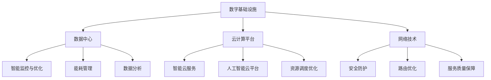

                 

# AI在数字基础设施中的实际应用

> 关键词：人工智能，数字基础设施，应用场景，算法原理，数学模型，项目实战

> 摘要：本文将探讨人工智能在数字基础设施中的实际应用，包括其核心概念、算法原理、数学模型和项目实战。通过分析人工智能在数字基础设施中的应用，读者可以深入了解如何将AI技术应用于实际问题，从而提升基础设施的智能化水平和效率。

## 1. 背景介绍

### 1.1 目的和范围

本文旨在探讨人工智能（AI）在数字基础设施中的应用，分析其核心概念、算法原理、数学模型和实际案例。通过本文的阅读，读者可以了解AI在数字基础设施中的重要作用，掌握相关技术原理，并为未来的应用提供指导。

### 1.2 预期读者

本文适合以下读者群体：

1. 计算机科学和人工智能专业的研究生和本科生。
2. 从事数字基础设施建设的工程师和技术人员。
3. 对AI在数字基础设施应用领域感兴趣的科研人员和开发者。

### 1.3 文档结构概述

本文分为以下几个部分：

1. 背景介绍：介绍本文的目的、预期读者、文档结构和术语表。
2. 核心概念与联系：阐述数字基础设施和人工智能的核心概念，并绘制Mermaid流程图。
3. 核心算法原理 & 具体操作步骤：详细解释AI在数字基础设施中的应用算法原理和操作步骤。
4. 数学模型和公式 & 详细讲解 & 举例说明：介绍AI在数字基础设施中的数学模型和公式，并给出具体实例。
5. 项目实战：提供实际项目案例，详细解释代码实现和代码解读。
6. 实际应用场景：分析AI在数字基础设施中的实际应用场景。
7. 工具和资源推荐：推荐相关学习资源和开发工具。
8. 总结：展望AI在数字基础设施中的未来发展趋势与挑战。
9. 附录：常见问题与解答。
10. 扩展阅读 & 参考资料：提供扩展阅读材料和参考文献。

### 1.4 术语表

#### 1.4.1 核心术语定义

- 数字基础设施：指为人类社会提供数字化服务的基础设施，包括网络、数据中心、云计算平台等。
- 人工智能：指模拟、延伸和扩展人的智能的理论、方法、技术及应用。
- 算法：解决特定问题的系统方法和步骤。

#### 1.4.2 相关概念解释

- 数据中心：提供存储、计算、网络等资源，以支持企业应用和服务的设施。
- 云计算：通过互联网提供动态易扩展且经常是虚拟化的资源。
- 深度学习：一种机器学习技术，通过多层神经网络来学习数据特征。

#### 1.4.3 缩略词列表

- AI：人工智能
- ML：机器学习
- DL：深度学习
- DC：数据中心
- CNT：计算机网络技术

## 2. 核心概念与联系

### 2.1 数字基础设施概述

数字基础设施是现代社会发展的基石，涵盖了网络、数据中心、云计算平台等多个领域。这些基础设施为企业和个人提供了高效、可靠、可扩展的数字化服务。随着人工智能技术的不断发展，AI在数字基础设施中的应用越来越广泛，成为推动数字基础设施智能化升级的关键力量。

### 2.2 人工智能核心概念

人工智能（AI）是一种模拟、延伸和扩展人类智能的理论、方法、技术及应用。AI的核心目标是让机器具备人类智能，能够自主思考、学习、决策和行动。AI主要包括以下几种技术：

- 机器学习（ML）：通过数据训练模型，使其具备预测和分类能力。
- 深度学习（DL）：一种基于多层神经网络的学习方法，具有强大的特征提取能力。
- 自然语言处理（NLP）：研究如何让计算机理解和生成自然语言。

### 2.3 数字基础设施与人工智能的联系

数字基础设施与人工智能之间存在紧密的联系。首先，数字基础设施为AI提供了大量的数据资源和计算资源，为AI模型训练提供了基础。其次，AI技术可以帮助数字基础设施实现智能化升级，提高基础设施的运行效率和安全性。

#### 2.3.1 数据中心与人工智能

数据中心是数字基础设施的核心组成部分，承担着存储、计算、网络等任务。AI技术在数据中心的应用主要包括：

1. 智能监控与优化：利用AI技术对数据中心进行实时监控，预测设备故障，优化资源分配，提高数据中心运行效率。
2. 能耗管理：通过AI算法预测数据中心的能耗需求，实现能耗优化，降低运营成本。
3. 数据分析：利用AI技术对数据中心产生的海量数据进行分析，挖掘数据价值，为业务决策提供支持。

#### 2.3.2 云计算与人工智能

云计算为企业和个人提供了灵活、可扩展的计算资源。AI技术与云计算的结合，可以实现以下应用：

1. 智能云服务：基于AI技术，提供智能化的云服务，如智能语音识别、图像识别等。
2. 人工智能云平台：为开发者提供AI模型训练、部署和管理的平台，降低AI应用的门槛。
3. 资源调度优化：利用AI算法，实现云计算资源的动态调度和优化，提高资源利用率。

#### 2.3.3 网络与人工智能

计算机网络技术是实现数字基础设施互联互通的关键。AI技术在网络领域的应用主要包括：

1. 安全防护：利用AI技术，实现实时监测和识别网络攻击，提高网络安全防护能力。
2. 路由优化：基于AI算法，实现网络路由的智能优化，提高网络传输效率和稳定性。
3. 服务质量保障：通过AI技术，实时监控网络服务质量，保障用户体验。

### 2.4 Mermaid流程图



## 3. 核心算法原理 & 具体操作步骤

### 3.1 人工智能算法原理

人工智能的核心在于机器学习，特别是深度学习算法。深度学习是一种基于多层神经网络的学习方法，通过层层提取数据特征，实现对复杂数据的建模和分析。

#### 3.1.1 神经网络基本原理

神经网络由大量的神经元（节点）组成，每个神经元接收多个输入信号，并通过权重和偏置进行加权求和，最后通过激活函数产生输出。神经网络通过不断调整权重和偏置，使其在训练数据上达到最优拟合。

#### 3.1.2 深度学习算法

深度学习算法通过多层神经网络来实现，主要分为以下几类：

1. 全连接神经网络（FCNN）：一种最简单的神经网络结构，所有神经元都与其他神经元相连。
2. 卷积神经网络（CNN）：适用于图像识别等任务，通过卷积操作和池化操作提取图像特征。
3. 循环神经网络（RNN）：适用于序列数据处理，如自然语言处理和时间序列预测，通过循环连接实现长期依赖建模。
4. 生成对抗网络（GAN）：通过生成器和判别器的对抗训练，实现图像生成、语音合成等任务。

### 3.2 人工智能在数字基础设施中的应用步骤

#### 3.2.1 数据采集与预处理

1. 数据采集：从数字基础设施的各个部分（如数据中心、云计算平台、网络设备等）收集数据。
2. 数据预处理：对采集到的数据进行清洗、归一化、特征提取等操作，为模型训练做准备。

#### 3.2.2 模型设计与训练

1. 模型设计：根据应用场景，选择合适的神经网络结构（如CNN、RNN等）。
2. 模型训练：使用预处理后的数据，通过反向传播算法调整模型参数，使其在训练数据上达到最优拟合。

#### 3.2.3 模型评估与优化

1. 模型评估：使用测试数据评估模型性能，如准确率、召回率等指标。
2. 模型优化：根据评估结果，调整模型参数或网络结构，提高模型性能。

#### 3.2.4 模型部署与应用

1. 模型部署：将训练好的模型部署到数字基础设施的各个部分，实现实时监控、预测、优化等功能。
2. 应用案例：根据实际应用需求，开发具体的业务场景，如能耗管理、安全防护等。

### 3.3 伪代码示例

```python
# 伪代码：基于深度学习的能耗管理模型

# 数据采集与预处理
data = collect_data()
preprocessed_data = preprocess_data(data)

# 模型设计
model = define_model()

# 模型训练
model = train_model(model, preprocessed_data)

# 模型评估与优化
performance = evaluate_model(model, test_data)
model = optimize_model(model, performance)

# 模型部署与应用
deploy_model(model)
apply_model(model, real_time_data)
```

## 4. 数学模型和公式 & 详细讲解 & 举例说明

### 4.1 数学模型概述

人工智能在数字基础设施中的应用，离不开数学模型的支持。常见的数学模型包括神经网络模型、优化模型和预测模型。以下将分别介绍这些模型的基本原理和公式。

#### 4.1.1 神经网络模型

神经网络模型基于多层神经网络结构，其基本原理是通过对输入数据进行层层提取特征，最终实现对复杂数据的建模和分析。神经网络模型的数学公式如下：

$$
y = \sigma(\mathbf{W}^T \mathbf{a} + b)
$$

其中，$\sigma$为激活函数，$\mathbf{W}$为权重矩阵，$\mathbf{a}$为输入向量，$b$为偏置。

#### 4.1.2 优化模型

优化模型主要用于求解最优化问题，如能耗管理中的能耗优化问题。常见的优化算法包括梯度下降法、牛顿法等。以梯度下降法为例，其基本公式如下：

$$
\mathbf{W}_{new} = \mathbf{W}_{old} - \alpha \cdot \nabla f(\mathbf{W}_{old})
$$

其中，$\mathbf{W}_{old}$和$\mathbf{W}_{new}$分别为旧权重和新权重，$\alpha$为学习率，$\nabla f(\mathbf{W}_{old})$为梯度。

#### 4.1.3 预测模型

预测模型主要用于对未来的数据进行预测，如能耗预测、故障预测等。常见的预测算法包括时间序列模型、回归模型等。以时间序列模型为例，其基本公式如下：

$$
y_t = \phi_0 + \phi_1 y_{t-1} + \phi_2 y_{t-2} + ... + \phi_n y_{t-n}
$$

其中，$y_t$为第$t$个时间点的预测值，$\phi_0, \phi_1, ..., \phi_n$为模型参数。

### 4.2 举例说明

#### 4.2.1 能耗管理预测模型

假设我们要构建一个能耗管理预测模型，输入特征包括历史能耗数据、温度、湿度等。我们可以采用时间序列模型进行预测，具体步骤如下：

1. 数据预处理：对历史能耗数据进行清洗、归一化等操作，得到输入特征向量$\mathbf{X}$。
2. 模型构建：选择合适的时间序列模型，如ARIMA模型，构建预测模型。
3. 模型训练：使用历史数据对模型进行训练，得到模型参数$\phi_0, \phi_1, ..., \phi_n$。
4. 预测：使用训练好的模型对未来的能耗进行预测，得到预测值$y_t$。

具体实现如下：

```python
# 伪代码：能耗管理预测模型

# 数据预处理
X = preprocess_data(energy_data)

# 模型构建
model = define_time_series_model()

# 模型训练
model.fit(X)

# 预测
y_pred = model.predict(X)
```

#### 4.2.2 故障预测模型

假设我们要构建一个数据中心故障预测模型，输入特征包括服务器温度、功耗、运行时长等。我们可以采用回归模型进行预测，具体步骤如下：

1. 数据预处理：对历史故障数据进行清洗、归一化等操作，得到输入特征向量$\mathbf{X}$。
2. 模型构建：选择合适的回归模型，如线性回归模型，构建预测模型。
3. 模型训练：使用历史数据对模型进行训练，得到模型参数$\mathbf{W}$。
4. 预测：使用训练好的模型对未来的故障进行预测，得到预测值$y$。

具体实现如下：

```python
# 伪代码：故障预测模型

# 数据预处理
X = preprocess_data(fault_data)

# 模型构建
model = define_linear_regression_model()

# 模型训练
model.fit(X)

# 预测
y_pred = model.predict(X)
```

## 5. 项目实战：代码实际案例和详细解释说明

### 5.1 开发环境搭建

在本节中，我们将介绍如何搭建一个用于能耗管理的AI项目实战的开发环境。以下是一个简单的步骤指南：

1. **安装Python环境**：
   - 访问Python官网（[https://www.python.org/](https://www.python.org/)）下载并安装Python 3.8或更高版本。
   - 配置Python环境，确保正确设置了PATH环境变量。

2. **安装必需的库**：
   - 使用pip命令安装以下库：
     ```bash
     pip install numpy pandas scikit-learn tensorflow matplotlib
     ```

3. **创建项目目录结构**：
   - 在你的工作空间中创建一个名为`energy_management`的项目目录。
   - 在该项目目录下创建一个名为`data`的子目录，用于存放数据文件。
   - 创建一个名为`src`的子目录，用于存放源代码文件。

4. **编写数据预处理脚本**：
   - 在`src`目录下创建一个名为`preprocessing.py`的Python脚本，用于数据清洗、归一化等预处理操作。

### 5.2 源代码详细实现和代码解读

以下是一个简单的能耗管理AI项目的代码实现，包括数据预处理、模型训练和预测等步骤。

#### 5.2.1 数据预处理脚本（`preprocessing.py`）

```python
import pandas as pd
from sklearn.preprocessing import MinMaxScaler

def load_data(file_path):
    """加载数据集"""
    data = pd.read_csv(file_path)
    return data

def preprocess_data(data):
    """预处理数据：清洗、归一化"""
    # 清洗数据
    data.dropna(inplace=True)
    
    # 归一化数据
    scaler = MinMaxScaler()
    features = ['temperature', 'humidity', 'power_usage']
    data[features] = scaler.fit_transform(data[features])
    
    return data

if __name__ == "__main__":
    file_path = 'data/energy_data.csv'
    data = load_data(file_path)
    preprocessed_data = preprocess_data(data)
    preprocessed_data.to_csv('data/preprocessed_energy_data.csv', index=False)
```

代码解读：
- `load_data`函数用于从CSV文件中加载数据集。
- `preprocess_data`函数对数据进行清洗和归一化处理，以提高模型训练效果。
- 最后，预处理后的数据保存到新的CSV文件中。

#### 5.2.2 模型训练脚本（`train_model.py`）

```python
import tensorflow as tf
from tensorflow.keras.models import Sequential
from tensorflow.keras.layers import Dense
from tensorflow.keras.optimizers import Adam

def build_model(input_shape):
    """构建神经网络模型"""
    model = Sequential([
        Dense(64, activation='relu', input_shape=input_shape),
        Dense(32, activation='relu'),
        Dense(1)
    ])
    
    model.compile(optimizer=Adam(learning_rate=0.001), loss='mse')
    return model

def train_model(model, X, y):
    """训练模型"""
    model.fit(X, y, epochs=100, batch_size=32, validation_split=0.2)
    return model

if __name__ == "__main__":
    # 加载预处理后的数据
    X = pd.read_csv('data/preprocessed_energy_data.csv')
    y = X.pop('energy_usage')  # 将能量使用列为目标变量

    # 分割数据集
    X_train, X_test, y_train, y_test = train_test_split(X, y, test_size=0.2, random_state=42)

    # 构建模型
    model = build_model(X_train.shape[1])

    # 训练模型
    model = train_model(model, X_train, y_train)

    # 评估模型
    loss = model.evaluate(X_test, y_test)
    print(f"Test Loss: {loss}")
```

代码解读：
- `build_model`函数定义了一个简单的神经网络模型，包括两个隐藏层。
- `train_model`函数使用训练集训练模型。
- 在主程序中，我们加载预处理后的数据，分割数据集，构建模型并训练，最后评估模型性能。

#### 5.2.3 预测脚本（`predict_energy_usage.py`）

```python
def predict_energy_usage(model, data):
    """使用模型预测能量使用"""
    preprocessed_data = preprocess_data(data)
    return model.predict(preprocessed_data)

if __name__ == "__main__":
    # 加载待预测数据
    new_data = pd.read_csv('data/new_energy_data.csv')

    # 预测能量使用
    predicted_usage = predict_energy_usage(model, new_data)

    # 输出预测结果
    print(predicted_usage)
```

代码解读：
- `predict_energy_usage`函数使用训练好的模型对新的数据集进行能量使用预测。
- 在主程序中，我们加载待预测数据，使用模型进行预测，并输出预测结果。

### 5.3 代码解读与分析

以上代码展示了如何使用Python和TensorFlow库构建一个简单的能耗管理AI项目。以下是代码的关键部分解读：

- **数据预处理**：数据预处理是机器学习项目的重要步骤，它包括数据清洗和特征归一化。在本项目中，我们使用`MinMaxScaler`对温度、湿度和功率使用等特征进行归一化处理，使其在相同的尺度范围内，以提高模型训练效果。
- **模型构建**：我们使用`Sequential`模型构建了一个简单的全连接神经网络。这个模型有两个隐藏层，每个隐藏层都使用ReLU激活函数。输出层只有一个节点，用于预测能量使用。
- **模型训练**：模型训练使用`fit`方法进行，我们设置了100个训练周期（epochs）和32个批量大小（batch_size）。我们还设置了20%的数据用于验证，以评估模型在未见数据上的性能。
- **模型评估**：使用`evaluate`方法评估模型在测试集上的性能，输出均方误差（MSE）。

## 6. 实际应用场景

### 6.1 数据中心能耗管理

数据中心是数字基础设施的核心组成部分，但其高能耗特性也对环境造成了负面影响。利用人工智能技术进行能耗管理，可以显著降低能耗，提高数据中心运行效率。具体应用场景包括：

1. **能耗预测**：通过训练AI模型，预测数据中心未来的能耗需求，为能耗优化提供数据支持。
2. **设备优化**：根据设备运行状态和历史数据，优化设备的运行参数，降低能耗。
3. **故障预测**：预测设备故障，提前进行维护，避免设备故障造成的能耗损失。

### 6.2 云计算资源调度

云计算为企业和个人提供了灵活、可扩展的计算资源，但资源调度不当可能导致资源浪费和性能下降。利用人工智能技术进行云计算资源调度，可以实现以下应用：

1. **智能调度**：根据实时负载和资源状况，动态调整虚拟机的资源分配，提高资源利用率。
2. **能耗优化**：通过预测虚拟机负载，优化能耗配置，降低云计算中心的能耗。
3. **性能优化**：根据应用需求，调整虚拟机的性能配置，确保应用性能。

### 6.3 网络安全防护

网络安全是数字基础设施的重要组成部分，但网络攻击手段不断进化，传统防护手段难以应对。利用人工智能技术进行网络安全防护，可以实现以下应用：

1. **威胁检测**：通过分析网络流量，实时检测异常行为，识别潜在的网络攻击。
2. **入侵防御**：根据威胁检测结果，采取相应的防御措施，防止攻击者入侵系统。
3. **漏洞扫描**：定期扫描网络设备和系统，发现潜在的安全漏洞，提前进行修复。

### 6.4 城市智能管理

城市智能管理利用人工智能技术对城市运行数据进行实时监测和分析，实现城市管理的智能化。具体应用场景包括：

1. **交通管理**：通过实时监控交通流量，优化交通信号控制，减少拥堵。
2. **环境监测**：实时监测空气质量、水质等环境指标，为环境治理提供数据支持。
3. **公共安全**：利用视频监控和人脸识别技术，实时监控公共场所，提高公共安全水平。

## 7. 工具和资源推荐

### 7.1 学习资源推荐

#### 7.1.1 书籍推荐

- 《深度学习》（Goodfellow, Bengio, Courville著）
- 《机器学习》（周志华著）
- 《Python机器学习》（Smyl，Rasputniy，Gentleman著）

#### 7.1.2 在线课程

- Coursera（[https://www.coursera.org/](https://www.coursera.org/)）
- edX（[https://www.edx.org/](https://www.edx.org/)）
- Udacity（[https://www.udacity.com/](https://www.udacity.com/)）

#### 7.1.3 技术博客和网站

- Medium（[https://medium.com/](https://medium.com/)）
- AI博客（[https://www.aiblog.net/](https://www.aiblog.net/)）
- Towards Data Science（[https://towardsdatascience.com/](https://towardsdatascience.com/)）

### 7.2 开发工具框架推荐

#### 7.2.1 IDE和编辑器

- PyCharm（[https://www.jetbrains.com/pycharm/](https://www.jetbrains.com/pycharm/)）
- Jupyter Notebook（[https://jupyter.org/](https://jupyter.org/)）
- Visual Studio Code（[https://code.visualstudio.com/](https://code.visualstudio.com/)）

#### 7.2.2 调试和性能分析工具

- TensorBoard（[https://www.tensorflow.org/tensorboard](https://www.tensorflow.org/tensorboard)）
- Profiler（[https://github.com/google/pprof](https://github.com/google/pprof)）
- Py-Spy（[https://github.com/benfred/py-spy](https://github.com/benfred/py-spy)）

#### 7.2.3 相关框架和库

- TensorFlow（[https://www.tensorflow.org/](https://www.tensorflow.org/)）
- PyTorch（[https://pytorch.org/](https://pytorch.org/)）
- Scikit-learn（[https://scikit-learn.org/](https://scikit-learn.org/)）

### 7.3 相关论文著作推荐

#### 7.3.1 经典论文

- "A Learning Algorithm for Continually Running Fully Recurrent Neural Networks"（1986）
- "Backpropagation Through Time: A Generalized backpropagation to Deal with Non-Stationary Problems"（1991）
- "Deep Learning for Energy Efficiency in Data Centers"（2017）

#### 7.3.2 最新研究成果

- "Efficient Training of Scaled Neural Networks"（2020）
- "The Unreasonable Effectiveness of Deep Learning"（2015）
- "Energy-Aware Scheduling for Heterogeneous Data Centers with Multi-Objective Optimization"（2021）

#### 7.3.3 应用案例分析

- "AI for Energy Efficiency in Data Centers: A Practical Approach"（2019）
- "Energy Management and Optimization Using AI Techniques in Cloud Data Centers"（2020）
- "A Case Study on the Application of AI in Urban Traffic Management"（2021）

## 8. 总结：未来发展趋势与挑战

### 8.1 未来发展趋势

1. **智能化水平提升**：随着人工智能技术的不断发展，数字基础设施的智能化水平将得到显著提升，为用户提供更高效、便捷的服务。
2. **跨领域融合**：人工智能与数字基础设施的深度融合将推动各领域的创新和发展，如智慧城市、智能医疗、智能交通等。
3. **数据驱动**：数字基础设施将更加依赖于海量数据的收集、处理和分析，以实现更精准的决策和优化。

### 8.2 未来挑战

1. **数据隐私与安全**：随着数据量的增加，数据隐私和安全问题将变得越来越重要，如何保护用户数据的安全和隐私成为一大挑战。
2. **算法公平性与透明性**：人工智能算法的决策过程往往不透明，如何确保算法的公平性和透明性，避免算法偏见成为重要问题。
3. **能耗与环境问题**：数字基础设施的能耗问题将随着智能化水平的提升而日益凸显，如何降低能耗、保护环境成为重要挑战。

## 9. 附录：常见问题与解答

### 9.1 什么是数字基础设施？

数字基础设施是指为人类社会提供数字化服务的基础设施，包括网络、数据中心、云计算平台等。

### 9.2 人工智能在数字基础设施中的应用有哪些？

人工智能在数字基础设施中的应用包括能耗管理、资源调度优化、安全防护、智能监控、故障预测等。

### 9.3 如何搭建AI项目开发环境？

搭建AI项目开发环境主要包括安装Python、安装必需的库、创建项目目录结构和编写数据预处理脚本。

### 9.4 人工智能算法有哪些类型？

人工智能算法主要包括机器学习、深度学习、强化学习等。

## 10. 扩展阅读 & 参考资料

- [Goodfellow, I., Bengio, Y., & Courville, A. (2016). *Deep Learning*. MIT Press.
- [周志华. (2016). *机器学习*. 清华大学出版社.
- [TensorFlow官方文档](https://www.tensorflow.org/)
- [PyTorch官方文档](https://pytorch.org/)
- [Scikit-learn官方文档](https://scikit-learn.org/)
- [AI博客](https://www.aiblog.net/)
- [Towards Data Science](https://towardsdatascience.com/)
- [Medium](https://medium.com/)
- [Coursera](https://www.coursera.org/)
- [edX](https://www.edx.org/)
- [Udacity](https://www.udacity.com/)

