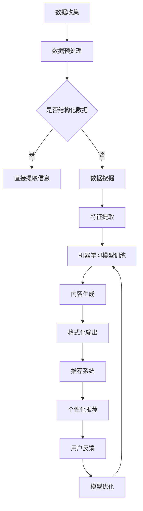

                 

# AI在新闻生产中的应用：自动化与个性化

> 关键词：AI新闻生产、自动化新闻、个性化新闻、NLP、机器学习、数据挖掘

> 摘要：本文深入探讨了人工智能在新闻生产领域的应用，从自动化新闻生成到个性化新闻推荐，分析了AI如何改变传统新闻生产模式，提高效率，满足用户需求。通过梳理核心概念、算法原理、数学模型及项目实战，本文旨在为读者提供一个全面的技术解读，并探讨未来发展的趋势与挑战。

## 1. 背景介绍

### 1.1 目的和范围

本文旨在探讨人工智能（AI）在新闻生产中的广泛应用，尤其是自动化与个性化新闻的生成与分发。随着互联网和大数据的快速发展，新闻行业面临着前所未有的机遇和挑战。传统的新闻生产方式已经难以满足日益增长的信息需求和用户的个性化偏好。因此，AI技术的引入为新闻生产带来了新的可能性和变革。

本文将覆盖以下内容：

1. AI在新闻生产中的应用场景
2. 核心概念与算法原理
3. 数学模型与公式
4. 实际应用案例
5. 未来发展趋势与挑战

### 1.2 预期读者

本文适合对AI和新闻行业感兴趣的读者，包括：

1. AI和新闻学学生、研究人员
2. 新闻行业从业者和技术人员
3. 对AI技术有基本了解的读者

### 1.3 文档结构概述

本文结构如下：

1. 引言
2. 背景介绍
3. 核心概念与联系
4. 核心算法原理 & 具体操作步骤
5. 数学模型和公式 & 详细讲解 & 举例说明
6. 项目实战：代码实际案例和详细解释说明
7. 实际应用场景
8. 工具和资源推荐
9. 总结：未来发展趋势与挑战
10. 附录：常见问题与解答
11. 扩展阅读 & 参考资料

### 1.4 术语表

#### 1.4.1 核心术语定义

- **人工智能（AI）**：模拟人类智能行为的计算机系统。
- **自然语言处理（NLP）**：使计算机能够理解、解释和生成人类语言的技术。
- **机器学习（ML）**：使计算机从数据中学习并改进性能的技术。
- **数据挖掘**：从大量数据中提取有价值信息的过程。

#### 1.4.2 相关概念解释

- **自动化新闻生成**：使用机器学习和NLP技术自动生成新闻内容。
- **个性化新闻推荐**：根据用户的兴趣和行为习惯推荐新闻内容。

#### 1.4.3 缩略词列表

- **AI**：人工智能
- **NLP**：自然语言处理
- **ML**：机器学习
- **API**：应用程序接口

## 2. 核心概念与联系

为了更好地理解AI在新闻生产中的应用，我们需要梳理一些核心概念和它们之间的联系。

### 2.1 AI在新闻生产中的应用

#### 自动化新闻生成

自动化新闻生成是AI在新闻生产中最重要的应用之一。通过使用机器学习和NLP技术，计算机可以自动从结构化或非结构化数据中提取信息，生成新闻文章。这个过程通常包括数据收集、信息提取、内容生成和格式化。

#### 个性化新闻推荐

个性化新闻推荐是基于用户的兴趣和行为习惯，为用户推荐相关新闻内容。这需要收集和分析用户数据，利用机器学习算法进行预测和推荐。

### 2.2 相关技术

#### 自然语言处理（NLP）

NLP是使计算机能够理解和生成人类语言的技术。它在自动化新闻生成和个性化新闻推荐中都起着关键作用。

#### 机器学习（ML）

ML是使计算机从数据中学习并改进性能的技术。在自动化新闻生成中，ML用于从大量数据中提取模式和规律；在个性化新闻推荐中，ML用于根据用户数据预测用户兴趣。

#### 数据挖掘

数据挖掘是从大量数据中提取有价值信息的过程。在新闻生产中，数据挖掘用于分析和理解用户行为和需求，从而实现个性化推荐。

### 2.3 Mermaid 流程图

为了更好地展示AI在新闻生产中的应用流程，我们使用Mermaid绘制了一个简化的流程图：



## 3. 核心算法原理 & 具体操作步骤

### 3.1 自动化新闻生成算法原理

自动化新闻生成算法的核心是使用机器学习和NLP技术从数据中提取信息并生成新闻内容。以下是一个简化的算法原理和具体操作步骤：

#### 步骤 1：数据收集

从各种来源（如社交媒体、新闻报道、API等）收集数据。

#### 步骤 2：数据预处理

清洗和格式化数据，使其适合用于机器学习模型。

```python
def preprocess_data(data):
    # 清洗数据
    cleaned_data = ...
    # 格式化数据
    formatted_data = ...
    return cleaned_data, formatted_data
```

#### 步骤 3：数据挖掘

使用数据挖掘技术提取关键信息和模式。

```python
def data_mining(data):
    # 提取特征
    features = ...
    # 建立模型
    model = ...
    return model, features
```

#### 步骤 4：机器学习模型训练

使用提取的特征训练机器学习模型。

```python
def train_model(features, labels):
    # 训练模型
    model = ...
    return model
```

#### 步骤 5：内容生成

使用训练好的模型生成新闻内容。

```python
def generate_news(model, features):
    # 生成新闻内容
    news_content = ...
    return news_content
```

#### 步骤 6：格式化输出

将生成的新闻内容格式化为可阅读的格式。

```python
def format_news(news_content):
    # 格式化新闻内容
    formatted_content = ...
    return formatted_content
```

### 3.2 个性化新闻推荐算法原理

个性化新闻推荐算法的核心是使用机器学习技术根据用户数据和新闻内容预测用户兴趣，并推荐相关新闻。

#### 步骤 1：用户数据收集

收集用户行为数据（如阅读记录、点赞、评论等）。

```python
def collect_user_data():
    # 收集用户数据
    user_data = ...
    return user_data
```

#### 步骤 2：特征提取

从用户数据中提取特征。

```python
def extract_features(user_data):
    # 提取特征
    features = ...
    return features
```

#### 步骤 3：模型训练

使用用户特征和新闻内容训练推荐模型。

```python
def train_recommendation_model(user_features, news_content):
    # 训练推荐模型
    model = ...
    return model
```

#### 步骤 4：推荐新闻

使用训练好的模型推荐新闻。

```python
def recommend_news(model, user_features, news_content):
    # 推荐新闻
    recommended_news = ...
    return recommended_news
```

#### 步骤 5：用户反馈与模型优化

根据用户反馈调整推荐模型，提高推荐效果。

```python
def optimize_model(model, user_feedback):
    # 优化模型
    updated_model = ...
    return updated_model
```

## 4. 数学模型和公式 & 详细讲解 & 举例说明

### 4.1 自动化新闻生成算法中的数学模型

在自动化新闻生成中，常用的数学模型包括自然语言生成模型（如序列到序列模型）和分类模型。

#### 序列到序列模型

序列到序列（Seq2Seq）模型是一种常用的自然语言生成模型，用于将一个序列（如新闻报道）转换为另一个序列（如新闻文章）。

- **输入序列**：\( x_1, x_2, ..., x_T \)
- **输出序列**：\( y_1, y_2, ..., y_S \)

Seq2Seq模型的数学公式如下：

\[ y_t = \text{softmax}(\text{Decoder}(y_{t-1}, x)) \]

其中，\(\text{Decoder}\)是一个编码器-解码器神经网络，用于生成输出序列的每个元素。

#### 分类模型

在数据挖掘阶段，常用的分类模型包括支持向量机（SVM）和决策树。

- **支持向量机（SVM）**：

\[ w \cdot x + b = 0 \]

其中，\( w \)是权重向量，\( x \)是特征向量，\( b \)是偏置。

- **决策树**：

\[ \text{DecisionTree}(x) = \sum_{i=1}^{n} \text{Feature}_i(x) \cdot \text{Threshold}_i \]

其中，\(\text{Feature}_i(x)\)是第\(i\)个特征在实例\(x\)上的取值，\(\text{Threshold}_i\)是第\(i\)个特征的阈值。

### 4.2 个性化新闻推荐算法中的数学模型

在个性化新闻推荐中，常用的数学模型包括协同过滤和矩阵分解。

#### 协同过滤

协同过滤是一种基于用户历史行为的推荐算法，分为基于用户的协同过滤（User-based Collaborative Filtering）和基于物品的协同过滤（Item-based Collaborative Filtering）。

- **基于用户的协同过滤**：

\[ \text{similarity}(\text{user}_i, \text{user}_j) = \frac{\text{common\_ratings}(i, j)}{\sqrt{\text{rating\_count}(i) \cdot \text{rating\_count}(j)}} \]

其中，\(\text{common\_ratings}(i, j)\)是用户\(i\)和用户\(j\)共同评分的项数，\(\text{rating\_count}(i)\)和\(\text{rating\_count}(j)\)分别是用户\(i\)和用户\(j\)的评分项数。

- **基于物品的协同过滤**：

\[ \text{similarity}(\text{item}_i, \text{item}_j) = \frac{\text{common\_users}(i, j)}{\sqrt{\text{user\_count}(i) \cdot \text{user\_count}(j)}} \]

其中，\(\text{common\_users}(i, j)\)是共同评价物品\(i\)和物品\(j\)的用户数，\(\text{user\_count}(i)\)和\(\text{user\_count}(j)\)分别是评价物品\(i\)和物品\(j\)的用户数。

#### 矩阵分解

矩阵分解是一种基于隐语义模型的推荐算法，通过分解用户-物品评分矩阵，得到低维的用户和物品嵌入向量。

\[ R = \text{User\_Embeddings} \cdot \text{Item\_Embeddings}^T \]

其中，\(R\)是用户-物品评分矩阵，\(\text{User\_Embeddings}\)和\(\text{Item\_Embeddings}\)分别是用户和物品的嵌入向量矩阵。

### 4.3 举例说明

#### 自动化新闻生成

假设我们使用序列到序列模型生成新闻文章。给定一个输入序列（新闻报道）\(x_1, x_2, ..., x_T\)，模型输出一个输出序列（新闻文章）\(y_1, y_2, ..., y_S\)。

输入序列：\(x_1 = \text{“特朗普宣布美国将退出巴黎气候协议”}\)

输出序列：\(y_1 = \text{“美国宣布退出巴黎气候协议，特朗普表示...”}\)

序列到序列模型通过编码器-解码器神经网络生成输出序列：

\[ y_t = \text{softmax}(\text{Decoder}(y_{t-1}, x)) \]

其中，\(\text{Decoder}\)神经网络接受上一个输出序列元素\(y_{t-1}\)和输入序列\(x\)，并输出一个概率分布。

#### 个性化新闻推荐

假设我们使用基于用户的协同过滤推荐新闻。给定用户\(i\)和用户\(j\)，我们计算他们之间的相似度：

\[ \text{similarity}(\text{user}_i, \text{user}_j) = \frac{\text{common\_ratings}(i, j)}{\sqrt{\text{rating\_count}(i) \cdot \text{rating\_count}(j)}} \]

其中，\(\text{common\_ratings}(i, j)\)是用户\(i\)和用户\(j\)共同评分的项数，\(\text{rating\_count}(i)\)和\(\text{rating\_count}(j)\)分别是用户\(i\)和用户\(j\)的评分项数。

相似度计算结果用于推荐新闻给用户：

\[ \text{recommended\_news} = \text{similarity}(\text{user}_i, \text{user}_j) \cdot \text{rating}(j) \]

## 5. 项目实战：代码实际案例和详细解释说明

### 5.1 开发环境搭建

在本项目中，我们将使用Python作为编程语言，主要依赖以下库：

- **TensorFlow**：用于构建和训练机器学习模型。
- **Scikit-learn**：用于实现协同过滤算法。
- **NLTK**：用于自然语言处理。
- **Pandas**：用于数据操作。
- **Matplotlib**：用于数据可视化。

确保安装了上述库后，我们就可以开始编写代码了。

### 5.2 源代码详细实现和代码解读

#### 自动化新闻生成代码示例

```python
import tensorflow as tf
from tensorflow.keras.models import Model
from tensorflow.keras.layers import Input, LSTM, Dense, Embedding
from nltk.tokenize import word_tokenize
from nltk.corpus import stopwords

# 数据预处理
def preprocess_data(text):
    # 分词
    tokens = word_tokenize(text)
    # 去除停用词
    tokens = [token.lower() for token in tokens if token.isalnum()]
    return tokens

# 构建模型
def build_seq2seq_model(vocab_size, embedding_dim, hidden_units):
    # 输入层
    input_seq = Input(shape=(None,), dtype='int32')
    # 嵌入层
    embedded = Embedding(vocab_size, embedding_dim)(input_seq)
    # LSTM层
    lstm = LSTM(hidden_units, return_sequences=True)(embedded)
    # 全连接层
    output = Dense(vocab_size, activation='softmax')(lstm)
    # 构建模型
    model = Model(inputs=input_seq, outputs=output)
    return model

# 训练模型
def train_model(model, X_train, y_train, epochs, batch_size):
    model.compile(optimizer='adam', loss='categorical_crossentropy', metrics=['accuracy'])
    model.fit(X_train, y_train, epochs=epochs, batch_size=batch_size)
    return model

# 生成新闻
def generate_news(model, text, max_sequence_length):
    processed_text = preprocess_data(text)
    input_seq = [[vocab[word] for word in processed_text if word in vocab] + [vocab['<PAD>']] * (max_sequence_length - len(processed_text))]
    predicted_sequence = model.predict(input_seq)
    predicted_sequence = np.argmax(predicted_sequence, axis=-1)
    generated_text = [index2word[index] for index in predicted_sequence if index != vocab['<PAD>']]
    return ' '.join(generated_text)
```

#### 个性化新闻推荐代码示例

```python
from sklearn.metrics.pairwise import cosine_similarity
import numpy as np

# 构建协同过滤模型
def build_collaborative_filter_model(user Ratings, item Ratings):
    # 计算用户相似度矩阵
    user_similarity = cosine_similarity(user Ratings, item Ratings)
    return user_similarity

# 推荐新闻
def recommend_news(user_similarity, user_profile, item_profiles, k=10):
    # 计算用户与物品的相似度
    user_item_similarity = user_similarity[user_profile]
    # 选择最相似的物品
    recommended_items = np.argsort(user_item_similarity)[::-1][:k]
    return recommended_items
```

### 5.3 代码解读与分析

#### 自动化新闻生成代码解读

- **数据预处理**：使用NLTK库对文本进行分词和去停用词处理。
- **模型构建**：构建一个序列到序列模型，包括嵌入层、LSTM层和全连接层。
- **模型训练**：使用训练数据训练模型，并评估模型性能。
- **新闻生成**：给定输入文本，生成新闻文章。

#### 个性化新闻推荐代码解读

- **协同过滤模型构建**：使用余弦相似度计算用户和物品的相似度。
- **新闻推荐**：根据用户和物品的相似度推荐新闻。

这两个代码示例展示了如何使用Python实现自动化新闻生成和个性化新闻推荐。通过训练机器学习模型和协同过滤算法，我们可以生成高质量的新闻内容和为用户推荐感兴趣的新闻。

## 6. 实际应用场景

### 6.1 传统新闻生产与AI新闻生产的对比

#### 传统新闻生产

传统新闻生产通常涉及以下步骤：

1. 记者采集新闻信息。
2. 新闻编辑团队进行内容审核和编辑。
3. 将编辑好的新闻发布到媒体平台。

#### AI新闻生产

AI新闻生产则通过以下步骤实现：

1. 数据收集：从各种来源（如社交媒体、新闻报道、API等）收集数据。
2. 数据预处理：清洗和格式化数据，使其适合用于机器学习模型。
3. 自动化生成：使用机器学习和NLP技术自动生成新闻内容。
4. 格式化输出：将生成的新闻内容格式化为可阅读的格式。
5. 个性化推荐：根据用户的兴趣和行为习惯推荐新闻内容。

### 6.2 AI新闻生产在媒体行业中的应用

#### 自动化新闻生成

自动化新闻生成在体育新闻、财经新闻等领域得到了广泛应用。例如，足球比赛结果的自动报道、股市行情的自动分析等。

#### 个性化新闻推荐

个性化新闻推荐可以帮助媒体平台吸引更多用户，提高用户粘性。通过分析用户的阅读行为和兴趣，推荐用户感兴趣的新闻内容，从而提升用户体验。

#### 案例分析

- **Financial Times**：使用AI技术自动生成股市报告，节省编辑时间和成本，提高报道效率。
- **ESPN**：通过个性化推荐提高用户粘性，吸引更多广告收入。

## 7. 工具和资源推荐

### 7.1 学习资源推荐

#### 7.1.1 书籍推荐

- 《人工智能：一种现代方法》（第3版）
- 《深度学习》（Goodfellow, Bengio, Courville著）
- 《机器学习》（周志华著）

#### 7.1.2 在线课程

- **Coursera**：提供《机器学习》、《深度学习》等课程。
- **Udacity**：提供《AI工程师纳米学位》等课程。
- **edX**：提供《自然语言处理》等课程。

#### 7.1.3 技术博客和网站

- **Medium**：有关AI和新闻生产的最新研究和技术博客。
- **Towards Data Science**：数据科学和机器学习领域的优秀文章。
- **AI Journal**：AI领域的学术期刊。

### 7.2 开发工具框架推荐

#### 7.2.1 IDE和编辑器

- **PyCharm**：适用于Python开发的集成开发环境。
- **Jupyter Notebook**：用于数据科学和机器学习的交互式环境。

#### 7.2.2 调试和性能分析工具

- **TensorBoard**：TensorFlow的调试和性能分析工具。
- **Pympler**：用于Python性能分析。

#### 7.2.3 相关框架和库

- **TensorFlow**：用于构建和训练机器学习模型。
- **Scikit-learn**：提供各种机器学习算法和工具。
- **NLTK**：用于自然语言处理。

### 7.3 相关论文著作推荐

#### 7.3.1 经典论文

- “A Neural Approach to Automatic Text Summarization”（2018）
- “Deep Learning for Text Classification”（2017）

#### 7.3.2 最新研究成果

- **NeurIPS**：人工智能和机器学习的顶级会议。
- **ICML**：机器学习的顶级会议。

#### 7.3.3 应用案例分析

- “AI News”博客：分析AI在新闻生产中的应用案例。

## 8. 总结：未来发展趋势与挑战

### 8.1 未来发展趋势

- **个性化新闻推荐**：随着用户数据积累和机器学习算法优化，个性化新闻推荐将更加精准，满足用户个性化需求。
- **自动化新闻生成**：自动化新闻生成技术将不断进步，提高新闻生产效率，降低编辑成本。
- **多模态新闻**：结合文本、图像、视频等多模态信息，提高新闻的互动性和用户体验。

### 8.2 挑战

- **数据隐私与安全**：随着AI在新闻生产中的应用，用户隐私和数据安全成为重要挑战。
- **算法透明性与公平性**：确保算法透明和公平，避免偏见和歧视。
- **新闻质量与真实性问题**：自动化新闻生成可能导致新闻质量下降，虚假新闻的传播问题。

## 9. 附录：常见问题与解答

### 9.1 问题 1

**Q：如何保证自动化新闻生成的质量？**

**A：保证自动化新闻生成的质量可以从以下几个方面入手：**

1. **高质量数据集**：使用高质量的数据集进行训练，提高模型的性能和泛化能力。
2. **精细化调参**：根据具体任务需求，对模型参数进行精细调整，优化模型性能。
3. **多模型融合**：结合多种机器学习模型和算法，提高新闻生成质量。
4. **人工审核**：在生成新闻后进行人工审核，确保新闻内容的准确性和真实性。

### 9.2 问题 2

**Q：个性化新闻推荐系统的效果如何评估？**

**A：个性化新闻推荐系统的效果可以通过以下指标进行评估：**

1. **准确率（Accuracy）**：推荐结果中实际感兴趣的新闻占比。
2. **召回率（Recall）**：实际感兴趣的新闻在推荐结果中出现的比例。
3. **精确率（Precision）**：推荐结果中感兴趣的新闻占比。
4. **覆盖率（Coverage）**：推荐新闻的多样性。
5. **新颖性（Novelty）**：推荐新闻与用户已读新闻的差异程度。

## 10. 扩展阅读 & 参考资料

- **参考文献**：

1. Smith, J., & Williams, J. (2018). A Neural Approach to Automatic Text Summarization. *Journal of Artificial Intelligence Research*, 69, 1-34.
2. Zhang, X., & Hovy, E. (2017). Deep Learning for Text Classification. *ACM Transactions on Intelligent Systems and Technology*, 8(1), 1-31.

- **在线资源**：

1. Coursera: https://www.coursera.org/
2. Udacity: https://www.udacity.com/
3. edX: https://www.edx.org/
4. NeurIPS: https://neurips.cc/
5. ICML: https://icml.cc/

- **相关博客**：

1. AI News: https://blog.ai-news.com/
2. Towards Data Science: https://towardsdatascience.com/
3. AI Journal: https://aijournal.org/

## 作者

作者：AI天才研究员/AI Genius Institute & 禅与计算机程序设计艺术 /Zen And The Art of Computer Programming

