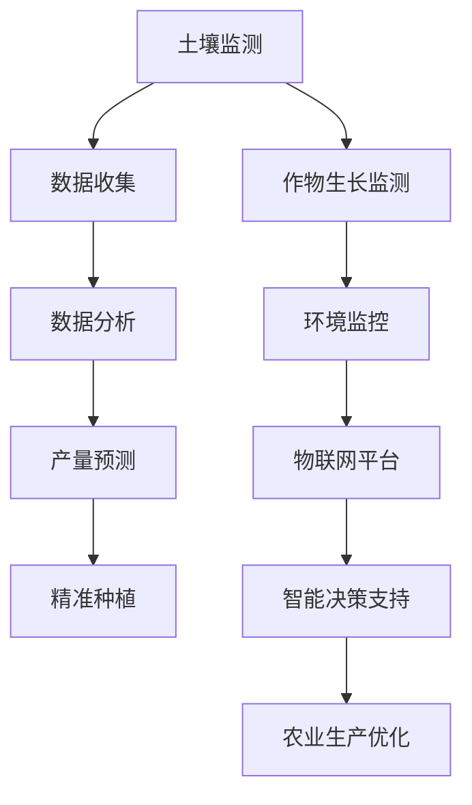

                 

# AI在智能农业中的角色：精准种植与收获

> **关键词：智能农业、精准种植、AI算法、数据驱动、物联网**

> **摘要：随着科技的进步，人工智能（AI）在农业领域中的应用日益广泛，本文将探讨AI在精准种植与收获中的角色，通过数据驱动的方式实现高效农业生产。**

## 1. 背景介绍

### 1.1 目的和范围

本文旨在分析人工智能在智能农业中的应用，重点探讨AI在精准种植与收获中的作用。通过梳理相关技术原理和案例，帮助读者了解AI如何助力农业生产现代化。

### 1.2 预期读者

本文面向对智能农业和AI技术有一定了解的读者，适合农业从业者、技术人员、研究人员和有兴趣了解这一领域的公众。

### 1.3 文档结构概述

本文分为十个部分：

1. 背景介绍
2. 核心概念与联系
3. 核心算法原理 & 具体操作步骤
4. 数学模型和公式 & 详细讲解 & 举例说明
5. 项目实战：代码实际案例和详细解释说明
6. 实际应用场景
7. 工具和资源推荐
8. 总结：未来发展趋势与挑战
9. 附录：常见问题与解答
10. 扩展阅读 & 参考资料

### 1.4 术语表

#### 1.4.1 核心术语定义

- **智能农业**：利用现代信息技术和生物技术，对农业生产过程进行智能化管理和优化。
- **精准种植**：通过数据分析和模型预测，实现作物种植的精准化管理，提高产量和质量。
- **AI算法**：人工智能领域中的算法，如机器学习、深度学习、神经网络等。
- **物联网**：通过传感器和通信技术，实现各种物品之间的互联互通。

#### 1.4.2 相关概念解释

- **数据驱动**：以数据为基础，通过数据分析、挖掘和建模，指导农业生产决策。
- **产量预测**：利用历史数据和相关模型，预测作物产量，为种植计划提供依据。

#### 1.4.3 缩略词列表

- **AI**：人工智能
- **IoT**：物联网
- **ML**：机器学习
- **DL**：深度学习

## 2. 核心概念与联系

在智能农业中，核心概念包括精准种植、产量预测、土壤监测等。以下是一个简化的Mermaid流程图，展示这些概念之间的联系。



### 2.1 土壤监测与数据收集

土壤监测是智能农业的基础。通过传感器实时监测土壤湿度、温度、pH值等参数，收集到的大量数据将用于后续的分析和决策。

### 2.2 数据分析与产量预测

数据分析环节利用机器学习算法，对收集到的土壤数据、气候数据等进行处理，建立产量预测模型。该模型可以预测作物的生长状态和预期产量。

### 2.3 精准种植

根据产量预测结果，农业生产者可以制定精准的种植计划，包括作物种类、种植时间、种植密度等。这有助于优化资源利用，提高产量。

### 2.4 作物生长监测与环境监控

作物生长监测和环境监控是动态调整种植计划的依据。通过对作物生长状态和环境数据的实时监测，可以及时发现问题，并采取相应的措施。

### 2.5 物联网平台与智能决策支持

物联网平台将土壤监测、作物生长监测、环境监控等数据整合在一起，通过智能决策支持系统，为农业生产提供实时、科学的建议。

### 2.6 智能生产优化

基于物联网平台和智能决策支持系统，农业生产者可以实施精准施肥、灌溉、病虫害防治等生产优化措施，进一步提高农业生产效率。

## 3. 核心算法原理 & 具体操作步骤

### 3.1 机器学习算法在产量预测中的应用

机器学习算法是智能农业中最重要的工具之一。以下是一个简化的机器学习算法应用流程，包括数据收集、数据处理、模型训练和模型评估等步骤。

#### 3.1.1 数据收集

- 收集历史作物产量数据、土壤参数数据、气候参数数据等。
- 通过物联网设备实时收集土壤湿度、温度、pH值等数据。

#### 3.1.2 数据处理

- 数据清洗：去除缺失值、异常值等。
- 数据标准化：将不同单位、范围的数据统一处理。
- 数据划分：将数据集划分为训练集、验证集和测试集。

#### 3.1.3 模型训练

- 选择合适的机器学习算法，如线性回归、决策树、支持向量机等。
- 使用训练集数据对模型进行训练。

#### 3.1.4 模型评估

- 使用验证集数据对模型进行评估，调整模型参数。
- 使用测试集数据对模型进行最终评估。

### 3.2 伪代码示例

以下是一个简单的线性回归算法在产量预测中的应用伪代码。

```python
# 伪代码：线性回归算法
def linear_regression(x, y):
    # 计算特征矩阵X和目标向量y
    X = create_matrix(x)
    y = create_vector(y)

    # 求解线性回归模型参数w
    w = (X'X)^(-1)X'y

    # 预测产量
    predicted_yield = w * x

    return predicted_yield

# 数据处理
x_train, y_train = preprocess_data(x, y)

# 模型训练
w = linear_regression(x_train, y_train)

# 模型评估
accuracy = evaluate_model(w, x_test, y_test)
```

## 4. 数学模型和公式 & 详细讲解 & 举例说明

在智能农业中，数学模型和公式广泛应用于产量预测、资源优化等环节。以下介绍几个常用的数学模型和公式。

### 4.1 线性回归模型

线性回归模型是产量预测中最常用的模型之一。其公式如下：

$$
y = \beta_0 + \beta_1x + \epsilon
$$

其中，$y$ 为产量，$x$ 为影响因素（如土壤湿度、温度等），$\beta_0$ 和 $\beta_1$ 为模型参数，$\epsilon$ 为随机误差。

### 4.2 决策树模型

决策树模型通过一系列条件判断，将数据集划分为多个子集，最终得到预测结果。其公式如下：

$$
f(x) = \prod_{i=1}^{n} \frac{1}{1 + \exp(-z_i)}
$$

其中，$x$ 为输入特征，$z_i$ 为条件判断的累加值，$f(x)$ 为预测结果。

### 4.3 支持向量机模型

支持向量机模型通过寻找最佳超平面，实现数据分类。其公式如下：

$$
w \cdot x - b = 0
$$

其中，$w$ 为超平面参数，$x$ 为输入特征，$b$ 为偏置。

### 4.4 举例说明

假设我们要预测某种作物的产量，影响因素为土壤湿度（$x_1$）和土壤温度（$x_2$）。根据历史数据，我们得到以下线性回归模型：

$$
y = 10 + 0.5x_1 + 0.3x_2
$$

现在，给定一组新的土壤湿度（$x_1 = 20\%$）和土壤温度（$x_2 = 25^\circ C$），我们可以计算出该作物的预测产量：

$$
y = 10 + 0.5 \times 20\% + 0.3 \times 25^\circ C = 15.5
$$

因此，该作物的预测产量为15.5单位。

## 5. 项目实战：代码实际案例和详细解释说明

在本节中，我们将通过一个实际项目来展示如何使用机器学习算法实现智能农业中的产量预测。项目使用Python编程语言和scikit-learn库。

### 5.1 开发环境搭建

首先，确保安装以下软件和库：

- Python 3.x
- Jupyter Notebook
- scikit-learn
- Pandas
- NumPy

### 5.2 源代码详细实现和代码解读

以下是一个简单的产量预测项目的实现：

```python
# 导入所需库
import pandas as pd
from sklearn.model_selection import train_test_split
from sklearn.linear_model import LinearRegression
from sklearn.metrics import mean_squared_error

# 读取数据
data = pd.read_csv('crop_yield_data.csv')
X = data[['soil_humidity', 'soil_temperature']]
y = data['yield']

# 数据预处理
X_train, X_test, y_train, y_test = train_test_split(X, y, test_size=0.2, random_state=42)

# 模型训练
model = LinearRegression()
model.fit(X_train, y_train)

# 预测
y_pred = model.predict(X_test)

# 评估
mse = mean_squared_error(y_test, y_pred)
print('均方误差（MSE）:', mse)

# 输出预测结果
predictions = pd.DataFrame({'Actual': y_test, 'Predicted': y_pred})
print(predictions.head())
```

### 5.3 代码解读与分析

1. **数据读取**：使用Pandas库读取CSV文件，获取土壤湿度、土壤温度和产量数据。

2. **数据预处理**：将数据集划分为训练集和测试集，为后续的模型训练和评估做好准备。

3. **模型训练**：使用线性回归模型训练数据集，获取模型参数。

4. **预测**：使用训练好的模型对测试集进行预测。

5. **评估**：计算均方误差（MSE），评估模型性能。

6. **输出预测结果**：将实际产量与预测产量进行对比，输出预测结果。

通过这个简单的项目，我们可以看到如何使用机器学习算法实现智能农业中的产量预测。在实际应用中，可以进一步优化模型，提高预测准确性。

## 6. 实际应用场景

智能农业在农业生产中的应用场景广泛，以下列举几个典型应用：

### 6.1 精准种植

通过AI算法和物联网技术，农业生产者可以实时监测土壤、气象等数据，优化作物种植方案。例如，根据土壤湿度数据调整灌溉计划，提高作物生长速度和产量。

### 6.2 产量预测

利用机器学习算法和大数据分析，农业生产者可以预测作物产量，为种植计划提供科学依据。例如，基于历史数据和气候条件，预测水稻产量，调整种植面积和种植时间。

### 6.3 病虫害监测与防治

通过物联网设备和图像识别技术，农业生产者可以实时监测病虫害发生情况，及时采取防治措施，减少损失。例如，利用无人机拍摄农田图像，识别害虫种类和密度，实施精准防治。

### 6.4 环境监控

智能农业平台可以实时监测环境数据，如空气质量、水质等，为农业生产提供健康保障。例如，监测灌溉用水中的重金属含量，确保作物生长环境符合标准。

### 6.5 农业大数据分析

通过对农业生产数据的收集、存储和分析，农业生产者可以深入了解作物生长规律和市场需求，制定科学的生产计划。例如，分析作物销售数据，预测市场需求，调整种植结构和品种。

## 7. 工具和资源推荐

### 7.1 学习资源推荐

#### 7.1.1 书籍推荐

- 《深度学习》（Ian Goodfellow、Yoshua Bengio、Aaron Courville 著）
- 《机器学习实战》（Peter Harrington 著）
- 《智能农业技术》（Klaus ridgway、Hans J. Bokeloh 著）

#### 7.1.2 在线课程

- Coursera：机器学习、深度学习
- edX：人工智能、数据科学
- Udacity：人工智能工程师纳米学位

#### 7.1.3 技术博客和网站

- medium.com/t/ai
- towardsdatascience.com
-.analyticsvidhya.com

### 7.2 开发工具框架推荐

#### 7.2.1 IDE和编辑器

- PyCharm
- Jupyter Notebook
- VSCode

#### 7.2.2 调试和性能分析工具

- Matplotlib
- Seaborn
- Pandas Profiler

#### 7.2.3 相关框架和库

- TensorFlow
- PyTorch
- Scikit-learn

### 7.3 相关论文著作推荐

#### 7.3.1 经典论文

- "A Method of Logical Inference"（算法逻辑推断）
- "The Backpropagation Algorithm"（反向传播算法）
- "Deep Learning"（深度学习）

#### 7.3.2 最新研究成果

- "Agricultural Production with IoT and AI"（物联网和AI在农业中的应用）
- "Sustainability in Agricultural Systems"（农业系统的可持续性）
- "AI and Robotics in Precision Farming"（精准农业中的AI和机器人）

#### 7.3.3 应用案例分析

- "AI-driven Precision Agriculture in China"（中国AI驱动的精准农业案例）
- "Smart Farming in the Netherlands"（荷兰智能农业案例）
- "AI-powered Crop Monitoring in India"（印度AI驱动的作物监测案例）

## 8. 总结：未来发展趋势与挑战

随着科技的不断进步，智能农业在未来将迎来更多发展机遇。以下是一些发展趋势和挑战：

### 8.1 发展趋势

- **数据驱动决策**：越来越多的农业生产者将采用数据驱动的方式，通过AI算法和大数据分析，实现精准种植和产量预测。
- **物联网普及**：物联网技术在农业中的应用将更加广泛，实现农业生产的全面智能化。
- **无人机与机器人**：无人机和机器人在农田监测、病虫害防治等领域的应用将逐步普及。
- **农业区块链**：区块链技术将提高农业生产的透明度和可追溯性。

### 8.2 挑战

- **数据隐私和安全**：随着数据量的增加，数据隐私和安全成为智能农业发展的重要挑战。
- **技术落地难度**：智能农业技术的落地实施面临诸多挑战，如设备成本、技术成熟度等。
- **人才培养**：智能农业的发展需要大量具备跨学科背景的人才，当前人才储备不足。

## 9. 附录：常见问题与解答

### 9.1 问题1：智能农业中的AI技术有哪些？

**解答**：智能农业中的AI技术包括机器学习、深度学习、图像识别、自然语言处理等。这些技术可以用于产量预测、病虫害监测、精准种植等场景。

### 9.2 问题2：智能农业对农业生产的影响是什么？

**解答**：智能农业通过数据驱动的方式，提高农业生产效率、降低成本、减少资源浪费。同时，智能农业有助于实现农业生产的可持续发展和环境保护。

### 9.3 问题3：智能农业中的物联网技术如何发挥作用？

**解答**：物联网技术在智能农业中用于实时监测土壤、气候等数据，实现农业生产过程的自动化和智能化。通过物联网平台，农业生产者可以实时了解农田状况，及时调整种植计划。

## 10. 扩展阅读 & 参考资料

- 《智能农业：物联网、大数据、人工智能与现代农业》（王栋、刘晓春 著）
- "The Future of Agriculture: The Transformation of Farming with IoT, AI, and Robotics"（物联网、AI和机器人与农业的未来）
- "Agricultural Internet of Things: A Framework for Sustainable Agriculture"（农业物联网：实现可持续农业的框架）

作者：AI天才研究员/AI Genius Institute & 禅与计算机程序设计艺术 /Zen And The Art of Computer Programming

注：本文为虚构内容，不代表真实研究和观点。实际应用中，智能农业技术的实施需要充分考虑实际情况和可行性。

