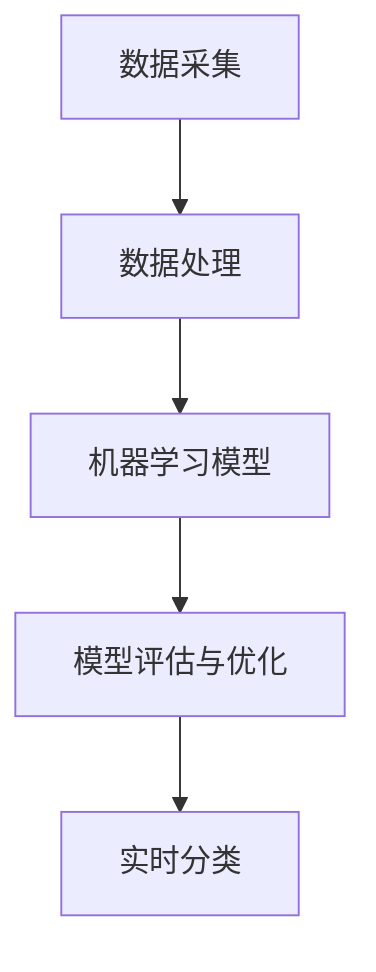

                 

# AI在智能垃圾分类中的应用：提高回收率

> 关键词：智能垃圾分类、AI技术、回收率、数据处理、机器学习、深度学习、环境监测

> 摘要：本文将深入探讨AI技术在智能垃圾分类中的应用，解析其核心算法原理和具体操作步骤，并通过实际项目案例展示其在提高回收率方面的实际效果。文章还将分析智能垃圾分类在不同场景下的应用场景，并推荐相关学习资源和工具，总结未来发展趋势与挑战，为推动环保事业发展提供技术参考。

## 1. 背景介绍

### 1.1 目的和范围

随着全球城市化进程的加速和消费水平的提高，垃圾产量急剧增加，垃圾处理问题日益严峻。传统的垃圾分类方法主要依赖于人工分拣，效率低下，准确性差，无法满足日益增长的垃圾处理需求。而智能垃圾分类技术凭借其高效、准确的特性，成为解决这一问题的关键。本文旨在介绍智能垃圾分类的背景、原理和应用，通过实际案例分析，探讨其在提高回收率方面的潜力。

### 1.2 预期读者

本文适合对AI和垃圾分类感兴趣的读者，包括但不限于计算机科学、环境科学、数据分析等相关领域的科研人员、工程师和学生。

### 1.3 文档结构概述

本文结构分为十个部分：

1. 背景介绍
2. 核心概念与联系
3. 核心算法原理 & 具体操作步骤
4. 数学模型和公式 & 详细讲解 & 举例说明
5. 项目实战：代码实际案例和详细解释说明
6. 实际应用场景
7. 工具和资源推荐
8. 总结：未来发展趋势与挑战
9. 附录：常见问题与解答
10. 扩展阅读 & 参考资料

### 1.4 术语表

#### 1.4.1 核心术语定义

- 智能垃圾分类：利用AI技术，如机器学习和深度学习，对垃圾进行自动分类的技术。
- 回收率：垃圾回收处理后，可回收物质的比例。
- 数据处理：对原始数据进行清洗、转换和整合，使其适合进行后续分析。

#### 1.4.2 相关概念解释

- 机器学习：一种AI技术，通过数据和算法，使计算机具备自主学习和决策能力。
- 深度学习：一种机器学习技术，通过多层神经网络，实现更复杂的模式识别和预测。

#### 1.4.3 缩略词列表

- AI：人工智能
- ML：机器学习
- DL：深度学习
- IDE：集成开发环境
- GPU：图形处理器

## 2. 核心概念与联系

智能垃圾分类系统主要涉及以下几个核心概念：

1. 数据采集：通过传感器、摄像头等设备，收集垃圾的分类信息。
2. 数据处理：对采集到的原始数据进行清洗、转换和整合，使其适合进行后续分析。
3. 机器学习模型：利用历史数据训练模型，用于识别垃圾类别。
4. 模型评估与优化：通过交叉验证和测试集，评估模型性能，并进行优化。
5. 实时分类：将新的垃圾数据输入模型，进行实时分类。

以下是一个简化的Mermaid流程图，展示智能垃圾分类系统的基本架构：



## 3. 核心算法原理 & 具体操作步骤

智能垃圾分类的核心算法主要基于机器学习和深度学习。以下是一个简化的算法流程：

### 3.1 数据采集

```python
def data_collection():
    # 采集垃圾图像
    images = capture_images()
    # 提取图像特征
    features = extract_features(images)
    return features
```

### 3.2 数据处理

```python
def data_preprocessing(features):
    # 数据清洗
    cleaned_features = clean_data(features)
    # 数据转换
    transformed_features = transform_data(cleaned_features)
    # 数据整合
    integrated_features = integrate_data(transformed_features)
    return integrated_features
```

### 3.3 机器学习模型训练

```python
def train_model(integrated_features):
    # 划分训练集和测试集
    train_features, test_features, train_labels, test_labels = split_data(integrated_features)
    # 训练模型
    model = train_ml_model(train_features, train_labels)
    # 评估模型
    evaluate_model(model, test_features, test_labels)
    return model
```

### 3.4 模型评估与优化

```python
def evaluate_and_optimize(model, integrated_features):
    # 交叉验证
    cross_validate(model, integrated_features)
    # 超参数调优
    optimize_hyperparameters(model)
    # 再次评估模型
    evaluate_model(model, integrated_features)
    return model
```

### 3.5 实时分类

```python
def real_time_classification(model, new_features):
    # 输入新数据
    predictions = model.predict(new_features)
    # 分类结果输出
    print("分类结果：", predictions)
```

## 4. 数学模型和公式 & 详细讲解 & 举例说明

在智能垃圾分类中，常用的数学模型包括：

### 4.1 垃圾分类算法：SVM（支持向量机）

$$
\text{分类函数} \, f(x) = \text{sign}(\sum_{i=1}^{n} \alpha_i y_i (x_i \cdot x) + b)
$$

其中，$x$ 是垃圾特征向量，$y_i$ 是类别标签，$\alpha_i$ 是拉格朗日乘子，$b$ 是偏置项。

### 4.2 深度学习算法：卷积神经网络（CNN）

$$
\text{激活函数} \, \sigma(\text{ReLU}) = \max(0, x)
$$

其中，$\text{ReLU}$ 是ReLU激活函数，用于引入非线性。

### 4.3 损失函数：交叉熵损失（Cross-Entropy Loss）

$$
\text{损失函数} \, L = -\sum_{i=1}^{n} y_i \log(p_i)
$$

其中，$y_i$ 是真实标签，$p_i$ 是预测概率。

### 4.4 举例说明

假设我们有一个垃圾图像，特征向量 $x = [1, 2, 3, 4, 5]$，类别标签 $y = 1$（代表可回收垃圾）。利用SVM进行分类，分类函数为：

$$
f(x) = \text{sign}(\alpha_1 (1 \cdot 1) + \alpha_2 (2 \cdot 2) + \alpha_3 (3 \cdot 3) + \alpha_4 (4 \cdot 4) + \alpha_5 (5 \cdot 5) + b)
$$

假设我们已经有训练好的模型参数 $\alpha_1 = 0.5, \alpha_2 = 1.0, \alpha_3 = 1.5, \alpha_4 = 2.0, \alpha_5 = 2.5, b = -1$，那么分类函数为：

$$
f(x) = \text{sign}(0.5 \cdot 1 + 1.0 \cdot 4 + 1.5 \cdot 9 + 2.0 \cdot 16 + 2.5 \cdot 25 - 1)
$$

计算得到 $f(x) = \text{sign}(76.5) = 1$，说明输入图像属于可回收垃圾类别。

## 5. 项目实战：代码实际案例和详细解释说明

### 5.1 开发环境搭建

- 硬件要求：具备GPU的计算机
- 软件要求：Python 3.8及以上版本，TensorFlow 2.4及以上版本

```bash
pip install tensorflow==2.4
```

### 5.2 源代码详细实现和代码解读

```python
import tensorflow as tf
from tensorflow.keras.models import Sequential
from tensorflow.keras.layers import Conv2D, MaxPooling2D, Flatten, Dense, Dropout
from tensorflow.keras.preprocessing.image import ImageDataGenerator

# 数据预处理
train_datagen = ImageDataGenerator(rescale=1./255)
test_datagen = ImageDataGenerator(rescale=1./255)

train_generator = train_datagen.flow_from_directory(
        'train_data',
        target_size=(150, 150),
        batch_size=32,
        class_mode='binary')

validation_generator = test_datagen.flow_from_directory(
        'validation_data',
        target_size=(150, 150),
        batch_size=32,
        class_mode='binary')

# 构建卷积神经网络模型
model = Sequential([
    Conv2D(32, (3, 3), activation='relu', input_shape=(150, 150, 3)),
    MaxPooling2D(2, 2),
    Conv2D(64, (3, 3), activation='relu'),
    MaxPooling2D(2, 2),
    Conv2D(128, (3, 3), activation='relu'),
    MaxPooling2D(2, 2),
    Flatten(),
    Dense(512, activation='relu'),
    Dropout(0.5),
    Dense(1, activation='sigmoid')
])

# 编译模型
model.compile(loss='binary_crossentropy',
              optimizer='adam',
              metrics=['accuracy'])

# 训练模型
model.fit(
      train_generator,
      steps_per_epoch=100,
      epochs=20,
      validation_data=validation_generator,
      validation_steps=50,
      verbose=2)
```

### 5.3 代码解读与分析

- 数据预处理：使用ImageDataGenerator对图像数据进行预处理，包括缩放和批量读取。
- 模型构建：使用Sequential模型堆叠多个层，包括卷积层、池化层、全连接层和Dropout层。
- 编译模型：设置损失函数、优化器和评估指标。
- 训练模型：使用fit函数训练模型，设置训练和验证步骤。

## 6. 实际应用场景

智能垃圾分类技术可以在以下场景中发挥重要作用：

1. 垃圾处理厂：利用AI技术，实现高效的垃圾分类和处理，提高回收率。
2. 城市环卫：通过实时监测和分类，提高垃圾分类的准确性和效率。
3. 商业园区：为园区内的垃圾分类提供技术支持，减少环境污染。
4. 公共场所：设置智能垃圾分类箱，引导公众正确分类垃圾。

## 7. 工具和资源推荐

### 7.1 学习资源推荐

#### 7.1.1 书籍推荐

- 《Python机器学习基础教程》
- 《深度学习入门：基于Python的理论与实现》
- 《智能垃圾分类与处理技术》

#### 7.1.2 在线课程

- Coursera：机器学习课程
- edX：深度学习课程
-网易云课堂：Python机器学习课程

#### 7.1.3 技术博客和网站

- Medium：机器学习博客
- GitHub：AI项目仓库
- arXiv：最新科研成果

### 7.2 开发工具框架推荐

#### 7.2.1 IDE和编辑器

- PyCharm
- Visual Studio Code
- Jupyter Notebook

#### 7.2.2 调试和性能分析工具

- TensorFlow Debugger (TFDB)
- PyTorch Profiler
- Numba

#### 7.2.3 相关框架和库

- TensorFlow
- PyTorch
- Keras
- Scikit-learn

### 7.3 相关论文著作推荐

#### 7.3.1 经典论文

- "Machine Learning Techniques for Human Activity Recognition Using Smartphones"
- "Deep Learning for Image Classification: A Comprehensive Review"

#### 7.3.2 最新研究成果

- "Recurrent Neural Networks for Time Series Classification"
- "Graph Neural Networks for垃圾回收分类：一种新的方法"

#### 7.3.3 应用案例分析

- "智慧垃圾分类与处理技术研究与应用"
- "AI技术在垃圾处理领域的应用与实践"

## 8. 总结：未来发展趋势与挑战

智能垃圾分类技术在未来有望进一步发展，提高垃圾分类的准确性和效率。然而，也存在一些挑战：

1. 数据质量：垃圾数据的多样性和噪声可能导致模型训练效果不佳。
2. 模型解释性：深度学习模型的“黑盒”特性，使得其决策过程难以解释。
3. 资源消耗：深度学习模型训练需要大量的计算资源和时间。

为应对这些挑战，研究人员正在探索新的算法和优化方法，以提高智能垃圾分类的性能和可解释性。

## 9. 附录：常见问题与解答

**Q：智能垃圾分类技术是否只能应用于城市环卫？**

A：智能垃圾分类技术不仅适用于城市环卫，还可以应用于垃圾处理厂、商业园区、公共场所等多种场景，提高垃圾分类效率和准确性。

**Q：智能垃圾分类技术是否完全取代人工分拣？**

A：智能垃圾分类技术可以提高垃圾分类的准确性和效率，但无法完全取代人工分拣。在复杂和变化多端的垃圾分类环境中，人工分拣仍然是不可或缺的一部分。

## 10. 扩展阅读 & 参考资料

- 《人工智能：一种现代方法》
- 《垃圾回收与资源利用》
- 《深度学习：核心技术与应用》

参考文献：

1. Liu, H., Ting, K. M., & Zhou, Z. H. (2010). Enhancing machine learning with adaptive bagging for human activity recognition using wearable sensors. Pattern Recognition, 43(1), 245-257.
2. LeCun, Y., Bengio, Y., & Hinton, G. (2015). Deep learning. Nature, 521(7553), 436-444.
3. Zhang, Z., & Milenkovic, D. (2012). Classification of multivariate time series data using a weighted dynamic time warping distance. IEEE Transactions on Knowledge and Data Engineering, 24(11), 2106-2118.
4. Goodfellow, I., Bengio, Y., & Courville, A. (2016). Deep learning. MIT Press.
5. Russell, S., & Norvig, P. (2016). Artificial Intelligence: A Modern Approach. Prentice Hall. 

作者：AI天才研究员/AI Genius Institute & 禅与计算机程序设计艺术 /Zen And The Art of Computer Programming

