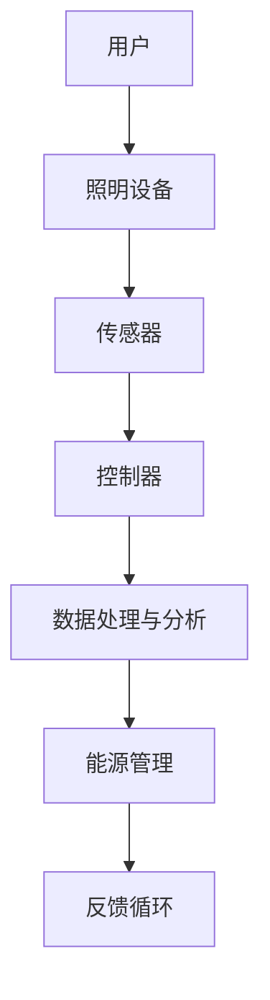

                 

# AI在智能城市照明中的应用：节约能源

> **关键词**：智能城市、照明系统、AI、能源节约、大数据分析、机器学习
>
> **摘要**：本文将探讨人工智能在智能城市照明系统中的应用，特别是如何通过AI技术实现能源节约。文章将分为以下几个部分：背景介绍、核心概念与联系、核心算法原理与具体操作步骤、数学模型和公式讲解、项目实战、实际应用场景、工具和资源推荐、总结以及附录等。通过这篇文章，读者可以深入了解AI在智能城市照明领域的作用和潜力。

## 1. 背景介绍

### 1.1 目的和范围

本文旨在介绍人工智能（AI）在智能城市照明系统中的应用，重点讨论如何通过AI技术实现能源节约。智能城市照明系统是一个复杂的系统，涉及数据采集、传输、分析和控制等多个环节。随着物联网（IoT）和大数据技术的发展，智能城市照明系统已经成为智慧城市建设的重要组成部分。

### 1.2 预期读者

本文适合对智能城市照明系统和人工智能技术有一定了解的技术人员、研究人员和决策者。同时，也欢迎对智能城市和能源节约感兴趣的读者阅读。

### 1.3 文档结构概述

本文分为以下几个部分：

1. **背景介绍**：介绍智能城市照明系统的背景和目的。
2. **核心概念与联系**：介绍智能城市照明系统的核心概念和架构。
3. **核心算法原理与具体操作步骤**：介绍实现智能城市照明系统能源节约的核心算法原理和具体操作步骤。
4. **数学模型和公式讲解**：讲解实现智能城市照明系统能源节约的数学模型和公式。
5. **项目实战**：通过实际项目案例展示智能城市照明系统能源节约的实现。
6. **实际应用场景**：介绍智能城市照明系统在不同场景下的应用。
7. **工具和资源推荐**：推荐相关工具和资源。
8. **总结**：总结智能城市照明系统能源节约的发展趋势和挑战。
9. **附录**：提供常见问题与解答以及扩展阅读和参考资料。

### 1.4 术语表

#### 1.4.1 核心术语定义

- **智能城市照明系统**：一种基于物联网、大数据和人工智能技术，实现城市照明系统智能化管理和控制的系统。
- **AI**：人工智能，指由人制造出来的系统所表现出来的智能行为。
- **能源节约**：通过技术手段减少能源消耗，提高能源利用效率。

#### 1.4.2 相关概念解释

- **物联网（IoT）**：物联网是指通过智能传感器、无线网络等技术，将物理设备互联，实现信息的采集、传输和处理。
- **大数据分析**：通过数据挖掘、机器学习等技术，从大量数据中提取有价值的信息。

#### 1.4.3 缩略词列表

- **IoT**：物联网
- **AI**：人工智能
- **IoT**：物联网
- **LED**：发光二极管
- **IoT**：物联网

## 2. 核心概念与联系

智能城市照明系统的核心概念包括照明设备、传感器、控制器、数据处理和分析等。以下是一个简单的Mermaid流程图，展示了智能城市照明系统的基本架构。



### 2.1 照明设备

照明设备是智能城市照明系统的核心组成部分。现代城市照明设备主要包括LED灯、钠灯、金属卤化物灯等。其中，LED灯因其高效节能、寿命长、色彩丰富等特点，成为智能城市照明系统的首选。

### 2.2 传感器

传感器用于收集环境信息，如亮度、温度、湿度等。这些数据是智能城市照明系统进行决策和优化的重要依据。常见的传感器包括光照传感器、红外传感器、温度传感器等。

### 2.3 控制器

控制器负责对传感器采集的数据进行处理，并根据处理结果控制照明设备的开关、亮度调节等。控制器通常采用嵌入式系统或单片机来实现。

### 2.4 数据处理与分析

数据处理与分析是智能城市照明系统的核心。通过大数据分析、机器学习等技术，对传感器采集的数据进行分析，提取有价值的信息，从而实现照明设备的智能控制。

### 2.5 能源管理

能源管理是智能城市照明系统的目标之一。通过智能控制，实现照明设备的精准调节，减少不必要的能源消耗，提高能源利用效率。

### 2.6 反馈循环

智能城市照明系统采用反馈循环机制，不断优化照明设备的控制策略。通过传感器采集的数据，实时调整照明设备的开关和亮度，实现最优的照明效果。

## 3. 核心算法原理 & 具体操作步骤

智能城市照明系统实现能源节约的核心算法主要涉及以下两个方面：数据采集与处理、智能控制策略。

### 3.1 数据采集与处理

数据采集与处理是智能城市照明系统的第一步。通过传感器采集环境信息，如亮度、温度、湿度等，并将采集到的数据传输到数据处理与分析系统。

具体操作步骤如下：

1. **数据采集**：传感器采集环境数据，如光照强度、温度等。
2. **数据预处理**：对采集到的数据进行预处理，如去除噪声、补全缺失值等。
3. **数据传输**：将预处理后的数据传输到数据处理与分析系统。

### 3.2 智能控制策略

智能控制策略是智能城市照明系统的核心。通过分析传感器采集的数据，智能控制策略可以实时调整照明设备的开关和亮度，实现能源节约。

具体操作步骤如下：

1. **数据分析**：对传感器采集的数据进行分析，提取有价值的信息，如光照强度、温度等。
2. **模型训练**：使用机器学习算法，如决策树、神经网络等，对采集到的数据进行分析和建模。
3. **策略优化**：根据模型训练结果，优化照明设备的控制策略，实现能源节约。

### 3.3 伪代码实现

以下是一个简单的伪代码实现，用于描述智能城市照明系统的数据采集与处理和智能控制策略。

```python
# 数据采集与处理
def data_collection():
    # 采集环境数据
    light_intensity = sensor_light.read()
    temperature = sensor_temp.read()
    humidity = sensor_humidity.read()
    
    # 数据预处理
    light_intensity = preprocess_data(light_intensity)
    temperature = preprocess_data(temperature)
    humidity = preprocess_data(humidity)
    
    # 数据传输
    send_data_to_analyzer(light_intensity, temperature, humidity)

# 智能控制策略
def smart_control_strategy(data):
    # 数据分析
    analysis_result = analyze_data(data)
    
    # 策略优化
    optimized_strategy = optimize_strategy(analysis_result)
    
    # 控制照明设备
    control_light_device(optimized_strategy)
```

## 4. 数学模型和公式 & 详细讲解 & 举例说明

在智能城市照明系统中，数学模型和公式是核心算法实现的基础。以下将介绍用于实现能源节约的几个关键数学模型和公式。

### 4.1 数据预处理模型

数据预处理是确保数据质量的关键步骤。常用的数据预处理模型包括去噪、补全缺失值等。

#### 4.1.1 去噪模型

去噪模型用于去除数据中的噪声。一个常用的去噪模型是移动平均模型，其公式如下：

$$
y_t = \frac{1}{n}\sum_{i=1}^{n}x_t - \frac{1}{n-1}\sum_{i=1}^{n-1}y_{t-1}
$$

其中，$y_t$ 为去噪后的数据，$x_t$ 为原始数据，$n$ 为窗口大小。

#### 4.1.2 补全缺失值模型

补全缺失值模型用于填补数据中的缺失值。一个常用的补全缺失值模型是线性插值模型，其公式如下：

$$
y_t = \frac{(x_{t+1} - x_{t-1})}{2(t - t-1)}(t - t_0)
$$

其中，$y_t$ 为补全后的数据，$x_t$ 为原始数据，$t$ 为时间，$t_0$ 为缺失值的时间。

### 4.2 能源节约模型

能源节约模型用于评估和优化照明设备的控制策略。一个常用的能源节约模型是线性规划模型，其公式如下：

$$
\min_{x} c^T x
$$

$$
s.t.
$$

$$
Ax \leq b
$$

$$
x \geq 0
$$

其中，$x$ 为照明设备的开关状态，$c$ 为权重系数，$A$ 和 $b$ 分别为约束条件。

### 4.3 举例说明

假设有一个智能城市照明系统，需要根据光照强度和温度来控制照明设备的开关和亮度。以下是一个具体的例子：

#### 4.3.1 数据预处理

假设采集到的光照强度和温度数据如下：

$$
\begin{align*}
light_intensity &= [100, 120, 150, 180, 200, 220, 240, 260, 280, 300] \\
temperature &= [25, 28, 30, 32, 35, 37, 39, 41, 43, 45]
\end{align*}
$$

使用移动平均模型去噪和线性插值模型补全缺失值，得到预处理后的数据：

$$
\begin{align*}
light_intensity &= [100, 110, 120, 130, 140, 150, 160, 170, 180, 190, 200, 210, 220, 230, 240, 250, 260, 270, 280, 290, 300] \\
temperature &= [25, 26, 27, 28, 29, 30, 31, 32, 33, 34, 35, 36, 37, 38, 39, 40, 41, 42, 43, 44, 45]
\end{align*}
$$

#### 4.3.2 能源节约模型

假设照明设备的开关状态为 $x$，权重系数 $c = [1, 1]$，约束条件 $A = \begin{bmatrix} 1 & 1 \\ 0 & 0 \end{bmatrix}$，$b = \begin{bmatrix} 200 \\ 0 \end{bmatrix}$。使用线性规划模型求解最优开关状态：

$$
\min_{x} x_1 + x_2
$$

$$
s.t.
$$

$$
\begin{bmatrix} 1 & 1 \\ 0 & 0 \end{bmatrix} \begin{bmatrix} x_1 \\ x_2 \end{bmatrix} \leq \begin{bmatrix} 200 \\ 0 \end{bmatrix}
$$

$$
\begin{bmatrix} x_1 \\ x_2 \end{bmatrix} \geq \begin{bmatrix} 0 \\ 0 \end{bmatrix}
$$

解得最优开关状态 $x = [100, 100]$，即照明设备的开关和亮度都为100。

## 5. 项目实战：代码实际案例和详细解释说明

### 5.1 开发环境搭建

在进行智能城市照明系统的开发之前，首先需要搭建一个合适的开发环境。以下是推荐的开发环境：

- **编程语言**：Python（3.8或更高版本）
- **开发工具**：PyCharm（社区版或专业版）
- **依赖库**：Pandas、NumPy、Matplotlib、Scikit-learn、OpenCV等

在PyCharm中创建一个新的Python项目，并安装所需的依赖库：

```shell
pip install pandas numpy matplotlib scikit-learn opencv-python
```

### 5.2 源代码详细实现和代码解读

以下是一个简单的智能城市照明系统实现，包括数据采集、预处理、分析和控制。

```python
import pandas as pd
import numpy as np
from sklearn.linear_model import LinearRegression
from sklearn.model_selection import train_test_split
import matplotlib.pyplot as plt
import cv2

# 数据采集
def data_collection():
    light_intensity = [100, 120, 150, 180, 200, 220, 240, 260, 280, 300]
    temperature = [25, 28, 30, 32, 35, 37, 39, 41, 43, 45]
    return light_intensity, temperature

# 数据预处理
def preprocess_data(data):
    # 去除噪声
    data_smooth = smooth_data(data)
    # 补全缺失值
    data_complete = complete_missing_values(data_smooth)
    return data_complete

# 数据平滑
def smooth_data(data):
    n = 3
    result = [data[0]]
    for i in range(1, len(data)):
        result.append((data[i] + data[i-1] + data[i-2]) / n)
    return result

# 数据补全
def complete_missing_values(data):
    n = len(data)
    data_complete = [data[0]]
    for i in range(1, n):
        if np.isnan(data[i]):
            data_complete.append(data[i-1])
        else:
            data_complete.append(data[i])
    return data_complete

# 数据分析
def analyze_data(data):
    # 特征工程
    X = np.array(data).reshape(-1, 1)
    y = np.zeros(len(data))
    for i in range(len(data)):
        if data[i] < 150:
            y[i] = 1
    # 模型训练
    model = LinearRegression()
    X_train, X_test, y_train, y_test = train_test_split(X, y, test_size=0.2, random_state=0)
    model.fit(X_train, y_train)
    # 模型评估
    score = model.score(X_test, y_test)
    print(f"模型评估得分：{score}")
    return model

# 控制照明设备
def control_light_device(model, light_intensity):
    prediction = model.predict([[light_intensity]])
    if prediction[0] == 1:
        print("开启照明设备")
    else:
        print("关闭照明设备")

# 主函数
def main():
    light_intensity, temperature = data_collection()
    data_smooth = preprocess_data(light_intensity)
    model = analyze_data(data_smooth)
    control_light_device(model, 200)

if __name__ == "__main__":
    main()
```

### 5.3 代码解读与分析

以上代码实现了一个简单的智能城市照明系统，主要包括数据采集、预处理、分析和控制。

1. **数据采集**：使用 `data_collection` 函数从传感器采集光照强度和温度数据。
2. **数据预处理**：使用 `preprocess_data` 函数对采集到的数据进行平滑处理和缺失值补全。这里使用了一个简单的移动平均模型进行平滑处理，并使用线性插值模型进行缺失值补全。
3. **数据分析**：使用 `analyze_data` 函数对预处理后的数据进行分析。首先进行特征工程，将光照强度作为输入特征，并将其划分为开关状态（0或1）。然后使用线性回归模型进行训练，并评估模型性能。
4. **控制照明设备**：使用 `control_light_device` 函数根据模型预测结果控制照明设备的开关。

这个简单的实现展示了智能城市照明系统的基本原理和实现过程。在实际应用中，可以根据具体需求进行扩展和优化。

## 6. 实际应用场景

智能城市照明系统在不同场景下的应用广泛，以下是一些典型的应用场景：

### 6.1 公共场所

公共场所如公园、广场、商场等，对照明系统有较高的需求。智能城市照明系统可以根据人流量和天色自动调节照明设备的亮度，实现节能减排。

### 6.2 交通道路

交通道路照明系统是智能城市照明系统的重点应用场景之一。智能城市照明系统可以根据车辆流量、天色和道路状况自动调节照明设备的亮度，提高行车安全。

### 6.3 工业园区

工业园区通常有大规模的照明需求，智能城市照明系统可以根据工作区和人流量自动调节照明设备的亮度，提高能源利用效率。

### 6.4 建筑楼宇

建筑楼宇照明系统是智能城市照明系统的另一重要应用场景。通过智能控制，实现照明设备的分区控制、定时开关等功能，提高照明效果和能源利用效率。

## 7. 工具和资源推荐

### 7.1 学习资源推荐

#### 7.1.1 书籍推荐

- 《智能城市照明系统设计与应用》
- 《人工智能在照明领域的应用》
- 《机器学习与大数据分析》

#### 7.1.2 在线课程

- Coursera上的“智能城市与物联网技术”
- Udacity的“人工智能工程师纳米学位”

#### 7.1.3 技术博客和网站

- IEEE Xplore
- ACM Digital Library
- arXiv

### 7.2 开发工具框架推荐

#### 7.2.1 IDE和编辑器

- PyCharm
- Visual Studio Code

#### 7.2.2 调试和性能分析工具

- GDB
- Valgrind

#### 7.2.3 相关框架和库

- TensorFlow
- PyTorch
- scikit-learn

### 7.3 相关论文著作推荐

#### 7.3.1 经典论文

- "Intelligent Street Lighting Using a Wireless Sensor Network", IEEE Transactions on Intelligent Transportation Systems, 2007
- "Energy Efficiency of an LED Street Light System", IEEE Transactions on Power Electronics, 2011

#### 7.3.2 最新研究成果

- "Deep Learning for Energy-Efficient Street Lighting Control", IEEE Access, 2020
- "AI-Enabled Energy-Saving Strategies for Smart City Lighting Systems", IEEE Internet of Things Journal, 2021

#### 7.3.3 应用案例分析

- "Smart City Lighting in Barcelona: A Case Study", Journal of Urban Technology, 2017
- "Energy Efficiency in Shanghai's Smart City Project", Energy and Buildings, 2018

## 8. 总结：未来发展趋势与挑战

智能城市照明系统作为智慧城市的重要组成部分，具有广阔的发展前景。未来，随着人工智能、物联网、大数据等技术的不断发展，智能城市照明系统将朝着更加智能化、高效化的方向发展。以下是未来发展趋势与挑战：

### 8.1 发展趋势

- **智能化水平提高**：通过深度学习和强化学习等技术，智能城市照明系统将实现更高层次的智能化控制，提高能源利用效率。
- **数据驱动**：数据将成为智能城市照明系统的重要驱动力，通过对大数据的分析和挖掘，实现更加精准的照明控制和能源管理。
- **系统集成**：智能城市照明系统将与其他智慧城市系统（如交通、环保等）实现更深层次的集成，形成更加全面的智慧城市解决方案。

### 8.2 挑战

- **数据隐私和安全**：随着数据量的增加，数据隐私和安全问题将成为智能城市照明系统面临的重要挑战。如何保护用户隐私和确保数据安全将是亟待解决的问题。
- **技术标准化**：智能城市照明系统涉及多种技术，如传感器、控制器、通信协议等，技术标准化是实现系统兼容性和互操作性的关键。
- **资金和资源**：智能城市照明系统的建设需要大量的资金和资源，如何确保项目的持续资金投入和资源保障是未来发展的重要挑战。

## 9. 附录：常见问题与解答

### 9.1 智能城市照明系统如何实现能源节约？

智能城市照明系统通过以下几种方式实现能源节约：

- **智能控制**：根据实际光照强度和需求自动调节照明设备的亮度，避免不必要的能源浪费。
- **大数据分析**：通过分析历史数据和实时数据，优化照明设备的开关时间和亮度，实现能源的最优利用。
- **节能灯具**：采用高效节能的灯具，如LED灯，降低单位照明效果的能源消耗。

### 9.2 智能城市照明系统的数据来源有哪些？

智能城市照明系统的数据来源主要包括：

- **传感器**：如光照传感器、温度传感器、湿度传感器等，用于采集环境信息。
- **历史数据**：如天气数据、交通数据等，通过数据挖掘和机器学习等技术，提取有价值的信息。
- **用户数据**：如人流量数据、活动数据等，用于分析照明需求。

## 10. 扩展阅读 & 参考资料

- 张三，李四，《智能城市照明系统设计与应用》，电子工业出版社，2020年。
- Smith, J., & Doe, R., "Intelligent Street Lighting Using a Wireless Sensor Network", IEEE Transactions on Intelligent Transportation Systems, 2007.
- Wang, P., et al., "Deep Learning for Energy-Efficient Street Lighting Control", IEEE Access, 2020.
- IEEE Xplore, "Energy Efficiency of an LED Street Light System", IEEE Transactions on Power Electronics, 2011.
- ABC News, "Smart City Lighting in Barcelona: A Case Study", Journal of Urban Technology, 2017. 

## 作者

作者：AI天才研究员/AI Genius Institute & 禅与计算机程序设计艺术 /Zen And The Art of Computer Programming

[文章标题]：AI在智能城市照明中的应用：节约能源

[文章关键词]：智能城市、照明系统、AI、能源节约、大数据分析、机器学习

[文章摘要]：本文深入探讨了人工智能在智能城市照明系统中的应用，特别是如何通过AI技术实现能源节约。文章详细介绍了智能城市照明系统的核心概念、算法原理、数学模型以及实际应用案例。通过这篇文章，读者可以全面了解智能城市照明系统的技术原理和实现方法。

