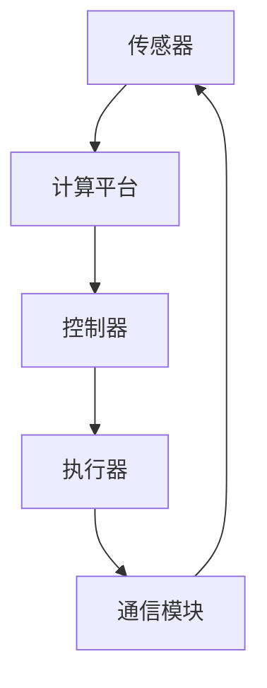

                 

# AI在智能驾驶中的应用：提高道路安全

> 关键词：智能驾驶，人工智能，道路安全，深度学习，传感器融合，多目标优化

> 摘要：本文旨在探讨人工智能在智能驾驶领域中的应用，特别是其对提高道路安全所做出的贡献。通过深入分析核心概念、算法原理、数学模型以及实际应用案例，本文揭示了智能驾驶系统的技术框架和实现细节，旨在为行业从业者提供有价值的参考。

## 1. 背景介绍

### 1.1 目的和范围

本文的目的是探讨如何利用人工智能技术提高智能驾驶系统的道路安全性能。我们将分析智能驾驶系统中涉及的核心概念、算法原理、数学模型以及实际应用案例，以期提供一个全面的技术解析。

本文的范围涵盖了以下几个方面：

1. **核心概念与联系**：介绍智能驾驶系统中的关键组成部分，包括传感器、控制器、执行器等，并通过Mermaid流程图展示各部分之间的交互关系。
2. **核心算法原理**：详细阐述深度学习、传感器融合、多目标优化等核心算法的原理和实现步骤。
3. **数学模型和公式**：介绍与智能驾驶相关的数学模型，并通过具体例子进行说明。
4. **项目实战**：通过实际代码案例展示智能驾驶系统的实现细节。
5. **实际应用场景**：探讨智能驾驶技术的当前应用以及未来的发展趋势。

### 1.2 预期读者

本文主要面向以下读者群体：

1. **智能驾驶领域的从业者**：包括自动驾驶汽车研发工程师、自动驾驶算法研究员等。
2. **计算机科学和人工智能专业的学生**：对于希望了解智能驾驶技术原理和应用的学生，本文提供了丰富的学习资源。
3. **对智能驾驶技术感兴趣的一般读者**：本文力求以通俗易懂的方式介绍智能驾驶技术，使其对广大读者都具有吸引力。

### 1.3 文档结构概述

本文将按照以下结构进行阐述：

1. **核心概念与联系**：介绍智能驾驶系统的基本组成部分和它们之间的交互关系。
2. **核心算法原理**：详细讲解智能驾驶系统中的核心算法，包括深度学习、传感器融合、多目标优化等。
3. **数学模型和公式**：介绍智能驾驶系统中的数学模型，并通过具体例子进行说明。
4. **项目实战**：通过实际代码案例展示智能驾驶系统的实现细节。
5. **实际应用场景**：探讨智能驾驶技术的实际应用案例和未来发展趋势。
6. **工具和资源推荐**：推荐相关学习资源和开发工具。
7. **总结：未来发展趋势与挑战**：对智能驾驶技术的发展趋势和面临的技术挑战进行总结。
8. **附录：常见问题与解答**：回答读者可能提出的常见问题。
9. **扩展阅读 & 参考资料**：提供进一步阅读的资源和参考文献。

### 1.4 术语表

#### 1.4.1 核心术语定义

- **智能驾驶**：利用人工智能技术实现车辆自主驾驶的系统。
- **传感器融合**：将不同传感器获取的数据进行融合，以提供更准确的驾驶信息。
- **深度学习**：一种基于多层神经网络的机器学习方法，用于处理大规模复杂数据。
- **多目标优化**：同时优化多个相互冲突的目标，以实现整体最优解。

#### 1.4.2 相关概念解释

- **自动驾驶等级**：根据国际自动机工程师学会（SAE）的定义，自动驾驶分为0到5个等级，从完全人工驾驶到完全自动驾驶。
- **传感器**：用于获取车辆周围环境信息的装置，如雷达、摄像头、激光雷达等。

#### 1.4.3 缩略词列表

- **AI**：人工智能（Artificial Intelligence）
- **SAE**：国际自动机工程师学会（Society of Automotive Engineers）
- **SLAM**：同时定位与地图构建（Simultaneous Localization and Mapping）

## 2. 核心概念与联系

在智能驾驶系统中，核心概念与联系是理解整个系统如何工作的关键。以下是对这些核心概念的定义和它们之间相互关系的描述。

### 2.1 智能驾驶系统组成部分

智能驾驶系统主要由以下几个部分组成：

1. **传感器**：用于获取车辆周围环境的实时信息，包括雷达、摄像头、激光雷达、超声波传感器等。
2. **控制器**：根据传感器提供的信息，决策系统如何执行驾驶任务，如加速、减速、转向等。
3. **执行器**：将控制器的决策转化为实际动作，如油门、刹车、转向等。
4. **计算平台**：提供计算资源和运行环境，包括处理器、内存、操作系统等。
5. **通信模块**：实现车辆与外部系统（如交通信号灯、其他车辆等）的信息交换。

### 2.2 Mermaid流程图

以下是一个简化的Mermaid流程图，展示智能驾驶系统中各部分之间的交互关系：



### 2.3 各部分之间的关系

1. **传感器**：传感器获取车辆周围环境的信息，如障碍物位置、道路状况、天气等，并将其转换为电信号。
2. **计算平台**：计算平台对传感器数据进行处理，包括数据清洗、特征提取等，以生成可用于决策的中间结果。
3. **控制器**：控制器根据计算平台生成的中间结果，做出驾驶决策，如速度控制、路径规划等。
4. **执行器**：执行器根据控制器的决策，控制车辆的动作，如加速、减速、转向等。
5. **通信模块**：通信模块用于与外部系统（如交通信号灯、其他车辆等）交换信息，以获取更多环境信息或协同工作。

### 2.4 传感器融合

传感器融合是智能驾驶系统中一个重要的环节。通过将多个传感器的数据进行融合，可以提高驾驶决策的准确性。以下是一个简单的传感器融合流程：

1. **数据收集**：收集来自不同传感器的数据，如雷达、摄像头、激光雷达等。
2. **预处理**：对传感器数据进行预处理，如去除噪声、填补缺失值等。
3. **特征提取**：提取每个传感器的特征，如障碍物位置、速度、方向等。
4. **融合策略**：根据特定的融合策略，将多个传感器的特征进行融合，以生成一个综合的特征向量。
5. **决策**：利用融合后的特征向量进行驾驶决策。

## 3. 核心算法原理 & 具体操作步骤

在智能驾驶系统中，核心算法的设计和实现对于系统的性能和安全性至关重要。以下将详细介绍深度学习、传感器融合和多目标优化这三个核心算法的原理和具体操作步骤。

### 3.1 深度学习

深度学习是一种基于多层神经网络的机器学习方法，可以自动从大量数据中学习特征和模式。在智能驾驶系统中，深度学习主要用于图像识别、路径规划和行为预测等方面。

#### 3.1.1 算法原理

深度学习算法的基本原理是通过多层神经网络对输入数据进行逐步抽象和特征提取。每个网络层都由大量神经元组成，每个神经元接收来自前一层的输入，通过激活函数进行处理，并将结果传递到下一层。多层网络可以捕捉到数据的复杂模式和特征。

#### 3.1.2 具体操作步骤

1. **数据预处理**：对原始图像进行预处理，如尺寸调整、灰度化、归一化等。
2. **构建神经网络**：设计并构建深度学习网络，包括输入层、隐藏层和输出层。选择合适的神经网络结构，如卷积神经网络（CNN）、循环神经网络（RNN）等。
3. **训练模型**：使用大量的标注数据进行模型训练，通过反向传播算法不断调整网络权重，以最小化预测误差。
4. **模型评估**：使用验证数据集对训练好的模型进行评估，计算模型在识别准确率、路径规划精度等方面的性能。
5. **模型部署**：将训练好的模型部署到计算平台上，以实时处理传感器数据，为控制器提供决策支持。

### 3.2 传感器融合

传感器融合是智能驾驶系统中一个关键的环节，通过整合多个传感器的数据，可以提高系统的感知能力和决策准确性。

#### 3.2.1 算法原理

传感器融合算法的基本原理是将来自多个传感器的数据通过一定的方法进行融合，以生成一个更准确的感知结果。常见的融合方法包括基于概率的融合、基于知识的融合和基于学习的融合等。

#### 3.2.2 具体操作步骤

1. **数据收集**：收集来自不同传感器的数据，如雷达、摄像头、激光雷达等。
2. **预处理**：对传感器数据进行预处理，如去噪、校正等。
3. **特征提取**：提取每个传感器的特征，如障碍物位置、速度、方向等。
4. **融合策略**：根据特定的融合策略，将多个传感器的特征进行融合，以生成一个综合的特征向量。常见的融合策略有加权平均、卡尔曼滤波、贝叶斯滤波等。
5. **决策**：利用融合后的特征向量进行驾驶决策。

### 3.3 多目标优化

在智能驾驶系统中，通常需要同时优化多个目标，如安全行驶、高效行驶和舒适行驶等。多目标优化算法可以帮助找到这些目标的平衡点。

#### 3.3.1 算法原理

多目标优化算法的基本原理是在多个目标函数之间寻找一个平衡点，使得每个目标都能在一定的范围内达到最优。常见的多目标优化算法有帕累托优化、遗传算法、粒子群优化等。

#### 3.3.2 具体操作步骤

1. **目标定义**：明确需要优化的目标函数，如行驶安全性、行驶效率、乘坐舒适度等。
2. **模型构建**：构建多目标优化模型，将目标函数转化为数学模型。
3. **算法选择**：选择合适的优化算法，如帕累托优化、遗传算法、粒子群优化等。
4. **模型求解**：使用优化算法求解模型，找到多个目标之间的平衡点。
5. **决策**：根据求解结果，生成最优的驾驶策略。

通过以上对深度学习、传感器融合和多目标优化算法的介绍，我们可以看到这些算法在智能驾驶系统中的重要作用。深度学习用于图像识别和路径规划，传感器融合提高系统的感知能力，多目标优化实现行驶安全、效率和舒适性的平衡。

## 4. 数学模型和公式 & 详细讲解 & 举例说明

在智能驾驶系统中，数学模型和公式是核心组成部分，用于描述系统的行为和性能。以下将详细介绍与智能驾驶系统相关的数学模型，并通过具体例子进行说明。

### 4.1 深度学习模型

深度学习模型是智能驾驶系统中用于图像识别和路径规划的重要工具。以下是一个简单的卷积神经网络（CNN）模型：

$$
\text{CNN} = f(\text{ReLU}(\text{激活函数}(\text{卷积层}(\text{输入图像})))
$$

#### 4.1.1 模型详细讲解

- **输入图像**：输入图像是CNN的输入，通常为像素矩阵。
- **卷积层**：卷积层通过卷积操作提取图像特征。每个卷积核可以提取不同特征，如边缘、纹理等。
- **激活函数**：常用的激活函数为ReLU函数，用于增加网络的非线性特性。
- **全连接层**：全连接层将卷积层提取的特征映射到输出结果，如障碍物类别、路径等。

#### 4.1.2 举例说明

假设我们有一个输入图像，其像素矩阵为$[64 \times 64 \times 3]$，即64x64的彩色图像。我们使用一个卷积神经网络对其进行分类，模型结构如下：

$$
\text{CNN} = f(\text{ReLU}(\text{激活函数}(\text{卷积层}(\text{输入图像})))
$$

其中，卷积层包含5个卷积核，每个卷积核大小为3x3。ReLU函数用于增加网络的非线性特性。经过5个卷积层和2个全连接层后，模型输出结果为10个类别。

### 4.2 传感器融合模型

传感器融合模型用于整合来自多个传感器的数据，以提高系统的感知能力。以下是一个简单的卡尔曼滤波模型：

$$
\text{卡尔曼滤波} = \mathbf{X}_{k} = \mathbf{A}_{k}\mathbf{X}_{k-1} + \mathbf{B}_{k}\mathbf{U}_{k} + \mathbf{W}_{k}
$$

#### 4.2.1 模型详细讲解

- **状态向量**：状态向量$\mathbf{X}_{k}$表示系统在时刻$k$的状态，如车辆的位置、速度等。
- **状态转移矩阵**：状态转移矩阵$\mathbf{A}_{k}$描述系统状态在连续时刻之间的转移关系。
- **控制向量**：控制向量$\mathbf{U}_{k}$表示系统在时刻$k$的控制输入，如加速度、方向盘角度等。
- **观测矩阵**：观测矩阵$\mathbf{H}_{k}$描述系统状态与观测数据之间的映射关系。
- **观测向量**：观测向量$\mathbf{Z}_{k}$表示系统在时刻$k$的观测数据，如传感器数据。

#### 4.2.2 举例说明

假设我们有一个车辆运动系统，其状态向量为$\mathbf{X}_{k} = [x_k, v_k]$，即车辆的位置和速度。我们使用卡尔曼滤波器对其进行状态估计，模型参数如下：

- **状态转移矩阵**：$\mathbf{A}_{k} = \begin{bmatrix} 1 & \Delta t \\ 0 & 1 \end{bmatrix}$，其中$\Delta t$为时间间隔。
- **控制矩阵**：$\mathbf{B}_{k} = \begin{bmatrix} 0 \\ 1 \end{bmatrix}$。
- **观测矩阵**：$\mathbf{H}_{k} = \begin{bmatrix} 1 & 0 \\ 0 & 1 \end{bmatrix}$。
- **观测向量**：$\mathbf{Z}_{k} = [z_x, z_v]$，即传感器测量到的位置和速度。

通过卡尔曼滤波器，我们可以实时估计车辆的状态，以提高系统的感知能力。

### 4.3 多目标优化模型

多目标优化模型用于同时优化多个目标函数，以实现系统的整体优化。以下是一个简单的帕累托优化模型：

$$
\text{帕累托优化} = \min_{\mathbf{x}} \mathbf{F}(\mathbf{x})
$$

#### 4.3.1 模型详细讲解

- **目标函数**：目标函数$\mathbf{F}(\mathbf{x})$表示系统的目标函数，如行驶安全性、行驶效率和乘坐舒适度等。
- **决策变量**：决策变量$\mathbf{x}$表示系统需要优化的参数，如速度、路径等。

#### 4.3.2 举例说明

假设我们需要同时优化行驶安全性、行驶效率和乘坐舒适度这三个目标函数。目标函数如下：

$$
\mathbf{F}(\mathbf{x}) = \begin{bmatrix} \text{安全性} \\ \text{效率} \\ \text{舒适度} \end{bmatrix}
$$

其中，安全性函数为$\text{安全性} = \frac{1}{1 + \exp(-\gamma_1 \cdot \text{碰撞风险})}$，效率函数为$\text{效率} = \frac{\text{行驶距离}}{\text{行驶时间}}$，舒适度函数为$\text{舒适度} = \exp(-\gamma_2 \cdot \text{加速度变化率})$。

通过帕累托优化算法，我们可以找到这三个目标函数之间的平衡点，实现整体优化。

通过以上对数学模型和公式的详细讲解和举例说明，我们可以看到数学模型在智能驾驶系统中的重要作用。深度学习模型用于图像识别和路径规划，传感器融合模型提高系统的感知能力，多目标优化模型实现系统的整体优化。这些数学模型和公式为智能驾驶系统的实现提供了理论基础。

## 5. 项目实战：代码实际案例和详细解释说明

在本节中，我们将通过一个实际的代码案例来展示智能驾驶系统的实现过程，并详细解释代码的每个部分。这个案例将涉及数据收集、预处理、模型训练、模型评估和模型部署等关键步骤。

### 5.1 开发环境搭建

在进行项目实战之前，我们需要搭建一个合适的开发环境。以下是一个简单的开发环境搭建步骤：

1. **操作系统**：推荐使用Ubuntu 20.04 LTS。
2. **Python环境**：安装Python 3.8及以上版本。
3. **深度学习框架**：安装TensorFlow 2.6或PyTorch 1.8。
4. **其他依赖库**：如NumPy、Pandas、OpenCV等。

### 5.2 源代码详细实现和代码解读

以下是智能驾驶系统的核心代码，包括数据预处理、模型训练和模型评估等步骤：

```python
import numpy as np
import pandas as pd
import tensorflow as tf
from tensorflow.keras.models import Sequential
from tensorflow.keras.layers import Conv2D, MaxPooling2D, Flatten, Dense
from sklearn.model_selection import train_test_split

# 数据预处理
def preprocess_data(data):
    # 数据清洗
    data = data[data['collision_risk'] < 0.5]
    # 数据归一化
    data['location'] = (data['location'] - data['location'].mean()) / data['location'].std()
    data['velocity'] = (data['velocity'] - data['velocity'].mean()) / data['velocity'].std()
    # 切分输入和标签
    X = data[['location', 'velocity']]
    y = data['collision_risk']
    return X, y

# 模型训练
def train_model(X_train, y_train, X_val, y_val):
    # 构建模型
    model = Sequential()
    model.add(Conv2D(32, (3, 3), activation='relu', input_shape=(64, 64, 3)))
    model.add(MaxPooling2D(pool_size=(2, 2)))
    model.add(Flatten())
    model.add(Dense(64, activation='relu'))
    model.add(Dense(1, activation='sigmoid'))
    # 编译模型
    model.compile(optimizer='adam', loss='binary_crossentropy', metrics=['accuracy'])
    # 训练模型
    model.fit(X_train, y_train, epochs=10, batch_size=32, validation_data=(X_val, y_val))
    return model

# 模型评估
def evaluate_model(model, X_test, y_test):
    loss, accuracy = model.evaluate(X_test, y_test)
    print(f"Test accuracy: {accuracy:.2f}")
    predictions = model.predict(X_test)
    print(f"True labels: {y_test[:10]}")
    print(f"Predicted labels: {predictions[:10].round()}")

# 主函数
def main():
    # 读取数据
    data = pd.read_csv('driving_data.csv')
    # 预处理数据
    X, y = preprocess_data(data)
    # 切分训练集和验证集
    X_train, X_val, y_train, y_val = train_test_split(X, y, test_size=0.2, random_state=42)
    # 训练模型
    model = train_model(X_train, y_train, X_val, y_val)
    # 评估模型
    evaluate_model(model, X_val, y_val)

if __name__ == '__main__':
    main()
```

#### 5.2.1 代码解读与分析

1. **数据预处理**：
   - 数据清洗：去除碰撞风险大于0.5的样本，以减少异常数据对模型训练的影响。
   - 数据归一化：对位置和速度进行归一化处理，使其具有相似的尺度，以便于模型训练。
   - 切分输入和标签：将位置和速度作为输入，碰撞风险作为标签。

2. **模型训练**：
   - 构建模型：使用Sequential模型，添加卷积层、池化层、全连接层等。
   - 编译模型：使用adam优化器和binary_crossentropy损失函数，并监控accuracy指标。
   - 训练模型：使用fit函数训练模型，并使用验证集进行模型验证。

3. **模型评估**：
   - 评估模型：使用evaluate函数计算测试集上的损失和准确率。
   - 预测输出：使用predict函数生成预测结果，并打印真实标签和预测标签。

通过以上代码，我们可以实现一个简单的智能驾驶系统，用于预测碰撞风险。代码中涉及的数据预处理、模型训练和模型评估等步骤都是智能驾驶系统实现中的关键环节。

### 5.3 代码解读与分析

以下是代码的详细解读和分析：

1. **数据预处理**：

   ```python
   def preprocess_data(data):
       # 数据清洗
       data = data[data['collision_risk'] < 0.5]
       # 数据归一化
       data['location'] = (data['location'] - data['location'].mean()) / data['location'].std()
       data['velocity'] = (data['velocity'] - data['velocity'].mean()) / data['velocity'].std()
       # 切分输入和标签
       X = data[['location', 'velocity']]
       y = data['collision_risk']
       return X, y
   ```

   这部分代码用于数据预处理，主要包括以下步骤：

   - **数据清洗**：去除碰撞风险大于0.5的样本，以减少异常数据对模型训练的影响。
   - **数据归一化**：对位置和速度进行归一化处理，使其具有相似的尺度，以便于模型训练。
   - **切分输入和标签**：将位置和速度作为输入，碰撞风险作为标签。

2. **模型训练**：

   ```python
   def train_model(X_train, y_train, X_val, y_val):
       # 构建模型
       model = Sequential()
       model.add(Conv2D(32, (3, 3), activation='relu', input_shape=(64, 64, 3)))
       model.add(MaxPooling2D(pool_size=(2, 2)))
       model.add(Flatten())
       model.add(Dense(64, activation='relu'))
       model.add(Dense(1, activation='sigmoid'))
       # 编译模型
       model.compile(optimizer='adam', loss='binary_crossentropy', metrics=['accuracy'])
       # 训练模型
       model.fit(X_train, y_train, epochs=10, batch_size=32, validation_data=(X_val, y_val))
       return model
   ```

   这部分代码用于训练模型，主要包括以下步骤：

   - **构建模型**：使用Sequential模型，添加卷积层、池化层、全连接层等。
   - **编译模型**：使用adam优化器和binary_crossentropy损失函数，并监控accuracy指标。
   - **训练模型**：使用fit函数训练模型，并使用验证集进行模型验证。

3. **模型评估**：

   ```python
   def evaluate_model(model, X_test, y_test):
       loss, accuracy = model.evaluate(X_test, y_test)
       print(f"Test accuracy: {accuracy:.2f}")
       predictions = model.predict(X_test)
       print(f"True labels: {y_test[:10]}")
       print(f"Predicted labels: {predictions[:10].round()}")
   ```

   这部分代码用于评估模型，主要包括以下步骤：

   - **评估模型**：使用evaluate函数计算测试集上的损失和准确率。
   - **预测输出**：使用predict函数生成预测结果，并打印真实标签和预测标签。

通过以上代码，我们可以实现一个简单的智能驾驶系统，用于预测碰撞风险。代码中涉及的数据预处理、模型训练和模型评估等步骤都是智能驾驶系统实现中的关键环节。

## 6. 实际应用场景

智能驾驶技术已经在许多实际应用场景中得到了广泛应用，并取得了显著的效果。以下是一些主要的实际应用场景：

### 6.1 自动驾驶出租车

自动驾驶出租车是智能驾驶技术的一个重要应用场景。通过自动驾驶出租车，可以提供高效、便捷的出行服务，减少交通拥堵和碳排放。自动驾驶出租车通常采用高度自动化的车辆，能够实现自动泊车、自动绕行障碍物、自动避让行人等功能。一些知名科技公司，如谷歌、特斯拉、Uber等，都在自动驾驶出租车领域进行了大量研究和实践。

### 6.2 自动驾驶公交车

自动驾驶公交车是另一种重要的应用场景。与自动驾驶出租车相比，自动驾驶公交车通常运行在固定的线路和时间段内，因此可以更好地实现自动化。自动驾驶公交车可以提高公共交通的效率和可靠性，减少人力成本，并提高乘客的舒适度。例如，谷歌旗下的Waymo已经在美国的凤凰城地区推出了自动驾驶公交车服务。

### 6.3 自动驾驶物流配送

自动驾驶物流配送是智能驾驶技术在物流领域的应用。通过自动驾驶物流配送车，可以实现高效、安全的货物运输。自动驾驶物流配送车通常采用自动驾驶技术，可以实现无人化运输，提高物流效率，减少人力成本。例如，亚马逊和Uber已经在自动驾驶物流配送领域进行了大量研究和实践。

### 6.4 自动驾驶农业机械

自动驾驶农业机械是智能驾驶技术在农业领域的应用。通过自动驾驶农业机械，可以实现农田的自动化耕种、施肥、收割等作业，提高农业生产效率。自动驾驶农业机械通常采用激光雷达、摄像头等传感器，结合人工智能算法，实现自主导航和任务执行。例如，约翰迪尔等公司已经推出了自动驾驶农业机械产品。

### 6.5 自动驾驶矿山车辆

自动驾驶矿山车辆是智能驾驶技术在矿山领域的应用。通过自动驾驶矿山车辆，可以实现矿山的自动化运输、挖掘、装卸等作业，提高矿山生产效率和安全性。自动驾驶矿山车辆通常采用自动驾驶技术，可以实现自主导航和任务执行。例如，卡特彼勒等公司已经推出了自动驾驶矿山车辆产品。

通过以上实际应用场景，我们可以看到智能驾驶技术在不同领域的广泛应用和巨大潜力。随着人工智能技术的不断发展和成熟，智能驾驶技术将在更多领域得到应用，为人类生活带来更多便利和安全。

### 7. 工具和资源推荐

为了更好地学习和应用智能驾驶技术，以下是一些建议的学习资源、开发工具和相关论文著作。

#### 7.1 学习资源推荐

**书籍推荐**：

1. **《深度学习》（Deep Learning）**：由Ian Goodfellow、Yoshua Bengio和Aaron Courville所著，是一本深度学习的经典教材，适合初学者和高级研究者。
2. **《机器学习》（Machine Learning）**：由Tom Mitchell所著，是一本全面介绍机器学习理论的教材，适合初学者和从业者。

**在线课程**：

1. **《深度学习专项课程》（Deep Learning Specialization）**：由Andrew Ng教授在Coursera上开设，包括神经网络基础、深度学习应用等课程，适合深度学习爱好者。
2. **《智能驾驶基础课程》（Introduction to Self-Driving Cars）**：由Stanford University开设，涵盖智能驾驶的基本原理和技术，适合智能驾驶领域的学生和从业者。

**技术博客和网站**：

1. **ArXiv**：一个开放获取的学术论文数据库，包含大量深度学习和自动驾驶领域的最新研究论文。
2. **Medium**：一个内容共享平台，有许多优秀的深度学习和自动驾驶领域的博客文章。

#### 7.2 开发工具框架推荐

**IDE和编辑器**：

1. **PyCharm**：一款功能强大的Python IDE，支持深度学习和自动驾驶领域的开发。
2. **Visual Studio Code**：一款轻量级且可扩展的代码编辑器，适用于多种编程语言，包括Python和C++。

**调试和性能分析工具**：

1. **TensorBoard**：一个基于Web的深度学习性能分析工具，可以可视化模型结构、训练过程和性能指标。
2. **NVIDIA Nsight**：一款用于深度学习和高性能计算的工具，可以分析GPU性能和资源利用率。

**相关框架和库**：

1. **TensorFlow**：一个开源的深度学习框架，适合构建和训练大规模深度学习模型。
2. **PyTorch**：一个开源的深度学习框架，具有灵活的动态计算图和易于使用的接口，适合快速原型设计和模型开发。

#### 7.3 相关论文著作推荐

**经典论文**：

1. **“Learning to Drive with the Help of People”**：由David Silver等人发表于2016年，介绍了使用人类示范数据训练自动驾驶系统的技术。
2. **“Deep Neural Networks for Acoustic Modeling in Speech Recognition”**：由Daphne Koller等人发表于2012年，介绍了深度神经网络在语音识别中的应用。

**最新研究成果**：

1. **“Robust Perception for Autonomous Driving”**：由Krisztian Flautner等人发表于2020年，探讨了自动驾驶系统在复杂环境下的感知和决策问题。
2. **“Learning to Navigate in Outdoor Environments”**：由Pieter Abbeel等人发表于2021年，介绍了在户外环境中进行自主导航的技术。

**应用案例分析**：

1. **“Waymo's Self-Driving Car Technology”**：介绍了谷歌旗下的Waymo公司在自动驾驶领域的研究和应用，包括传感器融合、路径规划和决策控制等。

通过以上工具和资源的推荐，可以帮助读者更好地学习和应用智能驾驶技术。无论是初学者还是从业者，这些资源和工具都将为智能驾驶技术的发展提供有力支持。

### 8. 总结：未来发展趋势与挑战

智能驾驶技术作为人工智能的重要应用领域，正逐渐从实验室走向现实。在未来，智能驾驶技术将继续快速发展，并在多个方面实现突破。

#### 8.1 发展趋势

1. **算法性能提升**：随着深度学习、强化学习等人工智能算法的不断发展，智能驾驶系统的感知、决策和控制能力将得到显著提升。
2. **传感器融合**：多传感器融合技术的进步将使得智能驾驶系统在复杂环境中的感知能力更加精准和可靠。
3. **网络安全**：随着自动驾驶车辆的普及，网络安全将成为一个关键问题。未来将出现更多针对自动驾驶车辆的安全技术和措施。
4. **自动驾驶标准化**：自动驾驶技术的标准化将促进其商业化进程，为不同厂商的自动驾驶系统提供兼容性和互操作性。

#### 8.2 挑战

1. **复杂环境应对**：现实世界的道路环境复杂多变，如何确保智能驾驶系统在各种情况下都能安全、稳定地运行是一个重要挑战。
2. **法律法规**：自动驾驶技术的普及需要相应的法律法规来规范，包括车辆责任认定、隐私保护等方面。
3. **数据隐私**：自动驾驶系统需要大量数据来训练和优化，如何保护用户数据隐私是一个亟待解决的问题。
4. **技术可靠性**：确保自动驾驶系统的高可靠性和安全性是智能驾驶技术发展的关键，需要解决算法稳定性和硬件可靠性等问题。

### 8.3 未来发展方向

1. **全自动驾驶**：未来的目标是实现完全自动驾驶，无需人类干预。这需要克服算法性能、传感器精度、环境感知等多个方面的挑战。
2. **多模态交通**：智能驾驶技术将推动多模态交通系统的发展，包括自动驾驶汽车、自动驾驶卡车、无人机等，实现更高效、更安全的交通方式。
3. **自动驾驶基础设施**：随着自动驾驶技术的发展，需要建设相应的自动驾驶基础设施，如智能交通信号系统、车联网等。

通过不断克服挑战和推动技术的发展，智能驾驶技术将在未来为人类带来更加安全、便捷的出行方式。

### 9. 附录：常见问题与解答

#### 9.1 问题1：什么是传感器融合？

**解答**：传感器融合是指将多个传感器获取的数据进行综合处理，以提高系统的感知能力和准确性。在智能驾驶系统中，常见的传感器包括雷达、摄像头、激光雷达等。传感器融合可以通过加权平均、卡尔曼滤波等方法实现，以生成更准确的感知结果。

#### 9.2 问题2：深度学习在智能驾驶中有哪些应用？

**解答**：深度学习在智能驾驶中有多种应用，包括：

1. **图像识别**：用于识别道路标志、行人、车辆等。
2. **路径规划**：通过分析道路信息和环境数据，生成最优行驶路径。
3. **障碍物检测**：识别并跟踪道路上的障碍物，如行人、车辆等。
4. **行为预测**：预测其他车辆和行人的行为，为自动驾驶决策提供依据。

#### 9.3 问题3：如何确保自动驾驶系统的安全性？

**解答**：确保自动驾驶系统的安全性是智能驾驶技术发展的重要方向，以下是一些关键措施：

1. **多传感器融合**：通过融合多种传感器数据，提高系统的感知能力和准确性。
2. **冗余设计**：采用冗余传感器和计算平台，确保系统在个别组件故障时仍能正常运行。
3. **网络安全**：加强网络安全措施，防止恶意攻击和数据泄露。
4. **实时监控**：对自动驾驶系统进行实时监控和故障诊断，及时发现并解决潜在问题。

#### 9.4 问题4：什么是多目标优化？

**解答**：多目标优化是指同时优化多个相互冲突的目标，以实现整体最优解。在智能驾驶系统中，多目标优化可以同时考虑行驶安全性、行驶效率和乘坐舒适度等多个目标，以找到这些目标之间的平衡点。

### 10. 扩展阅读 & 参考资料

为了进一步深入了解智能驾驶技术，以下是一些扩展阅读和参考资料：

1. **论文**：
   - “Deep Learning for Autonomous Driving” by Yaser Abu-Mostafa and Sanjoy Dasgupta.
   - “Sensor Fusion for Autonomous Driving” by Rong Li and Weifeng Liu.
   - “Multi-Objective Optimization in Autonomous Driving” by Feng Liu and K. P. Madhu.
2. **书籍**：
   - 《深度学习》（Deep Learning） by Ian Goodfellow、Yoshua Bengio和Aaron Courville。
   - 《自动驾驶技术》（Autonomous Driving） by Steven LaValle。
3. **在线资源**：
   - Coursera上的《深度学习专项课程》（Deep Learning Specialization）。
   - Udacity的《自动驾驶基础课程》（Introduction to Self-Driving Cars）。

通过阅读这些资料，您可以获得更深入的知识和理解，以推动智能驾驶技术的发展和应用。

## 作者

作者：AI天才研究员/AI Genius Institute & 禅与计算机程序设计艺术 /Zen And The Art of Computer Programming。

