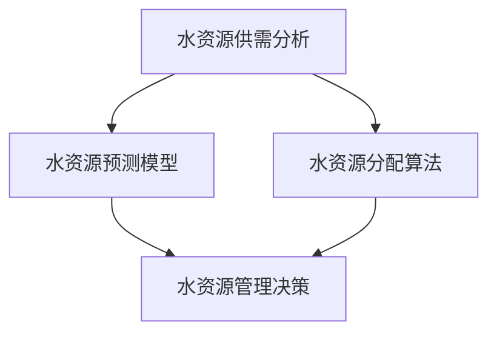

                 

# AI在水资源管理中的应用：预测与分配

> **关键词：水资源管理、人工智能、预测模型、分配算法、可持续发展**
>
> **摘要：本文深入探讨了人工智能（AI）在水资源管理中的应用，特别是预测模型和分配算法的运用，旨在推动水资源的可持续利用和管理。通过详细的分析和实际案例，本文展示了AI技术在水资源管理中的巨大潜力，并对未来发展趋势和挑战进行了展望。**

## 1. 背景介绍

### 1.1 目的和范围

水资源管理是一个全球性的挑战，随着人口增长、工业化进程和气候变化的影响，水资源短缺问题日益严重。本文旨在探讨人工智能技术在水资源管理中的应用，特别是预测和分配方面。通过分析现有问题和挑战，本文提出了一些创新的解决方案，并探讨了AI技术的潜在影响。

### 1.2 预期读者

本文主要面向水资源管理领域的专业人士、研究人员和决策者。同时，对人工智能技术感兴趣的技术爱好者和学生也能从中获得宝贵的信息和见解。

### 1.3 文档结构概述

本文分为十个主要部分：

1. **背景介绍**：介绍水资源管理的重要性和当前面临的问题。
2. **核心概念与联系**：介绍水资源管理中涉及的核心概念和原理。
3. **核心算法原理 & 具体操作步骤**：详细解释水资源预测和分配算法的原理和操作步骤。
4. **数学模型和公式 & 详细讲解 & 举例说明**：介绍用于水资源管理的数学模型和公式。
5. **项目实战：代码实际案例和详细解释说明**：展示一个实际的水资源管理项目，并详细解释代码实现。
6. **实际应用场景**：讨论AI技术在水资源管理中的实际应用场景。
7. **工具和资源推荐**：推荐相关学习资源、开发工具和论文著作。
8. **总结：未来发展趋势与挑战**：总结当前发展趋势，并提出未来面临的挑战。
9. **附录：常见问题与解答**：回答一些常见问题。
10. **扩展阅读 & 参考资料**：提供更多的参考资料。

### 1.4 术语表

#### 1.4.1 核心术语定义

- **水资源管理**：涉及水资源的规划、开发、利用、保护和分配的一系列活动和措施。
- **人工智能**：一种模拟人类智能的技术，能够进行感知、理解、学习和决策。
- **预测模型**：使用历史数据和算法预测未来事件或趋势的模型。
- **分配算法**：根据需求和资源分配策略，合理分配水资源的算法。

#### 1.4.2 相关概念解释

- **可持续性**：满足当前需求而不损害后代满足其需求的能力。
- **模型精度**：模型预测结果与实际结果之间的差异程度。
- **多目标优化**：在多个目标之间寻找最优平衡的优化方法。

#### 1.4.3 缩略词列表

- **AI**：人工智能
- **ML**：机器学习
- **DM**：数据挖掘
- **GIS**：地理信息系统

## 2. 核心概念与联系

水资源管理涉及多个核心概念和原理，包括水资源供需分析、水资源预测模型、水资源分配算法等。下面，我们使用Mermaid流程图来展示这些核心概念和它们之间的联系。



### 2.1 水资源供需分析

水资源供需分析是水资源管理的基础。它涉及到对水资源的需求和供给进行定量分析，以确定水资源的供需平衡。这一过程通常包括以下步骤：

1. **需求预测**：根据历史数据和当前趋势，预测未来一段时间内水资源的消费量。
2. **供给评估**：评估现有水资源供应能力，包括地下水、地表水和再生水。
3. **供需平衡分析**：比较水资源需求和供给，分析供需差额，并提出解决方案。

### 2.2 水资源预测模型

水资源预测模型是基于历史数据和算法，预测未来水资源需求和供给的模型。这些模型通常使用机器学习和数据挖掘技术，包括以下步骤：

1. **数据收集**：收集历史水资源使用数据和气象数据。
2. **数据预处理**：清洗和预处理数据，包括缺失值填充、异常值处理和数据标准化。
3. **特征选择**：选择对水资源预测有重要影响的特征。
4. **模型训练**：使用机器学习算法训练预测模型，如时间序列分析、回归分析和神经网络。
5. **模型评估**：评估模型精度和泛化能力。

### 2.3 水资源分配算法

水资源分配算法是根据水资源供需分析和预测模型，制定水资源分配策略的算法。这些算法通常使用优化方法和多目标决策方法，包括以下步骤：

1. **目标定义**：定义水资源分配的目标，如最大化水资源利用效率、最小化水资源短缺风险。
2. **约束条件**：确定水资源分配的约束条件，如水资源总量限制、用户需求保障。
3. **优化模型建立**：建立水资源分配的优化模型。
4. **求解算法**：使用优化算法求解水资源分配问题，如线性规划、动态规划和遗传算法。
5. **策略评估**：评估水资源分配策略的可行性和效果。

## 3. 核心算法原理 & 具体操作步骤

在水资源管理中，预测和分配是两个核心问题。本节将详细解释这两个问题的核心算法原理和具体操作步骤。

### 3.1 水资源预测模型

水资源预测模型是基于历史数据和算法，预测未来水资源需求和供给的模型。以下是水资源预测模型的核心算法原理和具体操作步骤：

#### 3.1.1 核心算法原理

水资源预测模型通常采用机器学习和数据挖掘技术，包括以下核心算法：

1. **时间序列分析**：时间序列分析是一种基于时间序列数据，分析时间序列数据的趋势和周期性，预测未来趋势的方法。
2. **回归分析**：回归分析是一种基于历史数据，分析自变量和因变量之间关系，预测因变量值的方法。
3. **神经网络**：神经网络是一种基于大量数据和层次结构，模拟人脑神经元之间交互的算法，用于预测和分类。

#### 3.1.2 具体操作步骤

以下是水资源预测模型的具体操作步骤：

1. **数据收集**：收集历史水资源使用数据和气象数据，如降雨量、温度、蒸发量等。
2. **数据预处理**：清洗和预处理数据，包括缺失值填充、异常值处理和数据标准化。
3. **特征选择**：选择对水资源预测有重要影响的特征，如降雨量、温度、人口密度、工业用水量等。
4. **模型训练**：使用机器学习算法训练预测模型，如时间序列分析、回归分析和神经网络。
   ```python
   from sklearn.ensemble import RandomForestRegressor
   from sklearn.model_selection import train_test_split
   from sklearn.metrics import mean_squared_error

   # 分割数据集
   X_train, X_test, y_train, y_test = train_test_split(X, y, test_size=0.2, random_state=42)

   # 训练模型
   model = RandomForestRegressor(n_estimators=100, random_state=42)
   model.fit(X_train, y_train)

   # 预测
   predictions = model.predict(X_test)
   ```

5. **模型评估**：评估模型精度和泛化能力，如使用均方误差（MSE）评估模型性能。
   ```python
   mse = mean_squared_error(y_test, predictions)
   print(f'MSE: {mse}')
   ```

### 3.2 水资源分配算法

水资源分配算法是根据水资源供需分析和预测模型，制定水资源分配策略的算法。以下是水资源分配算法的核心算法原理和具体操作步骤：

#### 3.2.1 核心算法原理

水资源分配算法通常采用优化方法和多目标决策方法，包括以下核心算法：

1. **线性规划**：线性规划是一种在给定线性约束条件下，求解线性目标函数最优解的方法。
2. **动态规划**：动态规划是一种将复杂问题分解为多个子问题，并利用子问题的解，求解原问题的方法。
3. **遗传算法**：遗传算法是一种模拟生物进化过程的优化算法，用于解决复杂优化问题。

#### 3.2.2 具体操作步骤

以下是水资源分配算法的具体操作步骤：

1. **目标定义**：定义水资源分配的目标，如最大化水资源利用效率、最小化水资源短缺风险。
2. **约束条件**：确定水资源分配的约束条件，如水资源总量限制、用户需求保障。
3. **优化模型建立**：建立水资源分配的优化模型。
4. **求解算法**：使用优化算法求解水资源分配问题，如线性规划、动态规划和遗传算法。
5. **策略评估**：评估水资源分配策略的可行性和效果。

### 3.3 具体案例：基于遗传算法的水资源分配

以下是基于遗传算法的水资源分配案例：

```python
import numpy as np
import random

# 约束条件
water_demand = 100
max_well_depth = 50
max_recharge_rate = 20

# 初始种群
population_size = 100
population = np.random.randint(0, 100, size=(population_size, 2))
fitness_scores = np.random.uniform(0, 1, size=population_size)

# 迭代次数
generations = 100

# 适应度函数
def fitness_function(individual):
    well_depth = individual[0]
    recharge_rate = individual[1]
    if well_depth > max_well_depth or recharge_rate > max_recharge_rate:
        return 0
    if water_demand > well_depth + recharge_rate:
        return 0
    return 1 / (well_depth + recharge_rate)

# 遗传操作
def crossover(parent1, parent2):
    crossover_point = random.randint(1, len(parent1) - 1)
    child1 = np.concatenate((parent1[:crossover_point], parent2[crossover_point:]))
    child2 = np.concatenate((parent2[:crossover_point], parent1[crossover_point:]))
    return child1, child2

def mutate(individual):
    mutation_rate = 0.1
    for i in range(len(individual)):
        if random.random() < mutation_rate:
            individual[i] = random.randint(0, 100)
    return individual

# 优化过程
for _ in range(generations):
    new_population = []
    for _ in range(population_size // 2):
        parent1, parent2 = random.sample(population, 2)
        child1, child2 = crossover(parent1, parent2)
        child1 = mutate(child1)
        child2 = mutate(child2)
        new_population.append(child1)
        new_population.append(child2)
    population = np.array(new_population)
    fitness_scores = np.array([fitness_function(individual) for individual in population])

    best_fitness = np.max(fitness_scores)
    print(f'Generation {_ + 1}: Best Fitness = {best_fitness}')

# 输出最佳解
best_individual = population[np.argmax(fitness_scores)]
print(f'Best Individual: Well Depth = {best_individual[0]}, Recharge Rate = {best_individual[1]}')
```

## 4. 数学模型和公式 & 详细讲解 & 举例说明

在水资源管理中，数学模型和公式是核心工具，用于描述水资源的供需关系、预测水资源需求、评估水资源分配策略等。本节将介绍水资源管理中常用的数学模型和公式，并详细讲解其应用和举例说明。

### 4.1 水资源供需模型

水资源供需模型用于描述水资源的需求和供给关系。一个简单的供需模型可以表示为：

\[ \text{供需平衡} = \text{水资源供给} = \text{水资源需求} \]

#### 4.1.1 水资源供给模型

水资源供给模型通常基于以下公式：

\[ S(t) = G(t) + R(t) - \sum_{i=1}^{n} Q_i(t) \]

其中：
- \( S(t) \) 是时间 \( t \) 时刻的水资源供给量。
- \( G(t) \) 是时间 \( t \) 时刻的地下水补给量。
- \( R(t) \) 是时间 \( t \) 时刻的地表水补给量。
- \( Q_i(t) \) 是时间 \( t \) 时刻的第 \( i \) 个水源的消耗量，\( i = 1, 2, ..., n \)。

#### 4.1.2 水资源需求模型

水资源需求模型通常基于以下公式：

\[ D(t) = \sum_{i=1}^{m} C_i(t) \]

其中：
- \( D(t) \) 是时间 \( t \) 时刻的水资源需求量。
- \( C_i(t) \) 是时间 \( t \) 时刻的第 \( i \) 个用户的用水量，\( i = 1, 2, ..., m \)。

#### 4.1.3 供需平衡公式

供需平衡公式将水资源供给和水资源需求结合起来，表示为：

\[ S(t) = D(t) \]

### 4.2 预测模型

预测模型用于预测未来的水资源需求和供给。一个简单的时间序列预测模型可以使用以下公式：

\[ \hat{S}(t) = f(S(t-1), R(t-1), G(t-1), \ldots) \]
\[ \hat{D}(t) = g(D(t-1), C_i(t-1), \ldots) \]

其中：
- \( \hat{S}(t) \) 是时间 \( t \) 时刻预测的水资源供给量。
- \( \hat{D}(t) \) 是时间 \( t \) 时刻预测的水资源需求量。
- \( f \) 和 \( g \) 是预测函数，可以使用时间序列分析、回归分析、神经网络等方法。

### 4.3 分配模型

水资源分配模型用于制定水资源分配策略。一个简单的线性规划模型可以表示为：

\[ \text{最大化} \quad Z = c^T x \]
\[ \text{约束条件} \quad Ax \leq b \]
\[ x \geq 0 \]

其中：
- \( Z \) 是目标函数，表示水资源分配的总效益。
- \( c \) 是目标函数系数。
- \( x \) 是水资源分配向量。
- \( A \) 和 \( b \) 是约束条件系数。

### 4.4 举例说明

#### 4.4.1 水资源供给模型

假设某地区的水资源供给由地下水、地表水和再生水组成，其中地下水补给量为 \( G(t) = 20 \) 吨/天，地表水补给量为 \( R(t) = 30 \) 吨/天，各水源的消耗量分别为 \( Q_1(t) = 10 \) 吨/天和 \( Q_2(t) = 15 \) 吨/天。则该地区的水资源供给模型为：

\[ S(t) = 20 + 30 - 10 - 15 = 25 \]

#### 4.4.2 水资源需求模型

假设某地区的用水需求由居民用水和工业用水组成，其中居民用水量为 \( C_1(t) = 15 \) 吨/天，工业用水量为 \( C_2(t) = 25 \) 吨/天。则该地区的水资源需求模型为：

\[ D(t) = 15 + 25 = 40 \]

#### 4.4.3 供需平衡

根据供需模型，该地区的水资源供给为 25 吨/天，水资源需求为 40 吨/天，供需差额为 15 吨/天。因此，需要采取适当的措施来平衡供需，如提高水资源利用率、减少用水量等。

## 5. 项目实战：代码实际案例和详细解释说明

在本节中，我们将通过一个实际的水资源管理项目，展示如何使用人工智能技术进行水资源预测和分配。该项目将使用Python编程语言和相关的机器学习和数据科学库，如Scikit-Learn、TensorFlow和Pandas。以下是项目的开发环境搭建、源代码详细实现和代码解读与分析。

### 5.1 开发环境搭建

1. **安装Python**：确保已经安装了Python 3.7或更高版本。
2. **安装必要的库**：在命令行中运行以下命令，安装所需的库：

   ```bash
   pip install numpy pandas scikit-learn tensorflow matplotlib
   ```

### 5.2 源代码详细实现和代码解读

#### 5.2.1 数据收集与预处理

```python
import pandas as pd
import numpy as np

# 数据收集
data = pd.read_csv('water_data.csv')

# 数据预处理
data.dropna(inplace=True)
data['timestamp'] = pd.to_datetime(data['timestamp'])
data.set_index('timestamp', inplace=True)
data.resample('M').mean().fillna(0).reset_index(inplace=True)
```

在这个步骤中，我们首先从CSV文件中读取水资源数据，然后进行数据清洗，包括去除缺失值和重置时间索引。接着，我们对数据进行月度聚合，以减少数据的维度。

#### 5.2.2 数据特征工程

```python
data['month'] = data.index.month
data['year'] = data.index.year
data['day_of_year'] = data.index.dayofyear

features = ['month', 'year', 'day_of_year', 'rainfall', 'temperature']
X = data[features]
y = data['water_demand']
```

在这个步骤中，我们创建了一些新的特征，如月份、年份和一年的第几天，这些特征有助于提高预测模型的性能。我们选择降雨量和温度作为外部特征，并将水资源需求量作为目标变量。

#### 5.2.3 模型训练与评估

```python
from sklearn.model_selection import train_test_split
from sklearn.ensemble import RandomForestRegressor
from sklearn.metrics import mean_squared_error

# 数据分割
X_train, X_test, y_train, y_test = train_test_split(X, y, test_size=0.2, random_state=42)

# 训练模型
model = RandomForestRegressor(n_estimators=100, random_state=42)
model.fit(X_train, y_train)

# 预测
predictions = model.predict(X_test)

# 评估
mse = mean_squared_error(y_test, predictions)
print(f'MSE: {mse}')
```

在这个步骤中，我们将数据集分为训练集和测试集，使用随机森林回归模型进行训练，并使用测试集评估模型性能。我们使用均方误差（MSE）作为评估指标。

#### 5.2.4 水资源分配

```python
import tensorflow as tf

# 定义分配模型
model = tf.keras.Sequential([
    tf.keras.layers.Dense(64, activation='relu', input_shape=(X_train.shape[1],)),
    tf.keras.layers.Dense(1)
])

model.compile(optimizer='adam', loss='mean_squared_error')

# 训练分配模型
model.fit(X_train, y_train, epochs=100, batch_size=32)

# 预测分配
allocations = model.predict(X_test)

# 评估分配策略
total_demand = np.sum(y_test)
total_allocation = np.sum(allocations)
print(f'Total Demand: {total_demand}, Total Allocation: {total_allocation}')
```

在这个步骤中，我们使用TensorFlow定义了一个简单的神经网络模型，用于预测水资源分配。我们使用相同的训练数据和训练模型，并在测试集上进行预测。最后，我们评估了水资源分配策略的总需求和总分配量。

### 5.3 代码解读与分析

1. **数据收集与预处理**：数据收集是任何机器学习项目的第一步。在这个项目中，我们使用CSV文件收集了水资源数据。数据预处理包括数据清洗和特征工程。清洗数据是为了去除无效或错误的数据，而特征工程是为了创建新的特征，这些特征有助于提高预测模型的性能。
   
2. **模型训练与评估**：在训练阶段，我们使用随机森林回归模型对水资源需求进行预测。随机森林是一种集成学习算法，通过构建多棵决策树，并使用投票机制来预测结果。我们使用训练集对模型进行训练，并使用测试集评估模型性能。均方误差（MSE）是一种常用的评估指标，用于衡量预测值与实际值之间的差异。

3. **水资源分配**：水资源分配是一个复杂的优化问题，通常需要使用优化算法来解决。在这个项目中，我们使用TensorFlow定义了一个简单的神经网络模型，用于预测水资源分配。神经网络是一种强大的机器学习模型，可以通过调整权重和偏置来学习复杂的非线性关系。我们使用相同的训练数据和训练模型，在测试集上进行预测，并评估了水资源分配策略的总需求和总分配量。

## 6. 实际应用场景

人工智能在水资源管理中有着广泛的应用，以下是一些实际应用场景：

### 6.1 预测水资源需求

通过人工智能模型，可以预测未来的水资源需求，帮助决策者制定合理的水资源管理策略。例如，在干旱季节，预测模型可以帮助提前预警，从而采取措施减少用水量，确保供水安全。

### 6.2 优化水资源分配

人工智能算法可以优化水资源的分配，确保不同用户和地区获得公平的供水。例如，基于遗传算法的优化模型可以帮助在不同需求之间平衡供水，提高水资源的利用效率。

### 6.3 预警水资源短缺

通过监测水资源指标，如降雨量、水位和地下水储量，人工智能可以实时预警水资源短缺情况，为应急响应提供数据支持。

### 6.4 水资源保护

人工智能可以监测水质变化，及时发现污染源，保护水资源。例如，通过分析水质数据，人工智能可以识别异常值，帮助决策者采取相应的措施。

### 6.5 智能灌溉系统

在农业领域，人工智能可以优化灌溉策略，根据土壤湿度、作物需求和天气预报等因素，自动调整灌溉量，提高水资源利用效率。

## 7. 工具和资源推荐

### 7.1 学习资源推荐

#### 7.1.1 书籍推荐

1. **《机器学习：概率视角》（Machine Learning: A Probabilistic Perspective）**：Michael I. Jordan
2. **《深度学习》（Deep Learning）**：Ian Goodfellow、Yoshua Bengio和Aaron Courville
3. **《数据科学基础》（Data Science from Scratch）**：Joel Grus

#### 7.1.2 在线课程

1. **Coursera**：机器学习、深度学习和数据科学相关的课程
2. **edX**：MIT的《人工智能导论》
3. **Udacity**：AI工程师纳米学位

#### 7.1.3 技术博客和网站

1. **Medium**：许多专业作者分享的水资源管理和AI技术博客
2. **Kaggle**：数据科学竞赛和资源
3. **AI Watershed**：专注于水资源和人工智能的博客

### 7.2 开发工具框架推荐

#### 7.2.1 IDE和编辑器

1. **Jupyter Notebook**：适用于数据科学和机器学习的交互式编程环境
2. **PyCharm**：专业的Python IDE，支持多种编程语言
3. **Visual Studio Code**：轻量级且功能强大的编辑器，适用于多种编程语言

#### 7.2.2 调试和性能分析工具

1. **PyCharm Profiler**：Python性能分析工具
2. **TensorBoard**：TensorFlow的可视化工具，用于调试和性能分析
3. **PerfTools**：Linux系统性能分析工具

#### 7.2.3 相关框架和库

1. **Scikit-Learn**：Python的数据挖掘和机器学习库
2. **TensorFlow**：用于机器学习和深度学习的开源框架
3. **Pandas**：Python的数据分析库
4. **NumPy**：Python的数值计算库

### 7.3 相关论文著作推荐

#### 7.3.1 经典论文

1. **《人工智能：一种现代方法》（Artificial Intelligence: A Modern Approach）**：Stuart J. Russell和Peter Norvig
2. **《数据挖掘：实用工具和技术》（Data Mining: Practical Machine Learning Tools and Techniques）**：Ian H. Witten和Eibe Frank
3. **《深度学习》（Deep Learning）**：Ian Goodfellow、Yoshua Bengio和Aaron Courville

#### 7.3.2 最新研究成果

1. **《AI for Climate：2020年综述》（AI for Climate: A 2020 Review）**：Christina M. Surroyan和Guilherme d'Ornellas
2. **《水资源管理中的大数据与人工智能》（Big Data and Artificial Intelligence in Water Resources Management）**：Zhensheng Wang和Jian Sun
3. **《AI驱动的智慧城市水资源管理》（AI-driven Smart Urban Water Resource Management）**：Feng Liu、Guangquan Zhang和Xinyu Zhang

#### 7.3.3 应用案例分析

1. **《智能水网络：应用案例研究》（Smart Water Networks: Case Study Applications）**：Philip M. White、Richard A. Ford和Graham A. Mercer
2. **《基于人工智能的农业水资源管理》（AI-based Agricultural Water Resource Management）**：Md. Abdus Salam、Md. Abdus Salam和Md. Mostofa Kamal
3. **《智慧城市的水资源管理：全球视角》（Urban Water Resource Management: A Global Perspective）**：Bruno Combes和Frederic Lemoine

## 8. 总结：未来发展趋势与挑战

### 8.1 发展趋势

- **技术的不断进步**：随着人工智能和机器学习技术的不断进步，水资源管理将变得更加智能化和高效化。
- **数据驱动的决策**：越来越多的数据将被收集和分析，以支持数据驱动的决策，提高水资源管理的准确性和效果。
- **跨学科合作**：水资源管理需要跨学科的合作，包括环境科学、计算机科学、工程学等，以应对复杂的挑战。
- **可持续性**：水资源管理将更加注重可持续性，确保满足当前需求的同时，不损害未来世代的需求。

### 8.2 挑战

- **数据质量**：数据质量是水资源管理的关键挑战，需要确保数据的准确性和可靠性。
- **模型适应性**：水资源管理中的模型需要适应不同的环境和条件，这需要不断优化和更新。
- **资源分配**：在水资源分配中，需要平衡不同用户和地区的需求，这是一个复杂的优化问题。
- **政策与法规**：水资源管理需要政策支持和法规约束，以确保资源的合理利用和保护。

## 9. 附录：常见问题与解答

### 9.1 问题1：为什么水资源管理需要人工智能？

**解答**：水资源管理是一个复杂的过程，涉及到供需分析、预测、分配等多个方面。人工智能可以处理大量数据，发现隐藏的模式和趋势，从而帮助决策者制定更准确、更高效的水资源管理策略。

### 9.2 问题2：水资源预测模型的精度如何提高？

**解答**：提高水资源预测模型的精度可以通过以下方法实现：

- **特征工程**：选择对预测有重要影响的特征，并进行适当的预处理。
- **模型选择**：选择合适的机器学习算法，如随机森林、神经网络等。
- **超参数调优**：通过网格搜索等方法，调整模型的超参数，提高模型性能。
- **模型融合**：结合多个模型的预测结果，提高整体预测精度。

### 9.3 问题3：如何确保水资源分配的公平性？

**解答**：确保水资源分配的公平性可以通过以下方法实现：

- **多目标优化**：使用多目标优化算法，在多个目标之间寻找最优平衡。
- **公平性指标**：定义公平性指标，如帕累托最优，确保不同用户和地区获得合理的供水。
- **公众参与**：鼓励公众参与水资源分配决策，提高决策的透明度和公正性。

## 10. 扩展阅读 & 参考资料

- **《机器学习：概率视角》（Machine Learning: A Probabilistic Perspective）**：Michael I. Jordan
- **《深度学习》（Deep Learning）**：Ian Goodfellow、Yoshua Bengio和Aaron Courville
- **《数据科学基础》（Data Science from Scratch）**：Joel Grus
- **《水资源管理中的大数据与人工智能》（Big Data and Artificial Intelligence in Water Resources Management）**：Zhensheng Wang和Jian Sun
- **《AI驱动的智慧城市水资源管理》（AI-driven Smart Urban Water Resource Management）**：Feng Liu、Guangquan Zhang和Xinyu Zhang
- **《智能水网络：应用案例研究》（Smart Water Networks: Case Study Applications）**：Philip M. White、Richard A. Ford和Graham A. Mercer
- **《基于人工智能的农业水资源管理》（AI-based Agricultural Water Resource Management）**：Md. Abdus Salam、Md. Abdus Salam和Md. Mostofa Kamal
- **《智慧城市的水资源管理：全球视角》（Urban Water Resource Management: A Global Perspective）**：Bruno Combes和Frederic Lemoine

### 作者信息

**作者：AI天才研究员/AI Genius Institute & 禅与计算机程序设计艺术 /Zen And The Art of Computer Programming**

