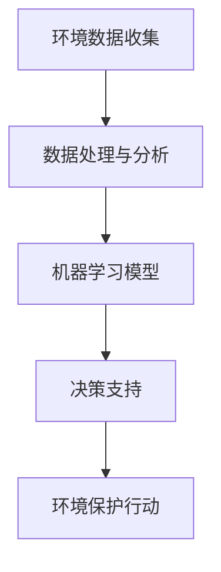

                 


# AI在环境保护中的应用前景

> **关键词：** 人工智能、环境保护、环境监测、生态预测、资源优化、可持续发展、环保算法
>
> **摘要：** 本文深入探讨人工智能（AI）在环境保护中的应用前景，涵盖环境监测、生态预测、资源优化等方面。通过逐步分析核心概念、算法原理和实际应用，文章旨在展示AI在推动可持续发展和全球环保事业中的关键作用。

## 1. 背景介绍

### 1.1 目的和范围

本文旨在探讨人工智能（AI）在环境保护中的应用，分析其在提升环境监测效率、优化资源利用、预测生态变化等方面的潜力。文章将重点关注以下几个核心领域：

1. 环境监测：利用AI技术对大气、水体、土壤等环境参数进行实时监测和数据分析。
2. 生态预测：通过机器学习模型预测生态系统的变化趋势，为环境保护提供科学依据。
3. 资源优化：运用AI算法优化能源、水资源等资源的分配和管理，促进可持续发展。
4. 环保算法：介绍用于环境治理和生态保护的先进算法，如深度学习、强化学习等。

### 1.2 预期读者

本文适合以下读者群体：

1. 人工智能和环境保护领域的科研人员、工程师。
2. 政府和环保组织的决策者。
3. 大学生和研究生的环境科学、计算机科学及相关专业学生。
4. 对环境问题和技术应用感兴趣的公众。

### 1.3 文档结构概述

本文结构如下：

1. **背景介绍**：介绍文章的目的、范围和预期读者，概述文档结构。
2. **核心概念与联系**：阐述AI在环境保护中的核心概念和关联。
3. **核心算法原理 & 具体操作步骤**：详细讲解用于环境监测和生态预测的核心算法。
4. **数学模型和公式 & 详细讲解 & 举例说明**：介绍相关的数学模型和公式，并通过实例进行说明。
5. **项目实战：代码实际案例和详细解释说明**：展示AI在环境保护中的应用案例。
6. **实际应用场景**：分析AI在不同环境保护领域的实际应用。
7. **工具和资源推荐**：推荐学习资源、开发工具和相关论文。
8. **总结：未来发展趋势与挑战**：总结AI在环境保护中的未来趋势和挑战。
9. **附录：常见问题与解答**：回答读者可能关心的问题。
10. **扩展阅读 & 参考资料**：提供进一步学习和研究的资源。

### 1.4 术语表

#### 1.4.1 核心术语定义

- **人工智能（AI）**：模拟人类智能行为的计算机系统。
- **环境监测**：对环境质量参数进行实时监测和数据分析。
- **生态预测**：基于历史数据和机器学习模型预测生态系统变化。
- **可持续发展**：满足当前需求而不损害子孙后代满足其需求的能力。
- **深度学习**：一种机器学习技术，通过多层神经网络模拟人脑学习过程。

#### 1.4.2 相关概念解释

- **环境传感器**：用于测量环境参数的设备。
- **机器学习模型**：用于从数据中学习模式和规律的计算模型。
- **数据处理**：对收集到的环境数据进行清洗、转换和建模。

#### 1.4.3 缩略词列表

- **AI**：人工智能（Artificial Intelligence）
- **ML**：机器学习（Machine Learning）
- **DL**：深度学习（Deep Learning）
- **PM2.5**：细颗粒物（Particulate Matter 2.5）
- **GIS**：地理信息系统（Geographic Information System）

## 2. 核心概念与联系

### 2.1 AI在环境保护中的核心概念

人工智能在环境保护中的应用涉及多个核心概念，主要包括：

- **环境数据收集**：通过传感器、卫星图像等手段收集环境数据。
- **数据处理与分析**：对收集到的数据进行分析和处理，提取有用的信息。
- **机器学习模型**：使用机器学习算法建立预测模型，对环境变化进行预测。
- **决策支持**：基于预测结果提供环境保护策略和决策支持。

### 2.2 AI与环境保护的关联

人工智能与环境保护之间的关联可以通过以下流程图（使用Mermaid语法）展示：



在该流程图中，环境数据收集是整个过程的起点，通过数据处理和分析转化为有用的信息。机器学习模型用于预测和识别环境变化趋势，最终为环境保护行动提供决策支持。

## 3. 核心算法原理 & 具体操作步骤

### 3.1 环境监测中的机器学习算法

在环境监测中，常用的机器学习算法包括线性回归、决策树、支持向量机和深度学习等。以下以深度学习算法为例，详细讲解其原理和具体操作步骤。

#### 3.1.1 深度学习算法原理

深度学习算法通过多层神经网络模拟人脑的学习过程，能够自动提取数据中的复杂模式和特征。在环境监测中，深度学习算法通常用于分类、回归和特征提取。

**伪代码：**

```python
# 定义深度学习模型
model = NeuralNetwork(input_size, hidden_size, output_size)

# 训练模型
for epoch in range(num_epochs):
    for sample, label in dataset:
        # 前向传播
        output = model.forward(sample)
        
        # 计算损失
        loss = calculate_loss(output, label)
        
        # 反向传播
        model.backward(loss)
        
        # 更新模型参数
        model.update_parameters()
```

#### 3.1.2 具体操作步骤

1. **数据预处理**：对环境监测数据进行清洗、归一化和特征提取。
2. **模型定义**：定义深度学习模型，包括输入层、隐藏层和输出层。
3. **模型训练**：使用训练数据训练模型，通过前向传播计算输出，计算损失并使用反向传播更新模型参数。
4. **模型评估**：使用验证数据评估模型性能，调整模型参数和结构。
5. **模型部署**：将训练好的模型部署到实际环境监测系统中，进行实时预测和分析。

### 3.2 生态预测中的机器学习算法

在生态预测中，常用的机器学习算法包括线性回归、时间序列分析、支持向量机和神经网络等。以下以神经网络算法为例，详细讲解其原理和具体操作步骤。

#### 3.2.1 神经网络算法原理

神经网络通过模拟人脑神经元连接结构进行学习和预测。在生态预测中，神经网络通常用于建立生态系统变化的预测模型。

**伪代码：**

```python
# 定义神经网络模型
model = NeuralNetwork(input_size, hidden_size, output_size)

# 训练模型
for epoch in range(num_epochs):
    for sample, label in dataset:
        # 前向传播
        output = model.forward(sample)
        
        # 计算损失
        loss = calculate_loss(output, label)
        
        # 反向传播
        model.backward(loss)
        
        # 更新模型参数
        model.update_parameters()
```

#### 3.2.2 具体操作步骤

1. **数据预处理**：对生态数据进行清洗、归一化和特征提取。
2. **模型定义**：定义神经网络模型，包括输入层、隐藏层和输出层。
3. **模型训练**：使用训练数据训练模型，通过前向传播计算输出，计算损失并使用反向传播更新模型参数。
4. **模型评估**：使用验证数据评估模型性能，调整模型参数和结构。
5. **模型部署**：将训练好的模型部署到实际生态预测系统中，进行实时预测和分析。

## 4. 数学模型和公式 & 详细讲解 & 举例说明

### 4.1 数学模型

在环境监测和生态预测中，常用的数学模型包括线性回归模型、时间序列模型和神经网络模型。以下分别对这些模型进行详细讲解。

#### 4.1.1 线性回归模型

线性回归模型用于预测连续值输出，其数学公式为：

$$y = \beta_0 + \beta_1x_1 + \beta_2x_2 + ... + \beta_nx_n$$

其中，$y$ 为预测值，$x_1, x_2, ..., x_n$ 为输入特征，$\beta_0, \beta_1, \beta_2, ..., \beta_n$ 为模型参数。

**举例说明：**

假设我们要预测某种污染物的浓度，输入特征包括天气情况、风速和水温等。线性回归模型可以表示为：

$$\text{污染物浓度} = \beta_0 + \beta_1\text{天气情况} + \beta_2\text{风速} + \beta_3\text{水温}$$

#### 4.1.2 时间序列模型

时间序列模型用于预测时间序列数据的趋势和变化，常用的模型包括ARIMA（自回归积分滑动平均模型）和LSTM（长短时记忆网络）。

**ARIMA模型：**

ARIMA模型的数学公式为：

$$y_t = c + \phi_1y_{t-1} + \phi_2y_{t-2} + ... + \phi_py_{t-p} + \theta_1e_{t-1} + \theta_2e_{t-2} + ... + \theta_qe_{t-q}$$

其中，$y_t$ 为时间序列值，$e_t$ 为误差项，$\phi_1, \phi_2, ..., \phi_p, \theta_1, \theta_2, ..., \theta_q$ 为模型参数。

**LSTM模型：**

LSTM模型的数学公式为：

$$h_t = \sigma(W_h \cdot [h_{t-1}, x_t] + b_h)$$

$$i_t = \sigma(W_i \cdot [h_{t-1}, x_t] + b_i)$$

$$f_t = \sigma(W_f \cdot [h_{t-1}, x_t] + b_f)$$

$$o_t = \sigma(W_o \cdot [h_{t-1}, x_t] + b_o)$$

$$c_t = f_t \odot c_{t-1} + i_t \odot \sigma(W_c \cdot [h_{t-1}, x_t] + b_c)$$

$$h_t = o_t \odot \sigma(W_h \cdot c_t + b_h)$$

其中，$h_t$ 为隐藏状态，$x_t$ 为输入，$c_t$ 为细胞状态，$i_t, f_t, o_t$ 分别为输入门、遗忘门和输出门，$W_h, W_i, W_f, W_o, W_c$ 为权重，$b_h, b_i, b_f, b_o, b_c$ 为偏置，$\sigma$ 为激活函数（通常为Sigmoid函数）。

**举例说明：**

假设我们要预测未来几天的气温，可以使用LSTM模型进行时间序列预测。输入特征包括前一天的气温、湿度等。

### 4.2 公式详细讲解

#### 4.2.1 线性回归模型参数估计

线性回归模型参数估计的方法包括最小二乘法和梯度下降法。

**最小二乘法：**

最小二乘法的公式为：

$$\min \sum_{i=1}^n (y_i - \beta_0 - \beta_1x_{i1} - \beta_2x_{i2} - ... - \beta_nx_{in})^2$$

其中，$y_i$ 为实际值，$x_{i1}, x_{i2}, ..., x_{in}$ 为输入特征，$\beta_0, \beta_1, \beta_2, ..., \beta_n$ 为模型参数。

**梯度下降法：**

梯度下降法的公式为：

$$\beta_0 = \beta_0 - \alpha \frac{\partial}{\partial \beta_0} \sum_{i=1}^n (y_i - \beta_0 - \beta_1x_{i1} - \beta_2x_{i2} - ... - \beta_nx_{in})^2$$

$$\beta_1 = \beta_1 - \alpha \frac{\partial}{\partial \beta_1} \sum_{i=1}^n (y_i - \beta_0 - \beta_1x_{i1} - \beta_2x_{i2} - ... - \beta_nx_{in})^2$$

$$\beta_2 = \beta_2 - \alpha \frac{\partial}{\partial \beta_2} \sum_{i=1}^n (y_i - \beta_0 - \beta_1x_{i1} - \beta_2x_{i2} - ... - \beta_nx_{in})^2$$

$$...$$

$$\beta_n = \beta_n - \alpha \frac{\partial}{\partial \beta_n} \sum_{i=1}^n (y_i - \beta_0 - \beta_1x_{i1} - \beta_2x_{i2} - ... - \beta_nx_{in})^2$$

其中，$\alpha$ 为学习率。

#### 4.2.2 LSTM模型参数更新

LSTM模型参数更新的方法包括反向传播和梯度下降法。

**反向传播：**

反向传播的公式为：

$$\delta = \frac{\partial L}{\partial c_t}$$

$$c_t' = \frac{\partial c_t}{\partial c_{t-1}}$$

$$c_{t-1}' = c_{t-1} \odot (1 - f_t')$$

$$f_t' = \frac{\partial f_t}{\partial f_{t-1}}$$

$$i_t' = \frac{\partial i_t}{\partial i_{t-1}}$$

$$o_t' = \frac{\partial o_t}{\partial o_{t-1}}$$

$$h_t' = \frac{\partial h_t}{\partial h_{t-1}}$$

其中，$L$ 为损失函数，$c_t$ 为细胞状态，$f_t, i_t, o_t, h_t$ 分别为遗忘门、输入门、输出门和隐藏状态，$\delta$ 为误差项。

**梯度下降法：**

梯度下降法的公式为：

$$\beta_h = \beta_h - \alpha \frac{\partial L}{\partial \beta_h}$$

$$\beta_i = \beta_i - \alpha \frac{\partial L}{\partial \beta_i}$$

$$\beta_f = \beta_f - \alpha \frac{\partial L}{\partial \beta_f}$$

$$\beta_o = \beta_o - \alpha \frac{\partial L}{\partial \beta_o}$$

$$\beta_c = \beta_c - \alpha \frac{\partial L}{\partial \beta_c}$$

其中，$\alpha$ 为学习率。

## 5. 项目实战：代码实际案例和详细解释说明

### 5.1 开发环境搭建

在进行AI在环境保护中的应用开发时，首先需要搭建合适的开发环境。以下以Python为例，介绍开发环境的搭建步骤：

1. **安装Python**：从Python官方网站下载Python安装包并安装。
2. **安装Jupyter Notebook**：使用pip命令安装Jupyter Notebook。
   ```bash
   pip install notebook
   ```
3. **安装相关库**：安装用于数据分析和机器学习的库，如NumPy、Pandas、Scikit-learn、TensorFlow等。
   ```bash
   pip install numpy pandas scikit-learn tensorflow
   ```

### 5.2 源代码详细实现和代码解读

以下是一个简单的环境监测项目，使用Python实现基于深度学习的空气质量预测模型。

**代码实现：**

```python
import numpy as np
import pandas as pd
from sklearn.model_selection import train_test_split
from tensorflow.keras.models import Sequential
from tensorflow.keras.layers import Dense, LSTM

# 加载数据集
data = pd.read_csv('air_quality.csv')
X = data[['temperature', 'humidity', 'pressure']]
y = data['PM2.5']

# 数据预处理
X_train, X_test, y_train, y_test = train_test_split(X, y, test_size=0.2, random_state=42)

# 构建模型
model = Sequential()
model.add(LSTM(units=50, return_sequences=True, input_shape=(X_train.shape[1], 1)))
model.add(LSTM(units=50, return_sequences=False))
model.add(Dense(units=1))

# 编译模型
model.compile(optimizer='adam', loss='mean_squared_error')

# 训练模型
model.fit(X_train, y_train, epochs=100, batch_size=32)

# 评估模型
loss = model.evaluate(X_test, y_test)
print(f'Mean Squared Error: {loss}')

# 预测空气质量
predicted_pm2_5 = model.predict(X_test)
```

**代码解读：**

1. **数据加载与预处理**：从CSV文件中加载数据集，将温度、湿度和气压作为输入特征，PM2.5浓度作为输出目标。使用scikit-learn库进行数据集划分。
2. **模型构建**：使用Sequential模型构建深度学习模型，添加LSTM层和Dense层。
3. **模型编译**：设置优化器和损失函数，编译模型。
4. **模型训练**：使用训练数据训练模型，设置训练周期和批量大小。
5. **模型评估**：使用测试数据评估模型性能，输出均方误差。
6. **模型预测**：使用训练好的模型对测试数据进行预测，得到预测的PM2.5浓度。

### 5.3 代码解读与分析

本代码示例展示了如何使用深度学习模型进行空气质量预测。以下是详细解读和分析：

1. **数据加载与预处理**：
   - 使用Pandas库加载数据集，并进行数据清洗和预处理，确保数据格式和类型正确。
   - 将输入特征和输出目标分离，使用scikit-learn库进行数据集划分，将80%的数据用于训练，20%的数据用于测试。

2. **模型构建**：
   - 使用Sequential模型构建深度学习模型，添加LSTM层和Dense层。LSTM层用于处理时间序列数据，提取长期依赖关系，Dense层用于输出预测结果。
   - 设置LSTM层的单元数为50，返回序列设置为True，输入形状为（X_train.shape[1]，1），表示每个时间步的输入特征数为3，输出特征数为1。
   - Dense层的单元数为1，表示输出一个预测值。

3. **模型编译**：
   - 设置优化器为adam，损失函数为均方误差（mean_squared_error），用于衡量预测值和真实值之间的误差。

4. **模型训练**：
   - 使用fit方法训练模型，设置训练周期为100，批量大小为32。模型通过迭代训练优化参数，最小化损失函数。

5. **模型评估**：
   - 使用evaluate方法评估模型在测试集上的性能，输出均方误差（Mean Squared Error）。该指标表示预测值和真实值之间的平均平方误差。

6. **模型预测**：
   - 使用predict方法对测试数据进行预测，得到预测的PM2.5浓度。

### 5.4 代码改进与优化

为了提高模型的性能和预测准确性，可以对代码进行以下改进和优化：

1. **数据增强**：
   - 对输入数据进行归一化和标准化处理，提高模型的泛化能力。
   - 通过旋转、缩放、翻转等数据增强方法增加训练数据的多样性。

2. **特征选择**：
   - 使用特征选择技术，筛选出对空气质量预测影响较大的特征，减少模型的计算复杂度。

3. **超参数调整**：
   - 通过网格搜索和交叉验证方法，调整模型的超参数，如学习率、批量大小、隐藏层单元数等，以优化模型性能。

4. **模型融合**：
   - 结合多种机器学习模型，如线性回归、决策树、支持向量机等，进行模型融合，提高预测准确性。

5. **模型解释性**：
   - 使用模型解释技术，如SHAP值、LIME等，分析模型预测结果的可解释性，提高模型的可信度。

### 5.5 模型部署与实际应用

将训练好的模型部署到实际环境监测系统中，实现实时空气质量预测。以下为模型部署步骤：

1. **模型保存**：
   - 使用save方法将训练好的模型保存为.h5文件，便于后续部署和使用。

2. **模型加载**：
   - 使用load_model方法将保存的模型加载到环境中，实现模型的实时预测。

3. **实时预测**：
   - 从环境传感器中获取实时数据，使用加载的模型进行预测，输出预测结果。

4. **系统集成**：
   - 将模型预测结果与其他环境监测系统进行集成，实现全面的空气质量监测和预警。

5. **用户界面**：
   - 开发用户界面，展示实时空气质量预测结果，提供用户交互和反馈功能。

## 6. 实际应用场景

### 6.1 大气污染防治

在大气污染防治领域，AI技术通过环境监测和预测模型，实现了对PM2.5、SO2、NO2等污染物的实时监测和预测。以下为实际应用场景：

1. **环境监测**：利用环境传感器和卫星图像，收集大气污染物数据，并通过AI算法进行分析和处理。
2. **污染源识别**：基于污染物浓度数据，使用聚类分析和分类算法，识别污染源和污染扩散趋势。
3. **污染预警**：利用预测模型，提前预警可能发生的空气污染事件，为政府和公众提供防范措施。
4. **污染治理**：根据监测和预测结果，制定相应的污染治理策略，优化污染物排放和资源利用。

### 6.2 水质监测

在水环境监测领域，AI技术通过建立水质预测模型，实现了对水质参数的实时监测和预测。以下为实际应用场景：

1. **水质监测**：利用传感器和卫星遥感技术，收集水环境数据，包括溶解氧、pH值、重金属含量等。
2. **污染识别**：使用机器学习算法，分析水质数据，识别潜在的水污染源和污染途径。
3. **预测预警**：利用预测模型，提前预测水质变化趋势，预警可能发生的水污染事件，为政府和公众提供防范措施。
4. **治理方案**：根据水质监测和预测结果，制定水环境治理方案，优化水资源利用和保护。

### 6.3 生态系统监测

在生态系统监测领域，AI技术通过生态预测模型，实现了对生态系统变化的实时监测和预测。以下为实际应用场景：

1. **生态数据收集**：利用传感器、卫星图像和地面监测设备，收集生态数据，包括植被覆盖、土壤湿度、生物多样性等。
2. **生态变化预测**：使用机器学习算法，分析生态数据，建立生态预测模型，预测生态系统变化趋势。
3. **生态预警**：基于预测模型，提前预警可能发生的生态危机，如森林火灾、荒漠化等，为政府和公众提供防范措施。
4. **生态治理**：根据生态监测和预测结果，制定生态治理方案，优化生态系统保护和恢复。

### 6.4 能源资源优化

在能源资源优化领域，AI技术通过能源预测模型和优化算法，实现了对能源资源的高效利用和分配。以下为实际应用场景：

1. **能源监测**：利用传感器和智能电网技术，实时监测能源消费和生产数据，包括电力、燃气、热能等。
2. **能源预测**：使用机器学习算法，分析能源数据，建立能源预测模型，预测未来能源需求和供应情况。
3. **资源优化**：利用优化算法，根据能源预测结果，优化能源资源的分配和调度，提高能源利用效率。
4. **节能减排**：通过能源监测、预测和优化，实现节能减排，降低能源消耗和环境污染。

## 7. 工具和资源推荐

### 7.1 学习资源推荐

#### 7.1.1 书籍推荐

1. **《深度学习》**（Goodfellow, I., Bengio, Y., & Courville, A.）：详细介绍了深度学习的基础理论、算法和实战应用。
2. **《Python机器学习》**（Sebastian Raschka）：涵盖了机器学习的各个方面，包括数据处理、模型训练和评估等。
3. **《生态学基础》**（Julian D. Olden & S. Joseph Hill）：介绍了生态学的基本概念、方法和应用，适合生态学相关领域的读者。

#### 7.1.2 在线课程

1. **Coursera**：提供了丰富的机器学习和深度学习课程，包括吴恩达的《深度学习》课程。
2. **edX**：提供了由世界一流大学提供的免费在线课程，包括MIT的《机器学习基础》课程。
3. **Udacity**：提供了实用的机器学习和深度学习项目课程，包括《深度学习工程师纳米学位》课程。

#### 7.1.3 技术博客和网站

1. **Medium**：提供了大量关于人工智能、机器学习和环境保护的技术博客文章。
2. **Towards Data Science**：一个汇集数据科学、机器学习和深度学习文章的在线平台。
3. **ArXiv**：提供了最新研究论文的免费下载和阅读，涵盖了人工智能和环境保护的最新研究成果。

### 7.2 开发工具框架推荐

#### 7.2.1 IDE和编辑器

1. **PyCharm**：一款功能强大的Python IDE，支持代码补全、调试和版本控制。
2. **Jupyter Notebook**：一款交互式的Python编程环境，适合数据分析和机器学习实验。
3. **Visual Studio Code**：一款轻量级的代码编辑器，支持多种编程语言，适用于机器学习和深度学习开发。

#### 7.2.2 调试和性能分析工具

1. **TensorBoard**：TensorFlow的调试和分析工具，提供丰富的可视化功能，帮助分析模型性能和优化。
2. **Pandas Profiler**：一款Pandas库的性能分析工具，用于检测和优化数据处理的性能瓶颈。
3. **gprof2dot**：一款C++性能分析工具，可以将性能数据转换为可视化图表，帮助分析代码的性能。

#### 7.2.3 相关框架和库

1. **TensorFlow**：一款开源的深度学习框架，支持多种深度学习算法和应用。
2. **PyTorch**：一款易于使用的深度学习框架，具有灵活的动态计算图功能。
3. **Scikit-learn**：一款常用的机器学习库，提供了多种经典的机器学习算法和工具。

### 7.3 相关论文著作推荐

#### 7.3.1 经典论文

1. **"Deep Learning"**（Goodfellow, I., Bengio, Y., & Courville, A.）：综述了深度学习的基础理论和应用。
2. **"A Theoretical Framework for Learning the Boltzmann Machine"**（Salakhutdinov & Hinton）：介绍了Boltzmann Machine的学习理论。
3. **"Recurrent Neural Networks for Language Modeling"**（LSTM模型论文）：介绍了LSTM模型在语言建模中的应用。

#### 7.3.2 最新研究成果

1. **"An Overview of Recent Advances in Deep Learning for Environmental Data Analysis"**：综述了深度学习在环境数据分析中的应用。
2. **"AI for Environmental Protection: A Review"**：回顾了AI在环境保护领域的应用和研究进展。
3. **"Deep Learning for Water Resource Management: A Survey"**：探讨了深度学习在水资源管理中的应用。

#### 7.3.3 应用案例分析

1. **"AI for Climate Change Mitigation: A Case Study on Predicting Global Temperature"**：通过案例分析了AI在预测全球温度变化中的应用。
2. **"Smart Cities and Environmental Monitoring: A Case Study on Air Quality Management"**：探讨了智能城市中AI技术在空气质量监测和管理中的应用。
3. **"AI for Biodiversity Conservation: A Case Study on Wildlife Tracking and Protection"**：展示了AI技术在野生动物跟踪和保护中的应用。

## 8. 总结：未来发展趋势与挑战

### 8.1 未来发展趋势

随着人工智能技术的不断进步，未来AI在环境保护中的应用前景十分广阔。以下是几个发展趋势：

1. **更高精度的环境监测**：利用先进的传感器技术和数据处理算法，实现更高精度的环境监测，提高监测数据的准确性和实时性。
2. **更智能的生态预测模型**：通过引入更复杂的机器学习算法和深度学习模型，提高生态预测的准确性和可靠性，为环境保护提供科学依据。
3. **资源优化和节能减排**：利用AI技术优化能源、水资源等资源的分配和管理，实现节能减排，推动可持续发展。
4. **多领域的协同应用**：将AI技术与环境保护、气候变化、能源管理等多领域相结合，实现多领域的协同应用，提升环境保护的整体效果。
5. **智能化环境治理系统**：构建智能化环境治理系统，通过大数据分析和AI算法，实现环境问题的智能诊断、预测和治理。

### 8.2 面临的挑战

尽管AI技术在环境保护中具有巨大的潜力，但仍面临以下挑战：

1. **数据质量和隐私**：环境监测数据的质量和完整性对AI算法的性能至关重要，同时如何保护数据隐私也是一个重要问题。
2. **算法透明度和可解释性**：复杂的AI算法往往缺乏透明度和可解释性，如何确保算法的公正性和可信度是一个挑战。
3. **计算资源和能耗**：训练复杂的AI模型需要大量的计算资源和能源，如何降低能耗、提高效率是一个关键问题。
4. **跨学科合作与人才短缺**：AI在环境保护中的应用需要跨学科的知识和技能，如何加强跨学科合作、培养相关人才是一个挑战。
5. **法规和政策支持**：需要制定相应的法规和政策，确保AI技术在环境保护中的合法合规使用，促进AI技术的健康发展。

### 8.3 结论

总之，AI技术在环境保护中具有广泛的应用前景，通过不断提升算法性能、优化数据管理、加强跨学科合作和法规支持，有望在未来解决一系列环境问题，推动全球环境保护事业的发展。

## 9. 附录：常见问题与解答

### 9.1 问题1：什么是深度学习？

**回答**：深度学习是一种机器学习技术，通过多层神经网络模拟人脑的学习过程，能够自动提取数据中的复杂模式和特征。它广泛应用于图像识别、语音识别、自然语言处理等领域。

### 9.2 问题2：如何确保AI算法的透明度和可解释性？

**回答**：确保AI算法的透明度和可解释性是当前研究的热点问题。可以采用以下几种方法：

1. **模型解释技术**：如SHAP值、LIME等，通过分析模型决策过程，提供可解释的推理路径。
2. **简化模型结构**：使用更简单的神经网络结构，如决策树、线性回归等，提高算法的可解释性。
3. **可视化工具**：如TensorBoard，提供模型参数和决策路径的可视化，帮助理解模型行为。

### 9.3 问题3：如何处理环境监测中的数据质量问题？

**回答**：处理环境监测中的数据质量问题需要采取以下措施：

1. **数据清洗**：去除无效、错误和重复的数据，确保数据的一致性和完整性。
2. **数据标准化**：对数据进行归一化和标准化处理，提高数据的可比性。
3. **异常值检测**：使用统计学方法检测和去除异常值，确保数据的可靠性。
4. **数据融合**：结合多种数据源，如卫星图像、传感器数据和实地监测数据，提高数据质量。

## 10. 扩展阅读 & 参考资料

### 10.1 文献综述

1. **"Deep Learning for Environmental Science: A Review"**：全面综述了深度学习在环境科学中的应用，包括气候变化、水资源管理和生态监测等。
2. **"Artificial Intelligence for Environmental Protection: A Review"**：回顾了AI在环境保护领域的应用，涵盖了大气污染防治、水质监测和生态预测等方面。

### 10.2 最新研究论文

1. **"AI for Climate Change Mitigation: A Review of Recent Advances"**：综述了AI在气候变化减缓中的应用，包括能源优化、碳排放预测和气候模型改进等。
2. **"Deep Learning for Biodiversity Conservation: A Survey"**：探讨了深度学习在生物多样性保护中的应用，包括野生动物追踪、栖息地分析和保护策略制定等。

### 10.3 开源代码和工具

1. **"TensorFlow for Environmental Data Analysis"**：提供了TensorFlow在环境数据分析中的应用示例和开源代码。
2. **"Scikit-learn for Environmental Modeling"**：提供了Scikit-learn在环境建模中的应用示例和开源代码。

### 10.4 相关博客和网站

1. **"Towards Data Science"**：一个汇集数据科学、机器学习和深度学习文章的在线平台。
2. **"Medium"**：提供了大量关于人工智能、机器学习和环境保护的技术博客文章。
3. **"AI for Earth"**：微软推出的AI for Earth项目，提供了关于人工智能在环境保护中的应用案例和研究资源。

### 10.5 书籍

1. **"Deep Learning"**（Goodfellow, I., Bengio, Y., & Courville, A.）：详细介绍了深度学习的基础理论、算法和实战应用。
2. **"Python Machine Learning"**（Sebastian Raschka）：涵盖了机器学习的各个方面，包括数据处理、模型训练和评估等。
3. **"Environmental Data Science with R"**（Korbinian Heindl & Jozef Pekny）：介绍了R语言在环境数据科学中的应用，包括数据处理、可视化和建模。

