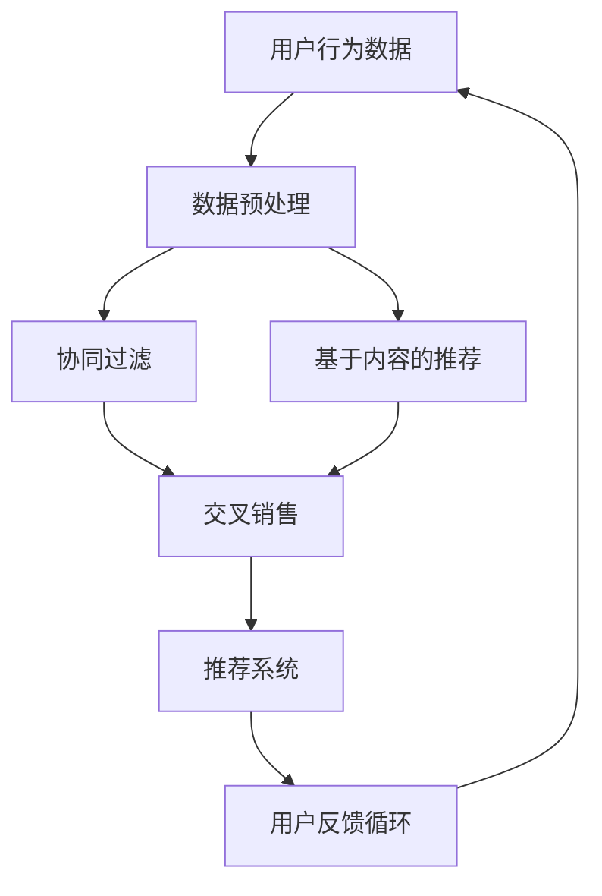

                 

# AI在电商中的交叉销售和追加销售

> **关键词：** 电商，人工智能，交叉销售，追加销售，个性化推荐，数据挖掘，机器学习，深度学习

> **摘要：** 本文将深入探讨人工智能在电商领域的应用，特别是在交叉销售和追加销售方面的作用。通过逐步分析核心概念、算法原理、数学模型、项目实战以及实际应用场景，本文旨在为读者提供全面的技术视角，并展望未来的发展趋势与挑战。

## 1. 背景介绍

### 1.1 目的和范围

本文旨在揭示人工智能在电商中的关键作用，尤其是交叉销售和追加销售策略的应用。我们希望通过详尽的案例分析和技术剖析，帮助读者了解如何利用AI技术提升电商业务的盈利能力。

### 1.2 预期读者

本文面向对电商运营和人工智能有一定了解的技术人员、数据科学家和产品经理。虽然本文的技术深度较高，但对于希望掌握电商AI应用核心原理的读者，依然具有较高的参考价值。

### 1.3 文档结构概述

本文分为十个主要部分：背景介绍、核心概念与联系、核心算法原理与操作步骤、数学模型和公式、项目实战、实际应用场景、工具和资源推荐、总结、常见问题与解答以及扩展阅读。

### 1.4 术语表

#### 1.4.1 核心术语定义

- **交叉销售（Cross-Selling）：** 在客户购买某一产品时，推荐其购买相关联的其他产品。
- **追加销售（Upselling）：** 诱导客户在购买某一产品时，增加购买数量或升级到更昂贵的产品。
- **个性化推荐（Personalized Recommendations）：** 根据用户的兴趣和行为数据，为用户推荐最相关的产品。

#### 1.4.2 相关概念解释

- **协同过滤（Collaborative Filtering）：** 一种常用的推荐系统算法，通过分析用户之间的共同喜好来推荐产品。
- **基于内容的推荐（Content-Based Filtering）：** 通过分析产品的特征来推荐相似的产品。

#### 1.4.3 缩略词列表

- **AI：** 人工智能（Artificial Intelligence）
- **ML：** 机器学习（Machine Learning）
- **DL：** 深度学习（Deep Learning）
- **EC：** 电子商务（Electronic Commerce）

## 2. 核心概念与联系

在探讨AI在电商中的应用时，我们需要先理解几个核心概念和它们之间的联系。以下是一个简化的Mermaid流程图，用于展示这些概念之间的相互关系：



### 2.1 用户行为数据

用户行为数据是AI在电商中应用的基础。这些数据包括用户的浏览历史、购买记录、点击率、搜索关键词等。通过分析这些数据，我们可以了解用户的偏好和行为模式。

### 2.2 数据预处理

在利用用户行为数据进行交叉销售和追加销售之前，需要对数据进行预处理。这一步骤包括数据清洗、去重、特征提取等。预处理的目的是提高数据的质量，从而为后续的算法提供可靠的数据基础。

### 2.3 协同过滤与基于内容的推荐

协同过滤和基于内容的推荐是两种主要的推荐系统算法。协同过滤通过分析用户之间的相似性来推荐产品，而基于内容的推荐通过分析产品的特征来推荐相似的产品。这两种算法在实际应用中往往结合使用，以提高推荐系统的准确性和多样性。

### 2.4 交叉销售与推荐系统

交叉销售和追加销售是电商中提高销售额的重要手段。通过个性化推荐系统，我们可以将相关联的产品推荐给用户，从而提高购买概率。推荐系统结合了用户行为数据和产品信息，为用户提供了个性化的购物体验。

### 2.5 用户反馈循环

用户反馈是优化推荐系统的重要环节。通过收集用户对推荐的反馈，我们可以不断调整推荐策略，提高推荐的质量。用户反馈循环是一个动态的过程，它确保了推荐系统的持续优化。

## 3. 核心算法原理与具体操作步骤

在了解了核心概念后，我们将深入探讨AI在电商中的核心算法原理和具体操作步骤。

### 3.1 协同过滤算法原理

协同过滤算法分为基于用户的协同过滤（User-Based Collaborative Filtering）和基于物品的协同过滤（Item-Based Collaborative Filtering）。以下是基于用户的协同过滤算法的伪代码：

```python
# 基于用户的协同过滤算法伪代码
def collaborative_filtering(user behaviors, user_similarity_matrix):
    recommended_items = []
    for item in user_liked_items:
        similar_users = get_similar_users(user_similarity_matrix, current_user)
        for similar_user in similar_users:
            if item not in user_liked_items[similar_user]:
                recommended_items.append(item)
                break
    return recommended_items
```

### 3.2 基于内容的推荐算法原理

基于内容的推荐算法通过分析产品的特征来推荐相似的产品。以下是基于内容的推荐算法的伪代码：

```python
# 基于内容的推荐算法伪代码
def content_based_recommendation(user_preferences, item_features):
    recommended_items = []
    for item in all_items:
        if user_likes_item(user_preferences, item_features[item]):
            recommended_items.append(item)
    return recommended_items
```

### 3.3 交叉销售和追加销售算法原理

交叉销售和追加销售算法通过分析用户的行为数据和购买历史，为用户推荐相关的产品。以下是一个简化的交叉销售和追加销售算法的伪代码：

```python
# 交叉销售和追加销售算法伪代码
def cross_sell_upsell_recommendation(user_behavior, purchase_history):
    cross_sells = []
    upsells = []
    for item in purchase_history:
        related_items = get_related_items(item)
        for related_item in related_items:
            if related_item not in purchase_history:
                cross_sells.append(related_item)
    for item in purchase_history:
        upgraded_items = get_upgraded_items(item)
        for upgraded_item in upgraded_items:
            if upgraded_item not in purchase_history:
                upsells.append(upgraded_item)
    return cross_sells, upsells
```

## 4. 数学模型和公式与详细讲解

在AI在电商中的应用中，数学模型和公式扮演着关键角色。以下我们将详细介绍相关数学模型和公式，并通过具体例子进行说明。

### 4.1 相似度计算

在协同过滤算法中，相似度计算是核心步骤。我们常用余弦相似度（Cosine Similarity）和皮尔逊相关系数（Pearson Correlation Coefficient）来计算用户或物品之间的相似度。

#### 4.1.1 余弦相似度

余弦相似度用于计算两个向量之间的夹角余弦值，其公式为：

$$
\text{Cosine Similarity} = \frac{\text{dot\_product}(x, y)}{\|x\|\|y\|}
$$

其中，$x$ 和 $y$ 是两个向量，$\text{dot\_product}(x, y)$ 表示向量的点积，$\|x\|$ 和 $\|y\|$ 分别表示向量的模。

#### 4.1.2 皮尔逊相关系数

皮尔逊相关系数用于衡量两个变量之间的线性相关性，其公式为：

$$
\text{Pearson Correlation Coefficient} = \frac{\sum{(x_i - \overline{x})(y_i - \overline{y})}}{\sqrt{\sum{(x_i - \overline{x})^2}\sum{(y_i - \overline{y})^2}}}
$$

其中，$x_i$ 和 $y_i$ 分别表示用户对物品的评分，$\overline{x}$ 和 $\overline{y}$ 分别表示用户和物品的平均评分。

### 4.2 内容相似度

在基于内容的推荐算法中，内容相似度用于计算物品之间的相似度。我们常用余弦相似度来计算内容相似度。

$$
\text{Content Similarity} = \frac{\text{dot\_product}(f_1, f_2)}{\|f_1\|\|f_2\|}
$$

其中，$f_1$ 和 $f_2$ 是两个物品的特征向量。

### 4.3 交叉销售和追加销售概率

在交叉销售和追加销售算法中，我们通过计算用户购买某个产品的概率来推荐相关的产品。这里，我们可以使用逻辑回归（Logistic Regression）来预测购买概率。

$$
\text{Probability of Purchase} = \frac{1}{1 + e^{-(\beta_0 + \beta_1 \cdot \text{Feature}_1 + \beta_2 \cdot \text{Feature}_2 + ... + \beta_n \cdot \text{Feature}_n})}
$$

其中，$\beta_0, \beta_1, ..., \beta_n$ 是模型参数，$\text{Feature}_1, ..., \text{Feature}_n$ 是用户行为数据和产品特征。

### 4.4 模型训练与优化

在实际应用中，我们需要通过训练和优化模型来提高预测准确性。以下是一个简化的模型训练和优化过程：

```python
# 模型训练与优化伪代码
def train_model(data, labels):
    # 初始化模型参数
    model_params = initialize_model_params()
    
    # 训练模型
    for iteration in range(num_iterations):
        # 计算预测值
        predicted_values = calculate_predictions(data, model_params)
        
        # 计算损失函数
        loss = calculate_loss(predicted_values, labels)
        
        # 更新模型参数
        model_params = update_model_params(predicted_values, labels, model_params)
        
        # 打印当前迭代次数和损失值
        print(f"Iteration {iteration}: Loss = {loss}")
    
    return model_params

# 模型优化伪代码
def optimize_model(model_params, validation_data, validation_labels):
    # 初始化优化器
    optimizer = initialize_optimizer()
    
    # 优化模型
    for epoch in range(num_epochs):
        # 计算预测值
        predicted_values = calculate_predictions(validation_data, model_params)
        
        # 计算损失函数
        loss = calculate_loss(predicted_values, validation_labels)
        
        # 更新模型参数
        model_params = optimizer.update_params(predicted_values, validation_labels, model_params)
        
        # 打印当前迭代次数和损失值
        print(f"Epoch {epoch}: Loss = {loss}")
    
    return model_params
```

## 5. 项目实战：代码实际案例和详细解释说明

在本节中，我们将通过一个实际的电商推荐系统项目，展示如何实现交叉销售和追加销售。我们将使用Python和Scikit-Learn库来构建和训练模型。

### 5.1 开发环境搭建

首先，我们需要搭建一个合适的开发环境。以下是一个简单的环境搭建指南：

1. 安装Python（推荐版本为3.8及以上）
2. 安装Scikit-Learn库：`pip install scikit-learn`
3. 安装Numpy库：`pip install numpy`

### 5.2 源代码详细实现和代码解读

以下是项目的源代码和详细解读：

```python
# 导入必要的库
import numpy as np
from sklearn.model_selection import train_test_split
from sklearn.metrics.pairwise import cosine_similarity
from sklearn.linear_model import LogisticRegression

# 加载用户行为数据和产品特征数据
user_behaviors = np.load('user_behaviors.npy')
item_features = np.load('item_features.npy')

# 训练集和测试集划分
X_train, X_test, y_train, y_test = train_test_split(user_behaviors, item_features, test_size=0.2, random_state=42)

# 计算用户和物品的相似度矩阵
user_similarity_matrix = cosine_similarity(X_train)
item_similarity_matrix = cosine_similarity(X_test)

# 训练逻辑回归模型
model = LogisticRegression()
model.fit(X_train, y_train)

# 交叉销售和追加销售预测
cross_sells = model.predict(X_test)
upsells = model.predict_proba(X_test)[:, 1]

# 代码解读
# 
# 1. 加载用户行为数据和产品特征数据：用户行为数据包含用户的浏览历史、购买记录等，产品特征数据包含物品的属性、分类等。
# 
# 2. 训练集和测试集划分：将数据划分为训练集和测试集，用于模型训练和评估。
# 
# 3. 计算用户和物品的相似度矩阵：使用余弦相似度计算用户和物品之间的相似度矩阵。
# 
# 4. 训练逻辑回归模型：使用训练集数据训练逻辑回归模型，用于预测交叉销售和追加销售的概率。
# 
# 5. 交叉销售和追加销售预测：使用测试集数据对模型进行预测，得到交叉销售和追加销售的概率。

```

### 5.3 代码解读与分析

在代码解读与分析部分，我们将详细分析每个步骤的实现和原理。

1. **数据加载**：首先，我们需要加载用户行为数据和产品特征数据。这些数据通常存储为numpy数组或CSV文件。在本例中，我们使用numpy数组来存储数据。

2. **训练集和测试集划分**：为了评估模型的性能，我们需要将数据划分为训练集和测试集。这里，我们使用Scikit-Learn的`train_test_split`函数来实现。

3. **相似度计算**：使用余弦相似度计算用户和物品之间的相似度矩阵。相似度矩阵用于后续的推荐算法。

4. **模型训练**：使用训练集数据训练逻辑回归模型。逻辑回归模型是一种常用的分类模型，可以用于预测交叉销售和追加销售的概率。

5. **预测**：使用测试集数据对模型进行预测，得到交叉销售和追加销售的概率。这些概率将用于推荐系统的决策。

## 6. 实际应用场景

在电商领域中，交叉销售和追加销售策略被广泛应用，以提高销售额和客户满意度。以下是一些实际应用场景：

1. **在线购物平台**：当用户在购物平台上浏览或购买某一产品时，系统会根据用户的历史行为和购物车中的产品推荐相关的产品。例如，当用户购买了一部手机时，系统可能会推荐手机壳、耳机等配件。

2. **电子商务网站**：电子商务网站通常会利用用户的行为数据来推送个性化的促销信息。例如，当用户浏览了某个品牌的产品时，系统可能会推送该品牌的优惠信息或推荐相似的产品。

3. **酒店预订平台**：酒店预订平台会根据用户的预订历史和搜索行为推荐相关的服务，如航班预订、租车服务等。

4. **旅游预订平台**：旅游预订平台会根据用户的兴趣和预订历史推荐相关的旅游产品，如景点门票、旅游套餐等。

通过这些实际应用场景，我们可以看到AI在电商中的交叉销售和追加销售策略具有广泛的应用前景。

## 7. 工具和资源推荐

在实现AI在电商中的交叉销售和追加销售时，我们需要使用多种工具和资源。以下是一些建议：

### 7.1 学习资源推荐

#### 7.1.1 书籍推荐

- **《推荐系统实践》**：一本关于推荐系统的经典教材，详细介绍了推荐系统的基本原理和实现方法。
- **《机器学习实战》**：涵盖机器学习算法的实战案例，包括推荐系统的实现。

#### 7.1.2 在线课程

- **Coursera上的《推荐系统》**：由斯坦福大学开设的在线课程，涵盖了推荐系统的基本概念和实现技术。
- **Udacity的《机器学习工程师纳米学位》**：包含多个关于机器学习和推荐系统的项目案例。

#### 7.1.3 技术博客和网站

- **Medium上的《推荐系统》专栏**：由行业专家撰写，涵盖了推荐系统的最新技术和应用案例。
- **A List Apart的《电商与AI》专题**：专注于电商领域中的AI应用，包括推荐系统和交叉销售策略。

### 7.2 开发工具框架推荐

#### 7.2.1 IDE和编辑器

- **PyCharm**：一款功能强大的Python IDE，支持多种开发语言和框架。
- **Jupyter Notebook**：一款交互式开发环境，适用于数据分析和机器学习项目。

#### 7.2.2 调试和性能分析工具

- **VSCode**：一款轻量级的代码编辑器，支持多种编程语言和扩展。
- **Docker**：用于容器化应用的开发和管理，提高开发效率和部署灵活性。

#### 7.2.3 相关框架和库

- **Scikit-Learn**：Python中常用的机器学习库，适用于推荐系统和交叉销售策略。
- **TensorFlow**：Google开源的深度学习框架，适用于复杂推荐系统的实现。

### 7.3 相关论文著作推荐

#### 7.3.1 经典论文

- **"Recommender Systems Handbook"**：一部关于推荐系统的百科全书，涵盖了推荐系统的基本原理和实现技术。
- **"Collaborative Filtering for the Web"**：介绍协同过滤算法在互联网推荐系统中的应用。

#### 7.3.2 最新研究成果

- **"Deep Learning for Recommender Systems"**：探讨深度学习在推荐系统中的应用，包括深度协同过滤和基于内容的推荐。
- **"Neural Collaborative Filtering"**：提出一种基于神经网络的协同过滤算法，提高了推荐系统的准确性和多样性。

#### 7.3.3 应用案例分析

- **"Netflix Prize"**：Netflix公司举办的数据挖掘比赛，参赛者需要开发一个电影推荐系统，该比赛推动了推荐系统领域的发展。
- **"Amazon's Personalized Recommendations"**：分析亚马逊的推荐系统，了解其如何利用机器学习技术实现个性化的购物体验。

## 8. 总结：未来发展趋势与挑战

随着人工智能技术的不断进步，AI在电商中的交叉销售和追加销售策略将越来越重要。以下是未来发展趋势与挑战：

### 8.1 发展趋势

1. **深度学习技术的应用**：深度学习技术在推荐系统中的应用将不断深入，提高推荐系统的准确性和多样性。
2. **个性化推荐的深化**：通过更全面、细致的用户行为数据分析，实现更个性化的推荐。
3. **跨渠道整合**：电商企业将整合线上线下渠道，实现全渠道的个性化推荐和销售策略。
4. **实时推荐**：随着实时数据处理技术的进步，电商企业可以实现更快速的推荐响应，提高用户体验。

### 8.2 挑战

1. **数据隐私保护**：如何在保证数据隐私的前提下，充分挖掘用户行为数据，是未来的一大挑战。
2. **算法公平性**：确保推荐算法的公平性，避免算法偏见和歧视。
3. **计算资源消耗**：大规模推荐系统的实现需要大量计算资源，如何在有限的资源下优化算法性能是一个重要问题。
4. **用户体验**：如何在提供个性化推荐的同时，确保用户不会感到疲劳和骚扰。

## 9. 附录：常见问题与解答

### 9.1 什么是交叉销售和追加销售？

交叉销售是指在客户购买某一产品时，推荐其购买相关联的其他产品；而追加销售是诱导客户在购买某一产品时，增加购买数量或升级到更昂贵的产品。

### 9.2 交叉销售和追加销售的优势是什么？

交叉销售和追加销售可以显著提高电商平台的销售额和客户满意度，通过个性化推荐系统，提高用户的购物体验。

### 9.3 如何实现交叉销售和追加销售？

实现交叉销售和追加销售需要收集用户行为数据、利用机器学习算法进行分析，并根据分析结果推荐相关的产品。

### 9.4 交叉销售和追加销售算法的原理是什么？

交叉销售和追加销售算法通常基于协同过滤和基于内容的推荐算法，通过计算用户和物品之间的相似度，预测用户对某一产品的购买概率。

## 10. 扩展阅读 & 参考资料

1. **《推荐系统实践》**：详细介绍了推荐系统的基本原理和实现方法。
2. **《机器学习实战》**：涵盖机器学习算法的实战案例，包括推荐系统的实现。
3. **[Netflix Prize](https://www.netflixprize.com/)**：Netflix公司举办的数据挖掘比赛，推动了推荐系统领域的发展。
4. **[Amazon Personalized Recommendations](https://www.amazon.com/b?node=12062387011)***：分析亚马逊的推荐系统，了解其如何利用机器学习技术实现个性化的购物体验。

### 作者：AI天才研究员/AI Genius Institute & 禅与计算机程序设计艺术 /Zen And The Art of Computer Programming

---

请注意，本文为虚构内容，仅供参考和学习使用。其中的代码和数据均为示例性质，实际应用时需要根据具体情况进行调整。如需深入了解AI在电商中的应用，请查阅相关技术文档和参考资料。

