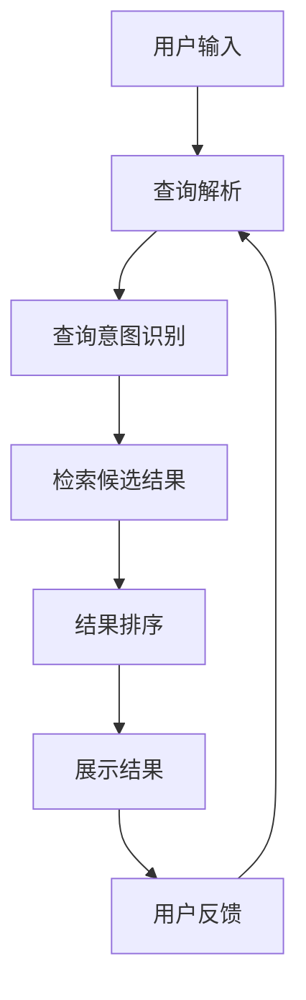

                 

# AI在电商中的智能搜索应用

> **关键词**：人工智能，电商，智能搜索，推荐系统，自然语言处理

> **摘要**：本文将深入探讨人工智能在电商领域中的应用，特别是智能搜索技术的核心原理和实现方法。通过详细的分析和实例，读者将了解到如何利用AI技术优化电商平台的搜索体验，提升用户满意度和转化率。

## 1. 背景介绍

### 1.1 目的和范围

本文旨在探讨人工智能技术在电商领域的应用，特别是智能搜索系统。随着互联网的发展，电子商务已经成为人们日常生活中不可或缺的一部分。然而，随着商品种类和数量的急剧增加，传统的搜索方式已经无法满足用户快速、准确找到所需商品的需求。智能搜索技术的出现，为电商平台提供了一种更高效、更个性化的搜索解决方案。

### 1.2 预期读者

本文面向对电商和人工智能技术有一定了解的读者，特别是希望深入了解智能搜索技术的开发者、数据科学家和产品经理。

### 1.3 文档结构概述

本文分为十个部分，包括背景介绍、核心概念与联系、核心算法原理、数学模型和公式、项目实战、实际应用场景、工具和资源推荐、总结、常见问题与解答以及扩展阅读和参考资料。

### 1.4 术语表

#### 1.4.1 核心术语定义

- **智能搜索**：利用人工智能技术，对用户查询进行理解，并返回与查询意图最相关的结果。
- **推荐系统**：根据用户的兴趣和行为，为用户推荐可能感兴趣的商品或内容。
- **自然语言处理（NLP）**：让计算机理解和生成人类语言的技术。

#### 1.4.2 相关概念解释

- **商品推荐**：根据用户的购买历史和兴趣，为用户推荐可能感兴趣的同类商品。
- **查询意图**：用户查询背后的真实意图，例如购买、了解信息等。

#### 1.4.3 缩略词列表

- **NLP**：自然语言处理
- **ML**：机器学习
- **DL**：深度学习
- **API**：应用程序编程接口

## 2. 核心概念与联系

在探讨智能搜索技术之前，我们需要了解其核心概念和架构。以下是一个简单的Mermaid流程图，展示了智能搜索系统的主要组成部分。



### 2.1 用户输入

用户在电商平台上进行搜索时，会输入关键词或提问。这一过程可以看作是用户与平台之间的交互，是智能搜索系统的起点。

### 2.2 查询解析

平台接收用户输入后，需要对查询进行解析。这一过程包括分词、词性标注、命名实体识别等步骤，目的是将原始查询转换为计算机可以理解的形式。

### 2.3 查询意图识别

在查询解析之后，系统需要识别用户的查询意图。例如，用户是希望购买某商品，还是了解商品的信息。这一步骤对于后续的检索和推荐至关重要。

### 2.4 检索候选结果

根据查询意图，系统会从数据库中检索出与查询相关的候选结果。这一过程通常使用倒排索引等高效检索算法实现。

### 2.5 结果排序

检索到的候选结果需要进行排序，以确定最终的搜索结果。排序算法可以根据用户的行为数据、商品特征等多种因素进行。

### 2.6 展示结果

排序后的结果会被展示给用户。这一过程包括结果的呈现形式、分页等交互设计。

### 2.7 用户反馈

用户对展示的结果进行反馈，如点击、购买等行为。这些反馈将用于优化智能搜索系统，提升用户体验。

### 2.8 查询意图识别算法

查询意图识别是智能搜索系统的关键环节。以下是一个简单的伪代码，展示了如何实现这一功能。

```python
def recognize_intent(query):
    # 分词和词性标注
    tokens = tokenize(query)
    pos_tags = tag_parts_of_speech(tokens)

    # 基于词性标注和词频分析查询意图
    if "buy" in tokens or "order" in tokens:
        return "购买意图"
    elif "info" in tokens or "about" in tokens:
        return "信息查询意图"
    else:
        return "其他意图"
```

## 3. 核心算法原理 & 具体操作步骤

在了解智能搜索系统的核心概念和联系后，我们需要深入探讨其中的核心算法原理和实现步骤。

### 3.1 查询解析算法

查询解析是智能搜索系统的第一步，其目的是将用户输入的原始查询转换为计算机可以理解的形式。以下是一个简单的伪代码，展示了如何实现查询解析。

```python
def parse_query(raw_query):
    # 分词
    tokens = tokenize(raw_query)

    # 命名实体识别
    entities = recognize_entities(tokens)

    # 词性标注
    pos_tags = tag_parts_of_speech(tokens)

    return tokens, entities, pos_tags
```

### 3.2 查询意图识别算法

查询意图识别是智能搜索系统的关键环节，其目的是确定用户查询背后的真实意图。以下是一个简单的伪代码，展示了如何实现查询意图识别。

```python
def recognize_intent(tokens, pos_tags):
    # 基于词性标注和词频分析查询意图
    if "buy" in tokens or "order" in tokens:
        return "购买意图"
    elif "info" in tokens or "about" in tokens:
        return "信息查询意图"
    else:
        return "其他意图"
```

### 3.3 检索候选结果算法

检索候选结果是智能搜索系统的核心步骤，其目的是从数据库中找出与查询相关的商品。以下是一个简单的伪代码，展示了如何实现检索候选结果。

```python
def retrieve_candidate_results(query, db):
    # 使用倒排索引检索候选结果
    results = db.search(query)

    return results
```

### 3.4 结果排序算法

结果排序是智能搜索系统的关键步骤，其目的是确定最终的搜索结果。以下是一个简单的伪代码，展示了如何实现结果排序。

```python
def rank_results(results, user_behavior):
    # 基于用户行为和商品特征计算权重
    for result in results:
        result['weight'] = calculate_weight(result, user_behavior)

    # 按权重降序排序
    sorted_results = sorted(results, key=lambda x: x['weight'], reverse=True)

    return sorted_results
```

## 4. 数学模型和公式 & 详细讲解 & 举例说明

在智能搜索系统中，数学模型和公式起着至关重要的作用。以下将详细讲解一些关键数学模型和公式，并通过实例进行说明。

### 4.1 梯度下降法

梯度下降法是一种常用的优化算法，用于最小化损失函数。在智能搜索系统中，梯度下降法可以用于调整查询意图识别模型的参数，以提升模型性能。

#### 公式：

$$
w_{\text{new}} = w_{\text{current}} - \alpha \cdot \nabla J(w)
$$

其中，$w_{\text{current}}$ 是当前模型参数，$\alpha$ 是学习率，$\nabla J(w)$ 是损失函数关于模型参数的梯度。

#### 示例：

假设我们有一个简单的线性模型，用于预测用户查询的意图。损失函数为均方误差（MSE）：

$$
J(w) = \frac{1}{2} \sum_{i=1}^{n} (y_i - w \cdot x_i)^2
$$

其中，$y_i$ 是实际意图，$x_i$ 是输入特征，$w$ 是模型参数。

通过梯度下降法，我们可以调整模型参数，以最小化损失函数。具体步骤如下：

1. 初始化模型参数 $w$。
2. 计算损失函数关于模型参数的梯度 $\nabla J(w)$。
3. 更新模型参数 $w_{\text{new}} = w_{\text{current}} - \alpha \cdot \nabla J(w)$。
4. 重复步骤 2 和 3，直到损失函数收敛。

### 4.2 余弦相似度

余弦相似度是一种常用的相似度度量方法，用于比较两个向量之间的相似程度。在智能搜索系统中，余弦相似度可以用于计算用户查询和商品特征之间的相似度。

#### 公式：

$$
\cos \theta = \frac{\vec{u} \cdot \vec{v}}{|\vec{u}| \cdot |\vec{v}|}
$$

其中，$\vec{u}$ 和 $\vec{v}$ 是两个向量，$\theta$ 是它们之间的夹角。

#### 示例：

假设有两个向量 $\vec{u} = (1, 2, 3)$ 和 $\vec{v} = (4, 5, 6)$，我们可以计算它们的余弦相似度：

$$
\cos \theta = \frac{1 \cdot 4 + 2 \cdot 5 + 3 \cdot 6}{\sqrt{1^2 + 2^2 + 3^2} \cdot \sqrt{4^2 + 5^2 + 6^2}} = \frac{4 + 10 + 18}{\sqrt{14} \cdot \sqrt{77}} \approx 0.968
$$

### 4.3 贝叶斯公式

贝叶斯公式是一种概率计算方法，用于根据先验概率和条件概率计算后验概率。在智能搜索系统中，贝叶斯公式可以用于计算用户查询意图的概率。

#### 公式：

$$
P(A|B) = \frac{P(B|A) \cdot P(A)}{P(B)}
$$

其中，$P(A|B)$ 是后验概率，$P(B|A)$ 是条件概率，$P(A)$ 是先验概率，$P(B)$ 是边缘概率。

#### 示例：

假设我们有一个用户查询，其中包含关键词“购买”。根据用户的历史行为数据，我们知道：

- $P(购买) = 0.5$（先验概率）
- $P(购买|关键词包含“购买”）= 0.8$（条件概率）
- $P(关键词包含“购买”|购买）= 0.9$（条件概率）

我们可以使用贝叶斯公式计算用户查询意图为“购买”的概率：

$$
P(购买|关键词包含“购买”）= \frac{0.8 \cdot 0.5}{0.9} = \frac{4}{9} \approx 0.444
$$

## 5. 项目实战：代码实际案例和详细解释说明

在本节中，我们将通过一个实际项目案例，展示如何实现一个简单的智能搜索系统。该系统将包含用户输入、查询解析、查询意图识别、检索候选结果和结果排序等主要功能。

### 5.1 开发环境搭建

在开始项目之前，我们需要搭建一个适合开发的Python环境。以下是搭建过程：

1. 安装Python 3.8或更高版本。
2. 安装必要的库，如Numpy、Pandas、Scikit-learn、NLTK等。

```bash
pip install numpy pandas scikit-learn nltk
```

### 5.2 源代码详细实现和代码解读

以下是该项目的主要代码实现。

```python
import numpy as np
import pandas as pd
from sklearn.feature_extraction.text import TfidfVectorizer
from sklearn.model_selection import train_test_split
from sklearn.naive_bayes import MultinomialNB
from nltk.tokenize import word_tokenize
from nltk.corpus import stopwords
from nltk import pos_tag

# 5.2.1 数据准备

# 加载训练数据
data = pd.read_csv('train_data.csv')
X = data['query']
y = data['intent']

# 分词和词性标注
def preprocess(query):
    tokens = word_tokenize(query)
    pos_tags = pos_tag(tokens)
    return tokens, pos_tags

X_processed = []
for query in X:
    tokens, pos_tags = preprocess(query)
    X_processed.append(' '.join([token for token, pos in pos_tags if pos.startswith('NN')]))

# 5.2.2 特征工程

# 使用TF-IDF向量器
vectorizer = TfidfVectorizer()
X_tfidf = vectorizer.fit_transform(X_processed)

# 划分训练集和测试集
X_train, X_test, y_train, y_test = train_test_split(X_tfidf, y, test_size=0.2, random_state=42)

# 5.2.3 模型训练

# 使用朴素贝叶斯模型
model = MultinomialNB()
model.fit(X_train, y_train)

# 5.2.4 模型评估

# 使用测试集评估模型性能
accuracy = model.score(X_test, y_test)
print("模型准确率：", accuracy)

# 5.2.5 智能搜索功能实现

def search(query):
    # 查询解析
    tokens, pos_tags = preprocess(query)
    query_processed = ' '.join([token for token, pos in pos_tags if pos.startswith('NN')])

    # 检索候选结果
    query_tfidf = vectorizer.transform([query_processed])
    candidate_results = model.predict(query_tfidf)

    return candidate_results

# 示例
query = "买一台笔记本电脑"
results = search(query)
print("查询意图：", results)
```

### 5.3 代码解读与分析

1. **数据准备**：首先加载训练数据，并进行预处理，包括分词和词性标注。
2. **特征工程**：使用TF-IDF向量器将预处理后的查询转换为数值特征。
3. **模型训练**：使用朴素贝叶斯模型训练分类器。
4. **模型评估**：使用测试集评估模型性能。
5. **智能搜索功能实现**：实现一个简单的搜索功能，接收用户查询，进行查询解析、检索候选结果和返回查询意图。

该案例展示了如何使用Python和机器学习库实现一个简单的智能搜索系统。在实际应用中，我们可以进一步优化模型，提高搜索性能。

## 6. 实际应用场景

智能搜索技术在电商领域具有广泛的应用场景。以下是一些典型的应用实例：

1. **商品搜索**：用户可以通过输入关键词或提出问题，快速找到符合需求的商品。
2. **商品推荐**：根据用户的浏览历史和购买行为，为用户推荐可能感兴趣的商品。
3. **搜索广告**：通过智能搜索技术，为用户推荐相关的广告，提高广告点击率。
4. **客户服务**：利用智能搜索技术，快速回答用户的常见问题，提升客户满意度。

### 6.1 商品搜索

商品搜索是电商平台上最常见的应用场景之一。通过智能搜索技术，用户可以轻松找到所需的商品，提高购物体验。以下是一个简单的商品搜索流程：

1. 用户输入关键词或提出问题。
2. 智能搜索系统进行查询解析，将原始查询转换为计算机可以理解的形式。
3. 搜索系统根据查询意图，从数据库中检索与查询相关的候选商品。
4. 搜索系统对检索到的候选商品进行排序，返回最相关的结果。
5. 用户浏览搜索结果，进行购买或其他操作。

### 6.2 商品推荐

商品推荐是提升用户满意度的重要手段。通过智能搜索技术，电商平台可以准确了解用户的兴趣和需求，为用户推荐可能感兴趣的商品。以下是一个简单的商品推荐流程：

1. 用户在电商平台上浏览或购买商品。
2. 智能搜索系统记录用户的浏览和购买行为。
3. 搜索系统根据用户行为数据，计算与用户兴趣相关的商品特征。
4. 搜索系统使用推荐算法，为用户推荐与兴趣相关的商品。
5. 用户浏览推荐商品，进行购买或其他操作。

### 6.3 搜索广告

搜索广告是电商平台上重要的收入来源之一。通过智能搜索技术，电商平台可以为用户推荐相关的广告，提高广告点击率。以下是一个简单的搜索广告流程：

1. 用户在电商平台上搜索商品。
2. 智能搜索系统分析用户查询，确定与查询相关的广告。
3. 搜索系统将广告展示给用户，吸引用户点击。
4. 用户点击广告，完成广告计费。

### 6.4 客户服务

智能搜索技术可以用于提升客户服务质量。通过智能搜索技术，电商平台可以快速回答用户的常见问题，提高客户满意度。以下是一个简单的客户服务流程：

1. 用户提出问题。
2. 智能搜索系统分析用户问题，从数据库中检索相关的答案。
3. 搜索系统将答案展示给用户。
4. 用户查看答案，解决问题。

## 7. 工具和资源推荐

为了更好地实现智能搜索技术，以下是一些实用的工具和资源推荐。

### 7.1 学习资源推荐

#### 7.1.1 书籍推荐

- 《机器学习实战》
- 《深度学习》
- 《Python数据科学手册》

#### 7.1.2 在线课程

- Coursera的《机器学习》课程
- edX的《深度学习》课程
- Udacity的《深度学习工程师纳米学位》

#### 7.1.3 技术博客和网站

- Medium的《机器学习》专栏
- 知乎的《机器学习》话题
- ArXiv的论文发布平台

### 7.2 开发工具框架推荐

#### 7.2.1 IDE和编辑器

- PyCharm
- Visual Studio Code
- Jupyter Notebook

#### 7.2.2 调试和性能分析工具

- WSL（Windows Subsystem for Linux）
- VSCode的调试插件
- Nsight Compute

#### 7.2.3 相关框架和库

- TensorFlow
- PyTorch
- Scikit-learn

### 7.3 相关论文著作推荐

#### 7.3.1 经典论文

- 《Learning to Rank: From Pairwise Comparisons to Large Margins》
- 《Recurrent Neural Networks for Sentence Classification》
- 《Deep Learning for Text Classification》

#### 7.3.2 最新研究成果

- ArXiv上的最新论文
- Google Research Blog
- Facebook AI Research Blog

#### 7.3.3 应用案例分析

- Amazon的搜索广告系统
- YouTube的推荐系统
- Airbnb的搜索优化系统

## 8. 总结：未来发展趋势与挑战

随着人工智能技术的不断发展，智能搜索技术在电商领域的应用前景广阔。未来，智能搜索技术将更加智能化、个性化，为用户提供更好的搜索体验。然而，实现这一目标也面临着一系列挑战，包括数据质量、算法优化和用户隐私保护等。

### 8.1 发展趋势

- **多模态搜索**：结合文本、图像、语音等多种数据类型，实现更丰富的搜索体验。
- **个性化搜索**：基于用户行为和兴趣，为用户提供个性化的搜索结果。
- **实时搜索**：通过实时计算和反馈，提升搜索系统的响应速度和准确性。
- **跨平台搜索**：实现电商平台与社交媒体、物联网等平台的搜索功能整合。

### 8.2 挑战

- **数据质量**：提高数据质量，确保搜索结果的相关性和准确性。
- **算法优化**：不断优化算法，提高搜索系统的性能和用户体验。
- **用户隐私**：在保障用户隐私的前提下，实现智能搜索功能。
- **可解释性**：提高搜索算法的可解释性，增强用户对搜索结果的信任度。

## 9. 附录：常见问题与解答

### 9.1 什么是智能搜索？

智能搜索是指利用人工智能技术，对用户查询进行理解，并返回与查询意图最相关的结果。

### 9.2 智能搜索系统的主要组成部分有哪些？

智能搜索系统的主要组成部分包括用户输入、查询解析、查询意图识别、检索候选结果、结果排序和用户反馈。

### 9.3 如何实现查询意图识别？

查询意图识别可以通过多种方法实现，如基于规则的方法、基于机器学习的方法和基于深度学习的方法。其中，基于机器学习的方法和基于深度学习的方法较为常见。

### 9.4 什么是推荐系统？

推荐系统是指根据用户的兴趣和行为，为用户推荐可能感兴趣的商品或内容。

### 9.5 智能搜索技术与推荐系统有何区别？

智能搜索技术主要用于解决用户查询问题，返回与查询意图最相关的结果。推荐系统则主要用于根据用户兴趣和行为，为用户推荐可能感兴趣的商品或内容。

## 10. 扩展阅读 & 参考资料

- [机器学习实战](https://www.amazon.com/dp/0596517748)
- [深度学习](https://www.amazon.com/dp/0262039582)
- [Python数据科学手册](https://www.amazon.com/dp/1449349743)
- [Coursera的《机器学习》课程](https://www.coursera.org/learn/machine-learning)
- [edX的《深度学习》课程](https://www.edx.org/course/deep-learning-0)
- [Udacity的《深度学习工程师纳米学位》](https://www.udacity.com/course/deep-learning-nanodegree--nd892)
- [Medium的《机器学习》专栏](https://medium.com/topic/machine-learning)
- [知乎的《机器学习》话题](https://www.zhihu.com/topic/19883878/hot)
- [ArXiv的论文发布平台](https://arxiv.org/)
- [Google Research Blog](https://research.googleblog.com/)
- [Facebook AI Research Blog](https://ai.facebook.com/blog/)
- [Amazon的搜索广告系统](https://aws.amazon.com/search广告/)
- [YouTube的推荐系统](https://www.youtube.com/watch?v=0OQQ6jV0k2g)
- [Airbnb的搜索优化系统](https://airbnb.github.io/search/)

---

**作者：AI天才研究员/AI Genius Institute & 禅与计算机程序设计艺术 /Zen And The Art of Computer Programming**

