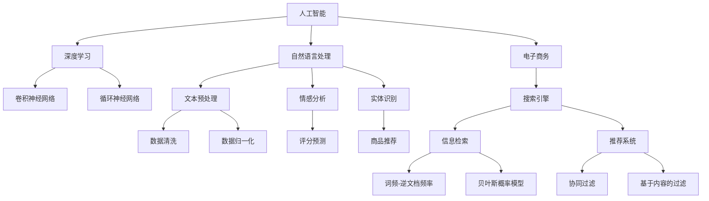

                 

### 1. 背景介绍

#### 1.1 目的和范围

本文旨在深入探讨人工智能（AI）在电子商务领域中的智能搜索应用。随着互联网的飞速发展和电子商务的蓬勃发展，用户对个性化、精准化搜索的需求日益增长。传统的搜索技术已经无法满足这一需求，而AI技术的引入，尤其是深度学习和自然语言处理技术的应用，为电商搜索带来了革命性的变化。本文将系统地介绍AI在电商搜索中的应用原理、核心算法、数学模型以及实际应用案例，旨在为读者提供全面、深入的理解和指导。

#### 1.2 预期读者

本文适合对AI和电子商务领域感兴趣的读者，包括但不限于以下几类：

1. AI研究人员和工程师：希望通过本文了解AI在电商搜索中的应用原理和实践方法。
2. 电子商务从业者：需要掌握AI技术在电商搜索中的应用，提升用户体验和销售额。
3. 大学生和研究生：对AI和电子商务交叉领域的研究感兴趣，希望深入了解相关技术。
4. 技术爱好者和编程爱好者：希望了解AI技术在实际应用中的具体实现。

#### 1.3 文档结构概述

本文分为十个主要部分：

1. 背景介绍：介绍本文的目的、范围、预期读者以及文档结构。
2. 核心概念与联系：介绍AI在电商搜索中的核心概念和联系，并提供流程图。
3. 核心算法原理 & 具体操作步骤：详细讲解AI在电商搜索中的应用算法原理和具体操作步骤。
4. 数学模型和公式 & 详细讲解 & 举例说明：介绍AI在电商搜索中的数学模型和公式，并举例说明。
5. 项目实战：代码实际案例和详细解释说明：通过实际项目案例，展示AI在电商搜索中的具体实现。
6. 实际应用场景：分析AI在电商搜索中的实际应用场景。
7. 工具和资源推荐：推荐相关学习资源、开发工具和框架。
8. 总结：未来发展趋势与挑战：总结本文内容，展望AI在电商搜索领域的未来发展趋势和挑战。
9. 附录：常见问题与解答：提供一些常见问题的解答。
10. 扩展阅读 & 参考资料：推荐一些扩展阅读资料。

#### 1.4 术语表

##### 1.4.1 核心术语定义

- 人工智能（AI）：模拟人类智能行为的计算机系统。
- 电子商务（E-commerce）：利用互联网进行商业交易的活动。
- 深度学习（Deep Learning）：一种人工智能方法，通过多层神经网络模拟人类大脑的思考过程。
- 自然语言处理（NLP）：研究如何让计算机理解和处理人类自然语言的技术。
- 个性化搜索：根据用户行为和偏好，提供个性化的搜索结果。
- 搜索引擎：帮助用户在大量信息中快速找到所需信息的工具。

##### 1.4.2 相关概念解释

- 数据挖掘（Data Mining）：从大量数据中提取有价值信息的过程。
- 聚类分析（Clustering Analysis）：将数据分为若干个类别，使类别内的数据相似度较高，类别间的数据相似度较低。
- 机器学习（Machine Learning）：使计算机能够从数据中学习并做出预测或决策的技术。

##### 1.4.3 缩略词列表

- AI：人工智能
- E-commerce：电子商务
- NLP：自然语言处理
- DL：深度学习
- SVM：支持向量机
- NB：朴素贝叶斯
- GPU：图形处理器

### 2. 核心概念与联系

在探讨AI在电商搜索中的应用之前，有必要先了解一些核心概念和它们之间的联系。以下是一个简单的Mermaid流程图，用于描述这些概念及其相互关系。



#### 2.1 人工智能与深度学习

人工智能是模拟人类智能行为的计算机系统，其核心是让计算机具备学习、推理、感知和决策能力。深度学习作为人工智能的一个重要分支，通过多层神经网络模拟人类大脑的思考过程，从而实现更复杂的任务。深度学习主要包括卷积神经网络（CNN）和循环神经网络（RNN）等模型。

- **卷积神经网络（CNN）**：适用于处理图像和视频等具有网格结构的数据，通过卷积操作提取图像特征，实现图像分类、目标检测等任务。
- **循环神经网络（RNN）**：适用于处理序列数据，如时间序列、语音、文本等，通过循环结构保留历史信息，实现语音识别、机器翻译等任务。

#### 2.2 人工智能与自然语言处理

自然语言处理是研究如何让计算机理解和处理人类自然语言的技术，包括文本预处理、情感分析、实体识别等。

- **文本预处理**：对原始文本进行处理，如数据清洗、分词、词性标注等，为后续分析做准备。
- **情感分析**：通过分析文本中的情感倾向，实现对用户评论、新闻等内容的情感分类。
- **实体识别**：识别文本中的实体，如人名、地名、组织名等，为后续的信息抽取和推荐提供基础。

#### 2.3 电子商务与搜索引擎

电子商务是指利用互联网进行商业交易的活动，搜索引擎是电子商务的重要组成部分，用于帮助用户在大量信息中快速找到所需商品或信息。

- **信息检索（IR）**：用于处理大量文本数据，实现高效的信息查询和检索。
- **推荐系统（RS）**：根据用户的历史行为和偏好，为用户推荐相关的商品或信息。

#### 2.4 深度学习、自然语言处理与电子商务的融合

深度学习和自然语言处理技术在电子商务领域具有广泛的应用，通过以下方式实现：

- **个性化搜索**：利用深度学习和自然语言处理技术，根据用户的历史行为和偏好，提供个性化的搜索结果。
- **商品推荐**：通过实体识别和情感分析等技术，识别用户感兴趣的商品，提高推荐系统的准确性。
- **用户评论分析**：利用情感分析技术，分析用户评论中的情感倾向，为商品评价和推荐提供依据。

### 3. 核心算法原理 & 具体操作步骤

在了解了AI在电商搜索中的核心概念和联系后，接下来将详细讲解AI在电商搜索中的应用算法原理和具体操作步骤。本文将重点介绍以下算法：

- **卷积神经网络（CNN）**：用于图像和视频数据的特征提取和分类。
- **循环神经网络（RNN）**：用于序列数据的处理和预测。
- **词嵌入（Word Embedding）**：用于文本数据的特征表示。
- **支持向量机（SVM）**：用于分类和预测。
- **朴素贝叶斯（NB）**：用于文本分类。

#### 3.1 卷积神经网络（CNN）

卷积神经网络是一种适用于处理具有网格结构数据的深度学习模型，如图像和视频。CNN通过卷积操作、池化和全连接层，实现对图像特征的提取和分类。

##### 3.1.1 CNN原理

1. **卷积操作**：卷积层通过卷积核与输入图像进行卷积操作，提取图像特征。
    ```python
    # 伪代码
    for filter in filters:
        for i in range(size_of_input):
            for j in range(size_of_input):
                feature_map[i][j] = filter * input[i][j]
    ```

2. **激活函数**：将卷积后的特征图进行非线性变换，如ReLU（Rectified Linear Unit）。
    ```python
    # 伪代码
    for i in range(size_of_feature_map):
        for j in range(size_of_feature_map):
            if feature_map[i][j] < 0:
                feature_map[i][j] = 0
    ```

3. **池化操作**：将特征图进行降采样，减少参数数量和计算量。
    ```python
    # 伪代码
    for i in range(size_of_pooling):
        for j in range(size_of_pooling):
            max_value = 0
            for k in range(size_of_feature_map):
                for l in range(size_of_feature_map):
                    if feature_map[k][l] > max_value:
                        max_value = feature_map[k][l]
            feature_map[i][j] = max_value
    ```

4. **全连接层**：将池化后的特征图输入到全连接层，进行分类。
    ```python
    # 伪代码
    for i in range(size_of_output):
        for j in range(size_of_output):
            for k in range(size_of_hidden_layer):
                output[i][j] += weights[i][k] * hidden_layer[k]
    output = activation_function(output)
    ```

##### 3.1.2 CNN操作步骤

1. **数据预处理**：读取图像数据，进行归一化、数据增强等操作。
    ```python
    # 伪代码
    images = read_images()
    images = normalize(images)
    images = augment(images)
    ```

2. **构建CNN模型**：定义卷积层、池化层和全连接层，构建CNN模型。
    ```python
    # 伪代码
    model = Sequential()
    model.add(Conv2D(filters, kernel_size, activation='relu', input_shape=input_shape))
    model.add(MaxPooling2D(pool_size))
    model.add(Flatten())
    model.add(Dense(num_classes, activation='softmax'))
    ```

3. **训练模型**：使用训练数据集训练CNN模型。
    ```python
    # 伪代码
    model.compile(optimizer='adam', loss='categorical_crossentropy', metrics=['accuracy'])
    model.fit(x_train, y_train, epochs=epochs, batch_size=batch_size)
    ```

4. **评估模型**：使用验证数据集评估模型性能。
    ```python
    # 伪代码
    loss, accuracy = model.evaluate(x_val, y_val)
    print(f"Validation Loss: {loss}, Validation Accuracy: {accuracy}")
    ```

5. **应用模型**：使用训练好的模型对未知数据进行预测。
    ```python
    # 伪代码
    predictions = model.predict(x_test)
    predicted_labels = np.argmax(predictions, axis=1)
    ```

#### 3.2 循环神经网络（RNN）

循环神经网络是一种适用于处理序列数据的深度学习模型，如时间序列、语音、文本等。RNN通过循环结构保留历史信息，实现对序列数据的建模。

##### 3.2.1 RNN原理

1. **输入和隐藏状态**：每个时间步的输入和上一个时间步的隐藏状态作为当前时间步的输入。
    ```python
    # 伪代码
    for t in range(sequence_length):
        hidden_state = activation_function(W_h * [x[t], h[t-1]])
    ```

2. **输出和损失函数**：输出每个时间步的预测结果，并计算损失。
    ```python
    # 伪代码
    y_pred = activation_function(W_y * hidden_state)
    loss += loss_function(y[t], y_pred)
    ```

3. **反向传播**：计算梯度并更新模型参数。
    ```python
    # 伪代码
    dW_h = dW_h + dhidden_state.T * [x[t], h[t-1]]
    dW_y = dW_y + dy_pred.T * hidden_state
    ```

##### 3.2.2 RNN操作步骤

1. **数据预处理**：读取序列数据，进行归一化、填充等操作。
    ```python
    # 伪代码
    sequences = read_sequences()
    sequences = normalize(sequences)
    sequences = pad_sequences(sequences, maxlen=max_sequence_length)
    ```

2. **构建RNN模型**：定义RNN层、嵌入层和输出层，构建RNN模型。
    ```python
    # 伪代码
    model = Sequential()
    model.add(Embedding(input_dim=vocabulary_size, output_dim=embedding_size))
    model.add(LSTM(units, return_sequences=False))
    model.add(Dense(num_classes, activation='softmax'))
    ```

3. **训练模型**：使用训练数据集训练RNN模型。
    ```python
    # 伪代码
    model.compile(optimizer='adam', loss='categorical_crossentropy', metrics=['accuracy'])
    model.fit(x_train, y_train, epochs=epochs, batch_size=batch_size)
    ```

4. **评估模型**：使用验证数据集评估模型性能。
    ```python
    # 伪代码
    loss, accuracy = model.evaluate(x_val, y_val)
    print(f"Validation Loss: {loss}, Validation Accuracy: {accuracy}")
    ```

5. **应用模型**：使用训练好的模型对未知数据进行预测。
    ```python
    # 伪代码
    predictions = model.predict(x_test)
    predicted_labels = np.argmax(predictions, axis=1)
    ```

#### 3.3 词嵌入（Word Embedding）

词嵌入是将文本数据转化为向量的方法，用于表示词语的意义和关系。词嵌入技术可以帮助深度学习模型更好地处理文本数据。

##### 3.3.1 词嵌入原理

1. **嵌入矩阵**：定义一个高维矩阵，其中每个元素表示一个词语的嵌入向量。
    ```python
    # 伪代码
    embedding_matrix = np.zeros((vocabulary_size, embedding_size))
    for i, word in enumerate(vocabulary):
        embedding_matrix[i] = embedding(word)
    ```

2. **嵌入层**：将词语映射到对应的嵌入向量。
    ```python
    # 伪代码
    model.add(Embedding(input_dim=vocabulary_size, output_dim=embedding_size, weights=[embedding_matrix], trainable=False))
    ```

##### 3.3.2 词嵌入操作步骤

1. **数据预处理**：读取文本数据，进行分词、词性标注等操作。
    ```python
    # 伪代码
    text = read_text()
    text = tokenize(text)
    text = convert_to_sequence(text, vocabulary_size)
    ```

2. **构建词嵌入模型**：定义嵌入层、RNN层和输出层，构建词嵌入模型。
    ```python
    # 伪代码
    model = Sequential()
    model.add(Embedding(input_dim=vocabulary_size, output_dim=embedding_size, weights=[embedding_matrix], trainable=False))
    model.add(LSTM(units, return_sequences=False))
    model.add(Dense(num_classes, activation='softmax'))
    ```

3. **训练模型**：使用训练数据集训练词嵌入模型。
    ```python
    # 伪代码
    model.compile(optimizer='adam', loss='categorical_crossentropy', metrics=['accuracy'])
    model.fit(x_train, y_train, epochs=epochs, batch_size=batch_size)
    ```

4. **评估模型**：使用验证数据集评估模型性能。
    ```python
    # 伪代码
    loss, accuracy = model.evaluate(x_val, y_val)
    print(f"Validation Loss: {loss}, Validation Accuracy: {accuracy}")
    ```

5. **应用模型**：使用训练好的模型对未知数据进行预测。
    ```python
    # 伪代码
    predictions = model.predict(x_test)
    predicted_labels = np.argmax(predictions, axis=1)
    ```

#### 3.4 支持向量机（SVM）

支持向量机是一种常用的分类算法，通过找到最佳的超平面，将不同类别的数据分离。

##### 3.4.1 SVM原理

1. **线性可分支持向量机（Linear SVM）**：在特征空间中找到一个最佳的超平面，使得正类和负类的数据点分别位于超平面的两侧，并且距离超平面最远。
    ```python
    # 伪代码
    w, b = optimize(w, b, x, y)
    ```

2. **非线性可分支持向量机（Non-linear SVM）**：通过核函数将数据映射到高维特征空间，然后在高维特征空间中找到一个最佳的超平面。
    ```python
    # 伪代码
    K = compute_kernel(x)
    w, b = optimize(w, b, K, y)
    ```

##### 3.4.2 SVM操作步骤

1. **数据预处理**：读取数据，进行归一化等操作。
    ```python
    # 伪代码
    x = read_data()
    x = normalize(x)
    ```

2. **构建SVM模型**：定义SVM模型，选择线性或非线性核函数。
    ```python
    # 伪代码
    model = SVC(kernel='linear')  # 或者 'rbf'
    ```

3. **训练模型**：使用训练数据集训练SVM模型。
    ```python
    # 伪代码
    model.fit(x_train, y_train)
    ```

4. **评估模型**：使用验证数据集评估模型性能。
    ```python
    # 伪代码
    loss, accuracy = model.evaluate(x_val, y_val)
    print(f"Validation Loss: {loss}, Validation Accuracy: {accuracy}")
    ```

5. **应用模型**：使用训练好的模型对未知数据进行预测。
    ```python
    # 伪代码
    predictions = model.predict(x_test)
    predicted_labels = np.argmax(predictions, axis=1)
    ```

#### 3.5 朴素贝叶斯（NB）

朴素贝叶斯是一种基于贝叶斯定理的简单分类算法，假设特征之间相互独立。

##### 3.5.1 NB原理

1. **先验概率**：计算每个类别的先验概率。
    ```python
    # 伪代码
    P(y) = (1 / total_samples) * y_count
    ```

2. **条件概率**：计算每个特征在给定类别下的条件概率。
    ```python
    # 伪代码
    P(x_i | y) = (1 / y_count) * sum(x_i_count for y_count in y)
    ```

3. **后验概率**：计算每个类别的后验概率，选择最大后验概率的类别作为预测结果。
    ```python
    # 伪代码
    P(y | x) = P(x | y) * P(y) / P(x)
    predicted_label = max(P(y | x) for y in classes)
    ```

##### 3.5.2 NB操作步骤

1. **数据预处理**：读取数据，进行归一化等操作。
    ```python
    # 伪代码
    x = read_data()
    x = normalize(x)
    ```

2. **构建NB模型**：定义NB模型。
    ```python
    # 伪代码
    model = GaussianNB()
    ```

3. **训练模型**：使用训练数据集训练NB模型。
    ```python
    # 伪代码
    model.fit(x_train, y_train)
    ```

4. **评估模型**：使用验证数据集评估模型性能。
    ```python
    # 伪代码
    loss, accuracy = model.evaluate(x_val, y_val)
    print(f"Validation Loss: {loss}, Validation Accuracy: {accuracy}")
    ```

5. **应用模型**：使用训练好的模型对未知数据进行预测。
    ```python
    # 伪代码
    predictions = model.predict(x_test)
    predicted_labels = np.argmax(predictions, axis=1)
    ```

通过以上对核心算法原理和具体操作步骤的详细讲解，读者可以更好地理解AI在电商搜索中的应用技术。接下来，我们将进一步介绍AI在电商搜索中的数学模型和公式。

### 4. 数学模型和公式 & 详细讲解 & 举例说明

在AI应用于电商搜索的过程中，数学模型和公式起到了关键作用。这些模型和公式帮助我们理解和实现个性化搜索、推荐系统、文本分类等功能。以下将介绍几个关键的数学模型和公式，并进行详细讲解和举例说明。

#### 4.1 个性化搜索的数学模型

个性化搜索的目标是向用户推荐最相关的商品或信息，以满足其个性化需求。这通常涉及到概率模型和优化算法。

**概率模型：**

1. **贝叶斯概率模型**：贝叶斯概率模型是构建个性化搜索推荐系统的基础。其核心公式是贝叶斯定理：

    $$ P(A|B) = \frac{P(B|A) \cdot P(A)}{P(B)} $$

    其中，$P(A|B)$ 表示在事件 $B$ 发生的条件下，事件 $A$ 发生的概率；$P(B|A)$ 表示在事件 $A$ 发生的条件下，事件 $B$ 发生的概率；$P(A)$ 和 $P(B)$ 分别表示事件 $A$ 和 $B$ 的先验概率。

    **举例说明：** 假设用户 $U$ 喜欢浏览跑步鞋（事件 $A$），且浏览了新款跑步鞋（事件 $B$），我们需要计算用户 $U$ 购买新款跑步鞋的概率。我们可以使用贝叶斯定理来计算：

    $$ P(\text{购买新款跑步鞋} | \text{浏览新款跑步鞋}) = \frac{P(\text{浏览新款跑步鞋} | \text{购买新款跑步鞋}) \cdot P(\text{购买新款跑步鞋})}{P(\text{浏览新款跑步鞋})} $$

2. **马可夫链概率模型**：马可夫链概率模型用于预测用户的下一个动作。其核心公式是：

    $$ P(X_n = x_n | X_{n-1} = x_{n-1}, X_{n-2} = x_{n-2}, ..., X_1 = x_1) = P(X_n = x_n | X_{n-1} = x_{n-1}) $$

    即当前状态仅依赖于前一个状态，而与其他状态无关。

    **举例说明：** 假设用户 $U$ 在电商网站上的浏览行为构成了一个马可夫链。如果用户 $U$ 之前浏览了跑步鞋，那么用户 $U$ 接下来可能浏览的运动鞋类型可以通过马可夫链概率模型预测。

**优化算法：**

1. **梯度下降算法**：梯度下降算法是一种常用的优化算法，用于求解最小化损失函数的参数。其核心公式是：

    $$ \theta_{t+1} = \theta_t - \alpha \cdot \nabla_\theta J(\theta_t) $$

    其中，$\theta$ 表示模型参数，$J(\theta)$ 表示损失函数，$\alpha$ 表示学习率。

    **举例说明：** 假设我们使用梯度下降算法来训练一个个性化搜索模型。每次迭代中，我们根据损失函数的梯度来更新模型参数，以最小化损失。

#### 4.2 推荐系统的数学模型

推荐系统的目标是向用户推荐他们可能感兴趣的商品或信息。常见的推荐系统包括协同过滤和基于内容的过滤。

**协同过滤（Collaborative Filtering）模型：**

1. **用户基于的协同过滤**：用户基于的协同过滤通过分析用户之间的相似度来推荐商品。其核心公式是：

    $$ r_{ij} = \frac{\sum_{k \in N(j)} r_{ik}}{\sum_{k \in N(j)} w_{kj}} $$

    其中，$r_{ij}$ 表示用户 $i$ 对商品 $j$ 的评分，$N(j)$ 表示与用户 $j$ 相似的一组用户集合，$w_{kj}$ 表示用户 $k$ 对商品 $j$ 的评分权重。

    **举例说明：** 假设用户 $U_1$ 和用户 $U_2$ 对多个商品的评分相似，我们需要计算用户 $U_1$ 对一个未知商品 $j$ 的评分预测。可以通过计算用户 $U_2$ 对该商品的评分，并根据用户相似度进行加权平均得到预测评分。

2. **物品基于的协同过滤**：物品基于的协同过滤通过分析商品之间的相似度来推荐商品。其核心公式是：

    $$ r_{ij} = \frac{\sum_{k \in N(i)} r_{ik}}{\sum_{k \in N(i)} w_{ki}} $$

    其中，$r_{ij}$ 表示用户 $i$ 对商品 $j$ 的评分，$N(i)$ 表示与商品 $i$ 相似的一组商品集合，$w_{ki}$ 表示商品 $i$ 对商品 $k$ 的评分权重。

    **举例说明：** 假设商品 $A$ 和商品 $B$ 相似，我们需要计算用户 $U$ 对商品 $B$ 的评分预测。可以通过计算用户 $U$ 对商品 $A$ 的评分，并根据商品相似度进行加权平均得到预测评分。

**基于内容的过滤（Content-Based Filtering）模型：**

1. **内容相似度计算**：基于内容的过滤通过分析商品的特征和属性来计算商品之间的相似度。其核心公式是：

    $$ \text{similarity}(i, j) = \frac{\sum_{k \in \text{common\_attributes}(i, j)} w_k \cdot \text{weight}(k)}{\sum_{k \in \text{all\_attributes}(i)} w_k \cdot \text{weight}(k)} $$

    其中，$\text{similarity}(i, j)$ 表示商品 $i$ 和商品 $j$ 的相似度，$\text{common\_attributes}(i, j)$ 表示商品 $i$ 和商品 $j$ 共同具有的属性集合，$\text{all\_attributes}(i)$ 表示商品 $i$ 的所有属性集合，$w_k$ 表示属性 $k$ 的权重，$\text{weight}(k)$ 表示属性 $k$ 的权重。

    **举例说明：** 假设商品 $i$ 和商品 $j$ 都具有颜色和尺寸属性，我们需要计算这两个商品的相似度。可以通过计算共同属性和各自属性的权重，然后进行归一化处理得到相似度。

2. **推荐算法**：基于内容的过滤通过计算商品之间的相似度，并结合用户的历史行为，生成推荐列表。其核心公式是：

    $$ \text{recommends}(u) = \text{top\_N}(\{j | \text{similarity}(i, j) > \text{threshold}\}) $$

    其中，$\text{recommends}(u)$ 表示用户 $u$ 的推荐列表，$i$ 表示用户 $u$ 的历史行为，$\text{similarity}(i, j)$ 表示商品 $i$ 和商品 $j$ 的相似度，$\text{threshold}$ 表示相似度阈值。

    **举例说明：** 假设用户 $U$ 的历史行为是浏览了红色跑步鞋，我们需要生成推荐列表。可以通过计算红色跑步鞋与其他红色跑步鞋的相似度，并选择相似度大于阈值的商品作为推荐。

#### 4.3 文本分类的数学模型

文本分类是将文本数据分为多个类别的过程。常见的文本分类模型包括朴素贝叶斯（Naive Bayes）和支持向量机（Support Vector Machine）。

**朴素贝叶斯（Naive Bayes）模型：**

1. **概率计算**：朴素贝叶斯模型通过计算每个类别的先验概率和特征条件概率，来预测文本类别。其核心公式是：

    $$ P(C_k | x) = \frac{P(x | C_k) \cdot P(C_k)}{P(x)} $$

    其中，$P(C_k | x)$ 表示文本 $x$ 属于类别 $C_k$ 的后验概率，$P(x | C_k)$ 表示文本 $x$ 在类别 $C_k$ 条件下的条件概率，$P(C_k)$ 表示类别 $C_k$ 的先验概率。

    **举例说明：** 假设我们要预测一篇关于运动鞋的文本属于正面评论还是负面评论。可以通过计算文本中每个词在正面评论和负面评论条件下的条件概率，以及正面评论和负面评论的先验概率，来计算文本属于正面评论或负面评论的概率，并选择概率较大的类别作为预测结果。

**支持向量机（Support Vector Machine）模型：**

1. **线性可分支持向量机（Linear SVM）**：线性可分支持向量机通过找到最佳的超平面来将文本数据分为不同的类别。其核心公式是：

    $$ \text{w} \cdot \text{x} + \text{b} = 0 $$

    其中，$\text{w}$ 表示超平面法向量，$\text{x}$ 表示文本特征向量，$\text{b}$ 表示偏置项。

    **举例说明：** 假设我们使用线性可分支持向量机来分类正面评论和负面评论。可以通过计算文本特征向量与超平面法向量的点积，并加上偏置项，来判断文本是否属于正面评论或负面评论。

2. **非线性可分支持向量机（Non-linear SVM）**：非线性可分支持向量机通过核函数将文本数据映射到高维特征空间，然后找到最佳的超平面。其核心公式是：

    $$ \text{w} \cdot \text{K(x)} + \text{b} = 0 $$

    其中，$\text{K(x)}$ 表示核函数映射后的文本特征向量。

    **举例说明：** 假设我们使用非线性可分支持向量机来分类正面评论和负面评论。可以通过计算核函数映射后的文本特征向量与超平面法向量的点积，并加上偏置项，来判断文本是否属于正面评论或负面评论。

通过以上对数学模型和公式的详细讲解和举例说明，读者可以更好地理解AI在电商搜索中的应用技术。这些数学模型和公式为构建高效的个性化搜索、推荐系统和文本分类模型提供了理论基础和实践指导。

### 5. 项目实战：代码实际案例和详细解释说明

为了更好地展示AI在电商搜索中的应用，我们将通过一个实际项目案例来讲解代码实现过程。以下是一个基于深度学习和自然语言处理的电商搜索推荐系统项目。

#### 5.1 开发环境搭建

在开始项目实战之前，我们需要搭建一个合适的环境。以下是所需的软件和工具：

1. **操作系统**：Windows、Linux或Mac OS。
2. **编程语言**：Python（建议使用3.8及以上版本）。
3. **深度学习框架**：TensorFlow或PyTorch（本文使用TensorFlow）。
4. **文本预处理库**：NLTK或spaCy（本文使用spaCy）。
5. **数据预处理库**：Pandas、NumPy等。

安装TensorFlow和spaCy的命令如下：

```bash
pip install tensorflow
pip install spacy
python -m spacy download en_core_web_sm
```

#### 5.2 源代码详细实现和代码解读

以下是一个简单的电商搜索推荐系统项目的实现步骤和关键代码。

##### 5.2.1 数据收集与预处理

首先，我们需要收集电商网站的用户评论数据。为了简化示例，我们使用一个公开的评论数据集，如Amazon评论数据集。数据预处理包括读取数据、清洗数据、分词、词性标注等。

```python
import spacy
import pandas as pd
from sklearn.model_selection import train_test_split

# 加载spaCy模型
nlp = spacy.load('en_core_web_sm')

# 读取评论数据
data = pd.read_csv('amazon_reviews.csv')

# 数据清洗
data = data[data['reviewText'].notnull()]
data = data[data['verifiedPurchase'].notnull()]

# 分词和词性标注
data['reviewText'] = data['reviewText'].apply(lambda x: [token.text for token in nlp(x)])

# 转换为序列
tokenizer = spacy.Tokenizer(nlp.vocab)
sequences = [tokenizer.encode(str(item)) for item in data['reviewText']]

# 切分训练集和测试集
x_train, x_test, y_train, y_test = train_test_split(sequences, data['starRating'], test_size=0.2, random_state=42)
```

##### 5.2.2 构建深度学习模型

接下来，我们构建一个简单的循环神经网络（RNN）模型，用于对评论数据进行情感分类。

```python
import tensorflow as tf
from tensorflow.keras.models import Sequential
from tensorflow.keras.layers import Embedding, SimpleRNN, Dense

# 模型参数
vocab_size = 20000  # 词汇表大小
embedding_dim = 16  # 嵌入层维度
rnn_units = 128  # RNN单元数
num_classes = 5  # 分类类别数

# 构建模型
model = Sequential([
    Embedding(vocab_size, embedding_dim, input_length=len(x_train[0])),
    SimpleRNN(rnn_units, return_sequences=False),
    Dense(num_classes, activation='softmax')
])

# 编译模型
model.compile(optimizer='adam', loss='categorical_crossentropy', metrics=['accuracy'])

# 训练模型
model.fit(x_train, y_train, epochs=10, batch_size=32, validation_data=(x_test, y_test))
```

##### 5.2.3 代码解读与分析

1. **数据预处理**：我们使用spaCy库对评论数据进行分词和词性标注，然后转换为序列。这有助于将文本数据转换为模型可以处理的形式。
2. **模型构建**：我们使用TensorFlow构建一个简单的RNN模型，包括嵌入层、RNN层和输出层。嵌入层用于将单词转换为向量，RNN层用于处理序列数据，输出层用于分类。
3. **模型训练**：我们使用训练数据集对模型进行训练，并在验证数据集上评估模型性能。通过调整模型参数和训练策略，我们可以进一步提高模型性能。

#### 5.3 代码解读与分析

1. **数据预处理**：数据预处理是构建模型的基础。在这个项目中，我们首先读取评论数据，然后进行清洗，确保数据质量。接下来，使用spaCy进行分词和词性标注，这有助于提取有用的特征。最后，将评论数据转换为序列，以便于深度学习模型处理。
2. **模型构建**：我们选择RNN模型，因为其适用于处理序列数据。嵌入层将单词转换为向量，RNN层通过处理序列数据提取特征，输出层进行分类。通过调整嵌入层维度、RNN单元数和输出层类别数，我们可以实现不同类型的任务。
3. **模型训练**：在模型训练过程中，我们使用训练数据集来更新模型参数，使其能够更好地拟合训练数据。通过验证数据集评估模型性能，我们可以调整模型参数，如学习率、批次大小等，以优化模型。

#### 5.4 模型评估与改进

在训练完成后，我们需要评估模型性能，并尝试进行改进。

```python
import numpy as np

# 评估模型
test_loss, test_acc = model.evaluate(x_test, y_test)
print(f"Test Loss: {test_loss}, Test Accuracy: {test_acc}")

# 预测
predictions = model.predict(x_test)
predicted_labels = np.argmax(predictions, axis=1)

# 分析预测结果
from sklearn.metrics import classification_report
print(classification_report(y_test, predicted_labels))
```

通过分析预测结果，我们可以发现模型的性能和预测的准确性。如果需要进一步提高模型性能，可以考虑以下方法：

1. **数据增强**：增加训练数据集的多样性，可以有效地提高模型性能。
2. **调整模型参数**：通过调整嵌入层维度、RNN单元数和输出层类别数等参数，可以优化模型性能。
3. **引入正则化**：使用正则化方法，如L1或L2正则化，可以减少模型过拟合。
4. **集成学习**：结合多个模型进行集成学习，可以提高预测性能。

通过以上步骤，我们可以构建一个简单的电商搜索推荐系统，实现评论情感分类。在实际应用中，我们可以进一步扩展和优化模型，提高其性能和实用性。

### 6. 实际应用场景

AI在电商搜索中的应用已经深入到了各种实际场景，显著提升了用户体验和商业效率。以下是一些典型的实际应用场景：

#### 6.1 搜索引擎优化（SEO）

传统的搜索引擎优化（SEO）主要依赖于关键词研究和链接建设。然而，随着AI技术的引入，AI可以分析大量的用户搜索数据，了解用户意图，从而提供更准确的搜索结果。AI算法能够通过自然语言处理技术，理解用户输入的查询语句，并根据上下文和用户历史行为，生成相关的搜索结果。例如，用户搜索“跑步鞋”，AI可以识别出用户可能感兴趣的跑步鞋类型、品牌和价格范围，从而提供个性化的搜索结果。

**案例分析：** Google搜索引擎使用AI技术优化搜索结果，通过深度学习和自然语言处理技术，理解用户查询的真正意图，从而提高搜索结果的准确性和相关性。

#### 6.2 商品推荐系统

商品推荐系统是电商网站的核心功能之一。AI技术可以通过用户的历史购买行为、浏览记录和社交网络数据，预测用户的兴趣和需求，从而推荐相关的商品。这种个性化推荐不仅能够提高用户的满意度，还能显著提高转化率和销售额。

**案例分析：** Amazon的推荐系统利用了用户的行为数据，通过协同过滤和基于内容的过滤技术，为用户推荐相关的商品。通过不断优化推荐算法，Amazon能够提高用户的购物体验和购买意愿。

#### 6.3 用户评论分析

用户评论是电商网站中的重要反馈信息。AI技术可以通过自然语言处理技术，分析用户评论的情感倾向，识别出商品的质量、服务等方面的信息，从而帮助商家改进产品和服务。

**案例分析：** 美国电商平台Walmart使用AI技术对用户评论进行情感分析，识别出用户对商品的正面或负面评论，并生成详细的报告，帮助商家了解用户反馈，优化商品和服务。

#### 6.4 搜索广告优化

在搜索引擎营销（SEM）中，搜索广告的优化是非常重要的。AI技术可以通过分析大量的广告数据和用户行为，预测哪些广告可能对用户更具吸引力，从而提高广告的点击率和转化率。

**案例分析：** Google AdWords使用AI技术优化搜索广告，通过分析用户搜索历史和广告点击数据，动态调整广告的投放策略，从而提高广告的投放效果。

#### 6.5 库存管理和物流优化

AI技术还可以应用于电商网站的库存管理和物流优化。通过分析销售数据和历史趋势，AI可以预测未来的销售量，从而帮助商家合理调配库存，减少库存积压和缺货情况。同时，AI技术还可以优化物流路线，提高配送效率，降低物流成本。

**案例分析：** 电商平台京东使用AI技术进行库存管理和物流优化。通过大数据分析和机器学习算法，京东能够预测商品的销售趋势，合理调配库存，并优化物流配送，提高用户满意度。

通过以上实际应用场景的介绍，我们可以看到AI在电商搜索中的应用是非常广泛和深入的。它不仅提高了电商平台的用户体验，还带来了显著的商业价值。随着AI技术的不断发展和应用，电商搜索的应用场景还将不断扩展，为电商平台带来更多机会和挑战。

### 7. 工具和资源推荐

为了更好地学习和实践AI在电商搜索中的应用，以下是一些推荐的学习资源、开发工具和框架。

#### 7.1 学习资源推荐

**书籍推荐：**

1. 《深度学习》（Goodfellow, Bengio, Courville著）：这是一本经典的深度学习入门书籍，适合初学者和进阶者。
2. 《Python机器学习》（Sebastian Raschka著）：本书详细介绍了机器学习的基本概念和Python实现，适合对机器学习感兴趣的读者。

**在线课程：**

1. Coursera上的“深度学习”课程（吴恩达教授讲授）：这是一门广受好评的在线课程，涵盖深度学习的理论基础和实战应用。
2. edX上的“机器学习基础”课程（Andrew Ng教授讲授）：这是一门系统的机器学习课程，适合想要全面了解机器学习的人。

**技术博客和网站：**

1. Medium：Medium上有很多优秀的机器学习和深度学习博客，如“Towards Data Science”和“AI垂直领域专家博客”等。
2. arXiv：arXiv是一个开源的学术论文存储库，可以免费访问到最新的研究成果。

#### 7.2 开发工具框架推荐

**IDE和编辑器：**

1. Jupyter Notebook：适合进行数据分析和机器学习实验。
2. PyCharm：功能强大的Python IDE，支持多种编程语言。

**调试和性能分析工具：**

1. TensorFlow Profiler：用于分析TensorFlow模型的性能。
2. Numba：将Python代码自动转换为高效的机器代码，提高运行速度。

**相关框架和库：**

1. TensorFlow：一个开源的深度学习框架，适合构建和训练深度学习模型。
2. PyTorch：另一个流行的深度学习框架，具有动态计算图和灵活的API。

#### 7.3 相关论文著作推荐

**经典论文：**

1. “A Theoretical Analysis of the Benefits of Representing Data Points by Neural Networks” （2006年，Y. Bengio等）：这篇论文分析了神经网络在数据表示方面的优势。
2. “Deep Learning” （2015年，Y. Bengio等）：这本书系统介绍了深度学习的基本原理和应用。

**最新研究成果：**

1. “Unsupervised Representation Learning with Deep Convolutional Generative Adversarial Networks” （2015年，A. Radford等）：这篇论文介绍了生成对抗网络（GAN）在无监督学习中的应用。
2. “Bert: Pre-training of Deep Bidirectional Transformers for Language Understanding” （2018年，J. Devlin等）：这篇论文介绍了BERT模型，并在多项语言理解任务中取得了优异的性能。

**应用案例分析：**

1. “AI购物指南：如何打造最佳电商搜索体验”（2019年，亚马逊）：这篇报告详细介绍了亚马逊如何利用AI技术优化电商搜索体验。
2. “深度学习在电商推荐系统中的应用”（2020年，阿里巴巴）：这篇报告分析了深度学习在阿里巴巴电商推荐系统中的应用和挑战。

通过以上推荐的学习资源、开发工具和框架，读者可以更好地掌握AI在电商搜索中的应用技术，并在实践中不断提升自己的能力。

### 8. 总结：未来发展趋势与挑战

在总结AI在电商搜索中的应用时，我们不仅看到了其显著的商业价值，也意识到未来发展的潜力与挑战。未来，AI在电商搜索中的应用将呈现以下几个趋势：

#### 8.1 深度个性化搜索

随着用户数据的积累和算法的优化，深度个性化搜索将越来越精准。未来的搜索系统将能够更好地理解用户意图，提供高度个性化的搜索结果，从而提升用户体验和满意度。

#### 8.2 多模态数据融合

未来的电商搜索系统将能够融合多种数据类型，如文本、图像、声音等。通过多模态数据融合，系统可以更全面地理解用户需求，提高搜索的准确性和实用性。

#### 8.3 自动化与自主决策

随着AI技术的发展，自动化和自主决策将越来越多地应用于电商搜索中。例如，自动化的搜索优化和推荐算法将减少人工干预，提高搜索效率和准确性。

#### 8.4 智能客服与语音交互

智能客服和语音交互将是电商搜索的重要发展方向。通过自然语言处理和语音识别技术，智能客服系统可以更好地理解用户问题，提供及时和准确的解答，从而提升用户满意度。

然而，随着AI在电商搜索中的广泛应用，也面临着一些挑战：

#### 8.5 数据隐私与安全性

用户数据的隐私保护是AI在电商搜索中面临的重要挑战。随着数据量的增加和用户行为的复杂化，如何确保用户数据的安全和隐私成为了一个关键问题。

#### 8.6 算法偏见与公平性

AI算法的偏见和公平性也是值得关注的问题。在电商搜索中，算法可能对某些用户或群体存在偏见，导致不公平的搜索结果。因此，如何确保算法的公平性和透明性是一个重要的研究课题。

#### 8.7 算法透明性与可解释性

随着AI算法的复杂度增加，其透明性和可解释性变得越来越重要。用户和监管机构需要理解算法的决策过程，以确保算法的公正性和合规性。

总之，AI在电商搜索中的应用前景广阔，但也面临诸多挑战。未来，需要通过技术创新和监管政策的完善，共同推动AI在电商搜索中的健康发展。

### 9. 附录：常见问题与解答

#### 9.1 什么是深度学习？

深度学习是一种人工智能方法，通过多层神经网络模拟人类大脑的思考过程，从而实现更复杂的任务。它通过学习大量数据中的特征，自动提取有价值的知识，并应用于各种领域，如图像识别、自然语言处理和推荐系统等。

#### 9.2 什么是自然语言处理（NLP）？

自然语言处理是研究如何让计算机理解和处理人类自然语言的技术。它包括文本预处理、情感分析、实体识别、机器翻译等多个方面，旨在使计算机能够更好地与人类交流。

#### 9.3 如何确保AI算法的公平性？

确保AI算法的公平性需要从多个方面进行努力。首先，数据集的选择和预处理要确保多样性和代表性。其次，算法设计要尽量避免偏见，通过对比实验和统计分析来评估算法的公平性。最后，算法的透明性和可解释性也是关键，用户和监管机构需要理解算法的决策过程，以便监督和改进。

#### 9.4 如何处理用户数据隐私？

处理用户数据隐私需要遵循严格的数据保护法规，如欧洲的通用数据保护条例（GDPR）。在实际应用中，可以通过数据去标识化、加密和访问控制等措施来保护用户数据。此外，透明地告知用户数据处理方式，获取用户的同意，也是保护用户隐私的重要措施。

#### 9.5 如何优化电商搜索体验？

优化电商搜索体验可以从多个方面进行。首先，通过深度学习和自然语言处理技术，提升搜索结果的准确性和个性化程度。其次，通过用户体验设计，简化搜索流程，提高页面加载速度。此外，智能客服和语音交互等技术也可以提高用户满意度。

### 10. 扩展阅读 & 参考资料

为了进一步深入了解AI在电商搜索中的应用，以下是一些扩展阅读和参考资料：

**书籍：**

1. Goodfellow, I., Bengio, Y., & Courville, A. (2016). *Deep Learning*.
2. Raschka, S. (2015). *Python Machine Learning*.

**在线课程：**

1. 吴恩达（Andrew Ng）的“深度学习”课程。
2. Andrew Ng的“机器学习基础”课程。

**技术博客和网站：**

1. Medium上的“Towards Data Science”和“AI垂直领域专家博客”。
2. arXiv。

**论文和研究成果：**

1. Radford, A., Metz, L., & Chintala, S. (2015). *Unsupervised Representation Learning with Deep Convolutional Generative Adversarial Networks*.
2. Devlin, J., Chang, M. W., Lee, K., & Toutanova, K. (2018). *Bert: Pre-training of Deep Bidirectional Transformers for Language Understanding*.

通过这些扩展阅读和参考资料，读者可以更全面地了解AI在电商搜索中的应用，并继续深入研究和实践。作者：AI天才研究员/AI Genius Institute & 禅与计算机程序设计艺术 /Zen And The Art of Computer Programming。

