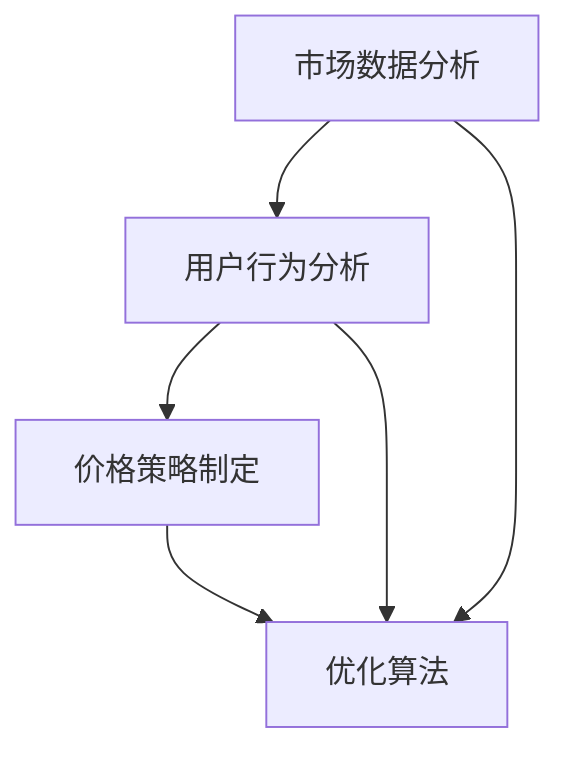

                 

# AI在电商价格优化中的技术实现

> **关键词：** 人工智能、电商、价格优化、机器学习、数据挖掘、算法

> **摘要：** 本文将深入探讨人工智能在电商价格优化中的应用，分析核心算法原理、数学模型及其实现步骤，通过实际项目案例展示如何利用AI技术实现高效的电商价格优化。

## 1. 背景介绍

### 1.1 目的和范围

本文旨在介绍人工智能在电商价格优化中的应用，通过深入剖析核心算法原理和实现步骤，帮助读者理解如何利用机器学习和数据挖掘技术来优化电商价格策略。本文将涵盖以下内容：

1. 电商价格优化的背景和重要性。
2. 人工智能在价格优化中的核心算法原理。
3. 数学模型及其实现步骤。
4. 实际应用案例和代码解读。
5. 工具和资源的推荐。

### 1.2 预期读者

本文适合对电商、机器学习和数据挖掘有一定了解的读者，包括：

1. 电商从业者：希望通过AI技术提升价格竞争力。
2. 数据科学家：希望了解AI在电商领域的应用。
3. 程序员：希望学习AI算法在电商中的实现。
4. AI研究人员：希望了解电商领域的应用案例。

### 1.3 文档结构概述

本文结构如下：

1. **背景介绍**：介绍电商价格优化的背景和重要性。
2. **核心概念与联系**：介绍核心概念原理和架构。
3. **核心算法原理 & 具体操作步骤**：讲解算法原理和实现步骤。
4. **数学模型和公式 & 详细讲解 & 举例说明**：介绍数学模型和示例。
5. **项目实战：代码实际案例和详细解释说明**：展示实际应用案例。
6. **实际应用场景**：分析AI在电商价格优化中的应用场景。
7. **工具和资源推荐**：推荐学习资源和开发工具。
8. **总结：未来发展趋势与挑战**：总结未来发展趋势和挑战。
9. **附录：常见问题与解答**：解答常见问题。
10. **扩展阅读 & 参考资料**：提供相关扩展阅读和参考资料。

### 1.4 术语表

#### 1.4.1 核心术语定义

- **人工智能（AI）**：指模拟人类智能行为的计算机系统，通过学习、推理和决策实现智能功能。
- **电商**：通过互联网进行商品交易和服务的活动。
- **价格优化**：通过算法和策略调整商品价格，以实现收益最大化或竞争优化。
- **机器学习（ML）**：一种AI技术，通过数据和算法让计算机自动学习，实现预测和决策。
- **数据挖掘（DM）**：从大量数据中发现有价值信息的过程。

#### 1.4.2 相关概念解释

- **特征工程**：通过选择、构造和处理数据特征，提升模型性能。
- **预测模型**：利用历史数据和算法预测未来值。
- **聚类分析**：将相似的数据点分为几个类别。

#### 1.4.3 缩略词列表

- **AI**：人工智能
- **ML**：机器学习
- **DM**：数据挖掘
- **PCA**：主成分分析
- **SVD**：奇异值分解
- **LSTM**：长短期记忆网络

## 2. 核心概念与联系

在电商价格优化中，核心概念包括市场数据分析、用户行为分析、价格策略制定和优化算法。以下是一个简化的Mermaid流程图，展示了这些核心概念之间的联系：



### 2.1 市场数据分析

市场数据分析是电商价格优化的基础，通过分析市场趋势、竞争对手价格和行业动态，为价格策略提供数据支持。主要方法包括：

- **价格指数分析**：比较不同时间点的价格变化。
- **趋势分析**：预测未来价格走势。
- **竞争对手分析**：了解竞争对手的价格策略。

### 2.2 用户行为分析

用户行为分析通过挖掘用户在电商平台的浏览、购买、评价等行为，了解用户偏好和需求，为价格策略提供用户视角。主要方法包括：

- **用户画像**：基于用户行为数据构建用户特征。
- **行为路径分析**：分析用户在电商平台的浏览路径。
- **反馈分析**：分析用户对商品的评价和反馈。

### 2.3 价格策略制定

价格策略制定基于市场数据分析和用户行为分析的结果，制定适应市场环境和用户需求的价格策略。主要方法包括：

- **成本加成定价**：在成本基础上加上一定比例的利润。
- **动态定价**：根据市场环境和用户需求动态调整价格。
- **折扣定价**：通过折扣来刺激销售。

### 2.4 优化算法

优化算法通过机器学习和数据挖掘技术，对价格策略进行优化，以实现价格竞争力的提升和收益最大化。主要方法包括：

- **线性回归**：通过历史数据拟合价格模型。
- **决策树**：基于规则进行价格决策。
- **神经网络**：通过多层神经网络进行复杂决策。

## 3. 核心算法原理 & 具体操作步骤

### 3.1 线性回归

线性回归是一种常用的优化算法，通过拟合历史数据来预测未来价格。以下是线性回归的伪代码：

```python
# 线性回归伪代码
def linear_regression(X, y):
    # X: 特征矩阵，y: 标签向量
    # 计算特征矩阵的协方差矩阵
    cov = X.T.dot(X)
    # 计算逆矩阵
    inv_cov = cov.I()
    # 计算回归系数
    beta = inv_cov.dot(X.T).dot(y)
    # 预测未来价格
    price = X.dot(beta)
    return price
```

### 3.2 决策树

决策树通过划分数据集，建立决策规则，进行价格决策。以下是决策树的伪代码：

```python
# 决策树伪代码
def decision_tree(X, y):
    # X: 特征矩阵，y: 标签向量
    # 如果数据集满足停止条件，返回当前节点
    if stop_condition(X, y):
        return create_leaf_node(y)
    # 选择最优特征和划分点
    feature, threshold = select_best_feature(X, y)
    # 创建内部节点
    node = create_internal_node(feature, threshold)
    # 划分数据集
    left_X, left_y = split_dataset(X, y, feature, threshold)
    right_X, right_y = split_dataset(X, y, feature, threshold)
    # 递归构建左右子树
    node.left = decision_tree(left_X, left_y)
    node.right = decision_tree(right_X, right_y)
    return node
```

### 3.3 神经网络

神经网络通过多层神经元进行复杂决策。以下是神经网络的伪代码：

```python
# 神经网络伪代码
def neural_network(X, y):
    # X: 特征矩阵，y: 标签向量
    # 初始化神经网络
    model = initialize_neural_network(X.shape[1])
    # 训练神经网络
    for epoch in range(num_epochs):
        # 前向传播
        output = forward_pass(X, model)
        # 计算损失函数
        loss = compute_loss(output, y)
        # 反向传播
        delta = backward_pass(X, output, y, model)
        # 更新模型参数
        update_model_params(model, delta)
    # 预测未来价格
    price = forward_pass(X, model)
    return price
```

## 4. 数学模型和公式 & 详细讲解 & 举例说明

### 4.1 线性回归模型

线性回归模型的基本公式为：

$$
y = \beta_0 + \beta_1x_1 + \beta_2x_2 + ... + \beta_nx_n
$$

其中，$y$ 为标签，$x_1, x_2, ..., x_n$ 为特征，$\beta_0, \beta_1, \beta_2, ..., \beta_n$ 为回归系数。

#### 4.1.1 线性回归的损失函数

损失函数是衡量模型预测值与实际值之间差异的指标，常用的损失函数为均方误差（MSE）：

$$
MSE = \frac{1}{n}\sum_{i=1}^{n}(y_i - \hat{y}_i)^2
$$

其中，$n$ 为样本数量，$y_i$ 为实际值，$\hat{y}_i$ 为预测值。

#### 4.1.2 线性回归的优化算法

线性回归的优化算法通常使用梯度下降法。梯度下降法的迭代过程如下：

$$
\beta_j = \beta_j - \alpha \frac{\partial}{\partial \beta_j}L(\beta)
$$

其中，$\alpha$ 为学习率，$L(\beta)$ 为损失函数。

### 4.2 决策树模型

决策树模型的基本公式为：

$$
\hat{y} = \begin{cases}
g_0, & \text{if } f(x) \leq \theta \\
g_1, & \text{if } f(x) > \theta
\end{cases}
$$

其中，$g_0$ 和 $g_1$ 为不同分类的结果，$f(x)$ 为决策函数，$\theta$ 为阈值。

#### 4.2.1 决策树的损失函数

决策树的损失函数通常使用基尼不纯度（Gini impurity）或信息增益（Information Gain）来衡量。基尼不纯度的公式为：

$$
Gini = 1 - \frac{1}{|C|}\sum_{i=1}^{|C|}|\pi_i|(1 - \pi_i)
$$

其中，$|C|$ 为类别数量，$\pi_i$ 为第 $i$ 个类别的概率。

#### 4.2.2 决策树的优化算法

决策树的优化算法通常使用贪心算法。贪心算法的迭代过程如下：

1. 选择最优特征和阈值，使得损失函数最小。
2. 划分数据集。
3. 递归构建决策树。

### 4.3 神经网络模型

神经网络模型的基本公式为：

$$
a_{ij}^{(l)} = \sigma(z_{ij}^{(l)})
$$

$$
z_{ij}^{(l)} = \sum_{k=1}^{n}w_{ik}^{(l)}a_{kj}^{(l-1)} + b_j^{(l)}
$$

其中，$a_{ij}^{(l)}$ 为第 $l$ 层第 $i$ 个神经元的激活值，$z_{ij}^{(l)}$ 为第 $l$ 层第 $i$ 个神经元的输入值，$w_{ik}^{(l)}$ 为连接权重，$b_j^{(l)}$ 为偏置项，$\sigma$ 为激活函数。

#### 4.3.1 神经网络的损失函数

神经网络的损失函数通常使用均方误差（MSE）或交叉熵（Cross-Entropy）来衡量。MSE的公式为：

$$
MSE = \frac{1}{n}\sum_{i=1}^{n}(y_i - \hat{y}_i)^2
$$

交叉熵的公式为：

$$
CE = -\frac{1}{n}\sum_{i=1}^{n}\sum_{j=1}^{m}y_{ij}\log(\hat{y}_{ij})
$$

#### 4.3.2 神经网络的优化算法

神经网络的优化算法通常使用梯度下降法。梯度下降法的迭代过程如下：

1. 前向传播：计算损失函数。
2. 反向传播：计算梯度。
3. 更新模型参数。

## 5. 项目实战：代码实际案例和详细解释说明

### 5.1 开发环境搭建

在开始实际项目之前，我们需要搭建开发环境。以下是一个基本的开发环境搭建步骤：

1. 安装Python：从[Python官网](https://www.python.org/)下载并安装Python。
2. 安装Jupyter Notebook：在命令行中运行 `pip install notebook`。
3. 安装必要的库：在命令行中运行 `pip install numpy pandas scikit-learn matplotlib`。

### 5.2 源代码详细实现和代码解读

以下是一个简单的线性回归模型实现，用于预测电商价格：

```python
import numpy as np
import pandas as pd
from sklearn.linear_model import LinearRegression
from sklearn.model_selection import train_test_split
import matplotlib.pyplot as plt

# 加载数据集
data = pd.read_csv('ecommerce_data.csv')
X = data[['feature_1', 'feature_2']]
y = data['price']

# 数据预处理
X_train, X_test, y_train, y_test = train_test_split(X, y, test_size=0.2, random_state=42)

# 构建线性回归模型
model = LinearRegression()
model.fit(X_train, y_train)

# 预测价格
y_pred = model.predict(X_test)

# 绘制真实值与预测值的散点图
plt.scatter(y_test, y_pred)
plt.xlabel('实际价格')
plt.ylabel('预测价格')
plt.title('真实价格 vs 预测价格')
plt.show()

# 输出模型参数
print('模型参数：', model.coef_, model.intercept_)
```

### 5.3 代码解读与分析

1. **加载数据集**：使用 `pandas` 库加载CSV格式的数据集。
2. **数据预处理**：将数据集分为特征矩阵 `X` 和标签向量 `y`，并使用 `train_test_split` 函数将数据集划分为训练集和测试集。
3. **构建线性回归模型**：使用 `LinearRegression` 类构建线性回归模型。
4. **训练模型**：使用 `fit` 方法训练模型。
5. **预测价格**：使用 `predict` 方法预测测试集的价格。
6. **绘制散点图**：使用 `matplotlib` 绘制真实值与预测值的散点图。
7. **输出模型参数**：输出模型的回归系数和截距。

通过这个简单的案例，我们可以看到如何使用Python和线性回归模型来预测电商价格。在实际应用中，我们可以结合更多特征和更复杂的模型，进一步提高预测精度。

## 6. 实际应用场景

### 6.1 市场动态定价

电商平台可以利用AI技术进行动态定价，根据市场动态和用户行为实时调整价格。例如，在促销期间，根据库存情况和用户需求，平台可以动态调整价格，以最大化销售额。

### 6.2 竞争对手监测

AI技术可以帮助电商企业实时监测竞争对手的价格变化，通过分析竞争对手的价格策略，制定相应的价格调整策略，以保持市场竞争力。

### 6.3 用户个性化定价

通过分析用户的购买历史和行为，电商企业可以提供个性化的价格策略，针对不同用户群体设定不同的价格，以提升用户体验和满意度。

### 6.4 需求预测

AI技术可以帮助电商企业预测未来的市场需求，根据预测结果调整价格，以避免库存过剩或短缺。

## 7. 工具和资源推荐

### 7.1 学习资源推荐

#### 7.1.1 书籍推荐

- 《机器学习》（周志华著）
- 《深度学习》（Ian Goodfellow, Yoshua Bengio, Aaron Courville 著）
- 《数据挖掘：实用工具和技术》（Jeffrey D. Camm 著）

#### 7.1.2 在线课程

- Coursera上的《机器学习》课程（吴恩达教授）
- edX上的《深度学习》课程（李飞飞教授）

#### 7.1.3 技术博客和网站

- Medium上的AI相关博客
- Towards Data Science上的数据科学和机器学习博客

### 7.2 开发工具框架推荐

#### 7.2.1 IDE和编辑器

- PyCharm
- Jupyter Notebook

#### 7.2.2 调试和性能分析工具

- Python Debugger（pdb）
- Profiling Tools（如cProfile）

#### 7.2.3 相关框架和库

- Scikit-learn
- TensorFlow
- PyTorch

### 7.3 相关论文著作推荐

#### 7.3.1 经典论文

- “The Power of Contextual Bandits for Personalized Pricing”（2011）
- “Recommender Systems Handbook”（2011）

#### 7.3.2 最新研究成果

- “Contextual Bandits with Expert Advice”（2019）
- “Deep Learning for Dynamic Pricing”（2020）

#### 7.3.3 应用案例分析

- “AI-Powered Dynamic Pricing at Airbnb”（2018）
- “AI in Retail: Dynamic Pricing and Personalization”（2021）

## 8. 总结：未来发展趋势与挑战

### 8.1 发展趋势

1. **算法的优化与智能化**：随着算法的不断优化和智能化，电商价格优化将变得更加精准和高效。
2. **多模态数据的融合**：利用多种数据源（如图像、文本、音频）进行数据融合，提高预测的准确性。
3. **个性化定价**：通过更深入的用户行为分析，实现更加个性化的定价策略。

### 8.2 挑战

1. **数据隐私保护**：在利用用户数据进行价格优化时，需要确保数据隐私和安全。
2. **算法透明性和可解释性**：随着算法的复杂度增加，如何提高算法的透明性和可解释性成为一个挑战。
3. **实时性**：在快速变化的市场环境中，如何实现实时性是一个技术难题。

## 9. 附录：常见问题与解答

### 9.1 问题1：如何保证数据隐私？

**解答**：在数据处理过程中，应采用数据脱敏、加密和匿名化等技术，确保用户数据的安全和隐私。

### 9.2 问题2：如何处理缺失值和异常值？

**解答**：可以使用数据填充、插值、删除等方法处理缺失值和异常值，以提高模型的训练效果。

### 9.3 问题3：如何评估模型的性能？

**解答**：可以使用均方误差（MSE）、准确率、召回率等指标来评估模型的性能。

## 10. 扩展阅读 & 参考资料

- 《机器学习实战》（Peter Harrington 著）
- 《深度学习》（Goodfellow, Bengio, Courville 著）
- 《数据挖掘：实用工具和技术》（Jeffrey D. Camm 著）
- Coursera上的《机器学习》课程（吴恩达教授）
- Medium上的AI相关博客
- 《AI-Powered Dynamic Pricing in Retail》（2021）

