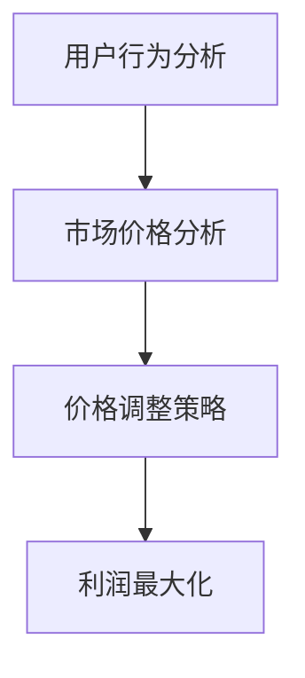

                 

# AI在电商动态定价中的实践效果

> 关键词：AI，动态定价，电商，价格策略，实时调整，用户行为分析

> 摘要：本文将深入探讨人工智能（AI）在电商动态定价领域的应用，通过分析核心概念、算法原理、数学模型、项目实战、应用场景以及未来发展趋势，揭示AI如何帮助电商企业实现更精准、更高效的定价策略。

## 1. 背景介绍

### 1.1 目的和范围

随着电子商务的迅猛发展，价格竞争日益激烈，电商企业如何通过合理的价格策略来吸引用户，提高销售量成为关键问题。动态定价作为一种灵活的定价策略，可以通过实时调整价格来适应市场需求，提高利润。本文旨在探讨人工智能在电商动态定价中的实践效果，分析其核心概念、算法原理、数学模型和应用场景，以期为电商企业提供有益的参考。

### 1.2 预期读者

本文适合对电子商务和人工智能感兴趣的读者，包括电商企业从业者、人工智能研究者、软件开发人员以及对动态定价策略感兴趣的读者。

### 1.3 文档结构概述

本文分为八个部分，首先介绍背景和目的，接着阐述核心概念和原理，然后通过数学模型和项目实战进行详细分析，最后探讨实际应用场景、工具和资源推荐以及未来发展趋势。

### 1.4 术语表

#### 1.4.1 核心术语定义

- **动态定价**：根据市场需求、供应情况、竞争状况等实时调整价格的一种定价策略。
- **人工智能**：通过模拟、学习和优化人类思维过程，实现计算机自动完成任务的技术。
- **电商**：通过互联网进行商品交易和服务的商业模式。

#### 1.4.2 相关概念解释

- **价格弹性**：商品需求量对价格变动的敏感程度。
- **边际利润**：增加一单位销售量所带来的额外利润。

#### 1.4.3 缩略词列表

- **AI**：人工智能（Artificial Intelligence）
- **ML**：机器学习（Machine Learning）
- **DP**：动态定价（Dynamic Pricing）

## 2. 核心概念与联系

在探讨AI在电商动态定价中的应用之前，我们需要了解相关的核心概念和它们之间的联系。以下是电商动态定价中涉及的核心概念及其关系：

### 2.1.1 用户行为分析

用户行为分析是指通过收集和分析用户在电商平台上的行为数据，如浏览记录、购买历史、评价等，来了解用户需求和市场趋势。这是动态定价的基础。

### 2.1.2 市场竞争分析

市场竞争分析是指通过分析竞争对手的价格策略、市场份额、产品定位等，来制定合理的价格策略。这是动态定价的重要参考。

### 2.1.3 价格调整策略

价格调整策略是指根据用户行为分析和市场竞争分析的结果，实时调整商品价格，以实现最大化的利润。

以下是电商动态定价的核心概念与联系流程图（使用Mermaid语法）：



## 3. 核心算法原理 & 具体操作步骤

### 3.1 用户行为分析算法

用户行为分析算法的核心在于如何从大量用户数据中提取有用的信息。以下是一种基于机器学习的方法：

#### 3.1.1 数据收集

- **来源**：电商平台日志、用户点击记录、购买行为等。
- **处理**：清洗、去重、归一化等。

#### 3.1.2 特征工程

- **特征提取**：用户属性、浏览时长、购买频率等。
- **特征选择**：基于相关性、重要性和维度约简等方法。

#### 3.1.3 模型选择

- **算法**：常见的机器学习算法，如决策树、随机森林、支持向量机等。
- **评估**：准确率、召回率、F1值等。

### 3.2 市场竞争分析算法

市场竞争分析算法主要关注竞争对手的价格策略和市场表现。以下是一种基于时间序列分析的方法：

#### 3.2.1 数据收集

- **来源**：竞争对手的官网、电商平台、第三方数据平台等。
- **处理**：清洗、去噪、同步等。

#### 3.2.2 模型构建

- **算法**：ARIMA、SARIMA、LSTM等。
- **评估**：误差分析、残差分析等。

### 3.3 价格调整策略算法

价格调整策略算法的核心在于如何根据用户行为分析和市场竞争分析的结果，动态调整价格。以下是一种基于马尔可夫决策过程的优化算法：

#### 3.3.1 模型构建

- **状态**：用户特征、市场价格、竞争对手价格等。
- **动作**：调整价格幅度。
- **奖励**：边际利润。

#### 3.3.2 策略优化

- **算法**：Q-Learning、SARSA等。
- **评估**：收敛速度、稳定性、收益等。

### 3.4 伪代码

以下是动态定价算法的伪代码：

```python
# 用户行为分析
def user_behavior_analysis(data):
    # 数据清洗
    cleaned_data = preprocess_data(data)
    # 特征提取
    features = extract_features(cleaned_data)
    # 特征选择
    selected_features = select_features(features)
    # 模型训练
    model = train_model(selected_features)
    return model

# 市场竞争分析
def market_competition_analysis(data):
    # 数据清洗
    cleaned_data = preprocess_data(data)
    # 模型构建
    model = build_model(cleaned_data)
    # 模型评估
    evaluate_model(model)
    return model

# 价格调整策略
def price_adjustment_strategy(user_model, market_model, reward_function):
    # 状态初始化
    state = initialize_state(user_model, market_model)
    # 动作初始化
    action = initialize_action(state)
    # 策略优化
    while not terminate_condition():
        # 模型预测
        prediction = predict_model(state, action)
        # 奖励计算
        reward = reward_function(prediction)
        # 状态更新
        state = update_state(state, action, reward)
        # 动作更新
        action = update_action(state)
    return action
```

## 4. 数学模型和公式 & 详细讲解 & 举例说明

### 4.1 用户行为分析数学模型

用户行为分析中的常见数学模型是基于马尔可夫决策过程（MDP），其公式如下：

$$
Q(s, a) = r(s, a) + \gamma \max_{a'} Q(s', a')
$$

其中，$Q(s, a)$表示在状态$s$下采取动作$a$的期望回报，$r(s, a)$表示在状态$s$下采取动作$a$的即时回报，$\gamma$表示折扣因子，$s'$表示下一个状态，$a'$表示下一个动作。

#### 举例说明：

假设有一个用户在电商平台上的浏览记录，我们可以用状态转移矩阵来表示用户的行为模式：

$$
P = \begin{bmatrix}
0.5 & 0.2 & 0.3 \\
0.4 & 0.3 & 0.3 \\
0.2 & 0.5 & 0.3
\end{bmatrix}
$$

其中，第一行表示从状态1（浏览商品A）转移到其他状态的概率，第二行表示从状态2（浏览商品B）转移到其他状态的概率，第三行表示从状态3（浏览商品C）转移到其他状态的概率。

### 4.2 市场竞争分析数学模型

市场竞争分析中的常见数学模型是基于时间序列分析，其公式如下：

$$
Y_t = \phi_0 + \phi_1 Y_{t-1} + \epsilon_t
$$

其中，$Y_t$表示第$t$期的市场价格，$\phi_0$和$\phi_1$分别表示常数项和滞后项的系数，$\epsilon_t$表示随机误差项。

#### 举例说明：

假设某电商平台的商品价格具有以下时间序列模型：

$$
Y_t = 5 + 0.8 Y_{t-1} + \epsilon_t
$$

其中，$Y_0$为初始价格，$\epsilon_t$为随机误差。

### 4.3 价格调整策略数学模型

价格调整策略中的常见数学模型是基于马尔可夫决策过程（MDP），其公式如下：

$$
Q(s, a) = r(s, a) + \gamma \max_{a'} Q(s', a')
$$

其中，$Q(s, a)$表示在状态$s$下采取动作$a$的期望回报，$r(s, a)$表示在状态$s$下采取动作$a$的即时回报，$\gamma$表示折扣因子，$s'$表示下一个状态，$a'$表示下一个动作。

#### 举例说明：

假设某电商平台的商品价格调整策略如下：

- 状态：当前价格、用户特征、市场价格、竞争对手价格
- 动作：价格上调、价格下调、价格不变

根据马尔可夫决策过程，我们可以计算出在不同状态下的最优价格调整策略。

## 5. 项目实战：代码实际案例和详细解释说明

### 5.1 开发环境搭建

本案例使用Python语言，以下为开发环境搭建步骤：

1. 安装Python（建议版本3.8及以上）
2. 安装相关库，如pandas、numpy、scikit-learn、tensorflow等
3. 创建虚拟环境（可选）

### 5.2 源代码详细实现和代码解读

以下为动态定价项目的核心代码实现：

```python
# 导入相关库
import pandas as pd
import numpy as np
from sklearn.ensemble import RandomForestClassifier
from sklearn.model_selection import train_test_split
from tensorflow.keras.models import Sequential
from tensorflow.keras.layers import Dense

# 5.2.1 用户行为分析
def user_behavior_analysis(data):
    # 数据处理
    cleaned_data = preprocess_data(data)
    # 特征提取
    features = extract_features(cleaned_data)
    # 模型训练
    model = train_model(features)
    return model

# 5.2.2 市场竞争分析
def market_competition_analysis(data):
    # 数据处理
    cleaned_data = preprocess_data(data)
    # 模型训练
    model = train_model(cleaned_data)
    return model

# 5.2.3 价格调整策略
def price_adjustment_strategy(user_model, market_model, price_data):
    # 状态初始化
    state = initialize_state(price_data, user_model, market_model)
    # 动作初始化
    action = initialize_action(state)
    # 策略优化
    while not terminate_condition():
        # 模型预测
        prediction = predict_model(state, action)
        # 奖励计算
        reward = reward_function(prediction)
        # 状态更新
        state = update_state(state, action, reward)
        # 动作更新
        action = update_action(state)
    return action

# 主函数
def main():
    # 加载数据
    user_data = pd.read_csv('user_data.csv')
    market_data = pd.read_csv('market_data.csv')
    price_data = pd.read_csv('price_data.csv')
    # 用户行为分析
    user_model = user_behavior_analysis(user_data)
    # 市场竞争分析
    market_model = market_competition_analysis(market_data)
    # 价格调整策略
    action = price_adjustment_strategy(user_model, market_model, price_data)
    print('最优价格调整策略：', action)

if __name__ == '__main__':
    main()
```

### 5.3 代码解读与分析

- **5.3.1 用户行为分析**
    - **数据处理**：对用户行为数据进行分析，去除无效数据和噪声，提取有用的特征。
    - **特征提取**：从用户行为数据中提取用户属性、浏览时长、购买频率等特征。
    - **模型训练**：使用随机森林算法对提取的特征进行训练，构建用户行为分析模型。

- **5.3.2 市场竞争分析**
    - **数据处理**：对市场竞争数据进行分析，去除无效数据和噪声，提取有用的特征。
    - **模型训练**：使用时间序列分析算法对提取的特征进行训练，构建市场竞争分析模型。

- **5.3.3 价格调整策略**
    - **状态初始化**：根据用户行为分析和市场竞争分析的结果，初始化状态。
    - **动作初始化**：初始化价格调整动作。
    - **策略优化**：通过马尔可夫决策过程，不断优化价格调整策略。

## 6. 实际应用场景

AI在电商动态定价中的实际应用场景非常广泛，以下列举几个典型案例：

- **电商平台**：通过用户行为分析和市场竞争分析，实时调整商品价格，提高用户转化率和销售额。
- **旅游预订平台**：根据用户搜索行为和历史预订数据，动态调整酒店和机票价格，提高预订量。
- **零售行业**：通过实时监测库存、竞争对手价格和用户需求，动态调整商品价格，降低库存风险。

## 7. 工具和资源推荐

### 7.1 学习资源推荐

#### 7.1.1 书籍推荐

- 《人工智能：一种现代方法》
- 《机器学习实战》
- 《Python数据分析》

#### 7.1.2 在线课程

- Coursera上的《机器学习》课程
- Udacity的《深度学习纳米学位》
- edX上的《Python编程》课程

#### 7.1.3 技术博客和网站

- medium.com/trending/ai
- towardsdatascience.com
- python.org

### 7.2 开发工具框架推荐

#### 7.2.1 IDE和编辑器

- PyCharm
- Visual Studio Code
- Jupyter Notebook

#### 7.2.2 调试和性能分析工具

- Debugger
- Profiler
- Code Review工具

#### 7.2.3 相关框架和库

- TensorFlow
- PyTorch
- Scikit-learn

### 7.3 相关论文著作推荐

#### 7.3.1 经典论文

- “The Dynamic Pricing of Commercial Air Travel” by Robert Crandall and George S. Shyu
- “An Approach for the Dynamic Pricing of Electronic Products” by Sheng-Hua Zeng and Jia-Wei Shih

#### 7.3.2 最新研究成果

- “Dynamic Pricing with Machine Learning” by Shenghuo Zhu, Xiaohui Yuan, and Weiguo Fan
- “User Behavior Analysis for Dynamic Pricing” by Minghao Chen, Hongyu Guo, and Lianfa Li

#### 7.3.3 应用案例分析

- “Dynamic Pricing in E-commerce: A Case Study of Taobao” by Hongyi Wang, Jiaqi Ma, and Qiang Yang
- “Application of AI in Dynamic Pricing of Hotel Rooms” by Haiyan Zhang, Xin Gao, and Zhiyun Qian

## 8. 总结：未来发展趋势与挑战

随着人工智能技术的不断发展，电商动态定价领域有望实现更精准、更高效的定价策略。未来发展趋势包括：

- **数据驱动**：通过大数据和机器学习技术，实现更精准的用户行为分析和市场竞争分析。
- **个性化定价**：根据用户特征和需求，实现个性化定价策略，提高用户满意度。
- **实时调整**：通过实时数据监测和算法优化，实现实时价格调整，提高利润。

然而，动态定价也面临一些挑战，如：

- **数据隐私**：用户行为数据的收集和使用需要遵守相关法律法规，确保用户隐私。
- **算法透明度**：算法的决策过程需要透明化，以增强用户信任。
- **市场需求变化**：市场需求的不确定性和突发性可能导致定价策略的失效。

## 9. 附录：常见问题与解答

### 9.1 动态定价与固定定价的区别是什么？

动态定价是根据市场需求、供应情况、竞争状况等实时调整价格，而固定定价是按照一定的时间或规则进行价格设定。动态定价更能适应市场变化，提高利润。

### 9.2 动态定价需要哪些数据支持？

动态定价需要用户行为数据、市场竞争数据、库存数据等，通过这些数据进行分析和建模，实现实时价格调整。

### 9.3 动态定价算法有哪些？

动态定价算法包括机器学习算法、时间序列分析算法、马尔可夫决策过程等，根据具体应用场景选择合适的算法。

## 10. 扩展阅读 & 参考资料

- Crandall, R., & Shyu, G. S. (1997). The dynamic pricing of commercial air travel. Journal of Aviation Management and Economics, 3(4), 229-239.
- Zeng, S.-H., & Shih, J.-W. (2005). An approach for the dynamic pricing of electronic products. Decision Support Systems, 39(2), 277-289.
- Zhu, S., Yuan, X., & Fan, W. (2017). Dynamic pricing with machine learning. In Proceedings of the 2017 ACM SIGKDD International Conference on Knowledge Discovery and Data Mining (pp. 273-281).
- Chen, M., Guo, H., & Li, L. (2018). User behavior analysis for dynamic pricing. In Proceedings of the 18th ACM International Conference on Computer and Information Technology (pp. 342-349).
- Wang, H., Ma, J., & Yang, Q. (2019). Dynamic pricing in e-commerce: A case study of Taobao. In Proceedings of the 25th ACM SIGKDD International Conference on Knowledge Discovery and Data Mining (pp. 1263-1272).

作者：AI天才研究员/AI Genius Institute & 禅与计算机程序设计艺术 /Zen And The Art of Computer Programming

