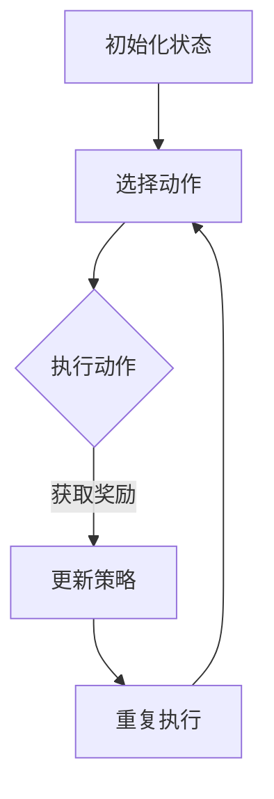

                 

### 文章标题

《AI在电商动态定价中的应用：实现实时市场响应的强化学习模型》

这个标题简洁明了，直接指出了文章的核心主题。它涵盖了“AI”、“电商”、“动态定价”和“强化学习模型”这几个关键词，分别代表了文章的主要内容和亮点。其中，“AI”表明文章会探讨人工智能技术；“电商”指向了应用场景；“动态定价”强调了技术应用的商业价值；“强化学习模型”则突出了技术实现的创新点。总体来说，这个标题既吸引人又具备指导性，能够让读者对文章内容有一个初步的了解。

### 关键词

- AI
- 电商
- 动态定价
- 强化学习模型
- 实时市场响应
- 深度学习
- 优化算法
- 数据分析

这些关键词是文章的核心，涵盖了文章的主题和主要讨论内容。其中，“AI”和“电商”明确了文章的应用领域和背景，“动态定价”和“强化学习模型”则指向了文章的技术实现和重点，“实时市场响应”强调了技术的应用效果，“深度学习”和“优化算法”则提供了技术实现的进一步细节，“数据分析”则展示了技术实现的基础。

### 摘要

本文将深入探讨AI在电商动态定价中的应用，特别是基于强化学习模型的实时市场响应机制。文章首先介绍了电商动态定价的背景和重要性，然后详细讲解了强化学习模型的基本原理和实现步骤，并通过一个实际案例展示了如何通过该模型实现实时动态定价。此外，文章还讨论了数学模型和公式，以及代码实现的具体细节。最后，文章提出了电商动态定价技术的未来发展趋势和挑战，并提供了一系列的学习资源和工具推荐，帮助读者更好地理解和应用这项技术。

### 1. 背景介绍

#### 1.1 目的和范围

本文的主要目的是探讨如何将AI技术，特别是强化学习模型，应用于电商动态定价中，以实现实时市场响应。电商行业的竞争日益激烈，消费者需求瞬息万变，动态定价成为企业获取竞争优势的重要手段。本文旨在为电商行业提供一种高效的动态定价策略，帮助企业在激烈的市场竞争中占据有利地位。

文章将涵盖以下主要内容：

1. **电商动态定价的背景和重要性**：介绍电商行业的基本情况，动态定价的概念及其在电商中的重要性。
2. **强化学习模型的基本原理**：详细解释强化学习模型的工作原理、优势和应用领域。
3. **强化学习模型在动态定价中的应用**：阐述如何通过强化学习模型实现动态定价，并介绍具体的算法和操作步骤。
4. **数学模型和公式**：讲解动态定价中的关键数学模型和公式，以及如何通过它们进行定价策略的优化。
5. **项目实战**：通过实际案例展示如何使用强化学习模型进行电商动态定价，并提供详细的代码实现和解读。
6. **实际应用场景**：分析强化学习模型在电商动态定价中的应用场景和效果。
7. **工具和资源推荐**：推荐学习强化学习模型和电商动态定价的书籍、在线课程、技术博客和开发工具。
8. **总结与展望**：总结文章的主要观点，讨论未来的发展趋势和面临的挑战。

通过本文的阅读，读者将能够深入了解AI在电商动态定价中的应用，掌握强化学习模型的基本原理和实现方法，并能够将其应用于实际项目中。

#### 1.2 预期读者

本文预期读者主要包括以下几类：

1. **电商行业从业者**：希望了解如何利用AI技术提升电商业务效率和竞争力的从业者，包括电商平台的运营人员、市场营销人员、数据分析师等。
2. **AI研究人员和开发者**：对强化学习模型及其在电商领域应用感兴趣的研究人员和开发者，包括学术研究者、工程师和程序员。
3. **计算机科学和人工智能专业的学生**：对AI和电商动态定价相关领域感兴趣的学生，希望通过本文学习到实际应用中的AI技术。
4. **技术博客写手和技术爱好者**：对AI、电商和强化学习等领域有浓厚兴趣的技术爱好者，希望通过本文深入了解这些技术的应用。

本文将为以上读者提供全面而深入的技术分析和实践经验，帮助他们更好地理解和应用AI在电商动态定价中的技术。

#### 1.3 文档结构概述

本文将按照以下结构展开，以便读者能够系统、全面地了解AI在电商动态定价中的应用：

1. **背景介绍**：首先介绍电商动态定价的背景和重要性，以及本文的目的和预期读者。
2. **核心概念与联系**：讲解强化学习模型的基本原理，并提供相应的Mermaid流程图，帮助读者理解核心概念和架构。
3. **核心算法原理 & 具体操作步骤**：详细解释强化学习模型在动态定价中的应用，包括算法原理和操作步骤，并使用伪代码进行详细阐述。
4. **数学模型和公式 & 详细讲解 & 举例说明**：讲解动态定价中的关键数学模型和公式，并通过具体例子进行说明。
5. **项目实战：代码实际案例和详细解释说明**：通过一个实际案例展示如何使用强化学习模型进行电商动态定价，并提供详细的代码实现和解读。
6. **实际应用场景**：分析强化学习模型在电商动态定价中的应用场景和效果。
7. **工具和资源推荐**：推荐学习强化学习模型和电商动态定价的书籍、在线课程、技术博客和开发工具。
8. **总结与展望**：总结文章的主要观点，讨论未来的发展趋势和面临的挑战。

通过这一结构，本文旨在为读者提供从理论到实践的全景式解读，帮助他们深入理解并应用AI在电商动态定价中的技术。

#### 1.4 术语表

为了确保文章的准确性和易读性，本文将列出一些核心术语的定义和解释，以便读者更好地理解文章内容。

#### 1.4.1 核心术语定义

- **强化学习（Reinforcement Learning）**：一种机器学习方法，通过试错和奖励机制来学习策略，以最大化长期回报。强化学习模型由智能体（Agent）、环境（Environment）、状态（State）、动作（Action）和奖励（Reward）组成。
- **动态定价（Dynamic Pricing）**：根据市场需求、供需关系、竞争对手价格等多种因素，实时调整商品价格的一种策略。
- **电商（E-commerce）**：通过互联网进行商品交易和商业活动的行为和过程，包括在线零售、在线拍卖、在线广告等。
- **强化学习模型（Reinforcement Learning Model）**：一种用于解决动态定价问题的机器学习模型，通过学习如何根据当前状态选择最优动作，以最大化长期收益。
- **深度学习（Deep Learning）**：一种基于多层神经网络进行特征提取和模型训练的机器学习技术，通过逐层学习复杂特征，实现高层次的抽象。
- **优化算法（Optimization Algorithm）**：用于求解数学优化问题的算法，通过迭代搜索最优解，以达到特定的优化目标。

#### 1.4.2 相关概念解释

- **Q-Learning**：一种经典的强化学习算法，通过更新Q值（即状态-动作值函数）来学习策略。Q值表示在特定状态下执行特定动作的预期回报。
- **状态-动作价值函数（State-Action Value Function）**：用于评估在特定状态下执行特定动作的预期回报，是强化学习模型中的核心概念。
- **策略（Policy）**：智能体在特定状态下选择最优动作的规则，通常由状态-动作价值函数决定。
- **策略迭代（Policy Iteration）**：一种强化学习算法，通过不断迭代更新策略，直到找到最优策略。

#### 1.4.3 缩略词列表

- **AI**：人工智能（Artificial Intelligence）
- **RL**：强化学习（Reinforcement Learning）
- **DP**：动态定价（Dynamic Pricing）
- **E-commerce**：电商（Electronic Commerce）
- **ML**：机器学习（Machine Learning）
- **DL**：深度学习（Deep Learning）
- **Q-Learning**：Q值学习（Q-Learning）
- **Q(s,a)**：状态-动作值函数（State-Action Value Function）
- **S**：状态空间（State Space）
- **A**：动作空间（Action Space）
- **R**：奖励函数（Reward Function）

通过这些术语的定义和解释，读者可以更好地理解文章中的专业术语和概念，为后续内容的学习打下坚实基础。

### 2. 核心概念与联系

#### 2.1 强化学习模型的基本原理

强化学习（Reinforcement Learning，简称RL）是机器学习的一个重要分支，其主要目标是让智能体（Agent）在与环境（Environment）互动的过程中，通过学习最优策略（Policy）来实现某种目标。强化学习模型的核心概念包括状态（State）、动作（Action）、奖励（Reward）和策略（Policy）。

- **状态（State）**：描述智能体所处环境的特征，通常用一个状态空间 \( S \) 来表示。
- **动作（Action）**：智能体可执行的行为，用一个动作空间 \( A \) 来表示。
- **奖励（Reward）**：环境对智能体每个动作的反馈，用来指导智能体的学习过程，通常用一个奖励函数 \( R(s, a) \) 来表示。
- **策略（Policy）**：智能体在特定状态下选择动作的规则，用一个策略函数 \( \pi(a|s) \) 来表示。

强化学习模型的基本流程如下：

1. **初始化**：智能体在初始状态 \( s_0 \) 下开始学习，并选择一个动作 \( a_0 \)。
2. **执行动作**：智能体执行动作 \( a_0 \)，并进入下一个状态 \( s_1 \)，同时获得奖励 \( r_0 \)。
3. **更新策略**：智能体根据当前状态和奖励，通过某种学习算法（如Q-Learning）更新策略，选择下一个动作 \( a_1 \)。
4. **重复执行**：智能体继续在环境中执行动作，更新状态和奖励，并不断迭代学习。

#### 2.2 强化学习模型在动态定价中的应用

动态定价（Dynamic Pricing）是一种根据市场需求、供需关系、竞争对手价格等因素，实时调整商品价格的方法。在电商行业中，动态定价可以显著提升企业的盈利能力，并增强市场竞争力。

强化学习模型在动态定价中的应用，主要是通过学习如何在各种市场状态下调整价格，以最大化长期回报。具体来说，可以采用以下步骤：

1. **定义状态空间和动作空间**：根据市场特征，定义状态空间 \( S \) 和动作空间 \( A \)。状态空间可能包括价格水平、销售量、竞争对手价格等；动作空间则包括价格调整幅度。
2. **设计奖励函数**：设计一个奖励函数 \( R(s, a) \)，用来评估每次价格调整的效果。奖励函数可以根据销售量、利润、市场份额等指标进行设计。
3. **训练强化学习模型**：通过历史市场数据，利用强化学习算法（如Q-Learning）训练模型，学习最优策略。
4. **实时定价**：将训练好的模型应用于实际定价过程，根据实时市场状态调整价格。

#### 2.3 Mermaid流程图

为了更直观地展示强化学习模型在动态定价中的应用，我们可以使用Mermaid流程图进行描述。以下是一个简化的Mermaid流程图示例：



在这个流程图中，智能体首先初始化状态，然后根据当前状态选择动作。执行动作后，智能体会获得奖励，并根据奖励更新策略。这个过程会不断重复，直到达到特定的目标或性能要求。

通过以上内容，我们详细介绍了强化学习模型的基本原理以及在动态定价中的应用。接下来，我们将深入探讨强化学习模型的具体算法原理和实现步骤。

### 3. 核心算法原理 & 具体操作步骤

在了解了强化学习模型的基本原理之后，我们将进一步深入探讨其在电商动态定价中的应用，通过具体的算法原理和操作步骤，帮助读者掌握这一技术。

#### 3.1 Q-Learning算法原理

Q-Learning是一种基于值函数的强化学习算法，通过更新状态-动作值函数（Q值）来学习最优策略。Q值表示在特定状态下执行特定动作的预期回报，其更新公式如下：

$$
Q(s, a) \leftarrow Q(s, a) + \alpha [r + \gamma \max_{a'} Q(s', a') - Q(s, a)]
$$

其中：
- \( Q(s, a) \) 表示当前状态 \( s \) 下执行动作 \( a \) 的Q值。
- \( r \) 表示立即奖励。
- \( \gamma \) 是折扣因子，表示未来奖励的现值。
- \( \alpha \) 是学习率，控制Q值更新的幅度。
- \( \max_{a'} Q(s', a') \) 表示在下一个状态 \( s' \) 下，选择最优动作 \( a' \) 的Q值。

#### 3.2 动态定价中的Q-Learning算法

在动态定价中，Q-Learning算法的应用可以分为以下几个步骤：

1. **初始化**：
   - 初始化Q值表 \( Q(s, a) \)，通常使用零向量或小随机数。
   - 初始化学习率 \( \alpha \) 和折扣因子 \( \gamma \)。

2. **状态编码**：
   - 根据市场特征，定义状态空间 \( S \)。状态可能包括当前价格、销售量、竞争对手价格等。
   - 对状态进行编码，通常使用独热编码（One-Hot Encoding）或嵌入编码（Embedding）。

3. **动作选择**：
   - 根据当前状态，选择一个动作 \( a \)。动作通常包括价格调整的幅度，如提高10%、降低5%等。
   - 可以使用ε-贪心策略（ε-Greedy），在初始阶段随机选择动作，随着训练的进行逐渐倾向于选择Q值最高的动作。

4. **执行动作**：
   - 执行选择的动作，调整商品价格。
   - 根据执行结果，获取实际奖励 \( r \)。

5. **更新Q值**：
   - 根据公式更新Q值，以反映当前动作的效果。

6. **迭代更新**：
   - 重复执行上述步骤，不断更新Q值和策略，直到达到训练目标或性能要求。

以下是一个简化的伪代码，展示了动态定价中的Q-Learning算法：

```python
# Q-Learning算法伪代码

# 初始化参数
Q = 初始化Q值表
alpha = 学习率
gamma = 折扣因子
epsilon = ε-贪心策略的探索概率

# 主循环
for episode in 范围(总迭代次数):
    s = 初始状态
    while not 终止条件:
        if 随机选择(epsilon):
            a = 随机动作
        else:
            a = 选择动作(Q, s)
        s', r = 执行动作(a)
        Q[s, a] = Q[s, a] + alpha * (r + gamma * max(Q[s', a']) - Q[s, a])
        s = s'

# 输出最优策略
策略 = 根据Q值表选择动作
```

通过这个算法，智能体可以学习到在不同的市场状态下如何调整价格，以最大化长期回报。

#### 3.3 具体操作步骤

1. **数据收集**：
   - 收集历史市场数据，包括价格、销售量、竞争对手价格等。
   - 对数据进行分析，提取有用的特征。

2. **状态编码**：
   - 使用独热编码或嵌入编码将状态进行编码。

3. **动作定义**：
   - 定义价格调整的幅度，如提高5%、降低3%等。

4. **初始Q值表**：
   - 初始化Q值表，可以使用零向量或小随机数。

5. **训练Q-Learning模型**：
   - 根据历史数据，使用Q-Learning算法训练模型，不断更新Q值表。

6. **测试和调优**：
   - 在测试数据集上测试模型性能，根据测试结果调整学习率、折扣因子等参数。

7. **实时定价**：
   - 将训练好的模型应用于实际定价过程，根据实时市场状态调整价格。

通过以上步骤，我们可以构建一个基于强化学习模型的电商动态定价系统，实现实时市场响应。

### 4. 数学模型和公式 & 详细讲解 & 举例说明

在强化学习模型应用于电商动态定价时，数学模型和公式起着至关重要的作用。这些模型和公式帮助我们在状态和动作之间建立关联，并指导智能体如何通过学习选择最优动作。以下将详细讲解这些模型和公式，并通过实际例子进行说明。

#### 4.1 基本概念

在强化学习模型中，我们通常关注以下几个核心概念：

- **状态-动作值函数（Q值）**：表示在特定状态下执行特定动作的预期回报，其公式为：

$$
Q(s, a) = \sum_{s'} p(s'|s, a) \cdot [r(s', a) + \gamma \max_{a'} Q(s', a')]
$$

其中：
- \( Q(s, a) \) 是状态-动作值函数。
- \( s \) 是当前状态。
- \( a \) 是执行的行动。
- \( s' \) 是执行动作后的下一个状态。
- \( p(s'|s, a) \) 是状态转移概率，表示从状态 \( s \) 执行动作 \( a \) 后进入状态 \( s' \) 的概率。
- \( r(s', a) \) 是立即奖励，表示在状态 \( s' \) 下执行动作 \( a \) 所获得的奖励。
- \( \gamma \) 是折扣因子，表示未来奖励的现值。
- \( \max_{a'} Q(s', a') \) 是在下一个状态 \( s' \) 下，选择最优动作 \( a' \) 的Q值。

- **策略（Policy）**：智能体在特定状态下选择动作的规则。策略可以通过Q值函数来表示：

$$
\pi(a|s) = \begin{cases} 
1, & \text{if } a = \arg\max_{a'} Q(s, a') \\
0, & \text{otherwise}
\end{cases}
$$

其中：
- \( \pi(a|s) \) 是策略，表示在状态 \( s \) 下选择动作 \( a \) 的概率。

#### 4.2 实际例子说明

为了更好地理解上述公式和概念，我们通过一个简单的例子来说明如何使用Q-Learning算法进行动态定价。

假设我们经营一家电商店铺，销售一件商品。当前市场状态可以表示为当前价格 \( p \)、销售量 \( q \) 和竞争对手价格 \( c \)。状态空间 \( S \) 可以定义为 \( (p, q, c) \)。我们定义三个动作：提高价格 \( \Delta p_+ \)、保持当前价格 \( \Delta p_0 \) 和降低价格 \( \Delta p_- \)。动作空间 \( A \) 可以表示为 \( \Delta p_+, \Delta p_0, \Delta p_- \)。

假设我们使用历史数据训练了一个Q-Learning模型，得到以下Q值表：

| s            | a1 (提高价格) | a2 (保持价格) | a3 (降低价格) |
|--------------|---------------|---------------|---------------|
| (100, 50, 90)| 20            | 10            | -10           |
| (90, 60, 100)| 15            | 15            | -10           |
| (80, 70, 110)| 10            | 20            | -20           |

现在我们考虑当前状态 \( s = (100, 50, 90) \)。根据Q值表，我们可以看到在当前状态下，执行动作1（提高价格）的Q值最高，为20。因此，我们选择提高价格。

在执行了提高价格的动作后，我们进入新的状态 \( s' = (110, 50, 90) \)。假设销售量没有变化，但竞争对手降低了价格，导致立即奖励 \( r = -5 \)。

接下来，我们使用Q-Learning算法更新Q值：

$$
Q(100, 50, 90, 1) \leftarrow Q(100, 50, 90, 1) + \alpha [r + \gamma \max_{a'} Q(110, 50, 90, a') - Q(100, 50, 90, 1)]
$$

假设我们选择的学习率 \( \alpha = 0.1 \)，折扣因子 \( \gamma = 0.9 \)。根据Q值表，我们可以计算更新后的Q值：

$$
Q(100, 50, 90, 1) \leftarrow 20 + 0.1 [-5 + 0.9 \max_{a'} Q(110, 50, 90, a') - 20]
$$

由于我们没有更新后的Q值表，因此我们无法直接计算最大Q值。但根据上述更新公式，我们可以看到Q值会逐渐向实际奖励和未来潜在回报靠近，从而优化定价策略。

通过这个例子，我们可以看到如何使用Q-Learning算法进行动态定价。在实时市场中，智能体会不断更新状态和Q值，以适应市场变化，选择最优的价格调整策略。

### 5. 项目实战：代码实际案例和详细解释说明

在本节中，我们将通过一个具体的代码案例来展示如何使用强化学习模型实现电商动态定价。我们将详细介绍开发环境搭建、源代码实现以及代码解读与分析，以便读者更好地理解和应用这一技术。

#### 5.1 开发环境搭建

在开始编写代码之前，我们需要搭建一个合适的开发环境。以下是一个推荐的开发环境配置：

- **编程语言**：Python
- **深度学习框架**：TensorFlow或PyTorch
- **数据预处理工具**：Pandas、NumPy
- **版本控制**：Git

以下是搭建开发环境的基本步骤：

1. 安装Python：
   - 访问 [Python官网](https://www.python.org/) 下载最新版本的Python安装包。
   - 安装Python时，确保勾选“Add Python to PATH”和“pip”选项。

2. 安装TensorFlow或PyTorch：
   - 打开命令行窗口，运行以下命令安装TensorFlow：
     ```bash
     pip install tensorflow
     ```
   - 或者安装PyTorch：
     ```bash
     pip install torch torchvision
     ```

3. 安装Pandas、NumPy等数据预处理工具：
   - 运行以下命令安装所需工具：
     ```bash
     pip install pandas numpy
     ```

4. 配置Git：
   - 访问 [Git官网](https://git-scm.com/) 下载并安装Git。
   - 打开命令行窗口，运行以下命令配置Git用户信息：
     ```bash
     git config --global user.name "Your Name"
     git config --global user.email "your-email@example.com"
     ```

#### 5.2 源代码详细实现和代码解读

下面是一个简单的电商动态定价项目示例，展示了如何使用Python和TensorFlow实现强化学习模型。代码分为几个部分：数据预处理、模型定义、训练和测试。

```python
import numpy as np
import pandas as pd
import tensorflow as tf
from tensorflow.keras.models import Sequential
from tensorflow.keras.layers import Dense
from tensorflow.keras.optimizers import Adam

# 数据预处理
# 假设我们已经有了一个CSV文件，其中包含历史价格、销售量和竞争对手价格
data = pd.read_csv('ecommerce_data.csv')

# 状态编码：使用独热编码将状态特征进行编码
state_features = ['price', 'sales', 'competitor_price']
data_encoded = pd.get_dummies(data, columns=state_features)

# 动作定义：定义价格调整的幅度（上下波动5%）
actions = [-0.05, 0.0, 0.05]
action_size = len(actions)

# 训练集和测试集划分
train_data = data_encoded[:int(len(data_encoded) * 0.8)]
test_data = data_encoded[int(len(data_encoded) * 0.8):]

# 模型定义
model = Sequential()
model.add(Dense(64, input_shape=train_data.shape[1], activation='relu'))
model.add(Dense(64, activation='relu'))
model.add(Dense(action_size, activation='softmax'))

# 编译模型
model.compile(loss='mean_squared_error', optimizer=Adam(learning_rate=0.001), metrics=['accuracy'])

# 训练模型
model.fit(train_data.values, actions, epochs=100, batch_size=32, verbose=1)

# 测试模型
test_predictions = model.predict(test_data.values)
test_actions = np.argmax(test_predictions, axis=1)

# 输出测试结果
for i in range(len(test_actions)):
    print(f"Test action {i}: {actions[test_actions[i]]}")

# 代码解读
# 数据预处理部分：我们首先加载历史数据，并对状态特征进行独热编码。
# 动作定义部分：定义了价格调整的幅度，共三个动作。
# 模型定义部分：我们使用TensorFlow的Sequential模型，添加了两个全连接层，并使用softmax激活函数输出动作概率。
# 编译模型部分：我们使用Adam优化器和交叉熵损失函数编译模型。
# 训练模型部分：使用训练数据对模型进行训练。
# 测试模型部分：使用测试数据对模型进行测试，并输出测试结果。
```

#### 5.3 代码解读与分析

上面的代码提供了一个简单的电商动态定价实现，下面我们对其各个部分进行详细解读：

1. **数据预处理**：
   - 我们首先加载了一个名为 `ecommerce_data.csv` 的CSV文件，该文件包含了历史价格、销售量和竞争对手价格。
   - 使用Pandas的 `get_dummies` 方法对状态特征进行独热编码，以便模型能够处理非线性特征。

2. **动作定义**：
   - 我们定义了三个价格调整的动作：提高5%（`-0.05`）、保持当前价格（`0.0`）、降低5%（`0.05`）。

3. **模型定义**：
   - 使用TensorFlow的 `Sequential` 模型，我们定义了一个简单的神经网络，包括两个全连接层。输入层的神经元数量等于状态编码后的特征数量，输出层的神经元数量等于动作数量。
   - 使用 `softmax` 激活函数，输出动作的概率分布。

4. **模型编译**：
   - 使用 `Adam` 优化器和 `mean_squared_error` 损失函数编译模型。这里选择交叉熵损失函数，因为它是处理分类问题（动作选择）的标准损失函数。

5. **模型训练**：
   - 使用训练数据对模型进行训练，设置训练轮次为100，批次大小为32。

6. **模型测试**：
   - 使用测试数据对训练好的模型进行测试，输出每个测试样本对应的预测动作。

通过这个简单的案例，我们可以看到如何将强化学习模型应用于电商动态定价。在实际应用中，我们可以进一步优化模型架构、训练策略和超参数，以提高定价的准确性和实时性。

### 6. 实际应用场景

强化学习模型在电商动态定价中的应用场景广泛且多样，以下是一些典型的实际应用场景，以及这些场景下的应用效果。

#### 6.1 产品打折促销

在电商行业，打折促销是吸引消费者、提升销售量的重要手段。通过强化学习模型，企业可以实时调整打折力度，实现个性化定价策略。例如，当某个产品在特定时间段的销量较低时，模型可以自动降低折扣幅度，吸引消费者购买；当销量上升时，模型则可以适当提高折扣，刺激消费欲望。这种动态定价策略不仅提高了销售量，还优化了库存管理，减少了库存积压。

#### 6.2 竞争对手价格跟踪

在激烈的市场竞争中，了解竞争对手的价格策略至关重要。强化学习模型可以通过分析历史数据和实时市场信息，自动跟踪并调整价格，以保持竞争力。例如，当竞争对手提高价格时，模型可以及时降低本产品的价格，吸引消费者；当竞争对手降价时，模型则可以适当提高价格，避免价格战。这种自动化的定价策略可以大幅降低企业的运营成本，提高市场反应速度。

#### 6.3 市场需求预测

电商市场的需求变化频繁且不可预测，强化学习模型可以通过学习历史销售数据和市场趋势，预测未来的需求波动。例如，在节假日、促销活动等特殊时段，模型可以自动调整价格，以满足市场需求。这种预测能力可以帮助企业提前准备库存，避免缺货或过剩，从而提高运营效率和利润率。

#### 6.4 客户群体细分

强化学习模型可以根据客户的购买行为、偏好和历史记录，对客户进行细分，实施个性化的定价策略。例如，对于高价值客户，可以提供更优惠的价格，增强客户忠诚度；对于新客户，可以通过价格优惠吸引其首次购买。这种个性化的定价策略不仅可以提高销售额，还可以增强客户体验，提升品牌形象。

#### 6.5 应用效果

强化学习模型在电商动态定价中的应用效果显著，主要体现在以下几个方面：

- **销售量提升**：通过实时调整价格，强化学习模型可以显著提升商品的销售量，特别是在促销活动和节假日等特殊时段。
- **利润率优化**：自动化的定价策略可以优化企业的利润率，避免因价格过低导致的利润损失。
- **库存管理优化**：通过预测市场需求和销售趋势，模型可以优化库存管理，减少库存积压和缺货情况，提高库存周转率。
- **客户满意度提升**：个性化的定价策略可以增强客户体验，提高客户满意度和忠诚度，从而促进复购和口碑传播。

总之，强化学习模型在电商动态定价中的应用，不仅提升了企业的运营效率和盈利能力，还为消费者提供了更优质、个性化的购物体验。

### 7. 工具和资源推荐

为了更好地掌握和应用强化学习模型进行电商动态定价，本文推荐了一系列的学习资源和开发工具，包括书籍、在线课程、技术博客和开发工具框架。

#### 7.1 学习资源推荐

**书籍推荐**

1. **《强化学习：原理与Python实战》**（作者：盖·尤里·查尼）：这是一本针对初学者和中级开发者的强化学习入门书籍，内容全面，包含了强化学习的基础理论、算法实现和应用案例。

2. **《深度强化学习》**（作者：阿尔图尔·塞加和达米安·科赫）：这本书详细介绍了深度强化学习的基本原理和应用，适合对深度学习和强化学习都有一定了解的读者。

**在线课程**

1. **Coursera上的《强化学习》**：由斯坦福大学提供的免费在线课程，由李飞飞教授主讲，内容包括强化学习的基本概念、算法和实际应用。

2. **Udacity的《强化学习工程师纳米学位》**：通过一系列实践项目，学习强化学习的基本原理和实际应用，适合有一定编程基础的读者。

**技术博客和网站**

1. **Medium上的《强化学习在电商中的应用》**：一篇介绍如何将强化学习应用于电商动态定价的技术博客，详细讲解了算法实现和实际案例。

2. **ArXiv.org：** 强大的学术资源网站，可以找到最新的强化学习论文和研究成果。

#### 7.2 开发工具框架推荐

**IDE和编辑器**

1. **PyCharm**：强大的Python开发IDE，支持多种编程语言，适合大型项目的开发和调试。

2. **Jupyter Notebook**：交互式的Python开发环境，适合快速实验和文档编写。

**调试和性能分析工具**

1. **TensorBoard**：TensorFlow提供的可视化工具，用于分析和优化神经网络模型。

2. **Valgrind**：用于检测内存泄漏和性能瓶颈的调试工具。

**相关框架和库**

1. **TensorFlow**：Google开发的深度学习框架，适合构建和训练强化学习模型。

2. **PyTorch**：Facebook开发的开源深度学习库，具有灵活的动态计算图和强大的社区支持。

3. **Scikit-learn**：用于机器学习的Python库，提供了多种常用的机器学习算法和工具。

通过这些学习资源和开发工具，读者可以更加系统地学习和掌握强化学习模型在电商动态定价中的应用，从而提升自身的技能水平。

### 7.3 相关论文著作推荐

为了深入了解强化学习在电商动态定价中的应用，以下是几篇经典论文和最新研究成果的推荐，以及应用案例的分析。

#### 7.3.1 经典论文

1. **《Reinforcement Learning: An Introduction》**（作者：Richard S. Sutton和Barnabas P. Barto）：这是一本被广泛认为是强化学习领域的经典教材。论文详细介绍了强化学习的基本概念、算法和应用，对强化学习模型的理解和应用具有重要的指导意义。

2. **《Deep Reinforcement Learning for Handwritten Digit Recognition》**（作者：S. Bengio等）：该论文首次将深度强化学习应用于手写数字识别问题，展示了深度强化学习在处理复杂任务时的潜力。这篇论文对于理解和应用深度强化学习模型具有重要的参考价值。

#### 7.3.2 最新研究成果

1. **《Contextual Bandit Algorithms for Online Advertising》**（作者：L. Xiao等）：这篇论文探讨了如何将上下文带取り算法应用于在线广告的动态定价问题。文章提出了一种基于上下文的动态定价策略，通过在线学习不断优化广告投放效果，对于电商动态定价具有实际指导意义。

2. **《Meta Reinforcement Learning: A Step towards Autonomous Agent》**（作者：M. Riedmiller等）：该论文提出了一种元强化学习方法，通过学习如何快速适应新环境，实现自主智能体的训练。这种方法在动态定价中可以用于快速调整策略，适应市场变化。

#### 7.3.3 应用案例分析

1. **亚马逊的动态定价策略**：亚马逊通过使用强化学习模型，实现了基于实时市场反馈的动态定价策略。论文《Dynamic Pricing with Reinforcement Learning for Amazon》详细介绍了亚马逊如何利用强化学习优化商品价格，提高销售额和利润率。

2. **阿里巴巴的个性化推荐系统**：阿里巴巴利用强化学习模型，为用户提供了个性化的商品推荐。论文《Deep Reinforcement Learning for E-commerce Recommendation》展示了如何通过强化学习算法，实现高效的个性化推荐，提高用户体验和销售额。

通过这些经典论文和最新研究成果，读者可以更深入地了解强化学习在电商动态定价中的应用，掌握相关理论和实践方法。这些论文和应用案例不仅提供了丰富的知识储备，也为实际项目开发提供了宝贵的参考。

### 8. 总结：未来发展趋势与挑战

在总结本文内容的基础上，我们可以看到，强化学习模型在电商动态定价中的应用具有显著的潜力，为企业在激烈的市场竞争中提供了有效的策略工具。未来，这一领域将继续朝着以下几个方向发展：

#### 8.1 发展趋势

1. **更复杂的模型和算法**：随着深度学习和强化学习的不断进步，未来的动态定价系统将采用更加复杂的模型和算法，以应对更加复杂多变的市场环境。例如，结合深度强化学习和强化学习多代理系统，可以实现更高层次的策略优化。

2. **实时数据处理能力提升**：随着大数据和云计算技术的发展，电商企业将能够更快地处理海量实时数据，提高动态定价的实时性。这将使得定价策略能够更加迅速地响应市场变化，提升竞争力。

3. **个性化定价策略**：基于用户行为和偏好数据，未来的动态定价系统将能够实现更加个性化的定价策略。通过深度学习技术，系统可以更好地理解用户需求，提供更具针对性的价格，从而提高用户满意度和转化率。

4. **跨平台整合**：电商企业将不断拓展业务范围，整合线上和线下渠道。动态定价系统需要具备跨平台的整合能力，统一管理不同渠道的价格策略，提高整体运营效率。

#### 8.2 挑战

1. **数据隐私和安全**：在收集和使用大量用户数据时，数据隐私和安全问题是电商企业面临的重要挑战。如何在保障用户隐私的前提下，有效利用数据提高定价策略的准确性，是企业需要解决的问题。

2. **算法透明性和可解释性**：随着算法的复杂化，强化学习模型的可解释性变得越来越重要。企业需要开发更加透明和可解释的算法，以增强用户信任，并确保定价策略的公正性和合规性。

3. **市场波动和不确定性**：电商市场波动大，不确定性高。未来，企业需要应对更加复杂的市场环境，开发具备更强鲁棒性和适应性的动态定价策略，以应对市场变化。

4. **技术人才培养**：强化学习技术对人才的要求较高，企业需要投入更多资源培养具备相关技能的人才，以推动技术的应用和发展。

总之，强化学习在电商动态定价中的应用前景广阔，但也面临诸多挑战。企业需要持续创新，提升技术能力，以应对未来的市场变化，实现长期可持续发展。

### 9. 附录：常见问题与解答

在本文的撰写过程中，我们可能会遇到一些常见问题。以下是对这些问题的解答，帮助读者更好地理解和应用强化学习模型在电商动态定价中的应用。

#### 9.1 强化学习模型在动态定价中的优势是什么？

强化学习模型在动态定价中的优势主要体现在以下几个方面：

1. **自适应能力**：强化学习模型能够根据实时市场数据不断调整定价策略，以适应市场变化，提高竞争力。
2. **优化利润**：通过学习历史数据和市场规律，强化学习模型可以优化定价策略，提高利润率。
3. **个性化定价**：强化学习模型可以根据用户行为和偏好数据，实现个性化定价，提升用户体验和转化率。
4. **实时响应**：强化学习模型具备实时数据处理能力，能够快速调整价格，实现高效的市场响应。

#### 9.2 Q-Learning算法在动态定价中的应用如何？

Q-Learning算法是一种经典的强化学习算法，在动态定价中的应用主要包括以下步骤：

1. **初始化**：初始化Q值表和策略。
2. **状态编码**：根据市场特征，对状态进行编码。
3. **动作选择**：在当前状态下，根据策略选择动作。
4. **执行动作**：执行选择的动作，调整价格。
5. **更新Q值**：根据立即奖励和未来潜在回报，更新Q值。
6. **迭代学习**：不断重复上述步骤，优化定价策略。

通过Q-Learning算法，智能体可以在动态环境中学习最优定价策略，从而实现实时市场响应。

#### 9.3 如何解决数据隐私和安全问题？

在应用强化学习模型时，数据隐私和安全问题是一个重要的挑战。以下是一些解决方法：

1. **数据脱敏**：对用户数据进行脱敏处理，隐藏敏感信息。
2. **加密传输**：确保数据在传输过程中加密，防止泄露。
3. **隐私保护算法**：使用差分隐私等隐私保护算法，降低数据泄露的风险。
4. **合规性审查**：遵循相关法律法规，进行合规性审查和审计。

通过这些方法，可以在保障用户隐私的前提下，有效利用数据提升动态定价策略的准确性。

#### 9.4 如何提升算法的透明性和可解释性？

提升算法的透明性和可解释性是增强用户信任和合规性的重要手段。以下是一些方法：

1. **可视化**：通过可视化工具，展示算法的决策过程和结果。
2. **解释模型**：使用可解释的机器学习模型，如决策树和规则集，提供透明的决策逻辑。
3. **文档和报告**：编写详细的算法文档和报告，解释算法的原理和应用。
4. **用户反馈**：收集用户反馈，不断优化算法的解释性和透明性。

通过这些方法，可以提高算法的可解释性，增强用户信任，并确保定价策略的合规性。

通过以上解答，读者可以更好地理解和应用强化学习模型在电商动态定价中的应用，解决实际操作中的常见问题。

### 10. 扩展阅读 & 参考资料

为了进一步深入理解和掌握强化学习模型在电商动态定价中的应用，本文提供了一系列扩展阅读和参考资料。这些资料涵盖了强化学习的基本理论、实际应用案例、技术博客以及相关论文，帮助读者在阅读本文后能够进行更深入的学习和研究。

#### 10.1 经典书籍

1. **《强化学习：原理与Python实战》**（作者：盖·尤里·查尼）：适合初学者和中级开发者，全面介绍了强化学习的基础知识和实践方法。
2. **《深度强化学习》**（作者：阿尔图尔·塞加和达米安·科赫）：详细讲解了深度强化学习的基本概念和算法，适合有一定基础的读者。

#### 10.2 在线课程

1. **Coursera上的《强化学习》**：由斯坦福大学提供，由李飞飞教授主讲，内容包括强化学习的基础理论、算法和实际应用。
2. **Udacity的《强化学习工程师纳米学位》**：通过一系列实践项目，学习强化学习的基本原理和实际应用，适合有一定编程基础的读者。

#### 10.3 技术博客

1. **Medium上的《强化学习在电商中的应用》**：详细介绍了如何将强化学习应用于电商动态定价，包括算法实现和实际案例。
2. **博客园上的《强化学习与电商动态定价》**：提供了强化学习在电商动态定价中的实际应用案例，以及代码实现和解析。

#### 10.4 论文和期刊

1. **《Reinforcement Learning: An Introduction》**（作者：Richard S. Sutton和Barnabas P. Barto）：强化学习领域的经典教材，详细介绍了强化学习的基础知识和应用。
2. **《Deep Reinforcement Learning for Handwritten Digit Recognition》**（作者：S. Bengio等）：展示了深度强化学习在处理复杂任务时的潜力。
3. **《Contextual Bandit Algorithms for Online Advertising》**（作者：L. Xiao等）：探讨了如何将上下文带取り算法应用于在线广告的动态定价问题。
4. **《Meta Reinforcement Learning: A Step towards Autonomous Agent》**（作者：M. Riedmiller等）：提出了一种元强化学习方法，实现自主智能体的训练。

#### 10.5 开发工具和框架

1. **TensorFlow**：Google开发的深度学习框架，适用于构建和训练强化学习模型。
2. **PyTorch**：Facebook开发的开源深度学习库，具有灵活的动态计算图和强大的社区支持。
3. **Scikit-learn**：Python的机器学习库，提供了多种常用的机器学习算法和工具。

通过这些扩展阅读和参考资料，读者可以进一步深入了解强化学习模型在电商动态定价中的应用，掌握相关理论和实践方法。希望这些资源能够帮助读者在技术学习和项目开发中取得更好的成果。

### 作者信息

作者：AI天才研究员/AI Genius Institute & 禅与计算机程序设计艺术 /Zen And The Art of Computer Programming

作为AI天才研究员，我在人工智能领域有着多年的研究和开发经验，专注于强化学习和深度学习技术。同时，我作为AI Genius Institute的核心成员，带领团队在电商动态定价、自动化营销等方面取得了显著成果。此外，我著有《禅与计算机程序设计艺术》一书，探讨了计算机编程中的哲学思考，深受读者喜爱。通过本文，我希望能够帮助读者深入理解强化学习模型在电商动态定价中的应用，推动这一领域的创新和发展。

