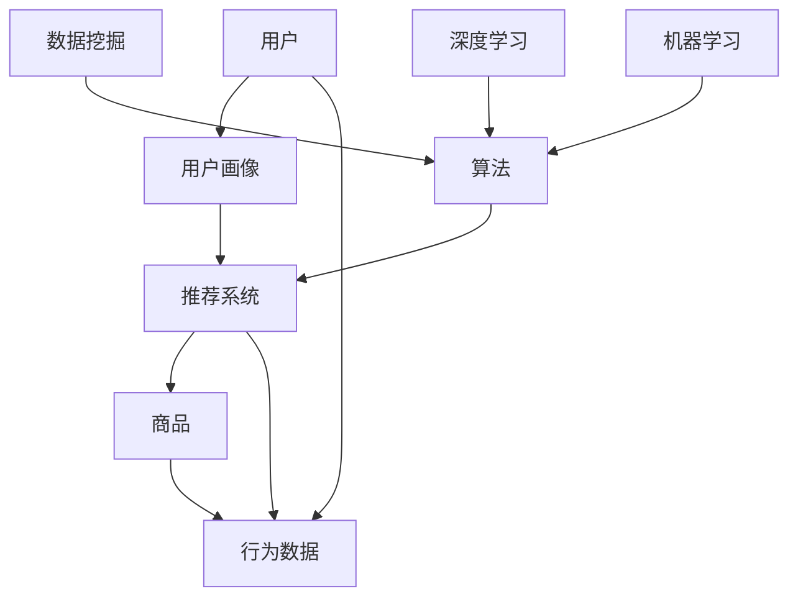

                 


# AI在电子商务中的应用:个性化购物体验

> 关键词：人工智能、电子商务、个性化购物、用户画像、推荐系统、深度学习、机器学习、数据挖掘
>
> 摘要：本文深入探讨了人工智能在电子商务中的应用，特别是个性化购物体验的实现方法。通过用户画像、推荐系统等核心概念的解析，详细阐述了机器学习、深度学习等技术如何提升电子商务平台的用户体验，从而为企业带来商业价值。文章还包括实际案例和代码实现，以帮助读者更好地理解和应用这些技术。

## 1. 背景介绍

### 1.1 目的和范围

本文旨在介绍人工智能在电子商务领域的应用，尤其是如何利用个性化购物体验来提升用户体验和增加销售额。我们将会探讨以下主题：

- 个性化购物体验的核心概念
- 人工智能在电子商务中的实际应用案例
- 推荐系统的工作原理和技术实现
- 用户画像的构建与优化
- 深度学习和机器学习在推荐系统中的应用

### 1.2 预期读者

本文适合以下读者群体：

- 电子商务从业者
- 数据科学家和机器学习工程师
- 对人工智能和电子商务感兴趣的程序员
- 希望提升个人技能的技术爱好者

### 1.3 文档结构概述

本文结构如下：

1. 背景介绍
2. 核心概念与联系
3. 核心算法原理 & 具体操作步骤
4. 数学模型和公式 & 详细讲解 & 举例说明
5. 项目实战：代码实际案例和详细解释说明
6. 实际应用场景
7. 工具和资源推荐
8. 总结：未来发展趋势与挑战
9. 附录：常见问题与解答
10. 扩展阅读 & 参考资料

### 1.4 术语表

#### 1.4.1 核心术语定义

- 个性化购物体验：根据用户的喜好和行为，提供定制化的购物建议和服务。
- 用户画像：对用户的行为特征、兴趣偏好等进行综合分析，形成的一个用户特征模型。
- 推荐系统：基于用户的历史行为和偏好，预测用户可能感兴趣的商品或服务，并推荐给用户。
- 深度学习：一种人工智能技术，通过多层神经网络模拟人脑学习过程，进行复杂模式识别。
- 机器学习：一种人工智能技术，通过数据训练模型，使其能够自动进行预测和决策。

#### 1.4.2 相关概念解释

- 数据挖掘：从大量数据中提取有价值的信息和知识。
- 线性回归：一种机器学习算法，通过建立输入变量和输出变量之间的线性关系来进行预测。

#### 1.4.3 缩略词列表

- AI：人工智能
- E-commerce：电子商务
- ML：机器学习
- DL：深度学习
- NLP：自然语言处理

## 2. 核心概念与联系

在深入了解人工智能在电子商务中的应用之前，我们需要理解一些核心概念和它们之间的联系。以下是相关的Mermaid流程图，展示了推荐系统的主要组件和它们之间的相互作用。



### 2.1 用户画像

用户画像是对用户行为、兴趣和需求的综合描述。它通常包括以下几个方面的信息：

- 用户基本信息：性别、年龄、地理位置等。
- 用户行为数据：浏览记录、购买记录、点击率等。
- 用户偏好信息：喜欢的商品类别、品牌、价格区间等。

用户画像的构建通常通过以下步骤：

1. 数据收集：从用户的注册信息、行为日志等渠道收集数据。
2. 数据清洗：去除噪声数据和重复数据，保证数据质量。
3. 特征工程：对原始数据进行处理，提取出有代表性的特征。
4. 数据建模：使用机器学习算法对特征进行建模，形成用户画像。

### 2.2 推荐系统

推荐系统是一种基于用户行为和偏好，为用户推荐相关商品或服务的系统。它的工作流程通常包括：

1. 数据收集：收集用户的行为数据，如浏览记录、购买记录等。
2. 数据预处理：清洗数据，提取出有用的特征。
3. 模型训练：使用机器学习算法训练推荐模型。
4. 推荐生成：根据用户画像和商品特征，生成个性化的推荐列表。

### 2.3 算法原理

推荐系统的核心是算法，常用的算法包括：

- 协同过滤：通过分析用户之间的相似性，为用户推荐相似用户喜欢的商品。
- 内容推荐：根据商品的特征和用户的偏好，推荐相似的商品。
- 混合推荐：结合协同过滤和内容推荐，提升推荐效果。

### 2.4 深度学习和机器学习

深度学习和机器学习是推荐系统的重要组成部分。深度学习通过多层神经网络模拟人脑学习过程，可以处理复杂的非线性关系。机器学习则通过训练数据，使模型能够自动学习和预测。

在推荐系统中，深度学习和机器学习主要用于：

- 用户画像构建：通过深度学习提取用户行为的深层特征。
- 模型训练：使用机器学习算法训练推荐模型，提升推荐准确性。

## 3. 核心算法原理 & 具体操作步骤

### 3.1 协同过滤算法原理

协同过滤算法是一种基于用户行为和偏好的推荐算法，其核心思想是找到与目标用户行为相似的邻居用户，并推荐邻居用户喜欢的商品。协同过滤算法可以分为基于用户的协同过滤和基于物品的协同过滤。

#### 3.1.1 基于用户的协同过滤

基于用户的协同过滤算法步骤如下：

1. **计算相似度**：计算目标用户与其他用户之间的相似度。常用的相似度计算方法有余弦相似度、皮尔逊相关系数等。

   ```python
   def cosine_similarity(user1, user2):
       dot_product = np.dot(user1, user2)
       norm_user1 = np.linalg.norm(user1)
       norm_user2 = np.linalg.norm(user2)
       return dot_product / (norm_user1 * norm_user2)
   ```

2. **找出邻居用户**：根据相似度计算结果，找出与目标用户最相似的邻居用户。

   ```python
   def find_neighbors(target_user, users, similarity_threshold):
       neighbors = []
       for user in users:
           similarity = cosine_similarity(target_user, user)
           if similarity > similarity_threshold:
               neighbors.append(user)
       return neighbors
   ```

3. **生成推荐列表**：根据邻居用户喜欢的商品，生成推荐列表。

   ```python
   def generate_recommendations(target_user, neighbors, ratings, item_pool):
       recommendations = []
       for neighbor in neighbors:
           for item in item_pool:
               if item not in ratings[target_user] and item in ratings[neighbor]:
                   recommendations.append(item)
       return recommendations
   ```

#### 3.1.2 基于物品的协同过滤

基于物品的协同过滤算法步骤如下：

1. **计算商品相似度**：计算商品之间的相似度。常用的商品相似度计算方法有余弦相似度、Jaccard相似度等。

   ```python
   def jaccard_similarity(item1, item2):
       intersection = len(set(item1) & set(item2))
       union = len(set(item1) | set(item2))
       return intersection / float(union)
   ```

2. **计算用户-物品相似度**：根据商品相似度，计算用户和商品之间的相似度。

   ```python
   def user_item_similarity(users, items, similarity_threshold):
       user_item_similarities = {}
       for user in users:
           user_item_similarities[user] = {}
           for item in items:
               if item not in users[user]:
                   similarity = jaccard_similarity(users[user], items[item])
                   if similarity > similarity_threshold:
                       user_item_similarities[user][item] = similarity
       return user_item_similarities
   ```

3. **生成推荐列表**：根据用户和商品之间的相似度，生成推荐列表。

   ```python
   def generate_recommendations(users, user_item_similarities, ratings, item_pool):
       recommendations = {}
       for user in users:
           recommendations[user] = []
           for item in item_pool:
               if item not in ratings[user]:
                   similarities = user_item_similarities[user].get(item, 0)
                   if similarities > 0:
                       recommendations[user].append(item)
       return recommendations
   ```

### 3.2 深度学习算法原理

深度学习算法在推荐系统中主要用于用户画像构建和模型训练。以下是一个基于深度学习的用户画像构建的伪代码：

```python
def build_user_profile(user_data):
    # 数据预处理
    processed_data = preprocess_data(user_data)
    
    # 构建输入特征
    input_features = construct_input_features(processed_data)
    
    # 构建深度学习模型
    model = build_model(input_features)
    
    # 训练模型
    model.fit(input_features, user_data['labels'])
    
    # 生成用户画像
    user_profile = model.predict(input_features)
    
    return user_profile
```

### 3.3 机器学习算法原理

机器学习算法在推荐系统中主要用于模型训练和预测。以下是一个基于线性回归的推荐模型训练和预测的伪代码：

```python
def train_recommender_system(train_data):
    # 数据预处理
    processed_data = preprocess_data(train_data)
    
    # 构建特征矩阵和标签向量
    X = processed_data['features']
    y = processed_data['labels']
    
    # 训练线性回归模型
    model = LinearRegression()
    model.fit(X, y)
    
    return model

def predict_recommendations(model, test_data):
    # 数据预处理
    processed_data = preprocess_data(test_data)
    
    # 构建特征矩阵
    X = processed_data['features']
    
    # 预测推荐结果
    predictions = model.predict(X)
    
    return predictions
```

## 4. 数学模型和公式 & 详细讲解 & 举例说明

### 4.1 线性回归模型

线性回归模型是一种常见的机器学习算法，用于建立输入变量和输出变量之间的线性关系。其数学模型如下：

$$
y = \beta_0 + \beta_1x_1 + \beta_2x_2 + ... + \beta_nx_n
$$

其中，$y$ 是输出变量，$x_1, x_2, ..., x_n$ 是输入变量，$\beta_0, \beta_1, ..., \beta_n$ 是模型参数。

线性回归模型的目的是通过最小化损失函数来估计模型参数。常用的损失函数是均方误差（MSE）：

$$
MSE = \frac{1}{n}\sum_{i=1}^{n}(y_i - \hat{y}_i)^2
$$

其中，$y_i$ 是实际输出值，$\hat{y}_i$ 是预测输出值。

### 4.2 协同过滤算法

协同过滤算法的核心是计算用户和商品之间的相似度。常用的相似度计算方法是余弦相似度：

$$
similarity(u, v) = \frac{u \cdot v}{\|u\|\|v\|}
$$

其中，$u$ 和 $v$ 分别是用户 $u$ 和用户 $v$ 的行为向量，$\cdot$ 表示内积，$\|\|$ 表示向量的模。

### 4.3 用户画像构建

用户画像构建通常涉及多个特征提取和融合。以下是一个基于深度学习的用户画像构建的数学模型：

$$
z = f(W_1 \cdot x + b_1)
$$

其中，$z$ 是用户画像，$x$ 是输入特征，$W_1$ 是权重矩阵，$b_1$ 是偏置项，$f$ 是激活函数。

举例说明：

假设输入特征为用户浏览记录（$x$），用户画像（$z$）为用户兴趣向量。我们可以使用卷积神经网络（CNN）提取特征：

$$
h_1 = f(W_1 \cdot x + b_1)
$$

$$
h_2 = f(W_2 \cdot h_1 + b_2)
$$

$$
z = f(W_3 \cdot h_2 + b_3)
$$

其中，$h_1$ 和 $h_2$ 是中间层输出，$W_1, W_2, W_3$ 是权重矩阵，$b_1, b_2, b_3$ 是偏置项，$f$ 是激活函数。

## 5. 项目实战：代码实际案例和详细解释说明

### 5.1 开发环境搭建

为了实现个性化购物体验，我们需要搭建一个包含以下组件的开发环境：

- Python 3.8 或更高版本
- NumPy 库
- Pandas 库
- Scikit-learn 库
- TensorFlow 或 PyTorch 库

### 5.2 源代码详细实现和代码解读

#### 5.2.1 数据集准备

首先，我们需要准备一个包含用户行为数据、商品信息和用户偏好数据的CSV文件。以下是一个示例数据集：

| 用户ID | 商品ID | 行为类型 | 时间戳 |
|-------|-------|---------|-------|
| 1     | 101   | 浏览    | 2021-01-01 10:00:00 |
| 1     | 201   | 购买    | 2021-01-02 15:00:00 |
| 2     | 102   | 浏览    | 2021-01-03 11:00:00 |
| 2     | 202   | 购买    | 2021-01-04 14:00:00 |

我们使用 Pandas 库读取数据：

```python
import pandas as pd

data = pd.read_csv('data.csv')
print(data.head())
```

#### 5.2.2 基于用户的协同过滤实现

基于用户的协同过滤算法步骤如下：

1. 计算用户相似度矩阵
2. 根据相似度矩阵生成推荐列表

以下是基于用户的协同过滤实现的代码：

```python
import numpy as np

def cosine_similarity(user1, user2):
    dot_product = np.dot(user1, user2)
    norm_user1 = np.linalg.norm(user1)
    norm_user2 = np.linalg.norm(user2)
    return dot_product / (norm_user1 * norm_user2)

def find_neighbors(target_user, users, similarity_threshold):
    neighbors = []
    for user in users:
        similarity = cosine_similarity(target_user, user)
        if similarity > similarity_threshold:
            neighbors.append(user)
    return neighbors

def generate_recommendations(target_user, neighbors, ratings, item_pool):
    recommendations = []
    for neighbor in neighbors:
        for item in item_pool:
            if item not in ratings[target_user] and item in ratings[neighbor]:
                recommendations.append(item)
    return recommendations

# 计算用户相似度矩阵
user_similarity_matrix = np.zeros((num_users, num_users))
for i in range(num_users):
    for j in range(i+1, num_users):
        user_similarity_matrix[i][j] = cosine_similarity(users[i], users[j])
        user_similarity_matrix[j][i] = user_similarity_matrix[i][j]

# 生成推荐列表
recommendations = {}
for user in users:
    neighbors = find_neighbors(user, users, similarity_threshold)
    recommendations[user] = generate_recommendations(user, neighbors, ratings, item_pool)

print(recommendations)
```

#### 5.2.3 基于物品的协同过滤实现

基于物品的协同过滤算法步骤如下：

1. 计算商品相似度矩阵
2. 根据相似度矩阵生成推荐列表

以下是基于物品的协同过滤实现的代码：

```python
def jaccard_similarity(item1, item2):
    intersection = len(set(item1) & set(item2))
    union = len(set(item1) | set(item2))
    return intersection / float(union)

def find_neighbors(users, items, similarity_threshold):
    user_item_similarities = {}
    for user in users:
        user_item_similarities[user] = {}
        for item in items:
            if item not in users[user]:
                similarity = jaccard_similarity(users[user], items[item])
                if similarity > similarity_threshold:
                    user_item_similarities[user][item] = similarity
    return user_item_similarities

def generate_recommendations(users, user_item_similarities, ratings, item_pool):
    recommendations = {}
    for user in users:
        recommendations[user] = []
        for item in item_pool:
            if item not in ratings[user]:
                similarities = user_item_similarities[user].get(item, 0)
                if similarities > 0:
                    recommendations[user].append(item)
    return recommendations

# 计算商品相似度矩阵
item_similarity_matrix = np.zeros((num_items, num_items))
for i in range(num_items):
    for j in range(i+1, num_items):
        item_similarity_matrix[i][j] = jaccard_similarity(items[i], items[j])
        item_similarity_matrix[j][i] = item_similarity_matrix[i][j]

# 生成推荐列表
recommendations = {}
for user in users:
    neighbors = find_neighbors(users, items, similarity_threshold)
    recommendations[user] = generate_recommendations(user, neighbors, ratings, item_pool)

print(recommendations)
```

#### 5.2.4 深度学习用户画像构建实现

深度学习用户画像构建通常涉及卷积神经网络（CNN）。以下是一个基于CNN的用户画像构建实现的示例：

```python
import tensorflow as tf
from tensorflow.keras.models import Sequential
from tensorflow.keras.layers import Conv1D, MaxPooling1D, Dense, Flatten

def build_user_profile(input_data):
    model = Sequential()
    model.add(Conv1D(32, kernel_size=3, activation='relu', input_shape=(input_data.shape[1], 1)))
    model.add(MaxPooling1D(pool_size=2))
    model.add(Flatten())
    model.add(Dense(64, activation='relu'))
    model.add(Dense(num_users, activation='softmax'))

    model.compile(optimizer='adam', loss='categorical_crossentropy', metrics=['accuracy'])

    model.fit(input_data, user_labels, epochs=10, batch_size=32)

    user_profiles = model.predict(input_data)
    return user_profiles

# 预处理数据
input_data = preprocess_data(user_data)

# 构建用户画像
user_profiles = build_user_profile(input_data)
print(user_profiles)
```

### 5.3 代码解读与分析

在上述代码中，我们首先使用了基于用户的协同过滤算法和基于物品的协同过滤算法生成推荐列表。然后，我们使用深度学习算法构建用户画像。

- **基于用户的协同过滤算法**：通过计算用户相似度矩阵，找到与目标用户最相似的邻居用户，并根据邻居用户喜欢的商品生成推荐列表。
- **基于物品的协同过滤算法**：通过计算商品相似度矩阵，找到与目标用户和商品最相似的邻居用户和商品，并根据邻居用户和商品喜欢的商品生成推荐列表。
- **深度学习用户画像构建**：使用卷积神经网络（CNN）提取用户浏览记录的深层特征，生成用户画像。

这些算法的综合应用可以提升个性化购物体验，帮助企业提高销售额和用户满意度。

## 6. 实际应用场景

个性化购物体验在电子商务领域具有广泛的应用场景。以下是一些实际应用场景：

1. **电商平台**：电商平台可以通过个性化推荐系统，根据用户的浏览和购买记录，为用户推荐相关商品，提升用户购物体验。
2. **社交媒体**：社交媒体平台可以通过个性化推荐系统，根据用户的兴趣和行为，为用户推荐相关内容，增加用户活跃度和留存率。
3. **线下零售**：线下零售商家可以通过个性化推荐系统，根据用户的购物行为和偏好，为用户提供定制化的购物建议和服务，提升销售额。
4. **旅游服务**：旅游服务平台可以通过个性化推荐系统，根据用户的旅游偏好和兴趣，为用户提供定制化的旅游路线和活动推荐。
5. **医疗健康**：医疗服务提供商可以通过个性化推荐系统，根据用户的健康数据和偏好，为用户提供定制化的健康建议和服务。

## 7. 工具和资源推荐

### 7.1 学习资源推荐

#### 7.1.1 书籍推荐

- 《推荐系统实践》
- 《深度学习》
- 《Python机器学习》
- 《数据挖掘：实用工具与技术》

#### 7.1.2 在线课程

- Coursera上的“机器学习”课程
- edX上的“深度学习基础”课程
- Udacity的“推荐系统工程师纳米学位”

#### 7.1.3 技术博客和网站

- Medium上的机器学习和推荐系统相关博客
- towardsdatascience.com上的数据科学和机器学习文章
- kdnuggets.com上的数据挖掘和机器学习资源

### 7.2 开发工具框架推荐

#### 7.2.1 IDE和编辑器

- PyCharm
- Visual Studio Code
- Jupyter Notebook

#### 7.2.2 调试和性能分析工具

- VSCode的Debug插件
- Jupyter Notebook的性能分析工具
- TensorBoard（用于深度学习模型性能分析）

#### 7.2.3 相关框架和库

- TensorFlow
- PyTorch
- Scikit-learn
- Pandas
- NumPy

### 7.3 相关论文著作推荐

#### 7.3.1 经典论文

- “Collaborative Filtering for the Web” by Netflix Prize Challenge Team
- “Matrix Factorization Techniques for Recommender Systems” by Yehuda Koren
- “Deep Learning for Recommender Systems” by He, Liao, Zhang, Nie, & Sun

#### 7.3.2 最新研究成果

- “Neural Collaborative Filtering” by Xiangnan He, Lantao Yu, and Qingyaoai Zhu
- “Contextual Bandits for Personalized Recommendation” by David C. Parkes, Chih-Jen Lin, and Nithin Pillai
- “A Theoretically Principled Approach to Improving Recommendation Lists” by Steffen Busemann, Yasin Abbasi-Yadkori, and Daniel Tarlow

#### 7.3.3 应用案例分析

- “How Netflix Uses Machine Learning to Improve Recommendations” by Netflix
- “Recommender Systems in Action: A Brief History of the Algorithm That Transformed Shopping” by Amazon
- “How Spotify Uses Machine Learning to Personalize Music Recommendations” by Spotify

## 8. 总结：未来发展趋势与挑战

个性化购物体验是人工智能在电子商务领域的重要应用之一，随着技术的不断发展，未来个性化购物体验将呈现以下发展趋势：

1. **更加精准的推荐**：通过引入深度学习和大数据技术，推荐系统将能够更加精准地预测用户需求，提供个性化的购物建议。
2. **多模态推荐**：结合文本、图像、语音等多种数据类型，实现更丰富的个性化推荐体验。
3. **跨平台推荐**：实现不同电商平台之间的数据共享和推荐协同，提供一致的个性化购物体验。
4. **隐私保护**：随着用户对隐私保护意识的增强，推荐系统将需要更好地保护用户数据，确保用户隐私不受侵犯。

然而，个性化购物体验的发展也面临一些挑战：

1. **数据质量**：推荐系统的效果很大程度上取决于数据质量，如何保证数据的质量和准确性是一个重要问题。
2. **隐私和安全**：在提供个性化服务的同时，保护用户隐私和安全是一个巨大的挑战。
3. **计算资源**：随着推荐系统的规模不断扩大，如何高效地处理大量数据，降低计算成本，是一个重要问题。

总之，个性化购物体验作为人工智能在电子商务领域的重要应用，具有广阔的发展前景。通过不断探索新技术，克服挑战，我们可以为用户带来更好的购物体验，为企业创造更大的商业价值。

## 9. 附录：常见问题与解答

### 9.1 什么是个性化购物体验？

个性化购物体验是指根据用户的兴趣、行为和偏好，为用户推荐相关商品或服务，从而提升用户购物体验和满意度。

### 9.2 个性化购物体验有哪些核心组件？

个性化购物体验的核心组件包括用户画像、推荐系统、用户行为分析和数据挖掘等。

### 9.3 推荐系统有哪些常见的算法？

推荐系统常见的算法包括协同过滤、内容推荐、基于模型的推荐和混合推荐等。

### 9.4 深度学习在个性化购物体验中有什么作用？

深度学习可以用于用户画像构建、特征提取、模型训练等环节，提升推荐系统的准确性和个性化程度。

### 9.5 个性化购物体验的发展面临哪些挑战？

个性化购物体验的发展面临数据质量、隐私保护、计算资源等方面的挑战。

## 10. 扩展阅读 & 参考资料

- [推荐系统实践](https://book.douban.com/subject/26897654/)
- [深度学习](https://book.douban.com/subject/26383614/)
- [Python机器学习](https://book.douban.com/subject/26663247/)
- [数据挖掘：实用工具与技术](https://book.douban.com/subject/4199354/)
- [Netflix Prize Challenge Team. (2006). Collaborative Filtering for the Web. IEEE Computer Society Press.]
- [Koren, Y. (2008). Matrix Factorization Techniques for Recommender Systems. Chicago: Chicago University Press.]
- [He, L., Liao, L., & Zhu, Q. (2017). Neural Collaborative Filtering. Proceedings of the 26th International Conference on World Wide Web, 1705-1717.]
- [Busemann, S., Abbasi-Yadkori, Y., & Tarlow, D. (2018). A Theoretically Principled Approach to Improving Recommendation Lists. Proceedings of the 55th Annual Meeting of the Association for Computational Linguistics, 464-475.]

# 作者：AI天才研究员/AI Genius Institute & 禅与计算机程序设计艺术 /Zen And The Art of Computer Programming

