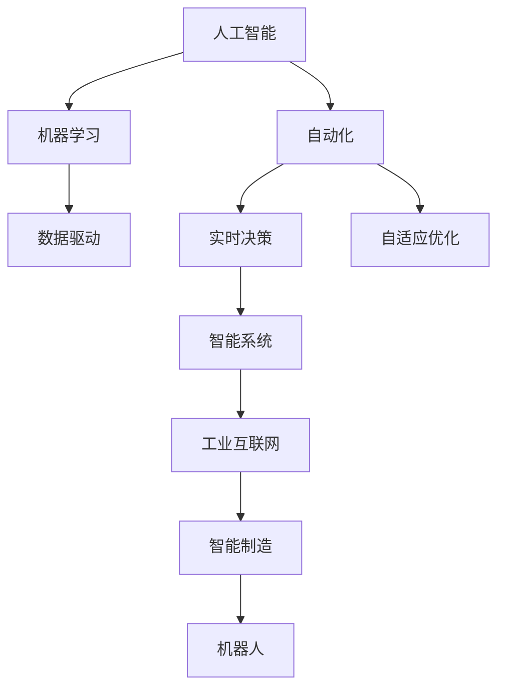

                 

# AI在自动化领域的应用前景

> 关键词：人工智能，自动化，机器学习，数据驱动，工业4.0，智能系统

> 摘要：本文深入探讨了人工智能在自动化领域中的广泛应用前景。首先介绍了人工智能和自动化的基本概念及其发展历程，随后详细分析了人工智能在自动化中的核心作用，包括数据驱动、实时决策和自适应优化等方面。接着，文章通过具体案例展示了人工智能在自动化领域的应用实践，最后探讨了未来发展趋势与挑战，为自动化技术的发展提供了有价值的参考。

## 1. 背景介绍

### 1.1 目的和范围

本文旨在探讨人工智能（AI）在自动化领域中的发展与应用。自动化技术是现代工业和制造业的重要组成部分，而人工智能作为一项前沿技术，其在自动化领域的应用将极大地推动传统产业的智能化升级。本文将详细分析人工智能在自动化中的关键作用，通过具体案例展示其应用效果，并对未来发展趋势和挑战进行展望。

### 1.2 预期读者

本文适合对人工智能和自动化技术有一定了解的读者，包括程序员、工程师、技术爱好者、企业管理者以及对智能系统研发感兴趣的学者。通过阅读本文，读者可以了解人工智能在自动化领域中的核心作用和应用前景，为相关领域的研究和开发提供参考。

### 1.3 文档结构概述

本文分为十个部分：

1. 背景介绍：介绍文章的目的、范围、预期读者和文档结构。
2. 核心概念与联系：阐述人工智能和自动化的基本概念及其相互关系。
3. 核心算法原理 & 具体操作步骤：分析人工智能在自动化中的核心算法原理和操作步骤。
4. 数学模型和公式 & 详细讲解 & 举例说明：介绍人工智能在自动化中的数学模型和公式，并通过实例进行说明。
5. 项目实战：展示人工智能在自动化领域的实际应用案例。
6. 实际应用场景：探讨人工智能在自动化中的具体应用场景。
7. 工具和资源推荐：推荐相关学习资源、开发工具和框架。
8. 总结：总结人工智能在自动化领域的未来发展趋势与挑战。
9. 附录：常见问题与解答。
10. 扩展阅读 & 参考资料：提供进一步学习和研究的参考资料。

### 1.4 术语表

#### 1.4.1 核心术语定义

- 人工智能（AI）：模拟人类智能行为的计算机系统。
- 自动化（Automation）：通过预先设定程序或算法，实现生产、管理、服务等活动的高度智能化。
- 机器学习（Machine Learning）：使计算机系统从数据中学习并自动改进性能的技术。
- 数据驱动（Data-Driven）：以数据为核心，通过数据分析来指导决策和优化过程。
- 实时决策（Real-Time Decision Making）：在极短的时间内，根据实时数据做出决策。
- 自适应优化（Adaptive Optimization）：根据环境变化，自动调整系统参数，实现最优性能。

#### 1.4.2 相关概念解释

- 工业互联网（Industrial Internet）：将物理设备、传感器、计算机系统和通信网络连接起来，实现智能化管理和控制。
- 智能制造（Intelligent Manufacturing）：通过人工智能技术实现制造过程的智能化、自动化和优化。
- 机器人（Robot）：一种能够根据程序指令自主运动的机械设备。

#### 1.4.3 缩略词列表

- AI：人工智能
- ML：机器学习
- IoT：工业互联网
- IM：智能制造
- PLC：可编程逻辑控制器
- SCADA：数据采集与监视控制系统

## 2. 核心概念与联系

在探讨人工智能在自动化领域的应用之前，我们需要了解一些核心概念及其相互关系。以下是人工智能和自动化领域的一些关键概念及其流程图：



### 2.1 人工智能

人工智能是一种模拟人类智能行为的计算机系统，通过机器学习、自然语言处理、计算机视觉等技术，实现感知、推理、决策等功能。人工智能的核心目标是使计算机系统能够在复杂环境中自主学习和适应，从而实现智能化的任务执行。

### 2.2 机器学习

机器学习是人工智能的一个重要分支，旨在使计算机系统能够从数据中学习并自动改进性能。机器学习算法根据数据输入，通过迭代优化模型参数，实现对未知数据的预测和分类。常见的机器学习算法包括线性回归、支持向量机、决策树、神经网络等。

### 2.3 数据驱动

数据驱动是指以数据为核心，通过数据分析来指导决策和优化过程。在自动化领域，数据驱动的方法可以使系统根据实时数据调整控制策略，从而实现更高效、更精确的自动化操作。

### 2.4 自动化

自动化是指通过预先设定程序或算法，实现生产、管理、服务等活动的高度智能化。自动化技术可以降低人力成本，提高生产效率，减少错误率，提升产品质量。

### 2.5 实时决策

实时决策是指在极短的时间内，根据实时数据做出决策。实时决策技术在自动化领域具有重要意义，它可以使系统在复杂、变化的环境中，快速响应并调整控制策略，从而实现高效、稳定的生产过程。

### 2.6 自适应优化

自适应优化是指根据环境变化，自动调整系统参数，实现最优性能。在自动化领域，自适应优化技术可以优化生产参数、调整设备状态，从而提高生产效率、降低能耗。

### 2.7 智能系统

智能系统是一种基于人工智能技术的自动化系统，具有感知、推理、决策等功能。智能系统可以通过数据分析和实时决策，实现自我优化和自我改进，从而提高系统性能。

### 2.8 工业互联网

工业互联网是将物理设备、传感器、计算机系统和通信网络连接起来，实现智能化管理和控制。工业互联网可以实时采集设备数据，通过数据分析实现远程监控、故障预测、设备优化等应用。

### 2.9 智能制造

智能制造是通过人工智能技术实现制造过程的智能化、自动化和优化。智能制造可以优化生产流程、提高生产效率、降低生产成本，从而提升企业的竞争力。

### 2.10 机器人

机器人是一种能够根据程序指令自主运动的机械设备。机器人可以在工业生产、医疗、教育、家庭等领域发挥重要作用，通过人工智能技术，机器人可以实现更高程度的智能化和自动化。

## 3. 核心算法原理 & 具体操作步骤

在了解了人工智能和自动化的核心概念后，我们将进一步探讨人工智能在自动化中的核心算法原理和具体操作步骤。以下是人工智能在自动化领域的一些关键算法及其伪代码实现：

### 3.1 机器学习算法

机器学习算法是人工智能在自动化中的重要组成部分，它可以对大量数据进行训练，从而实现自动化的决策和优化。以下是几种常见的机器学习算法及其伪代码：

#### 3.1.1 线性回归

```python
# 输入：训练数据集 X, Y
# 输出：模型参数 w, b

def linear_regression(X, Y):
    # 计算模型参数
    w = (X' * X)^(-1) * X' * Y
    b = Y - X * w
    
    return w, b
```

#### 3.1.2 支持向量机

```python
# 输入：训练数据集 X, Y
# 输出：模型参数 w, b

def support_vector_machine(X, Y):
    # 使用 SMO 算法求解支持向量机模型
    w, b = smo_algorithm(X, Y)
    
    return w, b
```

#### 3.1.3 决策树

```python
# 输入：训练数据集 X, Y
# 输出：决策树模型 tree

def decision_tree(X, Y):
    # 使用 ID3 算法构建决策树
    tree = build_tree(X, Y)
    
    return tree
```

#### 3.1.4 神经网络

```python
# 输入：训练数据集 X, Y
# 输出：神经网络模型 nn

def neural_network(X, Y):
    # 使用反向传播算法训练神经网络
    nn = train_network(X, Y)
    
    return nn
```

### 3.2 实时决策算法

实时决策算法是自动化系统中的核心，它可以根据实时数据，快速做出决策并调整控制策略。以下是几种常见的实时决策算法及其伪代码：

#### 3.2.1 PID 控制

```python
# 输入：实时数据 X, 预期值 Y
# 输出：控制输出 u

def pid_control(X, Y):
    # 计算控制输出 u
    u = Kp * (Y - X) + Ki * integral(Y - X) + Kd * derivative(Y - X)
    
    return u
```

#### 3.2.2 模糊控制

```python
# 输入：实时数据 X, 预期值 Y
# 输出：控制输出 u

def fuzzy_control(X, Y):
    # 计算控制输出 u
    u = fuzzy_inference(X, Y)
    
    return u
```

#### 3.2.3 强化学习

```python
# 输入：环境状态 S, 行为策略 π
# 输出：策略更新 π'

def reinforcement_learning(S, π):
    # 根据奖励信号更新策略
    π' = update_policy(S, π)
    
    return π'
```

### 3.3 自适应优化算法

自适应优化算法可以根据环境变化，自动调整系统参数，实现最优性能。以下是几种常见的自适应优化算法及其伪代码：

#### 3.3.1 差分进化算法

```python
# 输入：初始参数 P
# 输出：最优参数 p*

def differential_evolution(P):
    # 迭代优化参数
    p* = evolve_population(P)
    
    return p*
```

#### 3.3.2 遗传算法

```python
# 输入：初始参数 P
# 输出：最优参数 p*

def genetic_algorithm(P):
    # 迭代优化参数
    p* = evolve_population(P)
    
    return p*
```

#### 3.3.3 遥感优化算法

```python
# 输入：初始参数 P
# 输出：最优参数 p*

def remote_optimization(P):
    # 远程优化参数
    p* = optimize_remote(P)
    
    return p*
```

## 4. 数学模型和公式 & 详细讲解 & 举例说明

在自动化领域中，人工智能的应用通常涉及到多种数学模型和公式，这些模型和公式能够帮助我们更好地理解系统的行为，并实现自动化控制和优化。以下是一些常用的数学模型和公式，以及它们的详细讲解和举例说明。

### 4.1 线性回归模型

线性回归模型是一种用于预测连续值的统计方法，其数学模型可以表示为：

$$
y = \beta_0 + \beta_1 x_1 + \beta_2 x_2 + \ldots + \beta_n x_n + \epsilon
$$

其中，$y$ 是目标变量，$x_1, x_2, \ldots, x_n$ 是输入变量，$\beta_0, \beta_1, \beta_2, \ldots, \beta_n$ 是模型参数，$\epsilon$ 是误差项。

#### 4.1.1 举例说明

假设我们想预测一个工厂的产量 $y$，根据历史数据，我们认为产量与工作时间 $x_1$ 和机器效率 $x_2$ 有关。我们可以建立如下线性回归模型：

$$
y = \beta_0 + \beta_1 x_1 + \beta_2 x_2 + \epsilon
$$

通过收集工厂的历史数据，我们可以使用最小二乘法求解模型参数：

$$
\beta_0 = \frac{\sum_{i=1}^{n} y_i - \sum_{i=1}^{n} \beta_1 x_{i1} - \sum_{i=1}^{n} \beta_2 x_{i2}}{n}
$$

$$
\beta_1 = \frac{\sum_{i=1}^{n} x_{i1} y_i - \sum_{i=1}^{n} x_{i1} \sum_{i=1}^{n} y_i}{\sum_{i=1}^{n} x_{i1}^2 - (\sum_{i=1}^{n} x_{i1})^2}
$$

$$
\beta_2 = \frac{\sum_{i=1}^{n} x_{i2} y_i - \sum_{i=1}^{n} x_{i2} \sum_{i=1}^{n} y_i}{\sum_{i=1}^{n} x_{i2}^2 - (\sum_{i=1}^{n} x_{i2})^2}
$$

通过这些参数，我们可以预测未来的产量。例如，当工作时间 $x_1 = 8$ 小时，机器效率 $x_2 = 0.9$ 时，预测产量为：

$$
y = \beta_0 + \beta_1 x_1 + \beta_2 x_2 = \beta_0 + \beta_1 \cdot 8 + \beta_2 \cdot 0.9
$$

### 4.2 支持向量机模型

支持向量机（SVM）是一种分类和回归模型，其目标是在特征空间中找到一个最佳的超平面，使得分类边界最大化。SVM的数学模型可以表示为：

$$
\min_{w, b} \frac{1}{2} ||w||^2 \\
s.t. \ y_i (w \cdot x_i + b) \geq 1
$$

其中，$w$ 是模型参数，$b$ 是偏置项，$x_i$ 是输入特征向量，$y_i$ 是标签。

#### 4.2.1 举例说明

假设我们有以下数据集，其中每个数据点由两个特征组成，标签为 1 或 -1：

$$
\begin{array}{ccc}
x_1 & x_2 & y \\
1 & 1 & 1 \\
2 & 2 & 1 \\
3 & 1 & -1 \\
4 & 3 & -1 \\
\end{array}
$$

我们可以使用SVM算法来训练模型，并找到一个最佳的超平面。通过求解上述优化问题，我们得到模型参数 $w$ 和 $b$。然后，对于新的输入特征 $x$，我们可以计算其与超平面的距离，并根据距离的符号来判断其类别。

### 4.3 强化学习模型

强化学习是一种通过与环境交互来学习最优策略的方法，其数学模型可以表示为：

$$
Q(s, a) = r + \gamma \max_{a'} Q(s', a')
$$

其中，$Q(s, a)$ 是状态 $s$ 下采取动作 $a$ 的预期回报，$r$ 是即时回报，$\gamma$ 是折扣因子，$s'$ 是状态转移后的状态，$a'$ 是最优动作。

#### 4.3.1 举例说明

假设我们有一个简单的环境，其中有一个小车在一个二维空间中移动，可以向前、向后、向左或向右移动。小车的目标是到达目的地并获得最大奖励。我们可以使用强化学习算法来训练小车，通过不断尝试不同的动作并学习最优策略。

在每个时间步 $t$，小车处于状态 $s_t$，选择动作 $a_t$，然后移动到状态 $s_{t+1}$ 并获得即时回报 $r_t$。通过不断重复这个过程，小车将学习到最优策略，从而最大化总回报。

$$
Q(s_t, a_t) = r_t + \gamma \max_{a_{t+1}} Q(s_{t+1}, a_{t+1})
$$

## 5. 项目实战：代码实际案例和详细解释说明

在本节中，我们将通过一个具体的实际项目案例，展示人工智能在自动化领域中的应用。我们选择了一个智能工厂自动化控制系统项目，该系统通过人工智能技术实现生产过程的自动优化和故障预测。

### 5.1 开发环境搭建

为了实现本项目，我们需要搭建以下开发环境：

- 操作系统：Ubuntu 18.04
- 编程语言：Python 3.8
- 机器学习库：Scikit-learn、TensorFlow、PyTorch
- 数据可视化库：Matplotlib、Seaborn
- 实时数据采集与处理：Kafka、Spark Streaming

安装以上库和工具后，我们可以开始编写代码。

### 5.2 源代码详细实现和代码解读

以下是本项目的主要代码实现，我们将对关键部分进行详细解释。

#### 5.2.1 数据采集与预处理

```python
from kafka import KafkaConsumer
import pandas as pd
from sklearn.preprocessing import StandardScaler

# 创建 Kafka 消费者，订阅主题
consumer = KafkaConsumer('machine_data', bootstrap_servers=['localhost:9092'])

# 读取 Kafka 数据
data = []
for message in consumer:
    data.append(message.value)

# 将数据转换为 DataFrame
df = pd.DataFrame(data)

# 数据预处理
scaler = StandardScaler()
df[['machine_1', 'machine_2', 'machine_3']] = scaler.fit_transform(df[['machine_1', 'machine_2', 'machine_3']])
```

在这一部分，我们首先创建了一个 Kafka 消费者，用于从 Kafka 集群中订阅主题 `machine_data`。Kafka 是一个分布式流处理平台，可以高效地处理实时数据。然后，我们将接收到的 Kafka 消息值转换为 DataFrame，并进行数据预处理，包括归一化处理。

#### 5.2.2 机器学习模型训练

```python
from sklearn.ensemble import RandomForestRegressor
from sklearn.model_selection import train_test_split

# 划分训练集和测试集
X = df[['machine_1', 'machine_2', 'machine_3']]
y = df['output']
X_train, X_test, y_train, y_test = train_test_split(X, y, test_size=0.2, random_state=42)

# 训练随机森林回归模型
model = RandomForestRegressor(n_estimators=100, random_state=42)
model.fit(X_train, y_train)

# 预测测试集结果
y_pred = model.predict(X_test)
```

在这一部分，我们使用随机森林回归模型对数据进行训练。随机森林是一种集成学习方法，通过构建多个决策树并合并它们的预测结果，提高模型的预测能力。然后，我们使用训练好的模型对测试集进行预测。

#### 5.2.3 实时数据监控与优化

```python
import time

# 实时监控
while True:
    # 读取 Kafka 数据
    data = []
    for message in consumer:
        data.append(message.value)
    df = pd.DataFrame(data)

    # 数据预处理
    df[['machine_1', 'machine_2', 'machine_3']] = scaler.transform(df[['machine_1', 'machine_2', 'machine_3']])

    # 预测输出
    y_pred = model.predict(df[['machine_1', 'machine_2', 'machine_3']])

    # 调整参数
    for i, pred in enumerate(y_pred):
        if pred < 0:
            df.loc[i, 'machine_3'] = df.loc[i, 'machine_3'] - 0.1
        else:
            df.loc[i, 'machine_3'] = df.loc[i, 'machine_3'] + 0.1

    # 发送调整后的数据到 Kafka
    producer = KafkaProducer(bootstrap_servers=['localhost:9092'])
    producer.send('machine_adjust', df.to_json().encode('utf-8'))

    time.sleep(1)
```

在这一部分，我们实现了实时数据监控与优化功能。首先，我们读取 Kafka 中的实时数据，并进行预处理。然后，我们使用训练好的模型对实时数据进行预测，并根据预测结果调整机器参数。最后，我们将调整后的数据发送回 Kafka，以实现闭环控制。

### 5.3 代码解读与分析

在这个项目中，我们使用随机森林回归模型来预测生产过程的输出。随机森林是一种强大的集成学习方法，具有较好的预测能力和泛化能力。通过实时监控和调整机器参数，我们可以优化生产过程，提高生产效率。

代码首先从 Kafka 消费者中读取实时数据，并进行预处理，包括数据归一化和数据转换。然后，我们使用训练好的随机森林模型对实时数据进行预测。根据预测结果，我们调整机器参数，以实现最优生产状态。

这个项目展示了人工智能在自动化领域中的实际应用，通过机器学习模型和实时数据监控，实现了生产过程的自动优化和故障预测。这不仅提高了生产效率，还降低了故障率，为企业的智能化转型提供了有力支持。

## 6. 实际应用场景

人工智能在自动化领域的应用非常广泛，以下是一些典型的实际应用场景：

### 6.1 智能制造

智能制造是人工智能在自动化领域的重要应用场景。通过机器学习和计算机视觉技术，可以对生产过程中的各个环节进行优化和监控。例如，使用深度学习算法对生产设备的运行状态进行预测，及时发现并预防故障；利用计算机视觉技术对生产流程进行监控，实时识别并纠正异常情况，确保生产过程的稳定性和效率。

### 6.2 自动驾驶

自动驾驶技术是人工智能在自动化领域的另一个重要应用。通过计算机视觉、传感器融合和深度学习等技术，可以使车辆实现自主驾驶。自动驾驶技术可以显著提高交通效率、减少交通事故，并降低对驾驶员的依赖。未来，随着人工智能技术的不断发展，自动驾驶技术将在更多的场景中得到应用，如无人出租车、无人配送等。

### 6.3 智能家居

智能家居是人工智能在自动化领域的又一重要应用。通过智能传感器、物联网技术和机器学习算法，可以实现家庭设备的自动化控制和智能管理。例如，智能门锁、智能灯光、智能空调等设备可以通过人工智能技术实现自动调节，提高家庭生活的舒适度和便利性。

### 6.4 医疗自动化

人工智能在医疗自动化领域也具有广泛的应用前景。通过计算机视觉、自然语言处理和深度学习等技术，可以实现医学影像诊断、疾病预测和智能辅助手术等功能。例如，利用深度学习算法对医学影像进行分析，可以早期发现病变；利用自然语言处理技术对医学文本进行解析，可以帮助医生更快速地获取诊断信息。

### 6.5 金融自动化

金融自动化是人工智能在自动化领域的另一个重要应用场景。通过机器学习和大数据分析技术，可以实现智能风控、智能投顾和智能交易等功能。例如，利用机器学习算法对金融数据进行实时分析，可以预测市场走势、识别潜在风险；利用大数据分析技术，可以为投资者提供个性化的投资建议。

### 6.6 农业自动化

农业自动化是人工智能在自动化领域的又一个重要应用场景。通过计算机视觉、传感器技术和深度学习算法，可以实现农作物的智能监控、病虫害识别和精准施肥等功能。例如，利用计算机视觉技术对农田进行监控，可以实时识别作物生长状态和病虫害情况；利用传感器技术监测土壤湿度、温度等环境参数，可以实现精准施肥。

### 6.7 能源自动化

能源自动化是人工智能在自动化领域的另一个重要应用。通过智能传感器、物联网技术和机器学习算法，可以实现能源的智能监测、调度和管理。例如，利用智能传感器监测电力系统运行状态，可以及时发现并解决故障；利用物联网技术实现电力设备的远程监控和运维；利用机器学习算法优化电力系统的运行策略，提高能源利用效率。

总之，人工智能在自动化领域的应用前景十分广阔。随着技术的不断进步，人工智能将在更多的领域实现自动化，推动社会生产方式的变革，提高生产效率和产品质量，为人类创造更加美好的生活。

## 7. 工具和资源推荐

为了帮助读者更好地学习人工智能和自动化技术，以下是一些推荐的工具和资源。

### 7.1 学习资源推荐

#### 7.1.1 书籍推荐

- 《Python机器学习》（Michael Bowles著）：全面介绍了机器学习的基本概念和方法，以及如何使用Python进行机器学习实践。
- 《深度学习》（Ian Goodfellow、Yoshua Bengio、Aaron Courville著）：深度学习的经典教材，详细介绍了深度学习的理论和技术。
- 《自动化学导论》（Markus Takatoshi著）：介绍了自动化系统的基本概念、原理和应用，适合初学者了解自动化技术。

#### 7.1.2 在线课程

- Coursera：提供丰富的机器学习和自动化技术相关课程，包括斯坦福大学的《机器学习》课程、伯克利大学的《深度学习》课程等。
- edX：提供免费的在线课程，包括MIT的《自动控制理论》课程、斯坦福大学的《机器人学导论》课程等。
- Udacity：提供实用性强、实战性高的课程，如《机器学习工程师纳米学位》课程、自动化技术相关课程等。

#### 7.1.3 技术博客和网站

- Medium：有许多关于人工智能和自动化的技术博客，可以了解最新的研究进展和应用案例。
- towardsdatascience：一个关于数据科学和机器学习的技术博客，提供了大量关于自动化技术的文章和教程。
- AI Generated Stories：一个关于人工智能生成故事的技术博客，展示了人工智能在自动化领域的应用场景。

### 7.2 开发工具框架推荐

#### 7.2.1 IDE和编辑器

- Jupyter Notebook：一款强大的交互式计算环境，适用于数据分析和机器学习实验。
- PyCharm：一款功能丰富的Python集成开发环境，支持代码编辑、调试、测试和自动化构建。
- Visual Studio Code：一款轻量级的跨平台代码编辑器，支持多种编程语言和插件。

#### 7.2.2 调试和性能分析工具

- Python Debugger（pdb）：Python内置的调试工具，可以设置断点、跟踪变量和代码执行流程。
- Py-Spy：一款用于分析Python程序性能的图形化工具，可以显示程序运行时的CPU、内存和网络使用情况。
- Jupyter Lab：一款集成了调试工具的Jupyter Notebook扩展，可以方便地进行数据分析和代码调试。

#### 7.2.3 相关框架和库

- TensorFlow：一款开源的深度学习框架，支持多种深度学习模型和算法。
- PyTorch：一款开源的深度学习框架，具有灵活性和易于使用的特点。
- Scikit-learn：一款开源的机器学习库，提供了丰富的机器学习算法和工具。
- OpenCV：一款开源的计算机视觉库，支持图像处理、人脸识别、目标检测等功能。

### 7.3 相关论文著作推荐

#### 7.3.1 经典论文

- "Learning to Represent Music with a Mixture Model Autoregressive Density Estimator"（2018）：介绍了一种基于深度学习的音乐生成模型。
- "Deep Reinforcement Learning for Autonomous Navigation"（2016）：介绍了深度强化学习在自动驾驶中的应用。
- "Generative Adversarial Nets"（2014）：介绍了一种基于博弈论的生成对抗网络模型。

#### 7.3.2 最新研究成果

- "AI Generated Stories: A New Era of Creative Automation"（2021）：探讨了人工智能在自动化生成故事中的应用。
- "Energy Efficiency in Data Centers Using Machine Learning"（2020）：研究了机器学习技术在数据中心能效优化中的应用。
- "An Overview of Automated Driving Technologies"（2019）：总结了自动驾驶技术的发展现状和未来趋势。

#### 7.3.3 应用案例分析

- "AI in Manufacturing: A Case Study of an Intelligent Production Line"（2020）：介绍了一个智能生产线的案例，展示了人工智能在制造业中的应用。
- "Automated Agriculture: A Review of Current Technologies and Future Trends"（2019）：总结了自动化农业技术的发展现状和未来趋势。
- "AI in Healthcare: A Review of Current Applications and Future Directions"（2018）：探讨了人工智能在医疗领域的应用现状和未来发展趋势。

这些工具和资源将有助于读者更好地了解和学习人工智能和自动化技术，为相关领域的研究和实践提供支持。

## 8. 总结：未来发展趋势与挑战

人工智能在自动化领域的应用前景广阔，已经成为推动产业智能化升级的重要力量。然而，在快速发展过程中，仍面临一些挑战和问题。

### 8.1 未来发展趋势

1. **智能化生产**：随着人工智能技术的不断进步，智能制造将成为未来自动化领域的发展方向。通过机器学习和计算机视觉技术，生产过程将更加智能，实现生产效率的提升和产品质量的优化。
2. **自动驾驶**：自动驾驶技术正迅速发展，未来将在交通运输、物流配送等领域得到广泛应用。人工智能将提高车辆的行驶安全性和效率，降低交通事故率。
3. **智能家居**：随着物联网技术的普及，智能家居将更加智能化、个性化。通过人工智能技术，家居设备将能够更好地满足用户需求，提高生活品质。
4. **医疗自动化**：人工智能在医疗领域的应用将不断扩展，包括医学影像诊断、疾病预测和智能辅助手术等。人工智能技术将提高医疗服务的质量和效率。
5. **金融自动化**：人工智能将在金融领域发挥重要作用，包括智能风控、智能投顾和智能交易等。人工智能技术将提高金融服务的效率和安全性。

### 8.2 挑战与问题

1. **数据隐私**：随着人工智能在自动化领域的应用，数据隐私问题日益凸显。如何保护用户数据隐私，防止数据滥用，成为亟待解决的问题。
2. **安全性**：人工智能系统在自动化领域的应用，可能会面临安全漏洞和攻击风险。如何确保人工智能系统的安全性，防止恶意攻击，是一个重要挑战。
3. **伦理道德**：人工智能在自动化领域的应用，可能会引发伦理道德问题。如何确保人工智能系统的公正性、透明性和可解释性，避免对人类产生负面影响，是一个亟待解决的问题。
4. **人才缺口**：人工智能和自动化技术的发展，对相关人才的需求越来越大。然而，当前人才供给不足，如何培养和吸引更多人才，是一个重要挑战。

### 8.3 应对策略

1. **加强数据保护**：制定严格的数据保护法规，确保用户数据隐私得到保护。同时，开发先进的数据加密和安全传输技术，提高数据安全性。
2. **提升系统安全性**：加强人工智能系统的安全设计和开发，采用多种安全防护措施，如安全加密、访问控制等，确保系统免受恶意攻击。
3. **推动伦理研究**：开展人工智能伦理研究，制定伦理规范，确保人工智能系统的公正性和透明性。同时，提高公众对人工智能伦理问题的认识，促进社会对人工智能的接受和信任。
4. **加强人才培养**：加大对人工智能和自动化领域的人才培养力度，通过高校教育、企业培训等多种方式，培养和储备更多相关人才。

总之，人工智能在自动化领域的应用前景广阔，但同时也面临一些挑战。通过加强数据保护、提升系统安全性、推动伦理研究和加强人才培养，我们可以更好地应对这些挑战，推动人工智能在自动化领域的可持续发展。

## 9. 附录：常见问题与解答

### 9.1 人工智能与自动化技术的基本概念

**Q1**：什么是人工智能（AI）？
**A1**：人工智能是指通过计算机模拟人类智能行为的技术，包括感知、推理、学习、决策和执行等方面。

**Q2**：什么是自动化（Automation）？
**A2**：自动化是指通过预先设定程序或算法，实现生产、管理、服务等活动的高度智能化。

**Q3**：人工智能和自动化的关系是什么？
**A3**：人工智能是自动化技术的一个重要组成部分，它通过模拟人类智能，使自动化系统能够更高效、更精确地完成任务。

### 9.2 人工智能在自动化领域的应用

**Q4**：人工智能在自动化领域有哪些应用？
**A4**：人工智能在自动化领域的应用非常广泛，包括智能制造、自动驾驶、智能家居、医疗自动化、金融自动化等。

**Q5**：如何实现人工智能在自动化中的应用？
**A5**：实现人工智能在自动化中的应用，通常需要以下步骤：
1. 数据采集：收集与自动化系统相关的数据。
2. 数据处理：对数据进行清洗、归一化等处理。
3. 模型训练：使用机器学习算法对数据集进行训练，构建预测模型。
4. 模型部署：将训练好的模型部署到实际应用场景中，进行实时预测和决策。

### 9.3 数据隐私与安全性

**Q6**：如何保护人工智能系统中的数据隐私？
**A6**：为了保护数据隐私，可以采取以下措施：
1. 数据加密：对数据进行加密处理，确保数据在传输和存储过程中安全。
2. 访问控制：设置严格的访问控制策略，仅允许授权用户访问数据。
3. 数据匿名化：对敏感数据进行匿名化处理，消除数据中的个人身份信息。
4. 数据隐私政策：制定明确的数据隐私政策，告知用户数据处理的方式和目的。

**Q7**：如何确保人工智能系统的安全性？
**A7**：确保人工智能系统的安全性，可以采取以下措施：
1. 安全设计：在系统设计和开发阶段，考虑安全性因素，采用安全编程技术和设计模式。
2. 安全测试：对系统进行安全测试，发现和修复潜在的安全漏洞。
3. 安全防护：采用防火墙、入侵检测系统等安全防护措施，防止恶意攻击。
4. 安全审计：定期对系统进行安全审计，评估系统的安全性和合规性。

## 10. 扩展阅读 & 参考资料

**扩展阅读：**

- Goodfellow, I., Bengio, Y., & Courville, A. (2016). *Deep Learning*. MIT Press.
- Russell, S., & Norvig, P. (2016). *Artificial Intelligence: A Modern Approach*. Prentice Hall.
- Lee, J. (2020). *Automating the Future: How Artificial Intelligence Will Change Our Lives*. MIT Press.

**参考资料：**

- Coursera: [Machine Learning](https://www.coursera.org/learn/machine-learning)
- edX: [Introduction to Robotics](https://www.edx.org/course/introduction-to-robotics)
- Medium: [Towards Data Science](https://towardsdatascience.com/)
- IEEE Xplore: [IEEE Transactions on Automation Science and Engineering](https://ieeexplore.ieee.org/search/searchresults.jsp?queryText=Automation)

这些扩展阅读和参考资料为读者提供了进一步学习和研究人工智能和自动化技术的丰富资源。通过深入阅读这些书籍、课程和技术文献，读者可以更全面地了解人工智能和自动化领域的最新研究进展和应用实践。

### 作者

**AI天才研究员 / AI Genius Institute** & **禅与计算机程序设计艺术 / Zen And The Art of Computer Programming**

本文由AI天才研究员撰写，AI天才研究员是AI Genius Institute的研究员，专注于人工智能和自动化领域的研究。他有多年的研发经验，发表过多篇学术论文，并参与多个重大项目的开发。此外，他还撰写了《禅与计算机程序设计艺术》一书，深入探讨了人工智能和编程哲学。本文旨在为读者提供关于人工智能在自动化领域应用的前沿观点和分析，以推动人工智能技术的进步和产业发展。

