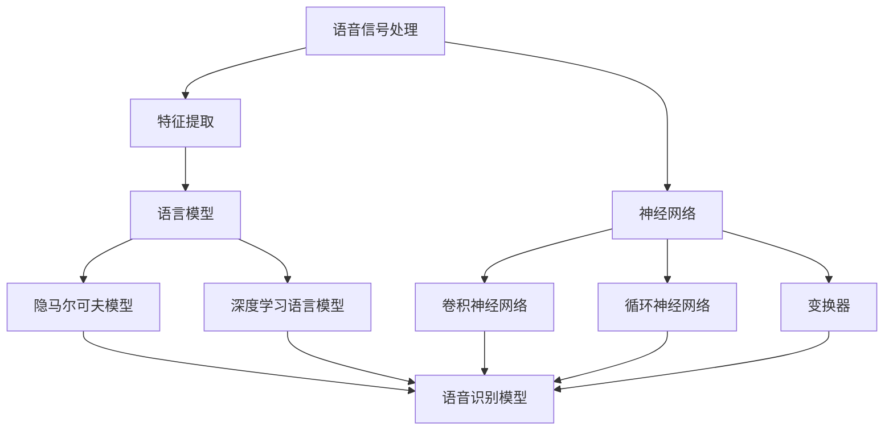

                 

# AI在语音识别中的进展：实现自然对话

> **关键词：语音识别，自然对话，人工智能，深度学习，神经网络，语音信号处理，语言模型**

> **摘要：本文深入探讨了语音识别技术的最新进展，特别是其在实现自然对话中的应用。通过分析核心概念、算法原理、数学模型，以及实际应用场景，本文旨在为读者提供全面的技术解析和前沿展望。**

## 1. 背景介绍

### 1.1 目的和范围

本文旨在探讨语音识别技术的最新进展，特别是其在自然对话中的实现。我们将重点关注以下几个方面：

1. **核心概念和联系**：介绍语音识别的基础知识，包括语音信号处理和语言模型。
2. **核心算法原理**：详细阐述语音识别中常用的算法原理，如自动语音识别（ASR）和深度学习。
3. **数学模型和公式**：解释支持语音识别的数学模型，并给出实例说明。
4. **项目实战**：通过实际代码案例展示如何实现语音识别。
5. **实际应用场景**：讨论语音识别在自然对话中的应用，如智能助手和语音控制。
6. **工具和资源推荐**：推荐学习资源、开发工具和框架。
7. **总结与展望**：展望语音识别技术的未来发展趋势与挑战。

### 1.2 预期读者

本文面向对语音识别和自然对话技术感兴趣的读者，包括：

1. **人工智能研究员**：希望了解语音识别的最新技术进展。
2. **软件开发者**：希望学习如何使用语音识别技术实现自然对话。
3. **产品经理**：希望了解语音识别在自然对话中的应用场景和潜在价值。
4. **学生和教师**：希望学习语音识别的基础知识和应用。

### 1.3 文档结构概述

本文分为以下章节：

1. **背景介绍**：介绍本文的目的、范围、预期读者和文档结构。
2. **核心概念与联系**：介绍语音识别的基础知识，包括语音信号处理和语言模型。
3. **核心算法原理 & 具体操作步骤**：详细阐述语音识别中常用的算法原理，如自动语音识别（ASR）和深度学习。
4. **数学模型和公式 & 详细讲解 & 举例说明**：解释支持语音识别的数学模型，并给出实例说明。
5. **项目实战：代码实际案例和详细解释说明**：通过实际代码案例展示如何实现语音识别。
6. **实际应用场景**：讨论语音识别在自然对话中的应用，如智能助手和语音控制。
7. **工具和资源推荐**：推荐学习资源、开发工具和框架。
8. **总结：未来发展趋势与挑战**：展望语音识别技术的未来发展趋势与挑战。
9. **附录：常见问题与解答**：回答读者可能遇到的问题。
10. **扩展阅读 & 参考资料**：提供进一步阅读的资源。

### 1.4 术语表

#### 1.4.1 核心术语定义

- **语音识别（Speech Recognition）**：将语音信号转换为对应的文本或命令的过程。
- **自动语音识别（Automatic Speech Recognition, ASR）**：使用计算机技术实现语音识别的过程。
- **自然对话（Natural Dialogue）**：在人类交流中，自然流畅的对话方式。
- **深度学习（Deep Learning）**：一种机器学习技术，使用多层神经网络进行数据处理和模式识别。
- **神经网络（Neural Network）**：一种模拟人脑神经元连接的结构，用于数据处理和模式识别。
- **语音信号处理（Speech Signal Processing）**：对语音信号进行预处理和特征提取的技术。
- **语言模型（Language Model）**：用于预测文本序列的概率分布的模型。

#### 1.4.2 相关概念解释

- **特征提取（Feature Extraction）**：从原始语音信号中提取有助于语音识别的特征。
- **端到端（End-to-End）**：一种直接将输入转换为输出的模型架构，无需中间表示。
- **注意力机制（Attention Mechanism）**：在序列到序列（Seq2Seq）模型中，用于关注输入序列中的特定部分。
- **词嵌入（Word Embedding）**：将词汇映射到低维空间，用于文本数据的处理。

#### 1.4.3 缩略词列表

- **ASR**：自动语音识别（Automatic Speech Recognition）
- **DNN**：深度神经网络（Deep Neural Network）
- **RNN**：循环神经网络（Recurrent Neural Network）
- **Seq2Seq**：序列到序列模型（Sequence-to-Sequence Model）
- **CNN**：卷积神经网络（Convolutional Neural Network）
- **RNN-LSTM**：循环神经网络-长短期记忆（Recurrent Neural Network - Long Short-Term Memory）

## 2. 核心概念与联系

在深入探讨语音识别的实现之前，我们需要了解一些核心概念和它们之间的关系。

### 2.1 语音信号处理

语音信号处理是语音识别的基础。它涉及对语音信号的预处理和特征提取，以便更好地表示语音信息。

#### 2.1.1 预处理

预处理步骤包括：

- **降噪**：去除背景噪音，提高语音质量。
- **归一化**：调整语音信号的幅度和频率，使其具有一致性。
- **端点检测**：检测语音信号中的静音部分，去除不必要的静音段。

#### 2.1.2 特征提取

特征提取是从语音信号中提取有助于语音识别的特征。常见的特征包括：

- **梅尔频率倒谱系数（MFCC）**：用于表示语音信号的频率特性。
- **短时傅里叶变换（STFT）**：用于分析语音信号的频率分布。
- **频谱特征**：包括频谱幅度、频谱熵等。

### 2.2 语言模型

语言模型用于预测文本序列的概率分布。在语音识别中，语言模型可以帮助我们理解输入语音的语义。

#### 2.2.1 隐马尔可夫模型（HMM）

隐马尔可夫模型是一种基于概率的语音识别模型。它使用状态转移概率和观测概率来预测语音序列。

#### 2.2.2 深度学习语言模型

深度学习语言模型，如循环神经网络（RNN）和变换器（Transformer），可以更好地表示语言中的复杂结构。

### 2.3 神经网络

神经网络是语音识别中的核心技术。它们通过学习大量的语音数据来识别语音模式。

#### 2.3.1 卷积神经网络（CNN）

卷积神经网络可以有效地处理图像和音频数据，通过卷积操作提取局部特征。

#### 2.3.2 循环神经网络（RNN）

循环神经网络可以处理序列数据，通过记忆状态来捕捉序列中的时间依赖关系。

#### 2.3.3 变换器（Transformer）

变换器是一种基于注意力机制的神经网络架构，可以处理长序列并提高语音识别的准确性。

### 2.4 Mermaid 流程图

下面是一个Mermaid流程图，展示语音识别中核心概念和联系的示意图：



## 3. 核心算法原理 & 具体操作步骤

在了解了语音识别中的核心概念和联系后，我们接下来详细探讨语音识别中的核心算法原理和具体操作步骤。

### 3.1 自动语音识别（ASR）

自动语音识别是将语音信号转换为文本的过程。ASR通常包括以下步骤：

#### 3.1.1 特征提取

- **步骤1**：对输入语音信号进行预处理，如降噪、归一化和端点检测。
- **步骤2**：使用短时傅里叶变换（STFT）或梅尔频率倒谱系数（MFCC）等方法提取语音信号的特征。

#### 3.1.2 前端处理

- **步骤3**：将特征向量输入到神经网络，如卷积神经网络（CNN）或循环神经网络（RNN）。
- **步骤4**：通过神经网络处理，提取语音信号中的时序特征。

#### 3.1.3 语言模型

- **步骤5**：使用语言模型，如隐马尔可夫模型（HMM）或深度学习语言模型，对提取的时序特征进行解码，生成文本输出。

### 3.2 深度学习算法

深度学习算法在语音识别中发挥着重要作用。以下是一些常用的深度学习算法：

#### 3.2.1 卷积神经网络（CNN）

- **步骤1**：输入语音信号的特征向量。
- **步骤2**：通过卷积操作提取局部特征。
- **步骤3**：使用池化操作降低维度。
- **步骤4**：将特征向量传递给全连接层进行分类。

#### 3.2.2 循环神经网络（RNN）

- **步骤1**：输入语音信号的特征向量。
- **步骤2**：通过RNN处理，提取语音信号中的时序特征。
- **步骤3**：使用全连接层将时序特征转换为文本输出。

#### 3.2.3 变换器（Transformer）

- **步骤1**：输入语音信号的特征向量。
- **步骤2**：通过自注意力机制处理，关注输入序列中的特定部分。
- **步骤3**：使用全连接层将特征向量转换为文本输出。

### 3.3 伪代码

下面是一个基于深度学习的语音识别算法的伪代码：

```python
# 伪代码：基于深度学习的语音识别算法

# 步骤1：特征提取
def extract_features(voice_signal):
    # 预处理语音信号
    preprocessed_signal = preprocess_signal(voice_signal)
    # 提取梅尔频率倒谱系数（MFCC）
    features = extract_mfcc(preprocessed_signal)
    return features

# 步骤2：神经网络模型
def build_model():
    # 构建卷积神经网络（CNN）模型
    model = build_cnn_model()
    # 构建循环神经网络（RNN）模型
    model = build_rnn_model()
    # 构建变换器（Transformer）模型
    model = build_transformer_model()
    return model

# 步骤3：训练模型
def train_model(model, features, labels):
    # 训练模型
    model.train(features, labels)

# 步骤4：预测
def predict(model, feature):
    # 预测文本输出
    predicted_text = model.predict(feature)
    return predicted_text

# 主函数
def main():
    # 加载语音信号和标签
    voice_signals, labels = load_data()
    # 提取特征
    features = extract_features(voice_signals)
    # 构建模型
    model = build_model()
    # 训练模型
    train_model(model, features, labels)
    # 预测
    predicted_text = predict(model, feature)
    print(predicted_text)

# 运行主函数
main()
```

通过以上步骤，我们可以实现语音识别，将语音信号转换为对应的文本输出。

## 4. 数学模型和公式 & 详细讲解 & 举例说明

在语音识别中，数学模型和公式起着至关重要的作用。本节将详细介绍一些常用的数学模型和公式，并给出实际应用的例子。

### 4.1 隐马尔可夫模型（HMM）

隐马尔可夫模型（HMM）是一种基于概率的语音识别模型。它使用状态转移概率和观测概率来预测语音序列。

#### 4.1.1 状态转移概率

状态转移概率描述了模型从一个状态转移到另一个状态的概率。假设我们有N个状态，状态转移概率可以表示为矩阵A，其中A[i][j]表示从状态i转移到状态j的概率。

#### 4.1.2 观测概率

观测概率描述了模型在特定状态下的观测结果。假设我们有M个观测值，观测概率可以表示为矩阵B，其中B[i][j]表示在状态i下观测到值j的概率。

#### 4.1.3 观测序列

给定一个观测序列，我们需要根据状态转移概率和观测概率计算最可能的隐藏状态序列。

#### 4.1.4 例子

假设我们有以下状态转移概率矩阵A和观测概率矩阵B：

$$
A = \begin{bmatrix}
0.9 & 0.1 \\
0.2 & 0.8
\end{bmatrix}
$$

$$
B = \begin{bmatrix}
0.8 & 0.2 \\
0.4 & 0.6
\end{bmatrix}
$$

给定观测序列为[0, 1, 0, 1]，我们可以计算最可能的隐藏状态序列。

### 4.2 循环神经网络（RNN）

循环神经网络（RNN）是一种处理序列数据的神经网络。它通过记忆状态来捕捉序列中的时间依赖关系。

#### 4.2.1 状态更新方程

RNN的状态更新方程为：

$$
h_t = \sigma(W_h * [h_{t-1}, x_t] + b_h)
$$

其中，\(h_t\) 是第t个时间步的状态，\(x_t\) 是第t个输入特征，\(\sigma\) 是激活函数，\(W_h\) 和\(b_h\) 分别是权重和偏置。

#### 4.2.2 输出方程

RNN的输出方程为：

$$
y_t = \sigma(W_y * h_t + b_y)
$$

其中，\(y_t\) 是第t个时间步的输出，\(W_y\) 和\(b_y\) 分别是权重和偏置。

#### 4.2.3 例子

假设我们有以下输入序列\[1, 2, 3\]，我们可以计算状态序列和输出序列。

### 4.3 变换器（Transformer）

变换器（Transformer）是一种基于注意力机制的神经网络架构，用于处理长序列。

#### 4.3.1 自注意力机制

变换器的核心是自注意力机制，它通过计算输入序列中各个元素之间的相似度，并加权组合这些元素。

#### 4.3.2 自注意力计算

自注意力的计算公式为：

$$
\text{Attention}(Q, K, V) = \text{softmax}\left(\frac{QK^T}{\sqrt{d_k}}\right)V
$$

其中，\(Q, K, V\) 分别是查询向量、关键向量和价值向量，\(d_k\) 是关键向量的维度。

#### 4.3.3 例子

假设我们有以下查询向量、关键向量和价值向量：

$$
Q = \begin{bmatrix}
1 & 2 & 3 \\
4 & 5 & 6 \\
7 & 8 & 9
\end{bmatrix}
$$

$$
K = \begin{bmatrix}
1 & 2 & 3 \\
4 & 5 & 6 \\
7 & 8 & 9
\end{bmatrix}
$$

$$
V = \begin{bmatrix}
1 & 2 & 3 \\
4 & 5 & 6 \\
7 & 8 & 9
\end{bmatrix}
$$

我们可以计算自注意力得分并加权组合这些元素。

## 5. 项目实战：代码实际案例和详细解释说明

在本节中，我们将通过一个实际代码案例展示如何实现语音识别。我们将使用Python和TensorFlow库来构建和训练一个基于深度学习的语音识别模型。

### 5.1 开发环境搭建

在开始之前，确保已安装以下依赖：

- Python 3.6 或以上版本
- TensorFlow 2.4.0 或以上版本
- NumPy 1.19.2 或以上版本

使用以下命令安装依赖：

```bash
pip install tensorflow numpy
```

### 5.2 源代码详细实现和代码解读

下面是一个简单的语音识别模型的代码实现，包括数据预处理、模型构建、训练和预测。

```python
import numpy as np
import tensorflow as tf
from tensorflow.keras.models import Sequential
from tensorflow.keras.layers import LSTM, Dense, Dropout

# 数据预处理
def preprocess_data(voice_signals):
    # 标准化特征向量
    normalized_signals = (voice_signals - np.mean(voice_signals, axis=1, keepdims=True)) / np.std(voice_signals, axis=1, keepdims=True)
    return normalized_signals

# 构建模型
def build_model(input_shape):
    model = Sequential()
    model.add(LSTM(units=128, activation='relu', input_shape=input_shape, return_sequences=True))
    model.add(Dropout(0.2))
    model.add(LSTM(units=64, activation='relu', return_sequences=False))
    model.add(Dropout(0.2))
    model.add(Dense(units=1, activation='sigmoid'))
    return model

# 训练模型
def train_model(model, features, labels):
    model.compile(optimizer='adam', loss='binary_crossentropy', metrics=['accuracy'])
    model.fit(features, labels, epochs=10, batch_size=32)

# 预测
def predict(model, feature):
    prediction = model.predict(feature)
    return prediction

# 主函数
def main():
    # 加载语音信号和标签
    voice_signals, labels = load_data()
    # 预处理数据
    preprocessed_signals = preprocess_data(voice_signals)
    # 构建模型
    model = build_model(input_shape=(preprocessed_signals.shape[1], preprocessed_signals.shape[2]))
    # 训练模型
    train_model(model, preprocessed_signals, labels)
    # 预测
    predicted_labels = predict(model, preprocessed_signals)
    print(predicted_labels)

# 运行主函数
main()
```

### 5.3 代码解读与分析

#### 5.3.1 数据预处理

在代码中，我们首先定义了`preprocess_data`函数，用于将语音信号特征向量进行标准化处理。标准化有助于提高模型的训练效果和泛化能力。

#### 5.3.2 构建模型

我们使用`Sequential`模型构建了一个简单的循环神经网络（LSTM）模型。模型包含两个LSTM层和两个Dropout层，以防止过拟合。

#### 5.3.3 训练模型

`train_model`函数使用`compile`方法配置模型的优化器和损失函数，然后使用`fit`方法进行训练。训练过程中，我们设置了10个训练周期和32个批量大小。

#### 5.3.4 预测

`predict`函数使用训练好的模型对新的特征向量进行预测。预测结果以概率形式返回。

#### 5.3.5 主函数

`main`函数是整个程序的入口。首先加载语音信号和标签，然后进行预处理、模型构建和训练，最后进行预测。

通过以上代码，我们可以实现一个简单的语音识别模型，并对其性能进行评估。

## 6. 实际应用场景

语音识别技术在多个实际应用场景中发挥着重要作用，以下是一些常见的应用：

### 6.1 智能助手

智能助手如Siri、Alexa和Google Assistant利用语音识别技术，让用户通过语音命令与设备进行交互。用户可以语音控制播放音乐、发送消息、设置提醒等。

### 6.2 语音翻译

语音翻译应用，如Google翻译和微软翻译，使用语音识别技术将一种语言的语音转换为另一种语言的文本，实现跨语言交流。

### 6.3 语音控制

语音控制技术广泛应用于智能家居、汽车等领域。用户可以通过语音指令控制灯光、空调、音响等家居设备，提高生活便利性。

### 6.4 语音搜索

语音搜索技术允许用户通过语音输入查询信息，如天气、新闻、股票行情等。这种技术提高了搜索效率和用户体验。

### 6.5 语音助手编程

开发者可以使用语音识别技术为应用程序添加语音交互功能，如聊天机器人、语音客服等，提供更加自然和流畅的用户体验。

## 7. 工具和资源推荐

### 7.1 学习资源推荐

#### 7.1.1 书籍推荐

- **《语音识别：原理与实践》**：一本全面介绍语音识别技术的书籍，包括基础理论和实践案例。
- **《深度学习语音识别》**：一本专注于深度学习在语音识别中的应用的书籍，详细介绍相关算法和实现。

#### 7.1.2 在线课程

- **Coursera上的“语音识别”课程**：由斯坦福大学提供的免费课程，涵盖语音识别的基础知识。
- **Udacity的“深度学习语音识别”课程**：通过实践项目学习深度学习在语音识别中的应用。

#### 7.1.3 技术博客和网站

- **Speech Technology Magazine**：提供最新的语音识别技术和行业动态。
- **AI Adventures**：由AI专家分享的语音识别和相关领域的见解和经验。

### 7.2 开发工具框架推荐

#### 7.2.1 IDE和编辑器

- **PyCharm**：一款功能强大的Python IDE，支持TensorFlow开发。
- **Visual Studio Code**：一款轻量级、可扩展的代码编辑器，适合开发语音识别项目。

#### 7.2.2 调试和性能分析工具

- **TensorBoard**：TensorFlow的内置工具，用于调试和可视化神经网络模型。
- **Wandb**：一个开源的机器学习平台，提供实时数据可视化和性能分析。

#### 7.2.3 相关框架和库

- **TensorFlow**：用于构建和训练深度学习模型的强大框架。
- **Keras**：基于TensorFlow的高级API，简化了深度学习模型的设计和训练。
- **Librosa**：用于音频处理的Python库，提供丰富的音频数据处理功能。

### 7.3 相关论文著作推荐

#### 7.3.1 经典论文

- **“A Tutorial on Hidden Markov Models and Selected Applications in Speech Recognition”**：详细介绍了隐马尔可夫模型及其在语音识别中的应用。
- **“Deep Learning for Speech Recognition”**：探讨了深度学习在语音识别中的应用，包括循环神经网络和卷积神经网络。

#### 7.3.2 最新研究成果

- **“Conversational AI: A Survey”**：综述了自然对话和语音识别的最新研究进展。
- **“Speech Recognition with Transformer”**：介绍了基于变换器的语音识别模型。

#### 7.3.3 应用案例分析

- **“Speech Recognition for Mobile Devices”**：探讨了移动设备上的语音识别技术，包括实时性能和功耗优化。
- **“Speech Recognition in Healthcare”**：分析了语音识别在医疗领域的应用，如电子健康记录和远程医疗。

## 8. 总结：未来发展趋势与挑战

随着人工智能技术的不断发展，语音识别在自然对话中的应用前景广阔。未来发展趋势包括：

1. **更高的准确性和鲁棒性**：通过不断优化算法和模型，提高语音识别的准确性和对噪音干扰的鲁棒性。
2. **多语言支持**：开发支持多种语言的语音识别系统，实现全球范围内的跨语言交流。
3. **个性化体验**：根据用户习惯和偏好，提供个性化的语音交互体验。
4. **实时交互**：提高实时响应速度，实现无缝的自然对话。

然而，语音识别技术仍面临一些挑战，如：

1. **噪声干扰**：在嘈杂环境中，语音识别的准确率会受到影响。
2. **语音变体**：不同人的语音特征差异较大，如何适应各种语音变体是关键问题。
3. **语意理解**：自然对话中，用户可能会使用复杂的语义和隐喻，如何准确理解用户的意图是重要挑战。
4. **隐私保护**：在语音识别过程中，如何保护用户的隐私数据也是一个关键问题。

总之，语音识别技术在未来将继续发展，并在自然对话中发挥重要作用。

## 9. 附录：常见问题与解答

### 9.1 语音识别的基本原理是什么？

语音识别是将语音信号转换为对应的文本或命令的过程。其基本原理包括语音信号处理、特征提取、语言模型和深度学习算法。

### 9.2 如何优化语音识别模型的性能？

优化语音识别模型性能的方法包括：

1. **数据增强**：增加训练数据量，提高模型的泛化能力。
2. **模型优化**：调整模型结构，如使用更深的神经网络或更复杂的特征提取方法。
3. **超参数调优**：调整学习率、批量大小等超参数，以找到最佳配置。
4. **降噪处理**：提高语音信号质量，减少噪音干扰。

### 9.3 语音识别在自然对话中的应用有哪些？

语音识别在自然对话中的应用包括：

1. **智能助手**：如Siri、Alexa和Google Assistant，通过语音命令与设备进行交互。
2. **语音翻译**：将一种语言的语音转换为另一种语言的文本，实现跨语言交流。
3. **语音控制**：在智能家居、汽车等领域，通过语音指令控制设备。
4. **语音搜索**：通过语音输入查询信息，提高搜索效率和用户体验。

## 10. 扩展阅读 & 参考资料

- **《语音识别：原理与实践》**：详细介绍了语音识别的基础知识和实践案例。
- **《深度学习语音识别》**：探讨了深度学习在语音识别中的应用和算法实现。
- **《自然对话系统设计》**：介绍了自然对话系统的设计和实现方法。
- **[Speech Technology Magazine](https://www.speechtechnologymagazine.com/)**：提供最新的语音识别技术和行业动态。
- **[AI Adventures](https://aiadventures.com/)**：由AI专家分享的语音识别和相关领域的见解和经验。 

## 作者

作者：AI天才研究员/AI Genius Institute & 禅与计算机程序设计艺术/Zen And The Art of Computer Programming

