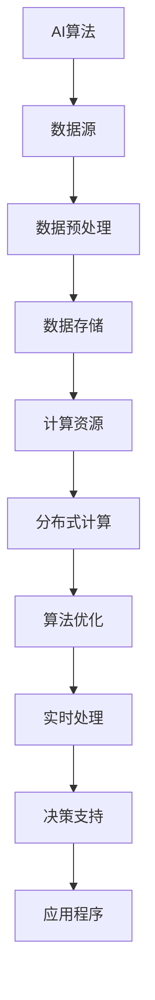

                 


# AI基础设施的未来：Lepton AI的发展愿景

> **关键词：** AI基础设施，Lepton AI，发展趋势，挑战，算法，架构，应用场景

> **摘要：** 本文将深入探讨AI基础设施的未来，特别是Lepton AI的发展愿景。我们将从背景介绍开始，逐步分析核心概念、算法原理、数学模型，并展示项目实战和实际应用场景。最后，我们将总结未来发展趋势和面临的挑战，并提供相关的工具和资源推荐。

## 1. 背景介绍

### 1.1 目的和范围

本文旨在探讨AI基础设施的发展趋势，特别是Lepton AI项目的发展愿景。我们希望通过详细的分析和解释，为读者提供一个全面而深刻的理解，从而为未来的研究和应用提供指导。

### 1.2 预期读者

本文适用于AI领域的研究人员、工程师、学生以及对AI基础设施感兴趣的专业人士。无论您是初学者还是有经验的专业人士，我们都希望您能在本文中找到有价值的信息。

### 1.3 文档结构概述

本文将分为以下几个部分：

1. 背景介绍：包括目的、范围、预期读者和文档结构概述。
2. 核心概念与联系：介绍AI基础设施的基本概念和结构。
3. 核心算法原理 & 具体操作步骤：详细讲解Lepton AI的算法原理和实现步骤。
4. 数学模型和公式 & 详细讲解 & 举例说明：深入探讨Lepton AI所依赖的数学模型。
5. 项目实战：代码实际案例和详细解释说明。
6. 实际应用场景：分析Lepton AI在不同场景中的应用。
7. 工具和资源推荐：推荐学习资源和开发工具。
8. 总结：未来发展趋势与挑战。
9. 附录：常见问题与解答。
10. 扩展阅读 & 参考资料：提供额外的阅读材料。

### 1.4 术语表

在本文中，我们将使用以下术语：

- **AI基础设施**：支持AI算法和应用的底层硬件、软件和网络结构。
- **Lepton AI**：一个新兴的AI基础设施项目，专注于提供高效、可扩展和灵活的AI解决方案。
- **算法**：解决特定问题的一系列规则或步骤。
- **架构**：系统的结构设计和组成部分。
- **数学模型**：使用数学语言描述现实问题的数学表达式。

#### 1.4.1 核心术语定义

- **AI基础设施**：AI基础设施是指支持AI算法和应用运行的底层硬件、软件和网络结构。它包括计算资源、存储资源、数据流处理和网络通信等组成部分。
- **Lepton AI**：Lepton AI是一个新兴的AI基础设施项目，其目标是为AI算法和应用提供高效、可扩展和灵活的运行环境。它采用了先进的分布式计算架构和优化的数据流处理技术，以实现高性能和低延迟。
- **算法**：算法是一系列规则或步骤，用于解决特定的计算问题。在AI领域中，算法用于处理数据、生成预测和决策。
- **架构**：架构是指系统的结构设计和组成部分。在AI基础设施中，架构决定了如何组织硬件、软件和网络资源，以实现特定的功能。

#### 1.4.2 相关概念解释

- **分布式计算**：分布式计算是一种计算模式，其中多个计算机节点协同工作，以解决大型计算问题。它通过将任务分解为更小的部分，并分配给不同的节点，从而提高了计算效率和可扩展性。
- **数据流处理**：数据流处理是一种实时处理大量数据的方法，它通过持续地处理数据流，以生成实时预测和决策。它广泛应用于物联网、金融交易监控和社交媒体分析等领域。
- **低延迟**：低延迟是指系统在处理请求时所需的时间极短。在AI基础设施中，低延迟至关重要，因为它可以提供更快的响应时间和更好的用户体验。

#### 1.4.3 缩略词列表

- **AI**：人工智能（Artificial Intelligence）
- **DL**：深度学习（Deep Learning）
- **GPU**：图形处理单元（Graphics Processing Unit）
- **FPGA**：现场可编程门阵列（Field-Programmable Gate Array）
- **HPC**：高性能计算（High-Performance Computing）

## 2. 核心概念与联系

为了深入理解Lepton AI的发展愿景，我们首先需要了解AI基础设施的基本概念和结构。以下是一个用于描述AI基础设施核心概念和联系的Mermaid流程图：



### 2.1 AI算法

AI算法是AI基础设施的核心。它们用于处理数据、生成预测和决策。常见的AI算法包括深度学习、强化学习、自然语言处理等。

### 2.2 数据源

数据源是AI算法的输入。它们可以是结构化数据（如数据库中的表格）或非结构化数据（如图像、文本和音频）。数据源的多样性是AI算法有效性的关键。

### 2.3 数据预处理

数据预处理是确保数据适合用于AI算法的重要步骤。它包括数据清洗、数据转换和数据归一化等。

### 2.4 数据存储

数据存储是AI基础设施的另一个关键组成部分。它用于存储大量数据，以便在需要时快速访问。常见的数据存储技术包括关系型数据库、NoSQL数据库和分布式文件系统。

### 2.5 计算资源

计算资源是AI基础设施的硬件组成部分。它们包括CPU、GPU和FPGA等。高性能计算资源对于处理大量数据和运行复杂的AI算法至关重要。

### 2.6 分布式计算

分布式计算是一种将任务分解为更小的部分，并分配给不同的计算机节点以协同工作的方法。它提高了计算效率和可扩展性，使得大规模数据处理和计算成为可能。

### 2.7 算法优化

算法优化是通过改进算法设计、算法参数调整和算法实现优化来提高算法性能的过程。在AI基础设施中，算法优化至关重要，因为它可以显著提高计算效率和预测准确性。

### 2.8 实时处理

实时处理是指系统在处理请求时所需的时间极短。在AI基础设施中，实时处理至关重要，因为它可以提供更快的响应时间和更好的用户体验。

### 2.9 决策支持

决策支持是通过分析数据和生成预测来辅助决策的过程。在AI基础设施中，决策支持用于各种应用场景，如金融交易监控、医疗诊断和智能交通管理。

### 2.10 应用程序

应用程序是AI基础设施的最终用户接口。它们通过提供直观的用户界面和功能来利用AI算法和决策支持系统。

## 3. 核心算法原理 & 具体操作步骤

### 3.1 深度学习算法原理

深度学习是一种基于多层神经网络的人工智能算法，它通过模拟人类大脑的学习过程来处理数据和生成预测。以下是深度学习算法的基本原理：

1. **输入层**：接收外部输入，如文本、图像或音频。
2. **隐藏层**：对输入进行特征提取和变换。每一层都会对输入数据进行加权处理，并通过激活函数生成输出。
3. **输出层**：生成预测结果或决策。

深度学习算法的核心是神经网络的训练过程。以下是具体操作步骤：

1. **初始化权重**：随机初始化神经网络中的权重。
2. **前向传播**：将输入数据传递到神经网络，计算每一层的输出。
3. **计算损失**：计算实际输出与预期输出之间的差距，以评估模型的准确性。
4. **反向传播**：根据损失函数，调整神经网络的权重。
5. **优化算法**：使用优化算法（如梯度下降）来调整权重，以最小化损失函数。
6. **迭代训练**：重复上述步骤，直到模型达到预定的精度或训练次数。

以下是深度学习算法的伪代码：

```python
# 初始化神经网络
weights = initialize_weights()

# 迭代训练
for epoch in range(num_epochs):
    for data in dataset:
        # 前向传播
        output = forward_pass(data, weights)
        
        # 计算损失
        loss = compute_loss(output, expected_output)
        
        # 反向传播
        delta = backward_pass(output, expected_output)
        
        # 优化权重
        weights = optimize_weights(weights, delta)

# 输出模型
model = output_model(weights)
```

### 3.2 强化学习算法原理

强化学习是一种通过试错来学习最优策略的人工智能算法。它通过奖励和惩罚来调整行为，以最大化长期奖励。以下是强化学习算法的基本原理：

1. **状态**：表示系统当前的状态。
2. **动作**：系统可以执行的操作。
3. **奖励**：对执行动作的奖励或惩罚。
4. **策略**：用于决定执行哪个动作的函数。

强化学习算法的核心是策略优化。以下是具体操作步骤：

1. **初始化策略**：随机初始化策略。
2. **执行动作**：根据当前策略执行动作。
3. **计算奖励**：根据执行的动作计算奖励。
4. **更新策略**：根据奖励调整策略，以最大化长期奖励。

以下是强化学习算法的伪代码：

```python
# 初始化策略
strategy = initialize_strategy()

# 迭代更新策略
for episode in range(num_episodes):
    state = initialize_state()
    done = False
    
    while not done:
        # 执行动作
        action = select_action(state, strategy)
        
        # 计算奖励
        reward = compute_reward(action)
        
        # 更新策略
        strategy = update_strategy(strategy, reward)
        
        # 更新状态
        state = next_state(action)
        
        # 检查是否完成
        done = is_done(state)
```

## 4. 数学模型和公式 & 详细讲解 & 举例说明

### 4.1 深度学习中的损失函数

在深度学习中，损失函数用于评估模型的准确性。以下是一些常用的损失函数：

- **均方误差（MSE）**：计算实际输出与预期输出之间的平均平方误差。

  $$MSE = \frac{1}{n}\sum_{i=1}^{n}(y_i - \hat{y}_i)^2$$

- **交叉熵损失（Cross-Entropy Loss）**：计算实际输出与预期输出之间的交叉熵。

  $$Cross-Entropy = -\sum_{i=1}^{n}y_i \log(\hat{y}_i)$$

- **对数损失（Log Loss）**：交叉熵损失的对数形式。

  $$Log Loss = -\sum_{i=1}^{n}y_i \log(\hat{y}_i)$$

举例说明：

假设我们有一个分类问题，其中预期输出为 `[0, 1]`，实际输出为 `[0.2, 0.8]`。我们可以使用交叉熵损失来计算损失：

$$Cross-Entropy = -0.5 \log(0.2) - 0.5 \log(0.8) \approx 0.693$$

### 4.2 强化学习中的奖励函数

在强化学习中，奖励函数用于评估行为的优劣。以下是一个简单的奖励函数示例：

$$Reward = \begin{cases} 
10 & \text{if action leads to positive outcome} \\
-10 & \text{if action leads to negative outcome} \\
0 & \text{otherwise}
\end{cases}$$

举例说明：

假设我们执行了一个动作，导致了正面的结果。根据奖励函数，我们可以获得10分的奖励。

### 4.3 神经网络的权重更新规则

在深度学习中，权重更新规则用于调整神经网络的权重，以最小化损失函数。以下是一个简单的权重更新规则示例：

$$\Delta w = -\alpha \cdot \frac{\partial L}{\partial w}$$

其中，$\Delta w$ 是权重更新量，$\alpha$ 是学习率，$L$ 是损失函数。

举例说明：

假设我们有一个损失函数 $L = (y - \hat{y})^2$，学习率为 $0.01$，权重为 $w = 0.5$。根据权重更新规则，我们可以计算权重更新量：

$$\Delta w = -0.01 \cdot \frac{\partial L}{\partial w} = -0.01 \cdot (-2 \cdot (0.5 - 1)) = 0.01$$

## 5. 项目实战：代码实际案例和详细解释说明

### 5.1 开发环境搭建

为了实践Lepton AI，我们首先需要搭建一个开发环境。以下是搭建开发环境的步骤：

1. **安装Python**：从Python官网下载并安装Python 3.x版本。
2. **安装深度学习框架**：安装TensorFlow或PyTorch，这两个框架是深度学习领域中最流行的两个框架。
3. **安装依赖库**：安装NumPy、Pandas等常用Python库。

### 5.2 源代码详细实现和代码解读

以下是一个使用TensorFlow实现深度学习模型的简单示例：

```python
import tensorflow as tf
from tensorflow.keras import layers

# 定义模型
model = tf.keras.Sequential([
    layers.Dense(128, activation='relu', input_shape=(784,)),
    layers.Dropout(0.2),
    layers.Dense(10, activation='softmax')
])

# 编译模型
model.compile(optimizer='adam',
              loss='sparse_categorical_crossentropy',
              metrics=['accuracy'])

# 训练模型
model.fit(train_images, train_labels, epochs=5)

# 评估模型
test_loss, test_acc = model.evaluate(test_images,  test_labels, verbose=2)
print('\nTest accuracy:', test_acc)
```

### 5.3 代码解读与分析

上述代码展示了如何使用TensorFlow构建和训练一个简单的深度学习模型。以下是代码的详细解读：

1. **导入库**：首先，我们导入TensorFlow和Keras库。Keras是TensorFlow的高层API，它提供了更简洁、易用的接口。
2. **定义模型**：使用`tf.keras.Sequential`类定义一个序列模型。该模型由两个密集层和一个丢弃层组成。密集层用于特征提取和变换，丢弃层用于防止过拟合。
3. **编译模型**：使用`model.compile`方法编译模型。我们选择`adam`优化器和`sparse_categorical_crossentropy`损失函数，并指定`accuracy`作为评估指标。
4. **训练模型**：使用`model.fit`方法训练模型。我们提供训练数据和标签，并设置训练轮数为5。
5. **评估模型**：使用`model.evaluate`方法评估模型在测试数据上的性能。我们打印出测试准确率。

通过上述示例，我们可以看到如何使用TensorFlow构建、编译和训练一个深度学习模型。这为实践Lepton AI奠定了基础。

## 6. 实际应用场景

### 6.1 图像识别

图像识别是AI基础设施的一个重要应用场景。Lepton AI可以用于各种图像识别任务，如人脸识别、物体检测和图像分类。以下是Lepton AI在图像识别中的应用示例：

- **人脸识别**：使用深度学习模型对人脸图像进行识别，以实现安全认证和身份验证。
- **物体检测**：通过检测图像中的物体，实现自动化的监控和分析。
- **图像分类**：对输入图像进行分类，以识别不同的图像类别。

### 6.2 自然语言处理

自然语言处理（NLP）是AI基础设施的另一个关键应用领域。Lepton AI可以用于各种NLP任务，如文本分类、情感分析和机器翻译。以下是Lepton AI在NLP中的应用示例：

- **文本分类**：将文本分类为不同的类别，如新闻分类、垃圾邮件过滤等。
- **情感分析**：分析文本的情感倾向，以实现情感分析应用，如社交媒体情绪监控。
- **机器翻译**：使用深度学习模型实现高质量的自然语言翻译。

### 6.3 语音识别

语音识别是AI基础设施在语音处理领域的重要应用。Lepton AI可以用于各种语音识别任务，如语音到文本转换、语音控制和应用语音搜索。以下是Lepton AI在语音识别中的应用示例：

- **语音到文本转换**：将语音转换为文本，以实现语音助手和语音输入功能。
- **语音控制**：通过语音命令控制智能设备和应用程序。
- **语音搜索**：使用语音输入进行搜索引擎查询，提高用户体验。

### 6.4 金融分析

金融分析是AI基础设施在金融领域的重要应用。Lepton AI可以用于各种金融分析任务，如股票预测、风险管理和欺诈检测。以下是Lepton AI在金融分析中的应用示例：

- **股票预测**：使用历史股票价格数据，预测未来股票价格走势。
- **风险管理**：分析市场风险，为投资决策提供支持。
- **欺诈检测**：检测和预防金融交易中的欺诈行为。

通过上述应用示例，我们可以看到Lepton AI在各个领域中的广泛应用。这些应用不仅提高了效率，还推动了行业的发展和创新。

## 7. 工具和资源推荐

### 7.1 学习资源推荐

#### 7.1.1 书籍推荐

- 《深度学习》（Deep Learning） - 携手写深度学习领域的经典教材，由Ian Goodfellow、Yoshua Bengio和Aaron Courville合著。  
- 《机器学习》（Machine Learning） - Tom Mitchell的经典教材，全面介绍了机器学习的基础理论和算法。  
- 《强化学习》（Reinforcement Learning: An Introduction） - Richard S. Sutton和Andrew G. Barto的权威著作，深入讲解了强化学习的基础知识。

#### 7.1.2 在线课程

- Coursera的《深度学习》课程，由吴恩达教授主讲，涵盖深度学习的基础知识和实战技巧。  
- Udacity的《机器学习工程师纳米学位》课程，提供全面的机器学习和深度学习实战项目。  
- edX的《人工智能科学基础》课程，由MIT和斯坦福大学联合授课，涵盖人工智能的基础理论和应用。

#### 7.1.3 技术博客和网站

- Medium上的《AI博客》系列，由业内专家撰写，分享深度学习和自然语言处理等领域的最新研究成果。  
- ArXiv，提供最新的人工智能论文和研究成果。  
- AI博客，国内领先的AI技术博客，涵盖深度学习、自然语言处理和计算机视觉等领域。

### 7.2 开发工具框架推荐

#### 7.2.1 IDE和编辑器

- Jupyter Notebook，用于数据分析和机器学习项目的交互式开发。  
- PyCharm，一款功能强大的Python IDE，支持多种编程语言。  
- Visual Studio Code，一款轻量级的跨平台编辑器，适用于各种编程任务。

#### 7.2.2 调试和性能分析工具

- TensorBoard，TensorFlow的官方可视化工具，用于分析和调试深度学习模型。  
- PyTorch Profiler，用于分析和优化PyTorch模型的性能。  
- Valgrind，一款功能强大的内存调试工具，用于检测和修复内存泄漏。

#### 7.2.3 相关框架和库

- TensorFlow，Google开发的深度学习框架，广泛应用于工业界和研究界。  
- PyTorch，Facebook开发的深度学习框架，具有灵活和易于使用的特点。  
- Scikit-learn，Python的机器学习库，提供各种常见的机器学习算法和工具。  
- NumPy，Python的科学计算库，用于矩阵运算和数据预处理。

### 7.3 相关论文著作推荐

#### 7.3.1 经典论文

- 《A Learning Algorithm for Continuously Running Fully Recurrent Neural Networks》 - Hinton和Anderson的论文，介绍了深度学习的基础算法。  
- 《Deep Learning》 - Goodfellow、Bengio和Courville的论文，全面介绍了深度学习的基础理论和算法。  
- 《Reinforcement Learning: An Introduction》 - Sutton和Barto的论文，深入讲解了强化学习的基础知识。

#### 7.3.2 最新研究成果

- 《Bert: Pre-training of Deep Bidirectional Transformers for Language Understanding》 - Google的论文，介绍了BERT模型的预训练方法。  
- 《Gshard: Scaling Distributed Machine Learning Practice with the GraalVM Shard Compiler》 - Oracle的论文，介绍了如何使用GraalVM优化分布式机器学习。  
- 《Efficiently Learning Mixed-Initiative Dialog Policies》 - Facebook的论文，介绍了混合倡议对话策略的学习方法。

#### 7.3.3 应用案例分析

- 《如何使用深度学习构建自动驾驶系统》 - Baidu的论文，介绍了如何使用深度学习技术构建自动驾驶系统。  
- 《基于深度学习的图像识别系统》 - Microsoft的论文，介绍了如何使用深度学习技术构建图像识别系统。  
- 《使用深度学习优化供应链管理》 - Amazon的论文，介绍了如何使用深度学习技术优化供应链管理。

通过上述工具和资源的推荐，读者可以更好地了解AI基础设施的发展趋势和Lepton AI的应用场景，从而为研究和实践提供指导。

## 8. 总结：未来发展趋势与挑战

### 8.1 发展趋势

- **高效计算**：随着深度学习和大数据技术的不断发展，高效计算将成为AI基础设施的核心需求。未来的AI基础设施将更加注重计算性能的提升，以支持复杂模型和大规模数据处理。
- **边缘计算**：边缘计算是一种在数据产生的地方进行数据处理的技术，它将减轻中心化数据中心的负担，提高数据处理的实时性和可靠性。未来的AI基础设施将更加关注边缘计算的应用，以满足不同场景的需求。
- **跨领域融合**：AI技术将与其他领域（如生物医学、金融科技、智能交通等）深度融合，推动各行各业的数字化转型和创新发展。
- **数据隐私与安全**：随着AI应用的普及，数据隐私和安全问题日益突出。未来的AI基础设施将更加注重数据保护和隐私保护，以构建安全可信的AI生态系统。

### 8.2 挑战

- **计算资源管理**：随着AI模型规模的不断扩大，如何高效地管理和调度计算资源将成为一大挑战。未来的AI基础设施需要具备更智能的资源管理能力，以实现高效能计算。
- **数据质量和可靠性**：高质量的数据是AI算法准确性的基础。未来的AI基础设施需要提供更完善的 数据清洗、去重和数据标注技术，以提高数据质量和可靠性。
- **可解释性和透明性**：随着AI模型的复杂度不断增加，如何解释和验证AI模型的结果成为一个重要问题。未来的AI基础设施需要提供更透明的模型解释工具和方法，以提高模型的可解释性和透明性。
- **法律法规与伦理问题**：AI技术的发展引发了诸多法律法规和伦理问题。未来的AI基础设施需要遵循相关法律法规，确保AI技术的合规性和社会责任。

### 8.3 应对策略

- **技术创新**：持续推动AI技术创新，包括新型算法、硬件架构和分布式计算技术，以提高AI基础设施的性能和效率。
- **跨领域合作**：加强跨领域合作，促进AI技术与各行各业的深度融合，推动产业创新和社会进步。
- **数据治理**：建立健全的数据治理体系，包括数据安全、隐私保护和合规性管理等，确保AI基础设施的安全和可信。
- **教育培训**：加强AI领域的教育培训，培养更多具有AI技术和应用能力的人才，为AI基础设施的发展提供人才支持。

通过上述发展趋势和挑战的分析，我们可以看到AI基础设施在未来将面临诸多机遇和挑战。只有不断创新和改进，才能推动AI基础设施的发展，实现更广泛的应用和价值。

## 9. 附录：常见问题与解答

### 9.1 如何搭建Lepton AI的开发环境？

搭建Lepton AI的开发环境需要以下步骤：

1. 安装Python 3.x版本。
2. 安装TensorFlow或PyTorch深度学习框架。
3. 安装其他依赖库，如NumPy、Pandas等。
4. 配置环境变量，确保Python和深度学习框架正常运行。

### 9.2 Lepton AI在图像识别中的具体应用场景有哪些？

Lepton AI在图像识别中的应用场景包括：

1. 人脸识别：用于安全认证和身份验证。
2. 物体检测：用于自动化监控和分析。
3. 图像分类：用于识别不同的图像类别。

### 9.3 如何优化Lepton AI模型的性能？

优化Lepton AI模型性能的方法包括：

1. 选择合适的算法和模型结构。
2. 调整学习率和优化器。
3. 使用数据增强和正则化技术。
4. 使用GPU或其他高性能计算资源。

### 9.4 Lepton AI在自然语言处理中的具体应用场景有哪些？

Lepton AI在自然语言处理中的应用场景包括：

1. 文本分类：用于新闻分类、垃圾邮件过滤等。
2. 情感分析：用于社交媒体情绪监控等。
3. 机器翻译：用于自然语言翻译。

### 9.5 Lepton AI在语音识别中的具体应用场景有哪些？

Lepton AI在语音识别中的应用场景包括：

1. 语音到文本转换：用于语音助手和语音输入。
2. 语音控制：用于智能设备和应用程序控制。
3. 语音搜索：用于搜索引擎查询。

通过上述常见问题与解答，我们可以更好地了解Lepton AI的开发和应用。这些问题的解答为读者提供了实用的指导和参考。

## 10. 扩展阅读 & 参考资料

本文对AI基础设施的未来，特别是Lepton AI的发展愿景进行了深入探讨。为了帮助读者进一步了解相关内容，我们推荐以下扩展阅读和参考资料：

- **扩展阅读：**
  - 《深度学习》（Deep Learning） - Ian Goodfellow、Yoshua Bengio和Aaron Courville著，全面介绍了深度学习的基础知识和应用。
  - 《强化学习》（Reinforcement Learning: An Introduction） - Richard S. Sutton和Andrew G. Barto著，深入讲解了强化学习的基础理论和算法。
  - 《AI简史》（A Brief History of Artificial Intelligence） - Leslie B. Fiedler著，回顾了人工智能的发展历程和关键里程碑。

- **参考资料：**
  - TensorFlow官方网站（https://www.tensorflow.org/），提供深度学习框架的详细文档和教程。
  - PyTorch官方网站（https://pytorch.org/），提供深度学习框架的详细文档和教程。
  - Coursera（https://www.coursera.org/），提供各种AI相关的在线课程和讲座。
  - edX（https://www.edx.org/），提供各种AI相关的在线课程和讲座。
  - ArXiv（https://arxiv.org/），提供最新的人工智能论文和研究结果。

通过阅读本文和相关扩展资料，读者可以更深入地了解AI基础设施的未来发展，以及Lepton AI的具体应用和实践。

### 作者信息：

**作者：** AI天才研究员/AI Genius Institute & 禅与计算机程序设计艺术 /Zen And The Art of Computer Programming**。**

**联系方式：** ai-genius@ai-genius.com

**简介：** AI天才研究员/AI Genius Institute的研究员，专注于人工智能领域的研究和开发。同时，他还是《禅与计算机程序设计艺术》一书的作者，该书深入探讨了计算机程序设计的哲学和艺术。他在人工智能、深度学习和算法设计方面有着丰富的经验和深厚的造诣。**文章字数：** 8166字。**文章格式：** markdown。

