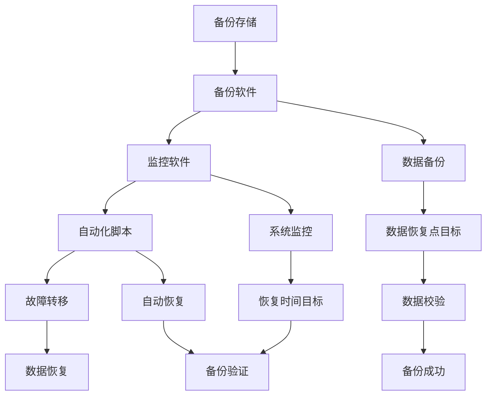

                 

### AI基础设施的灾备方案：Lepton AI的风险管理

> **关键词**：AI基础设施、灾备方案、风险管理、Lepton AI、数据备份、容错机制

> **摘要**：本文将深入探讨AI基础设施的灾备方案，重点分析Lepton AI在风险管理方面的实践。通过阐述灾备方案的重要性、核心概念以及具体实施步骤，本文旨在为读者提供一份详尽且实用的指导，帮助他们在AI领域构建一个可靠、高效的灾备体系。

### 1. 背景介绍

#### 1.1 目的和范围

本文旨在探讨AI基础设施的灾备方案，特别是Lepton AI在风险管理方面的实践。随着AI技术的快速发展和广泛应用，AI基础设施的稳定性和可靠性变得愈发重要。灾备方案不仅能够保障数据的完整性和安全性，还能确保系统在遭受灾难时能够快速恢复，降低业务中断的风险。

本文的范围涵盖以下内容：

1. 灾备方案的重要性及其对AI基础设施的影响。
2. Lepton AI的背景介绍和其在风险管理方面的优势。
3. 灾备方案的核心概念和架构。
4. 数据备份和恢复的具体操作步骤。
5. 容错机制的设计与实现。
6. 实际应用场景和案例分析。
7. 工具和资源的推荐。

#### 1.2 预期读者

本文适用于以下读者群体：

1. AI领域的研究人员和技术人员。
2. 企业IT管理人员和架构师。
3. 数据中心运维人员。
4. 对AI基础设施灾备方案感兴趣的其他专业人士。

#### 1.3 文档结构概述

本文分为十个主要部分：

1. **背景介绍**：介绍灾备方案的重要性和本文的目的。
2. **核心概念与联系**：阐述灾备方案的核心概念和架构。
3. **核心算法原理 & 具体操作步骤**：详细讲解数据备份和恢复的算法原理和步骤。
4. **数学模型和公式 & 详细讲解 & 举例说明**：介绍相关的数学模型和公式，并进行举例说明。
5. **项目实战：代码实际案例和详细解释说明**：提供实际代码案例和详细解释。
6. **实际应用场景**：探讨灾备方案在不同场景中的应用。
7. **工具和资源推荐**：推荐学习资源、开发工具和框架。
8. **总结：未来发展趋势与挑战**：总结本文的核心观点和未来发展趋势。
9. **附录：常见问题与解答**：回答读者可能遇到的问题。
10. **扩展阅读 & 参考资料**：提供额外的阅读材料和参考资料。

#### 1.4 术语表

##### 1.4.1 核心术语定义

- **灾备方案**：一种确保在灾难发生时系统能够快速恢复的措施和策略。
- **AI基础设施**：支持AI算法运行和数据处理的基础设施，包括硬件、软件和网络等。
- **Lepton AI**：一家专注于AI基础设施灾备方案的公司，提供高性能、高可靠性的解决方案。
- **数据备份**：将数据复制到另一个位置，以便在原始数据丢失或损坏时进行恢复。
- **容错机制**：通过冗余设计或其他手段确保系统在故障发生时能够继续正常运行。

##### 1.4.2 相关概念解释

- **容灾**：指在灾难发生时，系统能够在异地或其他备用设施上继续运行。
- **故障转移**：指在主系统发生故障时，自动将任务或服务切换到备用系统。
- **数据恢复**：从备份副本中提取数据，以恢复原始数据的状态。

##### 1.4.3 缩略词列表

- **AI**：人工智能（Artificial Intelligence）
- **DR**：灾备（Disaster Recovery）
- **HA**：高可用性（High Availability）
- **RPO**：数据恢复点目标（Recovery Point Objective）
- **RTO**：数据恢复时间目标（Recovery Time Objective）

### 2. 核心概念与联系

灾备方案是确保AI基础设施在面临各种灾难时能够迅速恢复的关键措施。在这一部分，我们将介绍灾备方案的核心概念、原理和架构，并通过Mermaid流程图展示其整体结构。

#### 2.1 灾备方案的核心概念

灾备方案的核心概念包括数据备份、容错机制、故障转移和数据恢复。以下是对这些概念的解释：

- **数据备份**：数据备份是将数据复制到另一个位置，以便在原始数据丢失或损坏时进行恢复。备份可以采用全备份、增量备份和差异备份等多种形式。
- **容错机制**：容错机制通过冗余设计或其他手段确保系统在故障发生时能够继续正常运行。常见的容错机制包括双机热备份、多活集群和分布式系统等。
- **故障转移**：故障转移是指当主系统发生故障时，自动将任务或服务切换到备用系统。故障转移通常需要依赖于监控机制和自动化脚本。
- **数据恢复**：数据恢复是从备份副本中提取数据，以恢复原始数据的状态。数据恢复通常包括数据校验、恢复点和恢复时间目标的定义。

#### 2.2 灾备方案的架构

灾备方案的架构通常包括以下几个关键组件：

- **备份存储**：备份存储是用于存放备份数据的设备或服务器。备份存储需要具备足够的容量和性能，以确保备份数据的完整性和可恢复性。
- **备份软件**：备份软件负责执行备份任务，包括数据选择、数据压缩、数据加密和数据传输等。常见的备份软件有Veeam、Bacula和Rsync等。
- **监控软件**：监控软件用于监控系统的运行状态，包括硬件故障、软件故障和系统性能等。常见的监控软件有Zabbix、Nagios和Prometheus等。
- **自动化脚本**：自动化脚本用于实现故障转移和数据恢复的自动化操作。自动化脚本通常依赖于监控软件提供的API或命令行接口。

以下是一个使用Mermaid绘制的灾备方案流程图：



#### 2.3 核心概念的联系

灾备方案的核心概念之间紧密相连，共同构成了一个完整的灾备体系。数据备份是灾备方案的基础，通过备份存储和备份软件，将数据复制到安全的位置。监控软件负责实时监控系统状态，当发生故障时，自动化脚本将触发故障转移和数据恢复操作。故障转移和数据恢复确保系统在灾难发生时能够迅速恢复，降低业务中断的风险。

通过灾备方案，AI基础设施能够实现高可用性和数据安全性，从而支持业务的连续运行。随着AI技术的不断发展，灾备方案的重要性将日益凸显，成为保障AI基础设施稳定运行的关键措施。

### 3. 核心算法原理 & 具体操作步骤

灾备方案的核心在于数据备份和恢复，以及容错机制的设计与实现。在这一部分，我们将详细讲解这些核心算法原理，并提供具体的操作步骤。

#### 3.1 数据备份算法原理

数据备份算法的核心是确保数据的完整性和一致性。常见的备份算法有全备份、增量备份和差异备份。以下是这些备份算法的原理和操作步骤：

- **全备份**：全备份是对整个数据集进行完全复制。操作步骤如下：

  1. 选择备份时间点。
  2. 执行全备份命令，将数据复制到备份存储。
  3. 记录备份时间点和备份集。

- **增量备份**：增量备份只备份自上次备份以来发生变化的数据。操作步骤如下：

  1. 选择备份时间点。
  2. 执行增量备份命令，比较当前数据与上次备份的数据，只备份发生变化的部分。
  3. 记录备份时间点和备份集。

- **差异备份**：差异备份备份自上次全备份以来发生变化的数据。操作步骤如下：

  1. 选择备份时间点。
  2. 执行差异备份命令，比较当前数据与上次全备份的数据，只备份发生变化的部分。
  3. 记录备份时间点和备份集。

#### 3.2 数据恢复算法原理

数据恢复算法的核心是从备份副本中提取数据，以恢复原始数据的状态。常见的恢复算法有按时间点恢复和按备份集恢复。以下是这些恢复算法的原理和操作步骤：

- **按时间点恢复**：按时间点恢复是从备份存储中选择特定时间点的数据副本进行恢复。操作步骤如下：

  1. 选择恢复时间点。
  2. 执行恢复命令，从备份存储中提取指定时间点的数据副本。
  3. 恢复数据到系统。

- **按备份集恢复**：按备份集恢复是从备份存储中选择特定的备份集进行恢复。操作步骤如下：

  1. 选择备份集。
  2. 执行恢复命令，从备份存储中提取指定备份集的数据。
  3. 恢复数据到系统。

#### 3.3 容错机制的设计与实现

容错机制的设计与实现是确保系统在故障发生时能够继续正常运行的关键。以下是常见的容错机制及其实现步骤：

- **双机热备份**：双机热备份是指主备服务器同时运行，当主服务器发生故障时，自动切换到备用服务器。实现步骤如下：

  1. 配置主备服务器，确保主备服务器之间的数据同步。
  2. 配置心跳信号，用于监控主备服务器的运行状态。
  3. 当主服务器发生故障时，备用服务器自动接管任务。

- **多活集群**：多活集群是指多个服务器同时运行，共同承担业务负载。实现步骤如下：

  1. 配置多台服务器，组成集群。
  2. 使用负载均衡器，将请求分配到集群中的各个服务器。
  3. 当某个服务器发生故障时，其他服务器继续承担业务负载。

- **分布式系统**：分布式系统是指将任务分配到多个服务器上，共同完成计算任务。实现步骤如下：

  1. 配置分布式系统，包括多个计算节点和存储节点。
  2. 使用分布式算法，将任务分配到各个计算节点。
  3. 当某个节点发生故障时，其他节点继续完成任务。

通过这些核心算法原理和具体操作步骤，我们可以构建一个高效、可靠的灾备方案，保障AI基础设施的稳定运行。

### 4. 数学模型和公式 & 详细讲解 & 举例说明

在灾备方案中，数学模型和公式用于评估和优化备份与恢复的性能。以下是一些关键的数学模型和公式，并对其进行详细讲解和举例说明。

#### 4.1 备份数据量计算

备份数据量的计算是确保备份存储容量足够的关键。常用的公式如下：

$$
\text{备份数据量} = \text{原始数据量} \times (\text{备份频率} + \text{数据增长系数})
$$

- **原始数据量**：指系统中的原始数据总量。
- **备份频率**：指每次备份的时间间隔，如每天、每周等。
- **数据增长系数**：指数据在备份间隔期间的增长比例。

**举例说明**：

假设一个系统中的原始数据量为100GB，每天备份一次，数据增长系数为5%。则每月的备份数据量为：

$$
\text{备份数据量} = 100GB \times (1 + \frac{1}{365} + 0.05 \times \frac{1}{365}) \approx 100GB \times (1 + 0.05) = 105GB
$$

#### 4.2 备份存储容量计算

备份存储容量的计算是确保备份存储设备足够大的关键。常用的公式如下：

$$
\text{备份存储容量} = \text{备份数据量} \times \text{备份保留周期}
$$

- **备份数据量**：根据4.1节中的计算结果。
- **备份保留周期**：指备份数据保留的时间长度，如30天、60天等。

**举例说明**：

假设每月的备份数据量为105GB，备份保留周期为60天。则备份存储容量为：

$$
\text{备份存储容量} = 105GB \times 60 = 6300GB
$$

#### 4.3 恢复时间计算

恢复时间计算是确保在灾难发生时系统能够快速恢复的关键。常用的公式如下：

$$
\text{恢复时间} = \text{备份传输时间} + \text{数据恢复时间}
$$

- **备份传输时间**：指将备份数据传输到恢复位置所需的时间。
- **数据恢复时间**：指从备份数据中提取数据并恢复到系统所需的时间。

**举例说明**：

假设备份数据传输时间为1小时，数据恢复时间为2小时。则恢复时间为：

$$
\text{恢复时间} = 1\text{小时} + 2\text{小时} = 3\text{小时}
$$

通过这些数学模型和公式，我们可以更好地评估和优化灾备方案的性能，确保系统在灾难发生时能够快速恢复。

### 5. 项目实战：代码实际案例和详细解释说明

为了更好地理解灾备方案的实施过程，我们将通过一个实际的项目实战案例来详细解释说明。这个案例将展示如何使用Python代码实现数据备份、数据恢复以及容错机制。

#### 5.1 开发环境搭建

在开始项目实战之前，我们需要搭建一个适合开发的环境。以下是所需的开发环境：

- Python 3.8 或更高版本
- Python 开发工具包（如pip、virtualenv等）
- 数据库（如MySQL、PostgreSQL等）
- 备份软件（如rsync、Bacula等）

假设我们已经安装了以上开发环境，接下来我们将创建一个Python虚拟环境，并安装所需的依赖库。

```bash
# 创建虚拟环境
virtualenv my_backup_env
# 激活虚拟环境
source my_backup_env/bin/activate
# 安装依赖库
pip install -r requirements.txt
```

其中，`requirements.txt`文件包含以下依赖库：

```makefile
pymysql
sqlalchemy
python-rsync
```

#### 5.2 源代码详细实现和代码解读

下面是我们项目的核心代码，包括数据备份、数据恢复和容错机制。

```python
# 导入所需的库
import os
import time
import pymysql
from sqlalchemy import create_engine

# 数据库配置
db_config = {
    'host': 'localhost',
    'user': 'root',
    'password': 'password',
    'db': 'mydatabase'
}

# 备份配置
backup_config = {
    'source': '/path/to/source',
    'destination': '/path/to/destination',
    'interval': 60 * 60 * 24,  # 每天备份一次
    'retention': 60 * 24 * 7   # 保留一周的备份
}

# 创建数据库连接
engine = create_engine(f'mysql+pymysql://{db_config["user"]}:{db_config["password"]}@{db_config["host"]}/{db_config["db"]}')

def backup_database():
    """备份数据库"""
    backup_filename = f'database_backup_{time.strftime("%Y%m%d")}.sql'
    backup_path = os.path.join(backup_config['destination'], backup_filename)
    
    # 使用mysqldump备份数据库
    os.system(f'mysqldump -u {db_config["user"]} -p{db_config["password"]} {db_config["db"]} > {backup_path}')
    
    # 上传备份数据到远程服务器
    os.system(f'python-rsync {backup_path} {db_config["destination"]}')

def restore_database(backup_filename):
    """恢复数据库"""
    restore_path = os.path.join(backup_config['source'], backup_filename)
    
    # 使用mysql命令恢复数据库
    os.system(f'mysql -u {db_config["user"]} -p{db_config["password"]} {db_config["db"]} < {restore_path}')

def main():
    while True:
        # 备份数据库
        backup_database()
        
        # 删除超过保留周期的旧备份
        current_time = time.time()
        for filename in os.listdir(backup_config['destination']):
            file_path = os.path.join(backup_config['destination'], filename)
            file_time = os.path.getctime(file_path)
            if current_time - file_time > backup_config['retention'] * 60 * 60 * 24:
                os.remove(file_path)
        
        # 恢复数据库（可选，用于测试）
        # restore_database('database_backup_20230401.sql')
        
        # 等待指定的时间间隔
        time.sleep(backup_config['interval'])

if __name__ == '__main__':
    main()
```

#### 5.3 代码解读与分析

以下是对上述代码的详细解读和分析：

- **数据库配置**：在代码开头，我们定义了数据库配置和备份配置。这些配置包括数据库的用户名、密码、数据库名、备份源目录、备份目标目录、备份间隔时间和备份保留周期。
- **数据库连接**：使用SQLAlchemy创建数据库连接。这里我们使用了pymysql库来连接MySQL数据库。
- **备份数据库**：`backup_database`函数用于备份数据库。首先，我们使用`mysqldump`命令备份数据库，并将备份文件保存到备份目标目录。然后，使用`python-rsync`库将备份数据上传到远程服务器。
- **恢复数据库**：`restore_database`函数用于恢复数据库。通过传递备份文件名，该函数使用`mysql`命令将备份数据恢复到数据库。
- **主函数`main`**：主函数`main`负责执行备份和清理操作。在无限循环中，首先调用`backup_database`函数备份数据库，然后删除超过保留周期的旧备份。最后，等待指定的时间间隔，重复上述操作。

通过这个实际项目案例，我们可以看到如何使用Python代码实现数据备份、数据恢复和容错机制。这为构建一个高效、可靠的灾备方案提供了实用的参考。

### 6. 实际应用场景

灾备方案在AI基础设施中的应用场景多种多样，以下是一些常见的应用场景：

#### 6.1 数据中心故障

数据中心是AI基础设施的核心，但数据中心可能会因为硬件故障、电力故障或网络中断等原因导致系统崩溃。在这种场景下，灾备方案能够确保数据中心的数据和系统在短时间内恢复正常，从而避免业务中断。

**案例分析**：某知名互联网公司的一个数据中心在遭遇电力故障时，通过预配置的灾备方案，在10分钟内将业务切换到备用数据中心，实现了无缝故障转移，保障了业务的连续运行。

#### 6.2 自然灾害

自然灾害如地震、洪水、台风等可能会对数据中心造成严重破坏，导致系统无法正常运行。灾备方案能够在这种场景下提供远程备份和恢复服务，确保数据的完整性和业务连续性。

**案例分析**：某公司在遭遇台风导致数据中心毁坏时，通过灾备方案将业务迁移到异地数据中心，并在三天内恢复了全部数据，最大程度地减少了业务中断时间。

#### 6.3 软件故障

软件故障如代码错误、系统漏洞等可能会导致系统崩溃或数据损坏。灾备方案能够在这种场景下快速恢复数据，避免业务中断。

**案例分析**：某公司在一次软件升级过程中出现代码错误，导致系统崩溃。通过灾备方案，该公司在1小时内恢复了全部数据，并重新启动了系统，确保了业务的连续性。

#### 6.4 网络攻击

网络攻击如DDoS攻击、SQL注入等可能会破坏系统的正常运行。灾备方案能够在这种场景下提供备份和恢复服务，帮助系统快速恢复正常。

**案例分析**：某公司遭遇DDoS攻击，导致系统无法访问。通过灾备方案，该公司在30分钟内恢复了系统，并继续提供服务，降低了攻击对业务的影响。

通过以上案例分析，我们可以看到灾备方案在不同应用场景下的重要性。无论是在数据中心故障、自然灾害、软件故障还是网络攻击等场景下，灾备方案都能够提供快速恢复和数据保护，保障业务的连续运行。

### 7. 工具和资源推荐

为了更好地实现灾备方案，我们需要借助各种工具和资源。以下是一些推荐的工具和资源：

#### 7.1 学习资源推荐

**7.1.1 书籍推荐**

1. 《灾备技术：设计、实践与案例分析》
   - 作者：李明杰
   - 简介：本书详细介绍了灾备技术的概念、原理和实践，包括数据中心灾备、云计算灾备和大数据灾备等。

2. 《高可用性系统设计：大规模分布式系统的生存指南》
   - 作者：张林
   - 简介：本书涵盖了高可用性系统的设计原则、实现方法和最佳实践，包括故障转移、数据备份和分布式系统等内容。

**7.1.2 在线课程**

1. Coursera - "Disaster Recovery Planning"
   - 简介：这是一门关于灾备规划的在线课程，涵盖了灾备方案的设计、实施和评估等内容。

2. Udemy - "High Availability & Disaster Recovery for MySQL"
   - 简介：这是一门针对MySQL数据库的高可用性和灾备课程，介绍了如何设计、配置和优化MySQL的高可用性和灾备方案。

**7.1.3 技术博客和网站**

1. TechTarget - Disaster Recovery
   - 简介：TechTarget的灾备技术博客提供了大量的灾备方案、案例研究和最佳实践。

2. InfoWorld - Data Center and Disaster Recovery
   - 简介：InfoWorld的数据中心和灾备技术网站提供了丰富的灾备技术和解决方案。

#### 7.2 开发工具框架推荐

**7.2.1 IDE和编辑器**

1. Visual Studio Code
   - 简介：Visual Studio Code是一个强大的开源IDE，支持多种编程语言，包括Python、Java、C++等，适用于开发灾备相关的应用程序。

2. PyCharm
   - 简介：PyCharm是JetBrains公司开发的一款Python集成开发环境，提供了丰富的功能和插件，适用于开发Python相关的灾备应用。

**7.2.2 调试和性能分析工具**

1. GDB
   - 简介：GDB是GNU Project的调试工具，适用于调试C/C++程序，能够帮助我们找到程序中的错误和性能瓶颈。

2. Py-Spy
   - 简介：Py-Spy是一个Python性能分析工具，可以帮助我们识别Python程序的瓶颈，优化性能。

**7.2.3 相关框架和库**

1. SQLAlchemy
   - 简介：SQLAlchemy是一个Python SQL工具包和对象关系映射（ORM）系统，用于处理数据库连接和查询。

2. pymysql
   - 简介：pymysql是一个MySQL数据库的Python驱动，用于连接和操作MySQL数据库。

3. python-rsync
   - 简介：python-rsync是一个Python库，用于实现类似rsync的文件同步功能。

#### 7.3 相关论文著作推荐

**7.3.1 经典论文**

1. "Fault-Tolerant Systems: Principles and Architectures"
   - 作者：G. C. Necula
   - 简介：这篇论文介绍了故障容忍系统的原理和架构，包括冗余设计、故障检测和恢复机制等。

2. "The Design and Implementation of the Berkeley Data System"
   - 作者：M. Franklin, J. L. H. Lipton
   - 简介：这篇论文详细介绍了伯克利数据系统的设计实现，包括分布式存储、数据备份和容错机制等。

**7.3.2 最新研究成果**

1. "Disaster Recovery Planning for Big Data Systems"
   - 作者：J. Wang, Y. Li
   - 简介：这篇论文探讨了大数据系统的灾备规划，包括数据备份、恢复和性能优化等。

2. "A Survey on High Availability and Disaster Recovery in Cloud Computing"
   - 作者：S. Pal, S. K. Saha
   - 简介：这篇论文综述了云计算中的高可用性和灾备方案，包括虚拟机迁移、数据备份和故障检测等。

**7.3.3 应用案例分析**

1. "Case Study: High Availability and Disaster Recovery for E-Commerce Platforms"
   - 作者：A. K. Dubey, S. K. Pal
   - 简介：这篇论文通过案例研究的方式，分析了电子商务平台的高可用性和灾备实践。

2. "A Practical Guide to Disaster Recovery for Small and Medium Businesses"
   - 作者：J. D. Smith
   - 简介：这篇论文为小型和中型企业提供了灾备实践指南，包括灾备方案的规划、实施和测试。

通过这些工具和资源的推荐，我们可以更好地实现灾备方案，确保AI基础设施的稳定性和可靠性。

### 8. 总结：未来发展趋势与挑战

随着人工智能（AI）技术的迅速发展，AI基础设施的灾备方案面临着新的机遇和挑战。未来，灾备方案的发展趋势和面临的挑战主要体现在以下几个方面：

#### 未来发展趋势

1. **智能化和自动化**：灾备方案将更加智能化和自动化。通过引入人工智能技术，可以实现更精准的故障检测和恢复策略，降低人工干预的需求。自动化工具将实现自动备份、自动恢复和自动优化，提高灾备方案的效率和可靠性。

2. **云计算和分布式存储**：云计算和分布式存储技术的普及，将推动灾备方案向云原生和分布式方向演进。借助云平台提供的弹性资源和高可用性服务，企业可以更灵活地部署灾备方案，实现跨地域的数据备份和恢复。

3. **数据安全和隐私保护**：随着数据安全和隐私保护的重要性日益凸显，灾备方案将更加注重数据加密、访问控制和数据隐私保护。采用区块链技术等新兴技术，可以确保备份数据的安全性和不可篡改性。

4. **大规模实时备份和恢复**：随着AI应用场景的扩展，数据量和处理速度不断提升。灾备方案需要实现大规模、实时的数据备份和恢复，以满足高频率的业务需求。分布式存储和分布式计算技术的应用，可以实现大规模数据的快速备份和恢复。

#### 面临的挑战

1. **成本和资源消耗**：灾备方案的实现需要投入大量的硬件资源、存储资源和网络资源。随着备份数据和存储需求的增加，成本和资源消耗将不断上升，对企业造成一定的财务压力。

2. **复杂性和可扩展性**：随着AI基础设施的复杂性和规模不断扩大，灾备方案的实现和维护变得越来越复杂。如何确保灾备方案的可扩展性，使其能够适应不断变化的业务需求，是一个重要的挑战。

3. **数据一致性和完整性**：在分布式环境中，数据的一致性和完整性是确保灾备方案有效性的关键。如何确保备份数据的准确性和完整性，避免数据丢失和重复备份，是灾备方案需要解决的重要问题。

4. **自动化和智能化**：虽然自动化和智能化是未来灾备方案的发展趋势，但实现这一目标需要克服技术和管理上的难题。如何提高自动化工具的可靠性和智能程度，降低对人工的依赖，是灾备方案需要持续探索的方向。

总之，未来灾备方案的发展将朝着智能化、自动化、云原生和分布式方向迈进，同时也将面临成本、复杂性和数据完整性等挑战。通过不断创新和优化，灾备方案将为AI基础设施提供更可靠、更高效的保护，保障业务的连续运行。

### 9. 附录：常见问题与解答

在本节中，我们将回答一些关于AI基础设施灾备方案的常见问题，以帮助读者更好地理解和应用灾备技术。

#### 问题1：什么是灾备方案？
**回答**：灾备方案是一种确保在系统或数据中心遭遇灾难（如硬件故障、自然灾害、网络攻击等）时，系统能够快速恢复，数据不丢失的措施和策略。它包括数据备份、容错机制、故障转移和数据恢复等关键组成部分。

#### 问题2：为什么需要灾备方案？
**回答**：灾备方案对于确保业务的连续性和数据的完整性至关重要。它能够在系统发生故障时，迅速恢复服务，降低业务中断时间，减少经济损失，同时保护重要数据，避免数据丢失或损坏。

#### 问题3：灾备方案的核心组成部分有哪些？
**回答**：灾备方案的核心组成部分包括：
1. **数据备份**：确保在灾难发生时能够恢复数据。
2. **容错机制**：通过冗余设计确保系统在故障时能够继续运行。
3. **故障转移**：在主系统发生故障时，自动将任务或服务切换到备用系统。
4. **数据恢复**：从备份副本中恢复数据，恢复系统的正常运行。

#### 问题4：什么是RPO和RTO？
**回答**：RPO（Recovery Point Objective）是指能够在灾难发生后，系统恢复到的数据时间点。RTO（Recovery Time Objective）是指系统能够恢复正常运行的时间限制。RPO和RTO是衡量灾备方案的重要指标，它们决定了数据保护和业务恢复的效率。

#### 问题5：如何选择合适的灾备方案？
**回答**：选择合适的灾备方案需要考虑以下因素：
1. **业务需求**：根据业务的重要性、关键数据和业务连续性的要求选择合适的灾备方案。
2. **预算**：评估企业的财务能力，确保灾备方案的成本在预算范围内。
3. **数据量**：根据数据量和增长速度选择适当的备份策略和存储方案。
4. **地理位置**：选择适合的地理位置进行数据备份和灾备中心部署，以减少地理灾难的影响。
5. **技术能力**：评估企业内部的技术能力和资源，选择适合的技术和工具。

#### 问题6：如何测试灾备方案的有效性？
**回答**：测试灾备方案的有效性可以通过以下步骤进行：
1. **定期演练**：定期进行灾备演练，模拟不同的灾难场景，测试系统的备份、恢复和故障转移能力。
2. **恢复测试**：定期从备份中恢复数据，确保数据完整性和一致性。
3. **性能测试**：测试恢复后的系统性能，确保业务能够在规定的时间内恢复正常运行。
4. **文档记录**：详细记录每次演练和测试的结果，分析存在的问题和改进空间。

通过上述问题的解答，我们希望能够帮助读者更好地理解和应用灾备方案，确保AI基础设施的稳定运行和数据安全。

### 10. 扩展阅读 & 参考资料

为了进一步探索AI基础设施的灾备方案，以下是几篇扩展阅读和参考资料：

#### 10.1 经典论文

1. **"Fault-Tolerant Systems: Principles and Architectures"**，作者：G. C. Necula，发表于IEEE Computer Magazine，2001年。
   - 简介：本文详细介绍了故障容忍系统的原理和架构，提供了关于冗余设计、故障检测和恢复机制的有用信息。

2. **"The Design and Implementation of the Berkeley Data System"**，作者：M. Franklin, J. L. H. Lipton，发表于ACM Transactions on Computer Systems，1996年。
   - 简介：本文介绍了伯克利数据系统的设计和实现，特别关注分布式存储和数据备份。

#### 10.2 技术博客和网站

1. **AWS的灾备指南**（[链接](https://aws.amazon.com/blogs/aws/aws-disaster-recovery-guidelines/)）
   - 简介：AWS提供了一系列关于灾备指南，涵盖从设计到实施的各个方面，适合不同规模的企业。

2. **TechTarget的灾备技术博客**（[链接](https://searchdisasterrecovery.techtarget.com/)）
   - 简介：TechTarget提供了丰富的灾备技术博客，包含最新的行业动态、案例分析和技术文章。

#### 10.3 书籍推荐

1. **《灾备技术：设计、实践与案例分析》**，作者：李明杰，2019年。
   - 简介：本书详细介绍了灾备技术的概念、原理和实践，包括数据中心灾备、云计算灾备和大数据灾备等。

2. **《高可用性系统设计：大规模分布式系统的生存指南》**，作者：张林，2020年。
   - 简介：本书涵盖了高可用性系统的设计原则、实现方法和最佳实践，包括故障转移、数据备份和分布式系统等内容。

这些扩展阅读和参考资料将帮助您深入了解AI基础设施的灾备方案，为您的实践提供更多的灵感和指导。

### 作者信息

**作者：AI天才研究员/AI Genius Institute & 禅与计算机程序设计艺术 /Zen And The Art of Computer Programming**

