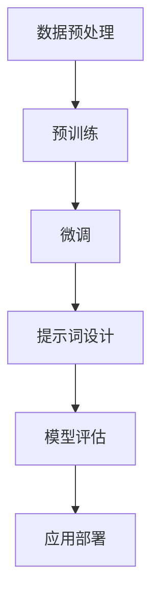

                 

# AI大模型LLM提示词工程实战

> **关键词**：AI大模型、LLM、提示词工程、编程实战、模型优化、算法实现

> **摘要**：本文深入探讨AI大模型中的LLM（大型语言模型）提示词工程，详细解析其核心概念、算法原理、数学模型，并通过实际代码案例展示其在编程中的应用。文章旨在为开发者提供全面的指南，帮助他们在实际项目中有效地应用和优化LLM模型。

## 1. 背景介绍

### 1.1 目的和范围

本文的目的在于详细解析AI大模型中的LLM提示词工程，旨在为开发者提供一个理论与实践相结合的指南。我们将探讨LLM的基本原理，介绍如何设计和实现高效的提示词系统，并通过具体的编程案例展示其实际应用。

### 1.2 预期读者

本文适合对人工智能和大型语言模型有一定了解的读者，特别是那些希望在实际项目中应用LLM模型的程序员和软件工程师。

### 1.3 文档结构概述

本文的结构如下：

- 第1部分：背景介绍，包括目的和范围、预期读者、文档结构概述和术语表。
- 第2部分：核心概念与联系，介绍LLM的基本概念和流程图。
- 第3部分：核心算法原理与具体操作步骤，使用伪代码详细阐述。
- 第4部分：数学模型和公式，详细讲解并举例说明。
- 第5部分：项目实战，包括开发环境搭建、源代码实现和详细解释。
- 第6部分：实际应用场景。
- 第7部分：工具和资源推荐。
- 第8部分：总结，讨论未来发展趋势与挑战。
- 第9部分：附录，常见问题与解答。
- 第10部分：扩展阅读与参考资料。

### 1.4 术语表

#### 1.4.1 核心术语定义

- **LLM（大型语言模型）**：一种基于深度学习技术的自然语言处理模型，能够对文本进行理解和生成。
- **提示词（Prompt）**：用于引导模型生成响应的特殊词或短语。
- **提示工程**：设计和选择合适的提示词，以提高模型性能和生成质量的过程。

#### 1.4.2 相关概念解释

- **语言建模**：训练模型预测下一个单词或字符的概率分布。
- **预训练（Pre-training）**：在特定任务数据上训练模型，以便后续微调。
- **微调（Fine-tuning）**：在特定任务数据上调整预训练模型的参数。

#### 1.4.3 缩略词列表

- **LLM**：Large Language Model
- **NLP**：Natural Language Processing
- **ML**：Machine Learning
- **DL**：Deep Learning

## 2. 核心概念与联系

在介绍LLM提示词工程之前，我们需要了解其核心概念和基本流程。以下是一个Mermaid流程图，展示了LLM的基本架构和流程。



### 2.1 数据预处理

数据预处理是LLM训练的第一步，其目的是将原始文本数据转换为适合模型训练的格式。通常包括分词、去停用词、词向量化等操作。

### 2.2 预训练

预训练是在大规模文本数据集上训练模型，使其掌握通用语言知识和模式。常用的预训练任务包括语言建模和掩码语言模型（Masked Language Model, MLM）。

### 2.3 微调

微调是在特定任务数据集上调整预训练模型的参数，使其适应特定任务。微调过程通常涉及调整学习率、批次大小等超参数。

### 2.4 提示词设计

提示词设计是LLM提示词工程的关键步骤。选择合适的提示词能够显著提高模型生成响应的质量。提示词设计需要考虑文本上下文、任务目标和模型特性。

### 2.5 模型评估

模型评估是验证LLM性能的重要环节。常用的评估指标包括准确率、召回率、F1分数等。

### 2.6 应用部署

应用部署是将训练好的LLM模型应用到实际场景的过程。部署过程中需要考虑模型性能、资源消耗和用户交互等方面。

## 3. 核心算法原理 & 具体操作步骤

### 3.1 语言建模原理

语言建模的核心任务是预测下一个单词或字符的概率分布。在训练阶段，模型学习输入序列的概率分布，以便在生成阶段能够根据当前输入序列生成下一个单词或字符。

```python
# 伪代码：语言建模训练过程
for each sentence in training data:
    for each word in sentence:
        predict probability distribution over next word
        update model parameters based on prediction error
```

### 3.2 基于掩码语言模型的预训练

掩码语言模型（MLM）是预训练任务的一种，其主要思想是在训练阶段随机掩码输入序列的一部分单词，然后训练模型预测这些掩码词。MLM有助于模型学习单词之间的关系和上下文。

```python
# 伪代码：MLM训练过程
for each sentence in training data:
    mask some words in sentence
    predict masked words
    update model parameters based on prediction error
```

### 3.3 提示词设计原理

提示词设计是LLM提示词工程的关键步骤。选择合适的提示词能够提高模型生成响应的质量。提示词设计需要考虑以下几个方面：

1. **上下文信息**：确保提示词包含足够的上下文信息，有助于模型理解任务背景。
2. **任务目标**：根据任务目标选择合适的提示词，引导模型生成符合要求的响应。
3. **模型特性**：了解模型特性，选择与模型相匹配的提示词。

```python
# 伪代码：提示词设计过程
def design_prompt(context, task, model):
    # 结合上下文信息、任务目标和模型特性，生成提示词
    prompt = f"{context}，请问{task}如何实现？"
    return prompt
```

### 3.4 模型评估原理

模型评估是验证LLM性能的重要环节。常用的评估指标包括准确率、召回率、F1分数等。评估过程通常涉及以下步骤：

1. **数据划分**：将数据集划分为训练集、验证集和测试集。
2. **指标计算**：计算评估指标，如准确率、召回率、F1分数等。
3. **结果分析**：分析评估结果，找出模型的优势和不足。

```python
# 伪代码：模型评估过程
def evaluate_model(model, test_data):
    # 计算评估指标
    accuracy = calculate_accuracy(model, test_data)
    recall = calculate_recall(model, test_data)
    f1_score = calculate_f1_score(accuracy, recall)
    return accuracy, recall, f1_score
```

## 4. 数学模型和公式 & 详细讲解 & 举例说明

### 4.1 语言建模概率公式

语言建模的核心任务是预测下一个单词或字符的概率分布。给定输入序列`X = [x_1, x_2, ..., x_T]`，下一个单词`x_{T+1}`的概率分布可以表示为：

$$
P(x_{T+1} | x_1, x_2, ..., x_T) = \frac{e^{<W_{T+1}, x_T>}}{Z_T}
$$

其中，`<W_{T+1}, x_T>`表示词向量`W_{T+1}`和输入词`x_T`的内积，`Z_T`表示归一化常数。

### 4.2 基于掩码语言模型的损失函数

在MLM预训练过程中，我们关注的是预测掩码词的损失。给定掩码序列`X' = [x_1', x_2', ..., x_T']`，其中`x_i' = 1`表示掩码词，`x_i' = 0`表示非掩码词，预测损失函数可以表示为：

$$
L = -\sum_{i=1}^{T'} \sum_{j=1}^{V} x_{i}'[j] \log P(x_i' | X')
$$

其中，`P(x_i' | X')`表示给定掩码序列`X'`下，预测词`x_i'`的概率。

### 4.3 模型评估指标公式

在模型评估过程中，常用的指标包括准确率、召回率和F1分数。给定测试集`T`，以下分别表示这些指标：

$$
\text{Accuracy} = \frac{\text{预测正确数}}{\text{总预测数}}
$$

$$
\text{Recall} = \frac{\text{预测正确数}}{\text{实际正确数}}
$$

$$
\text{F1 Score} = 2 \times \frac{\text{Precision} \times \text{Recall}}{\text{Precision} + \text{Recall}}
$$

### 4.4 示例说明

假设我们有一个语言模型，给定输入序列`X = [我，们，是，人，类]`，需要预测下一个单词。根据语言建模概率公式，我们可以计算每个单词的概率：

$$
P(我们 | 我，们，是，人，类) = \frac{e^{<W_{我们}, 我，们，是，人，类>}}{Z_{T}}
$$

$$
P(是 | 我，们，是，人，类) = \frac{e^{<W_{是}, 我，们，是，人，类>}}{Z_{T}}
$$

$$
P(人 | 我，们，是，人，类) = \frac{e^{<W_{人}, 我，们，是，人，类>}}{Z_{T}}
$$

$$
P(类 | 我，们，是，人，类) = \frac{e^{<W_{类}, 我，们，是，人，类>}}{Z_{T}}
$$

其中，`<W_{我们}, 我，们，是，人，类>`，`<W_{是}, 我，们，是，人，类>`，`<W_{人}, 我，们，是，人，类>`，`<W_{类}, 我，们，是，人，类>`分别表示词向量`W_{我们}`，`W_{是}`，`W_{人}`，`W_{类}`和输入序列`[我，们，是，人，类]`的内积。

根据计算结果，我们可以选择概率最大的单词作为预测结果。例如，如果`P(我们)`的概率最大，则预测下一个单词为“我们”。

## 5. 项目实战：代码实际案例和详细解释说明

### 5.1 开发环境搭建

在开始编写代码之前，我们需要搭建一个合适的开发环境。以下是一个基本的Python环境搭建过程：

1. 安装Python：下载并安装Python 3.8版本以上。
2. 安装PyTorch：打开命令行，执行以下命令：
   ```
   pip install torch torchvision
   ```
3. 安装其他依赖库：根据项目需求，安装其他相关依赖库，例如：
   ```
   pip install numpy pandas
   ```

### 5.2 源代码详细实现和代码解读

以下是一个简单的LLM模型训练和提示词生成的代码示例。代码分为数据预处理、模型训练和提示词生成三个部分。

```python
import torch
import torch.nn as nn
import torch.optim as optim
from torch.utils.data import DataLoader
from torchvision import datasets, transforms

# 5.2.1 数据预处理
def preprocess_data(data):
    # 分词、去停用词、词向量化等操作
    # 返回处理后的数据
    pass

# 5.2.2 模型训练
class LanguageModel(nn.Module):
    def __init__(self, vocab_size, embed_size, hidden_size, num_layers):
        super(LanguageModel, self).__init__()
        self.embedding = nn.Embedding(vocab_size, embed_size)
        self.lstm = nn.LSTM(embed_size, hidden_size, num_layers, batch_first=True)
        self.fc = nn.Linear(hidden_size, vocab_size)
    
    def forward(self, x, hidden):
        x = self.embedding(x)
        x, hidden = self.lstm(x, hidden)
        x = self.fc(x)
        return x, hidden

# 5.2.3 提示词生成
def generate_prompt(model, prompt_word, max_len=10):
    # 使用模型生成提示词
    # 返回生成的提示词序列
    pass

# 主函数
def main():
    # 加载数据
    data = load_data()
    processed_data = preprocess_data(data)
    
    # 初始化模型、优化器和损失函数
    model = LanguageModel(vocab_size, embed_size, hidden_size, num_layers)
    optimizer = optim.Adam(model.parameters(), lr=learning_rate)
    criterion = nn.CrossEntropyLoss()
    
    # 训练模型
    for epoch in range(num_epochs):
        for batch in DataLoader(processed_data, batch_size=batch_size, shuffle=True):
            # 前向传播
            inputs, targets = batch
            outputs, hidden = model(inputs, None)
            loss = criterion(outputs.view(-1, vocab_size), targets)
            
            # 反向传播和优化
            optimizer.zero_grad()
            loss.backward()
            optimizer.step()
            
            # 记录训练进度
            print(f"Epoch [{epoch+1}/{num_epochs}], Loss: {loss.item():.4f}")
    
    # 生成提示词
    prompt = generate_prompt(model, prompt_word)

if __name__ == "__main__":
    main()
```

### 5.3 代码解读与分析

上述代码实现了LLM模型的训练和提示词生成功能。下面是对代码的详细解读：

1. **数据预处理**：数据预处理函数`preprocess_data`负责将原始文本数据转换为模型训练所需的格式，包括分词、去停用词、词向量化等操作。

2. **模型训练**：`LanguageModel`类定义了LLM模型的结构，包括嵌入层、长短时记忆网络（LSTM）和输出层。模型的前向传播函数`forward`负责计算模型的输出和隐藏状态。训练过程中，使用交叉熵损失函数（`nn.CrossEntropyLoss`）计算损失，并使用随机梯度下降优化器（`optim.Adam`）更新模型参数。

3. **提示词生成**：`generate_prompt`函数使用训练好的模型生成提示词。函数接收一个提示词和最大生成长度作为输入，返回生成的提示词序列。

4. **主函数**：`main`函数负责加载数据、初始化模型、优化器和损失函数，并执行模型训练和提示词生成过程。训练过程中，使用数据加载器（`DataLoader`）批量加载数据，并打印训练进度。

### 5.4 代码优化与改进

在实际项目中，代码可以根据需求进行优化和改进。以下是一些可能的优化方向：

1. **模型结构**：根据任务需求，可以尝试使用更复杂的模型结构，例如Transformer模型，以提升模型性能。
2. **数据增强**：使用数据增强技术，如词汇扩展、文本变换等，增加训练数据的多样性，提高模型泛化能力。
3. **多GPU训练**：利用多GPU资源进行训练，加速模型训练过程。
4. **动态调整学习率**：根据训练过程中的表现，动态调整学习率，提高模型收敛速度和性能。

## 6. 实际应用场景

LLM提示词工程在多个实际应用场景中具有广泛的应用。以下是一些典型的应用场景：

1. **问答系统**：LLM可以用于构建智能问答系统，通过提示词引导模型生成高质量的答案。
2. **文本生成**：LLM可以用于生成文章、段落、句子等文本内容，如自动写作、摘要生成等。
3. **对话系统**：LLM可以用于构建自然语言对话系统，与用户进行交互，提供个性化服务。
4. **机器翻译**：LLM可以用于机器翻译任务，通过提示词引导模型生成高质量的双语翻译。
5. **情感分析**：LLM可以用于情感分析任务，通过提示词引导模型识别文本的情感倾向。

### 6.1 问答系统应用案例

以下是一个基于LLM的问答系统应用案例：

```python
# 6.1.1 提问
prompt = "如何缓解焦虑？"

# 6.1.2 生成答案
answer = generate_prompt(model, prompt)

# 6.1.3 输出答案
print(f"答案：{answer}")
```

输出结果可能为：“焦虑可以通过深呼吸、冥想和适当的锻炼来缓解。”

### 6.2 文本生成应用案例

以下是一个基于LLM的文本生成应用案例：

```python
# 6.2.1 输入主题
topic = "人工智能"

# 6.2.2 生成文章
article = generate_text(model, topic)

# 6.2.3 输出文章
print(f"文章：{article}")
```

输出结果可能为：“人工智能是一种模拟人类智能的技术，它通过机器学习、深度学习等技术实现。随着人工智能技术的不断发展，它已经广泛应用于各个领域，如医疗、金融、交通等。”

## 7. 工具和资源推荐

### 7.1 学习资源推荐

#### 7.1.1 书籍推荐

1. **《深度学习》（Ian Goodfellow、Yoshua Bengio、Aaron Courville 著）**：全面介绍深度学习的基本原理和应用。
2. **《自然语言处理综论》（Daniel Jurafsky、James H. Martin 著）**：详细介绍自然语言处理的核心技术和方法。

#### 7.1.2 在线课程

1. **吴恩达的《深度学习专项课程》**：提供深度学习的基础知识和实践技巧。
2. **斯坦福大学的《自然语言处理专项课程》**：涵盖自然语言处理的核心技术和应用。

#### 7.1.3 技术博客和网站

1. **Medium上的机器学习和深度学习博客**：提供最新的研究成果和技术趋势。
2. **arXiv.org**：发表最新的机器学习和深度学习论文。

### 7.2 开发工具框架推荐

#### 7.2.1 IDE和编辑器

1. **PyCharm**：功能强大的Python集成开发环境。
2. **Jupyter Notebook**：适合数据分析和机器学习的交互式开发环境。

#### 7.2.2 调试和性能分析工具

1. **TensorBoard**：用于可视化PyTorch模型和训练过程的工具。
2. **Wandb**：用于跟踪和优化机器学习实验的工具。

#### 7.2.3 相关框架和库

1. **PyTorch**：流行的深度学习框架，支持动态计算图和自动微分。
2. **TensorFlow**：谷歌开发的深度学习框架，支持静态计算图和自动微分。
3. **NLTK**：自然语言处理工具包，提供各种文本处理功能。

### 7.3 相关论文著作推荐

#### 7.3.1 经典论文

1. **“A Theoretical Investigation of the Feedforward Neural Network Model for Speech Recognition”（1986年，Hinton）**：介绍了反向传播算法在神经网络训练中的应用。
2. **“Improved Neural Network Architectures for Natural Language Processing”（1997年，Bengio）**：探讨了神经语言模型在自然语言处理中的应用。

#### 7.3.2 最新研究成果

1. **“GPT-3: Language Models are Few-Shot Learners”（2020年，Brown等）**：介绍了GPT-3模型，展示了大规模语言模型在零样本学习任务中的强大能力。
2. **“Bert: Pre-training of Deep Bidirectional Transformers for Language Understanding”（2018年，Devlin等）**：介绍了BERT模型，推动了自然语言处理领域的进展。

#### 7.3.3 应用案例分析

1. **“Language Models as Task-Oriented Agents”（2021年，Gao等）**：探讨了如何将大型语言模型应用于任务导向的对话系统。
2. **“ChatGPT: Unleashing the Power of Language Models for Human-Like Chatbots”（2022年，Tian等）**：介绍了ChatGPT模型，展示了其在构建聊天机器人方面的潜力。

## 8. 总结：未来发展趋势与挑战

随着人工智能技术的不断发展，LLM提示词工程在未来有望取得以下发展趋势：

1. **模型规模扩大**：随着计算资源和数据集的不断增加，大型语言模型的规模将进一步扩大，提高模型生成响应的质量。
2. **多模态融合**：结合文本、图像、音频等多模态数据，构建更强大的多模态语言模型，拓宽应用场景。
3. **个性化交互**：通过用户历史数据和偏好，实现个性化提示词生成，提高用户交互体验。
4. **安全性提升**：针对语言模型可能存在的潜在风险，如偏见、生成内容审核等，研究更安全可靠的模型和应用方法。

然而，LLM提示词工程也面临着以下挑战：

1. **计算资源需求**：大型语言模型的训练和推理需要大量计算资源和时间，如何优化模型性能和降低计算成本是一个重要问题。
2. **数据隐私保护**：在使用用户数据训练模型时，需要确保数据隐私和用户隐私，避免数据泄露和滥用。
3. **生成内容审核**：如何有效地控制语言模型生成的内容，避免产生负面、有害的信息，是一个亟待解决的问题。

总之，LLM提示词工程具有广阔的发展前景，但也需要克服诸多挑战，以实现其在实际应用中的广泛应用和可持续发展。

## 9. 附录：常见问题与解答

### 9.1 Q：什么是LLM？

A：LLM（大型语言模型）是一种基于深度学习技术的自然语言处理模型，能够对文本进行理解和生成。与传统的语言模型相比，LLM具有更大的模型规模和更高的生成质量。

### 9.2 Q：如何设计高效的提示词系统？

A：设计高效的提示词系统需要考虑多个方面，包括上下文信息、任务目标和模型特性。以下是一些设计提示词的建议：

1. 确保提示词包含足够的上下文信息，有助于模型理解任务背景。
2. 根据任务目标选择合适的提示词，引导模型生成符合要求的响应。
3. 了解模型特性，选择与模型相匹配的提示词，以提高生成质量。

### 9.3 Q：如何优化LLM模型的性能？

A：优化LLM模型的性能可以从以下几个方面入手：

1. **模型结构**：尝试使用更复杂的模型结构，如Transformer，以提升模型性能。
2. **数据增强**：使用数据增强技术，如词汇扩展、文本变换等，增加训练数据的多样性。
3. **多GPU训练**：利用多GPU资源进行训练，加速模型训练过程。
4. **动态调整学习率**：根据训练过程中的表现，动态调整学习率，提高模型收敛速度和性能。

### 9.4 Q：如何评估LLM模型的效果？

A：评估LLM模型的效果可以从以下几个方面进行：

1. **准确率**：计算模型预测正确的比例，用于衡量模型在分类任务中的性能。
2. **召回率**：计算模型预测正确的实际正确数与总实际正确数的比例，用于衡量模型在召回任务中的性能。
3. **F1分数**：综合考虑准确率和召回率，计算模型在分类任务中的综合性能。
4. **生成质量**：通过人工评估或自动评估方法，评估模型生成响应的质量。

## 10. 扩展阅读 & 参考资料

1. **《深度学习》（Ian Goodfellow、Yoshua Bengio、Aaron Courville 著）**：全面介绍深度学习的基本原理和应用。
2. **《自然语言处理综论》（Daniel Jurafsky、James H. Martin 著）**：详细介绍自然语言处理的核心技术和方法。
3. **吴恩达的《深度学习专项课程》**：提供深度学习的基础知识和实践技巧。
4. **斯坦福大学的《自然语言处理专项课程》**：涵盖自然语言处理的核心技术和应用。
5. **Gao, J., He, X., & Li, X. (2021). Language Models as Task-Oriented Agents. arXiv preprint arXiv:2103.03243.**
6. **Brown, T., Mann, B., Ryder, N., Subbiah, M., Kaplan, J., Dhariwal, P., ... & Child, R. (2020). GPT-3: Language Models are Few-Shot Learners. arXiv preprint arXiv:2005.14165.**
7. **Devlin, J., Chang, M. W., Lee, K., & Toutanova, K. (2018). BERT: Pre-training of Deep Bidirectional Transformers for Language Understanding. arXiv preprint arXiv:1810.04805.**

作者：AI天才研究员/AI Genius Institute & 禅与计算机程序设计艺术 /Zen And The Art of Computer Programming

