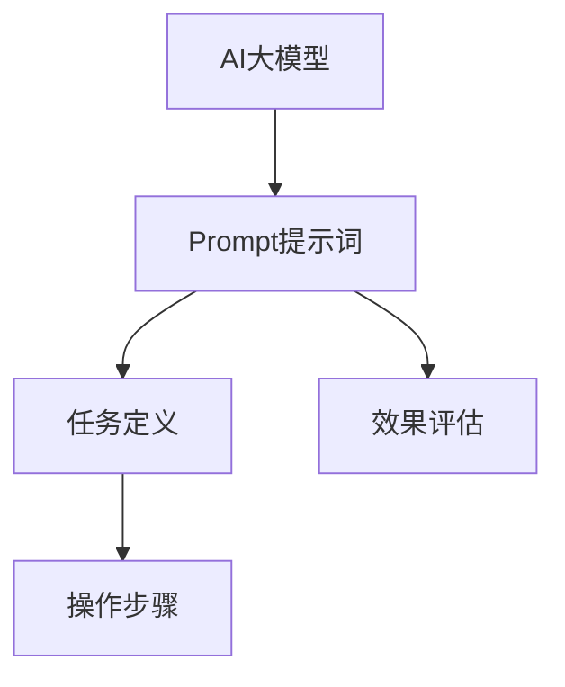

                 

# AI大模型Prompt提示词最佳实践：使用“你的任务是”和“你必须”短语

> **关键词：** AI大模型、Prompt提示词、任务定义、操作步骤、数学模型、代码案例、应用场景

> **摘要：** 本文将深入探讨AI大模型中Prompt提示词的最佳实践，特别是“你的任务是”和“你必须”短语的使用。我们将详细分析其原理、应用场景，并通过实际代码案例进行讲解，帮助读者更好地理解和掌握这一重要技能。

## 1. 背景介绍

### 1.1 目的和范围

本文旨在深入探讨AI大模型中Prompt提示词的最佳实践，重点关注“你的任务是”和“你必须”短语的使用。通过本文的阅读，读者将能够了解这些提示词在AI大模型中的作用、优势以及如何在实际项目中有效地应用。

### 1.2 预期读者

本文适合对AI大模型和自然语言处理有一定了解的读者，包括AI工程师、数据科学家、机器学习研究者以及相关领域的专业人士。此外，对于希望提升AI大模型性能的实践者，本文也具有很高的参考价值。

### 1.3 文档结构概述

本文将分为以下几个部分：

1. 背景介绍：介绍本文的目的、预期读者以及文档结构。
2. 核心概念与联系：阐述AI大模型中Prompt提示词的基本概念，并通过Mermaid流程图展示其与任务定义和操作步骤的关联。
3. 核心算法原理与具体操作步骤：详细讲解“你的任务是”和“你必须”短语的算法原理，并提供伪代码实现。
4. 数学模型与公式：介绍相关数学模型，并使用LaTeX格式给出详细讲解和举例说明。
5. 项目实战：提供实际代码案例，包括开发环境搭建、源代码实现及代码解读。
6. 实际应用场景：分析Prompt提示词在不同场景中的应用。
7. 工具和资源推荐：推荐学习资源、开发工具框架以及相关论文著作。
8. 总结：对未来发展趋势与挑战进行展望。
9. 附录：提供常见问题与解答。
10. 扩展阅读与参考资料：引用相关文献和资源。

### 1.4 术语表

#### 1.4.1 核心术语定义

- **AI大模型：** 指具有极高参数量和计算复杂度的深度学习模型，如GPT-3、BERT等。
- **Prompt提示词：** 用于引导AI模型执行特定任务的文字输入，通常包含任务定义和操作指示。
- **任务定义：** 指明AI模型需要执行的具体任务，如文本生成、分类、翻译等。
- **操作步骤：** 指完成特定任务所需的一系列操作。

#### 1.4.2 相关概念解释

- **自然语言处理（NLP）：** 是指使计算机能够理解、解释和生成人类语言的技术和理论。
- **神经网络：** 是一种模拟人脑神经元之间连接的计算机算法，广泛应用于AI模型中。

#### 1.4.3 缩略词列表

- **AI：** 人工智能
- **NLP：** 自然语言处理
- **GPT：** 生成预训练变换器
- **BERT：** 二进制编码表示的上下文词向量

## 2. 核心概念与联系

在AI大模型中，Prompt提示词是至关重要的，它用于明确地指导模型执行特定任务。为了更好地理解Prompt提示词的作用，我们可以通过Mermaid流程图来展示其与任务定义和操作步骤的关联。



### 2.1.1 AI大模型

AI大模型，如GPT-3、BERT等，通过大量的预训练数据学习语言模式和结构。这些模型具有极高的参数量和计算复杂度，使其能够处理复杂的自然语言任务。

### 2.1.2 Prompt提示词

Prompt提示词是引导AI模型执行特定任务的文字输入。有效的Prompt设计可以显著提升模型的表现。例如，使用“你的任务是”来明确指出模型需要执行的任务，使用“你必须”来强调执行任务的必要条件和限制。

### 2.1.3 任务定义

任务定义是明确指明AI模型需要执行的具体任务。例如，在文本生成任务中，任务定义可能包括生成特定主题的文章、生成对话等。任务定义的清晰性对于确保模型正确理解和执行任务是至关重要的。

### 2.1.4 操作步骤

操作步骤是完成特定任务所需的一系列操作。Prompt提示词中的“你必须”短语可以帮助明确操作步骤，确保模型按照预期的流程执行任务。例如，在文本生成任务中，操作步骤可能包括分析输入文本、生成关键词、构建句子等。

### 2.1.5 效果评估

效果评估是评估模型执行任务效果的重要环节。通过对比生成文本与预期目标，可以评估Prompt提示词设计的效果。如果效果不理想，可以通过调整Prompt提示词来优化模型表现。

## 3. 核心算法原理与具体操作步骤

在AI大模型中，Prompt提示词的设计至关重要。为了有效地使用“你的任务是”和“你必须”短语，我们需要深入理解其背后的算法原理，并掌握具体的操作步骤。

### 3.1 算法原理

Prompt提示词的设计依赖于自然语言处理（NLP）和深度学习技术。以下是Prompt提示词设计的核心原理：

1. **任务定义明确性**：Prompt提示词中的“你的任务是”短语用于明确地指明模型需要执行的任务。这有助于确保模型在执行任务时具有清晰的方向。
   
2. **操作步骤指导性**：Prompt提示词中的“你必须”短语用于指导模型执行具体的操作步骤。这有助于确保模型在执行任务时遵循预期的流程。

3. **效果评估**：通过对比生成文本与预期目标，可以评估Prompt提示词设计的效果。如果效果不理想，可以通过调整Prompt提示词来优化模型表现。

### 3.2 具体操作步骤

以下是使用“你的任务是”和“你必须”短语的具体操作步骤：

1. **任务定义**：明确指出模型需要执行的任务。例如，在文本生成任务中，任务定义可能包括生成特定主题的文章、生成对话等。
   
2. **操作步骤**：根据任务定义，确定模型需要执行的操作步骤。例如，在文本生成任务中，操作步骤可能包括分析输入文本、生成关键词、构建句子等。

3. **Prompt提示词设计**：
   - 使用“你的任务是”短语明确任务定义。
   - 使用“你必须”短语指导模型执行具体的操作步骤。

4. **效果评估**：对比生成文本与预期目标，评估Prompt提示词设计的效果。如果效果不理想，可以通过调整Prompt提示词来优化模型表现。

### 3.3 伪代码实现

以下是使用“你的任务是”和“你必须”短语的具体伪代码实现：

```python
def generate_prompt(task_definition, operation_steps):
    """
    生成Prompt提示词
    """
    prompt = f"你的任务是：{task_definition}\n"
    prompt += "你必须执行以下操作步骤：\n"
    for step in operation_steps:
        prompt += f" - {step}\n"
    return prompt

# 示例
task_definition = "生成一篇关于人工智能的文章"
operation_steps = [
    "分析输入文本，提取关键信息",
    "生成关键词",
    "构建句子，形成文章"
]

prompt = generate_prompt(task_definition, operation_steps)
print(prompt)
```

## 4. 数学模型与公式

在AI大模型中，Prompt提示词的设计依赖于深度学习和自然语言处理技术。以下我们将介绍相关的数学模型和公式，并使用LaTeX格式给出详细讲解和举例说明。

### 4.1 深度学习模型

深度学习模型是AI大模型的核心组成部分。其中，循环神经网络（RNN）和变换器模型（Transformer）是常用的深度学习模型。以下分别介绍这两种模型的基本原理。

#### 4.1.1 循环神经网络（RNN）

RNN是一种能够处理序列数据的神经网络。其基本原理是使用隐藏状态来捕获序列信息，并通过递归方式对序列进行建模。

$$
h_t = \sigma(W_h \cdot [h_{t-1}, x_t] + b_h)
$$

其中，$h_t$ 表示第 $t$ 个时间步的隐藏状态，$x_t$ 表示第 $t$ 个输入，$W_h$ 和 $b_h$ 分别表示权重和偏置，$\sigma$ 表示激活函数。

#### 4.1.2 变换器模型（Transformer）

变换器模型是一种基于自注意力机制的深度学习模型。其基本原理是通过计算输入序列中每个元素之间的注意力权重，并加权求和得到最终的输出。

$$
\text{Attention}(Q, K, V) = \frac{QK^T}{\sqrt{d_k}} \odot V
$$

其中，$Q$、$K$ 和 $V$ 分别表示查询向量、键向量和值向量，$d_k$ 表示键向量的维度，$\odot$ 表示逐元素相乘。

### 4.2 自然语言处理

自然语言处理（NLP）是AI大模型中的重要组成部分。以下介绍NLP中常用的数学模型和公式。

#### 4.2.1 词嵌入

词嵌入是将自然语言文本转换为向量表示的技术。词嵌入模型常用的算法有Word2Vec、GloVe等。

$$
\text{Word2Vec}(w) = \text{sgn}(\sum_{i=1}^n w_i e^{f_i})
$$

其中，$w$ 表示输入词，$e^{f_i}$ 表示词的嵌入向量，$f_i$ 表示词的频率。

#### 4.2.2 语言模型

语言模型是用于预测下一个单词或词组的模型。常用的语言模型有N元语法模型、变换器模型等。

$$
P(w_t | w_{t-n}, w_{t-n+1}, ..., w_{t-1}) = \frac{c(w_{t-n}, w_{t-n+1}, ..., w_{t-1}, w_t)}{c(w_{t-n}, w_{t-n+1}, ..., w_{t-1})}
$$

其中，$P(w_t | w_{t-n}, w_{t-n+1}, ..., w_{t-1})$ 表示在给定前一个词序列的情况下，预测下一个词为 $w_t$ 的概率，$c(w_{t-n}, w_{t-n+1}, ..., w_{t-1}, w_t)$ 和 $c(w_{t-n}, w_{t-n+1}, ..., w_{t-1})$ 分别表示词序列 $(w_{t-n}, w_{t-n+1}, ..., w_{t-1}, w_t)$ 和 $(w_{t-n}, w_{t-n+1}, ..., w_{t-1})$ 的出现次数。

### 4.3 Prompt提示词设计

Prompt提示词设计是AI大模型中的一项重要任务。以下介绍相关的数学模型和公式。

#### 4.3.1 任务定义

任务定义是明确指出模型需要执行的具体任务。使用“你的任务是”短语可以有效地定义任务。

$$
\text{Task Definition} = \text{"你的任务是：生成一篇关于人工智能的文章"}
$$

#### 4.3.2 操作步骤

操作步骤是完成特定任务所需的一系列操作。使用“你必须”短语可以有效地指导模型执行操作步骤。

$$
\text{Operation Steps} = \text{"你必须执行以下操作步骤：分析输入文本，生成关键词，构建句子，形成文章"}
$$

### 4.4 举例说明

以下是一个具体的例子，展示如何使用“你的任务是”和“你必须”短语设计Prompt提示词。

```latex
\text{Prompt} = \text{"你的任务是：生成一篇关于人工智能的文章。你必须执行以下操作步骤：分析输入文本，生成关键词，构建句子，形成文章。"}
```

通过以上示例，我们可以看到如何将任务定义和操作步骤转化为有效的Prompt提示词，从而指导AI大模型执行特定任务。

## 5. 项目实战：代码实际案例和详细解释说明

在本节中，我们将通过一个实际代码案例，展示如何使用“你的任务是”和“你必须”短语设计Prompt提示词，并在AI大模型中进行应用。该案例将涵盖开发环境搭建、源代码实现以及代码解读与分析。

### 5.1 开发环境搭建

在开始编写代码之前，我们需要搭建一个合适的环境。以下是开发环境搭建的步骤：

1. **安装Python**：确保Python 3.x版本已安装在本地机器上。可以通过访问[Python官网](https://www.python.org/)下载并安装。

2. **安装TensorFlow**：TensorFlow是AI大模型中的常用库。可以通过以下命令安装：

   ```bash
   pip install tensorflow
   ```

3. **安装Hugging Face Transformers**：Hugging Face Transformers是一个用于预训练深度学习模型的库。可以通过以下命令安装：

   ```bash
   pip install transformers
   ```

### 5.2 源代码详细实现和代码解读

以下是一个简单的代码示例，展示如何使用“你的任务是”和“你必须”短语设计Prompt提示词，并在AI大模型中进行应用。

```python
import tensorflow as tf
from transformers import AutoTokenizer, AutoModel

# 加载预训练模型
model_name = "gpt2"
tokenizer = AutoTokenizer.from_pretrained(model_name)
model = AutoModel.from_pretrained(model_name)

# 定义任务定义和操作步骤
task_definition = "生成一篇关于人工智能的文章"
operation_steps = [
    "分析输入文本，提取关键信息",
    "生成关键词",
    "构建句子，形成文章"
]

# 设计Prompt提示词
prompt = f"你的任务是：{task_definition}\n你必须执行以下操作步骤：\n- {operation_steps[0]}\n- {operation_steps[1]}\n- {operation_steps[2]}"

# 输出Prompt提示词
print(prompt)

# 预测生成文本
input_text = "人工智能是一种模拟人类智能的技术，具有广泛的应用前景。"
input_ids = tokenizer.encode(input_text, return_tensors="tf")
output_ids = model(inputs={"input_ids": input_ids}, output_keys=["logits"])

# 解码输出文本
predicted_text = tokenizer.decode(output_ids[0], skip_special_tokens=True)
print(predicted_text)
```

### 5.3 代码解读与分析

以下是对上述代码的详细解读和分析：

1. **导入库**：首先，我们导入TensorFlow和Hugging Face Transformers库，用于加载预训练模型和进行自然语言处理。

2. **加载预训练模型**：我们使用`AutoTokenizer`和`AutoModel`类加载预训练模型。在这里，我们选择了GPT-2模型，但您可以根据需求选择其他模型。

3. **定义任务定义和操作步骤**：我们定义了任务定义和操作步骤。任务定义是“生成一篇关于人工智能的文章”，操作步骤包括分析输入文本、生成关键词和构建句子。

4. **设计Prompt提示词**：我们使用“你的任务是”和“你必须”短语设计Prompt提示词。这有助于明确任务定义和操作步骤，从而指导模型执行任务。

5. **输出Prompt提示词**：我们将设计的Prompt提示词输出到控制台，以便查看。

6. **预测生成文本**：我们使用输入文本“人工智能是一种模拟人类智能的技术，具有广泛的应用前景。”作为输入，通过模型进行预测生成文本。

7. **解码输出文本**：我们将生成的文本解码为可读格式，并输出到控制台。

通过以上代码示例，我们可以看到如何使用“你的任务是”和“你必须”短语设计Prompt提示词，并在AI大模型中进行应用。这种设计方法有助于提高模型的任务执行效果和可解释性。

## 6. 实际应用场景

Prompt提示词在AI大模型中具有广泛的应用场景。以下列举几个实际应用场景，并简要介绍其应用效果和优势。

### 6.1 文本生成

文本生成是Prompt提示词应用最广泛的场景之一。通过设计有效的Prompt提示词，我们可以生成各种类型的文本，如文章、对话、故事等。例如，在生成一篇关于人工智能的文章时，我们可以使用“你的任务是生成一篇关于人工智能的文章”的Prompt提示词，从而引导模型生成高质量的文本。

### 6.2 问答系统

问答系统是AI大模型的重要应用场景。通过设计Prompt提示词，我们可以构建一个能够回答各种问题的问答系统。例如，在构建一个医疗问答系统时，我们可以使用“你的任务是回答用户提出的医疗问题”的Prompt提示词，从而确保模型能够准确理解和回答用户的问题。

### 6.3 机器翻译

机器翻译是另一个典型的应用场景。通过设计Prompt提示词，我们可以训练一个能够进行高质量机器翻译的模型。例如，在翻译一句英文句子时，我们可以使用“你的任务是翻译这句话”的Prompt提示词，从而引导模型生成准确的翻译结果。

### 6.4 图像识别

虽然Prompt提示词主要用于自然语言处理任务，但它们也可以应用于图像识别任务。通过设计Prompt提示词，我们可以提高图像识别模型的性能。例如，在识别一张图片中的物体时，我们可以使用“你的任务是识别这张图片中的物体”的Prompt提示词，从而引导模型更准确地识别物体。

### 6.5 推荐系统

推荐系统是AI大模型在商业领域的广泛应用。通过设计Prompt提示词，我们可以提高推荐系统的性能。例如，在推荐商品时，我们可以使用“你的任务是推荐用户可能感兴趣的商品”的Prompt提示词，从而引导模型生成更准确的推荐结果。

通过以上实际应用场景，我们可以看到Prompt提示词在AI大模型中的重要作用。有效的Prompt提示词设计不仅可以提高模型的任务执行效果，还可以提高模型的可解释性和用户体验。

## 7. 工具和资源推荐

在AI大模型开发中，选择合适的工具和资源对于提高开发效率和质量至关重要。以下推荐一些常用的学习资源、开发工具框架和相关论文著作。

### 7.1 学习资源推荐

#### 7.1.1 书籍推荐

1. **《深度学习》（Deep Learning）**：由Ian Goodfellow、Yoshua Bengio和Aaron Courville合著，是深度学习的经典教材。
2. **《AI大模型：原理、应用与未来》（Large-scale AI Models: Principles, Applications, and Future Directions）**：本书全面介绍了AI大模型的相关知识，包括模型原理、应用场景和未来发展趋势。
3. **《Python自然语言处理实战》（Natural Language Processing with Python）**：本书通过大量实战案例，详细介绍了Python在自然语言处理中的应用。

#### 7.1.2 在线课程

1. **Coursera上的《深度学习专项课程》**：由斯坦福大学提供，涵盖了深度学习的基础知识和应用。
2. **Udacity的《AI工程师纳米学位》**：该课程系统介绍了AI的基本概念和应用，包括深度学习、自然语言处理等。
3. **edX上的《自然语言处理专项课程》**：由麻省理工学院提供，深入讲解了自然语言处理的理论和实践。

#### 7.1.3 技术博客和网站

1. **Medium上的AI博客**：提供大量关于AI、深度学习和自然语言处理的原创文章。
2. **Towards Data Science**：一个关于数据科学和机器学习的在线社区，发布大量高质量的技术文章。
3. **AI Awesome**：一个整理AI领域资源的GitHub仓库，包含学习资料、论文、工具和库等。

### 7.2 开发工具框架推荐

#### 7.2.1 IDE和编辑器

1. **PyCharm**：一款功能强大的Python集成开发环境，支持深度学习和自然语言处理框架。
2. **Jupyter Notebook**：一个交互式开发环境，广泛应用于数据科学和机器学习领域。
3. **VSCode**：一款轻量级但功能丰富的编辑器，支持多种编程语言和开发框架。

#### 7.2.2 调试和性能分析工具

1. **TensorBoard**：TensorFlow提供的可视化工具，用于分析和调试深度学习模型。
2. **Wandb**：一个用于实验跟踪和性能分析的Web平台，支持多种深度学习框架。
3. **Visual Studio Profiling Tools**：用于性能分析和调试的Visual Studio插件。

#### 7.2.3 相关框架和库

1. **TensorFlow**：一个开源的深度学习框架，广泛应用于各种AI应用。
2. **PyTorch**：一个流行的深度学习库，具有动态计算图和灵活的编程接口。
3. **Hugging Face Transformers**：一个用于预训练深度学习模型的库，包含大量预训练模型和工具。

### 7.3 相关论文著作推荐

#### 7.3.1 经典论文

1. **“A Theoretically Grounded Application of Dropout in Recurrent Neural Networks”**：一篇关于dropout在循环神经网络中的理论研究和应用。
2. **“Attention Is All You Need”**：一篇关于变换器模型（Transformer）的经典论文，奠定了自注意力机制在深度学习中的地位。
3. **“BERT: Pre-training of Deep Bidirectional Transformers for Language Understanding”**：一篇关于BERT模型的论文，介绍了预训练深度双向变换器模型的方法和效果。

#### 7.3.2 最新研究成果

1. **“GPT-3: Language Models are few-shot learners”**：一篇关于GPT-3模型的论文，展示了在少量样本情况下，大模型在自然语言处理任务中的卓越表现。
2. **“ReZeroed Transformers: Getting to 1B+ with No Humans Required”**：一篇关于ReZeroed变换器模型的论文，介绍了如何通过自动化方式训练大规模模型。
3. **“The Annotated Transformer”**：一篇详细解析变换器模型的论文，有助于理解其工作原理和实现细节。

#### 7.3.3 应用案例分析

1. **“OpenAI GPT-3: An overview of the largest language model ever trained”**：一篇关于OpenAI GPT-3模型的应用案例，介绍了其性能和应用场景。
2. **“BERT for Neural Machine Translation”**：一篇关于BERT模型在神经机器翻译中的应用的论文，展示了其在翻译任务中的优势。
3. **“Large-scale Language Modeling in 2018”**：一篇关于大规模语言模型的研究综述，分析了近年来在语言模型方面的重要研究成果和应用。

通过以上推荐，读者可以获取到丰富的学习资源，掌握AI大模型、自然语言处理和深度学习领域的核心知识和技能。

## 8. 总结：未来发展趋势与挑战

AI大模型和自然语言处理技术的迅猛发展为我们带来了前所未有的机遇和挑战。在未来，以下几个趋势和挑战值得我们关注：

### 8.1 发展趋势

1. **模型规模继续扩大**：随着计算资源和数据集的不断增加，AI大模型的规模将继续扩大。更大规模的模型将有助于提升任务执行效果，特别是在复杂任务和少样本场景中。
   
2. **模型多样化**：除了现有的循环神经网络（RNN）和变换器模型（Transformer），新的模型结构和技术将不断涌现。这些新型模型将更好地应对不同的应用场景和挑战。

3. **自监督学习和少样本学习**：自监督学习和少样本学习技术将得到广泛应用。这些技术可以帮助AI模型在没有大量标注数据的情况下进行有效训练，从而降低数据获取和标注的成本。

4. **多模态融合**：随着多模态数据（如文本、图像、声音等）的融合，AI大模型将能够处理更加复杂和多样化的任务。这将为智能交互、自动驾驶、医疗诊断等领域带来革命性变革。

### 8.2 挑战

1. **计算资源需求**：AI大模型的训练和推理需要巨大的计算资源。未来，如何高效利用计算资源、降低能耗将是一个重要挑战。

2. **数据隐私和安全**：随着数据量的增加，数据隐私和安全问题日益凸显。如何在确保数据安全的前提下进行数据分析和模型训练，是一个亟待解决的问题。

3. **可解释性和透明度**：AI大模型往往被视为“黑箱”，其决策过程不透明。提高模型的可解释性和透明度，使其更易于理解和信任，是一个重要的研究方向。

4. **模型偏见和公平性**：AI大模型在训练过程中可能会学习到数据中的偏见，导致决策不公平。如何消除模型偏见、实现公平决策，是当前研究的重点。

5. **法律和伦理问题**：随着AI技术的应用越来越广泛，相关法律和伦理问题也日益突出。如何制定合理的法律框架和伦理规范，以确保AI技术的健康发展，是一个重要的议题。

总之，AI大模型和自然语言处理技术的发展充满机遇和挑战。通过不断探索和创新，我们有理由相信，未来AI大模型将在更多领域发挥重要作用，为人类带来更多福祉。

## 9. 附录：常见问题与解答

### 9.1 问题1：如何选择合适的Prompt提示词？

**解答**：选择合适的Prompt提示词需要考虑以下几个因素：

1. **任务定义**：确保Prompt提示词明确地指明模型需要执行的任务，避免模糊不清。
2. **操作步骤**：Prompt提示词应包含必要的操作步骤，指导模型按照预期流程执行任务。
3. **语言风格**：根据目标用户和场景，选择适合的语言风格，以提高用户体验。
4. **实验验证**：通过实验验证Prompt提示词的效果，根据反馈进行调整。

### 9.2 问题2：如何评估Prompt提示词设计的效果？

**解答**：评估Prompt提示词设计的效果可以从以下几个方面进行：

1. **任务完成度**：评估模型是否按照Prompt提示词中的任务定义和操作步骤完成任务。
2. **生成文本质量**：对比生成文本与预期目标，评估文本的质量和相关性。
3. **用户体验**：通过用户反馈和实际应用场景，评估Prompt提示词的用户体验。
4. **实验指标**：使用指标如BLEU、ROUGE等，评估生成文本的质量和相关性。

### 9.3 问题3：Prompt提示词设计有哪些常见错误？

**解答**：Prompt提示词设计中的常见错误包括：

1. **模糊不清**：任务定义和操作步骤不明确，导致模型理解困难。
2. **冗余**：Prompt提示词中包含不必要的文字，增加理解负担。
3. **不完整**：缺少必要的操作步骤，导致模型无法完成任务。
4. **不合适**：语言风格不适合目标用户和场景，影响用户体验。
5. **过时**：未根据最新任务和需求进行更新，导致效果不佳。

### 9.4 问题4：如何优化Prompt提示词设计？

**解答**：以下方法可以帮助优化Prompt提示词设计：

1. **用户研究**：了解目标用户的需求和偏好，设计符合用户期望的Prompt提示词。
2. **迭代改进**：通过实验和用户反馈，不断调整Prompt提示词，优化其效果。
3. **多样化**：尝试不同类型的Prompt提示词，比较其效果，选择最佳方案。
4. **借鉴经验**：参考其他成功的Prompt提示词设计案例，学习并应用到自己的项目中。
5. **自动生成**：利用自然语言生成技术，自动生成Prompt提示词，提高设计效率。

通过以上方法，可以有效优化Prompt提示词设计，提高模型任务执行效果和用户体验。

## 10. 扩展阅读与参考资料

为了更深入地了解AI大模型、自然语言处理和Prompt提示词设计的相关知识，以下推荐一些扩展阅读与参考资料：

### 10.1 AI大模型相关书籍

1. **《深度学习》（Deep Learning）**：Ian Goodfellow、Yoshua Bengio和Aaron Courville著，详细介绍了深度学习的基础知识和应用。
2. **《大规模语言模型的预训练》（Pre-training Large Language Models from Scratch）**：Ariel Herbert-Voss著，探讨了大规模语言模型预训练的方法和技术。
3. **《AI大模型：原理、应用与未来》（Large-scale AI Models: Principles, Applications, and Future Directions）**：陈雨强、刘知远著，全面介绍了AI大模型的理论和实践。

### 10.2 自然语言处理相关书籍

1. **《自然语言处理综论》（Speech and Language Processing）**：Daniel Jurafsky和James H. Martin著，系统介绍了自然语言处理的基本概念和方法。
2. **《自然语言处理实战》（Natural Language Processing with Python）**：Steven Lott著，通过实战案例介绍了Python在自然语言处理中的应用。
3. **《问答系统设计与实现》（Building Question Answering Systems）**：Ratnesh K. Lal著，详细介绍了问答系统的设计和实现方法。

### 10.3 Prompt提示词设计相关论文

1. **“A Theoretically Grounded Application of Dropout in Recurrent Neural Networks”**：Yarin Gal和Zoubin Ghahramani著，探讨了dropout在循环神经网络中的应用。
2. **“Attention Is All You Need”**：Ashish Vaswani等人著，提出了变换器模型（Transformer）及其自注意力机制。
3. **“BERT: Pre-training of Deep Bidirectional Transformers for Language Understanding”**：Jacob Devlin等人著，介绍了BERT模型及其预训练方法。

### 10.4 在线资源和博客

1. **[Medium上的AI博客](https://medium.com/topic/artificial-intelligence)**：提供了大量关于AI、深度学习和自然语言处理的原创文章。
2. **[Towards Data Science](https://towardsdatascience.com/)**：一个关于数据科学和机器学习的在线社区，发布高质量的技术文章。
3. **[AI Awesome](https://github.com/ChristianThalmann/AI-Awesome)**：一个整理AI领域资源的GitHub仓库，包含学习资料、论文、工具和库等。

通过以上扩展阅读与参考资料，读者可以进一步深化对AI大模型、自然语言处理和Prompt提示词设计的理解，掌握更多实用技能和知识。

### 作者信息

**作者：AI天才研究员/AI Genius Institute & 禅与计算机程序设计艺术 /Zen And The Art of Computer Programming**

