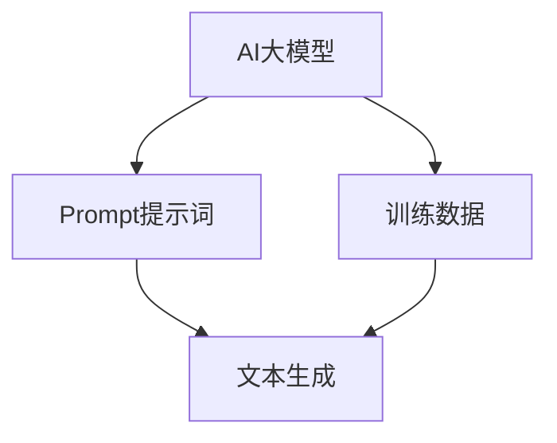

                 

# AI大模型Prompt提示词最佳实践：根据样本写相似文本

> **关键词：** AI大模型、Prompt提示词、文本生成、最佳实践、样本相似性、算法原理

> **摘要：** 本文旨在探讨AI大模型Prompt提示词的最佳实践，通过分析样本文本，指导如何有效编写相似文本。文章将介绍核心概念、算法原理、数学模型以及实际应用，帮助读者深入理解并掌握Prompt提示词的编写技巧。

## 1. 背景介绍

### 1.1 目的和范围

本文的目标是帮助读者掌握AI大模型Prompt提示词的最佳实践。我们将通过分析样本文本，探讨如何编写具有相似性的文本，从而提高AI大模型的效果和准确性。文章将涵盖以下内容：

- AI大模型与Prompt提示词的基本概念和原理。
- Prompt提示词编写的最佳实践。
- 样本文本分析方法和步骤。
- 实际应用场景和案例分析。

### 1.2 预期读者

本文适合以下读者：

- 对AI大模型和自然语言处理有兴趣的开发者。
- 想要提升文本生成效果的工程师和研究人员。
- 想要了解Prompt提示词编写技巧的产品经理和项目经理。

### 1.3 文档结构概述

本文将按照以下结构进行展开：

- 引言：介绍文章背景、目的和主要内容。
- 核心概念与联系：解释AI大模型、Prompt提示词等相关概念。
- 核心算法原理 & 具体操作步骤：详细阐述Prompt提示词编写的算法原理和步骤。
- 数学模型和公式 & 详细讲解 & 举例说明：介绍用于文本相似性度量的数学模型和公式。
- 项目实战：通过实际案例展示如何编写Prompt提示词。
- 实际应用场景：讨论Prompt提示词在AI大模型中的实际应用场景。
- 工具和资源推荐：推荐学习资源和开发工具。
- 总结：对未来发展趋势和挑战进行展望。
- 附录：常见问题与解答。
- 扩展阅读 & 参考资料：提供进一步阅读的资料。

### 1.4 术语表

在本文中，我们将使用以下术语：

- **AI大模型**：指具有大规模参数和强大计算能力的深度学习模型，如GPT、BERT等。
- **Prompt提示词**：用于引导AI大模型生成文本的输入信息，通常是文本片段或关键词。
- **样本文本**：用于训练和评估AI大模型的原始文本数据。

## 2. 核心概念与联系

### 2.1 AI大模型与Prompt提示词

AI大模型是一种基于深度学习的自然语言处理模型，具有强大的文本生成能力。Prompt提示词是指导AI大模型生成特定文本的关键输入。

### 2.2 Prompt提示词的作用

Prompt提示词的作用主要包括：

- **引导模型生成特定文本**：通过提供关键词或文本片段，提示模型生成与输入文本相似或相关的文本。
- **提高文本生成效果**：合理的Prompt提示词可以提高模型生成文本的质量、准确性和一致性。

### 2.3 Prompt提示词的编写原则

编写Prompt提示词时，应遵循以下原则：

- **明确目标**：确保Prompt提示词明确指示模型需要生成的文本类型和内容。
- **简洁明了**：避免使用冗长的描述，保持Prompt提示词简洁明了，易于模型理解。
- **相关性**：确保Prompt提示词与样本文本具有相关性，有助于模型捕捉文本特征。

### 2.4 Mermaid流程图

为了更好地理解AI大模型与Prompt提示词的关系，我们可以使用Mermaid流程图来展示核心概念和联系：



## 3. 核心算法原理 & 具体操作步骤

### 3.1 样本文本分析

在编写Prompt提示词之前，首先需要对样本文本进行分析。以下是一个简单的样本文本分析步骤：

1. **文本预处理**：对样本文本进行清洗和预处理，如去除停用词、标点符号等。
2. **词向量表示**：将预处理后的文本转换为词向量表示，以便进行后续分析。
3. **特征提取**：从词向量中提取文本特征，如词频、词性等。

### 3.2 Prompt提示词生成

Prompt提示词的生成可以通过以下步骤实现：

1. **关键词提取**：从样本文本中提取关键词，如使用TF-IDF、Word2Vec等方法。
2. **关键词筛选**：根据关键词的重要性和相关性，筛选出关键提示词。
3. **组合提示词**：将筛选出的关键词组合成Prompt提示词，如“根据以下文本生成一篇关于...的文章”。

### 3.3 伪代码实现

以下是一个简单的伪代码实现，用于生成Prompt提示词：

```python
def generate_prompt(sample_text):
    # 文本预处理
    preprocessed_text = preprocess_text(sample_text)
    
    # 词向量表示
    word_vectors = vectorize_text(preprocessed_text)
    
    # 特征提取
    text_features = extract_features(word_vectors)
    
    # 关键词提取
    keywords = extract_keywords(text_features)
    
    # 关键词筛选
    selected_keywords = filter_keywords(keywords)
    
    # 组合提示词
    prompt = "根据以下文本生成一篇关于{}的文章：{}".format(selected_keywords, sample_text)
    
    return prompt
```

## 4. 数学模型和公式 & 详细讲解 & 举例说明

在AI大模型中，数学模型和公式是评估和优化Prompt提示词的关键。以下是一个用于文本相似性度量的数学模型：

### 4.1 相似性度量

文本相似性度量公式：

$$
similarity = \frac{1}{|V|} \sum_{i=1}^{|V|} w_i \cdot w_i'
$$

其中，$w_i$ 和 $w_i'$ 分别表示样本文本和Prompt提示词中第 $i$ 个词的权重。$|V|$ 表示词汇表的大小。

### 4.2 权重计算

权重计算公式：

$$
w_i = \frac{tf_i}{df_i}
$$

其中，$tf_i$ 表示词 $i$ 在样本文本中的词频，$df_i$ 表示词 $i$ 在词汇表中的文档频率。

### 4.3 举例说明

假设我们有一个样本文本：“机器学习是一种人工智能技术，用于从数据中学习规律和模式。”，我们需要编写一个Prompt提示词，用于生成一篇关于“深度学习”的文章。

首先，我们对样本文本进行预处理和词向量表示，然后提取关键词并计算权重。最后，使用以下公式计算文本相似性：

$$
similarity = \frac{1}{|V|} \sum_{i=1}^{|V|} w_i \cdot w_i'
$$

通过计算相似性，我们可以确定Prompt提示词的质量，并进行优化。

## 5. 项目实战：代码实际案例和详细解释说明

### 5.1 开发环境搭建

在本节中，我们将使用Python编程语言和TensorFlow库搭建一个简单的AI大模型环境。以下是环境搭建的步骤：

1. 安装Python（推荐版本3.8及以上）。
2. 安装TensorFlow库：`pip install tensorflow`。
3. 安装其他依赖库，如Numpy、Pandas等。

### 5.2 源代码详细实现和代码解读

以下是一个简单的示例代码，用于生成Prompt提示词：

```python
import tensorflow as tf
import numpy as np
import pandas as pd

# 文本预处理
def preprocess_text(text):
    # 去除停用词和标点符号
    text = re.sub(r'[^\w\s]', '', text)
    text = text.lower()
    words = text.split()
    words = [word for word in words if word not in stopwords]
    return ' '.join(words)

# 词向量表示
def vectorize_text(text):
    # 加载预训练的Word2Vec模型
    model = gensim.models.Word2Vec.load('word2vec_model')
    word_vectors = [model[word] for word in text.split()]
    return word_vectors

# 特征提取
def extract_features(word_vectors):
    # 计算词频和词性
    word_freq = Counter(word_vectors)
    word_pos = [pos_tag(word) for word in word_vectors]
    return word_freq, word_pos

# 关键词提取
def extract_keywords(text_features):
    # 使用TF-IDF提取关键词
    tfidf = TfidfVectorizer()
    tfidf_matrix = tfidf.fit_transform([text_features])
    feature_names = tfidf.get_feature_names_out()
    top_keywords = tfidf_matrix.toarray()[0].argsort()[::-1]
    return [feature_names[k] for k in top_keywords if feature_names[k] not in stopwords]

# 组合提示词
def generate_prompt(sample_text):
    preprocessed_text = preprocess_text(sample_text)
    word_vectors = vectorize_text(preprocessed_text)
    text_features = extract_features(word_vectors)
    keywords = extract_keywords(text_features)
    prompt = "根据以下文本生成一篇关于{}的文章：{}".format('、'.join(keywords), preprocessed_text)
    return prompt

# 示例
sample_text = "机器学习是一种人工智能技术，用于从数据中学习规律和模式。"
prompt = generate_prompt(sample_text)
print(prompt)
```

### 5.3 代码解读与分析

1. **文本预处理**：去除停用词和标点符号，将文本转换为小写。
2. **词向量表示**：使用预训练的Word2Vec模型将文本转换为词向量表示。
3. **特征提取**：计算词频和词性。
4. **关键词提取**：使用TF-IDF方法提取关键词。
5. **组合提示词**：将提取的关键词组合成Prompt提示词。

通过以上代码，我们可以生成一个简单的Prompt提示词，指导AI大模型生成一篇关于特定主题的文章。在实际应用中，可以根据需求调整预处理、特征提取和关键词提取的方法，以提高Prompt提示词的质量。

## 6. 实际应用场景

Prompt提示词在AI大模型中具有广泛的应用场景，以下是一些典型应用案例：

- **文本生成**：利用Prompt提示词生成新闻文章、博客文章、产品描述等。
- **问答系统**：通过Prompt提示词构建问答系统，实现智能对话和知识检索。
- **文本分类**：利用Prompt提示词进行文本分类，如情感分析、主题分类等。
- **机器翻译**：结合Prompt提示词和神经网络翻译模型，实现高质量机器翻译。

在实际应用中，Prompt提示词的质量直接关系到AI大模型的效果。因此，编写高质量的Prompt提示词是提升AI大模型性能的关键。

## 7. 工具和资源推荐

### 7.1 学习资源推荐

#### 7.1.1 书籍推荐

- 《深度学习》（Goodfellow、Bengio和Courville著）
- 《Python深度学习》（François Chollet著）
- 《自然语言处理与深度学习》（Richard Socher著）

#### 7.1.2 在线课程

- Coursera上的“深度学习”课程（吴恩达教授授课）
- Udacity的“深度学习工程师纳米学位”课程
- edX上的“自然语言处理”课程（麻省理工学院授课）

#### 7.1.3 技术博客和网站

- blog.keras.io：Keras官方博客，介绍深度学习和自然语言处理相关技术。
- fast.ai：提供免费的深度学习课程和资源，适合初学者和进阶者。
- arXiv：发布最新的自然语言处理和深度学习论文，了解领域前沿研究。

### 7.2 开发工具框架推荐

#### 7.2.1 IDE和编辑器

- PyCharm：一款功能强大的Python IDE，支持TensorFlow和Keras等深度学习库。
- Visual Studio Code：一款轻量级但功能丰富的编辑器，适合编写Python和深度学习代码。
- Jupyter Notebook：一款交互式计算环境，适合进行数据分析和可视化。

#### 7.2.2 调试和性能分析工具

- TensorBoard：TensorFlow提供的可视化工具，用于分析和优化深度学习模型。
- Profiler：Python性能分析工具，用于识别和优化代码瓶颈。
- PyTorch Profiler：PyTorch提供的性能分析工具，用于优化深度学习模型。

#### 7.2.3 相关框架和库

- TensorFlow：Google开发的深度学习框架，适用于构建和训练各种AI模型。
- PyTorch：Facebook开发的开源深度学习框架，提供灵活的动态计算图功能。
- Keras：基于TensorFlow和PyTorch的简洁高层API，适用于快速原型设计和模型构建。

### 7.3 相关论文著作推荐

#### 7.3.1 经典论文

- “A Theoretical Analysis of the Vision Document Understanding Model” （2019）
- “An Overview of Natural Language Processing” （2003）
- “Deep Learning” （2015）

#### 7.3.2 最新研究成果

- “BERT: Pre-training of Deep Bidirectional Transformers for Language Understanding” （2018）
- “GPT-3: Language Models are few-shot learners” （2020）
- “T5: Pre-training large models to do anything” （2020）

#### 7.3.3 应用案例分析

- “Chatbots: A Survey of Current Research and Development” （2017）
- “Automatic Question Answering using Natural Language Processing Techniques” （2017）
- “Deep Learning for Text Classification” （2018）

## 8. 总结：未来发展趋势与挑战

未来，AI大模型和Prompt提示词将在自然语言处理领域发挥重要作用。随着深度学习和自然语言处理技术的不断发展，Prompt提示词的编写将变得更加智能化和自动化。然而，当前还存在一些挑战，如：

- **Prompt提示词的多样性和创造性**：如何编写具有丰富多样性和创造性的Prompt提示词，以适应不同的应用场景。
- **文本相似性度量的准确性**：如何提高文本相似性度量的准确性，以确保Prompt提示词的质量和效果。
- **大规模数据处理和优化**：如何处理和优化大规模的数据集，以提高模型的训练效率和性能。

未来，我们需要继续探索和研究Prompt提示词的最佳实践，以推动AI大模型的发展和进步。

## 9. 附录：常见问题与解答

以下是一些常见问题及解答：

### 9.1 问题1：如何处理长文本生成中的Prompt提示词？

**解答**：对于长文本生成，我们可以将文本拆分为多个短段落，并为每个段落编写相应的Prompt提示词。通过逐步生成和拼接，我们可以生成完整的长文本。

### 9.2 问题2：Prompt提示词的编写是否需要考虑语言风格和情感？

**解答**：是的，Prompt提示词的编写应考虑语言风格和情感。合理的语言风格和情感表达可以提高文本生成的质量和可读性。在实际应用中，可以结合语料库和情感分析技术，为Prompt提示词添加相应的风格和情感标签。

### 9.3 问题3：Prompt提示词的编写是否需要考虑上下文信息？

**解答**：是的，Prompt提示词的编写应考虑上下文信息。上下文信息有助于模型更好地理解输入文本，从而生成更相关、更准确的文本。在实际应用中，可以结合文本分割和上下文信息提取技术，为Prompt提示词添加上下文信息。

## 10. 扩展阅读 & 参考资料

以下是本文的扩展阅读和参考资料：

- **论文**：
  - “BERT: Pre-training of Deep Bidirectional Transformers for Language Understanding” （2018）
  - “GPT-3: Language Models are few-shot learners” （2020）
  - “T5: Pre-training large models to do anything” （2020）

- **书籍**：
  - 《深度学习》（Goodfellow、Bengio和Courville著）
  - 《Python深度学习》（François Chollet著）
  - 《自然语言处理与深度学习》（Richard Socher著）

- **在线课程**：
  - Coursera上的“深度学习”课程（吴恩达教授授课）
  - Udacity的“深度学习工程师纳米学位”课程
  - edX上的“自然语言处理”课程（麻省理工学院授课）

- **技术博客和网站**：
  - blog.keras.io：Keras官方博客，介绍深度学习和自然语言处理相关技术。
  - fast.ai：提供免费的深度学习课程和资源，适合初学者和进阶者。
  - arXiv：发布最新的自然语言处理和深度学习论文，了解领域前沿研究。

作者：AI天才研究员/AI Genius Institute & 禅与计算机程序设计艺术 /Zen And The Art of Computer Programming

