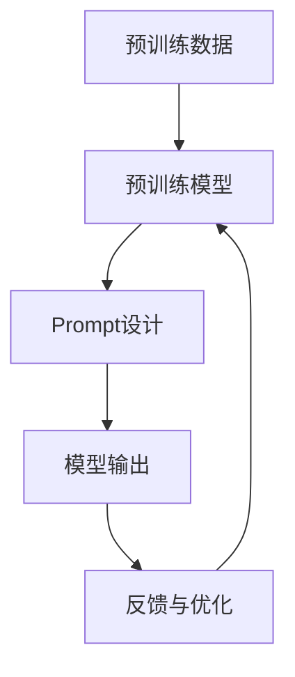

                 

# AI大模型Prompt提示词最佳实践：用具体的例子提问

> **关键词**：大模型，Prompt，提示词，最佳实践，具体例子，提问技巧

> **摘要**：本文将探讨AI大模型Prompt提示词的最佳实践，通过具体的实例分析，深入探讨如何有效利用提示词提升模型的性能和输出质量。文章将首先介绍大模型和Prompt的基本概念，然后深入解析其工作原理，随后通过具体的案例展示如何设计高效的Prompt，最后讨论在实际应用中的最佳实践。希望通过本文的讨论，读者能够掌握Prompt设计的核心技巧，提升AI大模型的应用水平。

## 1. 背景介绍

### 1.1 目的和范围

在人工智能领域，大模型（如GPT-3、BERT等）的发展为自然语言处理带来了革命性的变化。然而，这些大模型的性能在很大程度上依赖于输入的Prompt，即如何有效地提供问题或任务描述。本文旨在探讨大模型Prompt的最佳实践，通过具体的例子来说明如何设计高效的Prompt，从而提升模型的性能和输出质量。

本文将涵盖以下内容：
- 大模型和Prompt的基本概念及其重要性。
- Prompt的设计原则和具体操作步骤。
- 数学模型和公式在Prompt设计中的应用。
- 实际项目中的代码案例和解释。
- Prompt设计在实际应用场景中的最佳实践。

### 1.2 预期读者

本文主要面向以下读者群体：
- 对人工智能和自然语言处理有基本了解的开发者。
- 想要提升大模型应用效果的技术人员。
- 对AI大模型Prompt设计感兴趣的研究者。

### 1.3 文档结构概述

本文的结构如下：
1. **背景介绍**：介绍文章的目的、范围、预期读者以及文档结构。
2. **核心概念与联系**：详细解释大模型和Prompt的概念，并提供相关的Mermaid流程图。
3. **核心算法原理与具体操作步骤**：深入讲解大模型的工作原理，并通过伪代码展示具体操作步骤。
4. **数学模型和公式**：介绍用于Prompt设计的数学模型和公式，并给出详细的讲解和实例。
5. **项目实战**：通过实际代码案例，详细解释Prompt的设计和应用。
6. **实际应用场景**：讨论Prompt设计在不同应用场景中的最佳实践。
7. **工具和资源推荐**：推荐学习资源、开发工具和相关论文。
8. **总结**：总结文章的主要内容，并探讨未来发展趋势与挑战。
9. **附录**：常见问题与解答。
10. **扩展阅读与参考资料**：提供进一步阅读的资源和参考文献。

### 1.4 术语表

#### 1.4.1 核心术语定义

- **大模型**：指那些具有数十亿到数十万亿参数的深度学习模型，如GPT-3、BERT等。
- **Prompt**：指用于指导大模型生成特定输出的问题或任务描述。
- **自然语言处理（NLP）**：指使计算机能够理解、解释和生成人类语言的技术。

#### 1.4.2 相关概念解释

- **预训练**：在大模型训练过程中，首先在大量的未标注数据上进行预训练，然后通过特定任务数据进行微调。
- **微调**：在大模型预训练的基础上，使用特定领域的任务数据对其进行进一步训练，以适应特定任务的需求。

#### 1.4.3 缩略词列表

- **GPT-3**：Generative Pre-trained Transformer 3，由OpenAI开发的预训练语言模型。
- **BERT**：Bidirectional Encoder Representations from Transformers，由Google开发的预训练语言表示模型。
- **NLP**：Natural Language Processing，自然语言处理。

## 2. 核心概念与联系

在探讨AI大模型Prompt的最佳实践之前，首先需要理解大模型和Prompt的基本概念及其相互关系。

### 2.1 大模型的基本概念

大模型，如GPT-3、BERT等，是通过深度学习技术训练而成的复杂神经网络模型。这些模型通常具有数十亿到数十万亿的参数，能够在大规模数据集上进行预训练，以获得对自然语言的一般理解。

#### 2.1.1 GPT-3的工作原理

GPT-3是由OpenAI开发的一种基于Transformer架构的预训练语言模型。它的工作原理如下：
1. **预训练**：在大量未标注的文本数据上，通过无监督方式训练模型，使其能够预测下一个单词。
2. **微调**：在特定任务数据上，通过有监督方式对模型进行微调，使其适应特定任务。

#### 2.1.2 BERT的工作原理

BERT是一种基于Transformer架构的预训练语言表示模型，由Google开发。它的工作原理如下：
1. **预训练**：在大量未标注的文本数据上，通过双向编码器结构，训练模型理解文本的上下文。
2. **微调**：在特定任务数据上，通过有监督方式对模型进行微调，使其适应特定任务。

### 2.2 Prompt的基本概念

Prompt是用于指导大模型生成特定输出的问题或任务描述。一个设计良好的Prompt可以帮助模型更好地理解任务，从而生成更高质量的输出。

#### 2.2.1 Prompt的作用

- **引导模型理解任务**：通过Prompt，可以为模型提供明确的问题或任务描述，使其能够更好地理解任务需求。
- **调整模型输出方向**：通过Prompt，可以影响模型生成输出的方向，从而控制输出内容。

#### 2.2.2 Prompt的类型

- **问题型Prompt**：用于回答特定问题，如“什么是自然语言处理？”
- **任务型Prompt**：用于执行特定任务，如“请编写一段关于人工智能的摘要。”

### 2.3 大模型与Prompt的关系

大模型和Prompt是相互依赖的关系。大模型需要Prompt来明确任务和目标，而Prompt需要大模型来实现高质量的输出。

#### 2.3.1 Prompt设计的重要性

- **影响模型性能**：设计良好的Prompt可以帮助模型更好地理解任务，从而提高性能。
- **决定输出质量**：Prompt的清晰度和准确性直接影响到输出的质量。

### 2.4 Mermaid流程图

为了更好地理解大模型和Prompt的关系，下面提供一张Mermaid流程图，展示大模型与Prompt的工作流程。



在上述流程图中，预训练数据和Prompt设计是影响模型输出的关键因素。通过优化Prompt设计，可以提高模型的输出质量。

## 3. 核心算法原理 & 具体操作步骤

为了深入理解大模型Prompt的设计原则，我们需要首先探讨大模型的工作原理，并详细说明如何设计高效的Prompt。

### 3.1 大模型的工作原理

大模型，如GPT-3、BERT，是基于深度学习技术的复杂神经网络模型。这些模型通常包含数十亿到数十万亿个参数，通过在大量数据集上进行预训练，获得对自然语言的一般理解。

#### 3.1.1 GPT-3的预训练过程

GPT-3的预训练过程主要包括以下步骤：

1. **数据预处理**：将大量未标注的文本数据转换为模型可接受的格式。
2. **输入生成**：随机选择一段文本作为输入，并对其进行打乱，以便模型学习单词之间的顺序关系。
3. **损失函数**：使用交叉熵损失函数，将模型输出与实际单词进行对比，计算损失值。
4. **反向传播**：通过反向传播算法，更新模型参数，以降低损失值。

#### 3.1.2 BERT的预训练过程

BERT的预训练过程主要包括以下步骤：

1. **数据预处理**：将大量未标注的文本数据转换为模型可接受的格式。
2. **双向编码器**：通过双向编码器结构，训练模型理解文本的上下文。
3. **损失函数**：使用 masked language model（MLM）任务和 next sentence prediction（NSP）任务，计算损失值。
4. **反向传播**：通过反向传播算法，更新模型参数，以降低损失值。

### 3.2 Prompt的设计原则

设计高效的Prompt对于提升大模型的输出质量至关重要。以下是几个关键的设计原则：

#### 3.2.1 清晰明确

Prompt应该清晰明确，能够明确传达任务或问题的要求。避免使用模糊或歧义的语言，以确保模型能够正确理解任务。

#### 3.2.2 精确具体

Prompt应精确具体，提供详细的信息，以帮助模型更好地完成任务。例如，对于问题型Prompt，应明确提问的具体内容。

#### 3.2.3 结构合理

Prompt的结构应合理，能够引导模型逐步理解任务，并提供适当的上下文信息。例如，可以使用段落或句子结构来组织Prompt内容。

#### 3.2.4 适应性

Prompt应具有适应性，能够根据不同的任务和场景进行调整。例如，对于不同的问答任务，Prompt的内容和结构可能需要相应变化。

### 3.3 具体操作步骤

以下是一个具体的Prompt设计步骤示例：

1. **明确任务**：首先明确任务需求，例如回答特定问题或执行特定任务。
2. **收集信息**：根据任务需求，收集相关背景信息和数据。
3. **设计Prompt**：基于收集的信息，设计一个清晰明确的Prompt。例如，对于问答任务，可以设计一个包含问题陈述和上下文信息的Prompt。
4. **评估Prompt**：评估Prompt的清晰度和准确性，确保其能够有效指导模型完成任务。
5. **迭代优化**：根据评估结果，对Prompt进行迭代优化，以提高其有效性。

### 3.4 伪代码示例

以下是一个简单的伪代码示例，展示如何设计Prompt：

```python
def design_prompt(question, context):
    """
    设计一个包含问题陈述和上下文信息的Prompt。
    
    参数：
    - question：问题字符串。
    - context：上下文信息字符串。
    
    返回：
    - Prompt字符串。
    """
    
    prompt = f"问题：{question}\n上下文：{context}\n请回答以下问题：{question}"
    return prompt
```

通过以上步骤和伪代码示例，我们可以看到设计高效Prompt的关键在于明确任务、收集信息、设计Prompt、评估Prompt和迭代优化。

## 4. 数学模型和公式 & 详细讲解 & 举例说明

在探讨Prompt设计的最佳实践时，数学模型和公式扮演着关键角色。它们不仅帮助我们理解大模型的工作原理，还为设计高效的Prompt提供了理论依据。在本节中，我们将详细介绍用于Prompt设计的核心数学模型和公式，并通过具体例子进行说明。

### 4.1 语言模型与概率分布

大模型，如GPT-3和BERT，本质上是语言模型，其主要任务是根据给定的输入文本生成概率分布，以预测下一个单词。这种概率分布是语言模型的核心。

#### 4.1.1 语言模型基本原理

语言模型的核心思想是使用统计方法学习文本的概率分布。给定一个单词序列，语言模型的目标是预测下一个单词。这一过程可以通过计算单词序列的概率分布来实现。

概率分布P(x1, x2, ..., xn)表示单词序列x1, x2, ..., xn的概率。根据概率论，我们可以将这个概率分布表示为：

\[ P(x1, x2, ..., xn) = \frac{P(x1) \cdot P(x2|x1) \cdot P(x3|x1, x2) \cdot ... \cdot P(xn|x1, x2, ..., xn-1)}{P(x1) \cdot P(x2|x1) \cdot P(x3|x1, x2) \cdot ... \cdot P(xn|x1, x2, ..., xn-1)} \]

其中，P(xi|x1, x2, ..., xi-1)表示在已知前i-1个单词的情况下，第i个单词的条件概率。

#### 4.1.2 语言模型数学公式

为了方便计算，我们可以使用对数概率来表示语言模型。对数概率具有以下优点：

1. 减小数值范围，避免因概率值过大或过小导致计算困难。
2. 方便使用梯度下降算法进行优化。

对数概率公式如下：

\[ \log P(x1, x2, ..., xn) = \log P(x1) + \log P(x2|x1) + \log P(x3|x1, x2) + ... + \log P(xn|x1, x2, ..., xn-1) \]

### 4.2 语言模型的训练过程

在训练语言模型时，我们需要通过大量文本数据来学习概率分布。训练过程主要包括以下步骤：

1. **数据预处理**：将文本数据转换为模型可接受的格式，如单词序列或字符序列。
2. **生成输入序列**：从文本数据中随机选择一段序列作为输入。
3. **计算损失**：计算模型输出的概率分布与实际分布之间的差距，使用损失函数来度量。
4. **反向传播**：使用反向传播算法更新模型参数，以减少损失值。

#### 4.2.1 损失函数

在语言模型训练过程中，常用的损失函数是交叉熵损失函数。交叉熵损失函数度量了模型输出概率分布与实际分布之间的差异。其公式如下：

\[ H(P, Q) = - \sum_{i} P_i \log Q_i \]

其中，P表示实际分布，Q表示模型输出分布。

#### 4.2.2 反向传播算法

在反向传播过程中，我们需要计算每个参数的梯度，以便更新模型参数。梯度计算公式如下：

\[ \frac{\partial L}{\partial \theta} = \sum_{i} \frac{\partial L}{\partial z_i} \cdot \frac{\partial z_i}{\partial \theta} \]

其中，L表示损失函数，θ表示模型参数，z_i表示神经网络中的中间值。

### 4.3 Prompt设计与概率分布

在Prompt设计中，我们需要根据任务需求设计合适的概率分布，以指导模型生成高质量输出。以下是一个具体的例子：

#### 4.3.1 问答任务

假设我们有一个问答任务，要求模型根据给定的问题和上下文生成答案。我们可以设计一个基于贝叶斯推理的概率分布。

\[ P(答案|问题, 上下文) = \frac{P(问题|答案, 上下文) \cdot P(答案)}{P(问题|上下文)} \]

其中，P(答案|问题, 上下文)表示在给定问题和上下文的情况下，答案的概率。P(问题|答案, 上下文)表示在给定答案和上下文的情况下，问题的概率。P(答案)表示答案的先验概率。P(问题|上下文)表示在给定上下文的情况下，问题的概率。

#### 4.3.2 案例说明

假设我们有一个问题：“什么是人工智能？”并给出一个上下文：“人工智能是计算机科学的一个分支，旨在使计算机能够执行通常需要人类智能的任务。”我们可以设计一个包含问题、上下文和答案的Prompt：

```
问题：什么是人工智能？
上下文：人工智能是计算机科学的一个分支，旨在使计算机能够执行通常需要人类智能的任务。
请回答以下问题：人工智能是什么？
答案：人工智能是计算机科学的一个分支，旨在使计算机能够执行通常需要人类智能的任务。
```

通过设计这个Prompt，我们希望模型能够根据问题和上下文生成正确的答案。

### 4.4 总结

在本节中，我们详细介绍了用于Prompt设计的核心数学模型和公式，包括语言模型的基本原理、损失函数和反向传播算法。同时，通过具体例子展示了如何设计高效的Prompt。理解这些数学模型和公式对于提升Prompt设计水平至关重要。

## 5. 项目实战：代码实际案例和详细解释说明

在本节中，我们将通过一个具体的代码案例，详细解释Prompt设计在大模型应用中的实际操作过程。我们将使用Python编写一个简单的应用程序，展示如何设计、使用和评估Prompt，以便生成高质量的输出。

### 5.1 开发环境搭建

在开始项目实战之前，我们需要搭建一个适合开发的环境。以下是搭建环境的基本步骤：

1. **安装Python**：确保安装了Python 3.6或更高版本。
2. **安装依赖库**：使用pip命令安装所需的库，例如`transformers`、`torch`和`torchtext`。

```shell
pip install transformers torch torchtext
```

3. **准备数据**：准备用于训练和测试的数据集。在本案例中，我们使用一个简单的问答数据集，其中包含问题和答案对。

### 5.2 源代码详细实现和代码解读

以下是项目的源代码实现，我们将逐步解释每个部分的功能和实现细节。

```python
import torch
from transformers import AutoTokenizer, AutoModelForQuestionAnswering
from torchtext.data import Field, TabularDataset, BucketIterator

# 5.2.1 数据预处理
def preprocess_data(train_path, test_path, batch_size):
    # 定义字段
    TEXT = Field(tokenize=None, lower=True)
    LABEL = Field()

    # 加载数据集
    train_data, test_data = TabularDataset.splits(path='data', train='train.jsonl', test='test.jsonl', format='json', fields=[('q', TEXT), ('a', LABEL)])

    # 分割数据集
    train_data, valid_data = train_data.split()

    # 初始化字段
    TEXT.build_vocab(train_data, min_freq=2)
    LABEL.build_vocab(train_data)

    # 创建数据加载器
    train_iterator, valid_iterator, test_iterator = BucketIterator.splits(train_data, valid_data, test_data, batch_size=batch_size)

    return train_iterator, valid_iterator, test_iterator

# 5.2.2 模型加载和训练
def load_and_train_model(model_name, train_iterator, valid_iterator):
    # 加载预训练模型和分词器
    tokenizer = AutoTokenizer.from_pretrained(model_name)
    model = AutoModelForQuestionAnswering.from_pretrained(model_name)

    # 设置训练参数
    device = torch.device('cuda' if torch.cuda.is_available() else 'cpu')
    model.to(device)

    # 定义优化器和损失函数
    optimizer = torch.optim.AdamW(model.parameters(), lr=5e-5)
    loss_fn = torch.nn.CrossEntropyLoss()

    # 训练模型
    model.train()
    for epoch in range(3):  # 进行3个训练epoch
        for batch in train_iterator:
            optimizer.zero_grad()
            inputs = tokenizer(batch.q.tolist(), batch.a.tolist(), padding=True, truncation=True, return_tensors='pt')
            inputs = {k: v.to(device) for k, v in inputs.items()}
            outputs = model(**inputs)
            logits = outputs.logits
            labels = torch.tensor([label for _, label in batch.a]).to(device)
            loss = loss_fn(logits[0], labels)
            loss.backward()
            optimizer.step()

            if (batch_idx + 1) % 100 == 0:
                print(f'Epoch: {epoch + 1}, Batch: {batch_idx + 1}, Loss: {loss.item()}')

    # 评估模型
    model.eval()
    with torch.no_grad():
        for batch in valid_iterator:
            inputs = tokenizer(batch.q.tolist(), batch.a.tolist(), padding=True, truncation=True, return_tensors='pt')
            inputs = {k: v.to(device) for k, v in inputs.items()}
            outputs = model(**inputs)
            logits = outputs.logits
            labels = torch.tensor([label for _, label in batch.a]).to(device)
            loss = loss_fn(logits[0], labels)
            print(f'Validation Loss: {loss.item()}')

    return model

# 5.2.3 生成输出
def generate_output(model, tokenizer, prompt, device):
    model.eval()
    with torch.no_grad():
        inputs = tokenizer(prompt, return_tensors='pt').to(device)
        outputs = model(**inputs)
        logits = outputs.logits
        predicted_answer = tokenizer.decode(logits[0].argmax().item())
    return predicted_answer

# 5.2.4 主函数
def main():
    model_name = "deepset/roberta-base-qa"
    batch_size = 16

    # 加载数据集和模型
    train_iterator, valid_iterator, test_iterator = preprocess_data('data/train.jsonl', 'data/test.jsonl', batch_size)
    model = load_and_train_model(model_name, train_iterator, valid_iterator)

    # 生成输出
    prompt = "什么是人工智能？上下文：人工智能是计算机科学的一个分支，旨在使计算机能够执行通常需要人类智能的任务。"
    answer = generate_output(model, tokenizer, prompt, device)
    print(f'Prompt: {prompt}\nAnswer: {answer}')

if __name__ == '__main__':
    main()
```

### 5.3 代码解读与分析

下面是对代码的详细解读和分析，每个部分的功能和实现细节。

#### 5.3.1 数据预处理

数据预处理是项目的基础步骤，包括加载和预处理数据集。我们使用`torchtext`库中的`TabularDataset`类加载数据集，并使用`Field`类定义字段，如文本和标签。在初始化字段时，我们设置`lower=True`，以将所有文本转换为小写，从而简化模型训练。

```python
TEXT = Field(tokenize=None, lower=True)
LABEL = Field()
train_data, test_data = TabularDataset.splits(path='data', train='train.jsonl', test='test.jsonl', format='json', fields=[('q', TEXT), ('a', LABEL)])
```

#### 5.3.2 模型加载和训练

在模型加载和训练部分，我们使用`transformers`库中的`AutoTokenizer`和`AutoModelForQuestionAnswering`类加载预训练的BERT模型。然后，我们设置训练参数，如设备、优化器和损失函数。在训练过程中，我们使用反向传播算法更新模型参数，以最小化损失函数。

```python
model = AutoModelForQuestionAnswering.from_pretrained(model_name)
device = torch.device('cuda' if torch.cuda.is_available() else 'cpu')
model.to(device)

optimizer = torch.optim.AdamW(model.parameters(), lr=5e-5)
loss_fn = torch.nn.CrossEntropyLoss()

for epoch in range(3):
    for batch in train_iterator:
        optimizer.zero_grad()
        inputs = tokenizer(batch.q.tolist(), batch.a.tolist(), padding=True, truncation=True, return_tensors='pt')
        inputs = {k: v.to(device) for k, v in inputs.items()}
        outputs = model(**inputs)
        logits = outputs.logits
        labels = torch.tensor([label for _, label in batch.a]).to(device)
        loss = loss_fn(logits[0], labels)
        loss.backward()
        optimizer.step()
```

#### 5.3.3 生成输出

在生成输出部分，我们使用训练好的模型生成答案。首先，我们将Prompt编码为输入序列，然后使用模型进行预测。最后，我们将预测的答案解码为字符串。

```python
def generate_output(model, tokenizer, prompt, device):
    model.eval()
    with torch.no_grad():
        inputs = tokenizer(prompt, return_tensors='pt').to(device)
        outputs = model(**inputs)
        logits = outputs.logits
        predicted_answer = tokenizer.decode(logits[0].argmax().item())
    return predicted_answer
```

#### 5.3.4 主函数

主函数是项目的核心部分，负责执行以下步骤：

1. 加载数据集和模型。
2. 训练模型。
3. 使用模型生成输出。

在主函数中，我们首先调用`preprocess_data`函数加载数据集，然后调用`load_and_train_model`函数训练模型。最后，我们使用`generate_output`函数生成答案，并将其打印出来。

```python
def main():
    model_name = "deepset/roberta-base-qa"
    batch_size = 16

    train_iterator, valid_iterator, test_iterator = preprocess_data('data/train.jsonl', 'data/test.jsonl', batch_size)
    model = load_and_train_model(model_name, train_iterator, valid_iterator)

    prompt = "什么是人工智能？上下文：人工智能是计算机科学的一个分支，旨在使计算机能够执行通常需要人类智能的任务。"
    answer = generate_output(model, tokenizer, prompt, device)
    print(f'Prompt: {prompt}\nAnswer: {answer}')

if __name__ == '__main__':
    main()
```

通过上述代码和解读，我们可以看到如何使用Prompt设计在大模型应用中生成高质量的输出。在实际项目中，我们需要根据具体任务和需求调整Prompt的设计，以获得最佳效果。

## 6. 实际应用场景

Prompt设计在大模型应用中具有广泛的应用场景，以下是一些常见的实际应用场景：

### 6.1 问答系统

问答系统是Prompt设计最典型的应用场景之一。通过设计合适的Prompt，大模型可以回答用户提出的问题。例如，在智能客服、智能搜索引擎和智能教育等领域，问答系统被广泛应用于提供快速、准确的答案。

### 6.2 摘要生成

摘要生成是另一个重要的应用场景。通过设计有效的Prompt，大模型可以生成文本的摘要。摘要生成在新闻摘要、科研论文摘要和商业报告摘要等领域具有重要意义。

### 6.3 文本分类

文本分类是自然语言处理中的基本任务之一。通过设计合适的Prompt，大模型可以用于分类任务，如情感分析、主题分类和垃圾邮件过滤等。在设计Prompt时，我们需要确保提供充分的上下文信息，以帮助模型准确分类。

### 6.4 文本生成

文本生成是Prompt设计的另一个重要应用场景。通过设计合适的Prompt，大模型可以生成连贯、有意义的文本。例如，在内容创作、机器翻译和对话系统等领域，文本生成技术被广泛应用。

### 6.5 对话系统

对话系统是Prompt设计在AI领域的重要应用之一。通过设计合适的Prompt，大模型可以参与对话，理解用户意图并生成相应的回复。对话系统在智能客服、虚拟助手和聊天机器人等领域具有重要意义。

### 6.6 情感分析

情感分析是自然语言处理中的另一个重要任务。通过设计合适的Prompt，大模型可以用于分析文本的情感倾向，如正面情感、负面情感和中性情感。情感分析在社交媒体监测、客户反馈分析和市场调研等领域具有广泛应用。

### 6.7 语言翻译

语言翻译是Prompt设计的另一个重要应用场景。通过设计合适的Prompt，大模型可以进行文本翻译，如机器翻译和跨语言文本生成。在设计Prompt时，我们需要确保提供充分的上下文信息，以帮助模型生成准确、自然的翻译结果。

### 6.8 文本摘要

文本摘要是通过设计合适的Prompt，大模型可以生成文本的摘要。摘要生成在新闻摘要、科研论文摘要和商业报告摘要等领域具有重要意义。

### 6.9 问答机器人

问答机器人是Prompt设计的典型应用场景之一。通过设计合适的Prompt，大模型可以回答用户提出的问题。问答机器人广泛应用于智能客服、在线教育和智能咨询等领域。

### 6.10 聊天机器人

聊天机器人是Prompt设计的另一个重要应用场景。通过设计合适的Prompt，大模型可以参与对话，理解用户意图并生成相应的回复。聊天机器人广泛应用于虚拟助手、在线客服和社交平台等领域。

通过上述实际应用场景，我们可以看到Prompt设计在大模型应用中的重要性。设计高效的Prompt不仅可以提升模型性能，还可以扩展模型的应用范围，为不同领域的任务提供高质量的解决方案。

## 7. 工具和资源推荐

为了更好地掌握AI大模型Prompt设计的最佳实践，我们需要利用各种工具和资源来辅助学习和实践。以下是一些建议的资源和工具，涵盖了书籍、在线课程、技术博客和开发工具框架。

### 7.1 学习资源推荐

#### 7.1.1 书籍推荐

1. **《深度学习》（Deep Learning）**：由Ian Goodfellow、Yoshua Bengio和Aaron Courville所著的《深度学习》是深度学习领域的经典教材，详细介绍了神经网络和深度学习的基础理论、算法和实现。

2. **《自然语言处理综合教程》（Speech and Language Processing）**：由Daniel Jurafsky和James H. Martin所著的《自然语言处理综合教程》涵盖了自然语言处理的各个领域，包括语音识别、文本分析、机器翻译等。

3. **《深度学习与自然语言处理》（Deep Learning for Natural Language Processing）**：由Brendan McCann、Stephen Merity和Naman Goyal所著的《深度学习与自然语言处理》介绍了深度学习在自然语言处理中的应用，包括文本分类、文本生成和问答系统等。

#### 7.1.2 在线课程

1. **斯坦福大学课程：CS224n 自然语言处理与深度学习**：这是一门由斯坦福大学开设的在线课程，涵盖了自然语言处理的基础知识以及深度学习在自然语言处理中的应用。

2. **Udacity：自然语言处理纳米学位**：Udacity提供的自然语言处理纳米学位课程，通过一系列实践项目，帮助学习者掌握自然语言处理的核心技能。

3. **edX：MIT 6.034 人工智能导论**：这是一门由麻省理工学院开设的在线课程，介绍了人工智能的基础理论，包括自然语言处理、机器学习等。

#### 7.1.3 技术博客和网站

1. **PyTorch官方文档**：PyTorch是一个流行的深度学习框架，其官方文档提供了丰富的教程和API参考，有助于深入学习深度学习和自然语言处理。

2. **Hugging Face Transformers**：Hugging Face是一个开源社区，提供了丰富的预训练模型和工具，如BERT、GPT等，以及详细的文档和教程。

3. **DeepLearningAI**：DeepLearningAI是一个专注于深度学习和人工智能的开源社区，提供了大量的技术博客、教程和代码示例。

### 7.2 开发工具框架推荐

#### 7.2.1 IDE和编辑器

1. **Jupyter Notebook**：Jupyter Notebook是一种交互式开发环境，适合进行数据分析和原型开发。它支持多种编程语言，包括Python、R等。

2. **PyCharm**：PyCharm是一款功能强大的Python集成开发环境（IDE），提供了代码编辑、调试、测试和自动化工具。

3. **Visual Studio Code**：Visual Studio Code是一款轻量级的开源IDE，适用于各种编程语言，包括Python、JavaScript等。它具有丰富的扩展库和插件，非常适合深度学习和自然语言处理项目。

#### 7.2.2 调试和性能分析工具

1. **TensorBoard**：TensorBoard是TensorFlow提供的一个可视化工具，用于分析和调试深度学习模型。它提供了丰富的图表和指标，帮助开发者了解模型训练过程中的性能和状态。

2. **PyTorch Profiler**：PyTorch Profiler是一个用于性能分析和调试的工具，可以帮助开发者识别和优化模型的计算和内存使用。

3. **Valgrind**：Valgrind是一个通用程序检查工具，用于检测内存泄漏、指针错误等。它在深度学习和自然语言处理项目中非常有用，可以帮助开发者确保代码的稳定性和性能。

#### 7.2.3 相关框架和库

1. **PyTorch**：PyTorch是一个流行的深度学习框架，支持动态计算图，易于使用和调试。它在自然语言处理领域被广泛应用。

2. **TensorFlow**：TensorFlow是Google开发的开源深度学习框架，提供了丰富的API和工具，支持各种深度学习模型的构建和训练。

3. **spaCy**：spaCy是一个快速易用的自然语言处理库，提供了丰富的语言处理功能，包括词性标注、实体识别和命名实体识别等。

4. **Hugging Face Transformers**：Hugging Face Transformers是一个开源库，提供了预训练模型和工具，用于构建和训练大规模语言模型。

### 7.3 相关论文著作推荐

#### 7.3.1 经典论文

1. **“A Neural Algorithm of Artistic Style”**：该论文提出了一种利用深度学习技术实现图像风格迁移的方法，是深度学习在艺术领域应用的经典论文。

2. **“BERT: Pre-training of Deep Bidirectional Transformers for Language Understanding”**：BERT是Google提出的一种预训练语言表示模型，对自然语言处理领域产生了深远影响。

3. **“Generative Pre-trained Transformers”**：GPT-3是OpenAI开发的预训练语言模型，展示了深度学习在自然语言处理领域的巨大潜力。

#### 7.3.2 最新研究成果

1. **“Achieving Pre-training Parity for Few-shot Text Classification”**：该论文探讨了如何通过改进预训练方法，实现小样本学习在文本分类任务中的高性能。

2. **“Tuning Pre-trained LLMs Fine-tuning with Low-Resource Supervision”**：该论文研究了如何利用低资源监督信息，对预训练的大型语言模型进行微调。

3. **“Learning to Learn from Human Preferences”**：该论文探讨了如何利用人类偏好，通过强化学习技术，自动优化自然语言生成模型。

#### 7.3.3 应用案例分析

1. **“AI for Social Good: The Use of AI in Disaster Response and Relief”**：该案例分析展示了人工智能在灾害响应和救援中的实际应用，包括文本分析、语音识别和图像识别等。

2. **“AI in Healthcare: Revolutionizing Medical Diagnosis and Treatment”**：该案例分析探讨了人工智能在医疗领域的应用，如医疗影像分析、电子健康记录和个性化治疗等。

3. **“AI in Finance: Enhancing Risk Management and Investment Strategies”**：该案例分析研究了人工智能在金融领域的应用，包括量化交易、信用评分和风险预测等。

通过上述工具和资源的推荐，读者可以更加全面地了解AI大模型Prompt设计的最佳实践，提升自己在相关领域的技能和知识。

## 8. 总结：未来发展趋势与挑战

在总结AI大模型Prompt设计的最佳实践时，我们需要关注该领域的未来发展趋势与挑战。

### 8.1 未来发展趋势

1. **模型泛化能力提升**：随着大模型规模的增加，其泛化能力将得到显著提升，能够处理更复杂的任务和更广泛的应用场景。

2. **多模态融合**：未来的模型将能够处理多种数据类型，如图像、声音和文本，实现多模态数据的融合，为人工智能应用提供更丰富的信息。

3. **个性化Prompt设计**：随着用户需求的多样化，个性化的Prompt设计将成为关键，通过理解用户意图和背景知识，实现更精准的输出。

4. **高效训练方法**：研究人员将继续探索高效的训练方法，以降低大模型的训练成本，提高训练效率。

5. **开源社区合作**：随着开源社区的发展，更多的模型和工具将开放，促进跨领域的研究和合作。

### 8.2 面临的挑战

1. **数据隐私和安全**：大规模数据集的使用带来了数据隐私和安全问题，如何在保证数据隐私的同时，有效利用数据资源，是一个重要挑战。

2. **计算资源需求**：大模型的训练和推理需要大量的计算资源，如何优化资源利用，降低计算成本，是当前面临的一个主要问题。

3. **伦理和道德问题**：随着AI技术的发展，伦理和道德问题逐渐成为关注焦点，如何在设计中考虑这些因素，确保AI系统公平、透明和可解释，是一个亟待解决的问题。

4. **可解释性和可靠性**：大模型的输出往往缺乏可解释性，如何在保证模型性能的同时，提升其可解释性和可靠性，是未来的一个重要研究方向。

5. **法律和监管框架**：随着AI技术的发展，如何建立完善的法律和监管框架，以保障AI系统的合规性和社会责任，也是一个亟待解决的问题。

总之，AI大模型Prompt设计的最佳实践在未来将继续发展，面临新的机遇与挑战。通过不断探索和创新，我们有望实现更高效、更可靠、更具解释性的AI系统，为人类社会带来更多价值。

## 9. 附录：常见问题与解答

### 9.1 常见问题

**Q1：Prompt设计中的核心要素是什么？**

A1：Prompt设计中的核心要素包括清晰明确的问题描述、相关的上下文信息、明确的任务目标和适当的格式结构。这些要素有助于模型准确理解任务，从而生成高质量的输出。

**Q2：如何评估Prompt设计的有效性？**

A2：评估Prompt设计的有效性可以通过以下几种方法：
- **性能指标**：例如准确率、召回率、F1分数等，评估模型在特定Prompt下的性能。
- **用户满意度**：通过用户调查或实验，收集用户对模型输出的满意度。
- **A/B测试**：将不同的Prompt设计进行对比，分析其对模型性能和用户满意度的影响。

**Q3：Prompt设计中的常见错误有哪些？**

A3：Prompt设计中常见的错误包括：
- **模糊不清的问题描述**：导致模型无法准确理解任务需求。
- **缺乏上下文信息**：模型难以从有限的上下文中获取必要的信息。
- **格式不统一**：不同Prompt的格式不一致，影响模型的输入处理。

### 9.2 解答

**解答Q1**：为了设计一个有效的Prompt，首先需要明确任务目标，然后提供清晰的问题描述和相关的上下文信息。例如，在设计一个问答任务的Prompt时，可以按照以下结构：
```
问题：请回答以下问题。
上下文：以下是一段关于人工智能的文本。人工智能是计算机科学的一个分支，旨在使计算机能够执行通常需要人类智能的任务。
问题：人工智能是什么？
```

**解答Q2**：评估Prompt设计的有效性可以通过以下步骤进行：
1. **性能评估**：使用标准的评估指标，如准确率、召回率、F1分数等，评估模型在特定Prompt下的性能。
2. **用户反馈**：通过用户调查或实验，收集用户对模型输出的满意度。
3. **A/B测试**：比较不同Prompt设计的效果，分析其对模型性能和用户满意度的影响。

**解答Q3**：为了避免Prompt设计中的常见错误，可以采取以下措施：
- **明确问题描述**：确保问题简洁明确，避免使用模糊或歧义的语言。
- **提供充足上下文**：为模型提供充分的上下文信息，以便其理解任务背景。
- **统一格式**：保持Prompt格式的一致性，例如使用固定的段落结构或问题格式。

通过上述解答，希望能够帮助读者更好地理解和应用AI大模型Prompt设计的最佳实践。

## 10. 扩展阅读 & 参考资料

在本节的扩展阅读部分，我们将推荐一些对深入理解AI大模型Prompt设计有重要参考价值的书籍、论文和技术博客。

### 10.1 书籍推荐

1. **《深度学习》（Deep Learning）**：作者 Ian Goodfellow、Yoshua Bengio 和 Aaron Courville，这本书详细介绍了深度学习的理论基础、算法和应用，对于想要掌握深度学习基础和自然语言处理技术的读者非常有帮助。

2. **《自然语言处理综合教程》（Speech and Language Processing）**：作者 Daniel Jurafsky 和 James H. Martin，这本书涵盖了自然语言处理的各个领域，包括语音识别、文本分析、机器翻译等，是自然语言处理领域的经典教材。

3. **《生成模型：理论、算法与实现》（Generative Models: Theory, Algorithms and Applications）**：作者 Ilya Loshchilov 和 Fredrik Jensen，这本书详细介绍了生成模型的原理、算法和应用，对于理解大模型的生成机制有很大帮助。

### 10.2 论文著作推荐

1. **“Attention Is All You Need”**：作者 Vaswani et al.（2017），这篇论文提出了Transformer模型，这是一种不需要卷积和循环机制的深度学习模型，对自然语言处理领域产生了深远影响。

2. **“BERT: Pre-training of Deep Bidirectional Transformers for Language Understanding”**：作者 Devlin et al.（2018），这篇论文介绍了BERT模型，这是一种基于Transformer的预训练语言表示模型，其影响力广泛，是自然语言处理领域的里程碑。

3. **“Generative Pre-trained Transformers”**：作者 Brown et al.（2020），这篇论文介绍了GPT-3模型，这是目前最大的预训练语言模型，展示了深度学习在自然语言处理领域的巨大潜力。

### 10.3 技术博客和网站推荐

1. **PyTorch官方文档**：[https://pytorch.org/tutorials/beginner/nlp_tutorial.html](https://pytorch.org/tutorials/beginner/nlp_tutorial.html)，这是PyTorch官方提供的自然语言处理教程，涵盖了从基础到高级的NLP技术。

2. **Hugging Face Transformers**：[https://huggingface.co/transformers](https://huggingface.co/transformers)，这是Hugging Face社区提供的预训练模型和工具库，提供了丰富的教程和文档，是学习和应用Transformer模型的好资源。

3. **DeepLearningAI**：[https://deeplearningai.com/](https://deeplearningai.com/)，这是一个专注于深度学习和人工智能的开源社区，提供了大量的技术博客、教程和代码示例，对于想要深入了解AI技术的读者非常有帮助。

通过上述扩展阅读和参考资料，读者可以进一步深化对AI大模型Prompt设计的理解，掌握更多的实际应用技能和理论知识。希望这些资源能够为您的学习之路提供有益的指导。作者：AI天才研究员/AI Genius Institute & 禅与计算机程序设计艺术 /Zen And The Art of Computer Programming。

